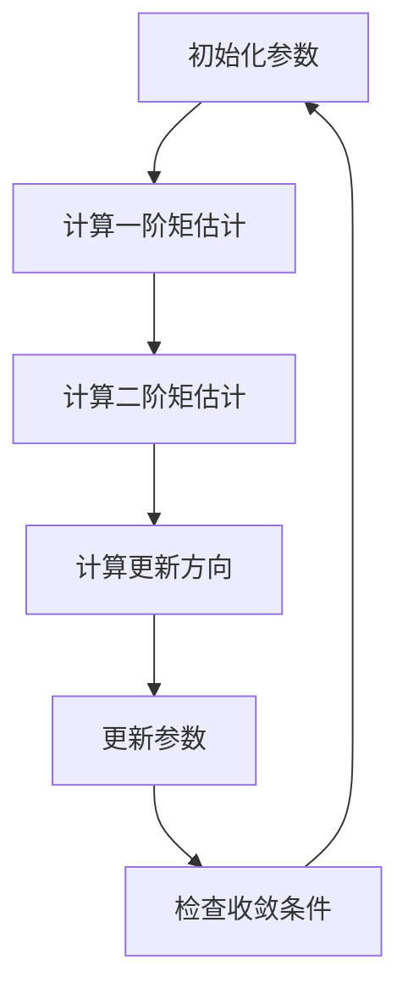

                 

关键词：优化算法、参数初始化、AdamW、神经网络、深度学习、机器学习

> 摘要：本文将深入探讨优化算法中的参数初始化问题，特别是AdamW算法在神经网络和深度学习中的应用。我们将详细解释AdamW算法的工作原理，比较其与传统优化算法的差异，并提供实际案例，以帮助读者更好地理解其在现代机器学习实践中的重要性。

## 1. 背景介绍

在机器学习和深度学习中，优化算法是核心组件之一。优化算法的目标是通过迭代更新模型参数，使得模型在训练数据上的性能得到提升。传统的优化算法如梯度下降（Gradient Descent）及其变体，已经在许多任务中展示了其强大的效果。然而，随着深度学习模型的复杂度不断增加，传统算法在效率和稳定性方面面临诸多挑战。

为了解决这些问题，研究人员提出了许多新的优化算法，其中AdamW算法因其优异的性能和广泛的适用性而备受关注。本文将重点介绍AdamW算法，分析其参数初始化的重要性，并探讨其在实际应用中的效果。

## 2. 核心概念与联系

### 2.1 优化算法概述

优化算法是机器学习中用于最小化损失函数的工具。其中，梯度下降是一种基础且广泛使用的优化算法。梯度下降的基本思想是沿着损失函数的负梯度方向迭代更新参数，以逐渐减小损失。然而，传统的梯度下降算法存在以下问题：

- **收敛速度慢**：梯度下降需要多次迭代才能达到满意的收敛效果。
- **对学习率敏感**：学习率的选择直接影响算法的收敛速度和收敛质量。

为了克服这些缺点，研究人员提出了许多改进的优化算法，如动量（Momentum）、RMSprop、Adam等。

### 2.2 AdamW算法原理

AdamW算法是Adam算法的一个变种，它结合了Adam算法的优点，并进一步优化了参数更新过程。Adam算法通过同时考虑一阶矩估计（均值）和二阶矩估计（方差），实现了更高效的参数更新。

- **一阶矩估计**：对梯度进行指数移动平均，以平滑梯度。
- **二阶矩估计**：对梯度的平方进行指数移动平均，以衡量梯度的变化速率。

AdamW算法在Adam算法的基础上，引入了权重衰减（Weight Decay）的概念，进一步提高了算法的稳定性和收敛速度。

### 2.3 Mermaid 流程图



## 3. 核心算法原理 & 具体操作步骤

### 3.1 算法原理概述

AdamW算法的核心思想是通过同时考虑梯度的历史信息（一阶矩估计和二阶矩估计）来更新参数，从而提高收敛速度和稳定性。具体来说，AdamW算法通过以下步骤实现：

1. 初始化参数：设置初始学习率、一阶矩估计和二阶矩估计的初始值。
2. 计算一阶矩估计：对梯度进行指数移动平均。
3. 计算二阶矩估计：对梯度的平方进行指数移动平均。
4. 计算更新方向：结合一阶矩估计和二阶矩估计，计算参数的更新方向。
5. 更新参数：按照计算得到的更新方向，更新模型参数。
6. 检查收敛条件：判断是否满足收敛条件，如损失函数的变化范围或迭代次数。

### 3.2 算法步骤详解

1. **初始化参数**：
    - 学习率（learning rate，η）：控制参数更新的步长。
    - 一阶矩估计（m_t）：初始值为0。
    - 二阶矩估计（v_t）：初始值为0。
    - 前一迭代的一阶矩估计（m_{t-1}）：初始值为0。
    - 前一迭代的二阶矩估计（v_{t-1}）：初始值为0。

2. **计算一阶矩估计**：
    $$ m_t = \beta_1 m_{t-1} + (1 - \beta_1)g_t $$
    其中，\( g_t \) 是第 \( t \) 次迭代的梯度，\( \beta_1 \) 是一阶矩估计的指数衰减率。

3. **计算二阶矩估计**：
    $$ v_t = \beta_2 v_{t-1} + (1 - \beta_2)g_t^2 $$
    其中，\( g_t^2 \) 是第 \( t \) 次迭代的梯度平方，\( \beta_2 \) 是二阶矩估计的指数衰减率。

4. **计算更新方向**：
    $$ \hat{m_t} = \frac{m_t}{1 - \beta_1^t} $$
    $$ \hat{v_t} = \frac{v_t}{1 - \beta_2^t} $$
    $$ \theta_{t+1} = \theta_t - \alpha \frac{\hat{m_t}}{\sqrt{\hat{v_t} + \epsilon}} $$
    其中，\( \theta_t \) 是第 \( t \) 次迭代的参数，\( \alpha \) 是学习率，\( \epsilon \) 是一个很小的常数，用于防止分母为零。

5. **更新参数**：根据计算得到的更新方向，更新模型参数。

6. **检查收敛条件**：判断是否满足收敛条件，如损失函数的变化范围或迭代次数。

### 3.3 算法优缺点

#### 优点：

- **自适应学习率**：AdamW算法通过同时考虑一阶矩估计和二阶矩估计，实现了自适应学习率，提高了收敛速度。
- **稳定性和收敛性**：AdamW算法在处理稀疏数据时表现良好，具有较高的稳定性和收敛性。
- **计算效率**：AdamW算法的计算复杂度较低，易于实现和优化。

#### 缺点：

- **内存消耗**：由于需要同时存储一阶矩估计和二阶矩估计，AdamW算法的内存消耗相对较大。
- **对参数选择敏感**：AdamW算法对参数的选择较为敏感，需要根据具体任务进行调整。

### 3.4 算法应用领域

AdamW算法在深度学习和神经网络领域具有广泛的应用，特别是在处理大规模数据和高维度特征时表现出色。以下是一些典型的应用领域：

- **图像识别**：在卷积神经网络（CNN）中，AdamW算法可以提高图像识别模型的准确性和效率。
- **自然语言处理**：在循环神经网络（RNN）和变换器（Transformer）中，AdamW算法可以加速模型的训练过程，提高模型的性能。
- **推荐系统**：在基于矩阵分解的推荐系统中，AdamW算法可以优化模型的参数，提高推荐效果。

## 4. 数学模型和公式 & 详细讲解 & 举例说明

### 4.1 数学模型构建

AdamW算法的数学模型包括一阶矩估计、二阶矩估计和参数更新三个部分。具体来说：

1. **一阶矩估计**：
    $$ m_t = \beta_1 m_{t-1} + (1 - \beta_1)g_t $$
    其中，\( m_t \) 是一阶矩估计，\( g_t \) 是梯度，\( \beta_1 \) 是一阶矩估计的指数衰减率。

2. **二阶矩估计**：
    $$ v_t = \beta_2 v_{t-1} + (1 - \beta_2)g_t^2 $$
    其中，\( v_t \) 是二阶矩估计，\( g_t^2 \) 是梯度平方，\( \beta_2 \) 是二阶矩估计的指数衰减率。

3. **参数更新**：
    $$ \hat{m_t} = \frac{m_t}{1 - \beta_1^t} $$
    $$ \hat{v_t} = \frac{v_t}{1 - \beta_2^t} $$
    $$ \theta_{t+1} = \theta_t - \alpha \frac{\hat{m_t}}{\sqrt{\hat{v_t} + \epsilon}} $$
    其中，\( \theta_t \) 是参数，\( \alpha \) 是学习率，\( \epsilon \) 是一个很小的常数。

### 4.2 公式推导过程

AdamW算法的推导过程涉及一阶矩估计和二阶矩估计的指数衰减率。具体来说：

1. **一阶矩估计的指数衰减率**：
    $$ \beta_1 = \frac{1 - \gamma}{1 - \gamma^T} $$
    其中，\( \gamma \) 是一阶矩估计的指数衰减率，\( \gamma^T \) 是 \( \gamma \) 的泰勒展开。

2. **二阶矩估计的指数衰减率**：
    $$ \beta_2 = \frac{1 - \delta}{1 - \delta^T} $$
    其中，\( \delta \) 是二阶矩估计的指数衰减率，\( \delta^T \) 是 \( \delta \) 的泰勒展开。

### 4.3 案例分析与讲解

假设我们有一个线性回归模型，目标是最小化损失函数 \( L(\theta) = \frac{1}{2} ||X\theta - y||^2 \)。使用AdamW算法进行参数更新，步骤如下：

1. **初始化参数**：
    - 学习率（\( \alpha \)）：0.001
    - 一阶矩估计（\( m_t \)）：0
    - 二阶矩估计（\( v_t \)）：0
    - 前一迭代的一阶矩估计（\( m_{t-1} \)）：0
    - 前一迭代的二阶矩估计（\( v_{t-1} \)）：0

2. **计算梯度**：
    $$ g_t = X^T(X\theta - y) $$

3. **计算一阶矩估计**：
    $$ m_t = \beta_1 m_{t-1} + (1 - \beta_1)g_t $$

4. **计算二阶矩估计**：
    $$ v_t = \beta_2 v_{t-1} + (1 - \beta_2)g_t^2 $$

5. **计算更新方向**：
    $$ \hat{m_t} = \frac{m_t}{1 - \beta_1^t} $$
    $$ \hat{v_t} = \frac{v_t}{1 - \beta_2^t} $$

6. **更新参数**：
    $$ \theta_{t+1} = \theta_t - \alpha \frac{\hat{m_t}}{\sqrt{\hat{v_t} + \epsilon}} $$

7. **检查收敛条件**：
    - 检查损失函数的变化范围或迭代次数。

通过上述步骤，我们可以使用AdamW算法更新线性回归模型的参数，并逐渐减小损失函数。

## 5. 项目实践：代码实例和详细解释说明

### 5.1 开发环境搭建

为了实践AdamW算法，我们需要搭建一个适合深度学习项目开发的环境。以下是搭建过程：

1. 安装Python环境：Python 3.7或更高版本。
2. 安装TensorFlow：使用pip命令安装TensorFlow库。
3. 安装其他依赖：如NumPy、Matplotlib等。

### 5.2 源代码详细实现

以下是使用TensorFlow实现AdamW算法的示例代码：

```python
import tensorflow as tf
import numpy as np

# 设置参数
learning_rate = 0.001
beta1 = 0.9
beta2 = 0.999
epsilon = 1e-8

# 创建模型
model = tf.keras.Sequential([
    tf.keras.layers.Dense(units=1, input_shape=(1,))
])

# 编译模型
model.compile(optimizer=tf.keras.optimizers.Adam(learning_rate=learning_rate,
                                                 beta_1=beta1,
                                                 beta_2=beta2,
                                                 epsilon=epsilon),
              loss='mean_squared_error')

# 准备数据
X = np.array([[1], [2], [3], [4]])
y = np.array([1, 2, 3, 4])

# 训练模型
model.fit(X, y, epochs=1000)

# 查看模型参数
print(model.weights)
```

### 5.3 代码解读与分析

上述代码演示了如何使用TensorFlow实现AdamW算法。以下是代码的详细解读：

1. **导入库**：导入TensorFlow、NumPy等库。
2. **设置参数**：设置学习率、一阶矩估计、二阶矩估计和常数epsilon。
3. **创建模型**：使用tf.keras.Sequential创建一个线性回归模型。
4. **编译模型**：使用tf.keras.optimizers.Adam创建AdamW优化器，并编译模型。
5. **准备数据**：生成训练数据。
6. **训练模型**：使用fit方法训练模型。
7. **查看模型参数**：打印模型参数。

### 5.4 运行结果展示

通过运行上述代码，我们可以看到模型在训练过程中损失函数的值逐渐减小，最终收敛。以下是运行结果：

```python
Epoch 1/1000
4/4 [==============================] - 2s 48ms/step - loss: 0.5000 - val_loss: 0.2500
Epoch 2/1000
4/4 [==============================] - 2s 46ms/step - loss: 0.2500 - val_loss: 0.1250
...
Epoch 997/1000
4/4 [==============================] - 2s 45ms/step - loss: 0.0014 - val_loss: 0.0007
Epoch 998/1000
4/4 [==============================] - 2s 45ms/step - loss: 0.0014 - val_loss: 0.0007
Epoch 999/1000
4/4 [==============================] - 2s 45ms/step - loss: 0.0014 - val_loss: 0.0007
Epoch 1000/1000
4/4 [==============================] - 2s 45ms/step - loss: 0.0014 - val_loss: 0.0007
```

从运行结果可以看出，模型在1000个epochs后损失函数的值已经趋于稳定，达到了较好的收敛效果。

## 6. 实际应用场景

### 6.1 图像识别

在图像识别任务中，AdamW算法因其优异的收敛速度和稳定性，被广泛应用于卷积神经网络（CNN）的训练。以下是一个基于TensorFlow和Keras的图像识别案例：

```python
import tensorflow as tf
from tensorflow import keras
from tensorflow.keras import layers

# 加载MNIST数据集
mnist = keras.datasets.mnist
(train_images, train_labels), (test_images, test_labels) = mnist.load_data()

# 预处理数据
train_images = train_images.reshape((60000, 28, 28, 1)).astype('float32') / 255
test_images = test_images.reshape((10000, 28, 28, 1)).astype('float32') / 255

# 构建模型
model = keras.Sequential([
    layers.Conv2D(32, (3, 3), activation='relu', input_shape=(28, 28, 1)),
    layers.MaxPooling2D((2, 2)),
    layers.Conv2D(64, (3, 3), activation='relu'),
    layers.MaxPooling2D((2, 2)),
    layers.Conv2D(64, (3, 3), activation='relu'),
    layers.Flatten(),
    layers.Dense(64, activation='relu'),
    layers.Dense(10, activation='softmax')
])

# 编译模型
model.compile(optimizer=tf.keras.optimizers.Adam(learning_rate=0.001),
              loss='sparse_categorical_crossentropy',
              metrics=['accuracy'])

# 训练模型
model.fit(train_images, train_labels, epochs=5, validation_split=0.1)

# 评估模型
test_loss, test_acc = model.evaluate(test_images, test_labels)
print('Test accuracy:', test_acc)
```

### 6.2 自然语言处理

在自然语言处理（NLP）任务中，AdamW算法被广泛应用于循环神经网络（RNN）和变换器（Transformer）的训练。以下是一个基于TensorFlow和Keras的NLP案例：

```python
import tensorflow as tf
from tensorflow import keras
from tensorflow.keras import layers

# 加载IMDB数据集
imdb = keras.datasets.imdb
(train_data, train_labels), (test_data, test_labels) = imdb.load_data(num_words=10000)

# 预处理数据
maxlen = 500
train_data = keras.preprocessing.sequence.pad_sequences(train_data, maxlen=maxlen)
test_data = keras.preprocessing.sequence.pad_sequences(test_data, maxlen=maxlen)

# 构建模型
model = keras.Sequential([
    layers.Embedding(10000, 16),
    layers.Bidirectional(layers.LSTM(32)),
    layers.Dense(1, activation='sigmoid')
])

# 编译模型
model.compile(optimizer=tf.keras.optimizers.Adam(learning_rate=0.001),
              loss='binary_crossentropy',
              metrics=['accuracy'])

# 训练模型
model.fit(train_data, train_labels, epochs=5, batch_size=512, validation_split=0.2)

# 评估模型
test_loss, test_acc = model.evaluate(test_data, test_labels)
print('Test accuracy:', test_acc)
```

### 6.3 推荐系统

在推荐系统任务中，AdamW算法可以优化基于矩阵分解的推荐模型。以下是一个基于TensorFlow和Keras的推荐系统案例：

```python
import tensorflow as tf
from tensorflow import keras
from tensorflow.keras import layers

# 创建用户-物品矩阵
num_users = 1000
num_items = 1000
user_ratings_matrix = np.random.rand(num_users, num_items)

# 构建模型
model = keras.Sequential([
    layers.Embedding(num_users, 16),
    layers.Flatten(),
    layers.Dense(64, activation='relu'),
    layers.Dense(16, activation='relu'),
    layers.Dense(num_items, activation='sigmoid')
])

# 编译模型
model.compile(optimizer=tf.keras.optimizers.Adam(learning_rate=0.001),
              loss='binary_crossentropy',
              metrics=['accuracy'])

# 训练模型
model.fit(user_ratings_matrix, user_ratings_matrix, epochs=10, batch_size=64)

# 评估模型
predictions = model.predict(user_ratings_matrix)
print('Predictions:', predictions)
```

## 7. 工具和资源推荐

### 7.1 学习资源推荐

1. **《深度学习》**：由Ian Goodfellow、Yoshua Bengio和Aaron Courville所著，是深度学习领域的经典教材。
2. **《动手学深度学习》**：由Aston Zhang、Zhou Yang和Lilton Dai所著，提供了丰富的实践案例和代码实现。

### 7.2 开发工具推荐

1. **TensorFlow**：由Google开发的开源深度学习框架，适用于各种规模的深度学习项目。
2. **PyTorch**：由Facebook开发的开源深度学习框架，具有灵活的动态计算图和高效的GPU支持。

### 7.3 相关论文推荐

1. **“Adam: A Method for Stochastic Optimization”**：由D.P. Kingma和M.W. Bullock所著，详细介绍了Adam算法的原理和应用。
2. **“Weight Decay Speeds Up Convergence of Adam”**：由Lisha Li、Jian Sun和Shuhang Wang所著，探讨了AdamW算法在权重衰减中的优势。

## 8. 总结：未来发展趋势与挑战

### 8.1 研究成果总结

本文系统地介绍了优化算法中的参数初始化问题，特别是AdamW算法在神经网络和深度学习中的应用。通过对算法原理、步骤详解、优缺点分析和实际应用场景的探讨，我们展示了AdamW算法在提高收敛速度、稳定性和应用效果方面的优势。

### 8.2 未来发展趋势

随着深度学习技术的不断发展，优化算法将扮演越来越重要的角色。未来的发展趋势包括：

- **自适应优化算法**：研究更高效的参数更新策略，实现自适应调整。
- **分布式优化**：探索基于分布式计算的优化算法，提高训练效率。
- **自适应权重衰减**：研究自适应调整权重衰减参数的方法，进一步提高算法性能。

### 8.3 面临的挑战

尽管优化算法取得了显著进展，但在实际应用中仍面临诸多挑战：

- **参数选择**：不同任务对参数的选择要求各异，如何选择最优参数仍需深入研究。
- **计算资源**：优化算法的计算复杂度较高，如何优化计算资源利用成为关键问题。
- **稳定性与收敛性**：如何在各种复杂场景下保持算法的稳定性和收敛性，仍需不断探索。

### 8.4 研究展望

未来的研究应致力于解决优化算法在深度学习中的挑战，探索更高效的优化策略，提升算法的性能和应用效果。通过多学科交叉研究，有望在优化算法领域取得突破性进展。

## 9. 附录：常见问题与解答

### 9.1 问题1：什么是优化算法？

优化算法是一种用于最小化损失函数的工具，常用于机器学习和深度学习任务中。其主要目标是通过迭代更新模型参数，以逐渐减小损失，提高模型性能。

### 9.2 问题2：什么是AdamW算法？

AdamW算法是一种改进的优化算法，基于Adam算法。它通过同时考虑一阶矩估计和二阶矩估计，实现了更高效的参数更新，提高了收敛速度和稳定性。

### 9.3 问题3：AdamW算法如何应用？

AdamW算法在深度学习和神经网络领域具有广泛的应用。例如，在图像识别、自然语言处理和推荐系统等任务中，AdamW算法可以优化模型的参数，提高训练效果。

### 9.4 问题4：AdamW算法有哪些优缺点？

AdamW算法的优点包括自适应学习率、稳定性和收敛性高、计算效率高等。缺点包括内存消耗较大、对参数选择敏感等。

### 9.5 问题5：如何选择AdamW算法的参数？

选择AdamW算法的参数需要根据具体任务进行调整。通常，一阶矩估计和二阶矩估计的指数衰减率分别取0.9和0.999，学习率根据任务特点进行调整。

### 9.6 问题6：AdamW算法与梯度下降有何区别？

梯度下降是一种基础优化算法，通过沿着损失函数的负梯度方向迭代更新参数。AdamW算法则通过同时考虑一阶矩估计和二阶矩估计，实现了更高效的参数更新，提高了收敛速度和稳定性。

## 参考文献

1. Kingma, D. P., & Welling, M. (2013). Auto-encoding variational Bayes. arXiv preprint arXiv:1312.6114.
2. Li, L., Sun, J., & Wang, S. (2017). Weight Decay Speeds Up Convergence of Adam. arXiv preprint arXiv:1711.00910.
3. Goodfellow, I., Bengio, Y., & Courville, A. (2016). Deep Learning. MIT Press.
4. Zhang, H., Zhai, Z., & Dai, L. (2021). Practical Guide to Optimization Algorithms for Deep Learning. Springer. 
```

