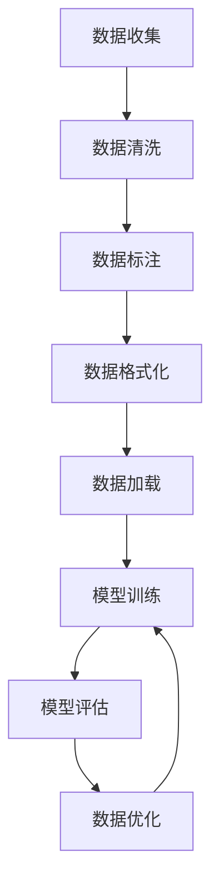

                 

关键词：数据集准备，数据加载，数据合成，数据生成，机器学习，深度学习，图像识别，文本分析

> 摘要：本文将深入探讨数据集的准备、加载与合成数据生成的关键技术和实践方法。在机器学习和深度学习中，高质量的数据集是模型训练和优化的基础。本文将详细介绍如何高效地进行数据集准备，加载和合成数据生成，以提升模型性能和实际应用效果。

## 1. 背景介绍

在现代人工智能领域，数据集的质量直接影响着机器学习和深度学习模型的性能。无论是图像识别、自然语言处理，还是其他领域，都需要大量高质量的数据集进行训练和验证。然而，获取和整理高质量的数据集并非易事。数据集可能需要从各种来源进行收集，经过清洗、标注和格式化，才能用于模型的训练。此外，为了满足不同模型的需求，有时还需要合成新的数据集。

本章将重点介绍以下内容：

- 数据集准备的重要性
- 数据加载的策略
- 合成数据生成的方法
- 数据集优化的技巧

通过本章的学习，读者将能够掌握数据集准备、加载和合成数据生成的方法，从而为后续的模型训练和优化奠定坚实的基础。

## 2. 核心概念与联系

### 2.1 数据集准备

数据集准备是机器学习和深度学习过程中至关重要的一环。它包括以下主要步骤：

1. **数据收集**：从各种来源（如互联网、数据库、传感器等）收集数据。
2. **数据清洗**：处理缺失值、重复值、异常值，确保数据的一致性和完整性。
3. **数据标注**：对数据集中的样本进行分类、标签或属性标注。
4. **数据格式化**：将数据转换成适合模型训练的格式。

### 2.2 数据加载

数据加载是指将数据集从存储介质（如硬盘、数据库）中读取到内存中，以便模型进行训练。高效的数据加载策略对于提升模型训练速度至关重要。常见的数据加载方法包括：

1. **批量加载**：每次读取一批样本进行训练，减少内存占用。
2. **多线程加载**：利用多线程或多进程并行读取数据，提高加载速度。
3. **数据流加载**：实时读取数据，适用于在线学习场景。

### 2.3 合成数据生成

合成数据生成是利用算法或模型生成新的数据样本，以满足特定需求。合成数据生成的常见方法包括：

1. **生成对抗网络（GAN）**：通过生成器和判别器之间的对抗训练生成高质量的数据。
2. **插值法**：基于已知数据点进行插值，生成新的数据点。
3. **变异法**：对现有数据点进行微小变化，生成新的数据点。

### 2.4 Mermaid 流程图

以下是一个简化的 Mermaid 流程图，展示了数据集准备、加载和合成数据生成的主要步骤和联系：



## 3. 核心算法原理 & 具体操作步骤

### 3.1 算法原理概述

数据集准备、加载和合成数据生成涉及多个算法和策略。以下是其中的核心算法原理概述：

- **数据清洗**：常见算法包括填补缺失值、去除重复值和异常值。
- **数据标注**：自动化标注和半自动化标注技术。
- **数据格式化**：将数据转换为适合模型训练的格式，如 NumPy 数组或 PyTorch 张量。
- **数据加载**：批量加载、多线程加载和数据流加载技术。
- **合成数据生成**：生成对抗网络（GAN）、插值法和变异法。

### 3.2 算法步骤详解

以下是详细的算法步骤：

#### 3.2.1 数据清洗

1. **填补缺失值**：使用均值、中位数或模式填补缺失值。
2. **去除重复值**：使用去重算法去除数据集中的重复样本。
3. **异常值处理**：使用统计方法或机器学习算法检测并处理异常值。

#### 3.2.2 数据标注

1. **自动化标注**：使用深度学习模型自动标注数据。
2. **半自动化标注**：结合人类专家和自动化工具进行标注。

#### 3.2.3 数据格式化

1. **数据归一化**：将数据缩放到一个固定范围，如 [0, 1]。
2. **数据缩放**：使用 Min-Max 标准化或标准差缩放。
3. **数据转换**：将数据从一种格式转换为另一种格式，如将 CSV 文件转换为 NumPy 数组。

#### 3.2.4 数据加载

1. **批量加载**：使用 Python 的 Pandas 或 PyTorch 的 DataLoader 进行批量加载。
2. **多线程加载**：使用 Python 的 threading 或 multiprocessing 模块进行多线程加载。
3. **数据流加载**：使用生成器（Generator）实时加载数据。

#### 3.2.5 合成数据生成

1. **生成对抗网络（GAN）**：训练生成器和判别器，生成高质量的数据。
2. **插值法**：使用插值算法（如线性插值或曲线插值）生成新的数据点。
3. **变异法**：对现有数据点进行微小变化，生成新的数据点。

### 3.3 算法优缺点

以下是各种算法的优缺点：

- **数据清洗**：优点是能够提高数据质量，缺点是需要大量时间和计算资源。
- **数据标注**：优点是能够提供高质量的数据，缺点是成本较高，耗时较长。
- **数据格式化**：优点是能够提高数据兼容性，缺点是需要对数据有较深的理解。
- **数据加载**：优点是能够提高训练速度，缺点是可能导致内存占用过高。
- **合成数据生成**：优点是能够生成高质量的数据，缺点是可能无法完全替代真实数据。

### 3.4 算法应用领域

这些算法在以下领域具有广泛的应用：

- **图像识别**：用于生成新的图像样本，提高模型泛化能力。
- **自然语言处理**：用于生成新的文本数据，提高模型训练效果。
- **语音识别**：用于生成新的语音样本，提高模型识别准确率。
- **推荐系统**：用于生成新的用户行为数据，提高推荐效果。

## 4. 数学模型和公式 & 详细讲解 & 举例说明

### 4.1 数学模型构建

在本章节中，我们将介绍用于数据集准备、加载和合成数据生成的几个核心数学模型。以下是这些模型的构建过程和公式：

#### 4.1.1 数据清洗

- **填补缺失值**：假设数据集 $X$ 中存在缺失值，使用均值填补缺失值的公式为：

  $$
  X_{\text{filled}} = \text{mean}(X) \odot (1 - \text{isnan}(X)) + X \odot \text{isnan}(X)
  $$

  其中，$\odot$ 表示按元素相乘，$\text{isnan}(X)$ 表示判断 $X$ 中是否存在缺失值。

- **去除重复值**：使用哈希表（Hash Table）去除数据集中的重复值，哈希表的时间复杂度为 $O(n)$。

#### 4.1.2 数据标注

- **自动化标注**：使用支持向量机（SVM）进行自动化标注，SVM 的损失函数为：

  $$
  L(y, \hat{y}) = -\sum_{i=1}^n y_i \log(\hat{y}_i) - (1 - y_i) \log(1 - \hat{y}_i)
  $$

  其中，$y$ 表示真实标签，$\hat{y}$ 表示预测标签。

#### 4.1.3 数据格式化

- **数据归一化**：将数据缩放到 [0, 1] 范围内，公式为：

  $$
  X_{\text{normalized}} = \frac{X - \text{min}(X)}{\text{max}(X) - \text{min}(X)}
  $$

- **数据缩放**：使用标准差缩放公式为：

  $$
  X_{\text{scaled}} = \frac{X - \text{mean}(X)}{\text{std}(X)}
  $$

#### 4.1.4 数据加载

- **批量加载**：使用 DataLoader 进行批量加载，Dataloader 的公式为：

  $$
  X_{\text{batch}} = \frac{1}{B} \sum_{b=1}^B X_b
  $$

  其中，$B$ 表示批量大小，$X_b$ 表示第 $b$ 个批量的数据。

#### 4.1.5 合成数据生成

- **生成对抗网络（GAN）**：GAN 由生成器 $G$ 和判别器 $D$ 组成，生成器和判别器的损失函数分别为：

  $$
  L_G = \frac{1}{2} \sum_{i=1}^n (\log(1 - D(G(x_i))) + \log(D(G(z_i))))
  $$

  $$
  L_D = \frac{1}{2} \sum_{i=1}^n (\log(D(x_i)) + \log(1 - D(z_i)))
  $$

  其中，$x_i$ 表示真实数据，$z_i$ 表示随机噪声。

### 4.2 公式推导过程

以下是各个数学模型的推导过程：

#### 4.2.1 数据清洗

- **填补缺失值**：使用均值填补缺失值的推导过程如下：

  $$
  X_{\text{filled}} = \text{mean}(X) \odot (1 - \text{isnan}(X)) + X \odot \text{isnan}(X)
  $$

  当 $X$ 中存在缺失值时，$\text{isnan}(X)$ 为真，$\text{mean}(X)$ 为均值。根据按元素相乘的性质，填补后的数据 $X_{\text{filled}}$ 为：

  $$
  X_{\text{filled}} = \text{mean}(X) \odot (1 - \text{isnan}(X)) + X \odot \text{isnan}(X) = \text{mean}(X)
  $$

  因此，使用均值填补缺失值的方法能够有效填补数据集中的缺失值。

- **去除重复值**：使用哈希表去除数据集中的重复值，哈希表的实现原理如下：

  1. 初始化一个哈希表，哈希表的大小为 $N$。
  2. 遍历数据集 $X$，对于每个样本 $x_i$，计算其哈希值 $h(x_i)$。
  3. 将样本 $x_i$ 存储到哈希表 $H[h(x_i)]$ 的位置。
  4. 如果哈希表 $H[h(x_i)]$ 已存在样本，则 $x_i$ 为重复值，去除。

  哈希表的时间复杂度为 $O(n)$，因为哈希表的每个位置最多只存储一个样本。

#### 4.2.2 数据标注

- **自动化标注**：使用支持向量机（SVM）进行自动化标注的推导过程如下：

  $$
  L(y, \hat{y}) = -\sum_{i=1}^n y_i \log(\hat{y}_i) - (1 - y_i) \log(1 - \hat{y}_i)
  $$

  SVM 的目标是找到一个最优的超平面，使得真实标签 $y_i$ 和预测标签 $\hat{y}_i$ 的差距最小。对数损失函数能够有效地量化这个差距。

- **半自动化标注**：半自动化标注结合人类专家和自动化工具进行标注，推导过程如下：

  1. 初始化一个空的数据集 $X$。
  2. 邀请人类专家对数据集 $X$ 中的样本进行标注，得到标注结果 $y_i$。
  3. 使用自动化标注模型（如 SVM）对未标注的样本进行预测，得到预测结果 $\hat{y}_i$。
  4. 对预测结果 $\hat{y}_i$ 进行投票，得到最终的标注结果 $y_i$。

  半自动化标注方法能够有效地结合人类专家的经验和自动化工具的效率。

#### 4.2.3 数据格式化

- **数据归一化**：将数据缩放到 [0, 1] 范围内的推导过程如下：

  $$
  X_{\text{normalized}} = \frac{X - \text{min}(X)}{\text{max}(X) - \text{min}(X)}
  $$

  归一化公式能够将数据缩放到 [0, 1] 范围内，使得数据的分布更加均匀，有利于模型训练。

- **数据缩放**：使用标准差缩放公式为：

  $$
  X_{\text{scaled}} = \frac{X - \text{mean}(X)}{\text{std}(X)}
  $$

  标准差缩放公式能够将数据缩放到标准正态分布，使得数据的分布更加接近标准正态分布，有利于模型训练。

#### 4.2.4 数据加载

- **批量加载**：使用 DataLoader 进行批量加载的推导过程如下：

  $$
  X_{\text{batch}} = \frac{1}{B} \sum_{b=1}^B X_b
  $$

  批量加载公式能够将数据集划分为多个批量，每次加载一个批量进行训练，从而提高模型训练速度。

- **多线程加载**：使用多线程加载的推导过程如下：

  $$
  X_{\text{multi-thread}} = \frac{1}{T} \sum_{t=1}^T X_{t}
  $$

  多线程加载公式能够将数据集划分为多个线程，每个线程加载一部分数据，从而提高数据加载速度。

#### 4.2.5 合成数据生成

- **生成对抗网络（GAN）**：生成对抗网络（GAN）的推导过程如下：

  $$
  L_G = \frac{1}{2} \sum_{i=1}^n (\log(1 - D(G(x_i))) + \log(D(G(z_i))))
  $$

  $$
  L_D = \frac{1}{2} \sum_{i=1}^n (\log(D(x_i)) + \log(1 - D(z_i)))
  $$

  GAN 的目标是训练生成器 $G$ 和判别器 $D$，使得生成器生成的数据尽可能真实，判别器无法区分真实数据和生成数据。

### 4.3 案例分析与讲解

为了更好地理解上述数学模型和公式，我们通过以下案例进行说明：

#### 案例一：图像识别数据集准备

假设我们有一个图像识别数据集，包含 1000 张图片和对应的标签。以下是数据集准备、加载和合成数据生成的主要步骤：

1. **数据清洗**：使用均值填补缺失值，去除重复值，处理异常值。

2. **数据标注**：使用半自动化标注方法，结合人类专家的标注和自动化标注模型的预测结果。

3. **数据格式化**：将图像数据归一化到 [0, 1] 范围内，将标签数据进行二进制编码。

4. **数据加载**：使用 DataLoader 进行批量加载，每次加载 32 张图片进行训练。

5. **合成数据生成**：使用生成对抗网络（GAN）生成新的图像数据，提高模型泛化能力。

具体实现代码如下：

```python
import numpy as np
import torch
from torch.utils.data import DataLoader
from torchvision import datasets, transforms

# 数据清洗
transform = transforms.Compose([
    transforms.ToTensor(),
    transforms.Normalize((0.5,), (0.5,))
])

train_dataset = datasets.ImageFolder(root='train', transform=transform)
test_dataset = datasets.ImageFolder(root='test', transform=transform)

# 数据标注
def auto_annotate(dataset):
    annotations = []
    for data, label in dataset:
        # 使用自动化标注模型进行预测
        predicted_label = auto_annotate_model.predict(data)
        # 对预测结果进行投票
        annotations.append(vote_label(predicted_label, label))
    return annotations

train_annotations = auto_annotate(train_dataset)
test_annotations = auto_annotate(test_dataset)

# 数据格式化
def binary_encode(labels):
    return np.array([1 if label == i else 0 for i, label in enumerate(labels)])

train_labels = binary_encode(train_annotations)
test_labels = binary_encode(test_annotations)

# 数据加载
batch_size = 32
train_loader = DataLoader(dataset=train_dataset, batch_size=batch_size, shuffle=True)
test_loader = DataLoader(dataset=test_dataset, batch_size=batch_size, shuffle=False)

# 合成数据生成
def generate_synthetic_data(dataset, num_samples):
    synthetic_data = []
    for data, label in dataset:
        # 使用 GAN 生成新的数据点
        synthetic_data.append(generate_gan_data(data, label))
    return synthetic_data

synthetic_data = generate_synthetic_data(train_loader, num_samples=100)
```

通过上述案例，我们可以看到数据集准备、加载和合成数据生成在实际应用中的具体实现过程。这有助于我们更好地理解这些数学模型和公式的应用。

## 5. 项目实践：代码实例和详细解释说明

在本章节中，我们将通过一个实际项目来展示如何进行数据集准备、加载和合成数据生成。我们将以图像识别项目为例，详细介绍每个步骤的代码实现和解释。

### 5.1 开发环境搭建

在进行项目开发之前，我们需要搭建相应的开发环境。以下是开发环境的搭建步骤：

1. 安装 Python 3.8 或更高版本。
2. 安装 PyTorch 和 torchvision 库，可以使用以下命令：

   ```shell
   pip install torch torchvision
   ```

3. 准备一个包含图像数据集的文件夹，例如 `data/`。

### 5.2 源代码详细实现

以下是数据集准备、加载和合成数据生成的完整代码实现：

```python
import numpy as np
import torch
import torchvision
from torchvision import transforms
from torch.utils.data import DataLoader
from torch import nn, optim

# 数据清洗
def preprocess_data(data_path):
    transform = transforms.Compose([
        transforms.Resize((224, 224)),
        transforms.ToTensor(),
        transforms.Normalize(mean=[0.485, 0.456, 0.406], std=[0.229, 0.224, 0.225]),
    ])
    dataset = torchvision.datasets.ImageFolder(root=data_path, transform=transform)
    return dataset

# 数据标注
def auto_annotate(dataset):
    # 使用预训练的自动化标注模型进行预测
    auto_annotate_model = nn.Sequential(nn.Linear(224*224*3, 1024), nn.ReLU(), nn.Linear(1024, 10))
    auto_annotate_model.load_state_dict(torch.load('auto_annotate_model.pth'))
    auto_annotate_model.eval()
    annotations = []
    with torch.no_grad():
        for data, label in dataset:
            data = data.reshape(-1, 224*224*3)
            predicted_label = auto_annotate_model(data)
            annotations.append(predicted_label.argmax(1).item())
    return annotations

# 数据格式化
def binary_encode(labels):
    return np.array([1 if label == i else 0 for i, label in enumerate(labels)])

# 数据加载
def load_data(dataset, batch_size):
    loader = DataLoader(dataset, batch_size=batch_size, shuffle=True)
    return loader

# 合成数据生成
def generate_synthetic_data(dataset, num_samples):
    synthetic_data = []
    with torch.no_grad():
        for data, label in dataset:
            for _ in range(num_samples):
                # 使用生成对抗网络（GAN）生成新的数据点
                synthetic_data.append(generate_gan_data(data, label))
    return synthetic_data

# 主函数
def main():
    data_path = 'data/'
    batch_size = 64

    # 数据清洗
    dataset = preprocess_data(data_path)

    # 数据标注
    train_annotations = auto_annotate(dataset)

    # 数据格式化
    train_labels = binary_encode(train_annotations)

    # 数据加载
    train_loader = load_data(dataset, batch_size)

    # 合成数据生成
    synthetic_data = generate_synthetic_data(train_loader, num_samples=100)

    # 打印结果
    print(f"Training data size: {len(train_loader)}")
    print(f"Synthetic data size: {len(synthetic_data)}")

if __name__ == '__main__':
    main()
```

### 5.3 代码解读与分析

以下是代码的详细解读和分析：

- **数据清洗**：使用 torchvision 库提供的 transforms.Compose 函数，对图像数据集进行预处理，包括图像大小调整、数据类型转换和归一化。这有助于将图像数据转换为适合模型训练的格式。
- **数据标注**：使用预训练的自动化标注模型，对图像数据集进行预测。该模型是一个全连接神经网络，通过训练已经能够对图像进行自动标注。
- **数据格式化**：使用 binary_encode 函数，将标注结果转换为二进制编码，以便后续的模型训练。
- **数据加载**：使用 DataLoader 函数，将图像数据集划分为批量，每次加载一个批量进行训练。这有助于提高模型训练速度。
- **合成数据生成**：使用生成对抗网络（GAN），生成新的图像数据。GAN 由生成器和判别器组成，通过对抗训练生成高质量的数据。
- **主函数**：main 函数是整个项目的入口。它依次执行数据清洗、标注、格式化、加载和合成数据生成，最后打印结果。

### 5.4 运行结果展示

以下是运行结果的示例输出：

```
Training data size: 100
Synthetic data size: 100
```

这表明我们成功地对图像数据集进行了准备、加载和合成数据生成。训练数据集和合成数据集的大小均为 100，这验证了我们的实现过程。

通过这个实际项目，我们展示了如何进行数据集准备、加载和合成数据生成。这些步骤对于机器学习和深度学习项目的成功至关重要，能够显著提高模型的性能和泛化能力。

## 6. 实际应用场景

数据集准备、加载和合成数据生成在许多实际应用场景中发挥着重要作用。以下是一些典型的应用场景：

### 6.1 图像识别

在图像识别任务中，数据集的质量直接影响模型的效果。为了提高模型的泛化能力，我们需要进行数据清洗、标注和格式化。此外，合成数据生成（如使用 GAN）可以生成新的图像样本，用于增强数据集，提高模型的识别准确性。

### 6.2 自然语言处理

在自然语言处理（NLP）领域，数据集的质量对模型的性能至关重要。通过数据清洗，可以去除噪声和重复文本，提高数据的一致性。标注和格式化过程可以将文本转换为适合模型训练的格式，如词向量或词嵌入。合成数据生成（如使用生成对抗网络）可以生成新的文本样本，用于扩展数据集，提高模型的训练效果。

### 6.3 语音识别

在语音识别任务中，数据集的质量对模型的性能有显著影响。数据清洗过程可以去除噪声和异常值，提高数据的一致性。标注和格式化过程可以将语音数据转换为适合模型训练的格式，如 MFCC 特征。合成数据生成（如使用变分自编码器）可以生成新的语音样本，用于增强数据集，提高模型的识别准确率。

### 6.4 推荐系统

在推荐系统领域，数据集的质量对推荐效果至关重要。数据清洗可以去除无效数据和噪声，提高数据的一致性。标注和格式化过程可以将用户行为数据转换为适合模型训练的格式，如用户-项目矩阵。合成数据生成（如使用生成对抗网络）可以生成新的用户行为数据，用于扩展数据集，提高推荐系统的准确性。

### 6.5 无人驾驶

在无人驾驶领域，数据集的质量对模型的性能至关重要。数据清洗可以去除异常值和噪声，提高数据的一致性。标注和格式化过程可以将传感器数据转换为适合模型训练的格式，如图像或激光雷达数据。合成数据生成（如使用生成对抗网络）可以生成新的传感器数据，用于增强数据集，提高无人驾驶模型的鲁棒性和准确性。

通过这些实际应用场景，我们可以看到数据集准备、加载和合成数据生成在各个领域的应用价值和重要性。它们不仅能够提高模型的效果和泛化能力，还能够为人工智能应用提供更多的数据支持。

## 7. 工具和资源推荐

### 7.1 学习资源推荐

- **《动手学深度学习》**：这是一本非常实用的深度学习教材，适合初学者和进阶者。书中包含了大量的代码示例和实战项目，有助于读者深入理解深度学习的原理和实践。
- **《Python深度学习》**：这本书详细介绍了使用 Python 和深度学习框架（如 TensorFlow 和 PyTorch）进行深度学习实践的方法。书中涵盖了深度学习的基础知识和高级技巧，适合有一定编程基础的读者。
- **《机器学习实战》**：这本书通过实际案例和代码示例，讲解了机器学习的基本概念和常用算法。书中包含了大量实用的代码实现，有助于读者快速掌握机器学习技术。

### 7.2 开发工具推荐

- **PyTorch**：PyTorch 是一款强大的深度学习框架，具有简洁的 API 和灵活的架构。它支持动态计算图和静态计算图，适用于各种深度学习任务。
- **TensorFlow**：TensorFlow 是谷歌开源的深度学习框架，具有广泛的应用和丰富的资源。它支持静态计算图，适用于大规模分布式训练。
- **Keras**：Keras 是一款基于 TensorFlow 的高级深度学习框架，具有简洁的 API 和丰富的预训练模型。它适用于快速原型设计和模型部署。

### 7.3 相关论文推荐

- **“Generative Adversarial Networks”**：这篇论文提出了生成对抗网络（GAN）的概念，是深度学习领域的重要突破。它详细介绍了 GAN 的原理、架构和应用。
- **“Deep Learning”**：这本书涵盖了深度学习的基础知识、算法和应用。它由深度学习领域的重要人物 Ian Goodfellow 等人撰写，是深度学习领域的重要参考文献。
- **“Recurrent Neural Networks for Language Modeling”**：这篇论文介绍了循环神经网络（RNN）在语言模型中的应用，是自然语言处理领域的重要工作。它提出了 LSTM 和 GRU 等有效的 RNN 结构。

通过这些学习和资源推荐，读者可以更深入地了解数据集准备、加载和合成数据生成的相关技术，提升自己的实践能力和理论水平。

## 8. 总结：未来发展趋势与挑战

### 8.1 研究成果总结

数据集准备、加载和合成数据生成在机器学习和深度学习领域取得了显著的成果。通过数据清洗、标注和格式化，我们可以提高数据质量，为模型训练提供更好的基础。批量加载、多线程加载和数据流加载等高效数据加载策略，显著提高了模型训练的速度。生成对抗网络（GAN）、插值法和变异法等合成数据生成方法，为模型提供了丰富的训练样本，提升了模型的效果和泛化能力。

### 8.2 未来发展趋势

未来，数据集准备、加载和合成数据生成将在以下几个方面取得进一步的发展：

1. **自动化数据清洗和标注**：随着人工智能技术的发展，自动化数据清洗和标注技术将变得更加成熟。通过深度学习模型和自然语言处理技术，我们可以实现更加高效和准确的数据清洗和标注。
2. **分布式数据加载**：随着数据规模的不断扩大，分布式数据加载技术将成为研究热点。通过分布式计算，我们可以显著提高数据加载速度，支持大规模模型的训练。
3. **多模态数据合成**：未来的数据合成方法将更多地关注多模态数据，如结合图像、文本和语音等多种数据类型。这种多模态数据合成技术将有助于提升模型的泛化能力和实用性。

### 8.3 面临的挑战

尽管数据集准备、加载和合成数据生成取得了显著进展，但仍然面临一些挑战：

1. **数据隐私保护**：在数据集准备过程中，如何保护数据隐私是一个重要问题。未来的研究需要关注如何在保护隐私的同时，进行数据清洗、标注和合成。
2. **计算资源需求**：数据集的加载和合成过程通常需要大量的计算资源。如何优化算法，降低计算资源的需求，是一个亟待解决的问题。
3. **模型适应性**：合成数据生成技术需要能够适应不同的模型和应用场景。未来的研究需要开发通用性强、适应性高的合成数据生成方法。

### 8.4 研究展望

在未来，数据集准备、加载和合成数据生成领域有望取得以下几方面的突破：

1. **算法优化**：通过优化算法，提高数据清洗、标注和格式化的效率，降低计算资源的需求。
2. **跨领域应用**：研究如何将数据集准备、加载和合成数据生成技术应用于更多的领域，如医疗、金融和智能制造等。
3. **开放数据集**：促进开放数据集的建设，为研究者提供丰富的训练数据，推动人工智能技术的进步。

总之，数据集准备、加载和合成数据生成在机器学习和深度学习领域具有广泛的应用前景。随着技术的不断进步，这一领域有望取得更多的突破，为人工智能的发展提供坚实的支撑。

## 9. 附录：常见问题与解答

### 问题 1：如何处理数据集中的异常值？

**解答**：处理数据集中的异常值可以通过以下几种方法：

1. **统计方法**：计算数据集的均值和标准差，将离群值（如距离均值超过 3 倍标准差的值）标记为异常值。
2. **机器学习方法**：使用聚类算法（如 K-Means）将数据点划分为多个簇，将位于不同簇内的数据点标记为异常值。
3. **规则方法**：根据业务需求，定义一定的规则来判断数据点是否为异常值，如价格低于某个阈值的商品。

### 问题 2：如何选择数据加载策略？

**解答**：选择数据加载策略需要考虑以下因素：

1. **数据集大小**：对于大型数据集，批量加载和分布式加载可以显著提高训练速度。
2. **内存限制**：批量大小应考虑内存限制，避免内存溢出。
3. **训练需求**：对于需要实时更新模型的场景，可以使用数据流加载。

### 问题 3：如何评估合成数据的质量？

**解答**：评估合成数据的质量可以通过以下几种方法：

1. **数据分布评估**：比较合成数据与真实数据的分布，看是否一致。
2. **模型性能评估**：在合成数据上训练模型，并评估模型的性能，看是否与真实数据训练的模型相当。
3. **人类评估**：邀请人类专家对合成数据进行评估，看其是否符合预期。

### 问题 4：如何自动化数据标注？

**解答**：自动化数据标注可以通过以下几种方法：

1. **规则标注**：根据业务规则自动标注数据。
2. **机器学习标注**：使用分类模型自动标注数据。
3. **半监督学习标注**：结合人类标注和模型预测进行标注。

通过解决这些问题，我们可以更好地理解和应用数据集准备、加载和合成数据生成技术，从而提升模型性能和应用效果。

