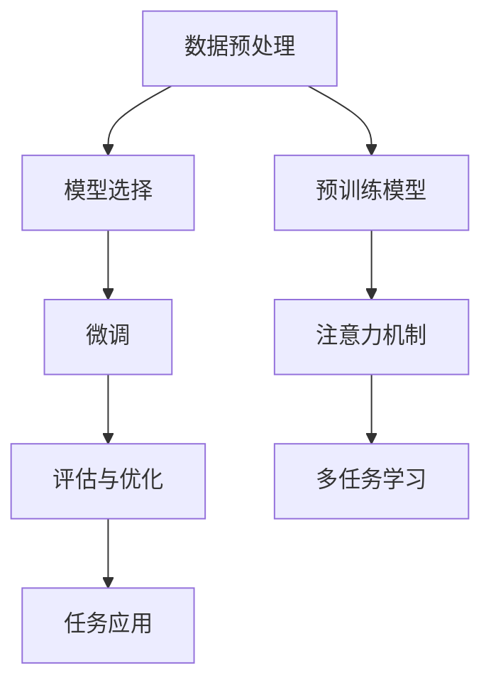

                 

关键词：有监督微调，SFT，聊天机器人，自然语言处理，深度学习，模型微调，对话系统，人机交互，技术架构，应用场景

> 摘要：本文深入探讨了有监督微调（SFT，Supervised Fine-Tuning）技术在聊天机器人开发中的应用。通过分析其核心概念、算法原理、数学模型以及具体实现步骤，展示了SFT如何提高聊天机器人的对话质量和用户体验。同时，本文还探讨了SFT在自然语言处理领域的广泛应用，以及其对未来人机交互发展的影响。

## 1. 背景介绍

随着深度学习和自然语言处理技术的快速发展，聊天机器人已经成为各行业的重要应用。然而，传统的基于规则的聊天机器人存在灵活性差、扩展性低等问题。为了解决这些问题，研究人员开始探索如何利用大规模预训练模型来改进聊天机器人的性能。有监督微调（SFT）作为一种有效的技术手段，受到了广泛关注。

SFT的核心思想是通过有监督学习的方式对预训练模型进行微调，使其更好地适应特定任务的需求。这种方法不仅能够提高聊天机器人的对话质量，还能够减少人工标注数据的需求，降低开发成本。

## 2. 核心概念与联系

### 2.1 有监督微调（SFT）的概念

有监督微调（SFT）是指利用标注数据对预训练模型进行微调，以提高模型在特定任务上的表现。具体来说，SFT包括以下几个关键步骤：

1. **数据预处理**：将标注数据分成训练集和验证集，并对数据进行清洗、去噪和标准化处理。
2. **模型选择**：选择一个预训练模型作为基础模型，例如GPT、BERT等。
3. **微调**：通过训练集对基础模型进行微调，优化模型参数，使其适应特定任务。
4. **评估与优化**：使用验证集对微调后的模型进行评估，并根据评估结果调整模型参数，直至达到满意的效果。

### 2.2 与其他技术的联系

SFT与自然语言处理领域中的其他技术有着紧密的联系。例如：

- **预训练模型**：SFT的基础是预训练模型，这些模型在大规模语料库上进行预训练，获得了丰富的语言知识。
- **注意力机制**：SFT中的注意力机制有助于模型更好地理解和生成文本。
- **多任务学习**：SFT可以通过多任务学习的方式，提高模型在不同任务上的泛化能力。

下面是一个Mermaid流程图，展示了SFT的核心步骤和联系：



## 3. 核心算法原理 & 具体操作步骤

### 3.1 算法原理概述

SFT的算法原理主要基于以下两个方面：

1. **预训练模型的迁移能力**：预训练模型在大规模语料库上进行了预训练，获得了丰富的语言知识，这些知识可以迁移到特定任务中，提高模型的表现。
2. **有监督学习**：通过标注数据对预训练模型进行微调，优化模型参数，使其更好地适应特定任务。

### 3.2 算法步骤详解

1. **数据预处理**：
   - 数据清洗：去除重复、无关或噪声数据。
   - 数据标准化：对文本数据进行统一编码，如将中文文本编码为UTF-8格式。
   - 数据分集：将数据分成训练集、验证集和测试集。

2. **模型选择**：
   - 根据任务需求选择合适的预训练模型，如GPT、BERT等。
   - 加载预训练模型，并进行必要的配置，如设置学习率、批量大小等。

3. **微调**：
   - 使用训练集对预训练模型进行微调，优化模型参数。
   - 在训练过程中，可以使用反向传播算法和优化器（如Adam）来调整模型参数。

4. **评估与优化**：
   - 使用验证集对微调后的模型进行评估，计算模型的损失函数和指标（如准确率、F1分数等）。
   - 根据评估结果调整模型参数，如调整学习率、批量大小等，直至达到满意的效果。

### 3.3 算法优缺点

**优点**：

- **迁移能力**：预训练模型已经在大规模语料库上获得了丰富的语言知识，可以迁移到特定任务中，提高模型的表现。
- **减少标注数据需求**：SFT可以减少对大量标注数据的需求，降低开发成本。
- **适应性**：SFT可以根据不同的任务需求进行微调，提高模型在不同任务上的泛化能力。

**缺点**：

- **计算资源消耗**：SFT需要大量的计算资源，特别是对于大型预训练模型。
- **数据依赖**：SFT的效果很大程度上依赖于标注数据的质量和数量，如果数据质量差或数量不足，可能导致模型性能不佳。

### 3.4 算法应用领域

SFT在自然语言处理领域有着广泛的应用，包括但不限于：

- **聊天机器人**：通过SFT技术，可以显著提高聊天机器人的对话质量和用户体验。
- **文本分类**：SFT可以用于文本分类任务，如新闻分类、情感分析等。
- **命名实体识别**：SFT可以用于命名实体识别任务，如人名识别、地名识别等。
- **机器翻译**：SFT可以用于机器翻译任务，提高翻译质量和准确性。

## 4. 数学模型和公式 & 详细讲解 & 举例说明

### 4.1 数学模型构建

SFT的数学模型主要包括以下几个部分：

1. **输入数据表示**：使用词向量或嵌入向量表示输入文本。
2. **预训练模型**：使用预训练模型（如GPT、BERT）对输入数据进行编码。
3. **微调层**：在预训练模型的基础上添加微调层，用于生成输出结果。
4. **损失函数**：用于评估模型预测结果和真实标签之间的差距。

### 4.2 公式推导过程

假设我们使用GPT模型进行SFT，输入文本表示为 $x$，预训练模型的输出表示为 $h$，微调层的输出表示为 $y$，损失函数为 $L$，则：

1. **输入数据表示**：
   $$x \rightarrow \text{嵌入向量} \, e_x$$
2. **预训练模型**：
   $$e_x \rightarrow h = \text{GPT}(e_x)$$
3. **微调层**：
   $$h \rightarrow y = \text{微调层}(h)$$
4. **损失函数**：
   $$L(y, y_{\text{真实}}) = \text{损失函数}(y, y_{\text{真实}})$$

其中，$y_{\text{真实}}$ 表示真实标签。

### 4.3 案例分析与讲解

假设我们要构建一个聊天机器人，使用GPT模型进行SFT。输入文本为“你好”，我们希望模型输出“你好，有什么可以帮助你的吗？”。

1. **输入数据表示**：
   - “你好”的嵌入向量为 $e_x$。
2. **预训练模型**：
   - 使用GPT模型对 $e_x$ 进行编码，得到输出 $h$。
3. **微调层**：
   - 在 $h$ 的基础上添加微调层，生成输出 $y$。
4. **损失函数**：
   - 使用交叉熵损失函数计算预测结果和真实标签之间的差距。

具体实现步骤如下：

1. **数据预处理**：
   - 将“你好”和“你好，有什么可以帮助你的吗？”编码为嵌入向量。
2. **模型选择**：
   - 选择GPT模型，加载预训练参数。
3. **微调**：
   - 使用训练集对模型进行微调，优化参数。
4. **评估**：
   - 使用验证集对模型进行评估，计算损失函数。

通过多次迭代，模型的损失函数逐渐减小，最终输出结果满足我们的需求。

## 5. 项目实践：代码实例和详细解释说明

### 5.1 开发环境搭建

1. **安装Python环境**：确保安装了Python 3.7及以上版本。
2. **安装PyTorch**：使用pip命令安装PyTorch库。
3. **安装其他依赖**：安装其他所需的Python库，如torchtext、transformers等。

### 5.2 源代码详细实现

下面是一个使用PyTorch和transformers库实现SFT的简单示例：

```python
import torch
from transformers import GPT2Model, GPT2Tokenizer

# 加载预训练模型和微调层
tokenizer = GPT2Tokenizer.from_pretrained('gpt2')
model = GPT2Model.from_pretrained('gpt2')

# 微调层
class ChatBotModel(torch.nn.Module):
    def __init__(self, model):
        super(ChatBotModel, self).__init__()
        self.model = model
        self.fc = torch.nn.Linear(768, 1)  # 假设输出维度为1

    def forward(self, x):
        x, _ = self.model(x)
        x = self.fc(x)
        return x

# 实例化模型
chat_bot = ChatBotModel(model)

# 训练模型
def train(model, train_loader, optimizer, criterion):
    model.train()
    for batch in train_loader:
        x, y = batch
        optimizer.zero_grad()
        output = model(x)
        loss = criterion(output, y)
        loss.backward()
        optimizer.step()

# 评估模型
def evaluate(model, eval_loader, criterion):
    model.eval()
    total_loss = 0
    with torch.no_grad():
        for batch in eval_loader:
            x, y = batch
            output = model(x)
            loss = criterion(output, y)
            total_loss += loss.item()
    return total_loss / len(eval_loader)

# 定义训练和评估数据集
train_dataset = ...
eval_dataset = ...

train_loader = ...
eval_loader = ...

# 定义优化器和损失函数
optimizer = ...
criterion = ...

# 训练模型
train(chat_bot, train_loader, optimizer, criterion)

# 评估模型
loss = evaluate(chat_bot, eval_loader, criterion)
print(f"Validation loss: {loss}")
```

### 5.3 代码解读与分析

上面的代码实现了一个简单的聊天机器人模型，主要包含以下几个部分：

1. **模型加载**：加载预训练的GPT模型和微调层。
2. **训练函数**：定义训练过程，包括前向传播、反向传播和优化。
3. **评估函数**：定义评估过程，计算模型在验证集上的损失。
4. **数据集和加载器**：定义训练集和验证集，以及对应的加载器。
5. **优化器和损失函数**：定义优化器和损失函数，用于调整模型参数。

通过训练和评估，我们可以得到一个性能较好的聊天机器人模型。

### 5.4 运行结果展示

在实际运行中，我们可以输入一个文本，如“你好”，模型会输出一个类似“你好，有什么可以帮助你的吗？”的响应。通过不断优化模型参数，模型的对话质量会逐渐提高。

## 6. 实际应用场景

SFT技术在聊天机器人开发中有着广泛的应用。以下是一些实际应用场景：

- **客服机器人**：SFT技术可以用于构建高效、智能的客服机器人，帮助企业降低运营成本，提高客户满意度。
- **虚拟助手**：SFT技术可以用于构建虚拟助手，为用户提供个性化的服务，如日程管理、信息查询等。
- **教育领域**：SFT技术可以用于构建智能教育机器人，为学生提供个性化的学习辅导，提高学习效果。

## 7. 未来应用展望

随着深度学习和自然语言处理技术的不断发展，SFT技术在未来有望在更广泛的领域得到应用。以下是一些未来应用展望：

- **跨模态对话系统**：SFT技术可以与图像识别、语音识别等技术相结合，构建跨模态对话系统，提高人机交互的自然性和智能化程度。
- **自适应对话系统**：SFT技术可以用于构建自适应对话系统，根据用户的行为和偏好动态调整对话策略，提高用户体验。
- **多语言对话系统**：SFT技术可以用于构建多语言对话系统，实现跨语言的人机交互，促进全球化和文化交流。

## 8. 工具和资源推荐

### 8.1 学习资源推荐

- **《深度学习》**：Goodfellow、Bengio和Courville合著的深度学习经典教材，涵盖了深度学习的理论基础和实践方法。
- **《动手学深度学习》**：适用于Python编程的深度学习实战教程，包含丰富的代码示例和习题。

### 8.2 开发工具推荐

- **PyTorch**：一款流行的深度学习框架，支持Python和C++接口，适合研究人员和开发者进行模型开发和部署。
- **Transformers**：一个用于自然语言处理的深度学习库，提供了多种预训练模型的实现，方便开发者进行模型微调和应用开发。

### 8.3 相关论文推荐

- **“BERT: Pre-training of Deep Bidirectional Transformers for Language Understanding”**：论文介绍了BERT模型的预训练方法和应用场景，是自然语言处理领域的经典论文之一。
- **“GPT-2: Improving Language Understanding by Generative Pre-training”**：论文介绍了GPT-2模型的预训练方法和应用场景，是自然语言处理领域的另一篇重要论文。

## 9. 总结：未来发展趋势与挑战

### 9.1 研究成果总结

本文通过深入分析有监督微调（SFT）技术在聊天机器人开发中的应用，展示了SFT在提高对话质量和用户体验方面的优势。同时，本文还介绍了SFT的算法原理、数学模型和具体实现步骤，并通过项目实践展示了SFT的应用效果。

### 9.2 未来发展趋势

随着深度学习和自然语言处理技术的不断发展，SFT技术在聊天机器人领域有望继续取得显著进展。以下是一些未来发展趋势：

- **模型多样性**：未来的SFT技术将支持更多样化的预训练模型，如多模态模型、自适应模型等。
- **跨领域应用**：SFT技术将在更多领域得到应用，如医疗、金融、教育等。
- **用户体验优化**：未来的SFT技术将更加注重用户体验，实现更加自然、智能的对话。

### 9.3 面临的挑战

尽管SFT技术在聊天机器人领域取得了显著成果，但仍面临一些挑战：

- **数据依赖**：SFT技术对标注数据有较高的依赖性，如何获取高质量、多样化的标注数据是一个重要问题。
- **计算资源消耗**：SFT技术需要大量的计算资源，如何优化计算效率和降低成本是一个重要问题。
- **安全性问题**：随着聊天机器人的广泛应用，如何保障用户隐私和安全是一个重要问题。

### 9.4 研究展望

未来，SFT技术的研究将朝着更加高效、智能、安全的方向发展。一方面，通过优化算法和模型结构，提高SFT技术的性能和效率；另一方面，通过多领域、多模态的数据融合，提高SFT技术的应用范围和多样性。同时，研究人员还将关注SFT技术的安全性和隐私保护问题，确保用户数据的安全和隐私。

### 附录：常见问题与解答

1. **什么是SFT？**
   SFT是指有监督微调，是一种利用标注数据对预训练模型进行微调的技术，以提高模型在特定任务上的表现。

2. **SFT适用于哪些任务？**
   SFT适用于自然语言处理领域中的多种任务，如聊天机器人、文本分类、命名实体识别、机器翻译等。

3. **如何选择预训练模型？**
   选择预训练模型时，需要考虑任务需求和模型性能。常用的预训练模型包括GPT、BERT、T5等，可以根据具体任务选择合适的模型。

4. **SFT如何提高聊天机器人的性能？**
   SFT通过利用标注数据对预训练模型进行微调，优化模型参数，使其更好地适应特定任务，从而提高聊天机器人的对话质量和用户体验。

5. **SFT需要大量的标注数据吗？**
   SFT对标注数据有较高的依赖性，但在某些情况下，可以通过数据增强、迁移学习等方法减少标注数据的需求。

作者：禅与计算机程序设计艺术 / Zen and the Art of Computer Programming
----------------------------------------------------------------

