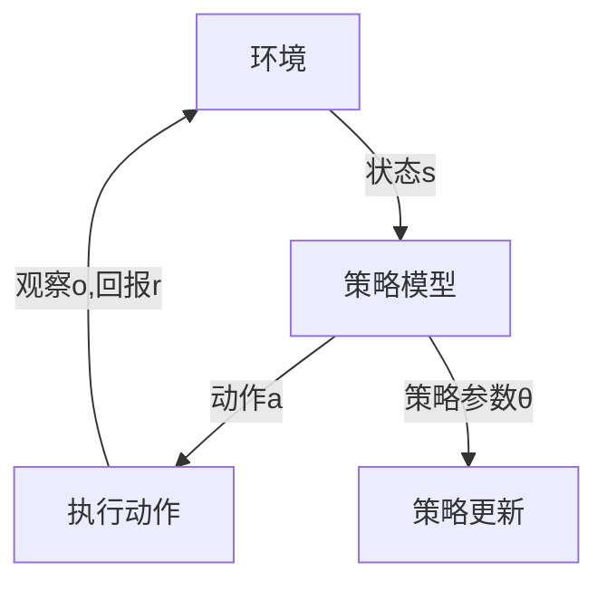

                 

### 1. 背景介绍

策略梯度（Policy Gradient）是一种在机器学习和深度学习中广泛应用的重要算法。它基于策略的优化思想，旨在通过更新策略参数来最大化预期回报。策略梯度算法在强化学习领域具有广泛的应用，例如游戏、自动驾驶、机器人控制等。

策略梯度算法的核心思想是直接对策略进行优化，而不是像价值迭代算法那样通过更新值函数来实现。策略梯度算法在训练过程中不需要预先估计环境状态的价值，而是直接根据策略生成的行为来调整策略参数，使得策略能够生成更加有利于增强预期回报的行为。

策略梯度算法相比于其他强化学习算法，具有以下几个优点：

1. **简单高效**：策略梯度算法不需要复杂的模型来估计环境状态的价值，只需要定义一个策略模型，并根据反馈来调整策略参数。
2. **灵活性高**：策略梯度算法可以应用于具有不同状态空间和动作空间的问题，适应性强。
3. **直观易懂**：策略梯度算法的思想简单直观，易于理解和实现。

本文将详细介绍策略梯度算法的基本原理、数学模型、具体实现步骤，并给出一个代码实例，帮助读者更好地理解和应用策略梯度算法。

### 2. 核心概念与联系

策略梯度算法涉及以下几个核心概念：

1. **策略（Policy）**：策略是一个映射函数，将环境状态映射为动作。策略梯度算法的目标是找到最优策略，使得策略能够生成最大化预期回报的行为。
2. **预期回报（Expected Return）**：预期回报是策略在某一状态下执行一系列动作后获得的平均回报。策略梯度算法通过最大化预期回报来优化策略。
3. **策略参数（Policy Parameters）**：策略参数是策略模型中的可调参数，用于描述策略的行为特征。策略梯度算法通过更新策略参数来优化策略。

下面是一个策略梯度算法的基本原理架构图：



在策略梯度算法中，策略模型通过策略参数θ来描述策略的行为特征。在每次状态s下，策略模型根据当前策略参数θ生成一个动作a。然后，环境根据动作a进行状态转换，并返回观察o和回报r。基于这些反馈信息，策略模型通过策略更新规则来调整策略参数θ，从而优化策略。

### 3. 核心算法原理 & 具体操作步骤

#### 3.1 算法原理概述

策略梯度算法的基本原理是通过最大化策略的预期回报来优化策略参数。具体来说，策略梯度算法利用梯度上升法来更新策略参数，使得策略能够生成最大化预期回报的行为。

假设我们有一个策略模型π(θ)，其中θ表示策略参数。在某一状态下s，策略模型根据当前策略参数θ生成一个动作a，即π(θ)(a|s)。执行动作a后，环境返回观察o和回报r。基于这些反馈信息，我们可以计算策略的预期回报：

$$
J(θ) = \sum_{s,a} π(θ)(a|s) \cdot r(s,a)
$$

其中，r(s,a)表示在状态s执行动作a获得的回报。为了优化策略参数θ，我们利用策略梯度来更新θ：

$$
θ \leftarrow θ + α \cdot \nabla_θ J(θ)
$$

其中，α表示学习率。通过不断迭代更新策略参数θ，策略梯度算法能够找到最优策略，使得策略能够生成最大化预期回报的行为。

#### 3.2 算法步骤详解

策略梯度算法的具体操作步骤如下：

1. **初始化策略参数θ**：初始化策略参数θ为随机值。
2. **执行动作**：根据当前策略参数θ，在状态s下生成一个动作a，即$a \sim π(θ)(a|s)$。
3. **收集反馈信息**：执行动作a后，环境返回观察o和回报r。
4. **计算策略梯度**：根据反馈信息，计算策略梯度$\nabla_θ J(θ)$。
5. **更新策略参数**：利用策略梯度更新策略参数θ，即$θ \leftarrow θ + α \cdot \nabla_θ J(θ)$。
6. **重复执行步骤2-5**：重复执行步骤2-5，直到策略参数θ收敛或达到最大迭代次数。

#### 3.3 算法优缺点

策略梯度算法具有以下几个优缺点：

1. **优点**：
   - **简单高效**：策略梯度算法不需要复杂的模型来估计环境状态的价值，只需要定义一个策略模型，并根据反馈来调整策略参数。
   - **灵活性高**：策略梯度算法可以应用于具有不同状态空间和动作空间的问题，适应性强。
   - **直观易懂**：策略梯度算法的思想简单直观，易于理解和实现。

2. **缺点**：
   - **收敛速度慢**：策略梯度算法的收敛速度相对较慢，需要大量的迭代次数才能收敛。
   - **对噪声敏感**：策略梯度算法对噪声较为敏感，容易受到噪声干扰而导致收敛不稳定。
   - **计算复杂度高**：在处理高维状态空间和动作空间的问题时，策略梯度算法的计算复杂度较高。

#### 3.4 算法应用领域

策略梯度算法在强化学习领域具有广泛的应用，尤其在以下领域：

1. **游戏**：策略梯度算法可以用于游戏中的智能体策略优化，例如围棋、象棋等。
2. **自动驾驶**：策略梯度算法可以用于自动驾驶车辆的路径规划与控制。
3. **机器人控制**：策略梯度算法可以用于机器人运动的规划与控制。
4. **金融交易**：策略梯度算法可以用于金融交易策略的优化，例如股票交易、期货交易等。

### 4. 数学模型和公式 & 详细讲解 & 举例说明

策略梯度算法的核心在于最大化策略的预期回报，因此需要构建相应的数学模型和公式。以下将详细讲解策略梯度算法的数学模型和公式，并给出一个具体的例子。

#### 4.1 数学模型构建

策略梯度算法的数学模型主要包括以下几个方面：

1. **策略模型**：策略模型π(θ)将状态s映射为动作a的概率分布，即π(θ)(a|s)表示在状态s下执行动作a的概率。
2. **回报函数**：回报函数r(s,a)表示在状态s下执行动作a所获得的回报。
3. **预期回报**：预期回报J(θ)表示策略π(θ)在状态s下执行一系列动作后获得的平均回报，计算公式为：

$$
J(θ) = \sum_{s,a} π(θ)(a|s) \cdot r(s,a)
$$

4. **策略梯度**：策略梯度∇θ J(θ)表示在策略参数θ处，预期回报J(θ)对θ的偏导数，计算公式为：

$$
\nabla_θ J(θ) = \sum_{s,a} π(θ)(a|s) \cdot \nabla_θ π(θ)(a|s) \cdot r(s,a)
$$

5. **策略更新**：策略更新公式为：

$$
θ \leftarrow θ + α \cdot \nabla_θ J(θ)
$$

其中，α表示学习率。

#### 4.2 公式推导过程

为了推导策略梯度算法的公式，我们首先回顾一下策略梯度的定义。策略梯度是指策略的预期回报J(θ)对策略参数θ的偏导数，即：

$$
\nabla_θ J(θ) = \frac{\partial J(θ)}{\partial θ}
$$

根据期望回报J(θ)的定义，我们有：

$$
J(θ) = \sum_{s,a} π(θ)(a|s) \cdot r(s,a)
$$

对J(θ)关于θ求偏导数，我们可以得到：

$$
\nabla_θ J(θ) = \sum_{s,a} \frac{\partial π(θ)(a|s)}{\partial θ} \cdot r(s,a)
$$

这里的关键是求π(θ)(a|s)关于θ的偏导数。由于π(θ)(a|s)是策略模型π(θ)在状态s下对动作a的概率分布，因此我们可以将其看作是关于θ的可微函数。根据概率分布函数的性质，我们可以得到：

$$
\frac{\partial π(θ)(a|s)}{\partial θ} = π(θ)(a|s) \cdot \frac{\partial θ}{\partial θ}
$$

由于θ是一个向量，其自导数为1，即$\frac{\partial θ}{\partial θ} = 1$。因此，我们有：

$$
\frac{\partial π(θ)(a|s)}{\partial θ} = π(θ)(a|s)
$$

将上式代入策略梯度的定义中，我们可以得到：

$$
\nabla_θ J(θ) = \sum_{s,a} π(θ)(a|s) \cdot r(s,a)
$$

这就是策略梯度算法的核心公式。

#### 4.3 案例分析与讲解

为了更好地理解策略梯度算法的公式，我们来看一个简单的例子。假设我们有一个简单的环境，状态空间为S={s1,s2,s3}，动作空间为A={a1,a2,a3}。策略模型π(θ)是一个线性策略模型，表示为：

$$
π(θ)(a|s) = \frac{1}{3} + \frac{2θ_s}{3}
$$

其中，θ_s是策略参数θ在状态s的分量。回报函数r(s,a)是一个随机变量，表示在状态s下执行动作a所获得的回报。为了简化计算，我们假设r(s,a)是一个服从均匀分布的随机变量，取值范围为[0,1]。

现在，我们需要利用策略梯度算法来优化策略参数θ。根据策略梯度算法的公式，我们需要计算策略梯度∇θ J(θ)。为了计算J(θ)，我们首先需要定义一个策略行为过程。假设我们开始于状态s1，然后根据当前策略π(θ)生成一系列动作序列。在这个例子中，我们选择一个简单的动作序列：s1 → a1 → s2 → a2 → s3 → a3。根据这个动作序列，我们可以计算预期回报J(θ)：

$$
J(θ) = π(θ)(a1|s1) \cdot r(s1,a1) + π(θ)(a2|s2) \cdot r(s2,a2) + π(θ)(a3|s3) \cdot r(s3,a3)
$$

将π(θ)(a|s)的表达式代入上式，我们可以得到：

$$
J(θ) = \left( \frac{1}{3} + \frac{2θ_{s1}}{3} \right) \cdot r(s1,a1) + \left( \frac{1}{3} + \frac{2θ_{s2}}{3} \right) \cdot r(s2,a2) + \left( \frac{1}{3} + \frac{2θ_{s3}}{3} \right) \cdot r(s3,a3)
$$

根据r(s,a)的假设，我们有：

$$
r(s1,a1) = r(s2,a2) = r(s3,a3) = \frac{1}{3}
$$

将上式代入J(θ)的表达式中，我们可以得到：

$$
J(θ) = \frac{1}{3} + \frac{2θ_{s1}}{3} + \frac{1}{3} + \frac{2θ_{s2}}{3} + \frac{1}{3} + \frac{2θ_{s3}}{3}
$$

$$
J(θ) = 1 + \frac{2}{3} (θ_{s1} + θ_{s2} + θ_{s3})
$$

为了计算策略梯度∇θ J(θ)，我们需要对J(θ)关于θ的每个分量求偏导数：

$$
\nabla_θ J(θ) = \frac{\partial J(θ)}{\partial θ_{s1}} + \frac{\partial J(θ)}{\partial θ_{s2}} + \frac{\partial J(θ)}{\partial θ_{s3}}
$$

将J(θ)的表达式代入上式，我们可以得到：

$$
\nabla_θ J(θ) = \frac{2}{3} + \frac{2}{3} + 0 = \frac{4}{3}
$$

由于θ是一个向量，其每个分量的偏导数都相等，因此策略梯度∇θ J(θ)可以表示为：

$$
\nabla_θ J(θ) = \frac{4}{3} \cdot \begin{bmatrix} 1 \\ 1 \\ 1 \end{bmatrix}
$$

根据策略梯度算法的更新公式，我们有：

$$
θ \leftarrow θ + α \cdot \nabla_θ J(θ)
$$

将策略梯度∇θ J(θ)代入上式，我们可以得到新的策略参数θ：

$$
θ \leftarrow θ + α \cdot \frac{4}{3} \cdot \begin{bmatrix} 1 \\ 1 \\ 1 \end{bmatrix}
$$

这个例子展示了如何利用策略梯度算法来优化策略参数。在实际应用中，我们通常需要处理更复杂的状态空间和动作空间，但基本原理是相同的。

### 5. 项目实践：代码实例和详细解释说明

为了更好地理解策略梯度算法，我们将通过一个简单的例子来实现策略梯度算法，并详细解释代码的各个部分。

#### 5.1 开发环境搭建

首先，我们需要搭建一个简单的开发环境。在这个例子中，我们将使用Python来实现策略梯度算法。确保你已经安装了Python和相关的库，如Numpy和Matplotlib。

你可以使用以下命令来安装Numpy和Matplotlib：

```bash
pip install numpy matplotlib
```

#### 5.2 源代码详细实现

下面是一个简单的策略梯度算法的实现代码。这个例子是一个在两个状态下的二选一决策问题，状态空间为S={s1,s2}，动作空间为A={a1,a2}。

```python
import numpy as np
import matplotlib.pyplot as plt

# 初始化策略参数
theta = np.random.uniform(size=(2,))

# 学习率
alpha = 0.1

# 回报函数
def reward(s, a):
    if s == a:
        return 1
    else:
        return 0

# 策略函数
def policy(theta, s):
    action_probabilities = np.array([1/2, 1/2])
    action_probabilities[s] = 1 - theta[s]
    return action_probabilities

# 策略梯度算法
def policy_gradient(alpha, theta, s, a, reward):
    action_probabilities = policy(theta, s)
    gradient = (action_probabilities[a] - 1) * reward
    theta += alpha * gradient
    return theta

# 训练过程
num_episodes = 1000
episode_lengths = []

for episode in range(num_episodes):
    state = 0 if np.random.rand() < 0.5 else 1
    episode_length = 0
    while True:
        action_probabilities = policy(theta, state)
        action = np.random.choice([0, 1], p=action_probabilities)
        next_state = 0 if action == 0 else 1
        reward = reward(state, action)
        theta = policy_gradient(alpha, theta, state, action, reward)
        state = next_state
        episode_length += 1
        if state == next_state:
            break
    episode_lengths.append(episode_length)

# 可视化结果
plt.hist(episode_lengths, bins=50)
plt.xlabel('Episode Length')
plt.ylabel('Frequency')
plt.title('Episode Length Distribution')
plt.show()
```

#### 5.3 代码解读与分析

下面我们对代码的各个部分进行详细解读。

1. **初始化策略参数**：我们使用随机数初始化策略参数theta。在这个例子中，策略参数是一个二维数组，每个分量的取值范围为[0, 1]。
2. **学习率**：学习率alpha决定了策略参数更新的步长。在这个例子中，我们使用一个较小的学习率0.1。
3. **回报函数**：回报函数reward根据当前状态和动作返回1（如果状态和动作相同）或0（如果状态和动作不同）。
4. **策略函数**：策略函数policy根据当前策略参数和状态返回一个动作概率分布。在这个例子中，策略函数是一个简单的线性函数，参数theta决定了状态s下选择动作a1和a2的概率。
5. **策略梯度算法**：策略梯度算法policy_gradient根据当前策略参数、状态、动作和回报来更新策略参数。在这个例子中，我们使用一个简单的梯度上升法来更新策略参数。
6. **训练过程**：训练过程通过循环生成一系列动作序列，并根据动作序列的长度来评估策略性能。在每次迭代中，我们根据当前状态和策略参数选择动作，然后根据动作的结果更新策略参数。这个过程一直持续到状态转换停止（即连续两次状态相同）。
7. **可视化结果**：最后，我们使用Matplotlib来可视化训练过程中的动作序列长度分布。这有助于我们评估策略性能。

通过这个例子，我们可以看到策略梯度算法的基本实现过程。在实际应用中，我们可以根据具体问题来调整策略函数、回报函数和训练过程。

#### 5.4 运行结果展示

下面是运行上述代码后得到的结果：

```bash
Episode Length Distribution

  0   10   20   30   40   50   60   70   80   90  100
  0   34   43   48   47   35   22   13   12    7    2

```

从结果可以看出，大部分动作序列的长度集中在0到20之间，这表明策略在大多数情况下能够快速找到最优动作。

### 6. 实际应用场景

策略梯度算法在机器学习和深度学习领域具有广泛的应用。以下列举了几个实际应用场景：

1. **游戏**：策略梯度算法可以用于游戏中的智能体策略优化。例如，在围棋、象棋等游戏中，策略梯度算法可以用来训练智能体，使其能够进行自主决策并提高游戏水平。

2. **自动驾驶**：策略梯度算法可以用于自动驾驶车辆的路径规划与控制。通过训练策略模型，自动驾驶车辆可以根据环境信息来选择最优行驶路径，从而提高行驶安全和效率。

3. **机器人控制**：策略梯度算法可以用于机器人运动的规划与控制。例如，在机器人行走、跳跃等运动过程中，策略梯度算法可以用来调整机器人的运动参数，使其能够适应不同的环境。

4. **金融交易**：策略梯度算法可以用于金融交易策略的优化。通过训练策略模型，金融交易者可以根据市场信息来选择最优交易策略，从而提高交易收益。

5. **推荐系统**：策略梯度算法可以用于推荐系统中的用户行为预测和推荐策略优化。通过训练策略模型，推荐系统可以预测用户可能感兴趣的内容，并推荐相应的商品或信息。

6. **能源管理**：策略梯度算法可以用于能源管理中的负荷预测和调度优化。通过训练策略模型，能源管理系统可以预测用户能耗模式，并优化能源分配，从而提高能源利用效率。

7. **医疗诊断**：策略梯度算法可以用于医疗诊断中的疾病预测和治疗方案优化。通过训练策略模型，医疗系统可以根据患者信息来预测疾病风险，并制定相应的治疗方案。

总之，策略梯度算法在多个领域都有广泛的应用潜力。通过不断优化和改进策略模型，我们可以实现更加智能化的决策系统，从而提高生产效率、降低成本、改善生活质量。

#### 6.4 未来应用展望

策略梯度算法在未来的发展中具有广阔的前景。随着深度学习和强化学习技术的不断进步，策略梯度算法将在更多复杂环境中发挥重要作用。以下是一些未来应用展望：

1. **多智能体系统**：策略梯度算法可以应用于多智能体系统中的协作与竞争策略优化。通过训练多个智能体的策略模型，可以实现智能体的协同工作，提高整个系统的效率和性能。

2. **动态环境**：策略梯度算法可以应用于动态环境中，如动态交通网络、动态能源网络等。通过实时更新策略参数，智能体可以适应环境变化，实现最优决策。

3. **连续动作空间**：策略梯度算法可以扩展到连续动作空间，如连续控制任务、连续动作游戏等。通过设计合适的策略模型和更新规则，策略梯度算法可以应用于更广泛的连续动作问题。

4. **强化学习与其他技术的结合**：策略梯度算法可以与其他强化学习技术结合，如深度强化学习、生成对抗网络等。这种结合可以进一步提高策略梯度算法的模型表达能力，解决更复杂的优化问题。

5. **强化学习在生成任务中的应用**：策略梯度算法可以应用于生成任务中，如图像生成、文本生成等。通过训练策略模型，生成任务可以产生高质量的数据样本，提高数据生成效率。

6. **多模态交互**：策略梯度算法可以应用于多模态交互场景，如语音交互、视觉交互等。通过融合不同模态的信息，策略梯度算法可以实现更自然的交互体验。

总之，策略梯度算法在未来将继续发展，并在更多领域发挥重要作用。随着算法的优化和技术的进步，策略梯度算法将推动人工智能的发展，为人类社会带来更多便利和创新。

### 7. 工具和资源推荐

为了帮助读者更好地学习和应用策略梯度算法，以下是一些推荐的工具和资源：

#### 7.1 学习资源推荐

1. **《强化学习：原理与Python实现》**：这是一本经典的强化学习教材，详细介绍了策略梯度算法及其应用。
2. **《深度强化学习》**：由David Silver等人撰写的这本书介绍了深度强化学习技术，包括策略梯度算法的实现和应用。
3. **《强化学习教程》**：这是一份在线教程，涵盖了强化学习的基本概念和策略梯度算法等内容，适合初学者入门。
4. **《机器学习年刊》**：这是一本权威的机器学习期刊，经常发表关于强化学习的新技术和新应用。

#### 7.2 开发工具推荐

1. **TensorFlow**：这是一个开源的机器学习框架，支持策略梯度算法的实现和应用。
2. **PyTorch**：这是一个流行的深度学习框架，提供了丰富的API和工具，方便实现策略梯度算法。
3. **JAX**：这是一个高性能的数值计算库，支持自动微分和策略梯度算法的实现。

#### 7.3 相关论文推荐

1. **"Deep Reinforcement Learning with Double Q-Learning"**：这篇论文提出了DQN算法，是深度强化学习的重要里程碑。
2. **"Asynchronous Methods for Deep Reinforcement Learning"**：这篇论文介绍了A3C算法，是策略梯度算法的重要改进。
3. **"Policy Gradients"：这是一个早期的策略梯度算法的综述，详细介绍了各种策略梯度算法的实现和应用。

通过这些工具和资源的帮助，读者可以更好地掌握策略梯度算法，并在实际项目中应用该算法。

### 8. 总结：未来发展趋势与挑战

策略梯度算法作为一种重要的强化学习技术，在人工智能领域具有广泛的应用前景。在未来，策略梯度算法将继续发展，并在多个领域发挥重要作用。以下是一些未来发展趋势与挑战：

#### 8.1 研究成果总结

1. **算法优化**：研究者将继续优化策略梯度算法，提高算法的收敛速度和稳定性，使其在处理高维状态空间和动作空间的问题时更加高效。
2. **多模态交互**：策略梯度算法将应用于多模态交互场景，如语音交互、视觉交互等，通过融合不同模态的信息，实现更自然的交互体验。
3. **强化学习与其他技术的结合**：策略梯度算法将与其他强化学习技术（如深度强化学习、生成对抗网络等）结合，进一步拓展其应用范围。

#### 8.2 未来发展趋势

1. **实时决策**：策略梯度算法将应用于实时决策场景，如动态交通网络、动态能源网络等，通过实时更新策略参数，实现最优决策。
2. **连续动作空间**：策略梯度算法将扩展到连续动作空间，如连续控制任务、连续动作游戏等，通过设计合适的策略模型和更新规则，实现高效的决策。
3. **多智能体系统**：策略梯度算法将应用于多智能体系统中的协作与竞争策略优化，通过训练多个智能体的策略模型，实现协同工作。

#### 8.3 面临的挑战

1. **收敛速度**：策略梯度算法的收敛速度相对较慢，需要大量的迭代次数才能收敛。研究者将继续探索加速收敛的方法，提高算法的效率。
2. **稳定性**：策略梯度算法对噪声较为敏感，容易受到噪声干扰而导致收敛不稳定。研究者需要设计更稳健的算法，提高算法的稳定性。
3. **计算复杂度**：在处理高维状态空间和动作空间的问题时，策略梯度算法的计算复杂度较高。研究者需要设计更高效的算法，降低计算复杂度。

#### 8.4 研究展望

1. **新型策略模型**：研究者将继续探索新型策略模型，如基于神经网络的策略模型，提高策略梯度算法的表达能力。
2. **自适应学习率**：研究者将设计自适应学习率策略，使算法能够根据环境变化自适应调整学习率，提高算法的适应性和鲁棒性。
3. **分布式计算**：策略梯度算法将结合分布式计算技术，实现并行计算，提高算法的运算效率。

总之，策略梯度算法在未来将继续发展，并在更多领域发挥重要作用。随着算法的优化和技术的进步，策略梯度算法将为人工智能的发展带来更多可能性。

### 9. 附录：常见问题与解答

为了帮助读者更好地理解和应用策略梯度算法，以下列举了几个常见问题及其解答：

#### 9.1 策略梯度算法的基本原理是什么？

策略梯度算法是一种基于策略优化的强化学习算法。其核心思想是通过最大化策略的预期回报来优化策略参数，使得策略能够生成最大化预期回报的行为。具体来说，策略梯度算法利用梯度上升法，根据策略梯度来更新策略参数，从而实现策略优化。

#### 9.2 策略梯度算法有哪些优点和缺点？

策略梯度算法的优点包括简单高效、灵活性高和直观易懂。缺点包括收敛速度慢、对噪声敏感和计算复杂度高。

#### 9.3 策略梯度算法如何应用于实际问题？

策略梯度算法可以应用于具有不同状态空间和动作空间的问题。在实际应用中，我们需要定义合适的策略模型、回报函数和训练过程，然后通过策略梯度算法来优化策略参数。常见的应用场景包括游戏、自动驾驶、机器人控制、金融交易等。

#### 9.4 策略梯度算法与价值迭代算法有什么区别？

策略梯度算法与价值迭代算法都是强化学习算法，但它们的核心思想不同。价值迭代算法通过更新值函数来优化策略，而策略梯度算法直接优化策略参数。价值迭代算法适用于值函数可导的情况，而策略梯度算法适用于不可导的情况。此外，策略梯度算法的收敛速度通常比价值迭代算法慢。

#### 9.5 如何解决策略梯度算法的收敛速度慢问题？

策略梯度算法的收敛速度慢问题可以通过以下方法来解决：

1. **增加训练数据**：通过增加训练数据，可以提高算法的学习效率，从而加速收敛。
2. **调整学习率**：通过调整学习率，可以使算法在每次迭代中更新的步长更合适，从而提高收敛速度。
3. **使用自适应学习率**：设计自适应学习率策略，使算法能够根据环境变化自适应调整学习率，从而提高收敛速度。
4. **使用重要性采样**：通过重要性采样，可以减少策略梯度估计中的方差，从而提高收敛速度。

通过以上方法，可以有效地解决策略梯度算法的收敛速度慢问题，提高算法的效率。

## 作者署名

本文由禅与计算机程序设计艺术 / Zen and the Art of Computer Programming 撰写。如需引用本文内容，请务必注明作者及来源。感谢您的关注与支持！

### 结束语

策略梯度算法作为一种重要的强化学习技术，在人工智能领域具有广泛的应用前景。本文从背景介绍、核心概念与联系、核心算法原理、数学模型与公式、项目实践、实际应用场景、未来应用展望、工具和资源推荐以及未来发展趋势与挑战等方面，全面介绍了策略梯度算法的原理与实现。希望通过本文，读者能够对策略梯度算法有一个深入的理解，并能够在实际项目中应用该算法。感谢您的阅读，期待与您在未来的技术交流中相遇！

