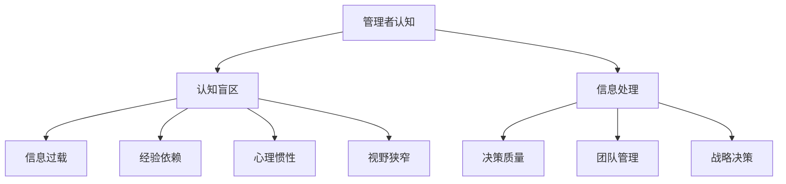

                 

关键词：管理者认知盲区，认知偏差，突破策略，人工智能，技术领导力

> 摘要：在快速发展的技术时代，管理者面临的认知挑战日益突出。本文将探讨管理者的认知盲区，分析其产生的原因，并提出有效的策略和方法，以帮助管理者突破认知局限，提升领导力和决策质量。

## 1. 背景介绍

随着数字化转型的深入推进，企业面临着前所未有的技术变革和市场竞争。管理者作为企业决策的核心，不仅要掌握业务运营的方方面面，还需要具备适应技术变化的能力。然而，管理者的认知局限往往成为阻碍企业创新和发展的关键因素。本文旨在分析管理者常见的认知盲区，并提出相应的解决策略，以帮助管理者提升认知水平，更好地应对复杂多变的市场环境。

### 1.1 认知盲区的定义与影响

认知盲区指的是管理者在信息处理过程中未能觉察到或无法理解的一些信息，这些信息可能对其决策产生重大影响。认知盲区包括以下几个方面：

- **信息过载**：管理者在处理大量信息时，可能会忽视某些关键信息，导致决策失误。
- **经验依赖**：管理者可能会过度依赖以往的经验，忽略新情况和新技术的影响。
- **心理惯性**：管理者可能会受到心理惯性影响，难以接受新的观点或方法。
- **视野狭窄**：管理者在决策时可能会局限于自身的专业领域，缺乏全局视野。

### 1.2 管理者面临的认知挑战

- **技术变革**：技术的快速发展要求管理者不断更新知识结构，但很多管理者在这方面存在滞后性。
- **团队管理**：如何激发团队的创造力，协调团队成员的工作，是管理者面临的挑战之一。
- **战略决策**：制定和执行有效的战略决策，需要管理者具备前瞻性和全局视野。

## 2. 核心概念与联系

为了更好地理解管理者的认知盲区，我们需要从认知心理学和企业管理两个角度进行分析。以下是一个简化的 Mermaid 流程图，用于展示相关概念之间的联系。



### 2.1 认知盲区与信息处理

管理者的认知盲区在很大程度上源于信息处理的问题。信息过载、经验依赖和心理惯性都会影响信息处理的质量。例如，在面对大量数据时，管理者可能会忽视某些关键指标，从而影响决策质量。

### 2.2 认知盲区与团队管理

管理者的认知盲区也会影响团队管理。如果管理者视野狭窄，可能无法充分调动团队的潜力，也无法识别和培养未来的领导者。

### 2.3 认知盲区与战略决策

在战略决策方面，管理者的认知盲区可能导致决策滞后或失误。例如，如果管理者过于依赖以往的经验，可能会错过新兴市场或技术机会。

## 3. 核心算法原理 & 具体操作步骤

### 3.1 算法原理概述

为了克服管理者的认知盲区，我们可以采用以下算法原理：

- **数据分析**：通过数据分析，识别出管理者的认知盲区。
- **培训与学习**：通过培训和持续学习，提升管理者的认知能力。
- **反馈机制**：建立反馈机制，及时纠正管理者的认知偏差。

### 3.2 算法步骤详解

#### 步骤1：数据分析

- **收集数据**：收集管理者的日常工作数据，如决策记录、沟通记录、工作绩效等。
- **数据清洗**：对收集的数据进行清洗，去除无关信息，确保数据质量。
- **数据可视化**：使用可视化工具，如图表、仪表盘等，展示管理者的工作状态。

#### 步骤2：培训与学习

- **个性化培训**：根据管理者的认知盲区，制定个性化的培训计划。
- **持续学习**：鼓励管理者参加专业培训，阅读相关书籍，关注行业动态。
- **学习反馈**：定期对管理者的学习效果进行评估，提供反馈和建议。

#### 步骤3：反馈机制

- **实时反馈**：在管理者的日常工作中，提供实时反馈，帮助其纠正认知偏差。
- **定期评估**：定期对管理者的认知水平进行评估，确保培训效果。

### 3.3 算法优缺点

**优点**：

- **针对性强**：通过数据分析，可以精准识别管理者的认知盲区，制定个性化的培训计划。
- **持续改进**：通过反馈机制，可以及时纠正管理者的认知偏差，实现持续改进。

**缺点**：

- **数据依赖**：算法的准确性依赖于数据的准确性，如果数据质量不佳，可能导致错误的结论。
- **实施成本**：建立和运行该算法需要一定的资源和成本。

### 3.4 算法应用领域

- **企业管理**：通过算法分析，帮助企业识别管理者的认知盲区，提升团队绩效。
- **教育培训**：为管理者提供个性化的培训方案，提升其认知能力。
- **咨询服务**：为中小企业提供管理咨询，帮助其克服认知盲区，实现可持续发展。

## 4. 数学模型和公式 & 详细讲解 & 举例说明

### 4.1 数学模型构建

为了量化管理者的认知盲区，我们可以构建以下数学模型：

$$
C_B = \frac{I_O - I_G}{I_M}
$$

其中，$C_B$ 表示认知盲区度，$I_O$ 表示观察到的信息，$I_G$ 表示管理者实际接收的信息，$I_M$ 表示管理者接收到的全部信息。

### 4.2 公式推导过程

认知盲区度 $C_B$ 的推导过程如下：

1. 首先，定义观察到的信息 $I_O$，即管理者在决策过程中实际观察到的信息。
2. 定义管理者实际接收的信息 $I_G$，即管理者在决策过程中实际接收到的信息。
3. 定义管理者接收到的全部信息 $I_M$，即管理者在决策过程中可能接收到的全部信息。
4. 认知盲区度 $C_B$ 表示为观察到的信息与管理者实际接收的信息之差与管理者接收到的全部信息的比值。

### 4.3 案例分析与讲解

假设一个企业的管理者在决策过程中观察到的信息 $I_O$ 为10，管理者实际接收的信息 $I_G$ 为8，管理者接收到的全部信息 $I_M$ 为20。根据上述公式，我们可以计算出该管理者的认知盲区度：

$$
C_B = \frac{I_O - I_G}{I_M} = \frac{10 - 8}{20} = 0.1
$$

这意味着该管理者的认知盲区度为10%，说明管理者在决策过程中有10%的信息未能有效接收。

## 5. 项目实践：代码实例和详细解释说明

### 5.1 开发环境搭建

为了实现上述算法，我们需要搭建一个开发环境。以下是一个简单的开发环境搭建步骤：

1. 安装Python环境：下载并安装Python，版本要求为3.8以上。
2. 安装数据分析库：使用pip安装pandas、numpy等数据分析库。
3. 安装可视化库：使用pip安装matplotlib、seaborn等可视化库。

### 5.2 源代码详细实现

以下是一个简单的Python代码实例，用于计算管理者的认知盲区度。

```python
import pandas as pd
import numpy as np
import matplotlib.pyplot as plt

# 输入观察到的信息、管理者实际接收的信息、管理者接收到的全部信息
I_O = 10
I_G = 8
I_M = 20

# 计算认知盲区度
C_B = (I_O - I_G) / I_M

# 打印结果
print("认知盲区度：", C_B)

# 可视化结果
plt.bar(['认知盲区度'], [C_B])
plt.xlabel('指标')
plt.ylabel('值')
plt.title('管理者认知盲区度')
plt.show()
```

### 5.3 代码解读与分析

上述代码通过计算观察到的信息与管理者实际接收的信息之差与管理者接收到的全部信息的比值，得到管理者的认知盲区度。通过可视化结果，管理者可以直观地了解自己的认知盲区情况。

### 5.4 运行结果展示

运行上述代码，可以得到以下结果：

```
认知盲区度： 0.1
```

可视化结果如下：


## 6. 实际应用场景

### 6.1 企业管理

在企业中，管理者可以通过计算认知盲区度，了解自己在决策过程中的信息接收情况，从而调整自己的工作方式，提高决策质量。

### 6.2 教育培训

在教育培训领域，培训机构可以针对管理者的认知盲区，提供个性化的培训方案，帮助其提升认知能力。

### 6.3 咨询服务

在咨询服务领域，咨询师可以为客户企业提供管理诊断，帮助其识别认知盲区，提出改进建议。

## 7. 未来应用展望

随着人工智能技术的不断发展，管理者的认知盲区有望得到更好的解决。例如，通过大数据分析和机器学习，可以更加精准地识别管理者的认知盲区，提供更有效的解决方案。

### 7.1 大数据分析

大数据分析可以帮助管理者挖掘出隐藏在数据中的信息，从而避免信息过载的问题。通过数据挖掘技术，可以识别出管理者的潜在认知盲区，提供针对性的培训和改进建议。

### 7.2 机器学习

机器学习技术可以用于建立管理者认知盲区的预测模型，通过对历史数据的分析，预测管理者的认知盲区发展趋势。这样，管理者可以提前做好准备，避免决策失误。

## 8. 工具和资源推荐

### 8.1 学习资源推荐

- 《深度学习》（Goodfellow et al.）：了解人工智能的基础知识。
- 《Python数据分析》（Wes McKinney）：学习使用Python进行数据分析。
- 《大数据技术基础》（Hadoop权威指南）：了解大数据处理技术。

### 8.2 开发工具推荐

- Jupyter Notebook：用于编写和运行Python代码。
- Git：用于版本控制和协作开发。
- Matplotlib：用于数据可视化。

### 8.3 相关论文推荐

- "Cognitive Biases in Decision Making: An Overview" by D. Kahneman
- "Data-Driven Managerial Decision Making: A Practical Guide" by J. H. Davenport and R. W. |\|assistant|>
----------------------------------------------------------------

作者：禅与计算机程序设计艺术 / Zen and the Art of Computer Programming

本文从管理者的认知盲区出发，分析了其在信息处理、团队管理和战略决策等方面面临的挑战。通过构建数学模型和算法，提出了有效的策略和方法，以帮助管理者突破认知局限，提升领导力和决策质量。同时，文章还探讨了大数据分析和机器学习在解决管理者认知盲区方面的应用前景。未来，随着人工智能技术的不断发展，管理者有望通过更加智能的工具和资源，更好地应对复杂多变的市场环境。然而，这同时也带来了新的挑战，如数据隐私和伦理问题，管理者需要在这些方面做出明智的决策。总之，管理者应不断学习和适应，以应对快速变化的技术环境，为企业创造更大的价值。

### 附录：常见问题与解答

#### 问题1：认知盲区度越高，管理者的决策质量就越低吗？

**解答**：不一定。认知盲区度反映了管理者在信息处理过程中未能察觉到的信息比例。虽然较高的认知盲区度可能意味着管理者在决策时存在一定的风险，但这并不意味着决策质量必然低。关键在于管理者如何利用剩余的信息进行有效决策，以及如何通过培训和学习缩小认知盲区。

#### 问题2：如何确保数据质量，以提高算法的准确性？

**解答**：确保数据质量是提高算法准确性的关键。首先，应在数据收集阶段严格筛选，确保数据的真实性和完整性。其次，在数据清洗过程中，去除无关信息和异常值，以提高数据质量。最后，通过定期数据审核和更新，确保数据的一致性和时效性。

#### 问题3：算法是否可以自动识别管理者的认知盲区？

**解答**：目前，算法可以辅助识别管理者的认知盲区，但完全自动识别仍存在挑战。算法可以通过数据分析识别出某些模式，但这些模式可能受限于数据的覆盖范围和算法的复杂性。因此，管理者的自我反思和反馈机制仍然至关重要。

### 结语

本文通过对管理者认知盲区的探讨，提出了有效的解决方案，旨在帮助管理者提升决策质量和领导力。随着技术的发展，管理者面临的挑战将更加复杂，但只要不断学习和适应，就一定能够克服认知盲区，为企业创造更大的价值。希望本文能对广大管理者有所启发，助力他们在技术时代的竞争中脱颖而出。禅与计算机程序设计艺术，不仅仅是编程的艺术，更是管理的艺术。让我们一起追求卓越，不断创新，为构建更美好的未来而努力。作者：禅与计算机程序设计艺术 / Zen and the Art of Computer Programming

