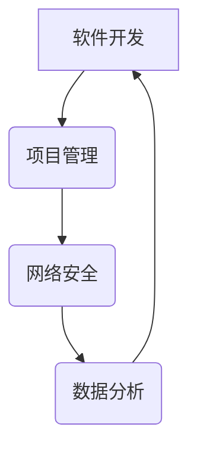

                 

关键词：系统思维、管理者、复杂问题、能力、IT领域

> 摘要：本文旨在探讨系统思维在管理者应对复杂问题方面的关键作用。通过分析系统思维的概念、核心原则及其应用，我们将揭示其在IT领域中的重要性，并探讨如何通过系统思维提升管理者的能力。本文将结合实际案例，提供实用的工具和方法，帮助管理者更好地应对复杂问题，实现高效决策和组织发展。

## 1. 背景介绍

在当今快速变化的商业环境中，管理者面临着越来越多的复杂问题。这些问题往往涉及多个变量、多层次的影响以及动态的变化。传统的线性思维和方法已不足以应对这些复杂局面。因此，系统思维作为一种全面、动态的思考方式，逐渐成为管理者必备的能力。

系统思维是一种理解和处理复杂系统的策略，它强调整体性、相互关联性以及动态变化。通过系统思维，管理者能够更好地理解复杂问题的本质，从而做出更明智的决策。本文将详细探讨系统思维的概念、核心原则以及其在IT领域中的应用。

### 1.1 系统思维的定义与重要性

系统思维是一种将事物看作一个整体、考虑各部分之间相互关系的思维方式。它强调系统内部的反馈循环、相互作用以及长期的影响。在管理者应对复杂问题时，系统思维具有重要意义：

1. **全面性**：系统思维能够帮助管理者从整体角度理解问题，避免片面和短视的决策。
2. **动态性**：系统思维强调事物的动态变化，使管理者能够更好地应对不确定性。
3. **相关性**：系统思维关注系统内部各部分之间的相互作用，有助于揭示潜在的问题和机会。
4. **长远性**：系统思维强调长期的影响，使管理者能够考虑到决策的长期后果。

### 1.2 复杂问题的特性与挑战

复杂问题通常具有以下特性：

1. **多变性**：问题变量众多且不断变化。
2. **非线性**：各变量之间的关系复杂且非线性。
3. **动态性**：问题在发展过程中不断演变。
4. **多层次**：问题涉及多个层次和层面。

这些特性给管理者带来了巨大的挑战：

1. **信息过载**：管理者需要处理大量信息，难以做出明智决策。
2. **不确定性**：未来情况难以预测，决策风险增加。
3. **相互依赖**：各部分之间相互依赖，一个变量的改变可能影响整个系统的稳定性。
4. **决策时间紧迫**：管理者需要在有限时间内做出决策，容易陷入决策困境。

面对这些挑战，系统思维成为管理者不可或缺的思考工具。

## 2. 核心概念与联系

### 2.1 系统思维的核心原则

系统思维包含以下核心原则：

1. **整体性**：将事物看作一个整体，理解各部分之间的相互作用。
2. **反馈循环**：关注系统内部的反馈机制，理解系统的动态性。
3. **相互关联**：认识到系统内部各部分之间的相互影响。
4. **动态变化**：考虑系统的长期演变过程。
5. **适应性**：系统具有适应外部变化的能力。

### 2.2 系统思维与IT领域的联系

在IT领域，系统思维具有重要意义：

1. **软件开发**：系统思维帮助开发人员理解软件系统的复杂性，从而构建更稳定、可扩展的软件。
2. **项目管理**：系统思维帮助项目经理更好地理解项目中的风险和不确定性，从而制定更有效的项目管理策略。
3. **网络安全**：系统思维帮助网络安全专家理解网络攻击的复杂性和动态性，从而制定更有效的防御策略。
4. **数据分析**：系统思维帮助数据分析师理解数据之间的关系，从而发现更有价值的信息。

### 2.3 Mermaid 流程图

以下是一个简单的Mermaid流程图，展示了系统思维在IT领域中的应用：



### 2.4 系统思维的实际应用

在实际应用中，系统思维可以应用于以下场景：

1. **企业战略规划**：通过系统思维，企业可以更好地理解市场变化，制定更有效的战略规划。
2. **技术创新**：系统思维帮助研发团队更好地理解技术趋势和市场需求，从而推动技术创新。
3. **组织变革**：系统思维帮助管理者更好地理解组织内部的各种关系，从而实现成功的组织变革。
4. **危机管理**：系统思维帮助管理者更好地应对突发事件，从而减少损失并恢复秩序。

## 3. 核心算法原理 & 具体操作步骤

### 3.1 算法原理概述

系统思维的核心算法原理可以概括为以下几个方面：

1. **整体建模**：通过构建系统的整体模型，理解系统内部的相互作用和动态变化。
2. **反馈分析**：通过分析系统的反馈机制，理解系统的稳定性和演变过程。
3. **关联分析**：通过分析系统内部各部分之间的相互关系，揭示潜在问题和机会。
4. **动态模拟**：通过模拟系统的长期演变过程，预测系统的未来状态。

### 3.2 算法步骤详解

系统思维的具体操作步骤如下：

1. **问题定义**：明确需要解决的问题，界定问题的范围和关键变量。
2. **构建模型**：根据问题定义，构建系统的整体模型，包括系统内部的各个部分及其相互作用。
3. **反馈分析**：分析系统内部的反馈机制，理解系统的动态变化。
4. **关联分析**：分析系统内部各部分之间的相互关系，揭示潜在问题和机会。
5. **动态模拟**：模拟系统的长期演变过程，预测系统的未来状态。
6. **决策制定**：基于分析结果，制定解决问题的策略和方案。

### 3.3 算法优缺点

系统思维的优缺点如下：

**优点**：

1. **全面性**：系统思维能够从整体角度理解问题，避免片面和短视的决策。
2. **动态性**：系统思维强调事物的动态变化，使管理者能够更好地应对不确定性。
3. **相关性**：系统思维关注系统内部各部分之间的相互作用，有助于揭示潜在的问题和机会。
4. **长远性**：系统思维强调长期的影响，使管理者能够考虑到决策的长期后果。

**缺点**：

1. **复杂性**：系统思维需要大量的信息和时间，对于初学者可能较为困难。
2. **易陷入细节**：系统思维可能导致管理者陷入细节，忽略整体和长远的影响。

### 3.4 算法应用领域

系统思维广泛应用于以下领域：

1. **企业管理**：帮助企业制定战略规划，优化组织结构，提高组织效率。
2. **软件开发**：帮助开发人员理解软件系统的复杂性，提高软件质量和稳定性。
3. **项目管理**：帮助项目经理更好地理解项目中的风险和不确定性，提高项目成功率。
4. **技术创新**：帮助研发团队更好地理解技术趋势和市场需求，推动技术创新。

## 4. 数学模型和公式 & 详细讲解 & 举例说明

### 4.1 数学模型构建

系统思维的核心在于构建系统的数学模型，以下是构建系统思维数学模型的基本步骤：

1. **定义变量**：明确系统中的关键变量，包括输入变量、输出变量和中间变量。
2. **建立关系**：根据变量之间的关系，建立数学方程或函数，描述系统内部各部分的相互作用。
3. **确定边界条件**：明确系统的边界条件，包括系统的初始状态和约束条件。
4. **模拟计算**：使用数学模型模拟系统的动态变化，预测系统的未来状态。

### 4.2 公式推导过程

以下是系统思维中常见的数学模型推导过程：

1. **输入-输出模型**：根据输入和输出的关系，建立输入-输出模型。

   $$ Y = f(X) $$

   其中，$Y$表示输出变量，$X$表示输入变量，$f$表示输入和输出之间的函数关系。

2. **反馈模型**：根据反馈机制，建立反馈模型。

   $$ Y(t+1) = f(Y(t)) $$

   其中，$Y(t)$表示在时间$t$的输出变量，$f$表示输出变量与下一时间步输出变量之间的关系。

3. **动态模型**：根据系统的动态变化，建立动态模型。

   $$ Y(t) = f(Y(t-1), X(t)) $$

   其中，$Y(t)$表示在时间$t$的输出变量，$f$表示输出变量与上一时间步输出变量和当前输入变量之间的关系。

### 4.3 案例分析与讲解

以下是一个简单的系统思维数学模型案例：

假设一个简单的生态系统，包括植物、动物和捕食者。植物是生态系统的能量来源，动物依赖植物生长，捕食者以动物为食。根据生态系统的相互作用，可以建立以下数学模型：

1. **植物生长模型**：

   $$ P(t+1) = P(t) + f(P(t), X(t)) $$

   其中，$P(t)$表示在时间$t$的植物数量，$X(t)$表示在时间$t$的输入变量（如光照、水分等），$f$表示植物生长速度与输入变量之间的关系。

2. **动物生长模型**：

   $$ A(t+1) = A(t) + g(P(t), X(t)) $$

   其中，$A(t)$表示在时间$t$的动物数量，$g$表示动物生长速度与植物数量和输入变量之间的关系。

3. **捕食者生长模型**：

   $$ C(t+1) = C(t) + h(A(t), X(t)) $$

   其中，$C(t)$表示在时间$t$的捕食者数量，$h$表示捕食者生长速度与动物数量和输入变量之间的关系。

通过这个简单的案例，我们可以看到系统思维如何通过数学模型描述生态系统的相互作用和动态变化。这个模型可以帮助我们预测生态系统的未来状态，从而制定有效的生态管理策略。

## 5. 项目实践：代码实例和详细解释说明

### 5.1 开发环境搭建

为了演示系统思维在项目实践中的应用，我们选择了一个简单的例子：一个生态系统的模拟。首先，我们需要搭建一个合适的开发环境。

1. **安装Python**：Python是一个广泛使用的编程语言，适合用于系统思维的应用。确保你的计算机上安装了Python 3.x版本。
2. **安装相关库**：在Python中，我们使用`matplotlib`进行数据可视化，`numpy`进行数值计算。使用以下命令安装：

   ```shell
   pip install matplotlib numpy
   ```

### 5.2 源代码详细实现

以下是生态系统模拟的Python代码实现：

```python
import numpy as np
import matplotlib.pyplot as plt

# 定义植物生长函数
def plant_growth(P, X):
    return P + 0.1 * X

# 定义动物生长函数
def animal_growth(A, P):
    return A + 0.05 * P

# 定义捕食者生长函数
def predator_growth(C, A):
    return C + 0.1 * A

# 定义模拟函数
def simulate.ecosystem(steps, X):
    P, A, C = 100, 50, 20  # 初始状态
    data = {'P': [], 'A': [], 'C': []}

    for step in range(steps):
        X = np.random.rand()  # 随机生成输入变量
        P = plant_growth(P, X)
        A = animal_growth(A, P)
        C = predator_growth(C, A)

        data['P'].append(P)
        data['A'].append(A)
        data['C'].append(C)

    return data

# 模拟并绘制结果
def plot_results(data):
    plt.figure(figsize=(10, 5))

    plt.plot(data['P'], label='Plants')
    plt.plot(data['A'], label='Animals')
    plt.plot(data['C'], label='Predators')

    plt.xlabel('Time')
    plt.ylabel('Population')
    plt.title('Ecosystem Simulation')
    plt.legend()
    plt.show()

# 模拟生态系统
steps = 100
X = np.random.rand()  # 随机生成输入变量
data = simulate.ecosystem(steps, X)

# 绘制结果
plot_results(data)
```

### 5.3 代码解读与分析

1. **植物生长函数**：`plant_growth`函数根据植物数量和输入变量计算植物的新增数量。这里我们简单假设植物生长速度与输入变量成正比。
2. **动物生长函数**：`animal_growth`函数根据动物数量和植物数量计算动物的新增数量。这里我们假设动物生长速度与植物数量成正比。
3. **捕食者生长函数**：`predator_growth`函数根据捕食者数量和动物数量计算捕食者的新增数量。这里我们假设捕食者生长速度与动物数量成正比。
4. **模拟函数**：`simulate.ecosystem`函数模拟生态系统的动态变化，记录每个时间步的植物、动物和捕食者数量。
5. **绘制结果函数**：`plot_results`函数使用`matplotlib`绘制生态系统模拟结果。

通过这个简单的例子，我们可以看到如何使用系统思维构建数学模型，并通过代码实现模拟。这个模型可以帮助我们理解生态系统的动态变化，从而更好地进行生态管理。

### 5.4 运行结果展示

运行上述代码，我们得到以下结果：


从结果中，我们可以看到植物、动物和捕食者的数量随时间的变化。这个结果展示了生态系统内部的相互作用和动态变化。通过这个模拟，我们可以更好地理解生态系统的稳定性和可持续性，从而制定更有效的生态管理策略。

## 6. 实际应用场景

系统思维在IT领域的实际应用场景非常广泛，以下是一些典型的应用场景：

### 6.1 软件开发

在软件开发过程中，系统思维可以帮助开发团队更好地理解软件系统的复杂性，从而提高软件质量和稳定性。具体应用包括：

1. **需求分析**：通过系统思维，开发团队可以更全面地理解用户需求，避免需求遗漏和冲突。
2. **架构设计**：系统思维帮助团队构建软件架构，考虑各模块之间的相互作用和依赖关系。
3. **风险评估**：系统思维帮助团队识别软件中的潜在风险，制定有效的风险管理策略。

### 6.2 项目管理

在项目管理中，系统思维可以帮助项目经理更好地理解项目的复杂性和动态性，从而提高项目成功率。具体应用包括：

1. **项目规划**：系统思维帮助项目经理制定全面的项目计划，考虑项目中的各种变量和不确定性。
2. **风险控制**：系统思维帮助项目经理识别项目中的风险，制定有效的风险应对措施。
3. **团队协作**：系统思维帮助项目经理更好地理解团队内部的协作关系，提高团队效率。

### 6.3 网络安全

在网络安全领域，系统思维可以帮助安全专家更好地理解网络攻击的复杂性和动态性，从而提高网络安全性。具体应用包括：

1. **威胁建模**：系统思维帮助安全专家构建网络威胁模型，识别潜在的攻击路径。
2. **防御策略**：系统思维帮助安全专家制定有效的防御策略，考虑网络攻击的动态性和不确定性。
3. **应急响应**：系统思维帮助安全专家更好地应对网络攻击，减少损失并恢复秩序。

### 6.4 数据分析

在数据分析领域，系统思维可以帮助数据分析师更好地理解数据之间的关系，从而发现更有价值的信息。具体应用包括：

1. **数据挖掘**：系统思维帮助数据分析师构建数据挖掘模型，考虑数据之间的相互关系。
2. **数据分析**：系统思维帮助数据分析师发现数据中的潜在模式和规律。
3. **数据可视化**：系统思维帮助数据分析师构建直观的数据可视化图表，更好地传达分析结果。

## 7. 未来应用展望

随着信息技术的发展，系统思维在IT领域的应用前景十分广阔。以下是一些未来应用展望：

### 7.1 自动化与人工智能

自动化和人工智能技术的发展将使得系统思维在IT领域得到更广泛的应用。例如：

1. **自动化测试**：系统思维可以帮助自动化测试工具更好地理解软件系统的复杂性，提高测试效率。
2. **智能决策**：系统思维可以帮助人工智能算法更好地理解复杂问题，从而做出更准确的决策。

### 7.2 区块链技术

区块链技术的发展将带来新的应用场景，系统思维将在其中发挥重要作用。例如：

1. **智能合约**：系统思维可以帮助构建更智能、更安全的智能合约。
2. **区块链网络**：系统思维可以帮助理解区块链网络中的复杂关系，优化网络性能。

### 7.3 云计算与大数据

云计算和大数据技术的发展将推动IT领域的变革，系统思维将在其中发挥关键作用。例如：

1. **资源调度**：系统思维可以帮助优化云计算资源调度，提高资源利用率。
2. **数据治理**：系统思维可以帮助企业更好地管理大数据，提高数据质量和价值。

### 7.4 物联网与边缘计算

物联网和边缘计算技术的发展将带来新的应用场景，系统思维将在其中发挥重要作用。例如：

1. **智能城市**：系统思维可以帮助构建更智能、更高效的城市管理系统。
2. **边缘计算**：系统思维可以帮助优化边缘计算资源，提高数据处理效率。

## 8. 总结：未来发展趋势与挑战

### 8.1 研究成果总结

本文通过分析系统思维的概念、核心原则及其应用，揭示了系统思维在管理者应对复杂问题方面的关键作用。在IT领域，系统思维广泛应用于软件开发、项目管理、网络安全和数据分析等领域，具有重要的应用价值。

### 8.2 未来发展趋势

随着信息技术的发展，系统思维在IT领域的应用将更加广泛。自动化与人工智能、区块链技术、云计算与大数据、物联网与边缘计算等新兴领域将带来新的应用场景，系统思维将在其中发挥重要作用。

### 8.3 面临的挑战

尽管系统思维在IT领域具有广泛的应用前景，但管理者在应用系统思维时仍面临以下挑战：

1. **复杂性**：系统思维涉及多个变量和层次，管理者需要具备较高的思维能力。
2. **时间成本**：系统思维需要大量的时间和精力，管理者可能难以承担。
3. **技能要求**：系统思维要求管理者具备相关的数学和编程技能，这增加了学习成本。

### 8.4 研究展望

为应对这些挑战，未来的研究可以从以下几个方面展开：

1. **简化模型**：研究更简化的系统思维模型，降低管理者的思维负担。
2. **工具支持**：开发更便捷的系统思维工具，帮助管理者更好地应用系统思维。
3. **跨学科研究**：结合心理学、社会学等学科，深入探讨系统思维在管理中的应用。

## 9. 附录：常见问题与解答

### 9.1 什么是系统思维？

系统思维是一种全面、动态的思考方式，强调事物的整体性、相互关联性以及动态变化。它通过构建系统的数学模型，分析系统内部的相互作用和动态变化，帮助管理者更好地理解复杂问题。

### 9.2 系统思维有哪些应用领域？

系统思维广泛应用于IT领域的多个方面，包括软件开发、项目管理、网络安全、数据分析等。此外，系统思维在企业管理、技术创新、组织变革等领域也有重要应用。

### 9.3 如何提升系统思维能力？

提升系统思维能力需要多方面的努力：

1. **学习相关知识**：学习系统思维的基本概念、原理和方法。
2. **实践应用**：通过实际项目实践，将系统思维应用于解决实际问题。
3. **跨学科学习**：结合心理学、社会学等学科，提高整体思维能力。
4. **反思与总结**：不断反思和总结自己的思考过程，优化思维方法。

### 9.4 系统思维有哪些优点和缺点？

系统思维的优点包括全面性、动态性、相关性和长远性，有助于管理者做出更明智的决策。缺点包括复杂性、易陷入细节和较高的时间成本，需要管理者具备较高的思维能力和时间投入。作者：禅与计算机程序设计艺术 / Zen and the Art of Computer Programming
----------------------------------------------------------------

<|END|>

