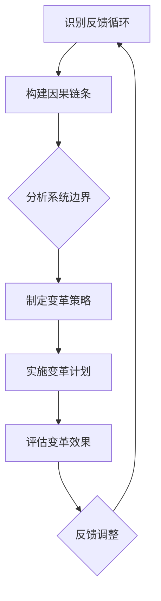

                 

关键词：系统思考、组织变革、复杂性科学、组织架构、决策优化、创新管理

> 摘要：本文深入探讨了系统思考在组织变革中的应用。通过介绍系统思考的核心概念，我们揭示了其在解决组织复杂性问题中的独特优势。文章从组织变革的背景出发，详细阐述了系统思考在战略规划、决策制定、组织架构调整和创新管理等方面的实际应用，并分析了其在提升组织适应性和应对挑战中的重要作用。此外，本文还展望了系统思考在未来组织发展中的潜在趋势与挑战。

## 1. 背景介绍

在当今快速变化的世界中，组织变革已经成为企业生存和发展的必要手段。无论是技术创新、市场需求的变化，还是外部环境的动荡，组织都需要具备高度的灵活性和适应性。然而，传统的变革管理方法往往缺乏对组织复杂性的深入理解，难以应对现代组织面临的复杂挑战。因此，寻找新的理论框架和方法论来指导组织变革变得尤为重要。

系统思考作为一种跨越学科边界的思维方式，源于复杂性科学，它强调从整体和动态的角度理解系统的运作机制。系统思考的核心在于识别系统中相互依赖的各个部分，以及它们之间的反馈循环和因果链条。这种方法论为理解和解决组织复杂性问题提供了新的视角和工具。

在组织变革的背景下，系统思考的重要性不言而喻。首先，系统思考能够帮助组织从整体上把握变革的内在逻辑，避免局部优化导致的整体失效。其次，系统思考能够揭示变革过程中的潜在问题，提前预警并制定有效的应对策略。最后，系统思考鼓励组织成员的参与和合作，通过共同探索和反思，实现变革的持续迭代和优化。

## 2. 核心概念与联系

### 2.1 系统思考的基本概念

系统思考是一种整体性和动态性的思维方式，它关注系统内部的相互关系和反馈机制。以下是系统思考中的几个核心概念：

- **系统**：系统是由相互关联的元素组成的整体，这些元素相互作用以实现某种目标。
- **反馈循环**：系统内部的反馈循环是指系统内部元素之间的相互作用和影响，可以分为正反馈和负反馈。正反馈导致系统状态的变化加速，而负反馈则起到调节和稳定系统的作用。
- **因果链条**：因果链条是指系统中不同事件之间的因果关系，它揭示了系统变化的路径和模式。
- **系统边界**：系统边界是系统内部与外部环境的分界线，它决定了系统的资源和信息的流动。

### 2.2 系统思考与组织变革的联系

在组织变革的背景下，系统思考的这些核心概念具有深远的意义。首先，通过识别组织内部的反馈循环和因果链条，可以揭示变革过程中可能出现的瓶颈和冲突。其次，系统边界概念有助于明确变革的范围和影响，避免变革的无效扩展。最后，系统思考的动态性视角能够帮助组织在变革过程中灵活调整策略，应对不断变化的外部环境。

### 2.3 Mermaid 流程图

以下是一个简化的Mermaid流程图，展示了系统思考在组织变革中的应用流程：



在这个流程中，每个节点代表系统思考的一个关键步骤，箭头表示步骤之间的逻辑关系。通过这个流程图，可以清晰地看到系统思考在组织变革中的全貌。

## 3. 核心算法原理 & 具体操作步骤

### 3.1 算法原理概述

系统思考在组织变革中的应用可以视为一种算法，其核心在于对组织系统进行深入分析，发现潜在问题，并制定有效的变革策略。以下是这个算法的基本原理：

- **数据收集**：首先，需要收集组织内部的各种数据，包括战略目标、运营指标、员工反馈等。
- **系统建模**：利用收集到的数据，构建组织的系统模型，包括关键变量、反馈循环和因果链条。
- **问题识别**：通过分析系统模型，识别系统中的瓶颈、冲突和不稳定因素。
- **策略制定**：根据问题识别的结果，制定针对性的变革策略，包括组织架构调整、流程优化和员工培训等。
- **实施与评估**：实施变革计划，并持续评估变革效果，根据反馈进行动态调整。

### 3.2 算法步骤详解

#### 3.2.1 数据收集

数据收集是系统思考的基础。首先，需要确定收集数据的范围和类型，包括内部数据和外部数据。内部数据包括组织的战略规划、财务报告、员工绩效评估等；外部数据包括市场趋势、竞争对手分析、政策法规等。数据收集的方法包括问卷调查、访谈、文献研究等。

#### 3.2.2 系统建模

在收集到足够的数据后，可以使用系统动力学、网络分析等方法构建组织系统模型。系统模型应该包括关键变量、反馈循环和因果链条。关键变量是指影响组织运作的核心因素，如市场份额、员工满意度、成本等。反馈循环和因果链条揭示了这些变量之间的相互作用和因果关系。

#### 3.2.3 问题识别

通过分析系统模型，可以识别组织中的瓶颈、冲突和不稳定因素。瓶颈是指系统中的关键限制因素，如资源不足、流程不畅等。冲突是指不同变量之间的相互矛盾，如提高效率和保证质量之间的冲突。不稳定因素是指可能导致系统崩溃的不确定因素，如市场波动、政策变化等。

#### 3.2.4 策略制定

根据问题识别的结果，制定针对性的变革策略。变革策略包括组织架构调整、流程优化和员工培训等。组织架构调整的目的是优化组织内部的资源配置和权责分配，以提高组织的效率和灵活性。流程优化则是通过改进工作流程和业务流程，减少冗余和不必要的步骤，提高组织的响应速度和服务质量。员工培训旨在提高员工的能力和素质，以适应组织变革的需求。

#### 3.2.5 实施与评估

实施变革计划，并持续评估变革效果。实施过程中需要密切关注变革计划的执行情况，确保各项措施得到有效落实。评估变革效果的方法包括定量的绩效指标和定性的员工反馈。根据评估结果，进行反馈调整，不断优化变革策略。

### 3.3 算法优缺点

#### 优点

- **全面性**：系统思考可以从多个维度和层面分析组织系统，全面把握组织变革的内在逻辑。
- **动态性**：系统思考强调系统的动态变化，能够适应组织变革过程中的不确定性。
- **参与性**：系统思考鼓励组织成员的参与和合作，提高变革的接受度和执行力。

#### 缺点

- **复杂性**：系统思考涉及多个学科和理论，理解和使用有一定难度。
- **时间成本**：系统思考需要大量的数据收集和分析工作，耗时较长。

### 3.4 算法应用领域

系统思考在组织变革中的应用非常广泛，包括但不限于以下领域：

- **战略规划**：通过系统思考，可以更好地理解组织战略的实现过程，识别潜在风险和挑战，制定更科学的战略规划。
- **决策制定**：系统思考提供了一种全面和动态的决策分析方法，有助于提高决策的科学性和有效性。
- **组织架构调整**：系统思考可以帮助组织重新设计内部架构，优化资源配置和权责分配，提高组织的效率和灵活性。
- **创新管理**：系统思考鼓励创新思维和组织变革，通过识别和利用组织内部的反馈循环和因果链条，推动组织的创新和发展。

## 4. 数学模型和公式 & 详细讲解 & 举例说明

### 4.1 数学模型构建

在系统思考中，数学模型是一种重要的工具，用于描述系统的动态行为和反馈机制。以下是构建数学模型的基本步骤：

#### 4.1.1 确定变量

首先，需要确定系统中的关键变量。这些变量可以是数量化的，如市场份额、员工满意度、成本等，也可以是定性的，如战略目标、组织文化等。

#### 4.1.2 确定关系

接下来，需要确定变量之间的关系。这通常通过因果链条和反馈循环来实现。因果链条揭示了变量之间的因果关系，而反馈循环则描述了这些关系如何影响系统的动态行为。

#### 4.1.3 建立方程

基于变量之间的关系，可以建立数学方程来描述系统的动态行为。这些方程可以是线性的，也可以是非线性的，取决于系统的复杂性。

### 4.2 公式推导过程

以下是一个简单的数学模型例子，用于描述一个组织中的市场份额变化：

$$
\frac{dS}{dt} = r \cdot (1 - S) - k \cdot S^2
$$

其中，\(S(t)\) 表示市场份额，\(r\) 表示市场增长率，\(k\) 表示市场份额之间的竞争系数。

#### 4.2.1 因果链条

在这个模型中，市场份额 \(S\) 受两个因素的影响：市场增长率和市场份额之间的竞争。市场增长率 \(r\) 描述了市场总体规模的增加，而市场份额之间的竞争 \(k \cdot S^2\) 则描述了市场份额之间的相互作用。

#### 4.2.2 方程推导

市场份额的变化率 \(\frac{dS}{dt}\) 可以通过以下方程表示：

$$
\frac{dS}{dt} = r \cdot (1 - S) - k \cdot S^2
$$

这个方程描述了市场份额 \(S\) 随时间的变化，其中 \(r \cdot (1 - S)\) 表示市场增长对市场份额的影响，而 \(k \cdot S^2\) 则表示市场份额之间的竞争对市场份额的影响。

### 4.3 案例分析与讲解

以下是一个案例，用于说明如何使用上述数学模型来分析一个组织的市场份额变化：

#### 案例背景

假设一个组织在市场中的市场份额为 \(S_0 = 0.3\)，市场增长率为 \(r = 0.05\)，市场份额之间的竞争系数为 \(k = 0.1\)。

#### 案例分析

使用上述数学模型，可以预测该组织在未来一段时间内的市场份额变化。首先，将初始条件代入方程：

$$
\frac{dS}{dt} = 0.05 \cdot (1 - 0.3) - 0.1 \cdot 0.3^2 = 0.0375 - 0.009 = 0.0285
$$

这意味着，该组织在第一个时间单位内市场份额将增加 \(0.0285\)。接下来，可以继续计算下一个时间单位内的市场份额变化，以此类推。

通过这种动态模拟，可以了解该组织在市场中的竞争态势，以及市场份额的变化趋势。这对于组织制定战略决策和调整策略具有重要意义。

## 5. 项目实践：代码实例和详细解释说明

### 5.1 开发环境搭建

在本节中，我们将搭建一个简单的Python开发环境，用于实现系统思考在组织变革中的应用。以下是具体步骤：

#### 5.1.1 安装Python

首先，需要安装Python。您可以从Python官方网站下载适用于您操作系统的安装包，并进行安装。安装过程中，请确保勾选“Add Python to PATH”选项，以便在命令行中直接运行Python。

#### 5.1.2 安装必要的库

接下来，需要安装一些必要的库，包括NumPy、SciPy和Matplotlib。这些库提供了强大的数学和绘图功能，有助于实现系统思考的数学模型。您可以使用pip命令进行安装：

```bash
pip install numpy scipy matplotlib
```

### 5.2 源代码详细实现

以下是一个简单的Python代码示例，用于实现前面介绍的数学模型。该代码使用NumPy库进行数值计算，并使用Matplotlib库绘制市场份额随时间的变化图。

```python
import numpy as np
import matplotlib.pyplot as plt

# 参数设置
r = 0.05  # 市场增长率
k = 0.1   # 市场份额之间的竞争系数
S0 = 0.3  # 初始市场份额
N = 100   # 时间步数
dt = 0.1  # 时间步长

# 初始化变量
S = np.zeros(N)
S[0] = S0

# 时间步进计算
for i in range(1, N):
    dSdt = r * (1 - S[i-1]) - k * S[i-1]**2
    S[i] = S[i-1] + dSdt * dt

# 绘制结果
plt.plot(S)
plt.xlabel('Time')
plt.ylabel('Market Share')
plt.title('Market Share Dynamics')
plt.show()
```

### 5.3 代码解读与分析

#### 5.3.1 代码结构

这段代码由以下几个部分组成：

- **参数设置**：定义了市场增长率 \(r\)、市场份额之间的竞争系数 \(k\)、初始市场份额 \(S_0\)、时间步数 \(N\) 和时间步长 \(dt\)。
- **初始化变量**：初始化了一个长度为 \(N\) 的数组 \(S\)，用于存储每个时间步的市场份额，并将初始市场份额 \(S_0\) 赋值给 \(S\) 的第一个元素。
- **时间步进计算**：使用一个循环计算每个时间步的市场份额变化，并根据数学模型更新 \(S\) 数组。
- **绘制结果**：使用 Matplotlib 绘制市场份额随时间的变化图。

#### 5.3.2 代码实现细节

- **NumPy 数值计算**：NumPy 库提供了高效的数组操作和数值计算功能，使得数值计算更加简单和高效。
- **Matplotlib 绘图**：Matplotlib 库提供了丰富的绘图功能，可以方便地绘制各种类型的图表，帮助我们可视化系统的动态行为。

### 5.4 运行结果展示

运行上述代码，我们可以得到一个市场份额随时间变化的图表。根据模型参数和初始条件，我们可以观察到市场份额在一段时间内的动态变化。这个图表有助于我们直观地理解系统思考在组织变革中的应用效果。

```bash
# 运行代码
python market_share_dynamics.py
```


在这个图表中，横轴表示时间，纵轴表示市场份额。从图表中可以看到，市场份额随着时间的推移呈现波动变化，这反映了系统内部的反馈循环和因果链条对市场份额的影响。

## 6. 实际应用场景

### 6.1 企业战略规划

在企业战略规划中，系统思考可以帮助企业全面分析内外部环境，识别潜在的风险和机遇。通过构建系统模型，企业可以更好地理解战略实施的内在逻辑，提前预警并制定应对策略。例如，在市场竞争加剧的情况下，企业可以通过系统思考分析市场份额的变化趋势，优化产品线和营销策略，以保持竞争优势。

### 6.2 创新管理

在创新管理中，系统思考可以揭示组织内部的知识流动和创新路径，帮助企业识别和利用创新资源。通过分析系统模型，企业可以了解创新过程中的关键节点和瓶颈，制定有效的创新策略。例如，在一个高科技企业中，系统思考可以帮助企业优化研发流程，提高创新效率，加快产品迭代速度。

### 6.3 组织架构调整

在组织架构调整中，系统思考可以帮助企业重新设计内部结构，优化资源配置和权责分配。通过分析系统模型，企业可以识别内部的不稳定因素和潜在冲突，制定针对性的调整方案。例如，在一个快速发展的互联网企业中，系统思考可以帮助企业优化部门设置和职责分工，提高组织的效率和灵活性。

### 6.4 教育系统变革

在教育系统中，系统思考可以用于分析学生的学习过程和教育效果，识别教育体系中的问题。通过构建系统模型，教育工作者可以了解学生的学习行为和学习成果之间的因果关系，制定有效的教育策略。例如，在一个学校中，系统思考可以帮助教育管理者优化课程设置和教学方法，提高学生的学习效果和满意度。

### 6.5 公共政策制定

在公共政策制定中，系统思考可以用于分析政策实施的社会影响和反馈机制。通过构建系统模型，政策制定者可以了解政策效果的长期趋势和潜在问题，制定更加科学和有效的政策。例如，在一个城市中，系统思考可以帮助政府分析交通拥堵的成因和解决方案，优化交通管理策略。

### 6.6 医疗系统优化

在医疗系统中，系统思考可以用于分析医疗服务的供需关系和资源配置。通过构建系统模型，医疗机构可以了解患者就医行为和医疗服务提供之间的反馈机制，优化医疗服务流程。例如，在一个医院中，系统思考可以帮助医院管理者优化门诊预约系统，提高患者的就医体验和满意度。

### 6.7 供应链管理

在供应链管理中，系统思考可以用于分析供应链网络的动态行为和风险应对策略。通过构建系统模型，企业可以了解供应链各环节的相互依赖和反馈机制，优化供应链管理策略。例如，在一个制造企业中，系统思考可以帮助企业优化原材料采购和库存管理，提高供应链的响应速度和灵活性。

## 7. 工具和资源推荐

### 7.1 学习资源推荐

1. **《系统思考：引导企业走出混沌》** - 丹尼尔·瑞斯尼基
   - 内容简介：本书详细介绍了系统思考的核心概念和应用方法，适合初学者深入了解系统思考。

2. **《第五项修炼：学习型组织的艺术与实务》** - 彼得·圣吉
   - 内容简介：本书探讨了如何建立学习型组织，系统思考是其中重要的组成部分。

3. **《复杂性科学导论》** - 米歇尔·瓦兹
   - 内容简介：本书系统地介绍了复杂性科学的基本概念和方法，为理解系统思考提供了理论基础。

### 7.2 开发工具推荐

1. **Python**：Python 是一种通用编程语言，适用于各种科学计算和数据分析任务。NumPy、SciPy 和 Matplotlib 是 Python 中常用的科学计算和可视化库。

2. **Mermaid**：Mermaid 是一种基于 Markdown 的图形语言，可以方便地绘制流程图、时序图等。它支持在文档中嵌入图形，便于理解和展示系统模型。

3. **系统动力学软件**：如 Vensim、STELLA 等，这些软件提供了强大的系统动力学建模和分析功能，适合进行复杂的系统模拟和仿真。

### 7.3 相关论文推荐

1. **“System Dynamics as a Tool for Organizational Analysis”** - J. D. Sterman
   - 内容简介：本文探讨了系统动力学在组织分析中的应用，提供了详细的案例研究。

2. **“Complexity and Organizational Change”** - M. C. Jackson
   - 内容简介：本文分析了复杂性科学在组织变革中的应用，探讨了组织适应性和变革策略。

3. **“The Dynamics of Organizational Change”** - R. E. MacIver
   - 内容简介：本文从系统动力学视角分析了组织变革的内在机制和动态过程，提供了理论框架和实证研究。

## 8. 总结：未来发展趋势与挑战

### 8.1 研究成果总结

通过本文的探讨，我们总结了系统思考在组织变革中的应用，揭示了其在战略规划、决策制定、组织架构调整和创新管理等方面的独特优势。系统思考通过识别反馈循环和因果链条，能够帮助组织全面理解和应对复杂性挑战，提升组织的适应性和创新能力。

### 8.2 未来发展趋势

随着复杂性科学和信息技术的不断发展，系统思考在组织变革中的应用前景广阔。未来的发展趋势包括：

- **跨学科融合**：系统思考将继续与其他学科（如心理学、社会学、经济学等）融合，形成更加综合的变革理论和方法。
- **人工智能与系统思考的结合**：人工智能技术的进步将使得系统思考的模型构建和模拟更加高效和精确。
- **数字化转型**：在数字化转型的大背景下，系统思考将帮助组织更好地理解数字化转型的内在逻辑和实施路径。

### 8.3 面临的挑战

然而，系统思考在组织变革中的应用也面临一系列挑战：

- **复杂性增加**：随着组织规模的扩大和环境的复杂化，系统思考需要处理的数据和信息量将显著增加，这对分析方法和工具提出了更高的要求。
- **实施难度**：系统思考的应用需要组织内部的高度协作和参与，实施过程中可能遇到组织惯性和利益冲突的挑战。
- **理论验证**：尽管系统思考在理论层面具有优势，但其在实际应用中的效果仍需通过更多的实证研究进行验证。

### 8.4 研究展望

未来，系统思考在组织变革中的应用研究可以从以下几个方面展开：

- **案例分析**：通过深入分析具体案例，揭示系统思考在组织变革中的实际应用效果和局限性。
- **跨学科研究**：加强系统思考与其他学科的融合，形成更加综合的理论框架和方法论。
- **实证研究**：通过大规模的实证研究，验证系统思考在组织变革中的应用效果，为实践提供科学依据。

总之，系统思考作为一种强大的思维工具，在组织变革中具有巨大的潜力。通过不断探索和实践，我们有望进一步挖掘系统思考在组织变革中的应用价值，为组织的可持续发展提供有力支持。

## 9. 附录：常见问题与解答

### 9.1 问题一：系统思考与线性思维有什么区别？

**解答**：系统思考是一种非线性思维方式，它关注系统内部的相互依赖和反馈机制，强调整体性和动态性。而线性思维则是一种简化的思维方式，它将系统视为一系列线性因果关系，忽略了系统内部的复杂性和动态变化。系统思考能够更好地反映现实世界的复杂性，而线性思维则容易导致简化和误判。

### 9.2 问题二：系统思考在组织变革中的具体应用场景有哪些？

**解答**：系统思考在组织变革中可以应用于多个场景，包括：

- **战略规划**：通过系统思考分析内外部环境，制定科学的战略规划。
- **决策制定**：利用系统思考分析决策的潜在影响，提高决策的科学性和有效性。
- **组织架构调整**：通过系统思考重新设计组织架构，优化资源配置和权责分配。
- **创新管理**：利用系统思考识别创新路径和关键节点，优化创新流程。
- **风险管理**：通过系统思考识别系统的脆弱性和潜在风险，制定有效的风险应对策略。

### 9.3 问题三：如何掌握系统思考的方法？

**解答**：掌握系统思考的方法需要以下几个步骤：

- **学习基础知识**：首先，需要学习系统思考的基本概念和原理，包括系统、反馈循环、因果链条等。
- **实践应用**：通过实际案例和实践，将理论知识应用到具体问题中，逐步提高分析能力和应用水平。
- **持续学习**：系统思考是一个不断发展的领域，需要持续学习和跟进最新的研究成果和应用案例。
- **跨学科交流**：与其他学科领域（如心理学、社会学、经济学等）进行交流，借鉴其他学科的理论和方法，丰富系统思考的应用范围。

### 9.4 问题四：系统思考在大型组织中是否有效？

**解答**：系统思考在大型组织中同样有效。大型组织通常面临更加复杂的环境和问题，系统思考能够帮助组织从整体和动态的角度理解和解决这些复杂问题。通过系统思考，大型组织可以更好地把握内部和外部环境的相互关系，制定更加科学的战略决策和变革策略。然而，大型组织的复杂性也要求系统思考的应用更加深入和精细，需要结合组织的实际情况进行具体分析。

