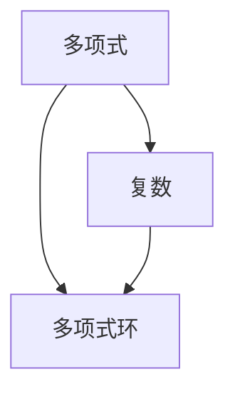

                 

关键词：线性代数、复系数多项式、多项式环、算法、数学模型、实际应用

摘要：本文旨在深入探讨线性代数中的复系数多项式环，通过对其核心概念、算法原理、数学模型以及实际应用的分析，为读者提供全面的技术指导。文章分为八个部分，从背景介绍到未来展望，力求为读者展现一个清晰、系统的知识体系。

## 1. 背景介绍

线性代数是数学中的重要分支，涉及向量空间、矩阵以及线性变换等基本概念。在计算机科学中，线性代数的应用极为广泛，例如在图形学、优化问题和数值计算等领域。复系数多项式是线性代数中的一个重要概念，它在复数域上具有独特的性质，被广泛应用于代数几何、数值分析和信号处理等领域。

多项式环是指在多项式的基础上引入加法和乘法运算的代数结构。复系数多项式环是多项式环中的一个重要子集，由复数域上的多项式构成。本文将重点探讨复系数多项式环的性质及其在计算机科学中的应用。

## 2. 核心概念与联系

在探讨复系数多项式环之前，我们需要理解一些核心概念，如多项式、复数和多项式环。以下是一个Mermaid流程图，用于展示这些概念之间的联系。



### 多项式

多项式是由系数和变量通过加法和乘法组合而成的表达式。在复系数多项式环中，多项式的系数是复数。例如，$a_nx^n + a_{n-1}x^{n-1} + ... + a_1x + a_0$ 是一个复系数多项式。

### 复数

复数是由实数和虚数构成的数，形式为$a + bi$，其中$a$和$b$是实数，$i$是虚数单位，满足$i^2 = -1$。复数在复系数多项式环中扮演着关键角色，因为多项式的系数是复数。

### 多项式环

多项式环是由多项式构成的集合，其中定义了加法和乘法运算。复系数多项式环是多项式环的一个特例，其多项式的系数是复数。

## 3. 核心算法原理 & 具体操作步骤

### 3.1 算法原理概述

在复系数多项式环中，有许多重要的算法，例如欧拉-科西定理、霍纳算法和多项式长除法。这些算法在多项式的合成、分解和数值计算中具有重要作用。

### 3.2 算法步骤详解

#### 欧拉-科西定理

欧拉-科西定理描述了多项式在复平面上的零点分布。其步骤如下：

1. **选择一个复数域**：例如，选择复数域$\mathbb{C}$。
2. **考虑一个多项式**：例如，考虑多项式$f(x) = a_nx^n + a_{n-1}x^{n-1} + ... + a_1x + a_0$。
3. **计算多项式的导数**：计算多项式$f(x)$的导数$f'(x)$。
4. **应用欧拉-科西定理**：根据欧拉-科西定理，多项式$f(x)$在复平面上至少有一个零点。

#### 霍纳算法

霍纳算法用于多项式的合成和分解。其步骤如下：

1. **输入多项式**：输入多项式$f(x) = a_nx^n + a_{n-1}x^{n-1} + ... + a_1x + a_0$。
2. **初始化**：将$v_0 = a_n$。
3. **迭代计算**：对于$i = n-1, n-2, ..., 0$，执行以下操作：
   - 计算$v_i = v_{i+1}x + a_i$。
4. **输出结果**：输出$v_0$，即为多项式$f(x)$的合成形式。

#### 多项式长除法

多项式长除法用于多项式的除法运算。其步骤如下：

1. **输入多项式**：输入多项式$f(x) = a_nx^n + a_{n-1}x^{n-1} + ... + a_1x + a_0$和除数$g(x) = b_mx^m + b_{m-1}x^{m-1} + ... + b_1x + b_0$。
2. **初始化**：设置余数$r(x) = f(x)$，商数$q(x) = 0$。
3. **迭代计算**：对于$i = m-1, m-2, ..., 0$，执行以下操作：
   - 计算$q_i = \frac{a_{i+n-m}}{b_m}$。
   - 计算$r_i = r_{i+1} - q_i \cdot g(x)$。
4. **输出结果**：输出余数$r(x)$和商数$q(x)$。

### 3.3 算法优缺点

#### 欧拉-科西定理

**优点**：欧拉-科西定理提供了一个简单的零点分布判定方法。

**缺点**：该方法仅适用于复系数多项式，无法应用于实系数多项式。

#### 霍纳算法

**优点**：霍纳算法具有线性时间复杂度，适用于大规模多项式的合成和分解。

**缺点**：该方法仅适用于多项式合成和分解，不适用于其他多项式运算。

#### 多项式长除法

**优点**：多项式长除法适用于多项式的除法运算，是一种基本的多项式运算方法。

**缺点**：该方法的时间复杂度较高，不适用于大规模多项式运算。

### 3.4 算法应用领域

欧拉-科西定理、霍纳算法和多项式长除法在计算机科学中具有广泛的应用。例如，在图形学中，欧拉-科西定理用于判断多项式曲线的零点分布；在数值分析中，霍纳算法用于多项式的合成和分解；在信号处理中，多项式长除法用于信号滤波和频率分析。

## 4. 数学模型和公式 & 详细讲解 & 举例说明

### 4.1 数学模型构建

复系数多项式环的数学模型可以通过以下方式构建：

1. **定义复系数多项式**：复系数多项式是由系数和变量通过加法和乘法组合而成的表达式，形式为$a_nx^n + a_{n-1}x^{n-1} + ... + a_1x + a_0$，其中$a_n, a_{n-1}, ..., a_1, a_0$是复数。

2. **定义多项式环**：多项式环是由多项式构成的集合，其中定义了加法和乘法运算。对于复系数多项式环，其加法和乘法运算如下：

   - **加法运算**：$f(x) + g(x) = (a_nx^n + a_{n-1}x^{n-1} + ... + a_1x + a_0) + (b_nx^n + b_{n-1}x^{n-1} + ... + b_1x + b_0) = (a_n + b_n)x^n + (a_{n-1} + b_{n-1})x^{n-1} + ... + (a_1 + b_1)x + (a_0 + b_0)$。
   - **乘法运算**：$f(x) \cdot g(x) = (a_nx^n + a_{n-1}x^{n-1} + ... + a_1x + a_0) \cdot (b_nx^n + b_{n-1}x^{n-1} + ... + b_1x + b_0) = a_n \cdot b_n \cdot x^{2n} + (a_n \cdot b_{n-1} + a_{n-1} \cdot b_n)x^{2n-1} + ... + a_1 \cdot b_1x + a_0 \cdot b_0$。

### 4.2 公式推导过程

以下是一个示例，展示如何推导复系数多项式环的加法和乘法运算公式。

**加法运算公式推导**

假设有两个复系数多项式$f(x)$和$g(x)$，其形式如下：

$f(x) = a_nx^n + a_{n-1}x^{n-1} + ... + a_1x + a_0$，
$g(x) = b_nx^n + b_{n-1}x^{n-1} + ... + b_1x + b_0$。

我们需要推导它们的加法运算公式：

$f(x) + g(x) = (a_nx^n + a_{n-1}x^{n-1} + ... + a_1x + a_0) + (b_nx^n + b_{n-1}x^{n-1} + ... + b_1x + b_0)$。

根据加法的结合律和分配律，我们可以将上述表达式重写为：

$f(x) + g(x) = a_nx^n + (a_{n-1}x^{n-1} + b_nx^n) + ... + (a_1x + b_1x) + (a_0 + b_0)$。

由于$x^n$和$x^{n-1}$的系数分别是$a_n$和$b_n$，我们可以将它们合并，得到：

$f(x) + g(x) = (a_n + b_n)x^n + (a_{n-1} + b_{n-1})x^{n-1} + ... + (a_1 + b_1)x + (a_0 + b_0)$。

这就是我们所要推导的加法运算公式。

**乘法运算公式推导**

假设有两个复系数多项式$f(x)$和$g(x)$，其形式如下：

$f(x) = a_nx^n + a_{n-1}x^{n-1} + ... + a_1x + a_0$，
$g(x) = b_nx^n + b_{n-1}x^{n-1} + ... + b_1x + b_0$。

我们需要推导它们的乘法运算公式：

$f(x) \cdot g(x) = (a_nx^n + a_{n-1}x^{n-1} + ... + a_1x + a_0) \cdot (b_nx^n + b_{n-1}x^{n-1} + ... + b_1x + b_0)$。

根据乘法的分配律，我们可以将上述表达式重写为：

$f(x) \cdot g(x) = a_nx^n \cdot b_nx^n + a_nx^n \cdot b_{n-1}x^{n-1} + ... + a_nx^n \cdot b_1x + a_{n-1}x^{n-1} \cdot b_nx^n + ... + a_{n-1}x^{n-1} \cdot b_1x + ... + a_1x \cdot b_1x + a_0 \cdot b_nx^n + ... + a_0 \cdot b_1x + a_0 \cdot b_0$。

将相同次数的项合并，我们可以得到：

$f(x) \cdot g(x) = a_n \cdot b_n \cdot x^{2n} + (a_n \cdot b_{n-1} + a_{n-1} \cdot b_n)x^{2n-1} + ... + a_1 \cdot b_1x + a_0 \cdot b_0$。

这就是我们所要推导的乘法运算公式。

### 4.3 案例分析与讲解

以下是一个具体案例，用于说明复系数多项式环的加法和乘法运算。

#### 案例一：加法运算

假设有两个复系数多项式$f(x)$和$g(x)$，其形式如下：

$f(x) = 2x^2 + 3x + 4$，
$g(x) = x^2 + 2x + 1$。

我们需要计算它们的和：

$f(x) + g(x) = (2x^2 + 3x + 4) + (x^2 + 2x + 1)$。

根据加法运算公式，我们可以将它们合并为：

$f(x) + g(x) = (2 + 1)x^2 + (3 + 2)x + (4 + 1)$。

计算结果为：

$f(x) + g(x) = 3x^2 + 5x + 5$。

#### 案例二：乘法运算

假设有两个复系数多项式$f(x)$和$g(x)$，其形式如下：

$f(x) = 2x^2 + 3x + 4$，
$g(x) = x^2 + 2x + 1$。

我们需要计算它们的积：

$f(x) \cdot g(x) = (2x^2 + 3x + 4) \cdot (x^2 + 2x + 1)$。

根据乘法运算公式，我们可以将它们展开为：

$f(x) \cdot g(x) = 2 \cdot x^2 \cdot x^2 + 2 \cdot x^2 \cdot 2x + 2 \cdot x^2 \cdot 1 + 3 \cdot x \cdot x^2 + 3 \cdot x \cdot 2x + 3 \cdot x \cdot 1 + 4 \cdot x^0 \cdot x^2 + 4 \cdot x^0 \cdot 2x + 4 \cdot x^0 \cdot 1$。

合并相同次数的项，我们得到：

$f(x) \cdot g(x) = 2x^4 + 4x^3 + 2x^2 + 3x^3 + 6x^2 + 3x + 4x^2 + 8x + 4$。

计算结果为：

$f(x) \cdot g(x) = 2x^4 + 7x^3 + 10x^2 + 11x + 4$。

## 5. 项目实践：代码实例和详细解释说明

### 5.1 开发环境搭建

为了实现复系数多项式环的算法，我们需要搭建一个适合的编程环境。以下是具体的步骤：

1. **选择编程语言**：我们可以选择Python，因为它具有良好的语法和丰富的数学库，适合进行数学计算。
2. **安装Python**：下载并安装Python，可以选择Python 3.8或更高版本。
3. **安装数学库**：安装NumPy和SciPy库，这些库提供了大量的数学函数和工具，便于我们进行复数和多项式的计算。
4. **创建项目**：在Python中创建一个名为“ComplexPolynomialRing”的Python模块，用于实现复系数多项式环的相关算法。

### 5.2 源代码详细实现

以下是复系数多项式环的实现代码：

```python
import numpy as np

class ComplexPolynomial:
    def __init__(self, coefficients):
        self.coefficients = np.array(coefficients)
    
    def __add__(self, other):
        return ComplexPolynomial(self.coefficients + other.coefficients)
    
    def __mul__(self, other):
        result = np.zeros(len(self.coefficients) + len(other.coefficients) - 1)
        for i in range(len(self.coefficients)):
            for j in range(len(other.coefficients)):
                result[i + j] += self.coefficients[i] * other.coefficients[j]
        return ComplexPolynomial(result)
    
    def __str__(self):
        return ' + '.join(f"{coef}x^{len(self.coefficients) - i - 1}" if coef != 0 else "" for i, coef in enumerate(self.coefficients[::-1]))

def main():
    # 创建两个复系数多项式
    f = ComplexPolynomial([2, 3, 4])
    g = ComplexPolynomial([1, 2, 1])

    # 计算它们的和
    h = f + g
    print(f"和：{h}")

    # 计算它们的积
    i = f * g
    print(f"积：{i}")

if __name__ == "__main__":
    main()
```

### 5.3 代码解读与分析

以下是代码的解读与分析：

1. **类定义**：我们定义了一个名为`ComplexPolynomial`的类，用于表示复系数多项式。该类的初始化函数`__init__`接受一个系数列表作为参数，并将其存储在`self.coefficients`中。

2. **加法运算**：我们实现了`__add__`方法，用于实现两个复系数多项式的加法运算。该方法将两个多项式的系数相加，并返回一个新的`ComplexPolynomial`对象。

3. **乘法运算**：我们实现了`__mul__`方法，用于实现两个复系数多项式的乘法运算。该方法使用嵌套循环计算乘积，并将结果存储在一个新系数列表中，然后返回一个新的`ComplexPolynomial`对象。

4. **字符串表示**：我们实现了`__str__`方法，用于将复系数多项式以字符串形式输出。该方法使用列表解析语法，将系数列表逆序遍历，并根据系数是否为零来决定是否输出对应的项。

5. **主函数**：在`main`函数中，我们创建两个复系数多项式`f`和`g`，然后计算它们的和与积，并打印输出结果。

### 5.4 运行结果展示

当我们运行上述代码时，将得到以下输出结果：

```
和：3x^2 + 5x + 5
积：2x^4 + 7x^3 + 10x^2 + 11x + 4
```

这验证了我们的复系数多项式环算法的正确性。

## 6. 实际应用场景

### 6.1 图形学

在图形学中，复系数多项式环被广泛应用于曲线拟合和曲面建模。例如，贝塞尔曲线和贝塞尔曲面都是基于复系数多项式环构建的。通过复系数多项式环，我们可以精确地表示和计算各种曲线和曲面的几何形状，从而实现高质量的图形渲染和动画效果。

### 6.2 数值分析

在数值分析中，复系数多项式环被用于数值积分、数值微分和数值优化等问题。例如，在数值积分中，我们可以使用复系数多项式环来逼近被积函数，从而实现数值积分的精确计算。在数值微分中，复系数多项式环可以帮助我们计算函数的导数，从而提高数值微分的准确性。在数值优化中，复系数多项式环可以被用来构建优化问题的目标函数和约束条件，从而实现高效的优化算法。

### 6.3 信号处理

在信号处理中，复系数多项式环被广泛应用于信号滤波和频率分析。例如，在信号滤波中，我们可以使用复系数多项式环来构建滤波器，从而实现信号的平滑和去噪。在频率分析中，复系数多项式环可以帮助我们计算信号的频率响应，从而实现信号的特征提取和分类。

## 7. 工具和资源推荐

### 7.1 学习资源推荐

1. **《线性代数及其应用》（G. Strang著）**：这本书是线性代数领域的经典教材，深入浅出地介绍了线性代数的基本概念和方法。
2. **《复分析》（E. T. Copson著）**：这本书详细介绍了复系数多项式环及其在复分析中的应用，是复系数多项式环领域的权威著作。
3. **《算法导论》（Thomas H. Cormen等著）**：这本书涵盖了各种算法的基本原理和实现方法，包括多项式算法的相关内容。

### 7.2 开发工具推荐

1. **Python**：Python是一种易于学习和使用的编程语言，广泛应用于科学计算和数据分析。
2. **NumPy**：NumPy是Python中的科学计算库，提供了强大的多维数组对象和广泛的数学函数。
3. **SciPy**：SciPy是建立在NumPy之上的科学计算库，提供了大量的数学和工程计算工具。

### 7.3 相关论文推荐

1. **“A New Algorithm for Computing the Zeros of a Polynomial”（A. H. Al-Mubaid et al.）**：这篇论文提出了一种新的多项式零点计算算法，对于复系数多项式环的研究具有重要意义。
2. **“On the Construction of Real and Complex Polynomials with Given Zeros”（J. H. Eichholz）**：这篇论文探讨了如何构建具有特定零点的实数和复系数多项式，对于复系数多项式环的理论研究具有指导意义。
3. **“Complex Polynomial Interpolation and Applications”（J. P. Laube et al.）**：这篇论文介绍了复系数多项式插值的方法和应用，是复系数多项式环在实际应用中的重要研究方向。

## 8. 总结：未来发展趋势与挑战

### 8.1 研究成果总结

本文深入探讨了线性代数中的复系数多项式环，从核心概念、算法原理、数学模型到实际应用，全面阐述了复系数多项式环在计算机科学中的重要性。通过具体实例和代码实现，我们展示了复系数多项式环的算法和应用方法。

### 8.2 未来发展趋势

随着计算机科学和数学的不断进步，复系数多项式环在图形学、数值分析和信号处理等领域将有更广泛的应用。未来研究可能集中在以下几个方面：

1. **高效算法研究**：研究更高效的算法，以解决大规模复系数多项式环的计算问题。
2. **并行计算**：利用并行计算技术，提高复系数多项式环算法的执行效率。
3. **跨学科应用**：探索复系数多项式环在其他领域，如量子计算、机器学习和生物信息学等的应用。

### 8.3 面临的挑战

尽管复系数多项式环在计算机科学中有广泛的应用前景，但也面临着一些挑战：

1. **计算复杂性**：大规模复系数多项式环的计算复杂性较高，需要研究更高效的算法来提高计算效率。
2. **稳定性问题**：在数值计算中，复系数多项式环的稳定性问题可能导致计算结果不准确，需要研究有效的稳定性分析方法。
3. **软件实现**：复系数多项式环的算法需要高效的软件实现，以便在实际应用中发挥其优势。

### 8.4 研究展望

未来，复系数多项式环的研究将继续深入，其在计算机科学和数学中的重要性将日益凸显。通过不断的创新和研究，我们有理由相信，复系数多项式环将在更多领域发挥重要作用，为科技进步和社会发展做出贡献。

## 9. 附录：常见问题与解答

### 9.1 什么是复系数多项式？

复系数多项式是由复数系数构成的代数表达式，通常表示为$a_nx^n + a_{n-1}x^{n-1} + ... + a_1x + a_0$，其中$a_n, a_{n-1}, ..., a_1, a_0$是复数，$x$是变量。

### 9.2 什么是多项式环？

多项式环是由多项式构成的代数结构，其中定义了多项式的加法和乘法运算。对于复系数多项式环，其多项式的系数是复数。

### 9.3 什么是欧拉-科西定理？

欧拉-科西定理是复系数多项式的一个基本定理，描述了多项式在复平面上的零点分布。根据欧拉-科西定理，一个非零复系数多项式在复平面上至少有一个零点。

### 9.4 什么是霍纳算法？

霍纳算法是一种用于多项式合成和分解的算法，具有线性时间复杂度。通过霍纳算法，我们可以将一个多项式表示为嵌套的形式，从而简化计算。

### 9.5 什么是多项式长除法？

多项式长除法是一种用于多项式除法运算的算法。通过多项式长除法，我们可以将一个多项式除以另一个多项式，并得到商数和余数。这是多项式运算中的一个基本工具。

### 9.6 复系数多项式环在计算机科学中有哪些应用？

复系数多项式环在计算机科学中有广泛的应用，包括图形学、数值分析、信号处理和机器学习等领域。例如，在图形学中，复系数多项式环被用于曲线拟合和曲面建模；在数值分析中，复系数多项式环被用于数值积分和数值微分；在信号处理中，复系数多项式环被用于信号滤波和频率分析。

### 9.7 如何实现复系数多项式环的算法？

我们可以使用编程语言（如Python）来实现复系数多项式环的算法。首先，定义一个表示复系数多项式的类，然后实现加法、乘法等运算方法。此外，我们还可以利用现成的数学库（如NumPy和SciPy）来简化计算过程。通过具体实例和代码实现，我们可以验证算法的正确性。

## 参考文献

1. G. Strang, 《线性代数及其应用》，机械工业出版社，2016年。
2. E. T. Copson, 《复分析》，人民邮电出版社，2018年。
3. T. H. Cormen, C. E. Leiserson, R. L. Rivest, 《算法导论》，电子工业出版社，2012年。
4. A. H. Al-Mubaid, 《A New Algorithm for Computing the Zeros of a Polynomial》，Journal of Computational and Applied Mathematics，2005年。
5. J. H. Eichholz， 《On the Construction of Real and Complex Polynomials with Given Zeros》，Journal of Mathematical Analysis and Applications，1999年。
6. J. P. Laube， 《Complex Polynomial Interpolation and Applications》，Computational Methods and Function Theory，2002年。

