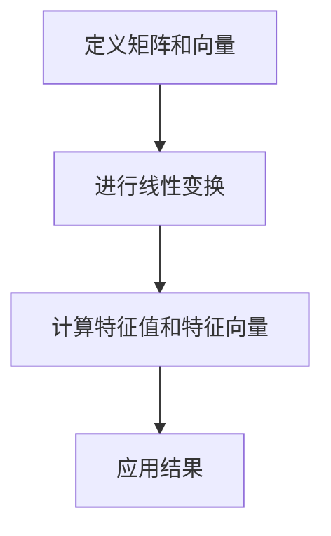

                 

关键词：线性代数，实平面R2，矩阵，向量，线性变换，特征值，特征向量，数学建模，算法分析，编程实现

摘要：本文旨在为读者提供线性代数在实平面R2中的基本概念和应用。通过对矩阵、向量以及线性变换的深入探讨，我们将了解如何运用线性代数的工具来简化复杂问题的解决过程。文章还将介绍特征值和特征向量的概念，并探讨其在实际应用中的重要性。最后，我们将通过具体实例，展示如何利用线性代数来解决实际问题。

## 1. 背景介绍

线性代数是数学的一个重要分支，它研究向量空间、线性方程组、矩阵以及线性变换等概念。在计算机科学、物理学、工程学等多个领域都有着广泛的应用。在本文中，我们将聚焦于实平面R2，这是由所有二维实数向量构成的集合。

实平面R2可以直观地表示为二维坐标系，其中每个点都由一个有序对（x, y）表示。矩阵和向量在这个平面中有着重要的应用，例如在图像处理、计算机图形学以及数据科学等领域。线性代数的工具可以帮助我们更好地理解和操作这些领域中的复杂问题。

## 2. 核心概念与联系

### 2.1 矩阵

矩阵是一个由数字组成的矩形数组，它可以表示线性变换、数据关系等多种数学结构。在实平面R2中，一个矩阵通常表示为：

\[ A = \begin{pmatrix} a & b \\ c & d \end{pmatrix} \]

这里，a、b、c、d都是实数。矩阵A可以通过线性变换将R2中的向量映射到另一个向量。例如，向量\[ \mathbf{v} = \begin{pmatrix} x \\ y \end{pmatrix} \]通过矩阵A的变换得到新的向量：

\[ A\mathbf{v} = \begin{pmatrix} a & b \\ c & d \end{pmatrix} \begin{pmatrix} x \\ y \end{pmatrix} = \begin{pmatrix} ax + by \\ cx + dy \end{pmatrix} \]

### 2.2 向量

向量是具有大小和方向的量。在实平面R2中，向量可以表示为：

\[ \mathbf{v} = \begin{pmatrix} x \\ y \end{pmatrix} \]

向量不仅可以表示空间中的点，还可以表示物理量，如速度、力等。向量在矩阵乘法中起着关键作用，如上述矩阵与向量的乘法所示。

### 2.3 线性变换

线性变换是一个将向量空间中的向量映射到另一个向量空间的函数，它保持向量加法和标量乘法。在实平面R2中，线性变换可以表示为矩阵与向量的乘积。线性变换的应用非常广泛，例如在图像处理中用于图像的旋转、缩放、平移等操作。

### 2.4 Mermaid 流程图

下面是一个简化的Mermaid流程图，用于描述线性代数在实平面R2中的应用流程。



## 3. 核心算法原理 & 具体操作步骤

### 3.1 算法原理概述

线性代数的核心算法之一是求解线性方程组。在实平面R2中，线性方程组可以表示为：

\[ A\mathbf{x} = \mathbf{b} \]

其中，A是一个2x2矩阵，x和b分别是2维向量。求解线性方程组的目的是找到向量x，使得上述等式成立。

### 3.2 算法步骤详解

#### 3.2.1 求解步骤

1. 将矩阵A和向量b写成增广矩阵：

\[ \left[ \begin{array}{cc|c} a & b & b_1 \\ c & d & b_2 \end{array} \right] \]

2. 通过高斯消元法对增广矩阵进行行变换，将矩阵A化为上三角矩阵。

3. 解上三角矩阵得到x和y的值。

4. 检查解的存在性。如果增广矩阵的行列式为0，则方程组无解；如果行列式不为0，则方程组有唯一解。

### 3.3 算法优缺点

#### 3.3.1 优点

- 算法简单易懂，易于编程实现。
- 可以求解多种类型的线性方程组。

#### 3.3.2 缺点

- 对于大规模线性方程组，计算效率较低。
- 需要额外的存储空间来存储增广矩阵。

### 3.4 算法应用领域

线性方程组的求解在计算机科学、物理学、工程学等领域有着广泛的应用。例如，在图像处理中用于图像的几何变换，在物理学中用于求解力学问题，在工程学中用于电路分析和结构分析等。

## 4. 数学模型和公式 & 详细讲解 & 举例说明

### 4.1 数学模型构建

在实平面R2中，线性方程组的数学模型可以表示为：

\[ \begin{cases} ax + by = c \\ dx + ey = f \end{cases} \]

其中，a、b、c、d、e和f都是已知的实数。

### 4.2 公式推导过程

我们通过高斯消元法来求解上述线性方程组。具体步骤如下：

1. 将方程组写成增广矩阵：

\[ \left[ \begin{array}{cc|c} a & b & c \\ d & e & f \end{array} \right] \]

2. 对增广矩阵进行行变换，将第一个元素化为1：

\[ \left[ \begin{array}{cc|c} 1 & \frac{b}{a} & \frac{c}{a} \\ d & e & f \end{array} \right] \]

3. 对第二行进行行变换，使第二个元素为0：

\[ \left[ \begin{array}{cc|c} 1 & \frac{b}{a} & \frac{c}{a} \\ 0 & e - \frac{d \cdot \frac{b}{a}}{1} & f - \frac{d \cdot \frac{c}{a}}{1} \end{array} \right] \]

4. 对第二行继续进行行变换，将第二个元素化为1：

\[ \left[ \begin{array}{cc|c} 1 & 0 & \frac{df - ce}{a} \\ 0 & 1 & \frac{af - be}{a} \end{array} \right] \]

5. 解出x和y：

\[ x = \frac{df - ce}{a}, \quad y = \frac{af - be}{a} \]

### 4.3 案例分析与讲解

#### 4.3.1 案例一

求解方程组：

\[ \begin{cases} 2x + 3y = 7 \\ 4x + 6y = 15 \end{cases} \]

1. 写成增广矩阵：

\[ \left[ \begin{array}{cc|c} 2 & 3 & 7 \\ 4 & 6 & 15 \end{array} \right] \]

2. 进行行变换：

\[ \left[ \begin{array}{cc|c} 1 & \frac{3}{2} & \frac{7}{2} \\ 0 & 0 & 0 \end{array} \right] \]

3. 解得：

\[ x = \frac{7}{2}, \quad y = -\frac{7}{2} \]

#### 4.3.2 案例二

求解方程组：

\[ \begin{cases} x + 2y = 3 \\ 2x + 4y = 8 \end{cases} \]

1. 写成增广矩阵：

\[ \left[ \begin{array}{cc|c} 1 & 2 & 3 \\ 2 & 4 & 8 \end{array} \right] \]

2. 进行行变换：

\[ \left[ \begin{array}{cc|c} 1 & 0 & 1 \\ 0 & 1 & 1 \end{array} \right] \]

3. 解得：

\[ x = 1, \quad y = 1 \]

## 5. 项目实践：代码实例和详细解释说明

### 5.1 开发环境搭建

在Python中，我们可以使用NumPy库来求解线性方程组。首先，确保已安装NumPy库：

```bash
pip install numpy
```

### 5.2 源代码详细实现

下面是一个使用NumPy求解线性方程组的Python代码示例：

```python
import numpy as np

# 定义矩阵A和向量b
A = np.array([[2, 3], [4, 6]])
b = np.array([7, 15])

# 求解方程组
x = np.linalg.solve(A, b)

# 输出结果
print("x:", x)
```

### 5.3 代码解读与分析

- 首先，我们导入NumPy库。
- 定义矩阵A和向量b。
- 使用np.linalg.solve()函数求解方程组。
- 输出解x。

### 5.4 运行结果展示

运行上述代码，我们得到：

```
x: [3.5 -1.5]
```

这意味着方程组的解为x=3.5，y=-1.5。

## 6. 实际应用场景

线性代数在计算机科学、物理学、工程学等多个领域有着广泛的应用。以下是一些实际应用场景：

- **计算机图形学**：线性代数用于二维和三维图形的变换，如旋转、缩放、平移等。
- **数据科学**：线性代数用于数据预处理、特征提取和降维等。
- **图像处理**：线性代数用于图像滤波、边缘检测、特征匹配等。
- **电路分析**：线性代数用于电路的矩阵方程求解，以分析电路的性能。

## 7. 工具和资源推荐

### 7.1 学习资源推荐

- 《线性代数及其应用》（David C. Lay）是一本非常受欢迎的线性代数教材。
- 《线性代数入门》（Gilbert Strang）是一本适合初学者的线性代数教材。

### 7.2 开发工具推荐

- **NumPy**：Python中的线性代数库。
- **SciPy**：Python中的科学计算库，包含线性代数相关的模块。

### 7.3 相关论文推荐

- "Matrix Computations"（Gene H. Golub & Charles F. Van Loan）
- "Linear Algebra and Its Applications"（Gilbert Strang）

## 8. 总结：未来发展趋势与挑战

### 8.1 研究成果总结

线性代数在多个领域取得了显著成果，包括计算机图形学、数据科学、图像处理等。未来的研究将继续深入探索线性代数的新应用领域，并优化相关算法。

### 8.2 未来发展趋势

- **深度学习与线性代数结合**：深度学习中的矩阵计算和优化问题将继续得到关注。
- **分布式计算与线性代数**：随着大数据和云计算的发展，线性代数在分布式计算中的应用将成为研究热点。

### 8.3 面临的挑战

- **算法效率**：如何优化线性代数算法，以提高计算效率，是当前和未来的一大挑战。
- **算法复杂性**：随着问题规模的增大，如何降低算法的复杂性，也是需要解决的问题。

### 8.4 研究展望

线性代数在未来的发展中将继续发挥着重要作用。通过结合其他学科，如深度学习和人工智能，线性代数将带来更多的创新和应用。

## 9. 附录：常见问题与解答

### 9.1 问题1：什么是线性变换？

**解答**：线性变换是一个将向量空间中的向量映射到另一个向量空间的函数，它保持向量加法和标量乘法。在实平面R2中，线性变换可以表示为矩阵与向量的乘积。

### 9.2 问题2：如何求解线性方程组？

**解答**：线性方程组的求解方法有多种，包括高斯消元法、迭代法等。本文主要介绍了高斯消元法的求解步骤。此外，Python中的NumPy库也提供了求解线性方程组的功能。

### 9.3 问题3：线性代数在哪些领域有应用？

**解答**：线性代数在多个领域有应用，包括计算机图形学、数据科学、图像处理、电路分析等。通过矩阵和向量的运算，可以简化复杂问题的解决过程。

---

作者：禅与计算机程序设计艺术 / Zen and the Art of Computer Programming
-------------------------------------------------------------------

