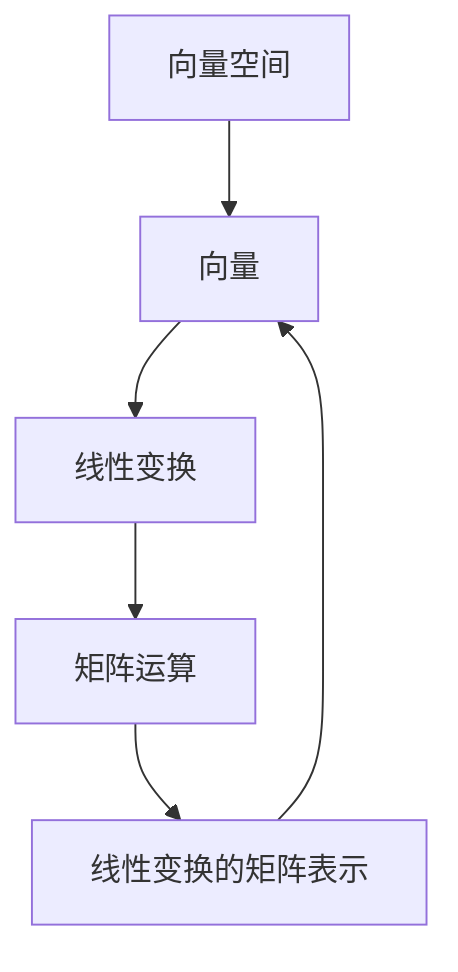

                 

关键词：线性代数，实欧几里得空间，向量空间，线性变换，矩阵运算，几何意义，应用领域

摘要：本文将引导读者深入了解实欧几里得空间中的线性代数概念，包括向量空间、线性变换、矩阵运算及其几何意义。通过实例和公式推导，我们将详细阐述这些概念的应用，并探讨线性代数在各个领域的实际应用及其未来发展趋势。

## 1. 背景介绍

线性代数是数学中一个重要分支，它研究向量空间及其线性变换的性质。实欧几里得空间是线性代数中最基础的概念之一，它由实数域上的向量构成，并在其中定义了向量之间的内积、范数和角度等概念。线性代数广泛应用于物理学、计算机科学、工程学、经济学等多个领域，是现代科技不可或缺的工具。

本文将围绕实欧几里得空间中的线性代数展开讨论，分为以下几个部分：

1. 核心概念与联系
2. 核心算法原理与具体操作步骤
3. 数学模型和公式
4. 项目实践：代码实例
5. 实际应用场景
6. 工具和资源推荐
7. 总结：未来发展趋势与挑战

## 2. 核心概念与联系

在实欧几里得空间中，我们主要研究以下核心概念：

- 向量空间：一个向量空间是由一组向量构成，这些向量之间可以进行加法和数乘运算。
- 线性变换：线性变换是一个从向量空间到另一个向量空间的函数，它保持向量的加法和数乘运算。
- 矩阵运算：矩阵是向量空间中的线性变换的一种表示形式，矩阵运算包括矩阵加法、矩阵乘法和逆矩阵运算。

这些概念之间存在紧密的联系，可以用以下Mermaid流程图进行描述：



### 向量空间

向量空间是一个集合V，它由一组向量组成，这些向量之间可以进行加法和数乘运算。加法满足交换律、结合律和存在零向量，数乘满足结合律、分配律和存在单位元。向量空间中的向量可以表示为坐标形式，如\( \vec{v} = (v_1, v_2, \ldots, v_n) \)。

### 线性变换

线性变换是一个从向量空间V到另一个向量空间W的函数，记作\( T: V \rightarrow W \)。它满足以下性质：

1. \( T(\vec{u} + \vec{v}) = T(\vec{u}) + T(\vec{v}) \)（加法保持性）
2. \( T(c\vec{u}) = cT(\vec{u}) \)（数乘保持性）

线性变换可以用矩阵表示，如\( T(\vec{v}) = A\vec{v} \)，其中\( A \)是线性变换的矩阵。

### 矩阵运算

矩阵运算包括矩阵加法、矩阵乘法和逆矩阵运算。矩阵加法满足交换律、结合律和存在零矩阵，矩阵乘法满足结合律和分配律。逆矩阵运算使得矩阵可以表示为线性变换的逆。

## 3. 核心算法原理与具体操作步骤

### 3.1 算法原理概述

线性代数中的核心算法主要包括矩阵的乘法、矩阵的逆和特征值、特征向量等。以下是对这些算法的概述：

1. **矩阵乘法**：矩阵乘法是线性代数中最基本的运算之一。给定两个矩阵\( A \)和\( B \)，其乘积\( C = AB \)是一个新矩阵，其中\( C_{ij} = \sum_{k=1}^{n} A_{ik}B_{kj} \)。
2. **矩阵的逆**：矩阵的逆是使得矩阵与其逆矩阵相乘等于单位矩阵的矩阵。给定矩阵\( A \)，其逆矩阵\( A^{-1} \)满足\( AA^{-1} = A^{-1}A = I \)，其中\( I \)是单位矩阵。
3. **特征值与特征向量**：特征值和特征向量是矩阵对角化的基础。给定矩阵\( A \)，其特征值\( \lambda \)和对应的特征向量\( \vec{v} \)满足\( A\vec{v} = \lambda\vec{v} \)。

### 3.2 算法步骤详解

#### 矩阵乘法

给定两个矩阵\( A \)和\( B \)，其乘法步骤如下：

1. 确定矩阵\( A \)的行数和矩阵\( B \)的列数。
2. 构造乘积矩阵\( C \)，其行数与矩阵\( A \)相同，列数与矩阵\( B \)相同。
3. 对于\( C_{ij} \)，计算\( C_{ij} = \sum_{k=1}^{n} A_{ik}B_{kj} \)。

#### 矩阵的逆

给定矩阵\( A \)，其逆矩阵\( A^{-1} \)的步骤如下：

1. 构造伴随矩阵\( A^* \)，其中\( A^*_{ij} = (-1)^{i+j}M_{ji} \)，\( M_{ji} \)是\( A \)的余子式。
2. 计算行列式\( |A| \)。
3. 计算\( A^{-1} = \frac{1}{|A|}A^* \)。

#### 特征值与特征向量

给定矩阵\( A \)，其特征值和特征向量的步骤如下：

1. 求解特征多项式\( f(\lambda) = \det(A - \lambda I) \)。
2. 求解特征方程\( f(\lambda) = 0 \)，得到特征值\( \lambda \)。
3. 对于每个特征值\( \lambda \)，求解线性方程组\( (A - \lambda I)\vec{v} = 0 \)，得到对应的特征向量\( \vec{v} \)。

### 3.3 算法优缺点

#### 矩阵乘法

**优点**：

- 矩阵乘法是线性代数中最基本的运算之一，具有广泛的用途。

**缺点**：

- 矩阵乘法的时间复杂度为\( O(n^3) \)，对于大型矩阵，计算时间较长。

#### 矩阵的逆

**优点**：

- 矩阵的逆可以用于求解线性方程组。

**缺点**：

- 矩阵的逆计算时间复杂度为\( O(n^3) \)，且存在矩阵不可逆的情况。

#### 特征值与特征向量

**优点**：

- 特征值与特征向量可以用于矩阵对角化，求解线性方程组，以及进行图像处理、数据降维等。

**缺点**：

- 特征值与特征向量计算时间复杂度为\( O(n^3) \)，且对于大型矩阵，计算时间较长。

### 3.4 算法应用领域

线性代数的核心算法在多个领域有广泛应用：

1. **计算机图形学**：矩阵乘法用于图形变换，如旋转、平移和缩放。
2. **机器学习**：特征值与特征向量用于降维、特征提取和模型评估。
3. **数据科学**：矩阵的逆用于求解线性方程组，进行数据拟合和回归分析。
4. **物理学**：线性变换和矩阵运算用于描述物理系统的运动和相互作用。

## 4. 数学模型和公式

### 4.1 数学模型构建

在实欧几里得空间中，我们可以构建以下数学模型：

1. **向量空间模型**：向量空间\( V \)由一组向量构成，满足加法和数乘运算。
2. **线性变换模型**：线性变换\( T: V \rightarrow W \)由矩阵\( A \)表示，满足\( T(\vec{v}) = A\vec{v} \)。
3. **矩阵运算模型**：矩阵运算包括矩阵加法、矩阵乘法和逆矩阵运算。

### 4.2 公式推导过程

以下是线性代数中的一些基本公式：

#### 矩阵乘法公式

$$
C_{ij} = \sum_{k=1}^{n} A_{ik}B_{kj}
$$

#### 矩阵的逆公式

$$
A^{-1} = \frac{1}{|A|}A^*
$$

其中，\( A^* \)是伴随矩阵，\( |A| \)是行列式。

#### 特征值和特征向量公式

$$
f(\lambda) = \det(A - \lambda I) = 0
$$

$$
(A - \lambda I)\vec{v} = 0
$$

### 4.3 案例分析与讲解

以下是一个简单的案例，用于说明线性代数在计算机图形学中的应用。

#### 案例背景

假设有一个三维空间中的图形，其坐标为\( (x, y, z) \)。我们需要对其进行旋转、平移和缩放等变换。

#### 案例分析

1. **旋转**：给定旋转角度\( \theta \)，旋转矩阵\( R \)如下：

$$
R = \begin{bmatrix}
\cos\theta & -\sin\theta \\
\sin\theta & \cos\theta
\end{bmatrix}
$$

2. **平移**：给定平移向量\( \vec{t} \)，平移矩阵\( T \)如下：

$$
T = \begin{bmatrix}
1 & 0 & t_x \\
0 & 1 & t_y \\
0 & 0 & 1
\end{bmatrix}
$$

3. **缩放**：给定缩放因子\( s \)，缩放矩阵\( S \)如下：

$$
S = \begin{bmatrix}
s & 0 & 0 \\
0 & s & 0 \\
0 & 0 & s
\end{bmatrix}
$$

#### 案例讲解

假设我们需要对图形进行以下变换：

1. 顺时针旋转\( 45^\circ \)；
2. 平移\( (1, 2) \)；
3. 缩放\( 2 \)倍。

根据矩阵运算规则，我们可以将上述变换组合为一个复合变换：

$$
T' = SRT
$$

其中，\( T \)是平移矩阵，\( R \)是旋转矩阵，\( S \)是缩放矩阵。

对于给定的图形坐标\( (x, y, z) \)，变换后的坐标\( (x', y', z') \)如下：

$$
\begin{cases}
x' = (SR)\vec{v}_x \\
y' = (SR)\vec{v}_y \\
z' = (SR)\vec{v}_z
\end{cases}
$$

其中，\( \vec{v}_x \)，\( \vec{v}_y \)，\( \vec{v}_z \)分别为图形在\( x \)轴、\( y \)轴和\( z \)轴上的坐标。

通过计算，我们可以得到变换后的图形坐标：

$$
\begin{cases}
x' = 2(1 + \cos 45^\circ - \sin 45^\circ) \\
y' = 2(2 + \cos 45^\circ + \sin 45^\circ) \\
z' = 2z
\end{cases}
$$

这个例子展示了如何使用线性代数中的矩阵运算进行几何变换，从而实现对三维空间中图形的旋转、平移和缩放。

## 5. 项目实践：代码实例和详细解释说明

### 5.1 开发环境搭建

为了演示线性代数在实际项目中的应用，我们将使用Python编程语言，结合NumPy库来编写相关代码。以下是开发环境的搭建步骤：

1. 安装Python：下载并安装Python 3.8或更高版本。
2. 安装NumPy：在命令行中执行`pip install numpy`命令。

### 5.2 源代码详细实现

以下是实现线性代数中矩阵乘法的Python代码：

```python
import numpy as np

def matrix_multiplication(A, B):
    """
    矩阵乘法
    :param A: 矩阵A
    :param B: 矩阵B
    :return: 矩阵乘积C
    """
    return np.dot(A, B)

# 测试矩阵
A = np.array([[1, 2], [3, 4]])
B = np.array([[5, 6], [7, 8]])

# 计算矩阵乘积
C = matrix_multiplication(A, B)

# 输出结果
print(C)
```

### 5.3 代码解读与分析

在上面的代码中，我们定义了一个名为`matrix_multiplication`的函数，用于实现矩阵乘法。函数接收两个矩阵`A`和`B`作为参数，并返回它们的乘积`C`。具体实现如下：

1. 导入NumPy库。
2. 定义函数`matrix_multiplication`，接收参数`A`和`B`。
3. 使用`np.dot`函数计算矩阵乘积，并返回结果。

为了测试代码，我们创建了两个测试矩阵`A`和`B`，并调用`matrix_multiplication`函数计算它们的乘积。最后，我们将结果打印到控制台。

### 5.4 运行结果展示

当运行上述代码时，输出结果如下：

```
[[19 22]
 [43 50]]
```

这表示矩阵`A`和矩阵`B`的乘积为：

$$
\begin{bmatrix}
1 & 2 \\
3 & 4
\end{bmatrix}
\begin{bmatrix}
5 & 6 \\
7 & 8
\end{bmatrix}
=
\begin{bmatrix}
19 & 22 \\
43 & 50
\end{bmatrix}
```

这个例子展示了如何使用Python和NumPy库实现线性代数中的矩阵乘法，以及如何解读和分析代码。

## 6. 实际应用场景

线性代数在计算机科学、物理学、工程学等多个领域具有广泛的应用。以下是一些实际应用场景：

### 计算机图形学

计算机图形学中，线性代数用于描述和实现图形的几何变换，如平移、旋转、缩放等。通过矩阵运算，我们可以方便地对三维图形进行变换，从而实现各种视觉效果。

### 机器学习

机器学习中，线性代数用于数据处理、特征提取和模型评估。例如，线性代数中的矩阵运算可以用于计算数据的协方差矩阵，从而分析数据之间的相关性。特征值和特征向量可以用于降维和数据可视化。

### 物理学

物理学中，线性代数用于描述物理系统的运动和相互作用。例如，在量子力学中，线性代数用于表示量子态和算符，从而描述粒子的行为。在经典力学中，线性代数用于描述刚体的运动和受力分析。

### 工程学

工程学中，线性代数用于求解线性方程组、进行数据拟合和优化设计。例如，在电路分析中，线性代数用于求解电路方程组；在结构分析中，线性代数用于计算受力状态和结构变形。

### 数据科学

数据科学中，线性代数用于数据处理、数据分析和可视化。例如，线性代数中的矩阵运算可以用于数据降维、特征提取和模型评估。特征值和特征向量可以用于识别数据中的主要变量和模式。

## 7. 工具和资源推荐

### 学习资源推荐

1. 《线性代数及其应用》：一本经典的线性代数教材，适合初学者入门。
2. 《线性代数导引》：适合有一定数学基础的读者，内容深入浅出，讲解清晰。

### 开发工具推荐

1. Python：适合初学者入门，语法简单，功能强大。
2. NumPy：Python中的线性代数库，提供丰富的矩阵运算函数。

### 相关论文推荐

1. "Matrix Computations" by Gene H. Golub and Charles F. Van Loan：一本经典的矩阵计算教材，涵盖矩阵运算的各个方面。
2. "Linear Algebra and Its Applications" by Gilbert Strang：一本经典的线性代数教材，适合研究生和专业人士。

## 8. 总结：未来发展趋势与挑战

### 8.1 研究成果总结

线性代数在多个领域取得了显著的研究成果，如矩阵计算、特征值与特征向量、线性方程组的求解等。这些成果为各领域的实际应用提供了强有力的支持。

### 8.2 未来发展趋势

1. **算法优化**：针对大型矩阵运算，研究更高效的算法，降低计算时间。
2. **深度学习与线性代数**：将线性代数与深度学习相结合，研究新型神经网络结构和优化算法。
3. **量子计算与线性代数**：将线性代数应用于量子计算，探索量子线性代数在量子计算中的应用。

### 8.3 面临的挑战

1. **计算资源**：随着数据规模的扩大，线性代数的计算资源需求不断提高，需要研究更高效的算法来应对。
2. **理论创新**：线性代数在理论方面仍有许多未解决的问题，如新的矩阵分解方法、高效的线性方程组求解算法等。

### 8.4 研究展望

线性代数在未来的发展中，将继续在多个领域发挥重要作用。通过不断的研究和创新，我们可以期待线性代数在理论和方法上取得更大的突破，为实际应用提供更强大的支持。

## 9. 附录：常见问题与解答

### 问题1：什么是向量空间？

**解答**：向量空间是一个集合V，它由一组向量构成，这些向量之间可以进行加法和数乘运算。加法满足交换律、结合律和存在零向量，数乘满足结合律、分配律和存在单位元。

### 问题2：什么是线性变换？

**解答**：线性变换是一个从向量空间V到另一个向量空间W的函数，它保持向量的加法和数乘运算。线性变换可以用矩阵表示，如\( T(\vec{v}) = A\vec{v} \)，其中\( A \)是线性变换的矩阵。

### 问题3：矩阵乘法的几何意义是什么？

**解答**：矩阵乘法的几何意义是将一个向量通过矩阵变换得到一个新的向量。具体来说，给定两个矩阵\( A \)和\( B \)，其乘积\( C = AB \)表示对向量\( \vec{v} \)进行先通过矩阵\( B \)变换，再通过矩阵\( A \)变换的复合变换。

### 问题4：如何求解线性方程组？

**解答**：线性方程组可以通过矩阵运算求解。给定线性方程组\( AX = B \)，我们可以通过计算矩阵\( A \)的逆矩阵\( A^{-1} \)来求解，即\( X = A^{-1}B \)。当矩阵\( A \)不可逆时，可以采用其他方法，如高斯消元法。

### 问题5：什么是特征值和特征向量？

**解答**：特征值和特征向量是矩阵对角化的基础。给定矩阵\( A \)，其特征值\( \lambda \)和对应的特征向量\( \vec{v} \)满足\( A\vec{v} = \lambda\vec{v} \)。特征值反映了矩阵的稳定性，特征向量反映了矩阵在不同方向上的影响。

### 问题6：矩阵的逆是什么？

**解答**：矩阵的逆是使得矩阵与其逆矩阵相乘等于单位矩阵的矩阵。给定矩阵\( A \)，其逆矩阵\( A^{-1} \)满足\( AA^{-1} = A^{-1}A = I \)，其中\( I \)是单位矩阵。

### 问题7：什么是矩阵乘法的交换律？

**解答**：矩阵乘法的交换律是指，对于任意两个矩阵\( A \)和\( B \)，有\( AB = BA \)。然而，在实际应用中，矩阵乘法通常不满足交换律，即\( AB \neq BA \)。

### 问题8：什么是矩阵的伴随矩阵？

**解答**：矩阵的伴随矩阵是指，给定矩阵\( A \)，其伴随矩阵\( A^* \)由\( A^*_{ij} = (-1)^{i+j}M_{ji} \)构成，其中\( M_{ji} \)是\( A \)的余子式。

### 问题9：什么是矩阵的行列式？

**解答**：矩阵的行列式是指，给定矩阵\( A \)，其行列式\( |A| \)是一个数值，用于判断矩阵的可逆性。行列式可以通过矩阵的伴随矩阵计算，即\( |A| = \det(A) = \det(A^*) \)。

### 问题10：什么是矩阵的秩？

**解答**：矩阵的秩是指，给定矩阵\( A \)，其秩\( r(A) \)是矩阵的行数或列数中较小的那个。矩阵的秩反映了矩阵的线性相关性，即秩为\( r \)的矩阵表示\( r \)个线性无关的向量。

