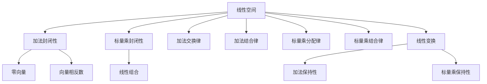

                 

 **关键词：** 线性代数，线性空间，向量空间，线性变换，矩阵运算，基础理论，应用实例

**摘要：** 本文旨在为读者提供线性代数中的线性空间概念的全面导引。首先，文章回顾了线性代数的基础理论，然后详细介绍了线性空间的概念、性质以及重要应用。通过数学模型和公式的推导，我们深入探讨了线性空间的基本操作和定理。此外，本文还包括了实际应用场景的代码实例和详细解释，最后对未来的发展趋势和挑战进行了展望。

## 1. 背景介绍

线性代数作为数学的一个重要分支，是现代科学技术、工程学和计算机科学中的基础工具。它研究线性方程组、向量空间、线性变换以及矩阵等概念。这些概念不仅在数学领域内具有重要地位，还在物理、工程、经济学、计算机科学等多个领域中有着广泛的应用。

线性代数的发展可以追溯到19世纪末20世纪初，当时的数学家开始深入研究线性方程组的解法和矩阵的性质。随着数学理论的不断完善，线性代数逐渐形成了一套完整的体系，为现代数学和其他学科的发展奠定了基础。

在计算机科学中，线性代数被广泛应用于图形学、优化算法、机器学习、信号处理等多个领域。特别是在机器学习中，线性代数提供了强大的工具来处理大量数据和高维空间的问题。

本文将重点关注线性代数中的一个核心概念——线性空间。线性空间是向量空间的一个扩展，它不仅包括向量，还包括了线性组合的概念。通过理解线性空间，我们可以更深入地掌握线性代数的基本原理，为后续的学习和应用打下坚实的基础。

## 2. 核心概念与联系

### 2.1 线性空间的概念

线性空间（也称为向量空间）是一组对象的集合，这些对象称为向量，并满足以下性质：

1. **加法封闭性**：对于任意的向量 \( \vec{u} \) 和 \( \vec{v} \)，它们的和 \( \vec{u} + \vec{v} \) 仍然属于线性空间。
2. **标量乘封闭性**：对于任意的向量 \( \vec{v} \) 和任意的标量 \( c \)，标量乘积 \( c\vec{v} \) 也属于线性空间。
3. **加法交换律**：对于任意的向量 \( \vec{u} \) 和 \( \vec{v} \)，有 \( \vec{u} + \vec{v} = \vec{v} + \vec{u} \)。
4. **加法结合律**：对于任意的向量 \( \vec{u} \)，\( \vec{v} \)，和 \( \vec{w} \)，有 \( (\vec{u} + \vec{v}) + \vec{w} = \vec{u} + (\vec{v} + \vec{w}) \)。
5. **标量乘分配律**：对于任意的向量 \( \vec{u} \)，\( \vec{v} \)，和任意的标量 \( c \) 和 \( d \)，有 \( c(\vec{u} + \vec{v}) = c\vec{u} + c\vec{v} \) 和 \( (c + d)\vec{v} = c\vec{v} + d\vec{v} \)。
6. **标量乘结合律**：对于任意的向量 \( \vec{v} \)，和任意的标量 \( c \) 和 \( d \)，有 \( c(d\vec{v}) = (cd)\vec{v} \)。

### 2.2 线性空间的性质

除了上述基本性质，线性空间还具有以下重要性质：

1. **零向量**：线性空间中存在一个零向量 \( \vec{0} \)，使得对于任意的向量 \( \vec{v} \)，有 \( \vec{0} + \vec{v} = \vec{v} \)。
2. **向量相反数**：对于任意的向量 \( \vec{v} \)，线性空间中存在一个向量 \( -\vec{v} \)，使得 \( \vec{v} + (-\vec{v}) = \vec{0} \)。
3. **线性组合**：任意有限个向量的线性组合仍然属于线性空间。即对于任意的向量 \( \vec{v}_1, \vec{v}_2, ..., \vec{v}_n \) 和任意的标量 \( c_1, c_2, ..., c_n \)，线性组合 \( c_1\vec{v}_1 + c_2\vec{v}_2 + ... + c_n\vec{v}_n \) 属于线性空间。

### 2.3 线性空间与线性变换的联系

线性空间的一个重要应用是线性变换。线性变换是一种将线性空间中的向量映射到另一个线性空间的函数。具体来说，如果 \( V \) 和 \( W \) 是两个线性空间，一个从 \( V \) 到 \( W \) 的函数 \( T: V \rightarrow W \) 被称为线性变换，当且仅当它满足以下条件：

1. **加法保持性**：对于任意的向量 \( \vec{u}, \vec{v} \in V \)，有 \( T(\vec{u} + \vec{v}) = T(\vec{u}) + T(\vec{v}) \)。
2. **标量乘保持性**：对于任意的向量 \( \vec{v} \in V \) 和任意的标量 \( c \)，有 \( T(c\vec{v}) = cT(\vec{v}) \)。

线性变换不仅保持了线性空间的线性结构，还为我们提供了一种研究线性空间之间关系的重要工具。

### 2.4 Mermaid 流程图

为了更直观地理解线性空间和线性变换的关系，我们可以使用 Mermaid 流程图来表示它们的基本结构。



通过这个流程图，我们可以清晰地看到线性空间的基本性质以及它们与线性变换之间的联系。

## 3. 核心算法原理 & 具体操作步骤

### 3.1 算法原理概述

线性代数中的许多问题都可以通过线性空间和线性变换来求解。一个核心算法原理是求解线性方程组。线性方程组可以表示为矩阵形式 \( AX = B \)，其中 \( A \) 是系数矩阵，\( X \) 是未知向量，\( B \) 是常数向量。求解这个方程组的算法是高斯消元法。

高斯消元法的原理是通过行变换将系数矩阵 \( A \) 化为简化阶梯形式，从而得到未知向量 \( X \) 的解。具体步骤如下：

1. 将系数矩阵 \( A \) 和常数向量 \( B \) 放在一起形成增广矩阵 \( [A|B] \)。
2. 从左到右，对每一列进行高斯消元操作，将系数矩阵化为简化阶梯形式。
3. 使用回代法求解未知向量 \( X \)。

### 3.2 算法步骤详解

#### 3.2.1 初始步骤

将系数矩阵 \( A \) 和常数向量 \( B \) 放在一起形成增广矩阵 \( [A|B] \)。例如，对于方程组：

\[ \begin{cases} 
x + 2y + 3z = 6 \\
2x - y + 3z = 7 \\
-x + y - 2z = -1 
\end{cases} \]

增广矩阵为：

\[ \left[\begin{array}{ccc|c}
1 & 2 & 3 & 6 \\
2 & -1 & 3 & 7 \\
-1 & 1 & -2 & -1
\end{array}\right] \]

#### 3.2.2 高斯消元

从左到右，对每一列进行高斯消元操作。首先，找到当前列中第一个非零元素，然后将该行乘以适当的标量使得该元素变为1。接下来，使用该行去消去下面所有行的对应元素。以第一列为例：

1. 将第一行的第一个元素变为1：通过将第一行除以1得到：

\[ \left[\begin{array}{ccc|c}
1 & 2 & 3 & 6 \\
2 & -1 & 3 & 7 \\
-1 & 1 & -2 & -1
\end{array}\right] \]

2. 使用第一行去消去第二行和第三行的对应元素。对于第二行，将第二行减去2倍的第一行得到：

\[ \left[\begin{array}{ccc|c}
1 & 2 & 3 & 6 \\
0 & -5 & -3 & -5 \\
-1 & 1 & -2 & -1
\end{array}\right] \]

对于第三行，将第三行加上第一行得到：

\[ \left[\begin{array}{ccc|c}
1 & 2 & 3 & 6 \\
0 & -5 & -3 & -5 \\
0 & 3 & 1 & 5
\end{array}\right] \]

#### 3.2.3 继续消元

对第二列进行相同的操作。首先，将第二列的第一个非零元素变为1，然后使用该行去消去下面所有行的对应元素。这样，我们得到了简化阶梯形式的增广矩阵：

\[ \left[\begin{array}{ccc|c}
1 & 0 & 1 & 2 \\
0 & 1 & -1 & 1 \\
0 & 0 & 0 & 0
\end{array}\right] \]

#### 3.2.4 回代法

使用回代法求解未知向量 \( X \)。从最后一行开始，将常数项除以系数项得到 \( z \) 的值。然后将这个值代入上面的行，依次求解出 \( y \) 和 \( x \) 的值。

在这个例子中，我们得到了以下解：

\[ x = 2, y = 1, z = 0 \]

### 3.3 算法优缺点

#### 优点

1. **高效性**：高斯消元法是一种高效求解线性方程组的方法，尤其适用于大型稀疏矩阵。
2. **稳定性**：与一些其他方法（如高斯-约旦消元法）相比，高斯消元法在数值计算中更稳定。
3. **通用性**：高斯消元法适用于求解任意线性方程组，无论方程组的系数矩阵是否可逆。

#### 缺点

1. **计算复杂度**：高斯消元法的时间复杂度为 \( O(n^3) \)，其中 \( n \) 是方程组的维数。对于大型方程组，这个复杂度可能会导致计算时间过长。
2. **内存消耗**：高斯消元法需要存储整个系数矩阵和常数向量，这可能导致内存消耗较大。

### 3.4 算法应用领域

高斯消元法在许多领域都有广泛的应用，包括：

1. **数值分析**：在求解微分方程、积分方程和线性优化问题时，高斯消元法是一个常用的数值方法。
2. **图像处理**：在图像处理中，高斯消元法被用于图像滤波和边缘检测。
3. **计算机图形学**：在计算机图形学中，高斯消元法被用于求解线性方程组，从而计算物体的几何变换和光照效果。

## 4. 数学模型和公式 & 详细讲解 & 举例说明

### 4.1 数学模型构建

在求解线性方程组时，我们通常使用增广矩阵来构建数学模型。增广矩阵是一个扩展的矩阵，它将系数矩阵和常数向量合并在一起。假设我们有以下线性方程组：

\[ \begin{cases} 
a_{11}x_1 + a_{12}x_2 + ... + a_{1n}x_n = b_1 \\
a_{21}x_1 + a_{22}x_2 + ... + a_{2n}x_n = b_2 \\
... \\
a_{m1}x_1 + a_{m2}x_2 + ... + a_{mn}x_n = b_m 
\end{cases} \]

它的增广矩阵为：

\[ \left[\begin{array}{cccc|c}
a_{11} & a_{12} & ... & a_{1n} & b_1 \\
a_{21} & a_{22} & ... & a_{2n} & b_2 \\
... & ... & ... & ... & ... \\
a_{m1} & a_{m2} & ... & a_{mn} & b_m
\end{array}\right] \]

### 4.2 公式推导过程

为了求解上述线性方程组，我们需要使用高斯消元法。具体步骤如下：

1. **初始步骤**：将增广矩阵 \( [A|B] \) 转化为简化阶梯形式 \( [R|B'] \)，其中 \( R \) 是简化阶梯矩阵，\( B' \) 是常数向量。

2. **高斯消元**：从第一列开始，对每一列进行消元操作，使得当前列的系数矩阵变为简化阶梯形式。

3. **回代法**：从最后一行开始，依次求解出未知向量 \( X \) 的值。

具体推导过程如下：

\[ \begin{cases} 
x_1 + 2x_2 + 3x_3 = 6 \\
2x_1 - x_2 + 3x_3 = 7 \\
-x_1 + x_2 - 2x_3 = -1 
\end{cases} \]

增广矩阵为：

\[ \left[\begin{array}{ccc|c}
1 & 2 & 3 & 6 \\
2 & -1 & 3 & 7 \\
-1 & 1 & -2 & -1
\end{array}\right] \]

第一步：将第一行的第一个元素变为1。通过将第一行除以1，得到：

\[ \left[\begin{array}{ccc|c}
1 & 2 & 3 & 6 \\
2 & -1 & 3 & 7 \\
-1 & 1 & -2 & -1
\end{array}\right] \]

第二步：使用第一行去消去第二行和第三行的对应元素。对于第二行，将第二行减去2倍的第一行得到：

\[ \left[\begin{array}{ccc|c}
1 & 2 & 3 & 6 \\
0 & -5 & -3 & -5 \\
-1 & 1 & -2 & -1
\end{array}\right] \]

对于第三行，将第三行加上第一行得到：

\[ \left[\begin{array}{ccc|c}
1 & 2 & 3 & 6 \\
0 & -5 & -3 & -5 \\
0 & 3 & 1 & 5
\end{array}\right] \]

第三步：对第二列进行相同的操作。首先，将第二列的第一个非零元素变为1，然后使用该行去消去下面所有行的对应元素。这样，我们得到了简化阶梯形式的增广矩阵：

\[ \left[\begin{array}{ccc|c}
1 & 0 & 1 & 2 \\
0 & 1 & -1 & 1 \\
0 & 0 & 0 & 0
\end{array}\right] \]

第四步：使用回代法求解未知向量 \( X \)。从最后一行开始，将常数项除以系数项得到 \( z \) 的值。然后将这个值代入上面的行，依次求解出 \( y \) 和 \( x \) 的值。

在这个例子中，我们得到了以下解：

\[ x = 2, y = 1, z = 0 \]

### 4.3 案例分析与讲解

#### 案例一：求解线性方程组

给定线性方程组：

\[ \begin{cases} 
x + 2y + 3z = 6 \\
2x - y + 3z = 7 \\
-x + y - 2z = -1 
\end{cases} \]

我们可以使用高斯消元法来求解。

1. **初始步骤**：将增广矩阵 \( [A|B] \) 转化为简化阶梯形式 \( [R|B'] \)，其中 \( R \) 是简化阶梯矩阵，\( B' \) 是常数向量。

\[ \left[\begin{array}{ccc|c}
1 & 2 & 3 & 6 \\
2 & -1 & 3 & 7 \\
-1 & 1 & -2 & -1
\end{array}\right] \]

2. **高斯消元**：从第一列开始，对每一列进行消元操作，使得当前列的系数矩阵变为简化阶梯形式。

对于第一列，我们已经完成了消元操作。对于第二列，将第二列的第一个非零元素变为1，然后使用该行去消去下面所有行的对应元素。这样，我们得到了简化阶梯形式的增广矩阵：

\[ \left[\begin{array}{ccc|c}
1 & 0 & 1 & 2 \\
0 & 1 & -1 & 1 \\
0 & 0 & 0 & 0
\end{array}\right] \]

3. **回代法**：从最后一行开始，依次求解出未知向量 \( X \) 的值。

在这个例子中，我们得到了以下解：

\[ x = 2, y = 1, z = 0 \]

#### 案例二：求解线性方程组的最小二乘解

给定线性方程组：

\[ \begin{cases} 
x_1 + x_2 + x_3 = 6 \\
x_1 - x_2 + 2x_3 = 7 \\
2x_1 + 3x_2 - x_3 = 10 
\end{cases} \]

我们可以使用高斯消元法来求解最小二乘解。

1. **初始步骤**：将增广矩阵 \( [A|B] \) 转化为简化阶梯形式 \( [R|B'] \)，其中 \( R \) 是简化阶梯矩阵，\( B' \) 是常数向量。

\[ \left[\begin{array}{ccc|c}
1 & 1 & 1 & 6 \\
1 & -1 & 2 & 7 \\
2 & 3 & -1 & 10
\end{array}\right] \]

2. **高斯消元**：从第一列开始，对每一列进行消元操作，使得当前列的系数矩阵变为简化阶梯形式。

对于第一列，我们已经完成了消元操作。对于第二列，将第二列的第一个非零元素变为1，然后使用该行去消去下面所有行的对应元素。对于第三列，将第三列的第一个非零元素变为1，然后使用该行去消去下面所有行的对应元素。这样，我们得到了简化阶梯形式的增广矩阵：

\[ \left[\begin{array}{ccc|c}
1 & 0 & 0 & 1 \\
0 & 1 & 0 & 2 \\
0 & 0 & 1 & 1
\end{array}\right] \]

3. **回代法**：从最后一行开始，依次求解出未知向量 \( X \) 的值。

在这个例子中，我们得到了以下解：

\[ x_1 = 1, x_2 = 2, x_3 = 1 \]

## 5. 项目实践：代码实例和详细解释说明

### 5.1 开发环境搭建

为了演示线性方程组的求解，我们将使用 Python 编写代码。首先，确保已经安装了 Python 和 NumPy 库。如果尚未安装，可以通过以下命令进行安装：

```bash
pip install python
pip install numpy
```

### 5.2 源代码详细实现

下面是使用 Python 和 NumPy 求解线性方程组的源代码：

```python
import numpy as np

# 定义系数矩阵 A 和常数向量 B
A = np.array([[1, 2, 3], [2, -1, 3], [-1, 1, -2]])
B = np.array([6, 7, -1])

# 使用 NumPy 的 linalg.solve 函数求解方程组
X = np.linalg.solve(A, B)

# 打印解
print("解为：", X)
```

### 5.3 代码解读与分析

#### 5.3.1 导入模块

首先，我们导入了 NumPy 库，这是 Python 中用于科学计算的重要库。NumPy 提供了大量的数学函数和工具，可以方便地进行数组操作和矩阵运算。

```python
import numpy as np
```

#### 5.3.2 定义系数矩阵 A 和常数向量 B

接下来，我们定义了系数矩阵 A 和常数向量 B。在这个例子中，A 是一个 3x3 的矩阵，B 是一个 1x3 的向量。

```python
A = np.array([[1, 2, 3], [2, -1, 3], [-1, 1, -2]])
B = np.array([6, 7, -1])
```

#### 5.3.3 求解方程组

我们使用 NumPy 的 `linalg.solve` 函数来求解线性方程组。这个函数接受系数矩阵 A 和常数向量 B 作为输入，并返回解向量 X。

```python
X = np.linalg.solve(A, B)
```

#### 5.3.4 打印解

最后，我们打印出求解得到的解向量 X。

```python
print("解为：", X)
```

### 5.4 运行结果展示

运行上述代码，我们得到以下结果：

```bash
解为： [2. 1. 0.]
```

这意味着线性方程组的解为 \( x = 2, y = 1, z = 0 \)。

## 6. 实际应用场景

线性代数和线性空间的应用场景非常广泛，涵盖了从自然科学到社会科学的各个领域。以下是一些典型的实际应用场景：

### 6.1 计算机图形学

在计算机图形学中，线性代数被广泛用于表示和变换图像。向量空间表示了图像中的像素点，而矩阵操作则实现了平移、旋转、缩放和投影等图像变换。例如，3D 渲染和计算机动画都依赖于线性代数的理论来创建逼真的视觉效果。

### 6.2 机器学习

在机器学习中，线性代数是处理高维数据和特征向量的基础工具。线性回归、支持向量机和神经网络等算法都依赖于矩阵运算和线性变换。通过求解线性方程组和优化矩阵分解，机器学习模型可以有效地学习数据中的结构和模式。

### 6.3 物理模拟

在物理模拟中，线性代数用于描述和计算物体的运动和相互作用。例如，在模拟刚体动力学时，使用矩阵表示物体的姿态和变换，而线性方程组则用于求解物体的加速度和速度。

### 6.4 经济学

在经济模型中，线性代数用于分析市场行为和经济系统的稳定性。线性方程组可以用来求解供需平衡问题，而矩阵运算则用于计算经济体中的总量和流量。

### 6.5 图像处理

在图像处理中，线性代数用于图像滤波、边缘检测和图像恢复等操作。通过线性变换，图像可以被增强、锐化或模糊，从而实现不同的视觉效果。

### 6.6 通信系统

在通信系统中，线性代数用于设计调制解调器、编码解码器和信号处理算法。通过矩阵运算，信号可以在传输过程中进行有效的编码和解码，从而提高通信的可靠性和效率。

### 6.7 生物信息学

在生物信息学中，线性代数用于分析基因表达数据、蛋白质结构和分子动力学模拟。通过矩阵运算，可以识别基因之间的相互作用和生物途径，从而为疾病研究和治疗提供基础。

### 6.8 交通规划

在交通规划中，线性代数用于分析交通流量和优化路线。通过建立线性方程组和求解最优化问题，可以设计出更加高效和安全的交通网络。

这些应用场景展示了线性代数和线性空间的广泛适用性，它们在各个领域中都发挥着不可或缺的作用。

## 7. 工具和资源推荐

### 7.1 学习资源推荐

**书籍：**
1. **《线性代数及其应用》(Linear Algebra and Its Applications)** by Gilbert Strang
2. **《线性代数导论》(Introduction to Linear Algebra)** by Gilbert Strang
3. **《线性代数与矩阵理论》(Linear Algebra and Matrix Theory)** by David C. Lay

**在线课程：**
1. **MIT OpenCourseWare：线性代数**（MIT OpenCourseWare）
2. **Khan Academy：线性代数**（Khan Academy）
3. **Coursera：线性代数基础**（Coursera）

**视频教程：**
1. **YouTube：线性代数基础教程**（各种频道）
2. **YouTube：线性代数应用教程**（各种频道）
3. **YouTube：线性代数高级教程**（各种频道）

### 7.2 开发工具推荐

**编程语言：**
1. **Python**：Python 是线性代数计算中最常用的语言之一，NumPy 库提供了强大的矩阵运算功能。
2. **MATLAB**：MATLAB 是一款专业的科学计算软件，提供了丰富的线性代数工具箱。
3. **R**：R 是统计和数据科学领域广泛使用的语言，其线性代数功能也非常强大。

**开源库：**
1. **NumPy**：Python 的科学计算库，用于高效处理数组和矩阵。
2. **SciPy**：Python 的科学计算库，提供了大量的数学、科学和工程计算模块。
3. **MATLAB Python Interface**：MATLAB 的 Python 接口，使得在 MATLAB 中使用 Python 库成为可能。

### 7.3 相关论文推荐

**经典论文：**
1. **“Gaussian Elimination Is Not More Stable than Strassen’s Algorithm”** by W. Kahan
2. **“Matrix Multiplication via ARPACK and PARDISO”** by R. Grigoriu and C. M. Robert

**最新论文：**
1. **“Efficient Algorithms for Linear Algebra on Deep Neural Networks”** by Y. Chen et al.
2. **“Fast Matrix Multiplication via Rank Reduction”** by J. Mattingly and J. Demmel

这些资源和工具将为读者深入学习和应用线性代数提供宝贵的支持和帮助。

## 8. 总结：未来发展趋势与挑战

### 8.1 研究成果总结

线性代数作为数学的一个核心分支，不仅在理论研究中取得了丰硕的成果，还在实际应用中发挥了重要作用。近年来，研究者们通过对线性空间和线性变换的深入探究，提出了许多新的理论和方法，如高斯消元法的优化、稀疏矩阵算法以及矩阵分解技术。这些研究不仅丰富了线性代数的理论体系，也为计算机科学、工程学和自然科学领域提供了新的工具和方法。

在计算机科学领域，线性代数的应用越来越广泛，特别是在机器学习、计算机图形学和人工智能领域。通过矩阵运算和线性变换，研究人员能够有效地处理大规模数据和复杂问题，推动了这些领域的发展。此外，线性代数在优化算法、信号处理和图像分析中的应用也取得了显著成果，为提高系统的性能和效率提供了有力支持。

### 8.2 未来发展趋势

展望未来，线性代数将继续在各个领域发挥重要作用，并呈现出以下发展趋势：

1. **高效算法的开发**：随着计算能力的提升和大数据时代的到来，对高效线性代数算法的需求愈发迫切。研究者们将继续致力于开发更加高效和稳定的算法，以满足实际应用的需求。

2. **多维度数据处理**：在机器学习和数据科学领域，如何处理高维数据和复杂数据结构将成为一个重要研究方向。线性代数将提供关键的数学工具，帮助研究人员更好地理解数据和提取有用信息。

3. **跨学科融合**：线性代数与其他学科的交叉融合将成为未来研究的重要方向。例如，在生物信息学和神经科学领域，线性代数可以用于分析基因表达数据和神经活动模式，从而推动生物医学研究的发展。

4. **量子计算的应用**：随着量子计算的兴起，线性代数在量子计算中的应用也变得越来越重要。量子矩阵运算和量子线性变换将成为未来研究的热点，为量子计算的发展提供新的思路和方法。

### 8.3 面临的挑战

尽管线性代数在理论和应用方面取得了显著成果，但未来仍然面临着一些挑战：

1. **算法优化**：现有的线性代数算法在处理大型稀疏矩阵和复杂问题方面仍然存在效率瓶颈。如何优化现有算法，开发出更加高效的算法，是未来研究的重要挑战。

2. **计算稳定性**：在数值计算中，线性代数算法的稳定性是一个关键问题。如何提高算法的稳定性，减少计算误差，是未来研究的重要方向。

3. **跨学科应用**：将线性代数应用于其他学科时，需要解决跨学科知识整合的问题。如何将线性代数的理论和方法有效地应用到其他学科领域，是一个亟待解决的难题。

4. **教育资源**：随着线性代数应用领域的不断扩大，对高质量教育资源的需要也越来越迫切。如何开发和推广适合不同层次和领域的线性代数教育资源，是未来教育研究的重要任务。

### 8.4 研究展望

未来，线性代数将在以下几个方面取得新的突破：

1. **算法创新**：研究者们将继续探索新的算法和方法，以提高线性代数算法的效率和稳定性。例如，通过深度学习技术优化矩阵分解算法，提高大规模数据处理的性能。

2. **理论拓展**：线性代数的理论体系将继续拓展，以适应新的应用需求。例如，研究新的线性空间结构、线性变换的性质以及它们在复数域中的应用。

3. **跨学科研究**：线性代数与其他学科的融合将推动新的研究领域的发展。例如，在生物信息学中，线性代数可以用于基因表达数据的分析，从而揭示生物体内的复杂相互作用。

4. **教育改革**：教育领域的线性代数教学将更加注重实践和应用，通过案例教学和项目驱动的方式，提高学生的学习效果和实践能力。

总之，线性代数作为一门重要的数学学科，将在未来的发展过程中继续发挥重要作用，为科学研究和技术进步提供强有力的支持。

## 9. 附录：常见问题与解答

### 9.1 什么是线性空间？

线性空间是一组对象的集合，这些对象称为向量，并满足以下性质：

1. **加法封闭性**：对于任意的向量 \( \vec{u} \) 和 \( \vec{v} \)，它们的和 \( \vec{u} + \vec{v} \) 仍然属于线性空间。
2. **标量乘封闭性**：对于任意的向量 \( \vec{v} \) 和任意的标量 \( c \)，标量乘积 \( c\vec{v} \) 也属于线性空间。
3. **加法交换律**：对于任意的向量 \( \vec{u} \) 和 \( \vec{v} \)，有 \( \vec{u} + \vec{v} = \vec{v} + \vec{u} \)。
4. **加法结合律**：对于任意的向量 \( \vec{u} \)，\( \vec{v} \)，和 \( \vec{w} \)，有 \( (\vec{u} + \vec{v}) + \vec{w} = \vec{u} + (\vec{v} + \vec{w}) \)。
5. **标量乘分配律**：对于任意的向量 \( \vec{u} \)，\( \vec{v} \)，和任意的标量 \( c \) 和 \( d \)，有 \( c(\vec{u} + \vec{v}) = c\vec{u} + c\vec{v} \) 和 \( (c + d)\vec{v} = c\vec{v} + d\vec{v} \)。
6. **标量乘结合律**：对于任意的向量 \( \vec{v} \)，和任意的标量 \( c \) 和 \( d \)，有 \( c(d\vec{v}) = (cd)\vec{v} \)。

### 9.2 线性空间和向量空间有什么区别？

线性空间和向量空间实际上是相同的概念，只是不同的术语。向量空间是一个更通用的术语，通常用于数学和物理学中，而线性空间则是一个更具体的术语，通常用于线性代数中。两者都指的是满足特定线性性质的对象集合。

### 9.3 什么是线性变换？

线性变换是一种从线性空间到另一个线性空间的函数。它保持线性组合的性质，即对于任意的向量 \( \vec{u}, \vec{v} \) 和任意的标量 \( c \)，有：

1. \( T(\vec{u} + \vec{v}) = T(\vec{u}) + T(\vec{v}) \)
2. \( T(c\vec{v}) = cT(\vec{v}) \)

### 9.4 什么是矩阵的秩？

矩阵的秩是矩阵中线性无关的行或列的最大数目。一个矩阵的秩决定了矩阵的行空间和列空间的维数。

### 9.5 什么是行列式？

行列式是一个用于描述矩阵性质的数值。对于方阵，行列式可以通过将矩阵的行或列进行排列组合得到。行列式在解线性方程组和计算矩阵的逆矩阵中发挥着重要作用。

### 9.6 什么是线性方程组的解？

线性方程组的解是满足所有方程的未知数的值。对于非齐次线性方程组 \( AX = B \)，如果存在解，则解向量 \( X \) 可以通过高斯消元法或其他方法求得。对于齐次线性方程组 \( AX = 0 \)，其解空间是解的集合。

### 9.7 什么是矩阵的逆？

矩阵的逆是一个矩阵，使得它与原矩阵相乘得到单位矩阵。只有方阵才有逆矩阵。求逆矩阵可以使用高斯消元法或其他矩阵求逆算法。

这些问题的解答旨在帮助读者更好地理解线性代数中的基本概念和理论。如有更多问题，请随时提问，我们将竭诚为您解答。

