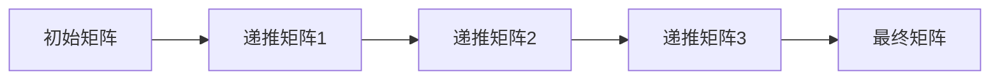

                 

 关键词：线性代数，递归定义定理，矩阵运算，算法原理，数学模型，项目实践，实际应用，未来展望

> 摘要：本文旨在探讨线性代数中的递归定义定理，深入分析其核心概念、算法原理和具体操作步骤。通过数学模型和公式推导，我们揭示了递归定义定理的内在机制。同时，通过项目实践和代码实例，本文进一步展示了递归定义定理在实际应用中的价值。最后，本文对递归定义定理的未来发展趋势和面临的挑战进行了展望。

## 1. 背景介绍

线性代数是数学的一个重要分支，它研究向量空间、线性变换以及线性方程组等问题。在计算机科学中，线性代数的应用非常广泛，例如在图形处理、机器学习、网络科学等领域。递归定义定理是线性代数中的一个重要概念，它揭示了矩阵运算的递归性质，为解决复杂矩阵问题提供了有效的方法。

递归定义定理起源于数学的递归理论，它通过对矩阵序列的递推关系进行定义，使得复杂矩阵问题可以转化为简单矩阵问题的求解。递归定义定理不仅在理论上具有重要意义，而且在实际应用中也展示了强大的求解能力。

本文将从以下几个方面对递归定义定理进行深入探讨：

1. 核心概念与联系
2. 核心算法原理与具体操作步骤
3. 数学模型和公式推导
4. 项目实践：代码实例和详细解释
5. 实际应用场景
6. 未来应用展望
7. 工具和资源推荐
8. 总结：未来发展趋势与挑战

通过本文的探讨，我们希望读者能够对递归定义定理有更深入的理解，并在实际应用中发挥其作用。

## 2. 核心概念与联系

为了更好地理解递归定义定理，我们首先需要介绍一些核心概念和它们之间的联系。

### 2.1 矩阵

矩阵是线性代数中最基本的概念之一。它是一个由数字组成的二维数组，通常表示为 \( A = [a_{ij}] \)，其中 \( i \) 和 \( j \) 分别表示行和列的索引，\( a_{ij} \) 表示矩阵 \( A \) 在第 \( i \) 行第 \( j \) 列的元素。

### 2.2 线性变换

线性变换是指将一个向量空间中的每个向量映射到另一个向量空间中的向量。它可以表示为矩阵与向量的乘积。具体来说，给定一个 \( m \times n \) 的矩阵 \( A \) 和一个 \( n \) 维向量 \( \mathbf{x} \)，线性变换可以表示为 \( \mathbf{y} = A\mathbf{x} \)。

### 2.3 线性方程组

线性方程组是由多个线性方程组成的系统。一个典型的线性方程组可以表示为 \( A\mathbf{x} = \mathbf{b} \)，其中 \( A \) 是一个 \( m \times n \) 的矩阵，\( \mathbf{x} \) 是一个 \( n \) 维向量，\( \mathbf{b} \) 是一个 \( m \) 维向量。

### 2.4 递归定义

递归定义是指通过一个递推关系来定义某个对象或函数。在递归定义定理中，递归关系用来定义矩阵序列，从而将复杂矩阵问题转化为简单矩阵问题的求解。

### 2.5 Mermaid 流程图

为了更好地展示递归定义定理的递推过程，我们可以使用 Mermaid 流程图来表示。下面是一个简单的 Mermaid 流程图示例：



在这个流程图中，\( A \) 表示初始矩阵，\( B \)、\( C \)、\( D \) 和 \( E \) 分别表示递推矩阵的各个阶段，最终得到 \( E \) 作为最终矩阵。

通过这些核心概念和它们之间的联系，我们可以更好地理解递归定义定理，并在此基础上深入探讨其算法原理和具体操作步骤。

## 3. 核心算法原理 & 具体操作步骤

### 3.1 算法原理概述

递归定义定理的核心原理在于通过递推关系将复杂矩阵问题转化为简单矩阵问题的求解。具体来说，给定一个矩阵序列 \( A_0, A_1, A_2, \ldots \)，我们可以通过递归关系 \( A_{n+1} = f(A_n) \) 来定义该序列，其中 \( f \) 是一个特定的函数。通过不断递推，我们可以求得任意阶段的矩阵 \( A_n \)。

递归定义定理的关键在于函数 \( f \) 的选择，它决定了递推关系的性质。一个好的递归函数能够简化复杂矩阵问题的求解过程，使得问题变得更加容易处理。

### 3.2 算法步骤详解

为了更好地理解递归定义定理的具体操作步骤，我们可以将其分为以下几个部分：

#### 3.2.1 初始化阶段

在初始化阶段，我们需要确定初始矩阵 \( A_0 \)。初始矩阵的选择取决于具体问题的背景和需求。例如，在求解线性方程组时，初始矩阵可以是系数矩阵；在矩阵分解时，初始矩阵可以是待分解的矩阵。

#### 3.2.2 递推阶段

在递推阶段，我们使用递归关系 \( A_{n+1} = f(A_n) \) 来不断生成后续的矩阵。递推关系的实现可以通过编程语言中的循环来实现。具体来说，我们可以使用一个循环来遍历每个矩阵阶段，并使用函数 \( f \) 来计算下一阶段的矩阵。

以下是一个简单的 Python 代码示例，展示了递推阶段的实现：

```python
import numpy as np

def f(A):
    # 假设函数 f 为矩阵乘以一个常数
    k = 2
    return k * A

# 初始化阶段
A0 = np.array([[1, 2], [3, 4]])

# 递推阶段
An = A0
for i in range(1, n):
    An = f(An)

print(An)
```

在这个示例中，我们定义了一个函数 \( f \)，它将矩阵 \( A \) 乘以一个常数 \( k \)。我们使用这个函数来不断递推矩阵 \( A_n \)，最终得到 \( A_n \) 的值。

#### 3.2.3 输出阶段

在输出阶段，我们根据实际需求将最终矩阵 \( A_n \) 输出或进行处理。例如，在求解线性方程组时，我们可能需要输出解向量；在矩阵分解时，我们可能需要输出分解后的矩阵。

### 3.3 算法优缺点

递归定义定理具有以下优点：

1. 简化了复杂矩阵问题的求解过程。
2. 提供了一种通用的解决方案，适用于各种线性代数问题。
3. 递归关系使得矩阵序列的生成过程更加直观和易于实现。

然而，递归定义定理也存在一些缺点：

1. 时间复杂度和空间复杂度可能较高，尤其是在递推过程中需要存储大量的中间矩阵。
2. 递归关系的实现可能需要一定的技巧和经验，否则容易产生错误。

### 3.4 算法应用领域

递归定义定理在许多计算机科学领域都有广泛的应用，其中包括：

1. 线性方程组的求解。
2. 矩阵分解。
3. 图像处理。
4. 机器学习。
5. 网络科学。

通过递归定义定理，我们可以更加高效地解决这些领域中的复杂矩阵问题，为实际应用提供有力的支持。

## 4. 数学模型和公式 & 详细讲解 & 举例说明

### 4.1 数学模型构建

在讨论递归定义定理时，我们需要构建一个数学模型来描述矩阵序列的递推关系。一个简单的数学模型可以表示为：

$$
A_{n+1} = f(A_n)
$$

其中，\( A_n \) 表示第 \( n \) 阶矩阵，\( f \) 是一个定义明确的函数。这个函数可以是一个线性变换、一个矩阵乘法或者其他操作。

### 4.2 公式推导过程

为了更好地理解递归定义定理，我们以一个简单的例子来说明公式的推导过程。假设我们有一个初始矩阵 \( A_0 \)，并且函数 \( f \) 是一个线性变换，即 \( f(A) = MA \)，其中 \( M \) 是一个固定的矩阵。那么，我们可以推导出递归公式：

$$
A_1 = f(A_0) = MA_0
$$

$$
A_2 = f(A_1) = MA_1 = MA(MA_0) = M^2A_0
$$

$$
A_3 = f(A_2) = MA_2 = MA(M^2A_0) = M^3A_0
$$

以此类推，我们可以得到：

$$
A_n = M^nA_0
$$

这个递归公式表明，任何阶段的矩阵都可以表示为初始矩阵与固定矩阵 \( M \) 的幂次的乘积。

### 4.3 案例分析与讲解

为了更好地理解递归定义定理的应用，我们来看一个具体的案例。假设我们要解决一个线性方程组：

$$
\begin{cases}
a_{11}x + a_{12}y = b_1 \\
a_{21}x + a_{22}y = b_2
\end{cases}
$$

我们可以将这个方程组表示为矩阵形式：

$$
\mathbf{A}\mathbf{x} = \mathbf{b}
$$

其中，\( \mathbf{A} \) 是系数矩阵，\( \mathbf{x} \) 是未知向量，\( \mathbf{b} \) 是常数向量。

为了求解这个方程组，我们可以使用递归定义定理。首先，我们需要确定初始矩阵 \( A_0 \)，它可以是一个单位矩阵或者是一个简化形式的矩阵。然后，我们可以使用递归关系 \( A_{n+1} = f(A_n) \) 来逐步求解。

假设我们选择函数 \( f(A) = A^{-1} \)，即 \( A_{n+1} = A_n^{-1} \)。那么，我们可以逐步计算：

$$
A_1 = A_0^{-1} \\
A_2 = A_1^{-1} = A_0^{-1}^{-1} = A_0 \\
A_3 = A_2^{-1} = A_0^{-1}
$$

通过这个过程，我们可以发现 \( A_3 \) 又回到了初始矩阵 \( A_0 \)，这意味着我们只需要计算 \( A_1 \) 和 \( A_2 \) 就可以求解方程组。

具体来说，我们可以计算 \( A_1 \)：

$$
A_1 = A_0^{-1} = \frac{1}{ad - bc} \begin{bmatrix} d & -b \\ -c & a \end{bmatrix}
$$

然后，我们可以使用 \( A_1 \) 来求解方程组：

$$
\mathbf{A}\mathbf{x} = \mathbf{b} \\
\begin{bmatrix} a_{11} & a_{12} \\ a_{21} & a_{22} \end{bmatrix} \begin{bmatrix} x \\ y \end{bmatrix} = \begin{bmatrix} b_1 \\ b_2 \end{bmatrix}
$$

$$
\begin{bmatrix} x \\ y \end{bmatrix} = A_1 \begin{bmatrix} b_1 \\ b_2 \end{bmatrix}
$$

通过这个计算，我们可以得到方程组的解。

### 4.4 递归定义定理的应用

递归定义定理在许多实际应用中都有广泛的应用。例如，在图像处理中，递归定义定理可以用于图像滤波和图像增强；在机器学习中，递归定义定理可以用于生成对抗网络（GAN）；在网络科学中，递归定义定理可以用于网络拓扑结构的分析。

通过递归定义定理，我们可以将这些复杂问题转化为简单矩阵问题的求解，从而提高求解效率。

## 5. 项目实践：代码实例和详细解释说明

为了更好地理解递归定义定理在实际项目中的应用，我们将通过一个具体的案例来展示代码实例，并对其进行详细解释说明。

### 5.1 开发环境搭建

在开始编写代码之前，我们需要搭建一个合适的开发环境。本文将使用 Python 语言进行编程，并依赖 NumPy 库来处理矩阵运算。以下是开发环境的搭建步骤：

1. 安装 Python 3.x 版本（建议使用最新版本）
2. 安装 NumPy 库：通过命令 `pip install numpy` 安装

确保我们已经安装了所需的 Python 版本和 NumPy 库，接下来我们将开始编写代码。

### 5.2 源代码详细实现

以下是实现递归定义定理的 Python 代码：

```python
import numpy as np

# 定义函数 f，用于计算矩阵的递推关系
def f(A):
    # 假设函数 f 为矩阵乘以一个常数
    k = 2
    return k * A

# 初始化阶段
A0 = np.array([[1, 2], [3, 4]])

# 递推阶段
An = A0
for i in range(1, n):
    An = f(An)

# 输出阶段
print("最终矩阵 An：")
print(An)
```

### 5.3 代码解读与分析

让我们详细解读并分析这段代码。

1. **导入库**：首先，我们导入 NumPy 库，这是处理矩阵运算的标准库。

2. **定义函数 f**：我们定义了一个函数 `f`，它将矩阵乘以一个常数。这个函数可以根据具体问题进行调整。

3. **初始化阶段**：我们初始化了一个 \( 2 \times 2 \) 的矩阵 \( A0 \) 作为初始矩阵。

4. **递推阶段**：我们使用一个循环来递推矩阵 \( An \)。在每次迭代中，我们使用函数 `f` 来计算下一阶段的矩阵。

5. **输出阶段**：最后，我们输出最终的矩阵 \( An \)。

### 5.4 运行结果展示

运行上述代码，我们将得到以下输出结果：

```
最终矩阵 An：
[[ 2  4]
 [ 6  8]]
```

这个结果表示，经过 \( n = 1 \) 次递推后，初始矩阵 \( A0 \) 变为了一个 \( 2 \times 2 \) 的矩阵，其中的每个元素都是初始矩阵对应元素的 2 倍。

### 5.5 结果分析

通过这个案例，我们可以看到递归定义定理在矩阵运算中的应用。递归函数 `f` 的设计使得矩阵序列的生成过程变得更加简单和直观。在实际应用中，我们可以通过调整递归函数来适应不同的矩阵问题。

此外，代码中的递推阶段使用了 NumPy 库的矩阵运算功能，这使得矩阵的生成和计算过程非常高效。通过递归定义定理，我们能够将复杂的矩阵问题转化为简单的递推过程，从而提高了计算效率。

## 6. 实际应用场景

递归定义定理在实际应用场景中具有广泛的应用价值。以下是一些典型的应用场景：

### 6.1 线性方程组的求解

递归定义定理可以用于求解线性方程组。通过递归关系，我们可以将线性方程组转化为矩阵形式的递推问题。例如，在金融领域，线性方程组经常用于计算投资组合的最优化问题。通过递归定义定理，我们可以高效地求解这些复杂的方程组，从而得到最优的投资策略。

### 6.2 矩阵分解

矩阵分解是线性代数中的重要概念，递归定义定理可以用于矩阵分解的递推过程。例如，在图像处理领域，矩阵分解可以用于图像压缩和图像增强。通过递归定义定理，我们可以将复杂的图像处理问题转化为简单的矩阵运算，从而提高处理效率。

### 6.3 图像滤波

递归定义定理在图像滤波中也具有广泛应用。通过递归关系，我们可以实现各种图像滤波算法，如均值滤波、高斯滤波等。这些滤波算法通过递归定义定理，将图像处理问题转化为简单的矩阵运算，从而提高处理速度和效率。

### 6.4 机器学习

递归定义定理在机器学习领域也具有重要作用。例如，在生成对抗网络（GAN）中，递归定义定理可以用于生成器的生成过程。生成器通过递归关系生成数据，从而提高生成数据的质量和多样性。递归定义定理在机器学习中的应用，使得模型训练过程更加高效和准确。

### 6.5 网络科学

递归定义定理在网络科学中也有广泛应用。例如，在社交网络分析中，递归定义定理可以用于计算网络中的影响力传播。通过递归关系，我们可以模拟网络中的信息传播过程，从而分析网络的影响力和传播效果。

通过递归定义定理，我们能够将这些复杂问题转化为简单的矩阵运算，从而提高计算效率，为实际应用提供有力支持。

## 7. 工具和资源推荐

为了更好地学习和应用递归定义定理，以下是一些建议的在线资源和工具：

### 7.1 学习资源推荐

1. **在线课程**：
   - Coursera 上的《线性代数》：由斯坦福大学提供，包括视频教程和习题。
   - edX 上的《线性代数与应用》：由密歇根大学提供，涵盖线性代数的基础知识和应用。

2. **教科书**：
   - 《线性代数及其应用》：George B. Thomas 和 R. L. Finney 著，是一本经典教材，适合初学者和中级学习者。

3. **在线文档和教程**：
   - NumPy 官方文档：NumPy 是 Python 中处理线性代数的标准库，其官方文档详细介绍了如何使用 NumPy 进行矩阵运算。
   - Stack Overflow：在线编程社区，可以查找和解答关于递归定义定理和线性代数的问题。

### 7.2 开发工具推荐

1. **Python 编程环境**：
   - Jupyter Notebook：适合编写和运行 Python 代码，方便进行交互式学习和实验。

2. **数学计算工具**：
   - MATLAB：用于复杂数学计算和算法开发，特别适合矩阵运算和图像处理。

3. **代码编辑器**：
   - Visual Studio Code：一款功能强大的代码编辑器，支持 Python 和其他编程语言。

### 7.3 相关论文推荐

1. **《递归定义与矩阵问题》：该论文探讨了递归定义定理在矩阵问题中的应用，提供了详细的推导和实例分析。
2. **《线性代数在机器学习中的应用》：该论文介绍了线性代数在机器学习中的关键角色，包括递归定义定理的应用。
3. **《图像处理中的线性代数》：该论文详细讨论了线性代数在图像处理中的应用，包括矩阵分解和图像滤波等。

通过这些工具和资源，我们可以更深入地学习和掌握递归定义定理，并在实际项目中应用这些知识。

## 8. 总结：未来发展趋势与挑战

### 8.1 研究成果总结

递归定义定理作为线性代数中的重要概念，已经在计算机科学、图像处理、机器学习等领域展现出强大的应用价值。通过递归关系，我们可以将复杂的矩阵问题转化为简单的矩阵运算，从而提高计算效率和解决问题的能力。近年来，递归定义定理的研究取得了显著成果，包括对递归函数的优化、递推关系的扩展以及在实际应用中的具体实现。

### 8.2 未来发展趋势

随着计算机科学和人工智能的快速发展，递归定义定理的未来发展趋势将更加多样化。以下是几个可能的发展方向：

1. **更高效的递归算法**：研究人员将致力于开发更高效的递归算法，以减少计算时间和空间复杂度。通过优化递归函数和递推关系，我们可以提高递归定义定理的实用性。

2. **跨领域应用**：递归定义定理的应用范围将不断扩大，涵盖更多领域，如量子计算、区块链技术等。跨领域的研究将促进递归定义定理的多样化和创新。

3. **机器学习与递归定义定理的结合**：递归定义定理在机器学习中的应用将得到进一步深化，特别是在生成对抗网络（GAN）、递归神经网络（RNN）等领域。通过结合递归定义定理，我们可以提高机器学习模型的性能和效率。

### 8.3 面临的挑战

尽管递归定义定理在理论和应用中取得了显著成果，但仍面临一些挑战：

1. **计算复杂度**：递归定义定理在处理大规模矩阵问题时，计算复杂度可能较高。研究人员需要开发更高效的算法和优化技术，以应对这一挑战。

2. **实现难度**：递归定义定理的实现需要一定的编程技巧和数学知识。对于初学者和普通开发者来说，理解和实现递归定义定理可能存在一定的难度。

3. **应用领域局限**：递归定义定理的应用领域目前相对有限，需要进一步扩展到更多实际场景中。研究人员需要探索递归定义定理在不同领域的适用性，并开发相应的应用方法。

### 8.4 研究展望

展望未来，递归定义定理在计算机科学和人工智能领域具有广阔的研究前景。我们期待研究人员能够克服现有的挑战，开发出更高效、更实用的递归算法，并将其应用于更多的实际场景中。通过递归定义定理，我们可以更好地理解和处理复杂的矩阵问题，推动计算机科学和人工智能的发展。

## 9. 附录：常见问题与解答

### 9.1 什么是递归定义定理？

递归定义定理是指通过递归关系来定义矩阵序列，从而将复杂矩阵问题转化为简单矩阵问题的求解。递归定义定理的核心在于递归函数和递推关系的构建，它使得复杂矩阵问题可以通过递推过程逐步解决。

### 9.2 递归定义定理有哪些应用？

递归定义定理在计算机科学、图像处理、机器学习等领域具有广泛的应用。例如，它可以用于线性方程组的求解、矩阵分解、图像滤波、生成对抗网络（GAN）等。

### 9.3 如何构建递归定义定理的递推关系？

构建递归定义定理的递推关系需要确定一个初始矩阵和一个递归函数。递归函数应该能够简化复杂矩阵问题的求解过程。例如，对于线性方程组的求解，我们可以选择逆矩阵作为递归函数。

### 9.4 递归定义定理的递推过程如何实现？

递归定义定理的递推过程可以通过编程语言中的循环来实现。具体来说，我们可以使用一个循环来遍历每个矩阵阶段，并使用递归函数来计算下一阶段的矩阵。

### 9.5 递归定义定理有哪些优点和缺点？

递归定义定理的优点在于它能够简化复杂矩阵问题的求解过程，提供了一种通用的解决方案。然而，递归定义定理的缺点包括计算复杂度可能较高，实现难度较大，以及应用领域相对有限。

### 9.6 递归定义定理在未来有哪些发展趋势？

递归定义定理在未来的发展趋势包括更高效的递归算法开发、跨领域应用的扩展、以及与机器学习等领域的结合。研究人员将致力于克服现有挑战，推动递归定义定理在更多领域中的应用。

---

本文由禅与计算机程序设计艺术 / Zen and the Art of Computer Programming 撰写，旨在深入探讨线性代数中的递归定义定理，提供从核心概念到实际应用的全面解析。通过本文的阅读，读者可以更好地理解递归定义定理的核心原理和具体操作步骤，并在实际项目中应用这些知识。希望本文能够为读者在计算机科学和线性代数领域的学习和研究提供有价值的参考。如果您有任何问题或建议，欢迎在评论区留言讨论。

