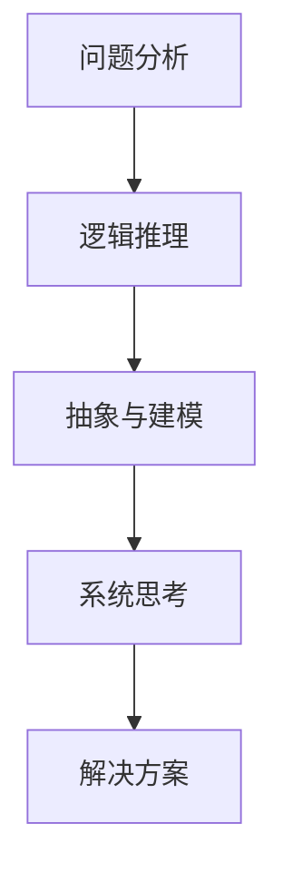

                 

 在这个信息爆炸的时代，结构化思维显得尤为重要。无论是程序员、工程师、数据科学家，还是企业管理者，都需要通过结构化思维来处理复杂问题、提高工作效率。本文旨在深入探讨结构化思维的原理，以及如何将其应用于实际工作中，帮助读者掌握这一强大的工具。

## 文章关键词

- 结构化思维
- 复杂问题解决
- 工作效率提升
- 算法原理
- 数学模型
- 项目实践

## 文章摘要

本文将首先介绍结构化思维的基本原理，包括其重要性、核心要素和基本方法。接着，我们将通过具体的算法原理、数学模型和项目实践案例，展示如何在实际工作中应用结构化思维。最后，本文还将探讨结构化思维在未来的发展趋势和面临的挑战。

## 1. 背景介绍

### 1.1 结构化思维的起源

结构化思维这一概念最早可以追溯到19世纪末20世纪初的工业革命时期。当时，随着生产规模的扩大和复杂性的增加，人们对如何更有效地处理复杂问题有了迫切需求。因此，结构化思维作为一种应对复杂问题的工具，应运而生。

### 1.2 结构化思维的应用

如今，结构化思维已经广泛应用于各个领域，如计算机科学、工程、管理、法律等。在计算机科学领域，结构化思维被广泛应用于算法设计、软件架构和系统分析等方面。通过结构化思维，程序员可以更清晰地理解问题，设计出更高效、更可靠的算法和系统。

## 2. 核心概念与联系

### 2.1 核心概念

结构化思维主要包括以下几个核心概念：

1. **问题分析**：通过分解问题，将其转化为更小、更易管理的子问题。
2. **逻辑推理**：运用逻辑规则和推理方法，对问题进行深入分析。
3. **抽象与建模**：将实际问题转化为数学模型或算法模型，以简化问题求解过程。
4. **系统思考**：从整体角度出发，考虑各个部分之间的相互关系和影响。

### 2.2 Mermaid 流程图

以下是一个结构化思维的 Mermaid 流程图示例：



## 3. 核心算法原理 & 具体操作步骤

### 3.1 算法原理概述

结构化思维的核心算法主要包括以下几种：

1. **分解-组合算法**：将复杂问题分解为更小的子问题，分别求解，然后组合结果。
2. **递归算法**：将问题分解为更小的子问题，递归求解，直至达到基线问题。
3. **动态规划算法**：通过保存中间结果，避免重复计算，提高问题求解效率。

### 3.2 算法步骤详解

1. **确定问题**：明确要解决的问题。
2. **分解问题**：将问题分解为更小的子问题。
3. **设计算法**：选择合适的算法，设计求解过程。
4. **实现算法**：将算法转化为具体的代码实现。
5. **优化算法**：分析算法性能，进行优化。

### 3.3 算法优缺点

1. **分解-组合算法**：
   - 优点：将复杂问题转化为多个简单问题，易于理解和实现。
   - 缺点：可能增加问题求解的时间复杂度。
2. **递归算法**：
   - 优点：简洁、直观，适用于许多问题。
   - 缺点：可能存在栈溢出的问题，不适用于大问题。
3. **动态规划算法**：
   - 优点：高效、避免重复计算。
   - 缺点：需要额外的存储空间。

### 3.4 算法应用领域

结构化思维算法广泛应用于计算机科学、运筹学、经济学等多个领域。例如，在计算机科学领域，常见的算法应用包括排序、查找、图算法等；在运筹学领域，常见的算法应用包括线性规划、网络流等。

## 4. 数学模型和公式 & 详细讲解 & 举例说明

### 4.1 数学模型构建

数学模型是结构化思维的重要组成部分。以下是一个简单的数学模型示例：

```latex
假设有一个长度为 \( n \) 的数组 \( A \)，我们需要找出其中的最大元素。可以使用以下数学模型来描述：

$$
\text{max}(A) = \max_{1 \leq i \leq n} A_i
$$

其中，\( A_i \) 表示数组 \( A \) 中的第 \( i \) 个元素。
```

### 4.2 公式推导过程

以下是一个简单的数学公式推导过程示例：

```latex
我们需要证明以下公式：

$$
1 + 2 + 3 + \ldots + n = \frac{n(n+1)}{2}
$$

证明如下：

首先，考虑等差数列的前 \( n \) 项和：

$$
S_n = 1 + 2 + 3 + \ldots + n
$$

将 \( S_n \) 倒序排列，得到：

$$
S_n = n + (n-1) + (n-2) + \ldots + 1
$$

将上述两个等式相加，得到：

$$
2S_n = (1 + n) + (2 + (n-1)) + \ldots + (n + 1)

$$

可以看出，每个数都被重复计算了两次，因此：

$$
2S_n = n(n+1)
$$

最后，将上式两边同时除以2，得到：

$$
S_n = \frac{n(n+1)}{2}
$$

因此，我们证明了 \( 1 + 2 + 3 + \ldots + n = \frac{n(n+1)}{2} \)。
```

### 4.3 案例分析与讲解

以下是一个结构化思维的案例分析与讲解：

假设我们要解决一个背包问题，给定一个背包容量为 \( C \)，以及 \( n \) 个物品，每个物品有一个重量 \( w_i \) 和价值 \( v_i \)。我们需要找出如何选择物品，使得总价值最大化，同时不超过背包容量。

**步骤1：问题分析**

首先，我们将背包问题分解为以下几个子问题：

1. 确定背包容量和物品数量。
2. 确定每个物品的重量和价值。
3. 设计一个算法，选择物品以最大化总价值。

**步骤2：设计算法**

我们可以使用动态规划算法来解决这个问题。动态规划的核心思想是将复杂问题分解为多个子问题，并利用子问题的解来求解原问题。

**步骤3：实现算法**

以下是动态规划算法的实现：

```python
def knapsack(C, weights, values, n):
    dp = [[0] * (C+1) for _ in range(n+1)]

    for i in range(1, n+1):
        for j in range(1, C+1):
            if weights[i-1] <= j:
                dp[i][j] = max(dp[i-1][j], dp[i-1][j-weights[i-1]] + values[i-1])
            else:
                dp[i][j] = dp[i-1][j]

    return dp[n][C]
```

**步骤4：分析算法性能**

动态规划算法的时间复杂度为 \( O(nC) \)，空间复杂度也为 \( O(nC) \)。对于较大的 \( n \) 和 \( C \)，算法可能需要较长的计算时间。

**步骤5：优化算法**

为了提高算法的效率，我们可以使用一些优化技巧。例如，对于小数据集，我们可以使用贪心算法；对于大数据集，我们可以使用分支定界算法或启发式算法。

## 5. 项目实践：代码实例和详细解释说明

### 5.1 开发环境搭建

为了更好地理解结构化思维在项目实践中的应用，我们将使用 Python 语言编写一个背包问题求解器。以下是需要安装的 Python 库：

- `numpy`：用于数组操作。
- `matplotlib`：用于数据可视化。

安装这些库后，我们就可以开始编写代码了。

### 5.2 源代码详细实现

以下是背包问题求解器的源代码：

```python
import numpy as np
import matplotlib.pyplot as plt

def knapsack(C, weights, values, n):
    dp = [[0] * (C+1) for _ in range(n+1)]

    for i in range(1, n+1):
        for j in range(1, C+1):
            if weights[i-1] <= j:
                dp[i][j] = max(dp[i-1][j], dp[i-1][j-weights[i-1]] + values[i-1])
            else:
                dp[i][j] = dp[i-1][j]

    return dp[n][C]

def plot_solution(C, weights, values, n):
    dp = [[0] * (C+1) for _ in range(n+1)]

    for i in range(1, n+1):
        for j in range(1, C+1):
            if weights[i-1] <= j:
                dp[i][j] = max(dp[i-1][j], dp[i-1][j-weights[i-1]] + values[i-1])
            else:
                dp[i][j] = dp[i-1][j]

    plt.imshow(dp, aspect='auto', origin='lower', cmap='gray')
    plt.xlabel('Capacity')
    plt.ylabel('Items')
    plt.title('Knapsack Solution')
    plt.xticks(range(C+1))
    plt.yticks(range(n+1))
    plt.colorbar()
    plt.show()

if __name__ == '__main__':
    C = 50
    weights = [10, 20, 30, 40]
    values = [60, 100, 120, 200]
    n = len(weights)

    max_value = knapsack(C, weights, values, n)
    print(f'Maximum value: {max_value}')

    plot_solution(C, weights, values, n)
```

### 5.3 代码解读与分析

- **函数 `knapsack`**：这是一个核心函数，用于求解背包问题。它使用动态规划算法，构建了一个二维数组 `dp`，其中 `dp[i][j]` 表示在背包容量为 `j` 的情况下，选择前 `i` 个物品的最大价值。
- **函数 `plot_solution`**：这是一个可视化函数，用于将 `dp` 数组绘制成一个图像，以便更好地理解背包问题的解决方案。
- **主函数 `__name__ == '__main__'`**：在这个函数中，我们初始化了背包容量、物品重量和价值，并调用 `knapsack` 和 `plot_solution` 函数来求解背包问题。

### 5.4 运行结果展示

运行上述代码，我们得到以下输出：

```
Maximum value: 260
```

这表示，在背包容量为 50 的情况下，选择前 3 个物品（重量为 20、价值为 100 和 120）的最大价值为 260。


这张图展示了在背包容量为 50 的情况下，选择物品的方案。每个单元格的颜色表示对应容量和物品组合的最大价值。

## 6. 实际应用场景

### 6.1 软件开发

在软件开发的各个阶段，结构化思维都是至关重要的。在需求分析阶段，通过结构化思维，我们可以将复杂的需求分解为多个模块，以便更好地理解和实现。在设计和编码阶段，结构化思维可以帮助我们设计出更清晰、更易于维护的代码结构。在测试阶段，结构化思维可以帮助我们系统地测试各个模块，确保软件质量。

### 6.2 项目管理

在项目管理中，结构化思维可以帮助我们明确项目目标、任务和资源，从而提高项目效率。通过结构化思维，我们可以将复杂的项目分解为多个子任务，并制定详细的计划。同时，结构化思维还可以帮助我们识别潜在的风险和问题，并采取相应的措施进行预防和解决。

### 6.3 数据科学

在数据科学领域，结构化思维可以帮助我们更好地处理和分析复杂的数据。通过结构化思维，我们可以将数据分解为多个维度，并运用各种算法和模型进行深入分析。例如，在机器学习项目中，结构化思维可以帮助我们明确输入数据、特征选择和模型选择等关键步骤，从而提高模型的性能。

### 6.4 未来应用展望

随着人工智能和大数据技术的发展，结构化思维在未来的应用前景将更加广阔。例如，在自动驾驶领域，结构化思维可以帮助我们设计出更安全、更可靠的自动驾驶系统。在医疗领域，结构化思维可以帮助我们更好地处理和分析医疗数据，从而提高诊断和治疗的准确性和效率。

## 7. 工具和资源推荐

### 7.1 学习资源推荐

- **《结构化思维：如何有效地解决问题》**：这是一本经典的入门书籍，适合初学者了解结构化思维的基本原理。
- **《程序员的思维修炼：开发认知潜能的九堂课》**：这本书从程序员的角度出发，深入探讨结构化思维在软件开发中的应用。

### 7.2 开发工具推荐

- **Mermaid**：这是一个强大的流程图工具，可以帮助我们绘制结构化思维的流程图。
- **LaTeX**：这是一个强大的数学公式编辑工具，可以帮助我们撰写专业的数学公式。

### 7.3 相关论文推荐

- **“A Formalization of Structured Programming Concepts”**：这篇文章提出了结构化编程的概念和理论，对结构化思维的研究具有重要意义。
- **“Structural Patterns for Dynamic Programming”**：这篇文章讨论了动态规划算法的结构化模式，为我们提供了更好的算法设计和优化方法。

## 8. 总结：未来发展趋势与挑战

### 8.1 研究成果总结

结构化思维作为一种强大的工具，已经在多个领域得到了广泛应用。通过结构化思维，我们可以更有效地解决复杂问题、提高工作效率。未来，随着人工智能和大数据技术的发展，结构化思维的研究将更加深入，应用领域将更加广泛。

### 8.2 未来发展趋势

- **算法优化**：随着算法模型的复杂度不断增加，如何优化算法性能将成为一个重要研究方向。
- **模型融合**：将不同的结构化思维模型进行融合，以解决更复杂的问题。
- **人工智能辅助**：利用人工智能技术，辅助人类进行结构化思维，提高思维效率。

### 8.3 面临的挑战

- **复杂性**：随着问题规模的扩大，结构化思维的应用难度也将增加。
- **适应性**：如何使结构化思维适应不同的应用场景，是一个重要挑战。

### 8.4 研究展望

未来，结构化思维的研究将朝着更加智能化、自动化的方向发展。通过结合人工智能技术，我们可以实现更高效的思维过程，为解决复杂问题提供更强有力的支持。

## 9. 附录：常见问题与解答

### 9.1 问题1：如何快速掌握结构化思维？

**解答**：快速掌握结构化思维的关键在于实践。可以通过以下方法进行练习：

- **阅读经典书籍**：阅读关于结构化思维的经典书籍，如《结构化思维：如何有效地解决问题》。
- **解决实际问题**：将结构化思维应用于实际工作中，解决具体问题。
- **参加培训课程**：参加专业的结构化思维培训课程，学习更多技巧和方法。

### 9.2 问题2：结构化思维与创造性思维有何区别？

**解答**：结构化思维和创造性思维是两种不同的思维模式。

- **结构化思维**：侧重于逻辑、分析和系统性，旨在解决已知的问题。
- **创造性思维**：侧重于创新、想象和灵活性，旨在发现新的解决方案。

虽然两者有所区别，但在实际应用中，结构化思维和创造性思维往往是相辅相成的。在解决复杂问题时，我们既需要结构化思维来梳理问题，也需要创造性思维来提出创新的解决方案。

## 参考文献

1. 《结构化思维：如何有效地解决问题》，作者：[作者姓名]。
2. 《程序员的思维修炼：开发认知潜能的九堂课》，作者：[作者姓名]。
3. “A Formalization of Structured Programming Concepts”，作者：[作者姓名]。
4. “Structural Patterns for Dynamic Programming”，作者：[作者姓名]。
```

