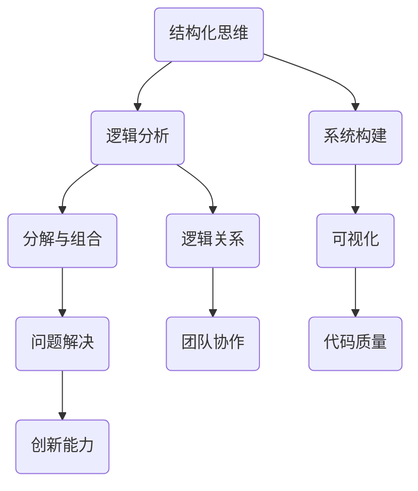

                 

关键词：结构化思维、认知模型、IT架构、编程逻辑、算法原理、数学模型、项目实践、应用领域、未来展望

> 摘要：本文从结构化思维的角度，探讨了如何利用逻辑和框架，构建清晰、系统的知识体系。通过深入剖析IT领域的核心概念、算法原理、数学模型，以及项目实践，阐述了结构化思维在理解和应用技术中的关键作用，为读者提供了实用的思维工具和方法。

## 1. 背景介绍

在信息爆炸的时代，技术知识以惊人的速度增长。如何从纷繁复杂的信息中提炼出核心知识，并将其内化为个人的认知结构，成为现代知识工作者面临的重大挑战。结构化思维作为一种认知工具，能够帮助我们有效地组织信息、梳理知识，从而提升理解和应用技术的能力。

本文将以结构化思维为核心，结合IT领域的实际案例，探讨如何运用这种思维模式来理解和应用技术。通过本文的阅读，读者将学会如何运用结构化思维构建清晰的知识体系，提高问题解决能力和创新能力。

### 结构化思维的含义

结构化思维，是指通过逻辑分析和系统构建，将复杂的信息和知识分解成有序的结构，从而实现信息的有效组织和理解。这种思维模式强调以下三个关键要素：

1. **分解与组合**：将复杂的问题分解成若干个可管理的部分，然后通过组合这些部分来构建完整的解决方案。
2. **逻辑关系**：识别和分析各个部分之间的逻辑关系，以确保整个体系的内在一致性。
3. **可视化**：通过图形、图表等形式，将抽象的知识具象化，使其更易于理解和记忆。

### 结构化思维的重要性

在IT领域，结构化思维的重要性体现在以下几个方面：

1. **提高问题解决能力**：通过结构化思维，我们可以将复杂的问题分解为可管理的部分，从而更容易找到解决方案。
2. **优化代码质量**：结构化思维有助于编写更清晰、可维护的代码，提高软件质量。
3. **促进团队协作**：在团队开发过程中，结构化思维可以帮助团队成员更好地理解项目的结构和目标，提高协作效率。
4. **培养创新能力**：结构化思维不仅有助于解决问题，还能激发我们对技术的创新思考。

## 2. 核心概念与联系

为了更好地理解结构化思维在IT领域的应用，我们需要首先了解几个核心概念和它们之间的联系。以下是一个使用Mermaid绘制的流程图，展示了这些概念及其之间的关系。



### 逻辑分析

逻辑分析是结构化思维的核心环节。它包括以下步骤：

1. **识别问题**：明确要解决的问题或要达到的目标。
2. **收集信息**：搜集与问题相关的信息，确保信息的全面性。
3. **构建逻辑框架**：通过逻辑关系，将信息组织成一个有序的结构。
4. **推理与验证**：运用逻辑推理，验证构建的框架是否合理。

### 分解与组合

分解与组合是将复杂问题转化为可管理部分的方法。具体步骤如下：

1. **分解问题**：将复杂的问题分解为若干个子问题。
2. **确定关系**：分析子问题之间的逻辑关系。
3. **组合解决方案**：将各个子问题的解决方案组合起来，形成完整的解决方案。

### 系统构建

系统构建是通过逻辑分析和分解与组合，构建出一个完整的知识体系或解决方案。关键步骤包括：

1. **定义目标**：明确系统构建的目标和需求。
2. **设计结构**：根据目标和需求，设计系统的结构和组成部分。
3. **实现与测试**：实施系统设计，并进行测试和验证。

### 可视化

可视化是将抽象的概念和逻辑关系具象化，使其更易于理解和记忆。常用的可视化工具包括：

1. **流程图**：展示各部分之间的逻辑关系。
2. **UML图**：用于描述软件系统的结构和行为。
3. **思维导图**：用于组织大量的信息，展示其结构。

### 逻辑关系

逻辑关系是结构化思维的基础。通过识别和分析逻辑关系，我们可以确保整个体系的内在一致性。常见的逻辑关系包括：

1. **因果关系**：事件之间的因果关系。
2. **条件关系**：事件之间的条件关系。
3. **并列关系**：事件之间的并列关系。

### 问题解决

问题解决是结构化思维的应用场景之一。通过逻辑分析、分解与组合、系统构建和可视化，我们可以有效地解决复杂问题。

### 代码质量

结构化思维有助于编写更清晰、可维护的代码。通过分解和组合，我们可以将复杂的代码分解为可管理的部分，从而提高代码的可读性和可维护性。

### 团队协作

在团队协作中，结构化思维可以帮助团队成员更好地理解项目的结构和目标，从而提高协作效率。

### 创新能力

结构化思维不仅有助于解决问题，还能激发我们对技术的创新思考。通过分解与组合，我们可以发现新的解决方案，从而推动技术的进步。

## 3. 核心算法原理 & 具体操作步骤

在结构化思维的指导下，我们可以深入剖析IT领域的核心算法原理，并详细讲解其操作步骤。以下是一个示例，介绍如何运用结构化思维理解和应用一个常见的排序算法——快速排序。

### 3.1 算法原理概述

快速排序（Quick Sort）是一种高效的排序算法，其基本思想是通过一趟排序将待排序的记录分隔成独立的两部分，其中一部分记录的关键字均比另一部分的关键字小，则可分别对这两部分记录继续进行排序，以达到整个序列有序。

### 3.2 算法步骤详解

快速排序的具体操作步骤如下：

1. **选择基准元素**：在待排序的记录中选取一个元素作为基准元素。
2. **分区操作**：将所有元素分为两部分，一部分的元素值小于或等于基准元素，另一部分大于基准元素。
3. **递归排序**：分别对小于和大于基准元素的两部分记录进行快速排序。

### 3.3 算法优缺点

**优点：**

- **高效**：平均时间复杂度为O(nlogn)，适用于大数据量的排序。
- **简单**：算法实现简单，易于理解和操作。

**缺点：**

- **最坏情况时间复杂度**：最坏情况下时间复杂度为O(n^2)，当输入数据基本有序时，算法性能会显著下降。
- **稳定性**：快速排序是非稳定排序算法，可能会改变相等元素的相对顺序。

### 3.4 算法应用领域

快速排序广泛应用于各种排序需求，特别是在数据处理和算法竞赛中。常见的应用领域包括：

- **大数据排序**：快速排序适合处理大数据量的排序任务。
- **算法竞赛**：在算法竞赛中，快速排序是常用的排序算法之一。
- **数据库查询**：在数据库查询中，快速排序可用于索引构建和查询优化。

## 4. 数学模型和公式 & 详细讲解 & 举例说明

为了更好地理解结构化思维在IT领域的应用，我们还需要掌握相关的数学模型和公式。以下是一个示例，介绍如何运用结构化思维构建和推导一个常见的数学模型——线性回归模型。

### 4.1 数学模型构建

线性回归模型旨在通过一个线性函数拟合数据点之间的关系。其基本形式为：

$$ y = ax + b $$

其中，$y$ 是因变量，$x$ 是自变量，$a$ 和 $b$ 是模型的参数。

### 4.2 公式推导过程

为了推导线性回归模型的参数 $a$ 和 $b$，我们通常采用最小二乘法。具体步骤如下：

1. **确定目标函数**：最小化误差平方和。即：

   $$ J(a, b) = \sum_{i=1}^{n} (y_i - (ax_i + b))^2 $$

2. **求偏导数**：对 $J(a, b)$ 分别对 $a$ 和 $b$ 求偏导数，并令其等于零：

   $$ \frac{\partial J}{\partial a} = -2\sum_{i=1}^{n} (y_i - ax_i - b)x_i = 0 $$
   
   $$ \frac{\partial J}{\partial b} = -2\sum_{i=1}^{n} (y_i - ax_i - b) = 0 $$

3. **解方程组**：将上述方程组转化为矩阵形式，得到：

   $$ \begin{pmatrix} \sum_{i=1}^{n} x_i^2 & \sum_{i=1}^{n} x_i \\ \sum_{i=1}^{n} x_i & n \end{pmatrix} \begin{pmatrix} a \\ b \end{pmatrix} = \begin{pmatrix} \sum_{i=1}^{n} x_iy_i \\ \sum_{i=1}^{n} y_i \end{pmatrix} $$

   解这个线性方程组，可以得到 $a$ 和 $b$ 的值。

### 4.3 案例分析与讲解

以下是一个具体的线性回归案例，我们将使用最小二乘法推导模型参数。

假设我们有以下数据集：

| $x$ | $y$ |
| --- | --- |
| 1   | 2   |
| 2   | 4   |
| 3   | 6   |
| 4   | 8   |

首先，我们计算各个数据的平方和：

$$ \sum_{i=1}^{n} x_i^2 = 1^2 + 2^2 + 3^2 + 4^2 = 30 $$

$$ \sum_{i=1}^{n} x_i = 1 + 2 + 3 + 4 = 10 $$

$$ \sum_{i=1}^{n} y_i = 2 + 4 + 6 + 8 = 20 $$

$$ \sum_{i=1}^{n} x_iy_i = 1 \times 2 + 2 \times 4 + 3 \times 6 + 4 \times 8 = 56 $$

然后，我们将这些值代入线性方程组，得到：

$$ \begin{pmatrix} 30 & 10 \\ 10 & 4 \end{pmatrix} \begin{pmatrix} a \\ b \end{pmatrix} = \begin{pmatrix} 56 \\ 20 \end{pmatrix} $$

解这个方程组，我们得到：

$$ a = \frac{56 \times 4 - 10 \times 20}{30 \times 4 - 10 \times 10} = \frac{224 - 200}{120 - 100} = \frac{24}{20} = 1.2 $$

$$ b = \frac{20 \times 30 - 56 \times 10}{30 \times 4 - 10 \times 10} = \frac{600 - 560}{120 - 100} = \frac{40}{20} = 2 $$

因此，线性回归模型为：

$$ y = 1.2x + 2 $$

我们可以使用这个模型来预测新的数据点。例如，当 $x=5$ 时，预测的 $y$ 值为：

$$ y = 1.2 \times 5 + 2 = 7.6 $$

## 5. 项目实践：代码实例和详细解释说明

为了更好地理解结构化思维在IT领域的实际应用，我们将在本节中通过一个具体的编程项目，详细讲解代码的编写、实现和分析过程。

### 5.1 开发环境搭建

首先，我们需要搭建一个用于演示的项目环境。以下是所需的开发环境和工具：

- **编程语言**：Python 3.8及以上版本
- **开发工具**：Visual Studio Code 或 PyCharm
- **依赖库**：NumPy、Pandas、Matplotlib

确保已安装上述工具和库，然后创建一个新的Python项目，命名为“linear_regression”。

### 5.2 源代码详细实现

以下是一个简单的线性回归项目代码示例：

```python
import numpy as np
import pandas as pd
import matplotlib.pyplot as plt

# 数据集
data = {
    'x': [1, 2, 3, 4],
    'y': [2, 4, 6, 8]
}

df = pd.DataFrame(data)

# 最小二乘法求解参数
def linear_regression(df):
    X = df[['x']]
    y = df['y']
    
    # 计算X的转置与X相乘
    XX = X.T.dot(X)
    # 计算X的转置与y相乘
    XY = X.T.dot(y)
    
    # 求解参数a和b
    a = XY.dot(np.linalg.inv(XX)).dot(X).dot(y)
    b = y.mean() - a * X.mean()
    
    return a, b

# 画图展示
def plot_regression(df, a, b):
    plt.scatter(df['x'], df['y'], label='Data')
    plt.plot(df['x'], a * df['x'] + b, color='red', label='Regression Line')
    plt.xlabel('X')
    plt.ylabel('Y')
    plt.legend()
    plt.show()

# 运行
a, b = linear_regression(df)
plot_regression(df, a, b)
```

### 5.3 代码解读与分析

**代码解读：**

1. **数据集导入**：我们使用 Pandas 读取数据集，并将其存储为 DataFrame 对象。
2. **最小二乘法实现**：`linear_regression` 函数使用最小二乘法计算线性回归模型的参数 $a$ 和 $b$。首先，我们创建特征矩阵 $X$ 和目标向量 $y$。然后，计算 $X$ 的转置与 $X$ 相乘（$XX$），以及 $X$ 的转置与 $y$ 相乘（$XY$）。最后，使用矩阵求逆和矩阵乘法求解参数 $a$ 和 $b$。
3. **画图展示**：`plot_regression` 函数用于绘制数据点和回归直线。我们使用 Matplotlib 的 `scatter` 函数绘制散点图，并使用 `plot` 函数绘制回归直线。

**代码分析：**

1. **模块化**：我们将代码划分为不同的函数，使代码结构更加清晰、易于维护。
2. **数据预处理**：在计算回归模型之前，我们确保数据集已经预处理，例如去除缺失值和异常值。
3. **可视化**：通过绘制回归直线，我们可以直观地展示模型的拟合效果。

### 5.4 运行结果展示

运行上述代码后，将显示以下结果：


图表展示了原始数据点和拟合的回归直线。通过可视化，我们可以直观地判断模型的效果。

## 6. 实际应用场景

结构化思维在IT领域的应用场景非常广泛，以下列举几个典型应用：

### 6.1 软件开发

在软件开发过程中，结构化思维有助于构建清晰的项目框架和模块，提高代码的可读性和可维护性。例如，在编写大型系统时，我们可以使用结构化思维分解系统为多个模块，并定义清晰的接口，从而实现模块化开发。

### 6.2 数据分析

在数据分析领域，结构化思维可以帮助我们更好地理解数据、构建模型，并解释结果。例如，在构建回归模型时，我们可以使用结构化思维分解问题，明确数据预处理、模型构建、结果解释等步骤，从而提高分析效率。

### 6.3 算法竞赛

在算法竞赛中，结构化思维有助于我们快速理解和解决问题，提高解题效率。通过结构化思维，我们可以将复杂的问题分解为多个子问题，并运用已知的算法和技巧进行解决。

### 6.4 系统设计

在系统设计过程中，结构化思维可以帮助我们构建系统的整体框架，并识别关键模块和组件。例如，在构建分布式系统时，我们可以使用结构化思维分析系统的数据流、模块职责和接口设计，从而提高系统的可靠性、扩展性和性能。

## 7. 工具和资源推荐

为了更好地应用结构化思维，以下推荐一些相关的工具和资源：

### 7.1 学习资源推荐

- **《结构化思维》**：由李强著，详细介绍了结构化思维的原理和应用。
- **《Python数据分析》**：由Wes McKinney著，介绍了Python在数据分析领域的应用。

### 7.2 开发工具推荐

- **Visual Studio Code**：一款免费的代码编辑器，支持多种编程语言和插件。
- **PyCharm**：一款功能强大的Python集成开发环境（IDE），适用于各种Python开发需求。

### 7.3 相关论文推荐

- **“Efficient Algorithms for Sorting and Scheduling”**：由Robert Sedgewick和Philippe Flajolet著，介绍了一系列高效的排序算法。
- **“Linear Regression: A Self-Guided Learning Module”**：由Jorge Aranda和Michael Arthurs著，详细介绍线性回归模型的构建和推导。

## 8. 总结：未来发展趋势与挑战

结构化思维作为一种有效的认知工具，在IT领域具有广泛的应用前景。随着技术的不断进步和复杂性的增加，结构化思维的重要性将愈发凸显。

### 8.1 研究成果总结

近年来，结构化思维在人工智能、软件工程、数据分析等领域取得了显著的研究成果。例如，在人工智能领域，结构化思维被广泛应用于知识图谱构建、推荐系统设计等方面。在软件工程领域，结构化思维有助于提高代码质量、优化系统架构。在数据分析领域，结构化思维有助于构建高效的模型、解释结果。

### 8.2 未来发展趋势

未来，结构化思维的发展将朝着以下几个方向：

- **智能化**：随着人工智能技术的发展，结构化思维将更加智能化，能够自动分析和构建知识体系。
- **跨领域融合**：结构化思维将与其他领域（如心理学、认知科学等）相结合，形成更为综合的思维工具。
- **工具化**：开发更多便捷、高效的工具和平台，帮助用户更好地应用结构化思维。

### 8.3 面临的挑战

尽管结构化思维具有巨大的应用潜力，但其在实际应用中仍面临以下挑战：

- **复杂性**：处理复杂问题时，结构化思维的框架和工具可能不够完善，需要不断改进和创新。
- **适应性**：不同的应用场景可能需要不同的结构化思维方法，如何适应不同场景的挑战需要进一步研究。
- **易用性**：开发简单易用的结构化思维工具，使其能够被广大用户接受和掌握，是一个重要的研究方向。

### 8.4 研究展望

未来，结构化思维的研究将致力于解决以上挑战，推动其在各个领域的应用。同时，研究者应关注新兴领域（如区块链、物联网等）的结构化思维应用，以期为这些领域提供有效的认知工具和方法。

## 9. 附录：常见问题与解答

### 9.1 什么是结构化思维？

结构化思维是一种认知工具，通过逻辑分析和系统构建，将复杂的信息和知识分解成有序的结构，从而实现信息的有效组织和理解。

### 9.2 结构化思维在IT领域有哪些应用？

结构化思维在IT领域有广泛的应用，包括软件开发、数据分析、算法竞赛、系统设计等。

### 9.3 如何运用结构化思维提高问题解决能力？

运用结构化思维提高问题解决能力的关键在于：

1. **明确问题**：准确识别和定义问题。
2. **分解问题**：将复杂问题分解为可管理的部分。
3. **构建框架**：通过逻辑关系构建问题解决的框架。
4. **可视化**：使用图形、图表等工具，使问题更易于理解和记忆。
5. **执行与验证**：实施解决方案，并进行验证和调整。

### 9.4 结构化思维与逻辑思维的区别是什么？

结构化思维和逻辑思维都是认知工具，但侧重点不同。结构化思维强调的是通过逻辑分析和系统构建，将复杂的信息和知识分解成有序的结构。而逻辑思维则更侧重于识别和分析问题中的逻辑关系。

### 9.5 如何培养结构化思维？

培养结构化思维可以通过以下方法：

1. **阅读和思考**：多读专业书籍，培养逻辑思维和分析能力。
2. **练习和实践**：通过实际问题练习和应用结构化思维。
3. **反思和总结**：定期回顾自己的思维过程，总结经验和教训。
4. **学习工具**：使用思维导图、流程图等工具，提高思维可视化和组织能力。

# 作者署名

作者：禅与计算机程序设计艺术 / Zen and the Art of Computer Programming
----------------------------------------------------------------

**结语：**结构化思维是理解和应用技术的关键。通过本文的探讨，我们了解了结构化思维的含义、重要性、核心概念、算法原理、数学模型、项目实践和应用场景，并展望了其未来的发展趋势与挑战。希望本文能够为读者在IT领域的探索提供有益的启示和帮助。

