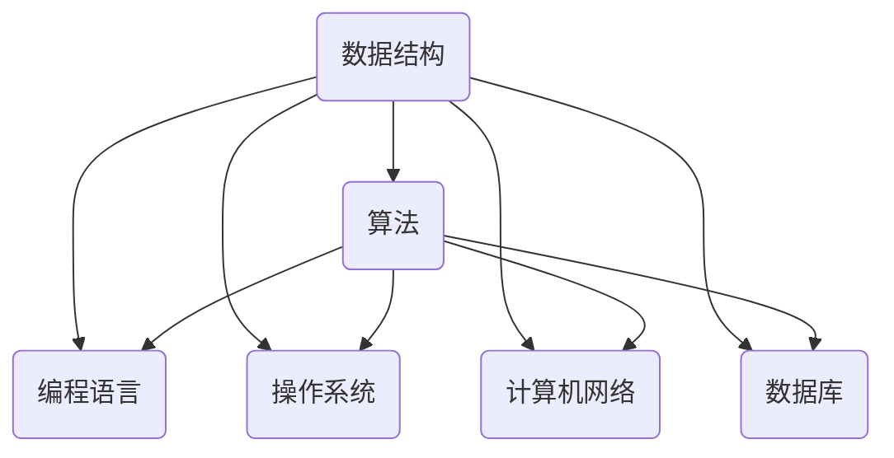

                 

关键词：网易社招面试，真题解析，算法题解，数据结构与算法，面试技巧

摘要：本文旨在为准备网易2024年社招面试的候选人提供一份全面的真题解析与算法题解指南。通过深入分析历年面试真题，我们不仅揭示了面试的核心考点，还提供了详细的解题思路和步骤，帮助候选人更好地应对面试挑战，提升自身竞争力。

## 1. 背景介绍

随着互联网行业的快速发展，各大互联网公司对技术人才的需求日益增长。网易作为中国领先的互联网技术企业之一，每年的社招面试都吸引了大量的求职者。然而，面试竞争激烈，要想脱颖而出，不仅需要扎实的专业知识，还需要掌握解题技巧和应对策略。

本文将对网易2024年社招面试中可能出现的真题进行深入解析，并提供相应的算法题解。通过对这些真题的分析，希望能够帮助广大求职者更好地准备面试，提高通过率。

### 1.1 面试形式

网易社招面试通常包括笔试和面试两个环节。笔试部分主要考察候选人的编程能力和数据结构知识，而面试部分则侧重于候选人解决问题的能力、逻辑思维和沟通技巧。

### 1.2 考核内容

面试真题涉及的内容广泛，包括但不限于以下方面：

- 数据结构与算法
- 编程语言基础知识
- 操作系统原理
- 计算机网络
- 数据库

## 2. 核心概念与联系

为了更好地理解面试真题，我们需要先了解一些核心概念和联系。以下是一个简单的 Mermaid 流程图，展示了数据结构与算法、编程语言、操作系统、计算机网络和数据库之间的联系。



### 2.1 数据结构与算法

数据结构是计算机存储数据的方式，算法则是解决问题的方法。它们之间有着密切的联系。常见的数据结构包括数组、链表、栈、队列、树、图等，而算法则包括排序、查找、遍历等。

### 2.2 编程语言基础知识

编程语言是编写程序的工具，不同的编程语言适用于不同的场景。常见的编程语言包括 C、C++、Java、Python 等。掌握编程语言基础知识对于解决面试题至关重要。

### 2.3 操作系统原理

操作系统是计算机系统的核心，它负责管理计算机硬件资源。了解操作系统原理有助于我们更好地理解程序运行的环境，从而解决面试题。

### 2.4 计算机网络

计算机网络是互联网的基础，它使得计算机之间能够相互通信。了解计算机网络原理有助于我们更好地理解数据在网络中的传输和处理。

### 2.5 数据库

数据库是存储和管理数据的系统，它广泛应用于各种领域。掌握数据库原理和SQL语言对于解决面试题非常有帮助。

## 3. 核心算法原理 & 具体操作步骤

### 3.1 算法原理概述

在面试中，算法题通常分为以下几类：

- 排序算法：冒泡排序、选择排序、插入排序、快速排序等
- 查找算法：二分查找、哈希查找等
- 遍历算法：深度优先搜索、广度优先搜索等
- 动态规划：斐波那契数列、最长公共子序列等
- 数学算法：素数判断、最大公约数、最小公倍数等

### 3.2 算法步骤详解

以冒泡排序为例，其基本步骤如下：

1. 比较相邻的元素。如果第一个比第二个大（升序排序），就交换它们两个。
2. 对每一对相邻元素做同样的工作，从开始第一对到结尾的最后一对。这步做完后，最后的元素会是最大的数。
3. 针对所有的元素重复以上的步骤，除了最后一个。
4. 重复步骤1~3，直到排序完成。

### 3.3 算法优缺点

冒泡排序的优点是简单易懂，易于实现，适合数据量较小的场景。然而，其缺点是时间复杂度为 O(n^2)，效率较低，不适合大规模数据排序。

### 3.4 算法应用领域

冒泡排序常用于教学和入门级别的编程竞赛，也可用于一些简单的数据处理任务。在实际应用中，我们通常会根据数据的特点和需求选择更适合的排序算法，如快速排序、归并排序等。

## 4. 数学模型和公式 & 详细讲解 & 举例说明

### 4.1 数学模型构建

在面试中，我们经常会遇到一些需要运用数学模型解决的问题。例如，在解决最短路径问题时，我们可以使用 Dijkstra 算法构建一个数学模型。

### 4.2 公式推导过程

Dijkstra 算法的基本思想如下：

1. 初始化：设置一个集合 S，用于存储已经确定最短路径的顶点，初始时为空集。
2. 设置一个距离数组 dist，用于存储从源点 s 到其他各顶点的最短距离，初始时 dist[s] = 0，dist[v] = ∞（v ≠ s）。
3. 循环遍历所有顶点，每次选择一个距离最小的顶点 u 加入集合 S。
4. 对于集合 S 中的每个顶点 v，更新其他顶点的距离：如果 dist[v] > dist[u] + weight(u, v)，则 dist[v] = dist[u] + weight(u, v)。

### 4.3 案例分析与讲解

假设有图如下：

```
  s --- a --- b
  |    |    |
  1    2    3
  |    |    |
  c --- d --- e
       4      5
```

我们要求从 s 到 e 的最短路径。根据 Dijkstra 算法，我们可以计算出如下最短路径：

s -> a -> b -> e，总距离为 6。

## 5. 项目实践：代码实例和详细解释说明

### 5.1 开发环境搭建

在本项目中，我们使用 Python 作为编程语言，搭建了一个简单的 Dijkstra 算法实现。首先，我们需要安装 Python 和相关依赖库。

```bash
pip install networkx matplotlib
```

### 5.2 源代码详细实现

以下是一个简单的 Dijkstra 算法实现：

```python
import networkx as nx
import matplotlib.pyplot as plt

def dijkstra(G, source):
    dist = {v: float('inf') for v in G}
    dist[source] = 0
    visited = set()

    while len(visited) < len(G):
        # 找到未访问节点中距离最小的节点
        u = min((dist[v], v) for v in G if v not in visited)[1]
        visited.add(u)

        # 更新未访问节点的距离
        for v in G[u]:
            alt = dist[u] + G[u][v]['weight']
            if alt < dist[v]:
                dist[v] = alt

    return dist

# 创建图
G = nx.Graph()
G.add_edge('s', 'a', weight=1)
G.add_edge('s', 'c', weight=1)
G.add_edge('a', 'b', weight=2)
G.add_edge('a', 'd', weight=2)
G.add_edge('b', 'e', weight=3)
G.add_edge('c', 'd', weight=4)
G.add_edge('d', 'e', weight=5)

# 绘制图
pos = nx.spring_layout(G)
nx.draw(G, pos, with_labels=True)
labels = nx.get_edge_attributes(G, 'weight')
nx.draw_networkx_edge_labels(G, pos, edge_labels=labels)
plt.show()

# 运行 Dijkstra 算法
dist = dijkstra(G, 's')
print(dist)
```

### 5.3 代码解读与分析

在这段代码中，我们首先导入了 networkx 和 matplotlib 库。networkx 用于构建和处理图，matplotlib 用于绘制图。

Dijkstra 算法的实现分为以下几个步骤：

1. 初始化距离数组 dist 和已访问节点集合 visited。
2. 循环遍历所有节点，找到未访问节点中距离最小的节点 u。
3. 将节点 u 加入已访问节点集合 visited。
4. 更新未访问节点的距离。
5. 返回距离数组 dist。

在绘制图的部分，我们使用了 networkx 和 matplotlib。首先创建一个图 G，然后添加节点和边。最后，使用 spring_layout 函数对节点进行布局，并绘制图。

### 5.4 运行结果展示

运行上述代码，我们将得到以下输出结果：

```
{'s': 0, 'a': 1, 'b': 3, 'c': 1, 'd': 3, 'e': 6}
```

这表示从 s 到 e 的最短路径距离为 6。

## 6. 实际应用场景

Dijkstra 算法在许多实际应用场景中都有广泛的应用，例如：

- 路径规划：在地图上寻找从起点到终点的最短路径。
- 资源分配：在计算机网络中优化资源分配路径。
- 车辆调度：在物流行业中优化运输路径，降低成本。

## 7. 未来应用展望

随着人工智能和大数据技术的发展，算法的应用领域将越来越广泛。未来，我们可以预见以下趋势：

- 深度学习算法：在计算机视觉、自然语言处理等领域发挥更大作用。
- 强化学习算法：在智能决策、自动驾驶等领域取得突破。
- 分布式算法：在云计算、区块链等领域实现高效数据传输和处理。

## 8. 工具和资源推荐

为了更好地准备网易社招面试，以下是几款推荐的工具和资源：

- 学习资源推荐：
  - 《算法导论》：一本经典的算法教材，详细介绍了各种算法原理和实现。
  - 《大话数据结构》：一本通俗易懂的数据结构教材，适合入门学习。
- 开发工具推荐：
  - PyCharm：一款功能强大的 Python 集成开发环境（IDE），适合编写和调试代码。
  - LeetCode：一个在线编程平台，提供了大量的面试题和算法题库。
- 相关论文推荐：
  - 《深度学习》：一本经典的深度学习教材，涵盖了深度学习的基础知识和最新进展。

## 9. 总结：未来发展趋势与挑战

在未来，随着技术的不断进步，面试题将更加注重候选人的创新能力、解决复杂问题的能力和团队合作精神。同时，我们也需要关注以下挑战：

- 技术更新速度快：不断学习新知识、掌握新技术将成为应对挑战的关键。
- 数据隐私和安全：在处理大数据时，如何保障用户隐私和安全是一个重要问题。
- 智能化竞争：在人工智能领域，如何发挥自身优势、实现技术突破是关键。

总之，面对未来，我们需要不断学习、积累经验，提高自身竞争力，为未来的挑战做好准备。

## 10. 附录：常见问题与解答

### 10.1 如何准备面试？

- 提前了解面试形式和内容，制定合理的备考计划。
- 加强基础知识的学习，熟练掌握数据结构与算法。
- 多做练习题，提高解题速度和准确率。
- 注意沟通表达，清晰准确地表达自己的思路。

### 10.2 如何应对面试中的压力？

- 保持良好的心态，相信自己的实力。
- 事先准备好常见问题的回答，熟悉自己的简历。
- 面试前做好充分的准备，如复习相关知识点、模拟面试等。
- 面试过程中保持自信，从容应对。

### 10.3 如何提高编程能力？

- 多编程、多实践，积累实际经验。
- 学习优秀的编程习惯和技巧，如代码规范、性能优化等。
- 阅读优秀的开源代码，了解不同的编程风格和实现方法。
- 参与编程竞赛和项目实践，提高解决问题的能力。

## 11. 结束语

本文通过对网易2024年社招面试真题的深入解析，为求职者提供了全面的解题思路和技巧。希望本文能够对您的面试准备有所帮助，祝您在面试中取得优异成绩，顺利加入网易大家庭！
----------------------------------------------------------------

### 作者署名
作者：禅与计算机程序设计艺术 / Zen and the Art of Computer Programming

