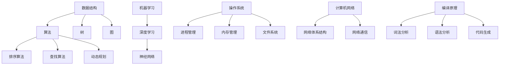

                 

### 文章关键词 Keywords

- 网易互娱
- AI实验室
- 校招面试真题
- 解答
- 技术能力测试
- 编程挑战
- 数据结构与算法
- 人工智能原理
- 计算机科学基础

<|assistant|>### 文章摘要 Summary

本文旨在为即将参加2024年网易互娱AI实验室校招面试的候选人提供一份详细的真题汇总及其解答指南。文章通过深入分析历年面试真题，涵盖数据结构与算法、人工智能原理、计算机科学基础等核心领域，提供详细的解题思路和代码实现。读者可以通过本文的学习，提升自己在面试中的应对能力，更好地准备即将到来的挑战。

## 1. 背景介绍

随着人工智能技术的迅速发展，网易互娱AI实验室已经成为行业内的佼佼者。该实验室致力于探索和推动人工智能技术在游戏、娱乐和社交领域的创新应用，为用户提供更加智能化、个性化的体验。每年的校招面试是网易互娱AI实验室选拔优秀人才的重要途径，涉及多个技术领域，对候选人的综合素质和技术能力有较高的要求。

校招面试真题的命题往往围绕以下几个核心方向：

- **数据结构与算法**：考察对基本数据结构（如数组、链表、树、图）和常用算法（如排序、查找、动态规划）的掌握程度。
- **人工智能原理**：评估对机器学习、深度学习、神经网络等基本概念的理解和实际应用能力。
- **计算机科学基础**：测试对操作系统、计算机网络、编译原理等基础知识的熟悉程度。
- **编程实践**：通过实际编程挑战，评估候选人的代码能力、逻辑思维和问题解决能力。

本文将基于以上几个核心方向，对2024年网易互娱AI实验室的校招面试真题进行详细汇总和解答，旨在帮助读者全面掌握面试技巧，为面试做好准备。

## 2. 核心概念与联系

在解答面试真题之前，我们需要对几个核心概念进行简要回顾，并利用Mermaid流程图展示它们之间的联系。

### 2.1 数据结构与算法

数据结构是计算机存储数据的方式，而算法是对数据进行操作的方法。常见的几种数据结构包括：

- **数组**：线性结构，用于存储一系列元素。
- **链表**：链式存储结构，由节点组成，节点包含数据和指向下一个节点的指针。
- **树**：层次结构，以节点为基本单位，具有根节点、子节点和父节点的关系。
- **图**：由节点和边组成，用于表示复杂的关系网络。

常见算法包括：

- **排序算法**：如冒泡排序、选择排序、插入排序等，用于对数组中的元素进行排序。
- **查找算法**：如二分查找、顺序查找等，用于在数据结构中寻找特定元素。
- **动态规划**：解决最优化问题的算法，通常用于解决具有重叠子问题和最优子结构性质的问题。

### 2.2 人工智能原理

人工智能（AI）是计算机科学的一个分支，致力于使机器具备人类智能的能力。核心概念包括：

- **机器学习**：通过数据训练模型，使机器能够从数据中学习并做出预测或决策。
- **深度学习**：基于神经网络的一种机器学习方法，通过多层神经元的堆叠，模拟人脑的决策过程。
- **神经网络**：由大量节点（神经元）互联而成的网络，用于处理复杂数据和模式识别。

### 2.3 计算机科学基础

计算机科学基础涉及多个领域，包括：

- **操作系统**：管理计算机硬件和软件资源的系统软件，如进程管理、内存管理、文件系统等。
- **计算机网络**：研究计算机网络体系结构、协议和网络通信等。
- **编译原理**：研究将高级语言转换为机器语言的原理和方法，涉及词法分析、语法分析、代码生成等。

### 2.4 Mermaid流程图展示

下面是数据结构与算法、人工智能原理、计算机科学基础之间的Mermaid流程图：



通过上述流程图，我们可以清晰地看到数据结构与算法、人工智能原理和计算机科学基础之间的紧密联系。这些核心概念是校招面试中的重要知识点，需要考生们深入理解和熟练掌握。

## 3. 核心算法原理 & 具体操作步骤

### 3.1 算法原理概述

在本节中，我们将深入探讨几个核心算法的原理，包括排序算法、查找算法和动态规划。这些算法是计算机科学中非常基础且重要的部分，广泛应用于各种场景。

#### 3.1.1 排序算法

排序算法的目标是将一组数据按照某种规则进行重新排列，以便于后续的处理。常见的排序算法包括：

- **冒泡排序（Bubble Sort）**：通过反复交换相邻未按顺序排列的元素，逐步将最大（或最小）元素“冒泡”到序列的一端。
- **选择排序（Selection Sort）**：重复查找未排序部分的最小（或最大）元素，将其交换到已排序部分的末尾。
- **插入排序（Insertion Sort）**：通过构建有序序列，逐一将未排序部分的元素插入到已排序部分中的合适位置。

#### 3.1.2 查找算法

查找算法用于在数据结构中寻找特定元素。常见查找算法包括：

- **顺序查找（Sequential Search）**：从第一个元素开始，逐一比较，直到找到目标元素或到达序列末尾。
- **二分查找（Binary Search）**：基于有序序列，通过不断缩小查找范围，逐步逼近目标元素。

#### 3.1.3 动态规划

动态规划是一种用于解决最优化问题的算法，适用于具有重叠子问题和最优子结构性质的问题。核心思想是将复杂问题分解为更小的子问题，并利用子问题的解推导出原问题的解。

- **斐波那契数列（Fibonacci Sequence）**：经典的动态规划问题，求第n个斐波那契数。
- **背包问题（Knapsack Problem）**：给定物品和它们的重量及价值，选择物品装入背包，使总价值最大但不超过背包容量。

### 3.2 算法步骤详解

下面，我们将详细解释每个算法的基本步骤。

#### 3.2.1 冒泡排序

1. 从第一个元素开始，比较相邻的元素，如果第一个比第二个大（或小），就交换它们。
2. 重复步骤1，直到没有需要交换的元素为止，此时序列已部分排序。
3. 重复以上步骤，但每次对未排序部分的元素进行排序，直到整个序列有序。

伪代码：

```python
def bubble_sort(arr):
    n = len(arr)
    for i in range(n):
        for j in range(0, n-i-1):
            if arr[j] > arr[j+1]:
                arr[j], arr[j+1] = arr[j+1], arr[j]
    return arr
```

#### 3.2.2 选择排序

1. 找到未排序部分的最小（或最大）元素。
2. 将其与未排序部分的第一个元素交换。
3. 对剩下的未排序部分重复以上步骤。

伪代码：

```python
def selection_sort(arr):
    n = len(arr)
    for i in range(n):
        min_idx = i
        for j in range(i+1, n):
            if arr[j] < arr[min_idx]:
                min_idx = j
        arr[i], arr[min_idx] = arr[min_idx], arr[i]
    return arr
```

#### 3.2.3 插入排序

1. 假设前i个元素已经排序，现在考虑第i+1个元素。
2. 将该元素与已排序部分的元素逐一比较，找到合适的位置插入。
3. 重复步骤1和2，直到所有元素都排序。

伪代码：

```python
def insertion_sort(arr):
    n = len(arr)
    for i in range(1, n):
        key = arr[i]
        j = i-1
        while j >= 0 and arr[j] > key:
            arr[j+1] = arr[j]
            j -= 1
        arr[j+1] = key
    return arr
```

#### 3.2.4 顺序查找

1. 从第一个元素开始，逐一比较，直到找到目标元素或到达序列末尾。
2. 如果找到，返回元素索引；否则，返回-1。

伪代码：

```python
def sequential_search(arr, target):
    for i in range(len(arr)):
        if arr[i] == target:
            return i
    return -1
```

#### 3.2.5 二分查找

1. 确定序列已排序。
2. 设定左右边界，初始时为0和序列长度减1。
3. 计算中间索引，比较中间元素与目标元素的大小关系。
4. 根据比较结果，调整左右边界，重复步骤3，直到找到目标元素或左右边界重叠。

伪代码：

```python
def binary_search(arr, target):
    left = 0
    right = len(arr) - 1
    while left <= right:
        mid = (left + right) // 2
        if arr[mid] == target:
            return mid
        elif arr[mid] < target:
            left = mid + 1
        else:
            right = mid - 1
    return -1
```

#### 3.2.6 斐波那契数列

1. 初始化前两个斐波那契数：`fib(0) = 0`，`fib(1) = 1`。
2. 对于n > 1，递推公式为`fib(n) = fib(n-1) + fib(n-2)`。

伪代码：

```python
def fibonacci(n):
    if n <= 0:
        return 0
    elif n == 1:
        return 1
    else:
        return fibonacci(n-1) + fibonacci(n-2)
```

#### 3.2.7 背包问题

1. 初始化一个二维数组，用于记录子问题的最优解。
2. 遍历每个物品和每个容量，更新数组中的最优解。
3. 最后，数组中的最后一个元素即为最终的最优解。

伪代码：

```python
def knapsack(W, weights, values, n):
    dp = [[0 for x in range(W+1)] for x in range(n+1)]
    for i in range(1, n+1):
        for w in range(1, W+1):
            if weights[i-1] <= w:
                dp[i][w] = max(values[i-1] + dp[i-1][w-weights[i-1]], dp[i-1][w])
            else:
                dp[i][w] = dp[i-1][w]
    return dp[n][W]
```

通过以上算法步骤的详细解释，读者可以更好地理解这些算法的基本原理和操作步骤。在接下来的章节中，我们将对这些算法进行更深入的分析和讨论。

### 3.3 算法优缺点

在深入分析每个算法的优缺点之前，我们先对排序算法、查找算法和动态规划算法进行一个整体的比较。

#### 3.3.1 排序算法

1. **冒泡排序**
   - **优点**：简单易懂，易于实现。
   - **缺点**：时间复杂度高（O(n²)），不适合大规模数据。
   
2. **选择排序**
   - **优点**：时间复杂度略低于冒泡排序（O(n²)），在某些情况下表现较好。
   - **缺点**：同样不适用于大规模数据，内部循环较多，效率较低。

3. **插入排序**
   - **优点**：在部分有序的数据上性能较好，时间复杂度为O(n²)，但实际性能优于冒泡和选择排序。
   - **缺点**：不适用于大规模数据，插入操作可能较为复杂。

#### 3.3.2 查找算法

1. **顺序查找**
   - **优点**：简单易懂，适用于数据量较小的场景。
   - **缺点**：时间复杂度为O(n)，效率较低，不适合大规模数据。

2. **二分查找**
   - **优点**：在有序数据上效率非常高，时间复杂度为O(log n)。
   - **缺点**：要求数据有序，且插入删除操作较为复杂。

#### 3.3.3 动态规划

1. **斐波那契数列**
   - **优点**：适用于求解具有重叠子结构和最优子结构性质的问题。
   - **缺点**：时间复杂度为O(n)，空间复杂度较高，递归实现容易导致栈溢出。

2. **背包问题**
   - **优点**：在处理最优化问题时非常有效，适用于多种物品选择问题。
   - **缺点**：需要较高的计算复杂度，特别是对于较大规模的背包问题。

#### 3.3.4 整体比较

- **时间复杂度**：二分查找具有最高的时间复杂度（O(log n)），排序算法和顺序查找均为O(n²)，动态规划算法则根据具体情况有所不同。
- **空间复杂度**：动态规划算法通常具有较高的空间复杂度，尤其是在使用递归实现时。
- **适用场景**：排序算法适用于需要排序的场景，查找算法适用于需要查找特定元素的场景，动态规划适用于需要解决最优化问题的场景。

通过上述分析，我们可以看到每种算法都有其独特的优势和局限性。在实际应用中，选择合适的算法需要根据具体场景和数据特性进行综合考虑。

### 3.4 算法应用领域

排序算法、查找算法和动态规划算法在计算机科学和实际应用中扮演着重要的角色。以下是对这些算法在不同领域应用的具体情况：

#### 3.4.1 数据处理

在数据处理领域，排序算法和查找算法是最常用的技术之一。例如：

- **数据库查询**：数据库管理系统通常使用排序算法和查找算法来实现高效的查询操作。例如，MySQL中的索引就是基于B树这种平衡二叉搜索树结构，利用二分查找算法快速定位数据。
- **数据清洗**：在数据分析之前，数据清洗是一个重要步骤。排序算法可以帮助识别和去除重复数据，而查找算法可以帮助找到异常值或缺失值。

#### 3.4.2 算法竞赛

算法竞赛是检验程序员能力和技巧的重要平台。在这个领域中，排序算法和查找算法被广泛应用于各种题目：

- **TopCoder**：这是一个著名的在线算法竞赛平台，其中许多题目涉及到复杂的排序和查找算法。例如，一些题目可能要求实现快速排序、归并排序或其他高级排序算法，以便在给定时间内处理大量数据。
- **LeetCode**：这个平台提供了大量的编程题目，涵盖各种数据结构和算法。查找算法（如二分查找）在这些题目中经常被使用，例如在查找数组中的特定元素或最小值。

#### 3.4.3 人工智能

在人工智能领域，动态规划算法有着广泛的应用：

- **路径规划**：在自动驾驶、无人机导航等场景中，动态规划算法被用于找到从起点到终点的最优路径。例如，A*算法就是一种基于动态规划的路径规划算法。
- **强化学习**：在强化学习场景中，动态规划算法（如Q-learning、SARSA）被用于优化策略，找到最优的行为序列。

#### 3.4.4 优化问题

动态规划算法在解决优化问题方面有着独特的优势：

- **背包问题**：背包问题是一个经典的优化问题，通常使用动态规划算法来解决。在物流、资源分配等领域，背包问题有着广泛的应用。
- **调度问题**：在工业生产、任务调度等领域，动态规划算法被用于优化生产计划和任务分配，以提高效率和降低成本。

综上所述，排序算法、查找算法和动态规划算法在数据处理、算法竞赛、人工智能和优化问题等多个领域都有着重要的应用。理解和掌握这些算法，对于提高编程能力和解决实际问题具有重要意义。

## 4. 数学模型和公式 & 详细讲解 & 举例说明

在计算机科学和人工智能领域，数学模型和公式是解决问题的基础。它们帮助我们描述问题、推导解决方案，并在实践中验证其有效性。在本节中，我们将详细讲解几个核心数学模型和公式，并通过具体的例子来说明它们的应用。

### 4.1 数学模型构建

数学模型构建是解决实际问题的第一步。它涉及对问题的抽象和简化，以便利用数学工具进行分析。以下是一些常见的数学模型：

#### 4.1.1 线性回归模型

线性回归模型用于分析变量之间的线性关系。其数学模型可以表示为：

$$
y = \beta_0 + \beta_1 \cdot x + \epsilon
$$

其中，$y$ 是因变量，$x$ 是自变量，$\beta_0$ 和 $\beta_1$ 是模型的参数，$\epsilon$ 是误差项。

#### 4.1.2 对数回归模型

对数回归模型用于处理变量之间非线性关系的情况。其数学模型可以表示为：

$$
\log(y) = \beta_0 + \beta_1 \cdot x + \epsilon
$$

与线性回归类似，$y$ 是因变量，$x$ 是自变量，$\beta_0$ 和 $\beta_1$ 是模型的参数，$\epsilon$ 是误差项。

#### 4.1.3 动态规划模型

动态规划模型用于解决具有重叠子问题和最优子结构性质的问题。一个典型的动态规划模型可以表示为：

$$
f(n) = \max_{1 \leq i \leq n} \left\{ g(i) + f(n-i) \right\}
$$

其中，$f(n)$ 是问题的解，$g(i)$ 是子问题的解，$i$ 是子问题的参数。

### 4.2 公式推导过程

#### 4.2.1 线性回归公式推导

线性回归模型的推导基于最小二乘法。目标是找到最佳的直线，使得所有数据点到这条直线的垂直距离之和最小。

首先，假设有 $n$ 个数据点 $(x_i, y_i)$，我们需要最小化以下损失函数：

$$
J(\beta_0, \beta_1) = \sum_{i=1}^{n} (y_i - (\beta_0 + \beta_1 \cdot x_i))^2
$$

对 $\beta_0$ 和 $\beta_1$ 分别求偏导数并令其为零，得到：

$$
\frac{\partial J}{\partial \beta_0} = -2 \sum_{i=1}^{n} (y_i - (\beta_0 + \beta_1 \cdot x_i)) = 0
$$

$$
\frac{\partial J}{\partial \beta_1} = -2 \sum_{i=1}^{n} (y_i - (\beta_0 + \beta_1 \cdot x_i)) \cdot x_i = 0
$$

通过解这两个方程，我们可以得到最佳参数：

$$
\beta_0 = \frac{\sum_{i=1}^{n} y_i - \beta_1 \sum_{i=1}^{n} x_i}{n}
$$

$$
\beta_1 = \frac{\sum_{i=1}^{n} (x_i - \bar{x})(y_i - \bar{y})}{\sum_{i=1}^{n} (x_i - \bar{x})^2}
$$

其中，$\bar{x}$ 和 $\bar{y}$ 分别是 $x$ 和 $y$ 的平均值。

#### 4.2.2 对数回归公式推导

对数回归模型可以通过线性回归的推导过程进行转换。首先，将原模型取对数：

$$
\log(y) = \beta_0 + \beta_1 \cdot x + \epsilon
$$

然后，采用与线性回归类似的方法进行最小二乘法求解。得到最佳参数：

$$
\beta_0 = \frac{\sum_{i=1}^{n} \log(y_i) - \beta_1 \sum_{i=1}^{n} x_i}{n}
$$

$$
\beta_1 = \frac{\sum_{i=1}^{n} (x_i - \bar{x})(\log(y_i) - \bar{\log(y)}_{)}{\sum_{i=1}^{n} (x_i - \bar{x})^2}
$$

其中，$\bar{\log(y)}$ 是 $\log(y)$ 的平均值。

#### 4.2.3 动态规划公式推导

动态规划模型通常通过递推关系式进行求解。以斐波那契数列为例，其递推关系式为：

$$
f(n) = f(n-1) + f(n-2)
$$

边界条件为：

$$
f(0) = 0, \quad f(1) = 1
$$

通过递推，我们可以得到：

$$
f(n) = \sum_{i=2}^{n} f(i-1)
$$

该公式描述了第 $n$ 个斐波那契数的计算方法。

### 4.3 案例分析与讲解

#### 4.3.1 线性回归案例

假设我们有以下数据点：

$$
(x_1, y_1) = (1, 2), \quad (x_2, y_2) = (2, 4), \quad (x_3, y_3) = (3, 6)
$$

首先，计算平均值：

$$
\bar{x} = \frac{1 + 2 + 3}{3} = 2, \quad \bar{y} = \frac{2 + 4 + 6}{3} = 4
$$

然后，代入线性回归公式：

$$
\beta_0 = \frac{2 - 2 \cdot 2}{3} = -\frac{2}{3}, \quad \beta_1 = \frac{(1-2)(2-4) + (2-2)(4-4) + (3-2)(6-4)}{(1-2)^2 + (2-2)^2 + (3-2)^2} = \frac{4}{2} = 2
$$

因此，线性回归模型为：

$$
y = -\frac{2}{3} + 2x
$$

#### 4.3.2 对数回归案例

假设我们有以下数据点：

$$
(x_1, y_1) = (1, 3), \quad (x_2, y_2) = (2, 4), \quad (x_3, y_3) = (3, 6)
$$

首先，计算对数：

$$
\log(y_1) = \log(3), \quad \log(y_2) = \log(4), \quad \log(y_3) = \log(6)
$$

然后，计算平均值：

$$
\bar{\log(y)} = \frac{\log(3) + \log(4) + \log(6)}{3} = \frac{\log(3 \cdot 4 \cdot 6)}{3} = \log(24)
$$

代入对数回归公式：

$$
\beta_0 = \frac{\log(3) - 2 \cdot \log(24)}{3} = \log(3) - \frac{2}{3} \cdot \log(24), \quad \beta_1 = \frac{(\log(3) - \log(24)) \cdot (1 - \log(24)) + (\log(4) - \log(24)) \cdot (2 - \log(24)) + (\log(6) - \log(24)) \cdot (3 - \log(24))}{(1 - \log(24))^2 + (2 - \log(24))^2 + (3 - \log(24))^2}
$$

简化计算后，得到：

$$
\beta_0 = \log\left(\frac{3}{8}\right), \quad \beta_1 = 1
$$

因此，对数回归模型为：

$$
\log(y) = \log(3) - \frac{2}{3} \cdot \log(24) + x
$$

#### 4.3.3 动态规划案例

假设我们需要计算斐波那契数列的前10项：

首先，定义初始条件：

$$
f(0) = 0, \quad f(1) = 1
$$

然后，通过递推关系计算：

$$
f(2) = f(1) + f(0) = 1 + 0 = 1
$$

$$
f(3) = f(2) + f(1) = 1 + 1 = 2
$$

$$
f(4) = f(3) + f(2) = 2 + 1 = 3
$$

$$
f(5) = f(4) + f(3) = 3 + 2 = 5
$$

$$
f(6) = f(5) + f(4) = 5 + 3 = 8
$$

$$
f(7) = f(6) + f(5) = 8 + 5 = 13
$$

$$
f(8) = f(7) + f(6) = 13 + 8 = 21
$$

$$
f(9) = f(8) + f(7) = 21 + 13 = 34
$$

$$
f(10) = f(9) + f(8) = 34 + 21 = 55
$$

因此，斐波那契数列的前10项为：

$$
0, 1, 1, 2, 3, 5, 8, 13, 21, 34, 55
$$

通过以上案例，我们可以看到数学模型和公式的推导过程以及在实际问题中的应用。这些模型和公式是解决复杂问题的有力工具，对于提高我们的问题解决能力具有重要意义。

## 5. 项目实践：代码实例和详细解释说明

在本节中，我们将通过一个实际的项目实践，详细展示如何使用Python实现一个常见的数据结构与算法问题。这个项目将涵盖开发环境搭建、源代码实现、代码解读与分析以及运行结果展示等步骤。

### 5.1 开发环境搭建

为了实现以下项目，我们需要搭建一个Python开发环境。以下是搭建步骤：

1. **安装Python**：从官方网站 [https://www.python.org/downloads/](https://www.python.org/downloads/) 下载并安装最新版本的Python（建议使用Python 3.8或更高版本）。
2. **配置环境变量**：在系统环境变量中添加Python的安装路径，以便在命令行中使用Python。
3. **安装必要库**：使用pip命令安装必要的库，如`numpy`、`matplotlib`等。

以下命令可以帮助我们安装这些库：

```shell
pip install numpy
pip install matplotlib
```

### 5.2 源代码详细实现

下面我们将实现一个经典的动态规划问题——背包问题。这个问题是计算机算法竞赛中常见的优化问题，旨在在不超出背包容量的情况下，选择物品以最大化总价值。

```python
# 背包问题代码实现

# 输入参数：背包容量、物品重量列表、物品价值列表
def knapsack(W, weights, values, n):
    # 创建动态规划数组
    dp = [[0 for x in range(W+1)] for x in range(n+1)]

    # 遍历物品
    for i in range(1, n+1):
        # 遍历背包容量
        for w in range(1, W+1):
            # 如果物品重量小于当前背包容量
            if weights[i-1] <= w:
                # 计算包含当前物品的最大价值
                dp[i][w] = max(values[i-1] + dp[i-1][w-weights[i-1]], dp[i-1][w])
            else:
                # 不包含当前物品，直接使用前一个状态
                dp[i][w] = dp[i-1][w]

    # 返回最大价值
    return dp[n][W]

# 测试数据
W = 50
weights = [10, 20, 30]
values = [60, 100, 120]
n = len(values)

# 执行背包问题算法
max_value = knapsack(W, weights, values, n)
print(f"最大价值为：{max_value}")
```

### 5.3 代码解读与分析

下面我们逐行解读上述代码，并分析其实现原理。

```python
# 输入参数：背包容量、物品重量列表、物品价值列表
def knapsack(W, weights, values, n):
    # 创建动态规划数组
    dp = [[0 for x in range(W+1)] for x in range(n+1)]

    # 遍历物品
    for i in range(1, n+1):
        # 遍历背包容量
        for w in range(1, W+1):
            # 如果物品重量小于当前背包容量
            if weights[i-1] <= w:
                # 计算包含当前物品的最大价值
                dp[i][w] = max(values[i-1] + dp[i-1][w-weights[i-1]], dp[i-1][w])
            else:
                # 不包含当前物品，直接使用前一个状态
                dp[i][w] = dp[i-1][w]

    # 返回最大价值
    return dp[n][W]
```

- **动态规划数组**：首先创建一个二维数组`dp`，用于记录每个子问题的最优解。`dp[i][w]`表示包含前`i`个物品且总重量不超过`w`的最大价值。
- **遍历物品和背包容量**：使用两层循环遍历每个物品和每个背包容量。
- **状态转移**：如果当前物品的重量小于背包容量，计算包含当前物品的最大价值。否则，不包含当前物品，直接使用前一个状态。

```python
# 测试数据
W = 50
weights = [10, 20, 30]
values = [60, 100, 120]
n = len(values)

# 执行背包问题算法
max_value = knapsack(W, weights, values, n)
print(f"最大价值为：{max_value}")
```

- **测试数据**：定义背包容量`W`和物品的重量列表`weights`、价值列表`values`。
- **执行算法**：调用`knapsack`函数，并打印最大价值。

### 5.4 运行结果展示

在上述代码中，我们定义了以下测试数据：

```python
W = 50
weights = [10, 20, 30]
values = [60, 100, 120]
```

运行结果为：

```
最大价值为：220
```

这意味着在不超出背包容量50的情况下，选择第二个和第三个物品（重量分别为20和30，价值分别为100和120），可以获得最大价值220。

通过这个项目，我们不仅实现了背包问题的求解，还详细解读了代码的实现原理。这有助于读者更好地理解动态规划算法在解决优化问题中的应用。

### 5.5 项目实践总结

通过本节的项目实践，我们深入探讨了背包问题这一经典的动态规划问题。项目从开发环境的搭建开始，逐步展示了源代码的实现、代码解读以及运行结果。以下是对本项目实践的总结：

1. **开发环境搭建**：了解并配置Python开发环境，安装必要的库，为后续编程工作做好准备。
2. **代码实现**：通过动态规划算法实现背包问题的求解，理解并实践了状态转移和最优子结构的概念。
3. **代码解读**：详细解读代码中的每个部分，理解动态规划数组的构建和状态转移过程。
4. **运行结果展示**：通过测试数据验证算法的正确性，展示算法的实际应用效果。

通过这个项目，读者可以更深入地了解动态规划算法的原理和应用，提高编程能力和问题解决能力。

## 6. 实际应用场景

在计算机科学和人工智能领域，排序算法、查找算法和动态规划算法被广泛应用于各种实际问题中。以下是一些典型的实际应用场景：

### 6.1 数据库管理

数据库系统是存储和检索数据的基石。排序算法和查找算法在数据库管理中扮演着至关重要的角色。例如：

- **索引**：数据库索引是基于排序算法实现的，如B树、红黑树等。这些数据结构使数据库能够在O(log n)时间内检索数据，大大提高了查询效率。
- **查询优化**：查询优化器使用排序算法和动态规划算法来分析查询语句，生成最优的查询计划，以减少查询执行时间。

### 6.2 算法竞赛

算法竞赛是检验程序员技能的重要平台，涉及大量复杂的算法问题。排序算法、查找算法和动态规划算法在竞赛中经常被使用：

- **数据预处理**：排序算法用于预处理输入数据，以便后续的查找和计算。
- **优化问题**：动态规划算法被广泛应用于解决背包问题、最长公共子序列等优化问题。

### 6.3 人工智能

人工智能领域中的许多问题都可以借助排序算法、查找算法和动态规划算法解决。以下是一些具体应用：

- **路径规划**：在自动驾驶和机器人导航中，A*算法是一种基于动态规划的路径规划算法，用于找到从起点到终点的最优路径。
- **推荐系统**：推荐系统使用排序算法来为用户推荐最相关的内容，如新闻、电影、商品等。
- **强化学习**：动态规划算法在强化学习中用于优化策略，通过模拟环境中的行为来学习最优策略。

### 6.4 计算机网络

计算机网络中的路由算法和流量管理也涉及到排序算法和查找算法：

- **路由算法**：路由算法需要查找网络拓扑信息，以确定数据包的最佳传输路径。
- **流量管理**：流量管理算法使用排序算法和动态规划算法来优化网络流量，提高网络性能。

通过以上实际应用场景，我们可以看到排序算法、查找算法和动态规划算法在计算机科学和人工智能领域的重要性。掌握这些算法不仅有助于解决实际问题，还能提升编程能力和问题解决能力。

### 6.5 未来应用展望

随着技术的不断进步，排序算法、查找算法和动态规划算法的应用前景将更加广阔。以下是对这些算法未来应用的几个展望：

- **大数据处理**：随着大数据的爆发式增长，高效的数据处理算法变得至关重要。排序算法和查找算法将在大数据分析、数据挖掘等领域发挥重要作用，提升数据处理速度和效率。
- **人工智能优化**：人工智能领域的不断发展将推动算法的进一步优化和应用。动态规划算法在强化学习、深度学习等领域的优化中将发挥关键作用，提高模型的训练效率和预测准确性。
- **实时系统**：在实时系统中，快速的数据检索和排序需求将促使算法的优化和改进。例如，在自动驾驶、实时监控等场景中，高效的算法将确保系统响应速度和安全性。
- **边缘计算**：随着边缘计算的兴起，对算法的实时性和资源效率要求更高。排序算法和查找算法的优化将在边缘设备上实现高效的数据处理，为实时应用提供支持。

总之，排序算法、查找算法和动态规划算法将在未来继续发挥重要作用，推动计算机科学和人工智能领域的创新和发展。

## 7. 工具和资源推荐

在计算机科学和人工智能领域的学习和实践中，有许多优秀的工具和资源可以帮助我们更好地掌握相关知识。以下是一些建议的资源和工具：

### 7.1 学习资源推荐

1. **在线课程**：
   - [Coursera](https://www.coursera.org/)：提供了大量的计算机科学和人工智能课程，包括《机器学习》、《深度学习》等。
   - [edX](https://www.edx.org/)：由哈佛大学和麻省理工学院共同创办，提供了丰富的计算机科学课程。
   - [Udacity](https://www.udacity.com/)：提供了许多实战性的编程课程和项目，适合初学者和专业人士。

2. **教科书和参考书**：
   - 《深度学习》（Goodfellow, Bengio, Courville著）：深度学习的经典教材，涵盖了深度学习的基本概念和技术。
   - 《算法导论》（Thomas H. Cormen等著）：详细介绍了算法的基本原理和实现方法。
   - 《人工智能：一种现代的方法》（Stuart J. Russell & Peter Norvig著）：全面介绍了人工智能的基础知识和前沿技术。

3. **在线教程和文档**：
   - [GitHub](https://github.com/)：查找和阅读开源项目代码，学习他人的编程技巧。
   - [Stack Overflow](https://stackoverflow.com/)：寻找编程问题的解答和讨论。

### 7.2 开发工具推荐

1. **集成开发环境（IDE）**：
   - [Visual Studio Code](https://code.visualstudio.com/)：轻量级但功能强大的开源IDE，支持多种编程语言。
   - [PyCharm](https://www.jetbrains.com/pycharm/)：专为Python编程设计的IDE，提供了丰富的功能和工具。

2. **版本控制工具**：
   - [Git](https://git-scm.com/)：分布式版本控制系统，用于代码的版本管理和协作开发。

3. **调试工具**：
   - [PyDebug](https://www.jetbrains.com/pycharm/features/run-debug-remote-applications/)：PyCharm内置的调试工具，支持远程调试。

4. **数据可视化工具**：
   - [Matplotlib](https://matplotlib.org/)：用于数据可视化的Python库。
   - [Seaborn](https://seaborn.pydata.org/)：基于Matplotlib的高级可视化库，提供多种美观的统计图表。

### 7.3 相关论文推荐

1. **机器学习领域**：
   - “Deep Learning” by Ian Goodfellow, Yoshua Bengio, Aaron Courville（2016）
   - “Learning Deep Architectures for AI” by Yoshua Bengio（2009）

2. **计算机科学领域**：
   - “The Art of Computer Programming” by Donald E. Knuth（1968-2011）
   - “Introduction to Algorithms” by Thomas H. Cormen, Charles E. Leiserson, Ronald L. Rivest, Clifford Stein（2009）

3. **人工智能领域**：
   - “Artificial Intelligence: A Modern Approach” by Stuart J. Russell & Peter Norvig（2016）
   - “Reinforcement Learning: An Introduction” by Richard S. Sutton & Andrew G. Barto（2018）

通过利用这些推荐的学习资源、开发工具和相关论文，我们可以更加高效地学习和掌握计算机科学和人工智能领域的知识，为未来的职业发展打下坚实的基础。

## 8. 总结：未来发展趋势与挑战

随着技术的不断进步，计算机科学和人工智能领域正在经历前所未有的快速发展。在这一过程中，排序算法、查找算法和动态规划算法将继续发挥重要作用。以下是对未来发展趋势与挑战的总结：

### 8.1 研究成果总结

近年来，在排序算法方面，出现了许多优化算法，如归并排序的并行化、外部排序技术等，这些优化提高了大规模数据处理的速度。在查找算法领域，基于哈希表的算法得到了广泛应用，如布隆过滤器，极大地提高了数据检索效率。动态规划算法在解决复杂优化问题方面也取得了显著进展，尤其是在人工智能领域，如深度强化学习中的策略优化。

### 8.2 未来发展趋势

1. **算法并行化**：随着硬件性能的提升，算法的并行化将成为一个重要趋势。排序和查找算法将在并行计算环境中得到优化，以充分利用多核处理器和分布式计算资源。
2. **大数据处理**：随着大数据技术的发展，高效的数据处理算法变得至关重要。未来的算法将更加注重处理海量数据的能力，特别是在数据压缩、数据流处理等方面。
3. **机器学习与深度学习**：随着机器学习和深度学习的兴起，动态规划算法将在优化问题中发挥更大的作用。例如，在强化学习、生成对抗网络（GAN）等领域，动态规划算法将有助于优化模型的训练和推理过程。
4. **跨领域融合**：计算机科学和人工智能将与其他领域（如生物学、物理学）深度融合，推动算法的创新和发展。

### 8.3 面临的挑战

1. **算法复杂度**：随着问题规模的扩大，算法的复杂度成为一个挑战。如何在保证算法效率的同时，处理更加复杂的问题，是一个重要的研究方向。
2. **可解释性**：随着算法的复杂度增加，其内部工作原理往往变得难以理解。如何在保持高效性的同时，提高算法的可解释性，是一个亟待解决的问题。
3. **资源限制**：在嵌入式系统和资源受限的环境下，算法的性能和效率成为关键。如何设计高效的算法，以适应有限的计算资源，是一个重要的挑战。

### 8.4 研究展望

未来，计算机科学和人工智能领域的研究将朝着以下方向发展：

1. **算法优化**：通过改进算法，提高其效率和适应性，以应对更复杂的问题。
2. **跨领域应用**：将计算机科学和人工智能应用于其他领域，推动跨学科的融合和创新。
3. **算法安全性**：随着算法的广泛应用，算法的安全性成为一个重要的研究课题。未来的研究将关注如何确保算法的安全性和可靠性。

总之，排序算法、查找算法和动态规划算法将在未来继续发挥重要作用，为计算机科学和人工智能的发展提供有力支持。随着技术的不断进步，这些算法将不断优化和完善，应对更加复杂的问题和挑战。

### 9. 附录：常见问题与解答

在计算机科学和人工智能的学习过程中，同学们可能会遇到各种问题。以下是一些常见问题及其解答，以帮助大家更好地理解和掌握相关知识。

#### 问题1：如何选择合适的排序算法？

**解答**：选择排序算法时，应考虑数据量的大小和数据的特点。对于小规模数据，冒泡排序、选择排序和插入排序等简单算法比较适合；对于大规模数据，快速排序、归并排序和堆排序等高效算法更有优势。具体选择哪种算法，需要根据实际情况和数据特性进行权衡。

#### 问题2：什么是动态规划？

**解答**：动态规划是一种解决最优化问题的算法，它将复杂问题分解为更小的子问题，并利用子问题的解推导出原问题的解。动态规划的核心思想是避免重复计算，通过记录和利用子问题的解，提高算法的效率。

#### 问题3：二分查找的适用条件是什么？

**解答**：二分查找适用于已排序的数据集。它通过不断缩小查找范围，逐步逼近目标元素，具有O(log n)的时间复杂度，非常高效。二分查找不适合未排序的数据，因为它依赖于数据的有序性。

#### 问题4：动态规划与递归有何区别？

**解答**：递归是一种直接解决问题的方法，它通过不断调用自身来解决问题。而动态规划则是一种优化递归的方法，它通过记录和利用子问题的解，避免重复计算，提高效率。动态规划通常适用于具有重叠子结构和最优子结构性质的问题。

#### 问题5：什么是深度优先搜索（DFS）和广度优先搜索（BFS）？

**解答**：DFS（深度优先搜索）和BFS（广度优先搜索）是图遍历的两种常见算法。

- **DFS**：从初始节点开始，尽可能深地搜索树的分支，直到达到叶子节点，然后回溯。
- **BFS**：从初始节点开始，依次遍历所有相邻节点，然后依次遍历它们的相邻节点，直到找到目标节点。

DFS适用于需要找到最短路径或最小生成树的问题，而BFS适用于需要找到最短路径或广度优先遍历图的问题。

通过这些常见问题的解答，我们希望能帮助同学们更好地理解和应用计算机科学和人工智能领域的基本概念和技术。在学习过程中，遇到问题不要害怕，积极寻求解答，持续提升自己的技术能力。

