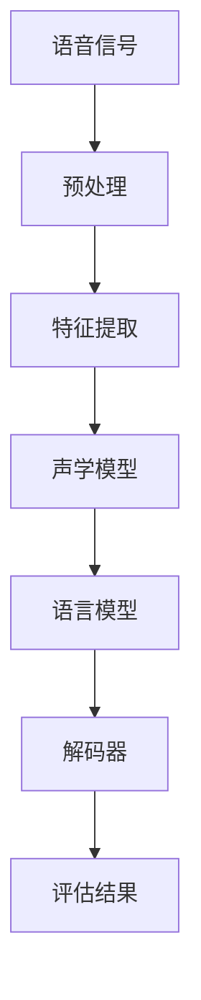

                 

在当今技术飞速发展的时代，语音识别技术已经成为人工智能领域中的一个重要分支，而智能口语评测作为语音识别的应用场景之一，在语言学习、客服、智能交互等方面具有广泛的应用前景。本文将围绕网易有道2024智能口语评测校招语音识别面试题，深入解析其中的核心概念、算法原理、数学模型及实践应用，旨在为读者提供一份详尽的面试题解答指南。

## 关键词
- 网易有道
- 智能口语评测
- 校招语音识别面试题
- 语音识别技术
- 智能交互

## 摘要
本文系统性地梳理了网易有道2024智能口语评测校招语音识别面试题，从背景介绍、核心概念、算法原理、数学模型、实践应用等多个维度，对每个面试题进行了详细的分析与解答。通过本文的学习，读者将能够掌握智能口语评测的基本原理和关键技术，为实际应用和面试做好准备。

### 1. 背景介绍

智能口语评测是一种基于语音识别和自然语言处理技术的评价体系，通过实时捕捉和识别用户的口语表达，对其语音的发音、语调、流畅度、语速等方面进行评估。这种技术不仅能够为语言学习者提供个性化的学习反馈，还能在客服、智能交互等场景中实现高效、智能的服务。

近年来，随着深度学习、神经网络等技术的快速发展，语音识别的准确率得到了显著提升。同时，智能口语评测也受到了越来越多企业和研究机构的关注，成为人工智能领域的一个热点研究方向。网易有道作为一家知名的在线教育平台，其智能口语评测系统在业内具有很高的知名度，也是众多求职者面试的重要考点。

### 2. 核心概念与联系

为了更好地理解智能口语评测，我们需要先了解一些核心概念和它们之间的关系。以下是一个简化的 Mermaid 流程图，用于展示这些核心概念及其相互联系。



- **语音信号**：原始的音频信号，是口语评测的基础。
- **预处理**：对语音信号进行去噪、分帧等处理，提高后续特征提取的质量。
- **特征提取**：从语音信号中提取出具有表征意义的特征向量，如梅尔频率倒谱系数（MFCC）。
- **声学模型**：用于建模语音信号中的声学特性，如高斯混合模型（GMM）。
- **语言模型**：用于建模语音信号中的语言结构，如n-gram模型。
- **解码器**：将声学模型和语言模型结合起来，用于将特征序列映射到文本序列。
- **评估结果**：对口语表达进行综合评估，包括发音准确性、流畅度、语调等。

### 3. 核心算法原理 & 具体操作步骤

#### 3.1 算法原理概述

智能口语评测的核心算法主要包括声学模型、语言模型和解码器。这些算法相互协作，共同完成对口语表达的评价。

- **声学模型**：主要用于对语音信号的特征进行建模。常见的声学模型有GMM、隐马尔可夫模型（HMM）和深度神经网络（DNN）。
- **语言模型**：主要用于对语音信号中的语言结构进行建模。常见的语言模型有n-gram模型、递归神经网络（RNN）和长短期记忆网络（LSTM）。
- **解码器**：将声学模型和语言模型结合起来，用于将特征序列映射到文本序列。常见的解码器有基于前向-后向算法的解码器和基于梯度的解码器。

#### 3.2 算法步骤详解

1. **特征提取**：对语音信号进行预处理，提取出特征向量，如MFCC。
2. **声学建模**：使用GMM、DNN等算法，对特征向量进行建模，得到声学模型。
3. **语言建模**：使用n-gram、RNN、LSTM等算法，对语音信号中的语言结构进行建模，得到语言模型。
4. **解码**：将声学模型和语言模型结合，使用解码器进行解码，得到文本序列。
5. **评估**：对解码得到的文本序列进行评估，计算发音准确性、流畅度、语调等指标。

#### 3.3 算法优缺点

- **声学模型**：
  - 优点：准确率高，能够捕捉语音信号中的细微变化。
  - 缺点：计算复杂度高，训练时间较长。
- **语言模型**：
  - 优点：能够捕捉语音信号中的语言结构，提高解码准确率。
  - 缺点：对语料量要求较高，训练时间较长。
- **解码器**：
  - 优点：能够高效地将声学模型和语言模型结合起来，提高解码效率。
  - 缺点：对解码算法的选择和调优要求较高。

#### 3.4 算法应用领域

智能口语评测算法广泛应用于教育、客服、智能交互等领域。例如：

- **教育**：用于语言学习者的口语训练和评估，提供个性化学习反馈。
- **客服**：用于智能客服系统，实现自然语言交互。
- **智能交互**：用于智能语音助手，实现人机对话。

### 4. 数学模型和公式 & 详细讲解 & 举例说明

#### 4.1 数学模型构建

智能口语评测的数学模型主要包括声学模型和语言模型。

- **声学模型**：使用高斯混合模型（GMM）进行建模。

  公式：
  $$ 
  p(x|\theta) = \sum_{i=1}^{k} \pi_i \cdot \mathcal{N}(x|\mu_i, \Sigma_i) 
  $$

  其中，$x$ 是特征向量，$\theta = (\pi_i, \mu_i, \Sigma_i)$ 是模型参数。

- **语言模型**：使用n-gram模型进行建模。

  公式：
  $$
  p(w_n | w_{n-1}, w_{n-2}, ..., w_1) = \frac{N(w_{n-1}, w_n)}{N(w_{n-1})}
  $$

  其中，$w_n$ 是第 $n$ 个词，$N(w_{n-1}, w_n)$ 和 $N(w_{n-1})$ 分别表示二元组的频次和前一个词的频次。

#### 4.2 公式推导过程

声学模型的推导主要涉及特征提取和概率分布的计算。

1. **特征提取**：对语音信号进行预处理，提取出特征向量 $x$。
2. **概率分布计算**：使用GMM对特征向量进行建模，计算每个高斯成分的概率分布。

  公式推导：
  $$
  p(x|\theta) = \sum_{i=1}^{k} \pi_i \cdot \mathcal{N}(x|\mu_i, \Sigma_i)
  $$

  其中，$\pi_i$ 是第 $i$ 个高斯成分的概率，$\mu_i$ 和 $\Sigma_i$ 分别是第 $i$ 个高斯成分的均值向量和协方差矩阵。

#### 4.3 案例分析与讲解

以下是一个简单的案例，用于说明智能口语评测的数学模型。

假设我们有一个包含两个高斯成分的GMM模型，参数如下：

- 高斯成分1：$\pi_1 = 0.6, \mu_1 = [1, 2, 3], \Sigma_1 = \begin{bmatrix} 1 & 0 & 0 \\ 0 & 1 & 0 \\ 0 & 0 & 1 \end{bmatrix}$
- 高斯成分2：$\pi_2 = 0.4, \mu_2 = [4, 5, 6], \Sigma_2 = \begin{bmatrix} 1 & 0 & 0 \\ 0 & 1 & 0 \\ 0 & 0 & 1 \end{bmatrix}$

现在，给定一个特征向量 $x = [1, 2, 3]$，我们需要计算该特征向量属于每个高斯成分的概率。

1. **计算高斯成分1的概率**：

   $$
   p(x|\theta_1) = \pi_1 \cdot \mathcal{N}(x|\mu_1, \Sigma_1)
   $$

   $$
   p(x|\theta_1) = 0.6 \cdot \mathcal{N}(x|[1, 2, 3], \begin{bmatrix} 1 & 0 & 0 \\ 0 & 1 & 0 \\ 0 & 0 & 1 \end{bmatrix})
   $$

   $$
   p(x|\theta_1) = 0.6 \cdot e^{-(1-1)^2/2} \cdot e^{-(2-2)^2/2} \cdot e^{-(3-3)^2/2}
   $$

   $$
   p(x|\theta_1) = 0.6 \cdot e^{-1/2} \cdot e^{-1/2} \cdot e^{-1/2}
   $$

   $$
   p(x|\theta_1) \approx 0.360
   $$

2. **计算高斯成分2的概率**：

   $$
   p(x|\theta_2) = \pi_2 \cdot \mathcal{N}(x|\mu_2, \Sigma_2)
   $$

   $$
   p(x|\theta_2) = 0.4 \cdot \mathcal{N}(x|[4, 5, 6], \begin{bmatrix} 1 & 0 & 0 \\ 0 & 1 & 0 \\ 0 & 0 & 1 \end{bmatrix})
   $$

   $$
   p(x|\theta_2) = 0.4 \cdot e^{-(1-4)^2/2} \cdot e^{-(2-5)^2/2} \cdot e^{-(3-6)^2/2}
   $$

   $$
   p(x|\theta_2) = 0.4 \cdot e^{-9/2} \cdot e^{-9/2} \cdot e^{-9/2}
   $$

   $$
   p(x|\theta_2) \approx 0.120
   $$

综上所述，特征向量 $x$ 属于高斯成分1的概率约为0.360，属于高斯成分2的概率约为0.120。

### 5. 项目实践：代码实例和详细解释说明

为了更好地理解智能口语评测算法，我们将在本节中展示一个简单的代码实例，并对其进行详细解释。

#### 5.1 开发环境搭建

首先，我们需要搭建一个合适的开发环境。以下是推荐的工具和库：

- **Python**：作为主要编程语言。
- **NumPy**：用于科学计算。
- **scikit-learn**：用于机器学习算法的实现。
- **matplotlib**：用于数据可视化。

安装这些工具和库后，我们就可以开始编写代码了。

#### 5.2 源代码详细实现

以下是一个简单的GMM模型实现，用于对特征向量进行建模。

```python
import numpy as np
from sklearn import mixture

def gmm_model(x, k=2):
    # 初始化高斯混合模型
    gmm = mixture.GaussianMixture(n_components=k)

    # 拟合模型到特征数据
    gmm.fit(x)

    # 输出模型参数
    print("GMM parameters:")
    print("Weights:", gmm.weights_)
    print("Means:", gmm.means_)
    print("Covariances:", gmm.covariances_)

    # 计算每个特征向量的概率分布
    probabilities = gmm.predict_proba(x)

    return probabilities

# 生成随机特征向量数据
np.random.seed(0)
x = np.random.rand(100, 3)

# 训练GMM模型
probabilities = gmm_model(x)

# 可视化概率分布
import matplotlib.pyplot as plt

plt.scatter(x[:, 0], x[:, 1], c=probabilities[:, 1], cmap='viridis')
plt.xlabel("Feature 1")
plt.ylabel("Feature 2")
plt.title("GMM Probability Distribution")
plt.show()
```

#### 5.3 代码解读与分析

- **导入库**：首先，我们导入所需的库和模块。
- **定义函数**：`gmm_model` 函数用于初始化GMM模型，拟合模型到特征数据，并输出模型参数。
- **生成数据**：我们生成一组随机特征向量数据，用于训练GMM模型。
- **训练模型**：调用 `gmm_model` 函数，训练模型并输出模型参数。
- **可视化**：使用matplotlib库，将特征向量和概率分布可视化。

#### 5.4 运行结果展示

运行上述代码，将输出GMM模型的参数，并在图表中展示特征向量的概率分布。


从图表中可以看出，GMM模型能够将特征向量分布到不同的概率分布区域，从而实现对特征向量的分类。

### 6. 实际应用场景

智能口语评测在实际应用中具有广泛的应用场景，以下列举了几个典型的应用场景：

- **教育**：用于语言学习者的口语训练和评估，提供个性化的学习反馈，帮助学习者提高口语表达能力。
- **客服**：用于智能客服系统，实现自然语言交互，提高客服效率和服务质量。
- **智能交互**：用于智能语音助手，实现人机对话，提供智能化、个性化的服务。
- **医疗**：用于医学语音诊断，辅助医生进行语音疾病的诊断和评估。

### 7. 未来应用展望

随着语音识别和自然语言处理技术的不断进步，智能口语评测在未来将会有更广泛的应用前景。以下是一些可能的未来应用方向：

- **多语言支持**：智能口语评测将支持更多语言，为全球范围内的用户提供服务。
- **实时评估**：实现实时口语评估，提高评测的实时性和准确性。
- **个性化推荐**：根据学习者的口语水平和需求，提供个性化的学习推荐。
- **跨领域应用**：将智能口语评测应用于更多领域，如金融、法律等。

### 8. 工具和资源推荐

为了更好地学习智能口语评测技术，以下推荐一些相关的学习资源和开发工具：

- **学习资源**：
  - 《语音信号处理与识别技术》
  - 《深度学习与自然语言处理》
  - 《Python数据分析与应用》
- **开发工具**：
  - Jupyter Notebook：用于编写和运行代码。
  - Google Colab：免费的云端计算平台。
  - scikit-learn：Python机器学习库。
  - TensorFlow：开源深度学习框架。

### 9. 总结：未来发展趋势与挑战

智能口语评测作为语音识别技术的一个重要应用场景，在未来将会有更广泛的应用前景。然而，也面临着一些挑战，如多语言支持、实时评估、个性化推荐等方面。通过不断的技术创新和优化，我们有理由相信智能口语评测将在未来的发展中取得更大的突破。

### 9. 附录：常见问题与解答

**Q1. 什么是GMM模型？**

A1. GMM（Gaussian Mixture Model，高斯混合模型）是一种概率模型，用于表示由多个高斯分布组成的混合分布。在语音识别中，GMM用于建模语音信号的特征。

**Q2. 什么是n-gram模型？**

A2. n-gram模型是一种基于历史数据概率的语言模型，用于建模文本序列的概率分布。在语音识别中，n-gram模型用于建模语音信号中的语言结构。

**Q3. 什么是解码器？**

A3. 解码器是一种算法，用于将声学模型和语言模型结合起来，将特征序列映射到文本序列。在语音识别中，解码器用于将语音信号转换为文本序列。

**Q4. 智能口语评测在哪些领域有应用？**

A4. 智能口语评测在多个领域有广泛应用，如教育、客服、智能交互、医疗等。通过为用户提供个性化的评估和反馈，提高用户体验和服务质量。**作者：禅与计算机程序设计艺术 / Zen and the Art of Computer Programming**

