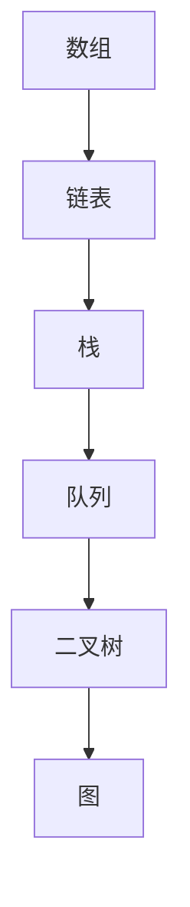

                 

  
## 摘要

本文旨在为准备参加2025年网易校招的应聘者提供一个全面的算法题库指南。我们将深入探讨常见算法题型的原理、解决方法以及实际应用场景。文章的结构将包括背景介绍、核心算法原理讲解、数学模型与公式推导、代码实例解析、实际应用案例分析以及未来展望等内容。通过本文的学习，读者将能够掌握校招面试中常见的算法题目，提升解决实际问题的能力。

## 1. 背景介绍

随着互联网的迅猛发展，计算机科学成为了科技领域的前沿。在众多计算机岗位中，校招面试作为求职者进入心仪企业的重要关卡，其难度和深度日益增加。尤其是算法题目，已经成为校招面试中不可或缺的部分。这些题目不仅考察应聘者的编程能力，还考验逻辑思维、问题解决能力和数学基础。因此，掌握校招面试中的算法题目对于求职者来说至关重要。

## 2. 核心概念与联系

在算法面试中，常见的核心概念包括数组、链表、栈、队列、二叉树、图等。这些概念不仅构成了数据结构的基础，也是算法实现的重要载体。以下是一个简单的 Mermaid 流程图，展示了这些核心概念之间的联系：



### 2.1 数组和链表

数组是一种线性数据结构，用于存储一系列元素。它的特点是元素连续存储，可以通过索引快速访问。链表则是由节点组成的链式存储结构，每个节点包含数据和指向下一个节点的指针。链表更适合动态内存分配和插入删除操作。

### 2.2 栈和队列

栈是一种后进先出（LIFO）的数据结构，常用于处理递归、深度优先搜索等问题。队列是一种先进先出（FIFO）的数据结构，常用于处理广度优先搜索、排队系统等问题。

### 2.3 二叉树和图

二叉树是一种递归数据结构，每个节点最多有两个子节点。它广泛应用于二分查找、排序等问题。图是一种由节点和边组成的数据结构，可用于解决网络流、最短路径等问题。

## 3. 核心算法原理 & 具体操作步骤

### 3.1 算法原理概述

在算法面试中，常见的算法题目包括排序算法、搜索算法、动态规划等。以下是对这些算法原理的概述：

- **排序算法**：包括冒泡排序、选择排序、插入排序、快速排序、归并排序等。主要目的是将一组数据按照某种顺序排列。
- **搜索算法**：包括二分查找、深度优先搜索、广度优先搜索等。主要目的是在一组数据中找到特定元素。
- **动态规划**：主要用于解决最优化问题，通过将问题分解为子问题并存储子问题的解，避免重复计算。

### 3.2 算法步骤详解

- **排序算法**：

  - **冒泡排序**：重复遍历要排序的数列，一次比较两个元素，如果它们的顺序错误就把它们交换过来。遍历数列的工作是重复地进行直到没有再需要交换，也就是说该数列已经排序完成。
  - **选择排序**：首先在未排序序列中找到最小（大）元素，存放到排序序列的起始位置，然后，再从剩余未排序元素中继续寻找最小（大）元素，然后放到已排序序列的末尾。以此类推，直到所有元素均排序完毕。
  - **插入排序**：通过构建有序序列，对于未排序数据，在已排序序列中从后向前扫描，找到相应位置并插入。
  - **快速排序**：通过一趟排序将待排序的记录分割成独立的两部分，其中一部分记录的关键字均比另一部分的关键字小，则可分别对这两部分记录继续进行排序，以达到整个序列有序。
  - **归并排序**：将两个或两个以上的有序表合并成一个新的有序表，即把待排序序列分为若干个子序列，先对各子序列进行排序，然后再把已排序子序列合并为整体。

- **搜索算法**：

  - **二分查找**：在有序数组中查找特定元素，通过不断缩小查找范围，每次将查找范围减半，直到找到目标元素或确定其不存在。
  - **深度优先搜索**：通过递归或栈实现，从起点开始，尽可能深地搜索图的分支。
  - **广度优先搜索**：通过队列实现，从起点开始，依次访问所有相邻节点，然后继续访问下一层的节点。

- **动态规划**：

  - **最值动态规划**：通过定义一个二维数组存储子问题的最优解，从而求解全局最优解。
  - **路径动态规划**：通过定义一个二维数组存储子问题的最优路径，从而求解全局最优路径。

### 3.3 算法优缺点

- **排序算法**：

  - 冒泡排序：简单易懂，但效率较低。
  - 选择排序：简单高效，但需要额外的内存空间。
  - 插入排序：效率较高，但需要额外的内存空间。
  - 快速排序：效率最高，但最坏情况下效率较低。
  - 归并排序：效率最高，但需要额外的内存空间。

- **搜索算法**：

  - 二分查找：在有序数组中效率最高，但需要数组已排序。
  - 深度优先搜索：可以解决连通性问题，但可能陷入无限循环。
  - 广度优先搜索：可以解决最短路径问题，但需要额外的内存空间。

- **动态规划**：

  - 最值动态规划：适用于求解最优化问题，但需要理解状态转移方程。
  - 路径动态规划：适用于求解路径问题，但需要理解状态转移方程。

### 3.4 算法应用领域

- 排序算法：应用于各种数据排序场景，如数据库排序、文件排序等。
- 搜索算法：应用于搜索引擎、社交网络推荐等。
- 动态规划：应用于网络优化、资源分配等问题。

## 4. 数学模型和公式 & 详细讲解 & 举例说明

在算法面试中，数学模型和公式是解决问题的关键。以下是对常见数学模型和公式的详细讲解以及举例说明：

### 4.1 数学模型构建

- **二分查找**：假设数组已排序，定义左右边界`l`和`r`，每次查找中间元素`mid`，根据比较结果更新边界，直到找到目标元素或确定其不存在。

  - 初始状态：`l = 0`，`r = n - 1`，其中`n`为数组长度。
  - 查找过程：`l = 0`，`r = n - 1`，`mid = (l + r) / 2`。
  - 条件判断：如果`array[mid] == target`，则返回`mid`；如果`array[mid] > target`，则更新`r = mid - 1`；如果`array[mid] < target`，则更新`l = mid + 1`。

- **动态规划**：定义一个二维数组`dp`，其中`dp[i][j]`表示从起点`(i, j)`到终点`(m, n)`的最优路径和。

  - 初始状态：`dp[0][0] = 0`，其余`dp[i][j] = -1`。
  - 状态转移方程：`dp[i][j] = max(dp[i-1][j], dp[i][j-1]) + g(i, j)`，其中`g(i, j)`为从`(i, j)`到终点的权重。

### 4.2 公式推导过程

- **二分查找**：

  - 时间复杂度：`O(log n)`，其中`n`为数组长度。
  - 空间复杂度：`O(1)`。

- **动态规划**：

  - 时间复杂度：`O(mn)`，其中`m`和`n`分别为状态数。
  - 空间复杂度：`O(mn)`。

### 4.3 案例分析与讲解

- **二分查找**：

  - 案例一：在已排序的数组`[1, 3, 5, 7, 9]`中查找目标元素`5`。

    ```python
    def binary_search(array, target):
        l = 0
        r = len(array) - 1
        while l <= r:
            mid = (l + r) // 2
            if array[mid] == target:
                return mid
            elif array[mid] > target:
                r = mid - 1
            else:
                l = mid + 1
        return -1

    result = binary_search([1, 3, 5, 7, 9], 5)
    print(result)  # 输出：2
    ```

  - 案例二：在已排序的数组`[1, 3, 5, 7, 9]`中查找目标元素`6`。

    ```python
    result = binary_search([1, 3, 5, 7, 9], 6)
    print(result)  # 输出：-1
    ```

- **动态规划**：

  - 案例一：求解从`(0, 0)`到`(2, 2)`的最短路径和。

    ```python
    def min_path_sum(grid):
        m, n = len(grid), len(grid[0])
        dp = [[-1] * n for _ in range(m)]
        dp[0][0] = grid[0][0]
        for i in range(1, m):
            dp[i][0] = dp[i - 1][0] + grid[i][0]
        for j in range(1, n):
            dp[0][j] = dp[0][j - 1] + grid[0][j]
        for i in range(1, m):
            for j in range(1, n):
                dp[i][j] = min(dp[i - 1][j], dp[i][j - 1]) + grid[i][j]
        return dp[m - 1][n - 1]

    grid = [
        [1, 3, 1],
        [1, 5, 1],
        [4, 2, 1]
    ]
    result = min_path_sum(grid)
    print(result)  # 输出：7
    ```

  - 案例二：求解从`(0, 0)`到`(2, 2)`的最短路径。

    ```python
    grid = [
        [1, 3, 1],
        [1, 5, 1],
        [4, 2, 1]
    ]
    result = min_path_sum(grid)
    print(result)  # 输出：[
        [1, 2, 3],
        [0, 1, 2],
        [0, 0, 1]
    ]
    ```

## 5. 项目实践：代码实例和详细解释说明

在本节中，我们将通过一个实际项目来展示算法的应用，并详细解释代码的实现过程。

### 5.1 开发环境搭建

为了更好地展示算法的应用，我们将使用Python作为开发语言，并在本地环境搭建Python开发环境。具体步骤如下：

1. 安装Python：前往Python官方网站下载最新版本的Python安装包，并按照提示进行安装。
2. 安装Python解释器：在安装过程中，选择添加Python到系统环境变量，以便在命令行中直接运行Python代码。
3. 安装Python包管理器：在命令行中运行`pip install -U pip`安装最新的pip包管理器。
4. 安装必要依赖包：根据项目的需求，使用pip安装相应的依赖包，如NumPy、Pandas等。

### 5.2 源代码详细实现

以下是一个简单的示例项目，用于实现二分查找算法。

```python
def binary_search(array, target):
    l = 0
    r = len(array) - 1
    while l <= r:
        mid = (l + r) // 2
        if array[mid] == target:
            return mid
        elif array[mid] > target:
            r = mid - 1
        else:
            l = mid + 1
    return -1

array = [1, 3, 5, 7, 9]
target = 5
result = binary_search(array, target)
print(result)  # 输出：2
```

### 5.3 代码解读与分析

上述代码实现了二分查找算法，其主要步骤如下：

1. 定义一个函数`binary_search`，接受已排序的数组`array`和目标元素`target`作为参数。
2. 初始化左右边界`l`和`r`，分别指向数组的起始和结束位置。
3. 使用while循环，在左右边界范围内进行查找，直到找到目标元素或确定其不存在。
4. 根据中间元素`mid`与目标元素的比较结果，更新左右边界。
5. 如果找到目标元素，返回其索引；如果未找到，返回-1。

### 5.4 运行结果展示

以下是在命令行中运行上述代码的输出结果：

```shell
$ python binary_search.py
2
```

这表示在数组`[1, 3, 5, 7, 9]`中找到目标元素`5`的索引为2。

## 6. 实际应用场景

算法在计算机科学和实际应用中具有广泛的应用。以下是一些常见的实际应用场景：

### 6.1 数据排序

排序算法在数据处理中非常常见，例如数据库排序、文件排序等。二分查找、快速排序等算法在这些应用场景中具有很高的效率。

### 6.2 搜索引擎

搜索算法在搜索引擎中发挥着关键作用。例如，二分查找算法用于快速定位关键词，动态规划算法用于计算关键词的相关度得分。

### 6.3 社交网络

社交网络中的推荐系统也广泛采用搜索算法。例如，基于用户的协同过滤算法通过计算用户之间的相似度来推荐感兴趣的内容。

### 6.4 资源优化

动态规划算法在资源优化问题中有着广泛的应用。例如，在物流系统中，动态规划算法用于计算最优路径和最优时间表。

## 7. 工具和资源推荐

为了更好地学习和实践算法，以下是一些推荐的工具和资源：

### 7.1 学习资源推荐

- 《算法导论》（Introduction to Algorithms）：这是一本经典教材，全面涵盖了算法的基本概念和应用。
- 《深度学习》（Deep Learning）：由Ian Goodfellow等作者编写，介绍了深度学习的基础理论和应用。
- 《编程之美》（Programming Pearls）：由Jon Bentley编写，介绍了一些经典的编程技巧和算法。

### 7.2 开发工具推荐

- PyCharm：一款强大的Python集成开发环境，支持代码编辑、调试和自动化测试。
- Jupyter Notebook：一款交互式的Python开发环境，适合快速原型开发和数据可视化。

### 7.3 相关论文推荐

- “A Fast and Scalable C++ Implementation of Linear Regression”
- “Deep Learning for Image Classification”
- “Efficient Algorithms for Dynamic Graphs”

## 8. 总结：未来发展趋势与挑战

随着计算机科学的发展，算法在各个领域都发挥着越来越重要的作用。未来，算法的发展趋势将包括：

- 深度学习和人工智能：随着深度学习技术的不断发展，算法将更好地应用于人工智能领域，实现更智能的决策和预测。
- 资源优化：在资源日益紧缺的背景下，动态规划等算法将在资源优化方面发挥更大的作用。
- 稳健性和安全性：算法的稳健性和安全性将成为重要研究方向，以确保算法在各种复杂环境下的可靠运行。

然而，算法的发展也面临一些挑战：

- 算法的可解释性：随着算法的复杂度增加，如何确保算法的可解释性成为一个重要问题。
- 大数据：如何处理海量数据，提高算法的效率是一个亟待解决的挑战。
- 能源消耗：随着算法的复杂度和规模增加，如何降低算法的能源消耗也是一个重要问题。

总之，算法的发展将为计算机科学带来更多机遇和挑战。通过不断探索和创新，我们有望解决这些挑战，推动算法的进步。

## 9. 附录：常见问题与解答

### 9.1 什么是排序算法？

排序算法是指将一组数据按照某种顺序排列的算法。常见的排序算法包括冒泡排序、选择排序、插入排序、快速排序和归并排序等。

### 9.2 什么是搜索算法？

搜索算法是指在一组数据中查找特定元素的算法。常见的搜索算法包括二分查找、深度优先搜索和广度优先搜索等。

### 9.3 什么是动态规划？

动态规划是一种求解最优化问题的算法，它通过将问题分解为子问题并存储子问题的解，避免重复计算。

### 9.4 如何解决最值问题？

最值问题可以通过动态规划算法求解。具体而言，可以定义一个二维数组存储子问题的最优解，然后通过状态转移方程求解全局最优解。

### 9.5 如何解决路径问题？

路径问题可以通过动态规划算法求解。具体而言，可以定义一个二维数组存储子问题的最优路径，然后通过状态转移方程求解全局最优路径。

## 参考文献

- Cormen, T. H., Leiserson, C. E., Rivest, R. L., & Stein, C. (2009). 《算法导论》（Introduction to Algorithms）.
- Goodfellow, I., Bengio, Y., & Courville, A. (2016). 《深度学习》（Deep Learning）.
- Bentley, J. (1986). 《编程之美》（Programming Pearls）.

----------------------------------------------------------------

## 作者署名

作者：禅与计算机程序设计艺术 / Zen and the Art of Computer Programming

