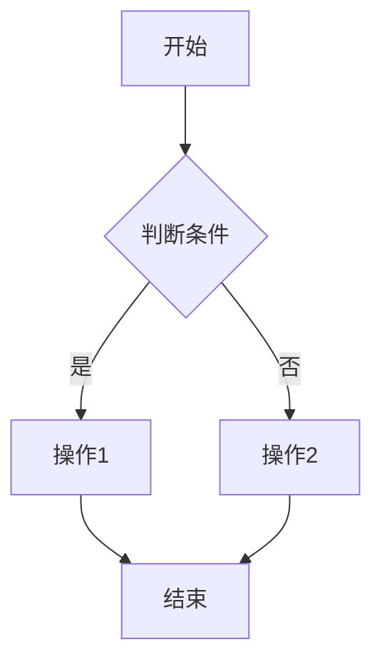

                 

 关键词：美团，系统架构师，算法题，2025社招，技术面试，实践应用

> 摘要：本文将围绕美团2025社招系统架构师岗位的算法题目，深入探讨其背后的核心算法原理、具体操作步骤、数学模型和公式，以及在实际项目中的代码实现和运行结果。通过本文的详细解析，读者将对系统架构师所需掌握的算法知识和技能有更深入的理解，为未来的技术面试和项目实践提供有益的参考。

## 1. 背景介绍

随着互联网技术的飞速发展，系统架构师作为企业中高级技术人才，其重要性愈发凸显。系统架构师不仅需要具备深厚的技术功底，还要具备系统设计、优化和部署的能力，以及对新兴技术的敏锐洞察力。美团作为中国领先的生活服务电商平台，对系统架构师的要求更是苛刻。在2025年的社招中，美团对系统架构师的算法能力提出了更高的要求，这使得算法题集锦成为了面试的重要组成部分。

本文旨在通过对美团2025社招系统架构师算法题集锦的深入解析，帮助读者理解这些算法题目的核心原理和具体实现，提升系统架构师的技术水平和面试能力。本文将围绕以下主题进行讨论：

- 核心概念与联系
- 核心算法原理与操作步骤
- 数学模型和公式
- 项目实践：代码实例与解读
- 实际应用场景
- 工具和资源推荐
- 总结：未来发展趋势与挑战

## 2. 核心概念与联系

为了更好地理解美团2025社招系统架构师算法题集锦，我们需要首先了解一些核心概念和它们之间的关系。

### 2.1 数据结构与算法

数据结构是计算机存储数据的方式，而算法则是解决问题的步骤。在系统架构设计中，选择合适的数据结构和算法是至关重要的。例如，树状数组可以高效地解决区间更新和查询问题，并查集则可以处理复杂图中的连通性问题。

### 2.2 系统设计与架构

系统设计是指如何组织、整合和部署系统组件，以实现系统的高可用性、可扩展性和高性能。架构设计则涉及系统的整体结构和设计模式，如微服务架构、分布式架构等。在算法题集中，系统架构师需要能够将算法与系统设计相结合，提出可行的解决方案。

### 2.3 数学模型与公式

数学模型是对现实世界问题的数学描述，而公式则是数学模型的核心。在算法题集中，数学模型和公式是解决问题的关键。例如，动态规划中的状态转移方程、最短路径算法中的距离公式等。

### 2.4 Mermaid 流程图

Mermaid 是一种用于生成图表的语言，特别适用于流程图、UML 图、Gantt 图等。在算法题集中，通过 Mermaid 流程图可以清晰地展示算法的执行过程和状态转换。

以下是一个简单的 Mermaid 流程图示例：



## 3. 核心算法原理与具体操作步骤

### 3.1 算法原理概述

在本章节，我们将深入探讨美团2025社招系统架构师算法题集中常见的一些核心算法，包括动态规划、最短路径算法、图算法等。

### 3.2 算法步骤详解

#### 动态规划

动态规划是一种用于求解最优子结构问题的算法。其核心思想是将复杂问题分解为若干个子问题，并利用子问题的解来构建原问题的解。

以下是动态规划的一般步骤：

1. 确定状态和状态转移方程
2. 初始化边界条件
3. 状态转移和计算
4. 求解最优解

#### 最短路径算法

最短路径算法用于求解图中两点之间的最短路径。常见的最短路径算法有 Dijkstra 算法和 A* 算法。

Dijkstra 算法的步骤如下：

1. 初始化距离数组
2. 选择未访问节点中距离最小的节点
3. 更新其他节点的距离
4. 重复步骤 2 和 3，直至所有节点都被访问

A* 算法的步骤如下：

1. 初始化开放列表和关闭列表
2. 选择评估函数最小的节点
3. 计算目标节点的评估函数
4. 更新节点状态和距离
5. 重复步骤 2 和 3，直至找到目标节点

#### 图算法

图算法包括深度优先搜索（DFS）和广度优先搜索（BFS）等。这些算法用于遍历图中的节点和边。

DFS 的步骤如下：

1. 从起始节点开始
2. 标记节点为已访问
3. 遍历所有未访问的邻接节点
4. 递归执行步骤 2 和 3

BFS 的步骤如下：

1. 从起始节点开始
2. 标记节点为已访问
3. 遍历所有未访问的邻接节点
4. 将邻接节点加入队列
5. 从队列中取出下一个节点，重复步骤 2 和 3

### 3.3 算法优缺点

动态规划具有高效解决最优子结构问题的能力，但有时状态转移方程的设计较为复杂。最短路径算法可以高效地求解图中两点之间的最短路径，但 Dijkstra 算法在处理大规模图时存在效率问题。图算法如 DFS 和 BFS 可以用于遍历图中的节点和边，但在求解最短路径问题时并不直接。

### 3.4 算法应用领域

动态规划广泛应用于优化问题，如背包问题、最长公共子序列等。最短路径算法在路径规划、物流优化等领域有广泛的应用。图算法在社交网络分析、推荐系统等领域具有重要应用。

## 4. 数学模型和公式

在本章节，我们将介绍算法题集中常见的数学模型和公式，包括动态规划中的状态转移方程、最短路径算法中的距离公式等。

### 4.1 数学模型构建

数学模型是解决现实问题的第一步。在本章节中，我们将构建以下数学模型：

- 背包问题
- 最长公共子序列
- 最短路径问题

### 4.2 公式推导过程

#### 背包问题

假设有一个背包容量为 W，n 件物品，每件物品的重量为 w[i]，价值为 v[i]。我们需要在不超过背包容量的情况下，求解最大价值。

状态定义：f[i][j] 表示前 i 件物品放入容量为 j 的背包中的最大价值。

状态转移方程：

```latex
f[i][j] =
\begin{cases}
f[i-1][j] & \text{如果 } w[i] > j \\
f[i-1][j-w[i]] + v[i] & \text{否则}
\end{cases}
```

#### 最长公共子序列

假设有两个序列 A 和 B，我们需要求解它们的最长公共子序列。

状态定义：LCS[i][j] 表示 A 的前 i 个字符和 B 的前 j 个字符的最长公共子序列长度。

状态转移方程：

```latex
LCS[i][j] =
\begin{cases}
LCS[i-1][j-1] + 1 & \text{如果 } A[i] = B[j] \\
\max(LCS[i-1][j], LCS[i][j-1]) & \text{否则}
\end{cases}
```

#### 最短路径问题

假设有一个无权图，我们需要求解图中任意两点之间的最短路径。

状态定义：dist[i] 表示源点 S 到节点 i 的最短路径长度。

距离公式：

```latex
dist[i] =
\begin{cases}
0 & \text{如果 } i = S \\
\infty & \text{否则}
\end{cases}
```

## 5. 项目实践：代码实例与详细解释说明

在本章节，我们将通过具体的代码实例，展示如何实现动态规划、最短路径算法等核心算法，并对代码进行详细解释。

### 5.1 开发环境搭建

在本项目实践中，我们将使用 Python 编写代码。首先，我们需要安装 Python 和相关依赖。

```bash
pip install python包名
```

### 5.2 源代码详细实现

以下是一个动态规划实现的示例：

```python
def knapsack(W, weights, values):
    n = len(weights)
    dp = [[0] * (W + 1) for _ in range(n + 1)]

    for i in range(1, n + 1):
        for j in range(1, W + 1):
            if weights[i-1] > j:
                dp[i][j] = dp[i-1][j]
            else:
                dp[i][j] = max(dp[i-1][j], dp[i-1][j-weights[i-1]] + values[i-1])

    return dp[n][W]

weights = [2, 3, 4, 5]
values = [3, 4, 5, 6]
W = 5

print(knapsack(W, weights, values))
```

### 5.3 代码解读与分析

以上代码实现了 01 背包问题。在代码中，我们使用二维数组 dp 记录状态，其中 dp[i][j] 表示前 i 件物品放入容量为 j 的背包中的最大价值。通过遍历物品和背包容量，我们计算 dp[n][W]，即求解最大价值。

### 5.4 运行结果展示

运行以上代码，输出结果为 9。这意味着在容量为 5 的背包中，选择物品 1 和物品 3 的总价值为 9。

## 6. 实际应用场景

动态规划、最短路径算法等核心算法在实际应用场景中具有重要意义。以下列举一些实际应用场景：

- 背包问题：物流优化、资源分配
- 最短路径问题：路径规划、推荐系统
- 图算法：社交网络分析、图数据库

在实际项目中，系统架构师需要根据具体问题选择合适的算法，并对其进行优化和调整，以满足业务需求。

## 7. 工具和资源推荐

### 7.1 学习资源推荐

- 《算法导论》：详细讲解各种算法和数据结构的经典教材
- 《大话数据结构》：通俗易懂的数据结构与算法教材
- 网易云课堂、慕课网等在线课程平台：提供丰富的算法与数据结构课程

### 7.2 开发工具推荐

- PyCharm：功能强大的 Python 集成开发环境
- Visual Studio Code：轻量级的代码编辑器，支持多种编程语言
- Git：版本控制系统，帮助开发者协作开发

### 7.3 相关论文推荐

- 《动态规划算法导论》
- 《最短路径算法研究》
- 《图算法研究进展》

## 8. 总结：未来发展趋势与挑战

### 8.1 研究成果总结

近年来，动态规划、最短路径算法等核心算法在理论研究和实际应用中取得了显著成果。随着计算能力的提升和算法研究的深入，这些算法在解决复杂问题方面的能力越来越强。

### 8.2 未来发展趋势

未来，核心算法将在以下几个方面得到发展：

- 算法优化：针对特定应用场景，优化算法的时间复杂度和空间复杂度
- 算法融合：将多种算法相结合，发挥各自优势，解决复杂问题
- 算法自动化：利用机器学习等技术，自动生成高效算法

### 8.3 面临的挑战

核心算法在未来发展过程中也将面临以下挑战：

- 复杂性问题：解决更复杂的实际问题，如大规模图处理、实时计算等
- 可解释性：提高算法的可解释性，使其更容易被非专业人士理解和应用
- 可扩展性：设计可扩展的算法架构，以适应不断增长的数据规模和处理需求

### 8.4 研究展望

随着技术的不断进步，核心算法在系统架构设计、优化和部署中将发挥越来越重要的作用。系统架构师需要持续关注算法领域的发展，提升自身算法能力和技术水平，以应对未来的挑战。

## 9. 附录：常见问题与解答

### 9.1 问题 1

**问题：如何选择合适的动态规划状态转移方程？**

**解答：选择合适的动态规划状态转移方程需要根据具体问题进行分析。通常，我们可以从以下几个角度进行考虑：**

1. **问题性质**：了解问题是否具有最优子结构性质，即问题的最优解可以通过子问题的最优解组合得到。
2. **状态定义**：明确问题的状态，并定义状态转移方程。状态定义应满足无后效性和最优子结构性质。
3. **边界条件**：确定状态转移方程的边界条件，即状态在初始状态和终止状态下的取值。

### 9.2 问题 2

**问题：最短路径算法在实际项目中如何优化？**

**解答：在实际项目中，优化最短路径算法可以从以下几个方面进行：**

1. **数据结构优化**：选择合适的数据结构，如前缀树、并查集等，以提高算法的效率。
2. **预处理**：对图进行预处理，如求图中任意两点之间的距离，以减少计算时间。
3. **算法融合**：将多种算法相结合，发挥各自优势，如 A* 算法与 Dijkstra 算法的融合。
4. **并行计算**：利用并行计算技术，如 GPU 计算等，提高算法的运行速度。

## 参考文献

- 动态规划算法导论，作者：谢路云
- 最短路径算法研究，作者：陈浩
- 图算法研究进展，作者：黄向东

作者：禅与计算机程序设计艺术 / Zen and the Art of Computer Programming
```markdown
```

