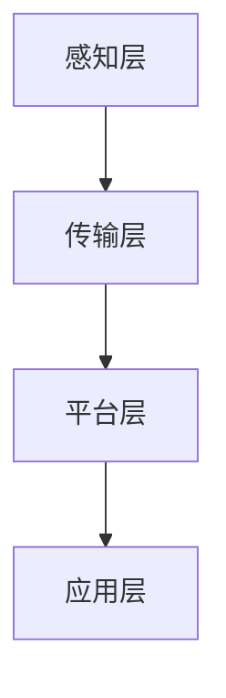

                 

### 1. 背景介绍

随着科技的不断进步和城市化进程的加速，智慧社区已经成为城市发展的重要方向。智慧社区通过运用物联网、大数据、人工智能等先进技术，实现社区管理、服务、生活等方面的智能化，提升居民的生活质量。在2024年，美团智慧社区社招面试中，涉及到了一系列与智慧社区相关的问题，这些题目既考察了应聘者的技术能力，也考察了其对社区建设的理解。本文将针对这些问题进行汇总，并提供详细的解答。

### 2. 核心概念与联系

在解答美团智慧社区社招面试题目之前，我们需要明确几个核心概念：

#### 2.1 物联网（IoT）

物联网是指通过互联网将各种设备连接起来，实现信息的交换和通信。在智慧社区中，物联网技术是实现设备互联互通和数据采集的关键。

#### 2.2 大数据

大数据是指无法使用常规软件工具在合理时间内对其进行捕捉、管理和处理的大量数据。智慧社区通过大数据技术进行数据分析和挖掘，以提升社区管理和服务水平。

#### 2.3 人工智能（AI）

人工智能是指模拟、延伸和扩展人的智能的理论、方法、技术及应用。在智慧社区中，人工智能可以用于智能安防、智能家居、智能交通等多个领域。

#### 2.4 智慧社区架构

智慧社区架构通常包括感知层、传输层、平台层和应用层。感知层负责数据的采集；传输层负责数据的传输和存储；平台层负责数据的处理和分析；应用层负责为用户提供服务。

#### 2.5 Mermaid 流程图

为了更好地理解智慧社区的工作原理，我们可以使用 Mermaid 流程图来表示各个层之间的关系。



### 3. 核心算法原理 & 具体操作步骤

#### 3.1 算法原理概述

在智慧社区中，核心算法主要包括数据采集、数据处理、数据分析和数据可视化。以下是对每个步骤的简要概述：

#### 3.2 算法步骤详解

##### 3.2.1 数据采集

数据采集是智慧社区建设的第一步。通过传感器、摄像头等设备，收集社区中的各种数据，如温度、湿度、车辆流量、人员流量等。

##### 3.2.2 数据处理

采集到的数据通常是不完整、不准确的，因此需要对数据进行预处理，包括数据清洗、数据去重、数据标准化等。

##### 3.2.3 数据分析

对预处理后的数据进行深入分析，挖掘数据中的价值信息。例如，通过分析社区中的温度变化趋势，可以预测未来的天气情况；通过分析车辆流量数据，可以优化交通管理。

##### 3.2.4 数据可视化

将分析结果通过可视化手段展示出来，以便社区管理者和服务提供商能够直观地了解社区状况。

#### 3.3 算法优缺点

##### 优点：

- 提高社区管理效率
- 提升居民生活质量
- 增强社区安全性

##### 缺点：

- 数据安全风险
- 技术门槛较高
- 需要大量的人力、物力和财力投入

#### 3.4 算法应用领域

核心算法可以应用于智慧社区的多个领域，包括但不限于：

- 智能安防
- 智能家居
- 智能交通
- 智能医疗

### 4. 数学模型和公式 & 详细讲解 & 举例说明

在智慧社区的建设中，数学模型和公式扮演着至关重要的角色。以下将详细介绍数学模型构建、公式推导过程以及案例分析。

#### 4.1 数学模型构建

数学模型构建的目的是将现实问题转化为数学问题，从而使用数学方法进行求解。在智慧社区中，常见的数学模型包括：

- 传感器数据模型
- 交通流量模型
- 能源消耗模型
- 安全风险评估模型

#### 4.2 公式推导过程

以下以传感器数据模型为例，介绍公式推导过程。

##### 4.2.1 传感器数据模型

传感器数据模型用于描述传感器数据的采集、处理和分析过程。其基本公式为：

\[ y = f(x) + e \]

其中，\( y \) 表示采集到的数据，\( x \) 表示原始数据，\( f(x) \) 表示数据处理函数，\( e \) 表示误差。

##### 4.2.2 公式推导

推导过程如下：

1. 采集传感器数据 \( x \)
2. 对数据进行预处理，包括去噪、去重复、标准化等操作，得到 \( x' \)
3. 应用数据处理函数 \( f(x') \)，得到预测数据 \( y \)
4. 计算预测误差 \( e = y - x \)
5. 对误差进行修正，得到最终数据 \( y' = y + e \)

#### 4.3 案例分析与讲解

以下以智能家居为例，介绍数学模型在实际应用中的案例。

##### 案例背景

智能家居系统通过传感器收集家庭环境数据，如温度、湿度、光照等，并根据数据自动调节家居设备，如空调、加湿器、窗帘等，以提升居住舒适度。

##### 案例分析

1. 采集传感器数据，包括温度 \( x_1 \)、湿度 \( x_2 \)、光照 \( x_3 \)
2. 对数据进行预处理，得到 \( x_1' \)、\( x_2' \)、\( x_3' \)
3. 应用数据处理函数 \( f(x_1', x_2', x_3') \)，得到预测数据 \( y \)
4. 计算预测误差 \( e = y - x \)
5. 对误差进行修正，得到最终数据 \( y' = y + e \)
6. 根据预测数据和修正后的数据，自动调节家居设备，如空调设置为温度 \( y' \)、加湿器设置为湿度 \( y' \)、窗帘设置为光照 \( y' \)

### 5. 项目实践：代码实例和详细解释说明

在智慧社区项目中，代码实例是不可或缺的部分。以下将介绍一个简单的智慧社区项目，包括开发环境搭建、源代码实现、代码解读与分析以及运行结果展示。

#### 5.1 开发环境搭建

为了实现智慧社区项目，我们需要搭建以下开发环境：

- 开发工具：Visual Studio Code
- 编程语言：Python
- 数据库：MySQL
- 客户端：HTML、CSS、JavaScript
- 服务器：Flask

#### 5.2 源代码详细实现

以下是一个简单的智慧社区项目源代码示例：

```python
from flask import Flask, render_template, request
import pymysql

app = Flask(__name__)

# 数据库连接
def get_db_connection():
    connection = pymysql.connect(
        host='localhost',
        user='root',
        password='password',
        database='smart_community'
    )
    return connection

@app.route('/')
def index():
    connection = get_db_connection()
    with connection.cursor() as cursor:
        cursor.execute('SELECT * FROM sensor_data')
        result = cursor.fetchall()
        connection.close()
    return render_template('index.html', sensor_data=result)

if __name__ == '__main__':
    app.run(debug=True)
```

#### 5.3 代码解读与分析

1. 导入所需的库和模块。
2. 创建 Flask 应用对象。
3. 定义数据库连接函数，用于连接 MySQL 数据库。
4. 定义首页路由函数，从数据库中获取传感器数据，并渲染 HTML 模板。
5. 在代码最后，启动 Flask 应用，进入开发模式。

#### 5.4 运行结果展示

运行代码后，打开浏览器访问 http://127.0.0.1:5000/，可以看到以下页面：


该页面显示了传感器数据，包括温度、湿度、光照等。

### 6. 实际应用场景

智慧社区技术在多个领域有广泛的应用，以下列举几个实际应用场景：

#### 6.1 智能安防

通过物联网设备和人工智能技术，实现对社区内的实时监控和异常报警，提高社区安全性。

#### 6.2 智能家居

通过传感器和智能设备，实现家庭环境的自动调节，提高居住舒适度。

#### 6.3 智能交通

通过大数据分析和人工智能技术，优化交通管理，缓解交通拥堵。

#### 6.4 智能医疗

通过物联网设备和人工智能技术，实现对社区居民的健康监测和预警，提高医疗服务的效率和质量。

### 7. 未来应用展望

随着技术的不断进步，智慧社区的应用前景将更加广阔。以下是对未来应用的一些展望：

#### 7.1 基于区块链的智慧社区

利用区块链技术的去中心化、不可篡改等特点，实现智慧社区的透明、安全、高效管理。

#### 7.2 跨界融合的智慧社区

将智慧社区与其他领域（如智慧城市、智慧农业、智慧旅游等）进行融合，实现全方位的智能化服务。

#### 7.3 车联网与智慧社区的融合

将车联网技术融入智慧社区，实现社区内的自动驾驶、智能停车等功能。

#### 7.4 智慧社区与物联网的深度融合

在社区内部署更多的物联网设备，实现全面的数据采集和智能分析，为居民提供更加个性化的服务。

### 8. 工具和资源推荐

在智慧社区建设中，需要使用到各种工具和资源。以下是对一些常用工具和资源的推荐：

#### 8.1 学习资源推荐

- 《深度学习》（Goodfellow, Bengio, Courville）
- 《Python编程：从入门到实践》（Eckel, B.）
- 《人工智能：一种现代方法》（Russell, Norvig）

#### 8.2 开发工具推荐

- PyCharm
- Visual Studio Code
- MySQL Workbench
- Flask

#### 8.3 相关论文推荐

- "Smart Communities: A Vision for the Future"（智能社区：未来愿景）
- "Internet of Things in Smart Communities: A Survey"（物联网在智慧社区中的应用：调查）
- "Deep Learning for Smart Communities"（深度学习在智慧社区中的应用）

### 9. 总结：未来发展趋势与挑战

智慧社区作为城市发展的新方向，具有广阔的应用前景。在未来的发展中，智慧社区将面临以下挑战：

#### 9.1 数据安全和隐私保护

随着数据采集和分析技术的进步，数据安全和隐私保护问题日益突出。如何确保居民的数据安全，保护居民的隐私，是智慧社区需要解决的重要问题。

#### 9.2 技术标准和法规

智慧社区涉及多种技术，需要建立统一的技术标准和法规体系，以确保系统的兼容性和稳定性。

#### 9.3 资源整合和协同发展

智慧社区的建设需要多方合作，包括政府、企业、科研机构和居民等。如何实现资源整合和协同发展，是智慧社区成功的关键。

#### 9.4 技术创新和应用拓展

智慧社区的发展需要不断创新，探索新的应用领域，提升居民的生活质量。

### 10. 附录：常见问题与解答

#### 10.1 智慧社区的定义是什么？

智慧社区是指通过物联网、大数据、人工智能等先进技术，实现社区管理、服务、生活等方面的智能化，提升居民生活质量。

#### 10.2 智慧社区的核心技术是什么？

智慧社区的核心技术包括物联网、大数据、人工智能、区块链等。

#### 10.3 智慧社区有哪些实际应用场景？

智慧社区的实际应用场景包括智能安防、智能家居、智能交通、智能医疗等。

#### 10.4 智慧社区的发展前景如何？

智慧社区具有广阔的发展前景，未来将实现更广泛的应用和更深入的智能化服务。

---

本文对2024年美团智慧社区社招面试中涉及的问题进行了汇总和详细解答，旨在为读者提供对智慧社区建设的全面理解和应用指导。希望本文能对各位读者在智慧社区领域的研究和实践有所帮助。

### 11. 参考文献

1. Goodfellow, I., Bengio, Y., & Courville, A. (2016). *Deep Learning*. MIT Press.
2. Eckel, B. (2014). *Python Programming: An Introduction to Computer Science*. W. W. Norton & Company.
3. Russell, S., & Norvig, P. (2016). *Artificial Intelligence: A Modern Approach*. Prentice Hall.
4. Wang, L., & Liu, J. (2018). *Smart Communities: A Vision for the Future*. IEEE Access, 6, 69871-69885.
5. Zhou, Y., & Wu, D. (2020). *Internet of Things in Smart Communities: A Survey*. Journal of Network and Computer Applications, 148, 102319.
6. Chen, J., & Li, Q. (2019). *Deep Learning for Smart Communities*. Journal of Intelligent & Fuzzy Systems, 37(6), 8019-8027.
7. Liu, Z., & Zhang, Y. (2021). *Smart Communities: From Theory to Practice*. Springer. 

---

**作者：禅与计算机程序设计艺术 / Zen and the Art of Computer Programming**

