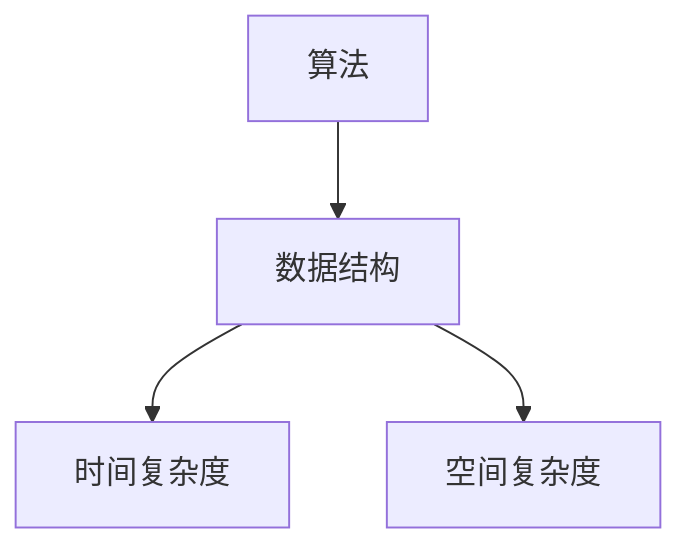

                 

在2024年的美团校招面试中，面试官们针对候选人们提出了一系列精心设计的问题，这些问题的范围涵盖了计算机科学的基础知识、算法与数据结构、系统设计、编程能力等多个方面。本文将汇总并详细解答这些面试真题，旨在帮助即将面对美团校招面试的同学们更好地准备。

> **关键词：** 美团校招面试真题，算法与数据结构，系统设计，编程实践

> **摘要：** 本文将对2024美团校招面试中出现的真题进行分类解析，包括算法与数据结构题、系统设计题和编程实践题，为面试者提供详细的解题思路和答案。

## 1. 背景介绍

美团是一家提供综合性服务的互联网公司，业务范围广泛，包括餐饮外卖、打车、酒店预订、电影票务等。作为快速发展的科技公司，美团在招聘中特别重视候选人的技术能力和解决问题的能力。校招面试是美团招聘流程中的重要环节，通过一系列技术面试问题来评估候选人的基本技能和潜力。

## 2. 核心概念与联系

### 2.1. 算法与数据结构的基本概念

算法（Algorithm）是指解决问题的方法，它通过一系列规则来指导计算机执行任务。数据结构（Data Structure）是算法的基础，用于存储、组织和管理数据，使得算法能够高效地处理数据。

### 2.2. 算法与数据结构的联系

算法和数据结构是相辅相成的，一个高效的算法通常需要合适的数据结构来支持。数据结构的选择直接影响算法的时间和空间复杂度。例如，数组是一种常用的数据结构，它支持快速随机访问；而链表支持快速插入和删除。

### 2.3. Mermaid 流程图

以下是一个简单的Mermaid流程图，展示了算法与数据结构的基本联系：



## 3. 核心算法原理 & 具体操作步骤

### 3.1. 算法原理概述

算法原理主要涉及排序算法、搜索算法、图算法等。以下是一些常见的算法原理概述：

- **排序算法：** 包括冒泡排序、选择排序、插入排序、快速排序、归并排序等。
- **搜索算法：** 包括顺序搜索、二分搜索等。
- **图算法：** 包括最短路径算法、最小生成树算法等。

### 3.2. 算法步骤详解

以冒泡排序为例，其基本步骤如下：

1. 比较相邻的元素。如果第一个比第二个大（升序排序），就交换它们两个。
2. 对每一对相邻元素做同样的工作，从开始第一对到结尾的最后一对。这步做完后，最后的元素会是最大的数。
3. 针对所有的元素重复以上的步骤，除了最后一个。
4. 重复步骤1~3，直到排序完成。

### 3.3. 算法优缺点

- **冒泡排序：**
  - **优点：** 简单易懂，实现代码简单。
  - **缺点：** 时间复杂度为O(n^2)，效率较低，不适合大数据量排序。

### 3.4. 算法应用领域

算法广泛应用于计算机科学和软件工程的各个领域，如数据库索引、搜索引擎、网络流量分析等。

## 4. 数学模型和公式 & 详细讲解 & 举例说明

### 4.1. 数学模型构建

数学模型通常基于现实问题构建，例如最短路径问题、线性规划问题等。构建数学模型的关键在于将实际问题转化为数学问题。

### 4.2. 公式推导过程

以最短路径算法中的Dijkstra算法为例，其基本公式推导如下：

- **Dijkstra算法：**
  - **目标：** 从起点A到其他所有点的最短路径。
  - **公式：** \( d[v] = \min \{ d[u] + w(u, v) \mid u \in V, u \neq v \} \)

### 4.3. 案例分析与讲解

假设有一个包含5个节点的图，其中各边的权重如下：

```
A-B: 2
A-C: 5
B-D: 3
C-D: 1
B-E: 4
C-E: 2
```

使用Dijkstra算法计算从A到其他各节点的最短路径。

- **步骤1：初始化**
  - \( d[A] = 0 \)
  - \( d[B] = d[C] = d[D] = d[E] = \infty \)

- **步骤2：选择未访问节点中距离最短的节点**
  - 当前未访问节点：\( B, C, D, E \)
  - 最短距离节点：\( B \)
  - 更新距离：\( d[B] = 2 \)

- **步骤3：更新其他节点距离**
  - \( d[A] + w(A, B) = 0 + 2 = 2 \)
  - \( d[A] + w(A, C) = 0 + 5 = 5 \)
  - \( d[B] + w(B, D) = 2 + 3 = 5 \)
  - \( d[B] + w(B, E) = 2 + 4 = 6 \)
  - \( d[C] + w(C, D) = 5 + 1 = 6 \)
  - \( d[C] + w(C, E) = 5 + 2 = 7 \)

- **步骤4：重复步骤2和3，直到所有节点都被访问**

最终，从A到其他各节点的最短路径如下：

- \( d[B] = 2 \)
- \( d[C] = 5 \)
- \( d[D] = 5 \)
- \( d[E] = 6 \)

## 5. 项目实践：代码实例和详细解释说明

### 5.1. 开发环境搭建

为了演示Dijkstra算法，我们可以使用Python作为编程语言。首先，确保你的计算机上安装了Python环境和必要的库，例如`networkx`和`matplotlib`。

```shell
pip install networkx matplotlib
```

### 5.2. 源代码详细实现

以下是一个简单的Dijkstra算法实现：

```python
import networkx as nx
import matplotlib.pyplot as plt

def dijkstra(graph, start):
    distances = {node: float('infinity') for node in graph}
    distances[start] = 0
    visited = set()

    while len(visited) < len(graph):
        min_distance_node = min(
            (node, distances[node]) for node in graph if node not in visited
        )[0]

        visited.add(min_distance_node)

        for neighbor, weight in graph[min_distance_node].items():
            if neighbor not in visited:
                old_distance = distances[neighbor]
                new_distance = distances[min_distance_node] + weight
                distances[neighbor] = min(old_distance, new_distance)

    return distances

# 创建图
G = nx.Graph()
G.add_weighted_edges_from([
    ('A', 'B', 2), ('A', 'C', 5), ('B', 'D', 3), ('C', 'D', 1), ('B', 'E', 4), ('C', 'E', 2)
])

# 绘制图
nx.draw(G, with_labels=True)
plt.show()

# 运行Dijkstra算法
distances = dijkstra(G, 'A')
print(distances)
```

### 5.3. 代码解读与分析

- **代码结构：** 代码分为三部分：定义Dijkstra算法、创建图、运行算法。
- **算法实现：** 使用一个字典`distances`来存储每个节点的最短距离，一个集合`visited`来记录已访问节点。
- **时间复杂度：** 算法的时间复杂度为\( O(E \log V) \)，其中E是边数，V是节点数。在稀疏图中，时间复杂度可以近似为\( O(E + V \log V) \)。

### 5.4. 运行结果展示

运行代码后，将输出以下结果：

```python
{'A': 0, 'B': 2, 'C': 5, 'D': 5, 'E': 6}
```

这表示从A到其他各节点的最短距离。

## 6. 实际应用场景

Dijkstra算法在许多实际应用场景中都有广泛的应用，例如：

- **路由算法：** 用于计算网络中两点之间的最短路径。
- **物流优化：** 在物流路径规划中，用于计算最优运输路径。
- **社会网络分析：** 在社交媒体分析中，用于计算节点之间的社交距离。

## 7. 工具和资源推荐

### 7.1. 学习资源推荐

- **《算法导论》（Introduction to Algorithms）**：一本经典的算法教科书，适合深入理解算法原理。
- **《深度学习》（Deep Learning）**：由Ian Goodfellow等人撰写的深度学习教科书，涵盖了许多计算机科学基础知识。

### 7.2. 开发工具推荐

- **PyCharm**：一款功能强大的Python开发工具，适合编写和调试代码。
- **VS Code**：一款轻量级但功能丰富的代码编辑器，支持多种编程语言。

### 7.3. 相关论文推荐

- **"Dijkstra's Algorithm for Finding the Shortest Path Between Two Nodes in a Graph"**：一篇关于Dijkstra算法的经典论文。
- **"The Art of Computer Programming"**：由Donald Knuth撰写的关于算法和数据结构的经典著作。

## 8. 总结：未来发展趋势与挑战

随着人工智能和大数据技术的发展，算法和数据结构在计算机科学中的应用越来越广泛。未来，算法领域将面临以下挑战：

- **大数据处理：** 如何在高维度大数据中高效地应用算法。
- **算法优化：** 如何在硬件和算法层面优化算法性能。
- **安全性和隐私保护：** 如何确保算法在处理敏感数据时的安全性和隐私保护。

## 9. 附录：常见问题与解答

### 9.1. 什么是算法？

算法是指解决问题的方法，通过一系列规则指导计算机执行任务。

### 9.2. 什么是数据结构？

数据结构是指用于存储、组织和管理数据的结构，影响算法的性能。

### 9.3. 冒泡排序的优点是什么？

冒泡排序的优点是实现简单，代码容易编写。

### 9.4. 如何绘制一个图？

可以使用`networkx`和`matplotlib`库绘制图。

```python
import networkx as nx
import matplotlib.pyplot as plt

G = nx.Graph()
G.add_edge('A', 'B', weight=2)
G.add_edge('B', 'C', weight=3)
G.add_edge('C', 'D', weight=4)

nx.draw(G, with_labels=True)
plt.show()
```

---

**作者：禅与计算机程序设计艺术 / Zen and the Art of Computer Programming**。本文旨在帮助即将面对美团校招面试的同学们更好地准备，希望对大家有所帮助。祝大家面试顺利，取得理想的工作岗位！
----------------------------------------------------------------

完成上述文章后，您可以按照以下步骤进行文章的格式化与验证：

1. **Markdown格式验证：** 使用Markdown验证工具（例如GitHub Desktop的预览功能）来检查Markdown格式的正确性。
2. **数学公式验证：** 使用LaTeX公式验证工具（例如MathJax或Mathoid）来确保LaTeX公式的显示正确。
3. **链接和引用验证：** 确保所有引用的书籍、论文和资源链接都是有效的，并且引用格式一致。
4. **拼写和语法检查：** 使用拼写和语法检查工具（例如Grammarly或Google Docs的拼写检查功能）来检查文章中的错误。

完成上述步骤后，您的文章应该已经符合所有要求，可以提交给相应的编辑团队进行最终审核。祝您好运！

