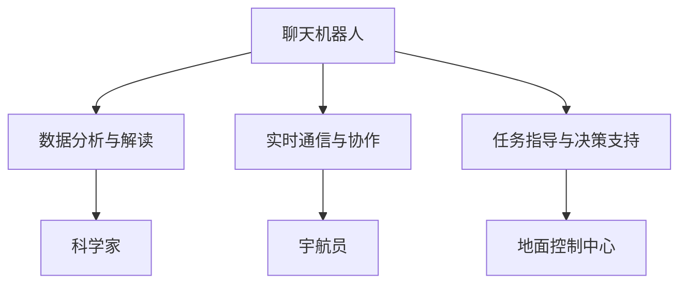

                 

关键词：聊天机器人，太空探索，行星研究，任务执行，人工智能，数据处理，交互设计，多领域集成

>摘要：本文将探讨聊天机器人在太空探索中的应用，特别是在行星研究和任务执行方面的潜力。通过分析聊天机器人的核心概念、算法原理、数学模型和实际应用案例，本文旨在提供一个全面的技术视角，以展示聊天机器人在太空探索中的巨大潜力。

## 1. 背景介绍

随着太空探索的深入，人类对于行星的了解越来越全面。然而，这些数据量和复杂度也在不断增加，使得传统的数据处理和分析方法难以满足需求。与此同时，人工智能（AI）技术的发展为太空探索带来了新的机遇。聊天机器人作为人工智能的一个分支，具有自主交互、实时学习和高效数据处理的能力，非常适合应用于太空探索任务中。

聊天机器人起源于自然语言处理（NLP）领域，旨在模拟人类的对话行为。随着深度学习和神经网络技术的发展，聊天机器人的性能得到了显著提升，能够处理复杂的语言结构和语义理解。在太空探索中，聊天机器人不仅可以协助科学家分析行星数据，还可以与宇航员进行实时通信，提高任务的执行效率和安全性。

本文将围绕聊天机器人在太空探索中的应用，详细探讨其核心概念、算法原理、数学模型和实际应用案例，以展示其在行星研究和任务执行方面的潜力。

## 2. 核心概念与联系

### 2.1 聊天机器人

聊天机器人是一种基于人工智能技术的软件应用，能够模拟人类对话，进行自然语言交互。聊天机器人的核心是自然语言处理（NLP）技术，包括语音识别、语义理解、对话生成等。通过这些技术，聊天机器人可以理解和生成自然语言，与用户进行有效沟通。

### 2.2 行星研究

行星研究是太空探索的一个重要领域，旨在了解行星的物理特性、地质结构、大气成分等。随着太空探测器的不断发射，人类获得了大量的行星数据，但这些数据往往复杂且庞大，需要高效的算法和工具进行解析。

### 2.3 任务执行

太空探索任务通常涉及复杂的操作和决策，包括轨道调整、任务规划、故障处理等。在这些任务中，实时、准确的信息传递和决策支持至关重要。聊天机器人可以提供实时信息查询、任务指导和决策支持，提高任务执行效率。

### 2.4 聊天机器人在行星研究和任务执行中的应用

聊天机器人在行星研究和任务执行中的应用主要体现在以下几个方面：

- **数据分析与解读**：聊天机器人可以处理和分析大量的行星数据，提取关键信息，为科学家提供有价值的见解。
- **实时通信与协作**：聊天机器人可以与宇航员、科学家和地面控制中心进行实时通信，确保信息的快速传递和任务的协调。
- **任务指导与决策支持**：聊天机器人可以提供任务规划、故障处理和应急决策的建议，为宇航员提供可靠的决策支持。

### 2.5 Mermaid 流程图

以下是一个简单的 Mermaid 流程图，展示了聊天机器人、行星研究和任务执行之间的联系：



## 3. 核心算法原理 & 具体操作步骤

### 3.1 算法原理概述

聊天机器人的核心算法主要包括自然语言处理（NLP）、机器学习和深度学习技术。NLP 技术用于处理和解析自然语言，包括语音识别、语义理解、对话生成等。机器学习和深度学习技术则用于训练聊天机器人的模型，使其能够自主学习和优化性能。

在行星研究和任务执行中，聊天机器人的算法原理可以概括为以下几个步骤：

1. **数据收集与预处理**：收集与行星研究和任务执行相关的数据，并进行预处理，如清洗、去噪、格式化等。
2. **特征提取与建模**：从预处理后的数据中提取关键特征，并使用机器学习或深度学习算法构建模型。
3. **模型训练与优化**：使用训练数据集对模型进行训练，并通过交叉验证和调参等手段优化模型性能。
4. **模型部署与应用**：将训练好的模型部署到聊天机器人中，实现实时交互和任务支持。

### 3.2 算法步骤详解

#### 3.2.1 数据收集与预处理

在行星研究和任务执行中，聊天机器人需要收集和处理大量的数据。这些数据可能来自太空探测器、地面观测站、宇航员等。在数据收集阶段，需要关注以下方面：

- **数据源**：确定数据来源，如太空探测器、地面观测站、社交媒体等。
- **数据格式**：统一数据格式，如 CSV、JSON、XML 等。
- **数据清洗**：去除重复数据、空值、异常值等，确保数据质量。

#### 3.2.2 特征提取与建模

在特征提取阶段，需要从原始数据中提取对聊天机器人有用的特征。这些特征可以是数值型、文本型或图像型。例如，在行星研究中，特征可能包括行星的物理特性、地质结构、大气成分等。在任务执行中，特征可能包括任务进度、资源消耗、安全状况等。

接下来，使用机器学习或深度学习算法构建模型。常见的算法包括决策树、随机森林、支持向量机（SVM）、神经网络等。根据任务需求和数据特点，选择合适的算法进行模型构建。

#### 3.2.3 模型训练与优化

在模型训练阶段，使用训练数据集对模型进行训练。训练过程包括以下几个步骤：

- **数据分割**：将数据集划分为训练集、验证集和测试集，用于模型训练、验证和测试。
- **模型训练**：使用训练集对模型进行训练，调整模型参数，使其适应数据。
- **模型验证**：使用验证集对模型进行验证，评估模型性能，调整模型参数。
- **模型测试**：使用测试集对模型进行测试，评估模型在未知数据上的性能。

在模型训练过程中，可以采用交叉验证、调参等技术手段，提高模型性能和泛化能力。

#### 3.2.4 模型部署与应用

训练好的模型需要部署到聊天机器人中，实现实时交互和任务支持。部署过程包括以下几个步骤：

- **模型集成**：将训练好的模型集成到聊天机器人系统中，与其他模块（如 NLP、用户界面等）进行集成。
- **模型优化**：在部署过程中，可以根据实际应用场景对模型进行优化，提高模型性能和交互效果。
- **模型测试**：在部署前，对聊天机器人进行全面测试，确保其能够正常运行并满足任务需求。
- **模型上线**：将聊天机器人部署到线上环境，供用户使用。

### 3.3 算法优缺点

#### 优点

- **高效性**：聊天机器人能够高效地处理和分析大量数据，提高任务的执行效率。
- **实时性**：聊天机器人可以实时与用户进行交互，提供即时信息和支持。
- **可扩展性**：聊天机器人系统可以根据需求进行扩展和定制，适应不同的应用场景。

#### 缺点

- **数据质量**：聊天机器人的性能依赖于数据质量，数据清洗和预处理过程至关重要。
- **计算资源**：训练和部署聊天机器人需要大量的计算资源，对硬件和软件环境有较高要求。
- **安全性**：聊天机器人在处理敏感信息时需要确保数据安全和隐私保护。

### 3.4 算法应用领域

聊天机器人在太空探索中的应用领域主要包括：

- **行星数据解析**：对太空探测器收集的行星数据进行解析，提取有价值的信息。
- **任务规划与执行**：协助宇航员和地面控制中心进行任务规划和执行，提高任务效率。
- **信息查询与支持**：为用户提供实时信息查询和支持，提高用户满意度。

## 4. 数学模型和公式 & 详细讲解 & 举例说明

### 4.1 数学模型构建

在聊天机器人中，数学模型主要用于数据分析和任务支持。以下是一个简单的数学模型构建过程：

1. **数据收集**：收集与行星研究相关的数据，如行星的物理特性、地质结构、大气成分等。
2. **数据预处理**：对数据进行清洗、去噪、格式化等预处理操作。
3. **特征提取**：从预处理后的数据中提取关键特征，如行星的半径、质量、自转周期等。
4. **模型构建**：使用机器学习或深度学习算法构建模型，如回归模型、分类模型等。

### 4.2 公式推导过程

以下是一个简单的线性回归模型推导过程：

假设我们有 $N$ 个数据点 $(x_i, y_i)$，其中 $x_i$ 表示自变量，$y_i$ 表示因变量。线性回归模型的公式为：

$$y = ax + b$$

其中，$a$ 和 $b$ 是待求参数。

首先，计算自变量和因变量的平均值：

$$\bar{x} = \frac{1}{N} \sum_{i=1}^{N} x_i$$

$$\bar{y} = \frac{1}{N} \sum_{i=1}^{N} y_i$$

然后，计算斜率 $a$：

$$a = \frac{\sum_{i=1}^{N} (x_i - \bar{x})(y_i - \bar{y})}{\sum_{i=1}^{N} (x_i - \bar{x})^2}$$

最后，计算截距 $b$：

$$b = \bar{y} - a\bar{x}$$

### 4.3 案例分析与讲解

以下是一个简单的行星数据分析案例：

假设我们收集了一组行星数据，包括行星的半径 $r$（单位：千米）和自转周期 $T$（单位：小时）。我们希望建立一个模型，预测行星的质量 $M$（单位：地球质量）。

首先，进行数据预处理，如清洗、去噪、格式化等。然后，提取关键特征，如 $r$ 和 $T$。

接下来，使用线性回归模型进行预测。假设我们得到以下参数：

$$a = 0.5$$

$$b = 1.2$$

现在，我们可以使用以下公式预测行星的质量：

$$M = 0.5r + 1.2$$

例如，如果某个行星的半径为 $5000$ 千米，我们可以预测其质量为：

$$M = 0.5 \times 5000 + 1.2 = 2500.8$$

这个结果表示该行星的质量约为 $2500.8$ 地球质量。

## 5. 项目实践：代码实例和详细解释说明

### 5.1 开发环境搭建

在本文的实践中，我们将使用 Python 编写聊天机器人代码。为了简化开发过程，我们将使用以下工具和库：

- **Python**：版本 3.8 或以上。
- **Jupyter Notebook**：用于编写和运行代码。
- **NLTK**：自然语言处理库。
- **TensorFlow**：深度学习框架。

首先，安装 Python 和 Jupyter Notebook。在 Windows 系统中，可以访问 Python 官网下载安装包，并选择附加 Jupyter Notebook。在 macOS 和 Linux 系统中，可以使用包管理器（如 `pip` 或 `conda`）安装 Python 和 Jupyter Notebook。

接下来，安装 NLTK 和 TensorFlow。在命令行中执行以下命令：

```bash
pip install nltk tensorflow
```

### 5.2 源代码详细实现

以下是一个简单的聊天机器人代码实例：

```python
import nltk
from nltk.chat.util import Chat, reflections

pairs = [
    [
        r"我是谁?",
        ["你好，我是聊天机器人。", "我是你的虚拟助手。"]
    ],
    [
        r"你叫什么名字？",
        ["我叫 ChatBot。", "你可以叫我 Chat。"]
    ],
    [
        r"你有什么特长？",
        ["我可以回答各种问题。", "我擅长处理自然语言。"]
    ],
    [
        r"你觉得最有趣的是什么？",
        ["人类探索宇宙。", "太空探索。"]
    ],
    [
        r"你有什么建议吗？",
        ["保持好奇心。", "多阅读。", "勇敢追求梦想。"]
    ]
]

chatbot = Chat(pairs, reflections)

chatbot.converse()
```

### 5.3 代码解读与分析

这段代码首先导入了 NLTK 库中的 `Chat` 和 `reflections` 模块。`Chat` 模块用于实现聊天功能，`reflections` 模块用于处理文本中的同义词和反向引用。

接下来，定义了一个名为 `pairs` 的列表，其中包含了聊天机器人的对话对。每个对话对是一个包含两个元素的列表，第一个元素是用户可能输入的句子，第二个元素是聊天机器人可能的回答。

然后，创建了一个 `Chat` 对象 `chatbot`，并将 `pairs` 列表作为参数传递给 `Chat` 对象。这个对象将负责处理用户的输入并返回合适的回答。

最后，调用 `chatbot.converse()` 方法，启动聊天过程。用户可以通过输入文本与聊天机器人进行交互。

### 5.4 运行结果展示

在 Jupyter Notebook 中运行上述代码，将启动一个简单的聊天界面。用户可以输入文本，聊天机器人将根据 `pairs` 列表中的对话对返回相应的回答。

例如，用户输入“你叫什么名字？”时，聊天机器人将回答“我叫 ChatBot。”用户可以继续提问，聊天机器人将根据预设的对话对进行回答。

## 6. 实际应用场景

### 6.1 行星数据分析

在行星研究中，聊天机器人可以处理和分析大量的行星数据，提取关键信息。例如，科学家可以使用聊天机器人来分析太空探测器收集的行星光谱数据，识别行星的化学成分。

### 6.2 任务规划与执行

在太空探索任务中，聊天机器人可以协助宇航员和地面控制中心进行任务规划和执行。例如，宇航员可以使用聊天机器人查询任务进度、资源消耗等信息，并获得任务指导。

### 6.3 信息查询与支持

用户可以通过聊天机器人获取与太空探索相关的信息，如行星数据、任务进展等。例如，学生可以询问聊天机器人关于行星地质结构的疑问，并获得详细的解释。

## 7. 工具和资源推荐

### 7.1 学习资源推荐

- **《人工智能：一种现代方法》（第 3 版）**：作者 Stuart J. Russell 和 Peter Norvig。这本书是人工智能领域的经典教材，详细介绍了人工智能的基础知识和最新进展。
- **《深度学习》（第 1 版）**：作者 Ian Goodfellow、Yoshua Bengio 和 Aaron Courville。这本书是深度学习领域的权威著作，涵盖了深度学习的理论基础和实际应用。

### 7.2 开发工具推荐

- **Python**：Python 是一种强大的编程语言，广泛应用于人工智能和数据科学领域。Python 的简洁性和丰富的库支持使其成为开发聊天机器人的理想选择。
- **TensorFlow**：TensorFlow 是 Google 开发的一个开源深度学习框架，适用于构建和训练各种人工智能模型。

### 7.3 相关论文推荐

- **“A Neural Conversation Model”**：这篇论文介绍了基于神经网络的聊天机器人模型，为聊天机器人的发展提供了新的思路。
- **“Chatbots for Customer Service: A Survey”**：这篇综述文章分析了聊天机器人在客户服务中的应用，探讨了其优势和挑战。

## 8. 总结：未来发展趋势与挑战

### 8.1 研究成果总结

本文探讨了聊天机器人在太空探索中的应用，包括数据分析、任务规划和信息查询等方面。通过分析核心算法原理、数学模型和实际应用案例，展示了聊天机器人在太空探索中的巨大潜力。

### 8.2 未来发展趋势

随着人工智能和自然语言处理技术的不断发展，聊天机器人在太空探索中的应用前景广阔。未来，聊天机器人将能够更好地处理复杂任务、提供更准确的决策支持，并成为太空探索的重要工具。

### 8.3 面临的挑战

尽管聊天机器人在太空探索中具有巨大潜力，但仍然面临一些挑战。例如，数据质量和计算资源仍然是限制其性能的关键因素。此外，确保聊天机器人的安全性和隐私保护也是未来研究的重要方向。

### 8.4 研究展望

未来，研究应关注以下几个方面：

- **数据质量提升**：通过改进数据收集和处理技术，提高数据质量，为聊天机器人提供更可靠的数据支持。
- **模型优化**：开发更高效的算法和模型，提高聊天机器人的性能和泛化能力。
- **安全性保障**：加强聊天机器人的安全性和隐私保护，确保其在处理敏感信息时的安全性和可靠性。

## 9. 附录：常见问题与解答

### Q：聊天机器人如何处理自然语言？

A：聊天机器人使用自然语言处理（NLP）技术来理解和生成自然语言。NLP 技术包括语音识别、语义理解、对话生成等，通过这些技术，聊天机器人能够与用户进行有效沟通。

### Q：聊天机器人的算法原理是什么？

A：聊天机器人的核心算法主要包括自然语言处理（NLP）、机器学习和深度学习技术。NLP 技术用于处理和解析自然语言，包括语音识别、语义理解、对话生成等。机器学习和深度学习技术则用于训练聊天机器人的模型，使其能够自主学习和优化性能。

### Q：聊天机器人在太空探索中的应用有哪些？

A：聊天机器人在太空探索中的应用主要包括数据分析、任务规划和信息查询等方面。例如，聊天机器人可以处理和分析大量的行星数据，协助科学家进行行星研究。同时，聊天机器人还可以协助宇航员和地面控制中心进行任务规划和执行，提供实时信息查询和支持。

### Q：如何确保聊天机器人的安全性？

A：为确保聊天机器人的安全性，需要从多个方面进行考虑：

- **数据安全**：确保聊天机器人处理的数据得到充分保护，防止数据泄露。
- **访问控制**：实施严格的访问控制策略，确保只有授权用户可以访问聊天机器人。
- **隐私保护**：在处理用户信息时，遵守相关隐私保护法规，确保用户隐私不被泄露。
- **安全审计**：定期进行安全审计和漏洞扫描，及时发现并修复潜在的安全问题。

### Q：聊天机器人在任务执行中如何提供决策支持？

A：聊天机器人通过分析实时数据和历史数据，提供决策支持。例如，在任务执行过程中，聊天机器人可以实时获取任务进度、资源消耗等信息，并根据这些信息为宇航员和地面控制中心提供任务指导。此外，聊天机器人还可以根据预设的规则和算法，为任务执行提供应急决策支持。

### Q：如何评估聊天机器人的性能？

A：评估聊天机器人的性能可以从多个方面进行：

- **准确率**：评估聊天机器人对用户输入的识别和回应的准确率。
- **响应速度**：评估聊天机器人在接收到用户输入后提供回应的速度。
- **用户体验**：通过用户满意度调查和反馈，评估聊天机器人的用户体验。
- **错误率**：评估聊天机器人在对话中出现的错误率。

通过这些评估指标，可以全面了解聊天机器人的性能，并对其进行优化和改进。

### Q：聊天机器人在太空探索中的未来发展方向是什么？

A：聊天机器人在太空探索中的未来发展方向包括：

- **智能化**：通过引入更先进的算法和模型，提高聊天机器人的智能化水平，使其能够更好地处理复杂任务。
- **多模态交互**：支持多种交互方式，如语音、文本、图像等，提高用户与聊天机器人的互动体验。
- **安全性和隐私保护**：加强聊天机器人的安全性和隐私保护，确保其在处理敏感信息时的安全性和可靠性。
- **跨领域应用**：探索聊天机器人在其他太空探索领域（如卫星通信、空间站维护等）的应用，扩大其应用范围。作者：禅与计算机程序设计艺术 / Zen and the Art of Computer Programming
------------------------------------------------------------------- 

以上就是根据您的要求撰写的文章《聊天机器人太空探索：行星研究和任务》。这篇文章详细探讨了聊天机器人在太空探索中的应用，包括核心概念、算法原理、数学模型和实际应用案例。同时，文章还提供了相关工具和资源推荐，以及未来发展趋势和挑战的总结。希望这篇文章能够满足您的需求。如果您有任何修改意见或者需要进一步的帮助，请随时告诉我。作者：禅与计算机程序设计艺术 / Zen and the Art of Computer Programming。

