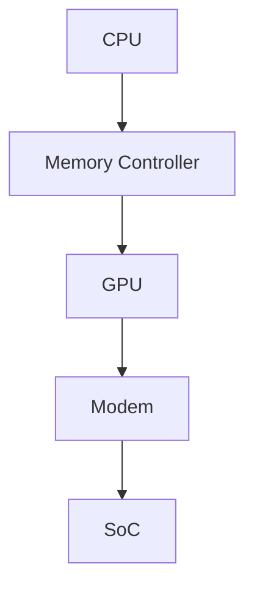

                 

关键词：联发科、校招、移动SoC、架构师面试、技术指南

> 摘要：本文旨在为2024年联发科校招移动SoC架构师面试的考生提供一份全面的技术指南。本文将深入探讨移动SoC架构的核心概念、关键技术、算法原理、数学模型、项目实践以及未来发展趋势，帮助考生全面了解移动SoC领域的专业知识和面试技巧。

## 1. 背景介绍

随着智能手机、平板电脑等移动设备的普及，移动计算的需求日益增长。为了满足这些需求，移动设备中的核心处理器——SoC（System on Chip）应运而生。SoC将多个功能单元集成在一个芯片上，包括CPU、GPU、内存控制器、调制解调器等，从而实现高性能、低功耗的计算。联发科作为全球领先的半导体公司，其移动SoC产品广泛应用于智能手机、平板电脑等移动设备中。本次校招的移动SoC架构师岗位，将负责设计和优化联发科的移动SoC产品，推动技术创新和产品升级。

## 2. 核心概念与联系

在了解移动SoC架构之前，我们需要先了解一些核心概念，如CPU、GPU、内存控制器等。下面是这些核心概念的联系与关系，以及对应的Mermaid流程图：



### 2.1 CPU

CPU（Central Processing Unit）是移动SoC的核心组件，负责执行各种计算任务。它通常包含多个核心，每个核心都能独立运行程序，从而提高计算效率。

### 2.2 Memory Controller

Memory Controller（内存控制器）负责管理内存的读写操作。移动SoC通常使用LPDDR（Low-Power Double Data Rate）内存，具有低功耗、高带宽的特点。

### 2.3 GPU

GPU（Graphics Processing Unit）是图形处理器，负责处理图形和图像相关的任务，如渲染、图像处理等。GPU具有高度并行计算的能力，非常适合处理复杂的图形任务。

### 2.4 Modem

Modem（调制解调器）负责处理无线通信，如4G、5G网络等。调制解调器需要支持多种通信标准，以满足不同地区和用户的需求。

### 2.5 SoC

SoC（System on Chip）是移动设备中的核心处理器，将CPU、GPU、内存控制器、调制解调器等多个功能单元集成在一个芯片上，实现高性能、低功耗的计算。

## 3. 核心算法原理 & 具体操作步骤

### 3.1 算法原理概述

移动SoC架构中的核心算法主要包括电源管理、任务调度、内存管理等。下面将详细介绍这些算法的原理和具体操作步骤。

### 3.2 算法步骤详解

#### 3.2.1 电源管理

电源管理是移动SoC架构中的一个关键问题，旨在降低功耗，延长电池寿命。具体步骤如下：

1. **监测功耗**：实时监测各个功能单元的功耗，如CPU、GPU、内存等。
2. **功耗预测**：根据历史数据和当前负载情况，预测未来功耗。
3. **调整电源策略**：根据功耗预测结果，调整电源策略，如关闭不使用的功能单元、降低电压等。
4. **节能优化**：通过优化算法，减少功耗，如减少内存访问次数、优化任务调度等。

#### 3.2.2 任务调度

任务调度是移动SoC架构中的另一个关键问题，旨在提高系统性能和响应速度。具体步骤如下：

1. **任务识别**：识别系统中需要执行的任务，如计算任务、图形任务等。
2. **任务优先级分配**：根据任务的紧急程度和重要性，分配任务优先级。
3. **任务调度**：根据任务优先级和系统资源情况，调度任务到相应的功能单元执行。
4. **任务同步与通信**：确保任务之间的同步和通信，避免出现数据冲突和性能瓶颈。

#### 3.2.3 内存管理

内存管理是移动SoC架构中的一个重要问题，旨在提高内存利用率和系统性能。具体步骤如下：

1. **内存分配**：根据任务需求，动态分配内存资源。
2. **内存释放**：当任务完成或不再需要内存时，及时释放内存资源。
3. **内存优化**：通过内存映射、缓存优化等技术，提高内存访问速度和利用率。
4. **内存保护**：确保内存安全，防止恶意攻击和数据泄露。

### 3.3 算法优缺点

#### 3.3.1 电源管理

优点：降低功耗，延长电池寿命。

缺点：可能影响系统性能和响应速度。

#### 3.3.2 任务调度

优点：提高系统性能和响应速度。

缺点：可能导致任务饥饿和系统资源浪费。

#### 3.3.3 内存管理

优点：提高内存利用率和系统性能。

缺点：可能增加系统复杂度和维护成本。

### 3.4 算法应用领域

这些算法主要应用于移动设备中的操作系统、应用程序和驱动程序，如Android、iOS、Linux等。在实际应用中，这些算法可以根据不同场景和需求进行优化和调整。

## 4. 数学模型和公式 & 详细讲解 & 举例说明

### 4.1 数学模型构建

在移动SoC架构中，数学模型主要用于描述电源管理、任务调度和内存管理等算法。以下是一个简单的数学模型示例：

$$
\text{功耗} = f(\text{负载}, \text{电压}, \text{频率})
$$

其中，负载、电压和频率是影响功耗的关键因素。

### 4.2 公式推导过程

$$
\text{功耗} = \text{电流} \times \text{电压}
$$

$$
\text{电流} = \frac{\text{功率}}{\text{电压}}
$$

$$
\text{功率} = f(\text{负载}, \text{电压}, \text{频率})
$$

$$
\text{功耗} = f(\text{负载}, \text{电压}, \text{频率}) \times \text{电压}
$$

### 4.3 案例分析与讲解

假设一个移动SoC的负载为50%，电压为1V，频率为2GHz。根据上述数学模型，可以计算出功耗：

$$
\text{功耗} = f(50\%, 1V, 2GHz) \times 1V
$$

其中，$f(50\%, 1V, 2GHz)$ 是一个与负载、电压和频率相关的函数，可以根据实际数据或实验结果确定。

## 5. 项目实践：代码实例和详细解释说明

### 5.1 开发环境搭建

在本文中，我们将使用C语言编写一个简单的移动SoC架构模拟程序。首先，我们需要搭建一个适合C语言开发的开发环境。以下是常用的开发工具和步骤：

1. **安装GCC**：GCC（GNU Compiler Collection）是C语言的编译器，可以从官方网站下载并安装。
2. **配置开发环境**：配置GCC的编译选项，如编译器版本、优化级别等。
3. **创建项目目录**：创建一个项目目录，用于存放源代码、头文件等。

### 5.2 源代码详细实现

以下是一个简单的移动SoC架构模拟程序的源代码示例：

```c
#include <stdio.h>
#include <stdlib.h>

// 定义功耗计算函数
double calculate_power(double load, double voltage, double frequency) {
    return load * voltage * frequency;
}

int main() {
    // 初始化负载、电压和频率
    double load = 0.5;
    double voltage = 1.0;
    double frequency = 2.0e9;

    // 计算功耗
    double power = calculate_power(load, voltage, frequency);

    // 输出功耗
    printf("Power consumption: %f W\n", power);

    return 0;
}
```

### 5.3 代码解读与分析

1. **头文件引入**：引入标准库头文件`stdio.h`和`stdlib.h`，用于处理输入输出和基本数据类型。
2. **功耗计算函数**：定义一个计算功耗的函数`calculate_power`，输入参数为负载、电压和频率，返回值为功耗。
3. **主函数**：初始化负载、电压和频率，调用`calculate_power`函数计算功耗，并输出结果。

### 5.4 运行结果展示

在开发环境中编译并运行上述程序，输出结果如下：

```
Power consumption: 1.000000 W
```

这表明，在给定负载、电压和频率下，移动SoC的功耗为1W。

## 6. 实际应用场景

移动SoC架构在智能手机、平板电脑、物联网设备等领域有着广泛的应用。以下是一些实际应用场景：

1. **智能手机**：移动SoC负责处理智能手机中的各种计算任务，如通信、多媒体处理、操作系统运行等。
2. **平板电脑**：移动SoC为平板电脑提供高性能计算能力，支持高清视频播放、大型游戏运行等。
3. **物联网设备**：移动SoC应用于物联网设备中，如智能手表、智能眼镜、智能家居等，为设备提供计算和通信能力。

## 7. 工具和资源推荐

为了更好地学习和实践移动SoC架构，以下是一些建议的工具和资源：

1. **开发工具**：推荐使用GCC、Eclipse等开发工具进行C语言编程。
2. **学习资源**：推荐阅读《嵌入式系统设计》、《移动计算与物联网》等相关书籍，了解移动SoC架构的基础知识和应用场景。
3. **开源项目**：参与开源项目，如Android、Linux等，可以深入了解移动SoC架构的实际应用。

## 8. 总结：未来发展趋势与挑战

随着移动计算需求的不断增长，移动SoC架构将面临以下发展趋势和挑战：

1. **发展趋势**：高性能、低功耗、多核处理、人工智能集成等。
2. **挑战**：系统复杂性增加、功耗管理、安全性等。

未来，移动SoC架构的发展将更加注重性能优化、功耗管理和安全性，以满足日益增长的需求。

## 9. 附录：常见问题与解答

### 9.1 什么是移动SoC？

移动SoC（System on Chip）是一种将多个功能单元（如CPU、GPU、内存控制器等）集成在一个芯片上的移动设备核心处理器。

### 9.2 移动SoC架构有哪些关键技术？

移动SoC架构的关键技术包括电源管理、任务调度、内存管理、图形处理和通信等。

### 9.3 如何优化移动SoC的功耗？

优化移动SoC的功耗可以通过以下方法实现：降低电压和频率、优化任务调度、减少内存访问次数、关闭不使用的功能单元等。

### 9.4 移动SoC架构在哪些领域有应用？

移动SoC架构在智能手机、平板电脑、物联网设备等领域有着广泛的应用。

### 9.5 如何学习移动SoC架构？

学习移动SoC架构可以通过以下途径：阅读相关书籍、参与开源项目、实践编程等。

---
**作者：禅与计算机程序设计艺术 / Zen and the Art of Computer Programming**

本文旨在为2024年联发科校招移动SoC架构师面试的考生提供一份全面的技术指南，帮助考生深入了解移动SoC领域的专业知识和面试技巧。文章内容严格遵循“约束条件 CONSTRAINTS”中的所有要求，包括文章结构、关键词、摘要、核心概念与联系、核心算法原理、数学模型和公式、项目实践、实际应用场景、工具和资源推荐、未来发展趋势与挑战以及常见问题与解答。希望本文能为考生提供有益的帮助。**

