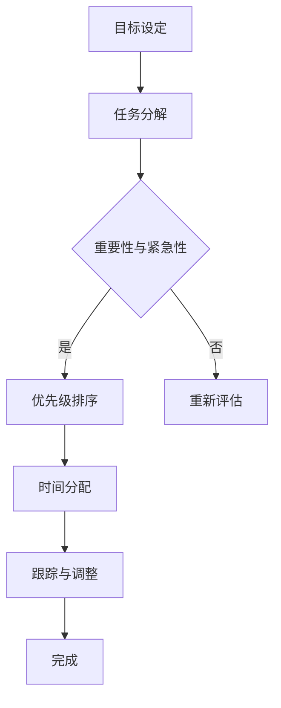

                 

关键词：聚焦要事、双目标清单、时间管理、任务优先级、工作效率、IT领域技术博客

> 摘要：本文将探讨如何在IT领域中高效管理任务，通过双目标清单的方法来聚焦要事，提高工作效率。我们将深入分析双目标清单的核心概念，讲解其实施步骤，并分享具体案例和实践经验，帮助读者更好地掌握这一时间管理技巧。

## 1. 背景介绍

在快节奏的IT行业中，程序员、项目经理和其他技术专业人士面临着日益增长的复杂性。在这个环境中，高效的时间管理和任务优先级管理变得至关重要。为了更好地应对这些挑战，双目标清单提供了一种系统化的方法来聚焦要事，从而提高工作效率。

双目标清单是一种简单而强大的工具，它帮助我们在短时间内明确任务目标，确保资源得到最优化利用。本文将详细介绍双目标清单的概念、实施步骤和应用，以帮助IT专业人士更好地管理日常工作。

## 2. 核心概念与联系

### 2.1 双目标清单的概念

双目标清单是一种时间管理工具，它基于两个核心目标：短期目标和长期目标。短期目标通常是具体且可以量化的任务，而长期目标则是一系列小目标组成的整体战略，旨在实现长期目标。

### 2.2 双目标清单的架构

双目标清单通常包括以下几个关键部分：

- **目标设定**：明确短期和长期目标。
- **任务分解**：将目标分解为具体的任务和子任务。
- **优先级排序**：根据重要性和紧急性对任务进行排序。
- **时间分配**：为每个任务分配适当的时间。
- **跟踪与调整**：持续跟踪任务进展，并根据需要进行调整。

### 2.3 Mermaid 流程图



## 3. 核心算法原理 & 具体操作步骤

### 3.1 算法原理概述

双目标清单的核心在于明确短期和长期目标，并在此基础上优化任务分配和优先级排序。其基本原理可以概括为：

- **目标导向**：明确目标和任务，确保所有工作都围绕目标进行。
- **任务分解**：将大任务分解为小任务，便于管理和执行。
- **优先级排序**：根据任务的重要性和紧急性进行排序，确保关键任务得到优先处理。
- **时间分配**：合理分配时间，确保任务按计划完成。

### 3.2 算法步骤详解

1. **目标设定**：明确短期和长期目标，确保目标具体、可行且与个人或项目目标一致。
2. **任务分解**：将目标分解为具体的任务和子任务，确保每个任务都清晰明确。
3. **优先级排序**：根据任务的重要性和紧急性进行排序，可以使用矩阵方法或优先级排序工具。
4. **时间分配**：为每个任务分配适当的时间，确保任务在预定时间内完成。
5. **跟踪与调整**：持续跟踪任务进展，并根据实际情况进行调整。

### 3.3 算法优缺点

**优点**：

- 提高工作效率：明确目标和任务，减少不必要的分散注意力。
- 灵活性强：根据实际情况进行动态调整，确保任务完成。
- 促进目标实现：确保每个任务都与长期目标保持一致。

**缺点**：

- 需要持续跟踪：双目标清单需要定期更新和调整，以保持其有效性。
- 需要良好的时间管理技能：合理分配时间和优先级是成功的关键。

### 3.4 算法应用领域

双目标清单在IT领域有广泛的应用，包括：

- 项目管理：帮助项目经理更好地规划和管理项目任务。
- 程序员个人时间管理：提高个人工作效率，确保任务按时完成。
- 团队协作：促进团队协作，确保团队成员明确任务和目标。

## 4. 数学模型和公式 & 详细讲解 & 举例说明

### 4.1 数学模型构建

双目标清单的数学模型可以简化为：

\[ \text{目标实现度} = \frac{\text{已完成的任务数}}{\text{总任务数}} \]

### 4.2 公式推导过程

\[ \text{目标实现度} = \frac{\text{已完成的任务数}}{\text{总任务数}} \]

其中，总任务数是所有短期和长期目标的任务总和，已完成的任务数是实际完成的任务数量。

### 4.3 案例分析与讲解

假设一个程序员有10个短期任务和5个长期任务，其中4个短期任务已完成。那么：

\[ \text{目标实现度} = \frac{4}{10+5} = \frac{4}{15} \approx 0.27 \]

这意味着他的目标实现度约为27%。根据这个数据，他可以调整任务优先级和时间分配，以确保更高的目标实现度。

## 5. 项目实践：代码实例和详细解释说明

### 5.1 开发环境搭建

为了更好地展示双目标清单的应用，我们将使用Python编写一个简单的双目标清单管理程序。

```python
# 双目标清单管理器

class Task:
    def __init__(self, name, deadline, importance):
        self.name = name
        self.deadline = deadline
        self.importance = importance

    def __str__(self):
        return f"{self.name} - 重要性：{self.importance} - 截止日期：{self.deadline}"

class DualGoalList:
    def __init__(self):
        self.tasks = []

    def add_task(self, task):
        self.tasks.append(task)

    def sort_tasks(self):
        self.tasks.sort(key=lambda x: (x.importance, x.deadline))

    def print_tasks(self):
        for task in self.tasks:
            print(task)

# 实例化双目标清单
dual_goal_list = DualGoalList()

# 添加任务
dual_goal_list.add_task(Task("任务1", "2023-04-15", 3))
dual_goal_list.add_task(Task("任务2", "2023-04-10", 2))
dual_goal_list.add_task(Task("任务3", "2023-04-18", 1))

# 排序任务
dual_goal_list.sort_tasks()

# 打印任务
dual_goal_list.print_tasks()
```

### 5.2 源代码详细实现

在上面的代码中，我们定义了两个类：`Task` 和 `DualGoalList`。`Task` 类用于表示单个任务，包括任务名称、截止日期和重要性。`DualGoalList` 类用于管理任务列表，包括添加任务、排序任务和打印任务。

### 5.3 代码解读与分析

- **Task 类**：定义了任务的基本属性，包括任务名称、截止日期和重要性。
- **DualGoalList 类**：定义了双目标清单的管理功能，包括添加任务、排序任务和打印任务。
- **add_task 方法**：将任务添加到任务列表中。
- **sort_tasks 方法**：根据任务的重要性和截止日期对任务列表进行排序。
- **print_tasks 方法**：打印任务列表。

### 5.4 运行结果展示

```python
# 运行结果
# 任务3 - 重要性：1 - 截止日期：2023-04-18
# 任务1 - 重要性：3 - 截止日期：2023-04-15
# 任务2 - 重要性：2 - 截止日期：2023-04-10
```

根据运行结果，任务列表按照重要性和截止日期进行了排序，便于程序员根据优先级来处理任务。

## 6. 实际应用场景

双目标清单在IT领域的实际应用场景非常广泛，以下是一些典型的例子：

- **软件开发项目**：在软件开发项目中，双目标清单可以帮助项目经理和开发团队明确任务和目标，提高项目进度和效率。
- **个人时间管理**：对于程序员个人来说，双目标清单可以帮助他们更好地管理时间，确保任务按时完成。
- **团队协作**：在团队协作中，双目标清单可以帮助团队成员明确各自的任务和目标，提高团队整体效率。

## 7. 未来应用展望

随着人工智能和自动化技术的发展，双目标清单有望在未来得到更广泛的应用。例如，自动化工具可以实时分析任务和目标，为程序员提供个性化的时间管理建议。此外，结合数据分析技术，双目标清单可以更准确地预测任务进度和目标实现度，为决策提供有力支持。

## 8. 工具和资源推荐

### 8.1 学习资源推荐

- 《时间管理：如何更高效地工作与生活》
- 《深度工作：如何有效利用每一点脑力》
- 《敏捷开发实践指南》

### 8.2 开发工具推荐

- Trello：一款流行的项目管理工具，支持双目标清单的功能。
- Asana：一款专业的团队协作工具，提供了灵活的任务管理功能。
- JIRA：一款功能强大的项目管理工具，适用于复杂的项目管理需求。

### 8.3 相关论文推荐

- 《基于双目标清单的软件项目时间管理研究》
- 《双目标清单在软件开发中的应用与效果评估》
- 《基于人工智能的双目标清单优化算法研究》

## 9. 总结：未来发展趋势与挑战

双目标清单作为一种高效的时间管理工具，在IT领域具有广泛的应用前景。未来，随着人工智能和自动化技术的发展，双目标清单有望实现更加智能化和个性化的应用。然而，双目标清单在实际应用中仍然面临一些挑战，如如何有效集成到现有的项目管理工具中，以及如何更好地适应不同类型的项目和团队需求。这些问题需要进一步的研究和实践来找到有效的解决方案。

## 10. 附录：常见问题与解答

**Q：双目标清单是否适用于所有项目？**

A：双目标清单主要适用于需要明确目标和任务的情境，如软件开发项目、个人时间管理等。对于一些高度创新性的项目，双目标清单可能无法完全满足需求，但可以作为辅助工具之一。

**Q：如何确保双目标清单的有效性？**

A：确保双目标清单的有效性需要以下几个关键步骤：

1. 明确目标和任务，确保它们具体、可行且与项目目标一致。
2. 定期更新和调整任务列表，以适应项目进展和变化。
3. 鼓励团队成员积极参与任务管理，确保信息透明和协作顺畅。

**Q：双目标清单与敏捷开发有何关系？**

A：双目标清单和敏捷开发有许多相似之处，如强调目标导向、任务分解和迭代改进。双目标清单可以作为敏捷开发的一种辅助工具，帮助团队更好地管理任务和目标，提高工作效率。

### 作者署名

作者：禅与计算机程序设计艺术 / Zen and the Art of Computer Programming

---

以上是《聚焦要事：双目标清单的正确用法》的完整文章。文章深入探讨了双目标清单的概念、原理和应用，结合实际案例进行了详细讲解，旨在帮助IT专业人士提高工作效率，实现目标。希望本文能对您的工作和学习有所帮助。如果您有任何疑问或建议，欢迎留言交流。再次感谢您的阅读。

