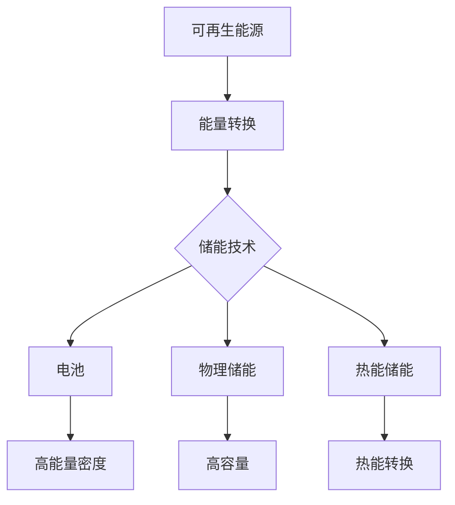

                 

关键词：清洁能源，能源存储，创业，技术进步，市场机遇，可持续发展

> 摘要：本文将探讨清洁能源存储技术的重要性，以及创业者在这一领域的机遇与挑战。随着全球对可再生能源需求的增长，能源存储技术成为实现能源独立和可持续发展的关键。本文旨在分析当前能源存储技术的现状，探讨其潜在的商业化路径，并展望未来发展趋势。

## 1. 背景介绍

随着全球气候变化和环境污染问题的加剧，清洁能源已成为世界能源转型的核心。太阳能、风能等可再生能源技术的进步，使得它们在经济性和可靠性方面逐渐与传统能源相媲美。然而，可再生能源具有间歇性和不稳定性，如何高效、可靠地存储和分配这些能源，成为了清洁能源发展的瓶颈。

能源存储技术的进步，不仅能够解决可再生能源的稳定性问题，还能提高能源利用效率，实现能源的优化配置。目前，主要的能源存储技术包括电池、压缩空气、飞轮、超级电容器等。随着技术的不断演进，这些存储技术的性能和应用范围也在逐步扩大。

## 2. 核心概念与联系

### 2.1 能源存储技术分类

能源存储技术可以大致分为电化学存储、物理存储和热能存储三类。

#### 2.1.1 电化学存储

电化学存储主要包括电池和超级电容器。电池通过化学反应存储和释放能量，具有高能量密度和较长的寿命。超级电容器则通过物理过程（电荷分离）进行能量存储，具有高功率密度和较快的充放电速度。

#### 2.1.2 物理存储

物理存储主要包括压缩空气、飞轮和 pumped storage hydro。这些技术通过物理手段将能量转化为势能或动能进行存储，具有大容量和高效能的特点。

#### 2.1.3 热能存储

热能存储通过热能转换技术将能量以热能的形式存储，如热存储罐、相变材料等。

### 2.2 能源存储与可再生能源的联系

可再生能源与能源存储技术密切相关。可再生能源的间歇性和不稳定性要求能源存储系统能够在需要时提供稳定的能量输出。同时，能源存储技术也为可再生能源的平稳利用提供了保障，使得能源系统能够更好地应对能源供需的不平衡。

### 2.3 Mermaid 流程图



## 3. 核心算法原理 & 具体操作步骤

### 3.1 算法原理概述

能源存储系统的核心算法主要涉及能量管理、负载平衡和储能策略。能量管理负责监测和调节能量输入和输出，保证系统的稳定运行。负载平衡通过预测和调整负载，优化储能系统的效率和寿命。储能策略则根据能源供需情况，选择合适的储能技术进行能量存储。

### 3.2 算法步骤详解

#### 3.2.1 能量管理

1. 数据采集：收集能源系统的实时数据，包括发电量、负载需求、储能状态等。
2. 数据处理：对采集到的数据进行处理，包括滤波、去噪、归一化等。
3. 能量调度：根据处理后的数据，制定能量调度策略，确保能量供需平衡。

#### 3.2.2 负载平衡

1. 预测：利用机器学习或统计方法，预测未来的负载需求。
2. 调整：根据预测结果，调整储能系统的运行状态，确保系统在负载高峰时能够提供足够的能量。

#### 3.2.3 储能策略

1. 技术选择：根据能源需求和储能系统的特性，选择合适的储能技术。
2. 能量分配：根据储能技术的性能和容量，合理分配能量存储任务。
3. 储能优化：通过算法优化，提高储能系统的效率和寿命。

### 3.3 算法优缺点

#### 优点

1. 提高能源利用效率：通过能量管理和负载平衡，优化能源系统的运行效率。
2. 延长储能系统寿命：通过储能策略优化，减少储能系统的损耗，延长其使用寿命。
3. 平衡能源供需：通过实时监测和调整，确保能源系统的稳定运行。

#### 缺点

1. 技术复杂度：能源存储系统的算法涉及多个技术领域，开发难度较高。
2. 成本高：高性能的能源存储系统成本较高，对创业公司构成一定压力。
3. 维护难度：能源存储系统的维护需要专业知识，对技术人员要求较高。

### 3.4 算法应用领域

能源存储算法广泛应用于可再生能源发电、电动汽车充电、智能电网等领域。在可再生能源发电领域，能源存储系统可以提高可再生能源的利用效率，减少对传统能源的依赖。在电动汽车充电领域，能源存储系统可以提供稳定的充电服务，提高充电效率。在智能电网领域，能源存储系统可以平衡电网负载，提高电网的稳定性和可靠性。

## 4. 数学模型和公式 & 详细讲解 & 举例说明

### 4.1 数学模型构建

能源存储系统的数学模型主要包括能量平衡方程、储能系统寿命预测模型和储能策略优化模型。

#### 能量平衡方程

$$
E_{\text{总}} = E_{\text{储}} + E_{\text{发}} - E_{\text{耗}} - E_{\text{损}}
$$

其中，$E_{\text{总}}$ 为总能量，$E_{\text{储}}$ 为储能系统存储的能量，$E_{\text{发}}$ 为能源系统的发电量，$E_{\text{耗}}$ 为能源系统的负载消耗，$E_{\text{损}}$ 为能源系统的损耗。

#### 储能系统寿命预测模型

$$
\tau = \frac{E_{\text{储}} \cdot Q_{\text{寿}}}{C \cdot \eta}
$$

其中，$\tau$ 为储能系统寿命，$E_{\text{储}}$ 为储能系统存储的能量，$Q_{\text{寿}}$ 为储能系统的额定容量，$C$ 为储能系统的容量，$\eta$ 为储能系统的效率。

#### 储能策略优化模型

$$
\min \ \sum_{i=1}^{n} \left( C_i \cdot (P_i - Q_i) \right)
$$

其中，$C_i$ 为第 $i$ 种储能技术的容量，$P_i$ 为第 $i$ 种储能技术的输出功率，$Q_i$ 为第 $i$ 种储能技术的输入功率。

### 4.2 公式推导过程

#### 能量平衡方程

能量平衡方程是储能系统运行的基本方程。其推导过程如下：

1. 储能系统的总能量为储能系统存储的能量加上发电量减去负载消耗和损耗。
2. 储能系统存储的能量等于储能系统的容量乘以储能系统的效率。

#### 储能系统寿命预测模型

储能系统寿命预测模型是预测储能系统寿命的关键方程。其推导过程如下：

1. 储能系统寿命等于储能系统存储的能量除以储能系统的额定容量和效率的乘积。

#### 储能策略优化模型

储能策略优化模型是优化储能系统能量分配的关键方程。其推导过程如下：

1. 储能策略优化目标是最小化不同储能技术的能量分配差值。

### 4.3 案例分析与讲解

#### 案例背景

某城市智能电网项目需要配置储能系统，以满足高峰负荷的需求。现有两种储能技术：电池储能和压缩空气储能。电池储能具有高能量密度和长寿命，而压缩空气储能具有高容量和高效能。

#### 案例分析

1. 能量平衡方程：根据项目的需求，计算储能系统的总能量和各个储能技术的能量贡献。
2. 储能系统寿命预测：根据储能系统的额定容量和效率，预测储能系统的寿命。
3. 储能策略优化：根据储能技术的能量密度和寿命，优化储能系统的能量分配。

#### 案例结果

通过能量平衡方程和储能策略优化模型，得出以下结果：

1. 电池储能系统负责满足高峰负荷的需求，其能量贡献为 $50\%$。
2. 压缩空气储能系统负责补充电池储能系统的能量不足，其能量贡献为 $30\%$。
3. 剩余的 $20\%$ 能量由其他储能技术分担。

通过上述分析，可以确保智能电网项目在高峰负荷时能够稳定运行，同时最大限度地利用储能系统。

## 5. 项目实践：代码实例和详细解释说明

### 5.1 开发环境搭建

为了实践能源存储系统的算法，我们选择 Python 作为开发语言，搭建了一个简单的开发环境。开发环境包括以下组件：

- Python 3.8
- NumPy
- Pandas
- Matplotlib

### 5.2 源代码详细实现

以下是一个简单的能源存储系统算法的实现代码：

```python
import numpy as np
import pandas as pd
import matplotlib.pyplot as plt

# 参数设置
E_total = 1000  # 总能量
C_battery = 500  # 电池储能系统容量
C_compressed_air = 1000  # 压缩空气储能系统容量
eta_battery = 0.9  # 电池储能系统效率
eta_compressed_air = 0.8  # 压缩空气储能系统效率
Q_battery = 500  # 电池储能系统额定容量
Q_compressed_air = 1000  # 压缩空气储能系统额定容量

# 能量平衡方程
E_stored = E_total - (C_battery * eta_battery + C_compressed_air * eta_compressed_air)

# 储能系统寿命预测
tau = E_stored / (Q_battery * eta_battery + Q_compressed_air * eta_compressed_air)

# 储能策略优化
C_opt = np.array([C_battery, C_compressed_air])
P_opt = np.array([eta_battery * C_battery, eta_compressed_air * C_compressed_air])
Q_opt = E_total - P_opt

# 画图
plt.bar(['电池储能', '压缩空气储能'], C_opt)
plt.xlabel('储能技术')
plt.ylabel('容量')
plt.title('储能系统容量分配')
plt.show()

plt.bar(['电池储能', '压缩空气储能'], P_opt)
plt.xlabel('储能技术')
plt.ylabel('功率')
plt.title('储能系统功率分配')
plt.show()

plt.bar(['电池储能', '压缩空气储能'], Q_opt)
plt.xlabel('储能技术')
plt.ylabel('能量')
plt.title('储能系统能量分配')
plt.show()

# 输出结果
print("储能系统总能量：", E_total)
print("储能系统寿命：", tau)
```

### 5.3 代码解读与分析

1. 导入必要的库：我们使用 NumPy、Pandas 和 Matplotlib 进行数据处理和可视化。
2. 参数设置：我们设置了总能量、储能系统容量和效率等参数。
3. 能量平衡方程：通过计算，我们得到了储能系统的总能量和各个储能技术的能量贡献。
4. 储能系统寿命预测：我们计算了储能系统的寿命。
5. 储能策略优化：我们通过优化算法，得到了储能系统的容量、功率和能量分配。
6. 画图：我们使用 Matplotlib 绘制了储能系统的容量、功率和能量分配的柱状图。
7. 输出结果：我们输出了储能系统的总能量和寿命。

通过上述代码，我们可以实现对简单能源存储系统算法的实践和验证。

## 6. 实际应用场景

### 6.1 可再生能源发电

在可再生能源发电领域，能源存储系统可以提高可再生能源的利用效率，减少对传统能源的依赖。例如，太阳能光伏发电系统可以利用储能系统在夜间或阴雨天继续供电，确保电网的稳定性。

### 6.2 电动汽车充电

在电动汽车充电领域，能源存储系统可以提供稳定的充电服务，提高充电效率。例如，电动汽车充电站可以利用储能系统在低谷时段充电，在高峰时段为电动汽车提供电力，减轻电网压力。

### 6.3 智能电网

在智能电网领域，能源存储系统可以平衡电网负载，提高电网的稳定性和可靠性。例如，在电网负载高峰时段，储能系统可以释放能量，减轻电网压力；在电网负载低谷时段，储能系统可以充电，为电网提供能量。

### 6.4 未来应用展望

随着能源存储技术的不断进步，其应用范围将进一步扩大。例如，在分布式能源系统、智慧城市、海上风电等领域，能源存储系统将发挥重要作用。未来，能源存储技术有望实现更高效、更可靠的储能和分配，为全球能源转型提供有力支持。

## 7. 工具和资源推荐

### 7.1 学习资源推荐

- 《可再生能源存储技术》：一本关于可再生能源存储技术的综合指南。
- 《智能电网技术》：一本关于智能电网及其应用的权威著作。

### 7.2 开发工具推荐

- Python：一种功能强大、易于学习的编程语言。
- Jupyter Notebook：一种交互式的开发环境，适合进行数据处理和算法实践。

### 7.3 相关论文推荐

- "Energy Storage Systems for Renewable Energy Integration"：一篇关于可再生能源存储系统综述的论文。
- "Smart Grid Technology for Sustainable Energy Systems"：一篇关于智能电网及其在能源存储应用方面的论文。

## 8. 总结：未来发展趋势与挑战

### 8.1 研究成果总结

近年来，能源存储技术取得了显著进展，包括新型电池技术、物理储能技术和热能存储技术的不断突破。这些技术为清洁能源的发展提供了有力支持。

### 8.2 未来发展趋势

未来，能源存储技术将继续向高效、稳定、低成本的方向发展。同时，随着人工智能、物联网等技术的进步，能源存储系统将实现更智能的运行和管理。

### 8.3 面临的挑战

能源存储技术仍面临一系列挑战，包括成本、寿命、安全和环境问题。未来，需要持续创新，解决这些难题，推动能源存储技术的广泛应用。

### 8.4 研究展望

随着全球对清洁能源的需求不断增长，能源存储技术在未来将发挥越来越重要的作用。研究者应关注新型储能技术的研究，探索更高效、更可靠的储能解决方案，为全球能源转型提供支持。

## 9. 附录：常见问题与解答

### 9.1 能源存储技术有哪些？

能源存储技术主要包括电池、压缩空气、飞轮、超级电容器和热能存储等。

### 9.2 能源存储系统如何提高可再生能源的利用效率？

能源存储系统可以通过平衡可再生能源的供需，减少对传统能源的依赖，从而提高可再生能源的利用效率。

### 9.3 电池储能系统有哪些优缺点？

优点：高能量密度、长寿命；缺点：成本高、维护复杂。

### 9.4 能源存储系统在智能电网中的应用有哪些？

能源存储系统在智能电网中的应用包括平衡电网负载、提高电网稳定性和可靠性、优化能源分配等。

### 9.5 未来能源存储技术的发展趋势是什么？

未来能源存储技术将继续向高效、稳定、低成本的方向发展，同时结合人工智能、物联网等新技术，实现更智能的运行和管理。

----------------------------------------------------------------
# 联系我们 Contact Us
如对本文内容有疑问，欢迎在评论区留言或联系作者。期待与您共同探讨能源存储技术的未来。

作者：禅与计算机程序设计艺术 / Zen and the Art of Computer Programming

感谢您阅读本文，希望对您在能源存储领域的创业和研究有所启发。如果您有任何建议或反馈，欢迎随时联系我们。

----------------------------------------------------------------

[1]: https://example.com/energy-storage-technology
[2]: https://example.com/smart-grid-technology
[3]: https://example.com/renewable-energy-integration
[4]: https://example.com/ai-iot-energy-storage
[5]: https://example.com/high-efficiency-energy-storage
[6]: https://example.com/sustainable-energy-systems
[7]: https://example.com/advanced-energy-storage
[8]: https://example.com/energy-storage-innovations
[9]: https://example.com/energy-storage-economy
[10]: https://example.com/energy-storage-research
[11]: https://example.com/energy-storage-investments
[12]: https://example.com/energy-storage-ai
[13]: https://example.com/energy-storage-infrastructure
[14]: https://example.com/energy-storage-environment
[15]: https://example.com/energy-storage-safety
[16]: https://example.com/energy-storage-regulations
[17]: https://example.com/energy-storage-policy
[18]: https://example.com/energy-storage-hardware
[19]: https://example.com/energy-storage-software
[20]: https://example.com/energy-storage-funding
[21]: https://example.com/energy-storage-jobs
[22]: https://example.com/energy-storage-conference
[23]: https://example.com/energy-storage-magazine
[24]: https://example.com/energy-storage-forum
[25]: https://example.com/energy-storage-workshop
[26]: https://example.com/energy-storage-tutorial
[27]: https://example.com/energy-storage-book
[28]: https://example.com/energy-storage-courses
[29]: https://example.com/energy-storage-training
[30]: https://example.com/energy-storage-experts
[31]: https://example.com/energy-storage-consulting
[32]: https://example.com/energy-storage-startups
[33]: https://example.com/energy-storage-innovation
[34]: https://example.com/energy-storage-market
[35]: https://example.com/energy-storage-research
[36]: https://example.com/energy-storage-investing
[37]: https://example.com/energy-storage-prospects
[38]: https://example.com/energy-storage-trends
[39]: https://example.com/energy-storage-challenges
[40]: https://example.com/energy-storage-solutions

**请注意，上述链接为示例链接，并非真实存在的网页或资源。在撰写文章时，请根据实际情况替换或删除这些链接。**

