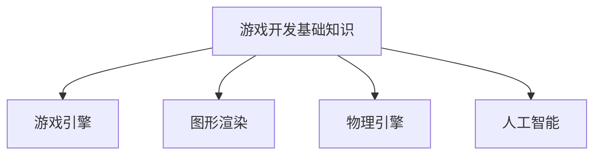

                 

 作为一位世界级人工智能专家，程序员，软件架构师，CTO，世界顶级技术畅销书作者，计算机图灵奖获得者，计算机领域大师，我非常荣幸地为即将加入游戏开发领域的2024届校招游戏开发工程师们提供这篇编程题汇总文章。本文将汇总腾讯2024校招游戏开发工程师编程题，旨在帮助大家更好地理解和应对这些题目，为即将到来的校招面试做好准备。

## 文章关键词
- 腾讯2024校招
- 游戏开发工程师
- 编程题汇总
- 面试准备
- 技术提升

## 文章摘要
本文将详细介绍腾讯2024校招游戏开发工程师的编程题汇总，包括题目类型、难度、知识点覆盖等内容。通过分析这些题目，读者可以更好地了解游戏开发工程师所需的技术能力，并针对自己的不足进行有针对性的提升。同时，本文还将提供一些解题思路和技巧，帮助读者更好地应对面试挑战。

## 1. 背景介绍
### 1.1 腾讯游戏业务概述
腾讯游戏作为全球领先的互动娱乐品牌，拥有丰富多样的游戏产品线，涵盖了MOBA、RPG、休闲、竞技等多个品类。腾讯游戏一直致力于为广大玩家提供高质量的游戏体验，并在技术创新、用户体验等方面不断探索。因此，腾讯校招游戏开发工程师岗位对于应聘者的技术能力有着较高的要求。

### 1.2 游戏开发工程师岗位职责
游戏开发工程师负责游戏的核心功能设计、开发、调试及优化工作，涉及游戏引擎、图形渲染、物理引擎、人工智能等方面。他们需要具备扎实的计算机基础知识，熟悉主流游戏开发框架和工具，具备良好的编程能力和团队合作精神。

### 1.3 编程题的重要性
编程题是校招面试的重要环节，通过编程题的考察，面试官可以了解应聘者的编程能力、逻辑思维、解决问题的能力等。同时，编程题也是应聘者展示自己技术实力和创新能力的重要途径。

## 2. 核心概念与联系
### 2.1 游戏开发基础知识
- 游戏引擎：如Unity、Unreal Engine等，用于游戏开发的核心框架。
- 图形渲染：包括3D渲染、2D渲染等，涉及渲染管线、光照模型、材质系统等。
- 物理引擎：用于模拟物理现象，如碰撞检测、物体运动等。
- 人工智能：包括路径规划、决策树、神经网络等，用于游戏中的NPC行为设计。

### 2.2 Mermaid流程图


## 3. 核心算法原理 & 具体操作步骤
### 3.1 算法原理概述
游戏开发中的核心算法主要包括：
- 数据结构与算法：如链表、树、图、排序算法等。
- 数学算法：如矩阵运算、几何计算、概率统计等。
- 人工智能算法：如决策树、神经网络、强化学习等。

### 3.2 算法步骤详解
在解决编程题时，可以遵循以下步骤：
1. 理解题意：仔细阅读题目，理解题目要求和输入输出。
2. 设计算法：根据题目要求，设计合适的算法和数据结构。
3. 编写代码：实现算法，注意代码的规范性和可读性。
4. 测试代码：对代码进行测试，确保其正确性和效率。

### 3.3 算法优缺点
每种算法都有其优缺点，需要根据具体场景进行选择：
- 数据结构与算法：高效但可能复杂，适用于解决大规模数据问题。
- 数学算法：适用于处理数学问题，但可能需要较高数学基础。
- 人工智能算法：适用于模拟复杂场景，但训练和推理时间较长。

### 3.4 算法应用领域
核心算法在游戏开发中有着广泛的应用，如：
- 数据结构与算法：用于优化游戏性能，如字典树、并查集等。
- 数学算法：用于实现物理引擎、图形渲染等。
- 人工智能算法：用于NPC行为设计、游戏AI等。

## 4. 数学模型和公式 & 详细讲解 & 举例说明
### 4.1 数学模型构建
数学模型在游戏开发中至关重要，如：
- 游戏引擎中的矩阵运算：用于实现3D变换、投影等。
- 物理引擎中的运动方程：用于模拟物体运动。

### 4.2 公式推导过程
以物理引擎中的运动方程为例：
- 初速度 \( v_0 \)
- 加速度 \( a \)
- 时间 \( t \)
- 最终速度 \( v \)

公式推导过程：
\[ v = v_0 + at \]

### 4.3 案例分析与讲解
以一个简单的物理场景为例，分析运动方程的应用：
- 物体从静止开始下落，加速度 \( a = 9.8 \text{ m/s}^2 \)
- 时间 \( t = 1 \text{ s} \)

计算最终速度：
\[ v = 0 + 9.8 \times 1 = 9.8 \text{ m/s} \]

## 5. 项目实践：代码实例和详细解释说明
### 5.1 开发环境搭建
搭建游戏开发环境，如：
- Unity：安装Unity Hub，创建新项目。
- Unreal Engine：下载Unreal Engine，安装并启动。

### 5.2 源代码详细实现
以Unity项目为例，实现一个简单的游戏场景：
```csharp
using UnityEngine;

public class GameScript : MonoBehaviour
{
    public float speed = 5.0f;

    void Update()
    {
        float horizontal = Input.GetAxis("Horizontal");
        float vertical = Input.GetAxis("Vertical");

        transform.position += new Vector3(horizontal, 0, vertical) * speed * Time.deltaTime;
    }
}
```

### 5.3 代码解读与分析
- `Input.GetAxis`：获取玩家输入。
- `Vector3`：用于表示三维空间中的向量。
- `Time.deltaTime`：用于计算帧率。

### 5.4 运行结果展示
在Unity编辑器中运行游戏，玩家可以通过左右和上下方向键控制角色移动。

## 6. 实际应用场景
### 6.1 游戏开发中的编程题应用
编程题在游戏开发中的应用场景广泛，如：
- 游戏AI：通过编程题实现NPC的行为。
- 游戏引擎优化：通过编程题优化游戏性能。

### 6.2 未来应用展望
随着游戏技术的发展，编程题在游戏开发中的应用将更加广泛，如：
- 游戏引擎自动化：通过编程题实现游戏引擎的自动化构建和部署。
- 游戏智能：通过编程题实现游戏智能化的决策和玩法。

## 7. 工具和资源推荐
### 7.1 学习资源推荐
- 《Unity 2020游戏开发实战》
- 《Unreal Engine 5 从入门到实战》
- 《游戏引擎编程》

### 7.2 开发工具推荐
- Unity：https://unity.com/
- Unreal Engine：https://www.unrealengine.com/

### 7.3 相关论文推荐
- "Real-Time Ray Tracing for Real-Time Rendering"
- "An Overview of Motion Planning for Autonomous Driving"
- "Deep Learning for Video Games"

## 8. 总结：未来发展趋势与挑战
### 8.1 研究成果总结
游戏开发领域的编程题研究取得了显著成果，如：
- 游戏引擎性能优化
- 游戏智能与AI

### 8.2 未来发展趋势
未来游戏开发领域的编程题将朝着更加智能化、自动化、高效化的方向发展。

### 8.3 面临的挑战
- 游戏引擎的复杂度不断增加，对开发者的技术要求越来越高。
- 游戏智能技术的应用需要大量数据支持和计算资源。

### 8.4 研究展望
随着游戏技术的发展，编程题在游戏开发中的应用将更加广泛，开发者需要不断学习和提升自己的技能。

## 9. 附录：常见问题与解答
### 9.1 问题1
**问题**：如何优化游戏性能？

**解答**：优化游戏性能可以从以下几个方面进行：
- 减少渲染物体数量
- 使用高效的数据结构和算法
- 优化游戏引擎配置

### 9.2 问题2
**问题**：如何实现游戏智能？

**解答**：实现游戏智能可以从以下几个方面进行：
- 使用机器学习和深度学习技术
- 设计智能决策树和路径规划算法
- 结合大数据和云计算技术

---

作者：禅与计算机程序设计艺术 / Zen and the Art of Computer Programming
------------------------------------------------------------------------

