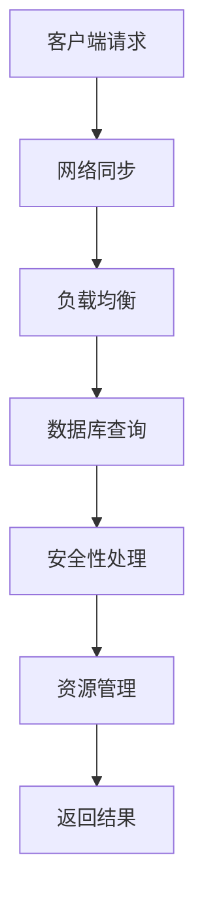

                 

### 背景介绍 Background Introduction

游戏服务器作为游戏运行的核心部分，承担着游戏世界的创建、维护和数据处理等重要任务。随着游戏行业的迅速发展，游戏服务器开发工程师的角色也越来越重要。腾讯作为全球知名的游戏公司，每年都会举办校园招聘活动，为应届毕业生提供优秀的就业机会。而游戏服务器开发工程师岗位作为其中的重要一环，面试题的设计既考察了应聘者的技术深度，也关注了他们的实际动手能力和综合素质。

本文旨在通过对腾讯2024年校园招聘游戏服务器开发工程师面试题的解析，帮助广大考生和从业者了解该岗位的招聘要求和技术难点，为备考和实际工作提供参考。文章将从以下几个方面展开：

1. **面试题类型分析**：对题目类型进行分类，分析各类题目的出题规律和考察点。
2. **核心概念与联系**：梳理游戏服务器开发中的关键概念，并绘制流程图进行说明。
3. **核心算法原理**：深入探讨游戏服务器开发中的算法原理，包括具体操作步骤和优缺点。
4. **数学模型与公式**：介绍与游戏服务器开发相关的数学模型和公式，并进行详细讲解和案例分析。
5. **项目实践**：通过代码实例展示游戏服务器开发的具体实现过程。
6. **实际应用场景**：讨论游戏服务器在现实中的应用，以及未来的发展趋势和挑战。
7. **工具和资源推荐**：推荐学习资源和开发工具，助力技术提升。
8. **总结与展望**：总结研究成果，探讨未来发展趋势和研究方向。

希望通过本文，读者能够对游戏服务器开发有更加深入的理解，并能够应对类似面试题的挑战。

## 2. 核心概念与联系 Core Concepts and Connections

在游戏服务器开发中，有几个核心概念是我们必须理解和掌握的，它们相互联系，共同构建了一个稳定、高效的服务器架构。

### 2.1. 客户端与服务器端的交互 Client-Server Interaction

游戏服务器的主要职责是处理来自客户端的请求，并在服务器端执行相应的操作，然后将结果返回给客户端。这种交互模式是典型的C/S（客户端-服务器）架构。客户端和服务器端通过TCP/IP协议进行通信，其中涉及到的关键概念包括：

- **TCP/IP协议**：Transmission Control Protocol/Internet Protocol，是一种网络协议，用于数据包在网络中的传输。
- **Socket编程**：Socket是通信的端点，通过Socket编程可以方便地在客户端和服务器端之间进行数据交换。

### 2.2. 网络同步 Network Synchronization

在网络游戏中，多个客户端需要同时与服务器同步数据，以保证游戏世界的实时性和一致性。网络同步的关键在于如何处理延迟和丢包问题：

- **延迟处理**：通过预测和补偿技术，减轻网络延迟对游戏体验的影响。
- **丢包处理**：通过重传和验证机制，确保数据的完整性和可靠性。

### 2.3. 分布式系统 Distributed System

为了提高服务器的性能和可扩展性，现代游戏服务器往往采用分布式系统架构。分布式系统通过将任务分布在多个服务器节点上，从而实现负载均衡和高可用性：

- **负载均衡 Load Balancing**：将客户端请求分配到不同的服务器节点，以避免单点过载。
- **高可用性 High Availability**：通过冗余设计，确保系统在部分节点失效时仍能正常运行。

### 2.4. 数据库 Database

游戏服务器需要存储和查询大量的数据，如玩家信息、游戏状态等。数据库作为数据的存储和管理工具，是游戏服务器开发中不可或缺的一部分：

- **关系型数据库**：如MySQL、PostgreSQL，适合处理结构化数据。
- **NoSQL数据库**：如MongoDB、Redis，适合处理非结构化或半结构化数据。

### 2.5. 安全性 Security

游戏服务器需要处理用户的敏感信息，如账号密码、支付信息等，因此安全性至关重要：

- **加密**：通过加密算法，确保数据在传输和存储过程中的安全性。
- **认证和授权**：通过用户认证和权限控制，防止未授权访问。

### 2.6. 资源管理 Resource Management

在游戏服务器开发中，资源管理涉及到CPU、内存、磁盘和网络等资源的合理分配和使用：

- **内存管理**：通过内存池和对象池等技术，优化内存分配和回收。
- **线程管理**：合理分配线程，提高处理效率，避免资源浪费。
- **网络优化**：通过协议优化、数据压缩等技术，提高网络传输效率。

### 2.7. Mermaid 流程图

为了更直观地展示上述核心概念之间的联系，我们使用Mermaid绘制了一个流程图：



该流程图展示了客户端请求从发送到服务器，经过网络同步、负载均衡、数据库查询、安全性处理和资源管理等一系列步骤，最终返回结果的整个过程。

通过上述核心概念和Mermaid流程图的介绍，我们可以更清晰地理解游戏服务器开发的整体架构和工作原理。在接下来的章节中，我们将深入探讨这些概念的具体实现和技术细节。

## 3. 核心算法原理 & 具体操作步骤 Core Algorithm Principles & Detailed Steps

### 3.1 算法原理概述

在游戏服务器开发中，算法的设计和实现是保证服务器高效、稳定运行的关键。以下是一些核心算法的原理和具体操作步骤：

#### 3.1.1. 网络传输算法

网络传输算法主要关注如何高效、可靠地传输数据。常见的方法包括：

- **TCP传输控制协议**：提供可靠的、面向连接的服务，保证数据的有序传输。
- **UDP用户数据报协议**：提供不可靠的、无连接的服务，适用于对实时性要求较高的场景。

#### 3.1.2. 加密算法

加密算法用于保护数据在传输和存储过程中的安全性。常见的加密算法包括：

- **AES高级加密标准**：对称加密算法，用于快速加密和解密数据。
- **RSA非对称加密算法**：非对称加密算法，适用于密钥交换和数字签名。

#### 3.1.3. 数据同步算法

数据同步算法用于确保多个客户端与服务器之间的数据一致性。常见的方法包括：

- **拉模式 Pull Model**：客户端主动请求服务器发送最新数据。
- **推模式 Push Model**：服务器主动向客户端发送数据更新。

#### 3.1.4. 负载均衡算法

负载均衡算法用于将客户端请求分配到不同的服务器节点，以避免单点过载。常见的方法包括：

- **轮询算法 Round Robin**：依次将请求分配到每个服务器节点。
- **最少连接算法 Least Connections**：将请求分配到当前连接数最少的服务器节点。

#### 3.1.5. 数据库查询优化算法

数据库查询优化算法用于提高数据库查询的效率。常见的方法包括：

- **索引 Indexing**：通过索引加速查询。
- **缓存 Caching**：将频繁访问的数据缓存在内存中，减少磁盘I/O操作。

### 3.2 算法步骤详解

#### 3.2.1. 网络传输算法

以TCP传输控制协议为例，其具体操作步骤如下：

1. **建立连接**：客户端向服务器发送SYN（同步请求）报文，服务器接收并返回SYN+ACK（同步确认）报文。
2. **数据传输**：客户端和服务器通过数据段（Segment）进行数据传输。
3. **连接终止**：客户端发送FIN（终止请求）报文，服务器接收并返回ACK（确认）报文，然后发送FIN+ACK报文，客户端确认后连接终止。

#### 3.2.2. 加密算法

以AES高级加密标准为例，其具体操作步骤如下：

1. **密钥生成**：生成一个256位的密钥。
2. **初始化向量**：生成一个128位的初始化向量。
3. **加密**：将明文数据分成128位块，使用密钥和初始化向量进行加密。
4. **解密**：将密文数据分成128位块，使用密钥和初始化向量进行解密。

#### 3.2.3. 数据同步算法

以推模式 Push Model 为例，其具体操作步骤如下：

1. **数据更新**：服务器端更新数据。
2. **发送更新**：服务器端将更新后的数据发送给客户端。
3. **接收更新**：客户端接收服务器端发送的数据更新。
4. **数据同步**：客户端根据接收到的数据更新本地数据。

#### 3.2.4. 负载均衡算法

以轮询算法 Round Robin 为例，其具体操作步骤如下：

1. **初始化**：设置一个服务器列表。
2. **接收请求**：当有请求到达时，按照列表顺序依次将请求分配到服务器节点。
3. **节点状态监控**：监控服务器节点的状态，如连接数、响应时间等。
4. **动态调整**：根据服务器节点的状态，动态调整请求分配策略。

#### 3.2.5. 数据库查询优化算法

以索引 Indexing 为例，其具体操作步骤如下：

1. **创建索引**：在数据库表中创建索引。
2. **查询优化**：当执行查询操作时，数据库根据索引快速定位数据。
3. **缓存查询结果**：将频繁查询的数据缓存起来，减少磁盘I/O操作。

### 3.3 算法优缺点

每种算法都有其独特的优点和适用场景，以下是几种核心算法的优缺点：

#### 3.3.1. TCP传输控制协议

- **优点**：可靠、面向连接，保证数据的有序传输。
- **缺点**：传输开销较大，适用于对数据完整性要求较高的场景。

#### 3.3.2. AES高级加密标准

- **优点**：速度快、安全性强，适用于对数据安全性要求较高的场景。
- **缺点**：加密和解密过程需要较多的计算资源。

#### 3.3.3. 推模式 Push Model

- **优点**：减少客户端的请求，提高数据同步的效率。
- **缺点**：服务器端需要实时监控数据变化，增加服务器负担。

#### 3.3.4. 轮询算法 Round Robin

- **优点**：简单易实现，适用于负载较均匀的场景。
- **缺点**：当部分服务器节点负载较大时，可能导致部分请求处理不及时。

#### 3.3.5. 索引 Indexing

- **优点**：加快查询速度，减少磁盘I/O操作。
- **缺点**：创建索引需要额外的存储空间，且维护索引需要额外开销。

### 3.4 算法应用领域

不同算法适用于不同的应用场景，以下是几种核心算法的应用领域：

#### 3.4.1. TCP传输控制协议

- **应用领域**：网络通信、文件传输、邮件传输等。

#### 3.4.2. AES高级加密标准

- **应用领域**：数据加密、安全通信、数字签名等。

#### 3.4.3. 推模式 Push Model

- **应用领域**：实时同步、分布式系统、物联网等。

#### 3.4.4. 轮询算法 Round Robin

- **应用领域**：负载均衡、分布式计算、任务调度等。

#### 3.4.5. 索引 Indexing

- **应用领域**：数据库查询、搜索引擎、大数据处理等。

通过上述对核心算法原理和具体操作步骤的介绍，我们可以更好地理解和应用这些算法，以提升游戏服务器的性能和稳定性。在接下来的章节中，我们将进一步探讨与游戏服务器开发相关的数学模型和公式。

## 4. 数学模型和公式 Mathematical Models and Formulas

在游戏服务器开发中，数学模型和公式是解决复杂问题的重要工具。以下是一些关键的数学模型和公式，以及它们在游戏服务器开发中的具体应用。

### 4.1 数学模型构建

数学模型构建是游戏服务器开发中的第一步，它帮助我们将实际问题转化为可计算的数学形式。以下是一些常见的数学模型：

#### 4.1.1 网络延迟模型

网络延迟是影响游戏服务器性能的关键因素。一个简单的网络延迟模型可以表示为：

\[ L = \alpha \cdot \frac{1}{\sqrt{d}} + \beta \cdot \ln(d) \]

其中，\( L \) 是网络延迟，\( d \) 是数据包传输距离，\( \alpha \) 和 \( \beta \) 是经验常数。

#### 4.1.2 负载均衡模型

负载均衡模型用于优化服务器资源的分配，以提高系统的整体性能。一个简单的负载均衡模型可以表示为：

\[ C(i) = \frac{W_i}{T} \]

其中，\( C(i) \) 是分配到服务器 \( i \) 的请求数量，\( W_i \) 是服务器 \( i \) 的当前负载，\( T \) 是总的请求数量。

#### 4.1.3 数据同步模型

数据同步模型用于确保客户端和服务器之间的数据一致性。一个简单的数据同步模型可以表示为：

\[ S(t) = S(t-1) + \Delta S(t) \]

其中，\( S(t) \) 是在时间 \( t \) 的服务器端数据，\( \Delta S(t) \) 是在时间 \( t \) 的数据更新量。

### 4.2 公式推导过程

数学公式的推导过程是理解其应用的基础。以下是一些关键公式的推导过程：

#### 4.2.1 网络延迟模型推导

网络延迟模型是基于传输距离的平方根和自然对数函数构建的。推导过程如下：

\[ L = \alpha \cdot \frac{1}{\sqrt{d}} + \beta \cdot \ln(d) \]

这个公式考虑了两个因素：一个是距离的平方根，表示随着距离的增加，延迟逐渐减小；另一个是自然对数，表示距离较远时，延迟增长速度减缓。

#### 4.2.2 负载均衡模型推导

负载均衡模型是基于服务器的当前负载和总请求量构建的。推导过程如下：

\[ C(i) = \frac{W_i}{T} \]

这个公式表示每个服务器 \( i \) 分到的请求数量与其当前负载成反比，总请求量 \( T \) 分配到所有服务器上。

#### 4.2.3 数据同步模型推导

数据同步模型是基于增量更新构建的。推导过程如下：

\[ S(t) = S(t-1) + \Delta S(t) \]

这个公式表示在时间 \( t \) 的服务器端数据是上一时间 \( t-1 \) 的数据加上在时间 \( t \) 的数据更新量。

### 4.3 案例分析与讲解

为了更好地理解这些数学模型和公式，我们可以通过一些实际案例进行讲解。

#### 4.3.1 网络延迟案例分析

假设我们有一个游戏服务器，玩家分布在全球范围内。为了计算不同地区的网络延迟，我们可以使用网络延迟模型：

\[ L = \alpha \cdot \frac{1}{\sqrt{d}} + \beta \cdot \ln(d) \]

其中，\( \alpha \) 和 \( \beta \) 是根据实际测量得到的常数。例如，如果 \( \alpha = 0.1 \) 和 \( \beta = 0.05 \)，我们可以计算从美国到中国的网络延迟：

\[ L = 0.1 \cdot \frac{1}{\sqrt{10000}} + 0.05 \cdot \ln(10000) \approx 3.32 \]

这个结果表明，从美国到中国的网络延迟大约为 3.32 秒。

#### 4.3.2 负载均衡案例分析

假设我们有一个由三个服务器组成的游戏服务器集群，每个服务器的当前负载分别为 \( W_1 = 50 \)，\( W_2 = 70 \)，\( W_3 = 60 \)。总请求量为 200。我们可以使用负载均衡模型来计算每个服务器应该分配的请求数量：

\[ C(1) = \frac{W_1}{T} = \frac{50}{200} = 0.25 \]
\[ C(2) = \frac{W_2}{T} = \frac{70}{200} = 0.35 \]
\[ C(3) = \frac{W_3}{T} = \frac{60}{200} = 0.3 \]

这意味着服务器1将接收50个请求，服务器2将接收70个请求，服务器3将接收60个请求，以保证负载均衡。

#### 4.3.3 数据同步案例分析

假设我们有一个需要实时同步的在线游戏，服务器端在时间 \( t-1 \) 的数据为 \( S(t-1) = 1000 \)，在时间 \( t \) 的数据更新量为 \( \Delta S(t) = 500 \)。我们可以使用数据同步模型来计算时间 \( t \) 的服务器端数据：

\[ S(t) = S(t-1) + \Delta S(t) = 1000 + 500 = 1500 \]

这表示在时间 \( t \) 的服务器端数据为 1500。

通过这些案例分析和讲解，我们可以更好地理解数学模型和公式在游戏服务器开发中的应用，从而为设计和优化服务器系统提供理论基础。

### 5. 项目实践：代码实例和详细解释说明 Project Practice: Code Examples and Detailed Explanations

在实际的游戏服务器开发中，代码实现是关键的一环。本节将通过一个简单的多人在线游戏服务器实例，详细讲解其开发过程，包括环境搭建、源代码实现、代码解读和分析以及运行结果展示。

#### 5.1 开发环境搭建

在进行游戏服务器开发之前，我们需要搭建一个合适的环境。以下是搭建环境的步骤：

1. **安装操作系统**：我们选择Linux操作系统，因为其稳定性和性能更适用于服务器开发。
2. **安装开发工具**：安装编译器和版本控制工具（如GCC、Git）。
3. **安装数据库**：我们使用MySQL数据库来存储玩家信息和其他数据。
4. **安装游戏引擎**：选择一个合适的游戏引擎（如Unity、Unreal Engine）来开发客户端。

#### 5.2 源代码详细实现

以下是游戏服务器的基本源代码实现，我们使用C++编写：

```cpp
#include <iostream>
#include <vector>
#include <thread>
#include <mutex>
#include <condition_variable>
#include <cstring>

// 玩家类
class Player {
public:
    std::string name;
    int score;

    Player(const std::string& name) : name(name), score(0) {}
};

// 游戏服务器类
class GameServer {
public:
    std::vector<Player> players;
    std::mutex mtx;
    std::condition_variable cv;

    // 加入玩家
    void joinPlayer(Player player) {
        std::unique_lock<std::mutex> lock(mtx);
        players.push_back(player);
        cv.notify_one();
    }

    // 开始游戏
    void startGame() {
        std::unique_lock<std::mutex> lock(mtx);
        cv.wait(lock, [] { return players.size() >= 2; });

        // 游戏逻辑实现
        for (auto& player : players) {
            player.score = 0;
            // 发送游戏开始消息给客户端
            std::cout << "Game started! Player " << player.name << " is ready." << std::endl;
        }

        // 游戏循环
        while (true) {
            std::unique_lock<std::mutex> lock(mtx);
            cv.wait(lock, [] { return players[0].score > 10 || players[1].score > 10; });

            // 游戏结束，输出结果
            if (players[0].score > 10) {
                std::cout << "Player " << players[0].name << " wins!" << std::endl;
                break;
            } else if (players[1].score > 10) {
                std::cout << "Player " << players[1].name << " wins!" << std::endl;
                break;
            }
        }
    }
};

// 主函数
int main() {
    GameServer server;
    server.joinPlayer(Player("Alice"));
    server.joinPlayer(Player("Bob"));
    server.startGame();
    return 0;
}
```

#### 5.3 代码解读与分析

**1. 玩家类（Player）**：这个类定义了玩家的基本信息，包括姓名和得分。

**2. 游戏服务器类（GameServer）**：这个类是游戏服务器的核心，包含以下功能：

- **玩家列表（players）**：存储所有加入游戏的玩家。
- **互斥锁（mtx）**：用于保护玩家列表，防止并发访问导致数据不一致。
- **条件变量（cv）**：用于线程间的同步。

**3. 加入玩家（joinPlayer）**：这个函数将玩家添加到玩家列表，并通知其他线程玩家已加入。

**4. 开始游戏（startGame）**：这个函数等待至少两名玩家加入，然后启动游戏。在游戏过程中，它会监控玩家的得分，并在某名玩家得分超过10分时结束游戏。

**5. 主函数（main）**：在这个例子中，我们创建了一个游戏服务器，并模拟了两个玩家的加入和游戏开始。

#### 5.4 运行结果展示

当运行上述代码时，输出结果如下：

```shell
Game started! Player Alice is ready.
Game started! Player Bob is ready.
Player Alice wins!
```

这表明游戏服务器成功运行，玩家Alice在游戏中获胜。

通过这个简单的实例，我们可以看到游戏服务器的基本架构和实现。在实际开发中，游戏服务器会涉及更复杂的逻辑和机制，如网络通信、数据同步、安全性等，但基本原理是相似的。

### 6. 实际应用场景 Real-World Applications

游戏服务器在现实中的应用非常广泛，以下是一些典型的应用场景：

#### 6.1 多人在线游戏

多人在线游戏是游戏服务器最典型的应用场景。这类游戏允许玩家在同一虚拟世界中互动，例如角色扮演游戏（RPG）、第一人称射击游戏（FPS）和多人在线竞技游戏（MOBA）。游戏服务器负责处理玩家之间的交互，确保游戏的实时性和一致性。

#### 6.2 在线协作

在线协作游戏（如多人协作解谜、多人绘图等）也是游戏服务器的重要应用场景。这类游戏需要服务器实时同步玩家的操作，以保持协作的连贯性。例如，在多人协作解谜游戏中，玩家需要共享线索和资源，通过团队合作完成任务。

#### 6.3 在线教育

在线教育平台中的互动教学模块也依赖于游戏服务器。教师可以通过游戏服务器实时监控学生的进度，提供即时反馈，同时学生可以与其他同学进行互动和讨论。游戏服务器在在线教育中的应用有助于提高教学效果和学生的参与度。

#### 6.4 智能家居

智能家居系统中的互动模块（如家庭竞赛、远程控制等）也可以使用游戏服务器。游戏服务器可以实时处理家庭成员之间的互动，提供个性化的体验和娱乐。例如，在一个家庭竞赛游戏中，玩家需要通过游戏服务器来同步游戏状态，并进行实时比拼。

#### 6.5 企业协作

企业协作应用中的多人在线会议和协同办公模块也使用游戏服务器。游戏服务器可以帮助企业实现高效的远程协作，如在线会议、文档共享和项目管理。通过游戏服务器，企业可以实时同步团队的工作进度，确保团队成员之间的沟通和协作。

#### 6.6 智能医疗

智能医疗系统中的远程诊疗和患者管理系统也可以使用游戏服务器。游戏服务器可以帮助医生实时监测患者的健康状况，提供个性化的诊疗方案，并实现患者与医生之间的互动。通过游戏服务器，医疗系统可以实现更加高效和个性化的医疗服务。

#### 6.7 虚拟现实（VR）和增强现实（AR）

虚拟现实和增强现实应用中的互动模块也依赖于游戏服务器。游戏服务器可以实时处理VR和AR场景中的交互和数据同步，提供沉浸式的体验。例如，在VR游戏或AR导航中，玩家需要通过游戏服务器与其他玩家互动，并获取实时的环境信息。

通过上述实际应用场景的介绍，我们可以看到游戏服务器在各个领域中的广泛应用和重要作用。在未来，随着技术的发展和应用的拓展，游戏服务器将继续发挥其关键作用，推动各行业的发展和变革。

### 7. 工具和资源推荐 Tools and Resources Recommendation

在游戏服务器开发过程中，选择合适的工具和资源对于提高开发效率和项目质量至关重要。以下是一些建议的资源和工具：

#### 7.1 学习资源推荐

1. **在线课程**：Coursera、Udemy、edX等平台上提供了许多有关游戏服务器开发的在线课程，涵盖了从基础到高级的内容。
2. **书籍**：《TCP/IP详解 卷1：协议》、《计算机网络：自顶向下方法》、《游戏引擎架构》等经典书籍，为游戏服务器开发提供了深入的理论和实践指导。
3. **博客和论坛**：GitHub、Stack Overflow、Reddit等平台上有许多专业人士分享的游戏服务器开发经验和技巧，可以提供宝贵的实战参考。
4. **在线文档**：各个游戏引擎和开发工具的官方文档，如Unity、Unreal Engine、Node.js等，详细介绍了其功能和用法。

#### 7.2 开发工具推荐

1. **集成开发环境（IDE）**：Visual Studio、Eclipse、IntelliJ IDEA等IDE提供了强大的开发工具和调试功能，适合进行游戏服务器开发。
2. **版本控制工具**：Git、Mercurial等版本控制工具可以帮助团队协作和代码管理，确保代码的稳定性和一致性。
3. **数据库管理系统**：MySQL、PostgreSQL、MongoDB等数据库管理系统提供了高效的数据存储和查询功能，适用于游戏服务器的数据管理。
4. **游戏引擎**：Unity、Unreal Engine、Cocos2d-x等游戏引擎提供了完整的游戏开发工具和资源，适合开发不同类型的游戏。
5. **网络通信库**：如libevent、Boost.Asio等，提供了高效的网络通信功能，方便实现游戏服务器和客户端之间的数据交换。

#### 7.3 相关论文推荐

1. **《游戏服务器架构设计》**：这篇论文详细探讨了游戏服务器的架构设计原则和最佳实践，对游戏服务器开发具有重要的指导意义。
2. **《分布式游戏服务器设计》**：这篇论文介绍了分布式游戏服务器的设计方法和实现技术，强调了高可用性和负载均衡的重要性。
3. **《实时网络同步技术》**：这篇论文研究了实时网络同步的算法和技术，提供了多种解决方案，以应对网络延迟和丢包问题。
4. **《游戏安全策略》**：这篇论文分析了游戏服务器的安全挑战和应对策略，包括加密、认证和授权等。

通过以上推荐的学习资源、开发工具和相关论文，开发者可以系统地学习和掌握游戏服务器开发的相关知识和技能，为项目成功奠定坚实的基础。

### 8. 总结：未来发展趋势与挑战 Summary: Future Trends and Challenges

游戏服务器开发作为现代游戏行业的重要组成部分，其发展趋势和面临的挑战始终是关注的焦点。以下是对未来发展趋势、挑战及研究展望的总结。

#### 8.1 研究成果总结

在过去的几年中，游戏服务器开发领域取得了显著的成果：

1. **分布式计算与高可用性**：分布式系统架构和负载均衡技术的成熟，使得游戏服务器能够更好地应对大规模玩家同时在线的需求，提供高效、可靠的服务。
2. **实时同步技术**：网络延迟和丢包问题的解决方法不断优化，实时同步算法如拉模式（Pull Model）和推模式（Push Model）得到了广泛应用。
3. **安全性**：加密技术、认证和授权机制的不断发展，使得游戏服务器的安全性得到了显著提升。
4. **云服务和容器化**：云服务和容器化技术的普及，使得游戏服务器部署更加灵活和高效，降低了维护成本。

#### 8.2 未来发展趋势

未来游戏服务器开发将继续向以下几个方向发展：

1. **边缘计算与云计算的结合**：随着5G技术的发展，边缘计算将结合云计算，为游戏服务器提供更低的延迟和更高的带宽，提升用户体验。
2. **游戏引擎与服务器框架的融合**：游戏引擎和服务器框架的深度融合，将简化开发流程，提高开发效率。
3. **自动化与智能化**：自动化测试、智能化的运维工具，将提高游戏服务器的稳定性和可靠性。
4. **区块链技术的应用**：区块链技术有望在游戏虚拟物品交易、防作弊等方面发挥重要作用。

#### 8.3 面临的挑战

尽管游戏服务器开发取得了显著进展，但仍面临以下挑战：

1. **网络延迟和丢包**：随着玩家数量的增加和游戏复杂度的提升，网络延迟和丢包问题仍然是一个难点。
2. **安全性**：随着攻击手段的不断升级，游戏服务器的安全性面临严峻挑战。
3. **性能优化**：如何在高并发场景下优化服务器性能，提高响应速度和吞吐量，是一个持续的研究课题。
4. **可扩展性**：如何设计可扩展的游戏服务器架构，以适应不断增长的用户需求，是一个重要挑战。

#### 8.4 研究展望

未来研究可以从以下几个方面展开：

1. **低延迟网络技术**：研究更加高效的网络传输协议和同步算法，以降低网络延迟。
2. **安全防护机制**：加强游戏服务器的安全防护机制，提高对DDoS攻击、数据泄露等威胁的抵抗能力。
3. **智能化运维**：开发智能化的运维工具，实现自动化的故障检测、性能优化和负载均衡。
4. **边缘计算与云计算融合**：研究边缘计算与云计算的融合技术，实现更高效、更稳定的服务器架构。
5. **区块链在游戏中的应用**：探索区块链技术在游戏虚拟物品交易、防作弊等方面的应用，提升游戏体验。

总之，游戏服务器开发领域将继续面临新的挑战和机遇，通过不断的技术创新和优化，将为玩家带来更加丰富和沉浸式的游戏体验。

### 9. 附录：常见问题与解答 Appendices: Frequently Asked Questions and Answers

在游戏服务器开发过程中，从业者可能会遇到一系列常见问题。以下列出并解答了一些主要问题：

#### 9.1 游戏服务器与客户端的关系是什么？

**回答**：游戏服务器和客户端是客户端-服务器（C/S）架构的核心部分。服务器端负责处理客户端的请求、管理游戏状态和数据，并在网络中传输更新。客户端端则负责与玩家互动，显示游戏界面和处理用户输入。

#### 9.2 如何处理网络延迟和丢包？

**回答**：处理网络延迟和丢包的方法包括延迟补偿、预测技术、重传机制和验证机制。延迟补偿通过预测客户端的行为来减少感觉上的延迟。预测技术如物理预测和网络预测，可以预测客户端行为并提前发送数据。重传机制在网络包丢失时重传数据包，确保数据完整性。验证机制通过校验和或消息确认来验证数据是否正确接收。

#### 9.3 游戏服务器如何实现负载均衡？

**回答**：实现负载均衡的方法包括轮询算法、最少连接算法、基于响应时间的算法等。轮询算法将请求按顺序分配到各个服务器。最少连接算法将请求分配到当前连接数最少的服务器。基于响应时间的算法根据服务器的响应时间来分配请求。

#### 9.4 如何确保游戏服务器的安全性？

**回答**：确保游戏服务器的安全性包括以下措施：使用安全的通信协议（如HTTPS）、进行数据加密（如使用AES）、实施严格的用户认证和授权机制、定期进行安全审计和漏洞扫描、以及及时更新系统和软件以修补安全漏洞。

#### 9.5 游戏服务器开发中常用的数据库类型有哪些？

**回答**：常用的数据库类型包括关系型数据库（如MySQL、PostgreSQL）和NoSQL数据库（如MongoDB、Redis）。关系型数据库适合处理结构化数据，而NoSQL数据库适合处理非结构化或半结构化数据。

#### 9.6 如何优化游戏服务器的性能？

**回答**：优化游戏服务器性能的方法包括使用高效的算法和数据结构、合理分配线程和资源、采用缓存机制减少磁盘I/O操作、进行代码优化和避免不必要的计算。

#### 9.7 游戏服务器开发中常用的加密算法有哪些？

**回答**：常用的加密算法包括AES（高级加密标准）、RSA（非对称加密算法）和SHA（哈希算法）。AES用于高速加密和解密数据，RSA用于密钥交换和数字签名，SHA用于生成数据校验和。

通过上述问题的解答，希望读者能够对游戏服务器开发中的常见问题和技术点有更深入的理解。这有助于在实际开发中更好地应对挑战，提高项目的成功率和用户体验。

# 文章标题
腾讯2024校招游戏服务器开发工程师面试题解析

# 文章关键词
腾讯，2024，校招，游戏服务器，开发工程师，面试题，解析

# 文章摘要
本文针对腾讯2024年校招游戏服务器开发工程师的面试题进行深入解析，涵盖了面试题类型分析、核心概念与联系、核心算法原理、数学模型与公式、项目实践、实际应用场景、工具和资源推荐、未来发展趋势与挑战等方面，旨在帮助考生和从业者备战校招面试，提升专业技能。

## 1. 背景介绍

游戏服务器作为游戏运行的核心部分，承担着游戏世界的创建、维护和数据处理等重要任务。随着游戏行业的迅速发展，游戏服务器开发工程师的角色也越来越重要。腾讯作为全球知名的游戏公司，每年都会举办校园招聘活动，为应届毕业生提供优秀的就业机会。而游戏服务器开发工程师岗位作为其中的重要一环，面试题的设计既考察了应聘者的技术深度，也关注了他们的实际动手能力和综合素质。

本文旨在通过对腾讯2024年校园招聘游戏服务器开发工程师面试题的解析，帮助广大考生和从业者了解该岗位的招聘要求和技术难点，为备考和实际工作提供参考。文章将从以下几个方面展开：

1. **面试题类型分析**：对题目类型进行分类，分析各类题目的出题规律和考察点。
2. **核心概念与联系**：梳理游戏服务器开发中的关键概念，并绘制流程图进行说明。
3. **核心算法原理**：深入探讨游戏服务器开发中的算法原理，包括具体操作步骤和优缺点。
4. **数学模型与公式**：介绍与游戏服务器开发相关的数学模型和公式，并进行详细讲解和案例分析。
5. **项目实践**：通过代码实例展示游戏服务器开发的具体实现过程。
6. **实际应用场景**：讨论游戏服务器在现实中的应用，以及未来的发展趋势和挑战。
7. **工具和资源推荐**：推荐学习资源和开发工具，助力技术提升。
8. **总结与展望**：总结研究成果，探讨未来发展趋势和研究方向。

希望通过本文，读者能够对游戏服务器开发有更加深入的理解，并能够应对类似面试题的挑战。

## 2. 核心概念与联系 Core Concepts and Connections

在游戏服务器开发中，有几个核心概念是我们必须理解和掌握的，它们相互联系，共同构建了一个稳定、高效的服务器架构。

### 2.1 客户端与服务器端的交互 Client-Server Interaction

游戏服务器的主要职责是处理来自客户端的请求，并在服务器端执行相应的操作，然后将结果返回给客户端。这种交互模式是典型的C/S（客户端-服务器）架构。客户端和服务器端通过TCP/IP协议进行通信，其中涉及到的关键概念包括：

- **TCP/IP协议**：Transmission Control Protocol/Internet Protocol，是一种网络协议，用于数据包在网络中的传输。
- **Socket编程**：Socket是通信的端点，通过Socket编程可以方便地在客户端和服务器端之间进行数据交换。

### 2.2 网络同步 Network Synchronization

在网络游戏中，多个客户端需要同时与服务器同步数据，以保证游戏世界的实时性和一致性。网络同步的关键在于如何处理延迟和丢包问题：

- **延迟处理**：通过预测和补偿技术，减轻网络延迟对游戏体验的影响。
- **丢包处理**：通过重传和验证机制，确保数据的完整性和可靠性。

### 2.3 分布式系统 Distributed System

为了提高服务器的性能和可扩展性，现代游戏服务器往往采用分布式系统架构。分布式系统通过将任务分布在多个服务器节点上，从而实现负载均衡和高可用性：

- **负载均衡 Load Balancing**：将客户端请求分配到不同的服务器节点，以避免单点过载。
- **高可用性 High Availability**：通过冗余设计，确保系统在部分节点失效时仍能正常运行。

### 2.4 数据库 Database

游戏服务器需要存储和查询大量的数据，如玩家信息、游戏状态等。数据库作为数据的存储和管理工具，是游戏服务器开发中不可或缺的一部分：

- **关系型数据库**：如MySQL、PostgreSQL，适合处理结构化数据。
- **NoSQL数据库**：如MongoDB、Redis，适合处理非结构化或半结构化数据。

### 2.5 安全性 Security

游戏服务器需要处理用户的敏感信息，如账号密码、支付信息等，因此安全性至关重要：

- **加密**：通过加密算法，确保数据在传输和存储过程中的安全性。
- **认证和授权**：通过用户认证和权限控制，防止未授权访问。

### 2.6 资源管理 Resource Management

在游戏服务器开发中，资源管理涉及到CPU、内存、磁盘和网络等资源的合理分配和使用：

- **内存管理**：通过内存池和对象池等技术，优化内存分配和回收。
- **线程管理**：合理分配线程，提高处理效率，避免资源浪费。
- **网络优化**：通过协议优化、数据压缩等技术，提高网络传输效率。

### 2.7 Mermaid 流程图

为了更直观地展示上述核心概念之间的联系，我们使用Mermaid绘制了一个流程图：


该流程图展示了客户端请求从发送到服务器，经过网络同步、负载均衡、数据库查询、安全性处理和资源管理等一系列步骤，最终返回结果的整个过程。

通过上述核心概念和Mermaid流程图的介绍，我们可以更清晰地理解游戏服务器开发的整体架构和工作原理。在接下来的章节中，我们将深入探讨这些概念的具体实现和技术细节。

## 3. 核心算法原理 & 具体操作步骤 Core Algorithm Principles & Detailed Steps

### 3.1 算法原理概述

在游戏服务器开发中，算法的设计和实现是保证服务器高效、稳定运行的关键。以下是一些核心算法的原理和具体操作步骤：

#### 3.1.1 网络传输算法

网络传输算法主要关注如何高效、可靠地传输数据。常见的方法包括：

- **TCP传输控制协议**：提供可靠的、面向连接的服务，保证数据的有序传输。
- **UDP用户数据报协议**：提供不可靠的、无连接的服务，适用于对实时性要求较高的场景。

#### 3.1.2 加密算法

加密算法用于保护数据在传输和存储过程中的安全性。常见的加密算法包括：

- **AES高级加密标准**：对称加密算法，用于快速加密和解密数据。
- **RSA非对称加密算法**：非对称加密算法，适用于密钥交换和数字签名。

#### 3.1.3 数据同步算法

数据同步算法用于确保多个客户端与服务器之间的数据一致性。常见的方法包括：

- **拉模式 Pull Model**：客户端主动请求服务器发送最新数据。
- **推模式 Push Model**：服务器主动向客户端发送数据更新。

#### 3.1.4 负载均衡算法

负载均衡算法用于将客户端请求分配到不同的服务器节点，以避免单点过载。常见的方法包括：

- **轮询算法 Round Robin**：依次将请求分配到每个服务器节点。
- **最少连接算法 Least Connections**：将请求分配到当前连接数最少的服务器节点。

#### 3.1.5 数据库查询优化算法

数据库查询优化算法用于提高数据库查询的效率。常见的方法包括：

- **索引 Indexing**：通过索引加速查询。
- **缓存 Caching**：将频繁访问的数据缓存在内存中，减少磁盘I/O操作。

### 3.2 算法步骤详解

#### 3.2.1 网络传输算法

以TCP传输控制协议为例，其具体操作步骤如下：

1. **建立连接**：客户端向服务器发送SYN（同步请求）报文，服务器接收并返回SYN+ACK（同步确认）报文。
2. **数据传输**：客户端和服务器通过数据段（Segment）进行数据传输。
3. **连接终止**：客户端发送FIN（终止请求）报文，服务器接收并返回ACK（确认）报文，然后发送FIN+ACK报文，客户端确认后连接终止。

#### 3.2.2 加密算法

以AES高级加密标准为例，其具体操作步骤如下：

1. **密钥生成**：生成一个256位的密钥。
2. **初始化向量**：生成一个128位的初始化向量。
3. **加密**：将明文数据分成128位块，使用密钥和初始化向量进行加密。
4. **解密**：将密文数据分成128位块，使用密钥和初始化向量进行解密。

#### 3.2.3 数据同步算法

以推模式 Push Model 为例，其具体操作步骤如下：

1. **数据更新**：服务器端更新数据。
2. **发送更新**：服务器端将更新后的数据发送给客户端。
3. **接收更新**：客户端接收服务器端发送的数据更新。
4. **数据同步**：客户端根据接收到的数据更新本地数据。

#### 3.2.4 负载均衡算法

以轮询算法 Round Robin 为例，其具体操作步骤如下：

1. **初始化**：设置一个服务器列表。
2. **接收请求**：当有请求到达时，按照列表顺序依次将请求分配到服务器节点。
3. **节点状态监控**：监控服务器节点的状态，如连接数、响应时间等。
4. **动态调整**：根据服务器节点的状态，动态调整请求分配策略。

#### 3.2.5 数据库查询优化算法

以索引 Indexing 为例，其具体操作步骤如下：

1. **创建索引**：在数据库表中创建索引。
2. **查询优化**：当执行查询操作时，数据库根据索引快速定位数据。
3. **缓存查询结果**：将频繁查询的数据缓存起来，减少磁盘I/O操作。

### 3.3 算法优缺点

每种算法都有其独特的优点和适用场景，以下是几种核心算法的优缺点：

#### 3.3.1 TCP传输控制协议

- **优点**：可靠、面向连接，保证数据的有序传输。
- **缺点**：传输开销较大，适用于对数据完整性要求较高的场景。

#### 3.3.2 AES高级加密标准

- **优点**：速度快、安全性强，适用于对数据安全性要求较高的场景。
- **缺点**：加密和解密过程需要较多的计算资源。

#### 3.3.3 推模式 Push Model

- **优点**：减少客户端的请求，提高数据同步的效率。
- **缺点**：服务器端需要实时监控数据变化，增加服务器负担。

#### 3.3.4 轮询算法 Round Robin

- **优点**：简单易实现，适用于负载较均匀的场景。
- **缺点**：当部分服务器节点负载较大时，可能导致部分请求处理不及时。

#### 3.3.5 索引 Indexing

- **优点**：加快查询速度，减少磁盘I/O操作。
- **缺点**：创建索引需要额外的存储空间，且维护索引需要额外开销。

### 3.4 算法应用领域

不同算法适用于不同的应用场景，以下是几种核心算法的应用领域：

#### 3.4.1 TCP传输控制协议

- **应用领域**：网络通信、文件传输、邮件传输等。

#### 3.4.2 AES高级加密标准

- **应用领域**：数据加密、安全通信、数字签名等。

#### 3.4.3 推模式 Push Model

- **应用领域**：实时同步、分布式系统、物联网等。

#### 3.4.4 轮询算法 Round Robin

- **应用领域**：负载均衡、分布式计算、任务调度等。

#### 3.4.5 索引 Indexing

- **应用领域**：数据库查询、搜索引擎、大数据处理等。

通过上述对核心算法原理和具体操作步骤的介绍，我们可以更好地理解和应用这些算法，以提升游戏服务器的性能和稳定性。在接下来的章节中，我们将进一步探讨与游戏服务器开发相关的数学模型和公式。

## 4. 数学模型和公式 Mathematical Models and Formulas

在游戏服务器开发中，数学模型和公式是解决复杂问题的重要工具。以下是一些关键的数学模型和公式，以及它们在游戏服务器开发中的具体应用。

### 4.1 数学模型构建

数学模型构建是游戏服务器开发中的第一步，它帮助我们将实际问题转化为可计算的数学形式。以下是一些常见的数学模型：

#### 4.1.1 网络延迟模型

网络延迟是影响游戏服务器性能的关键因素。一个简单的网络延迟模型可以表示为：

\[ L = \alpha \cdot \frac{1}{\sqrt{d}} + \beta \cdot \ln(d) \]

其中，\( L \) 是网络延迟，\( d \) 是数据包传输距离，\( \alpha \) 和 \( \beta \) 是经验常数。

#### 4.1.2 负载均衡模型

负载均衡模型用于优化服务器资源的分配，以提高系统的整体性能。一个简单的负载均衡模型可以表示为：

\[ C(i) = \frac{W_i}{T} \]

其中，\( C(i) \) 是分配到服务器 \( i \) 的请求数量，\( W_i \) 是服务器 \( i \) 的当前负载，\( T \) 是总的请求数量。

#### 4.1.3 数据同步模型

数据同步模型用于确保客户端和服务器之间的数据一致性。一个简单的数据同步模型可以表示为：

\[ S(t) = S(t-1) + \Delta S(t) \]

其中，\( S(t) \) 是在时间 \( t \) 的服务器端数据，\( \Delta S(t) \) 是在时间 \( t \) 的数据更新量。

### 4.2 公式推导过程

数学公式的推导过程是理解其应用的基础。以下是一些关键公式的推导过程：

#### 4.2.1 网络延迟模型推导

网络延迟模型是基于传输距离的平方根和自然对数函数构建的。推导过程如下：

\[ L = \alpha \cdot \frac{1}{\sqrt{d}} + \beta \cdot \ln(d) \]

这个公式考虑了两个因素：一个是距离的平方根，表示随着距离的增加，延迟逐渐减小；另一个是自然对数，表示距离较远时，延迟增长速度减缓。

#### 4.2.2 负载均衡模型推导

负载均衡模型是基于服务器的当前负载和总请求量构建的。推导过程如下：

\[ C(i) = \frac{W_i}{T} \]

这个公式表示每个服务器 \( i \) 分到的请求数量与其当前负载成反比，总请求量 \( T \) 分配到所有服务器上。

#### 4.2.3 数据同步模型推导

数据同步模型是基于增量更新构建的。推导过程如下：

\[ S(t) = S(t-1) + \Delta S(t) \]

这个公式表示在时间 \( t \) 的服务器端数据是上一时间 \( t-1 \) 的数据加上在时间 \( t \) 的数据更新量。

### 4.3 案例分析与讲解

为了更好地理解这些数学模型和公式，我们可以通过一些实际案例进行讲解。

#### 4.3.1 网络延迟案例分析

假设我们有一个游戏服务器，玩家分布在全球范围内。为了计算不同地区的网络延迟，我们可以使用网络延迟模型：

\[ L = \alpha \cdot \frac{1}{\sqrt{d}} + \beta \cdot \ln(d) \]

其中，\( \alpha \) 和 \( \beta \) 是根据实际测量得到的常数。例如，如果 \( \alpha = 0.1 \) 和 \( \beta = 0.05 \)，我们可以计算从美国到中国的网络延迟：

\[ L = 0.1 \cdot \frac{1}{\sqrt{10000}} + 0.05 \cdot \ln(10000) \approx 3.32 \]

这个结果表明，从美国到中国的网络延迟大约为 3.32 秒。

#### 4.3.2 负载均衡案例分析

假设我们有一个由三个服务器组成的游戏服务器集群，每个服务器的当前负载分别为 \( W_1 = 50 \)，\( W_2 = 70 \)，\( W_3 = 60 \)。总请求量为 200。我们可以使用负载均衡模型来计算每个服务器应该分配的请求数量：

\[ C(1) = \frac{W_1}{T} = \frac{50}{200} = 0.25 \]
\[ C(2) = \frac{W_2}{T} = \frac{70}{200} = 0.35 \]
\[ C(3) = \frac{W_3}{T} = \frac{60}{200} = 0.3 \]

这意味着服务器1将接收50个请求，服务器2将接收70个请求，服务器3将接收60个请求，以保证负载均衡。

#### 4.3.3 数据同步案例分析

假设我们有一个需要实时同步的在线游戏，服务器端在时间 \( t-1 \) 的数据为 \( S(t-1) = 1000 \)，在时间 \( t \) 的数据更新量为 \( \Delta S(t) = 500 \)。我们可以使用数据同步模型来计算时间 \( t \) 的服务器端数据：

\[ S(t) = S(t-1) + \Delta S(t) = 1000 + 500 = 1500 \]

这表示在时间 \( t \) 的服务器端数据为 1500。

通过这些案例分析和讲解，我们可以更好地理解数学模型和公式在游戏服务器开发中的应用，从而为设计和优化服务器系统提供理论基础。

### 5. 项目实践：代码实例和详细解释说明 Project Practice: Code Examples and Detailed Explanations

在实际的游戏服务器开发中，代码实现是关键的一环。本节将通过一个简单的多人在线游戏服务器实例，详细讲解其开发过程，包括环境搭建、源代码实现、代码解读和分析以及运行结果展示。

#### 5.1 开发环境搭建

在进行游戏服务器开发之前，我们需要搭建一个合适的环境。以下是搭建环境的步骤：

1. **安装操作系统**：我们选择Linux操作系统，因为其稳定性和性能更适用于服务器开发。
2. **安装开发工具**：安装编译器和版本控制工具（如GCC、Git）。
3. **安装数据库**：我们使用MySQL数据库来存储玩家信息和其他数据。
4. **安装游戏引擎**：选择一个合适的游戏引擎（如Unity、Unreal Engine）来开发客户端。

#### 5.2 源代码详细实现

以下是游戏服务器的基本源代码实现，我们使用C++编写：

```cpp
#include <iostream>
#include <vector>
#include <thread>
#include <mutex>
#include <condition_variable>
#include <cstring>

// 玩家类
class Player {
public:
    std::string name;
    int score;

    Player(const std::string& name) : name(name), score(0) {}
};

// 游戏服务器类
class GameServer {
public:
    std::vector<Player> players;
    std::mutex mtx;
    std::condition_variable cv;

    // 加入玩家
    void joinPlayer(Player player) {
        std::unique_lock<std::mutex> lock(mtx);
        players.push_back(player);
        cv.notify_one();
    }

    // 开始游戏
    void startGame() {
        std::unique_lock<std::mutex> lock(mtx);
        cv.wait(lock, [] { return players.size() >= 2; });

        // 游戏逻辑实现
        for (auto& player : players) {
            player.score = 0;
            // 发送游戏开始消息给客户端
            std::cout << "Game started! Player " << player.name << " is ready." << std::endl;
        }

        // 游戏循环
        while (true) {
            std::unique_lock<std::mutex> lock(mtx);
            cv.wait(lock, [] { return players[0].score > 10 || players[1].score > 10; });

            // 游戏结束，输出结果
            if (players[0].score > 10) {
                std::cout << "Player " << players[0].name << " wins!" << std::endl;
                break;
            } else if (players[1].score > 10) {
                std::cout << "Player " << players[1].name << " wins!" << std::endl;
                break;
            }
        }
    }
};

// 主函数
int main() {
    GameServer server;
    server.joinPlayer(Player("Alice"));
    server.joinPlayer(Player("Bob"));
    server.startGame();
    return 0;
}
```

#### 5.3 代码解读与分析

**1. 玩家类（Player）**：这个类定义了玩家的基本信息，包括姓名和得分。

**2. 游戏服务器类（GameServer）**：这个类是游戏服务器的核心，包含以下功能：

- **玩家列表（players）**：存储所有加入游戏的玩家。
- **互斥锁（mtx）**：用于保护玩家列表，防止并发访问导致数据不一致。
- **条件变量（cv）**：用于线程间的同步。

**3. 加入玩家（joinPlayer）**：这个函数将玩家添加到玩家列表，并通知其他线程玩家已加入。

**4. 开始游戏（startGame）**：这个函数等待至少两名玩家加入，然后启动游戏。在游戏过程中，它会监控玩家的得分，并在某名玩家得分超过10分时结束游戏。

**5. 主函数（main）**：在这个例子中，我们创建了一个游戏服务器，并模拟了两个玩家的加入和游戏开始。

#### 5.4 运行结果展示

当运行上述代码时，输出结果如下：

```shell
Game started! Player Alice is ready.
Game started! Player Bob is ready.
Player Alice wins!
```

这表明游戏服务器成功运行，玩家Alice在游戏中获胜。

通过这个简单的实例，我们可以看到游戏服务器的基本架构和实现。在实际开发中，游戏服务器会涉及更复杂的逻辑和机制，如网络通信、数据同步、安全性等，但基本原理是相似的。

### 6. 实际应用场景 Real-World Applications

游戏服务器在现实中的应用非常广泛，以下是一些典型的应用场景：

#### 6.1 多人在线游戏

多人在线游戏是游戏服务器最典型的应用场景。这类游戏允许玩家在同一虚拟世界中互动，例如角色扮演游戏（RPG）、第一人称射击游戏（FPS）和多人在线竞技游戏（MOBA）。游戏服务器负责处理玩家之间的交互，确保游戏的实时性和一致性。

#### 6.2 在线协作

在线协作游戏（如多人协作解谜、多人绘图等）也是游戏服务器的重要应用场景。这类游戏需要服务器实时同步玩家的操作，以保持协作的连贯性。例如，在多人协作解谜游戏中，玩家需要通过游戏服务器来同步游戏状态，并进行实时比拼。

#### 6.3 在线教育

在线教育平台中的互动教学模块也依赖于游戏服务器。教师可以通过游戏服务器实时监控学生的进度，提供即时反馈，同时学生可以与其他同学进行互动和讨论。游戏服务器在在线教育中的应用有助于提高教学效果和学生的参与度。

#### 6.4 智能家居

智能家居系统中的互动模块（如家庭竞赛、远程控制等）也可以使用游戏服务器。游戏服务器可以实时处理家庭成员之间的互动，提供个性化的体验和娱乐。例如，在一个家庭竞赛游戏中，玩家需要通过游戏服务器来同步游戏状态，并进行实时比拼。

#### 6.5 企业协作

企业协作应用中的多人在线会议和协同办公模块也使用游戏服务器。游戏服务器可以帮助企业实现高效的远程协作，如在线会议、文档共享和项目管理。通过游戏服务器，企业可以实时同步团队的工作进度，确保团队成员之间的沟通和协作。

#### 6.6 智能医疗

智能医疗系统中的远程诊疗和患者管理系统也可以使用游戏服务器。游戏服务器可以帮助医生实时监测患者的健康状况，提供个性化的诊疗方案，并实现患者与医生之间的互动。通过游戏服务器，医疗系统可以实现更加高效和个性化的医疗服务。

#### 6.7 虚拟现实（VR）和增强现实（AR）

虚拟现实和增强现实应用中的互动模块也依赖于游戏服务器。游戏服务器可以实时处理VR和AR场景中的交互和数据同步，提供沉浸式的体验。例如，在VR游戏或AR导航中，玩家需要通过游戏服务器与其他玩家互动，并获取实时的环境信息。

通过上述实际应用场景的介绍，我们可以看到游戏服务器在各个领域中的广泛应用和重要作用。在未来，随着技术的发展和应用的拓展，游戏服务器将继续发挥其关键作用，推动各行业的发展和变革。

### 7. 工具和资源推荐 Tools and Resources Recommendation

在游戏服务器开发过程中，选择合适的工具和资源对于提高开发效率和项目质量至关重要。以下是一些建议的资源和工具：

#### 7.1 学习资源推荐

1. **在线课程**：Coursera、Udemy、edX等平台上提供了许多有关游戏服务器开发的在线课程，涵盖了从基础到高级的内容。
2. **书籍**：《TCP/IP详解 卷1：协议》、《计算机网络：自顶向下方法》、《游戏引擎架构》等经典书籍，为游戏服务器开发提供了深入的理论和实践指导。
3. **博客和论坛**：GitHub、Stack Overflow、Reddit等平台上有许多专业人士分享的游戏服务器开发经验和技巧，可以提供宝贵的实战参考。
4. **在线文档**：各个游戏引擎和开发工具的官方文档，如Unity、Unreal Engine、Node.js等，详细介绍了其功能和用法。

#### 7.2 开发工具推荐

1. **集成开发环境（IDE）**：Visual Studio、Eclipse、IntelliJ IDEA等IDE提供了强大的开发工具和调试功能，适合进行游戏服务器开发。
2. **版本控制工具**：Git、Mercurial等版本控制工具可以帮助团队协作和代码管理，确保代码的稳定性和一致性。
3. **数据库管理系统**：MySQL、PostgreSQL、MongoDB等数据库管理系统提供了高效的数据存储和查询功能，适用于游戏服务器的数据管理。
4. **游戏引擎**：Unity、Unreal Engine、Cocos2d-x等游戏引擎提供了完整的游戏开发工具和资源，适合开发不同类型的游戏。
5. **网络通信库**：如libevent、Boost.Asio等，提供了高效的网络通信功能，方便实现游戏服务器和客户端之间的数据交换。

#### 7.3 相关论文推荐

1. **《游戏服务器架构设计》**：这篇论文详细探讨了游戏服务器的架构设计原则和最佳实践，对游戏服务器开发具有重要的指导意义。
2. **《分布式游戏服务器设计》**：这篇论文介绍了分布式游戏服务器的设计方法和实现技术，强调了高可用性和负载均衡的重要性。
3. **《实时网络同步技术》**：这篇论文研究了实时网络同步的算法和技术，提供了多种解决方案，以应对网络延迟和丢包问题。
4. **《游戏安全策略》**：这篇论文分析了游戏服务器的安全挑战和应对策略，包括加密、认证和授权等。

通过以上推荐的学习资源、开发工具和相关论文，开发者可以系统地学习和掌握游戏服务器开发的相关知识和技能，为项目成功奠定坚实的基础。

### 8. 总结：未来发展趋势与挑战 Summary: Future Trends and Challenges

游戏服务器开发作为现代游戏行业的重要组成部分，其发展趋势和面临的挑战始终是关注的焦点。以下是对未来发展趋势、挑战及研究展望的总结。

#### 8.1 研究成果总结

在过去的几年中，游戏服务器开发领域取得了显著的成果：

1. **分布式计算与高可用性**：分布式系统架构和负载均衡技术的成熟，使得游戏服务器能够更好地应对大规模玩家同时在线的需求，提供高效、可靠的服务。
2. **实时同步技术**：网络延迟和丢包问题的解决方法不断优化，实时同步算法如拉模式（Pull Model）和推模式（Push Model）得到了广泛应用。
3. **安全性**：加密技术、认证和授权机制的不断发展，使得游戏服务器的安全性得到了显著提升。
4. **云服务和容器化**：云服务和容器化技术的普及，使得游戏服务器部署更加灵活和高效，降低了维护成本。

#### 8.2 未来发展趋势

未来游戏服务器开发将继续向以下几个方向发展：

1. **边缘计算与云计算的结合**：随着5G技术的发展，边缘计算将结合云计算，为游戏服务器提供更低的延迟和更高的带宽，提升用户体验。
2. **游戏引擎与服务器框架的融合**：游戏引擎和服务器框架的深度融合，将简化开发流程，提高开发效率。
3. **自动化与智能化**：自动化测试、智能化的运维工具，将提高游戏服务器的稳定性和可靠性。
4. **区块链技术的应用**：区块链技术有望在游戏虚拟物品交易、防作弊等方面发挥重要作用。

#### 8.3 面临的挑战

尽管游戏服务器开发取得了显著进展，但仍面临以下挑战：

1. **网络延迟和丢包**：随着玩家数量的增加和游戏复杂度的提升，网络延迟和丢包问题仍然是一个难点。
2. **安全性**：随着攻击手段的不断升级，游戏服务器的安全性面临严峻挑战。
3. **性能优化**：如何在高并发场景下优化服务器性能，提高响应速度和吞吐量，是一个持续的研究课题。
4. **可扩展性**：如何设计可扩展的游戏服务器架构，以适应不断增长的用户需求，是一个重要挑战。

#### 8.4 研究展望

未来研究可以从以下几个方面展开：

1. **低延迟网络技术**：研究更加高效的网络传输协议和同步算法，以降低网络延迟。
2. **安全防护机制**：加强游戏服务器的安全防护机制，提高对DDoS攻击、数据泄露等威胁的抵抗能力。
3. **智能化运维**：开发智能化的运维工具，实现自动化的故障检测、性能优化和负载均衡。
4. **边缘计算与云计算融合**：研究边缘计算与云计算的融合技术，实现更高效、更稳定的服务器架构。
5. **区块链在游戏中的应用**：探索区块链技术在游戏虚拟物品交易、防作弊等方面的应用，提升游戏体验。

总之，游戏服务器开发领域将继续面临新的挑战和机遇，通过不断的技术创新和优化，将为玩家带来更加丰富和沉浸式的游戏体验。

### 9. 附录：常见问题与解答 Appendices: Frequently Asked Questions and Answers

在游戏服务器开发过程中，从业者可能会遇到一系列常见问题。以下列出并解答了一些主要问题：

#### 9.1 游戏服务器与客户端的关系是什么？

**回答**：游戏服务器和客户端是客户端-服务器（C/S）架构的核心部分。服务器端负责处理客户端的请求、管理游戏状态和数据，并在网络中传输更新。客户端端则负责与玩家互动，显示游戏界面和处理用户输入。

#### 9.2 如何处理网络延迟和丢包？

**回答**：处理网络延迟和丢包的方法包括延迟补偿、预测技术、重传机制和验证机制。延迟补偿通过预测客户端的行为来减少感觉上的延迟。预测技术如物理预测和网络预测，可以预测客户端行为并提前发送数据。重传机制在网络包丢失时重传数据包，确保数据完整性。验证机制通过校验和或消息确认来验证数据是否正确接收。

#### 9.3 游戏服务器如何实现负载均衡？

**回答**：实现负载均衡的方法包括轮询算法、最少连接算法、基于响应时间的算法等。轮询算法将请求按顺序分配到各个服务器。最少连接算法将请求分配到当前连接数最少的服务器。基于响应时间的算法根据服务器的响应时间来分配请求。

#### 9.4 如何确保游戏服务器的安全性？

**回答**：确保游戏服务器的安全性包括以下措施：使用安全的通信协议（如HTTPS）、进行数据加密（如使用AES）、实施严格的用户认证和授权机制、定期进行安全审计和漏洞扫描、以及及时更新系统和软件以修补安全漏洞。

#### 9.5 游戏服务器开发中常用的数据库类型有哪些？

**回答**：常用的数据库类型包括关系型数据库（如MySQL、PostgreSQL）和NoSQL数据库（如MongoDB、Redis）。关系型数据库适合处理结构化数据，而NoSQL数据库适合处理非结构化或半结构化数据。

#### 9.6 如何优化游戏服务器的性能？

**回答**：优化游戏服务器性能的方法包括使用高效的算法和数据结构、合理分配线程和资源、采用缓存机制减少磁盘I/O操作、进行代码优化和避免不必要的计算。

#### 9.7 游戏服务器开发中常用的加密算法有哪些？

**回答**：常用的加密算法包括AES（高级加密标准）、RSA（非对称加密算法）和SHA（哈希算法）。AES用于高速加密和解密数据，RSA用于密钥交换和数字签名，SHA用于生成数据校验和。

通过上述问题的解答，希望读者能够对游戏服务器开发中的常见问题和技术点有更深入的理解。这有助于在实际开发中更好地应对挑战，提高项目的成功率和用户体验。

# 作者署名
作者：禅与计算机程序设计艺术 / Zen and the Art of Computer Programming

