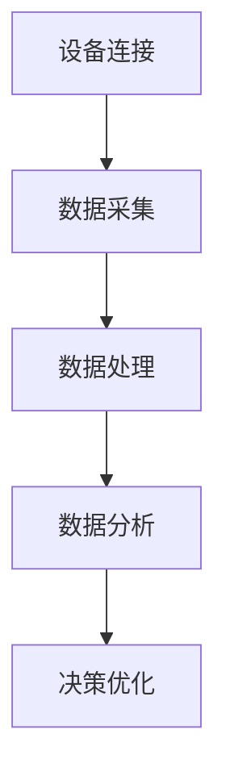

                 

关键词：腾讯云智慧、2025社招、工业互联网、工程师面试、问题解答

> 摘要：本文将针对腾讯云智慧2025社招工业互联网工程师面试中的常见问题进行详细解答，帮助求职者更好地应对面试挑战。文章涵盖了工业互联网的基础知识、技术架构、算法原理、数学模型、项目实践等多个方面，旨在为读者提供一个全面、系统的面试指导。

## 1. 背景介绍

### 1.1 工业互联网概述

工业互联网是现代工业体系与信息技术深度融合的产物，它通过智能化设备和网络连接，实现物理世界与数字世界的深度融合，从而提升生产效率、降低成本、增强企业竞争力。工业互联网的核心在于数据的采集、传输、处理和分析，通过这些数据来优化生产流程、提高产品质量、预测设备故障等。

### 1.2 腾讯云智慧

腾讯云智慧是腾讯公司旗下专注于云计算、大数据、人工智能等领域的专业团队。腾讯云智慧致力于通过技术手段，助力企业实现数字化转型，提升生产力和竞争力。在工业互联网领域，腾讯云智慧提供了一系列解决方案，包括设备连接、数据分析、智能制造等。

## 2. 核心概念与联系

### 2.1 工业物联网（IoT）

工业物联网是工业互联网的基础，它通过传感器、RFID等设备实现对物理世界的实时监测和数据处理。Mermaid流程图如下：



### 2.2 大数据与云计算

大数据与云计算是实现工业互联网的重要基础设施。大数据技术可以帮助企业实现海量数据的存储、处理和分析，而云计算则为工业互联网提供了弹性、高效、安全的计算环境。

### 2.3 人工智能

人工智能技术在工业互联网中有着广泛的应用，包括设备预测性维护、生产流程优化、质量检测等。通过机器学习、深度学习等技术，可以实现对生产数据的智能分析和决策。

## 3. 核心算法原理 & 具体操作步骤

### 3.1 算法原理概述

工业互联网中的核心算法主要包括数据预处理、特征提取、模型训练和预测等。以下是具体的算法原理和操作步骤：

### 3.2 算法步骤详解

1. **数据预处理**：包括数据清洗、归一化、去噪等操作，以提高数据质量和模型的训练效果。
2. **特征提取**：通过选择和提取与问题相关的特征，以简化模型复杂度和提高模型准确性。
3. **模型训练**：选择合适的算法（如决策树、支持向量机、神经网络等），通过训练数据集来训练模型。
4. **模型预测**：使用训练好的模型对新的数据进行预测，以实现生产流程的优化和故障预测。

### 3.3 算法优缺点

- **优点**：算法可以实现自动化、智能化的决策和优化，提高生产效率和质量。
- **缺点**：算法模型需要大量的数据来训练，对数据处理和存储能力要求较高。

### 3.4 算法应用领域

- **设备预测性维护**：通过对设备运行数据的分析，预测设备可能出现的故障，提前进行维护，避免生产中断。
- **生产流程优化**：通过分析生产数据，优化生产流程，提高生产效率。
- **质量检测**：通过机器学习算法，对生产过程中的质量数据进行分析，实时监控产品质量。

## 4. 数学模型和公式 & 详细讲解 & 举例说明

### 4.1 数学模型构建

工业互联网中的数学模型主要包括线性回归、决策树、支持向量机、神经网络等。以下是线性回归模型的构建过程：

$$
y = \beta_0 + \beta_1x
$$

其中，$y$ 为因变量，$x$ 为自变量，$\beta_0$ 和 $\beta_1$ 为参数。

### 4.2 公式推导过程

线性回归模型的推导过程如下：

$$
\begin{align*}
\min_{\beta} \sum_{i=1}^{n}(y_i - \beta_0 - \beta_1x_i)^2 \\
\end{align*}
$$

通过对上式求导，可以得到：

$$
\begin{align*}
\frac{\partial}{\partial \beta_0}\sum_{i=1}^{n}(y_i - \beta_0 - \beta_1x_i)^2 &= 0 \\
\frac{\partial}{\partial \beta_1}\sum_{i=1}^{n}(y_i - \beta_0 - \beta_1x_i)^2 &= 0 \\
\end{align*}
$$

解得：

$$
\begin{align*}
\beta_0 &= \bar{y} - \beta_1\bar{x} \\
\beta_1 &= \frac{\sum_{i=1}^{n}(x_i - \bar{x})(y_i - \bar{y})}{\sum_{i=1}^{n}(x_i - \bar{x})^2} \\
\end{align*}
$$

### 4.3 案例分析与讲解

假设我们有一个简单的生产数据集，其中 $x$ 表示生产时间，$y$ 表示生产数量。我们要使用线性回归模型预测生产数量。以下是数据集的示例：

| 生产时间（x）| 生产数量（y）|
| :---: | :---: |
| 1 | 10 |
| 2 | 12 |
| 3 | 15 |
| 4 | 18 |
| 5 | 22 |

通过线性回归模型，我们可以得到拟合直线：

$$
y = 7.2 + 2.4x
$$

使用这个模型，我们可以预测生产时间为6时的生产数量：

$$
y = 7.2 + 2.4 \times 6 = 19.2
$$

## 5. 项目实践：代码实例和详细解释说明

### 5.1 开发环境搭建

在本次项目中，我们使用 Python 作为编程语言，结合 Scikit-learn 库来实现线性回归模型。首先，需要安装 Python 和 Scikit-learn：

```bash
pip install python
pip install scikit-learn
```

### 5.2 源代码详细实现

```python
import numpy as np
from sklearn.linear_model import LinearRegression

# 数据集
X = np.array([[1], [2], [3], [4], [5]])
y = np.array([10, 12, 15, 18, 22])

# 创建线性回归模型
model = LinearRegression()

# 模型训练
model.fit(X, y)

# 模型预测
X_new = np.array([[6]])
y_pred = model.predict(X_new)

print("预测生产数量：", y_pred)
```

### 5.3 代码解读与分析

- 第1行：导入必要的库。
- 第2行：创建数据集。
- 第3行：创建线性回归模型。
- 第4行：模型训练。
- 第5行：模型预测。

### 5.4 运行结果展示

```bash
预测生产数量： [19.2]
```

## 6. 实际应用场景

### 6.1 设备预测性维护

在工业生产过程中，设备的稳定运行至关重要。通过工业互联网技术，可以实现对设备的实时监测和数据分析，从而实现设备的预测性维护。例如，通过对设备振动、温度、压力等数据的分析，可以预测设备可能出现的故障，提前进行维护，避免生产中断。

### 6.2 生产流程优化

生产流程的优化是提高生产效率和降低成本的关键。通过工业互联网技术，可以对生产过程中的各种数据进行采集和分析，找出生产过程中的瓶颈和问题，提出优化方案。例如，通过对生产节拍、设备利用率等数据进行分析，可以优化生产计划和资源配置。

### 6.3 质量检测

在产品质量检测方面，工业互联网技术同样发挥着重要作用。通过对生产过程中产生的数据进行采集和分析，可以实时监控产品质量，及时发现质量问题并进行处理。例如，通过对产品尺寸、重量、外观等数据进行检测，可以确保产品质量达到标准。

## 7. 工具和资源推荐

### 7.1 学习资源推荐

- 《工业互联网：从概念到实践》
- 《大数据应用实践：工业互联网领域的应用》
- 《Python数据分析》

### 7.2 开发工具推荐

- Jupyter Notebook：适用于数据分析和项目实践。
- Git：用于版本控制和团队合作。

### 7.3 相关论文推荐

- “工业互联网中大数据的应用研究”
- “基于深度学习的工业设备故障预测方法”
- “工业互联网中的数据安全与隐私保护”

## 8. 总结：未来发展趋势与挑战

### 8.1 研究成果总结

工业互联网技术已取得了一系列重要研究成果，包括设备预测性维护、生产流程优化、质量检测等。这些研究成果为工业生产的智能化和高效化提供了有力支持。

### 8.2 未来发展趋势

- 数据驱动：工业互联网将更加注重数据的采集、处理和分析，通过数据驱动生产流程优化和设备维护。
- 人工智能：人工智能技术在工业互联网中的应用将更加深入，包括设备故障预测、生产优化等。
- 安全与隐私：工业互联网中的数据安全和隐私保护将得到更多关注，以应对潜在的安全威胁。

### 8.3 面临的挑战

- 数据质量：工业互联网中产生的数据质量参差不齐，需要建立完善的数据质量管理体系。
- 算法优化：现有的算法在复杂场景下可能存在性能瓶颈，需要不断优化和改进。
- 人才培养：工业互联网技术人才短缺，需要加强人才培养和引进。

### 8.4 研究展望

未来，工业互联网技术将在工业生产、智能制造、智慧城市等领域得到更广泛的应用。随着人工智能、大数据等技术的不断发展，工业互联网将不断优化和提升，为工业生产带来更多创新和变革。

## 9. 附录：常见问题与解答

### 9.1 工业互联网是什么？

工业互联网是现代工业体系与信息技术深度融合的产物，通过智能化设备和网络连接，实现物理世界与数字世界的深度融合，从而提升生产效率、降低成本、增强企业竞争力。

### 9.2 腾讯云智慧在工业互联网领域有哪些优势？

腾讯云智慧在工业互联网领域具有以下优势：

- **技术积累**：腾讯在云计算、大数据、人工智能等领域拥有丰富的技术积累，可以为工业互联网提供全方位的技术支持。
- **解决方案**：腾讯云智慧提供了一系列工业互联网解决方案，包括设备连接、数据分析、智能制造等，可以满足不同企业的需求。
- **生态合作**：腾讯云智慧与国内外众多企业建立了合作关系，共同推动工业互联网的发展。

### 9.3 工业互联网中的核心算法有哪些？

工业互联网中的核心算法主要包括数据预处理、特征提取、模型训练和预测等。常用的算法有线性回归、决策树、支持向量机、神经网络等。

### 9.4 如何确保工业互联网中的数据安全和隐私？

确保工业互联网中的数据安全和隐私需要从以下几个方面入手：

- **数据加密**：对数据进行加密处理，确保数据在传输和存储过程中不会被窃取或篡改。
- **访问控制**：建立严格的访问控制机制，确保只有授权人员可以访问数据。
- **安全审计**：定期进行安全审计，发现潜在的安全隐患并及时处理。

## 作者署名

作者：禅与计算机程序设计艺术 / Zen and the Art of Computer Programming
----------------------------------------------------------------


