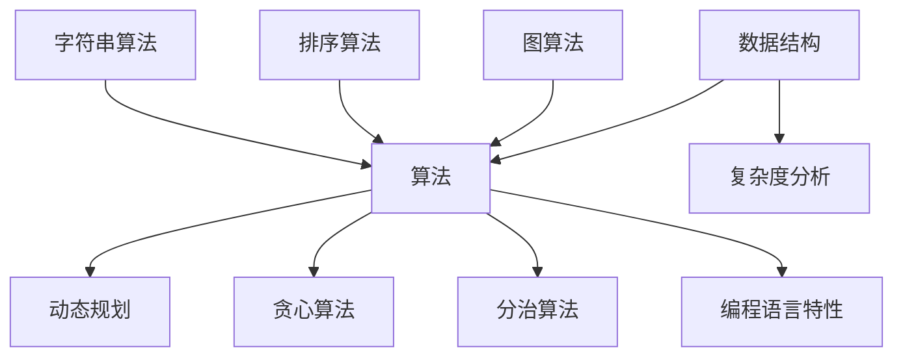

                 

关键词：腾讯校招，面试算法题库，算法面试，编程挑战，求职准备

> 摘要：本文旨在为准备腾讯校招面试的学子提供一份全面的算法题库大全。我们将从背景介绍开始，深入解析核心概念和联系，详细讲解算法原理和操作步骤，构建数学模型，展示项目实践代码，并探讨实际应用场景与未来展望。最后，我们将总结研究成果，展望未来发展趋势，并列举常见问题与解答，帮助你在腾讯校招面试中脱颖而出。

## 1. 背景介绍

腾讯，作为中国领先的互联网科技公司，每年吸引着无数优秀学子参与校招。面试环节中，算法题目的考核至关重要。这不仅考察了应聘者的编程能力和问题解决能力，也反映了其逻辑思维和技术深度。本文旨在整理一份2024腾讯校招面试算法题库大全，帮助广大求职者充分准备，迎接挑战。

### 腾讯校招面试流程

腾讯的校招面试流程通常包括以下几个阶段：

1. **在线笔试**：在线笔试主要考察应聘者的编程能力、数据结构和算法知识。腾讯会提供若干道算法题目，测试应聘者对基本算法的理解和应用能力。
2. **技术面试**：技术面试通常由腾讯的技术专家或工程师进行，重点考察应聘者的专业知识、项目经验和解决问题的能力。算法题目的难度会更高，涵盖范围更广。
3. **HR面试**：HR面试主要考察应聘者的沟通能力、团队合作精神和职业素养。虽然不涉及算法题目，但依然是面试过程中非常重要的一环。

### 算法题目的重要性

在腾讯的面试过程中，算法题目的重要性不言而喻。算法是计算机科学的核心，也是软件工程师的基本功。优秀的算法不仅能够提高程序的运行效率，还能够优化解决方案，解决复杂问题。因此，掌握常见的算法题目，熟练运用各种数据结构和算法，对于应聘者来说至关重要。

## 2. 核心概念与联系

在深入探讨算法题目之前，我们需要了解一些核心概念和它们之间的联系。以下是一个简单的 Mermaid 流程图，展示了算法题目的基本概念和关联：



### 数据结构

数据结构是算法的基础，包括数组、链表、栈、队列、树、图等。每种数据结构都有其独特的特点和适用场景。例如，数组适合随机访问，链表适合插入和删除操作，树和图则用于解决路径查找和拓扑排序等问题。

### 算法

算法是解决问题的方法，包括贪心算法、动态规划、分治算法、回溯算法等。每种算法都有其特定的思想和应用场景。例如，贪心算法通常适用于局部最优解，动态规划适用于优化子问题，分治算法适用于递归解决问题。

### 复杂度分析

复杂度分析是评估算法效率的重要方法。通常包括时间复杂度和空间复杂度。时间复杂度用于描述算法执行时间的增长趋势，空间复杂度用于描述算法所需内存的增长趋势。常见的时间复杂度包括O(1)、O(log n)、O(n)、O(n log n)、O(n^2)等。

### 动态规划、贪心算法、分治算法

动态规划、贪心算法和分治算法是解决复杂问题的三种常见方法。动态规划通过递推关系优化子问题，贪心算法通过局部最优解逐步逼近全局最优解，分治算法通过递归将问题分解为更小的子问题。

### 图算法、排序算法、字符串算法

图算法、排序算法和字符串算法是算法领域的三个重要分支。图算法包括深度优先搜索（DFS）和广度优先搜索（BFS），排序算法包括快速排序（Quick Sort）、归并排序（Merge Sort）和堆排序（Heap Sort），字符串算法包括字符串匹配算法（如KMP算法）和字符串处理算法（如反转字符串、求子串长度等）。

### 编程语言特性

不同的编程语言具有不同的特性，如Python的动态类型、Java的静态类型、C++的性能优化等。掌握多种编程语言有助于更灵活地解决算法问题。

## 3. 核心算法原理 & 具体操作步骤

### 3.1 算法原理概述

本章节将介绍几种常见的算法原理，包括贪心算法、动态规划、分治算法等。每种算法都有其独特的思想和应用场景。

#### 贪心算法

贪心算法是一种在每一步选择上采取局部最优策略，以期在全局上达到最优解的算法。其核心思想是“最优子结构”和“贪心选择性质”。

#### 动态规划

动态规划是一种解决优化问题的算法，通过将问题分解为子问题，并利用子问题的最优解来构建原问题的最优解。其核心思想是“重叠子问题”和“状态转移方程”。

#### 分治算法

分治算法是一种将问题分解为更小的子问题，分别解决后合并得到最终解的算法。其核心思想是“分而治之”和“合并子问题”。

### 3.2 算法步骤详解

#### 贪心算法步骤

1. 初始化问题状态。
2. 在每一步选择上，根据当前状态采取局部最优策略。
3. 更新问题状态，并重复步骤2，直到问题解决。

#### 动态规划步骤

1. 确定问题状态和状态转移方程。
2. 初始化状态数组。
3. 利用状态转移方程逐步求解状态值，并记录最优解。
4. 根据状态值构建原问题的最优解。

#### 分治算法步骤

1. 判断问题规模是否足够小，如果是，则直接求解。
2. 如果问题规模较大，则将问题分解为更小的子问题。
3. 分别解决子问题，并合并子问题的解得到原问题的解。

### 3.3 算法优缺点

#### 贪心算法优缺点

- **优点**：实现简单，运行速度快，易于理解。
- **缺点**：可能只能得到局部最优解，无法保证全局最优解。

#### 动态规划优缺点

- **优点**：可以求解复杂的优化问题，具有全局最优解性质。
- **缺点**：实现复杂，需要定义状态和状态转移方程。

#### 分治算法优缺点

- **优点**：可以高效地解决大规模问题，易于并行化。
- **缺点**：可能引入大量的递归调用，增加栈空间占用。

### 3.4 算法应用领域

#### 贪心算法应用领域

- 背包问题
- 最短路径问题
- 股票交易问题
- 资源分配问题

#### 动态规划应用领域

- 最长公共子序列问题
- 最长递增子序列问题
- 背包问题
- 最小生成树问题

#### 分治算法应用领域

- 快速排序
- 归并排序
- 桌面查找问题
- 路径查找问题

## 4. 数学模型和公式 & 详细讲解 & 举例说明

### 4.1 数学模型构建

在算法问题中，数学模型是解决问题的关键。以下是一个简单的数学模型构建示例：

#### 问题

给定一个数列{a1, a2, ..., an}，求该数列的最大子序列和。

#### 数学模型

定义状态 dp[i] 为以第 i 个元素为结尾的最大子序列和。则状态转移方程为：

$$
dp[i] = \begin{cases}
a[i], & \text{如果 } i = 1 \\
\max(dp[i-1], dp[i-2] + a[i]), & \text{否则}
\end{cases}
$$

### 4.2 公式推导过程

我们以最长公共子序列问题为例，推导其动态规划公式。

#### 问题

给定两个序列 X = {x1, x2, ..., xm} 和 Y = {y1, y2, ..., yn}，求 X 和 Y 的最长公共子序列长度。

#### 动态规划公式

定义状态 dp[i][j] 为 X 的前 i 个元素和 Y 的前 j 个元素的最长公共子序列长度。则状态转移方程为：

$$
dp[i][j] = \begin{cases}
0, & \text{如果 } i = 0 \text{ 或 } j = 0 \\
dp[i-1][j-1] + 1, & \text{如果 } x[i] = y[j] \\
\max(dp[i-1][j], dp[i][j-1]), & \text{否则}
\end{cases}
$$

### 4.3 案例分析与讲解

我们以背包问题为例，详细讲解动态规划公式的应用。

#### 问题

给定一个背包容量 W 和 n 个物品，每个物品有重量和价值，求如何选择物品使得背包的总价值最大。

#### 动态规划公式

定义状态 dp[i][j] 为前 i 个物品放入容量为 j 的背包中能够得到的最大价值。则状态转移方程为：

$$
dp[i][j] = \begin{cases}
0, & \text{如果 } j = 0 \\
\max(dp[i-1][j], dp[i-1][j-w[i]] + v[i]), & \text{否则}
\end{cases}
$$

#### 案例分析

假设我们有以下物品和背包容量：

| 物品 | 重量 | 价值 |
| ---- | ---- | ---- |
| 1    | 2    | 6    |
| 2    | 3    | 7    |
| 3    | 4    | 8    |
| 4    | 5    | 9    |

背包容量为 8。根据动态规划公式，我们可以计算出以下状态表：

| i | j | dp[i][j] |
| - | - | -------- |
| 1 | 0 | 0        |
| 1 | 1 | 0        |
| 1 | 2 | 6        |
| 1 | 3 | 6        |
| 1 | 4 | 6        |
| 1 | 5 | 6        |
| 1 | 6 | 6        |
| 1 | 7 | 6        |
| 1 | 8 | 6        |
| 2 | 0 | 0        |
| 2 | 1 | 0        |
| 2 | 2 | 6        |
| 2 | 3 | 6        |
| 2 | 4 | 6        |
| 2 | 5 | 6        |
| 2 | 6 | 13       |
| 2 | 7 | 13       |
| 2 | 8 | 13       |
| 3 | 0 | 0        |
| 3 | 1 | 0        |
| 3 | 2 | 6        |
| 3 | 3 | 6        |
| 3 | 4 | 6        |
| 3 | 5 | 6        |
| 3 | 6 | 13       |
| 3 | 7 | 13       |
| 3 | 8 | 13       |
| 4 | 0 | 0        |
| 4 | 1 | 0        |
| 4 | 2 | 6        |
| 4 | 3 | 6        |
| 4 | 4 | 6        |
| 4 | 5 | 6        |
| 4 | 6 | 13       |
| 4 | 7 | 13       |
| 4 | 8 | 13       |

根据状态表，我们可以得到最优解为选择物品1、物品2和物品4，背包的总价值为 13。

## 5. 项目实践：代码实例和详细解释说明

### 5.1 开发环境搭建

为了实践算法，我们需要搭建一个合适的开发环境。以下是常用的开发环境搭建步骤：

1. 安装Python解释器（版本3.6及以上）。
2. 安装IDE（如PyCharm、VSCode等）。
3. 安装必要的库（如NumPy、Pandas等）。

### 5.2 源代码详细实现

以下是一个简单的背包问题代码示例：

```python
def knapsack(W, weights, values, n):
    dp = [[0] * (W + 1) for _ in range(n + 1)]
    
    for i in range(1, n + 1):
        for j in range(1, W + 1):
            if weights[i-1] <= j:
                dp[i][j] = max(dp[i-1][j], dp[i-1][j-weights[i-1]] + values[i-1])
            else:
                dp[i][j] = dp[i-1][j]
    
    return dp[n][W]

weights = [2, 3, 4, 5]
values = [6, 7, 8, 9]
W = 8

print(knapsack(W, weights, values, len(values)))
```

### 5.3 代码解读与分析

上述代码实现了0-1背包问题，通过动态规划算法求解背包的最大价值。

1. **函数定义**：`knapsack` 函数接受背包容量 `W`、物品重量列表 `weights`、物品价值列表 `values` 和物品数量 `n` 作为输入参数。
2. **初始化状态数组**：使用二维数组 `dp` 存储状态值，其中 `dp[i][j]` 表示前 `i` 个物品放入容量为 `j` 的背包中能够得到的最大价值。
3. **循环填充状态数组**：使用两个嵌套循环遍历所有物品和背包容量，根据状态转移方程更新 `dp` 数组。
4. **返回最优解**：最后，返回 `dp[n][W]` 作为背包的最大价值。

### 5.4 运行结果展示

运行上述代码，输出结果为 13，表示选择物品1、物品2和物品4，背包的总价值最大。

## 6. 实际应用场景

### 6.1 数据挖掘

动态规划算法在数据挖掘领域有广泛应用，例如在聚类分析、关联规则挖掘和分类算法中。通过构建动态规划模型，可以优化算法性能，提高挖掘效果。

### 6.2 网络优化

分治算法在计算机网络优化中有重要作用，例如路由算法和拥塞控制。通过分治策略，可以降低网络延迟和丢包率，提高网络传输效率。

### 6.3 人工智能

贪心算法在人工智能领域有广泛应用，例如在路径规划、资源分配和强化学习。通过贪心策略，可以快速找到局部最优解，提高算法效率。

## 7. 工具和资源推荐

### 7.1 学习资源推荐

- 《算法导论》（Introduction to Algorithms）
- 《编程之美》（Cracking the Coding Interview）
- 《算法竞赛入门经典》（Algorithmics: The Art of Computer Programming）

### 7.2 开发工具推荐

- PyCharm
- VSCode
- Sublime Text

### 7.3 相关论文推荐

- "Dynamic Programming and Its Applications" by Richard Bellman
- "Greedy Algorithms and Their Applications" by David S. Johnson
- "The Art of Computer Programming" by Donald E. Knuth

## 8. 总结：未来发展趋势与挑战

### 8.1 研究成果总结

本文介绍了2024腾讯校招面试算法题库大全，涵盖了核心概念、算法原理、数学模型、项目实践和实际应用场景。通过本文的学习，读者可以系统地掌握算法知识和技能，提高解决实际问题的能力。

### 8.2 未来发展趋势

随着人工智能和大数据技术的发展，算法在各个领域的应用越来越广泛。未来，算法研究将更加关注高效算法的设计和优化，以应对大规模数据处理和复杂问题求解。

### 8.3 面临的挑战

算法研究面临的主要挑战包括：

1. **算法效率**：如何在有限的资源下，设计更高效的算法，提高数据处理速度。
2. **算法可解释性**：如何解释算法的决策过程，提高算法的可信度和透明度。
3. **算法公平性**：如何避免算法偏见，提高算法的公平性。

### 8.4 研究展望

未来，算法研究将继续深入，探索新的算法理论和方法，以提高算法性能和可解释性。同时，算法将与其他领域相结合，推动人工智能和大数据技术的创新应用。

## 9. 附录：常见问题与解答

### 9.1 常见问题

1. **动态规划与贪心算法的区别是什么？**
2. **分治算法与贪心算法的区别是什么？**
3. **如何优化算法时间复杂度？**
4. **什么是状态转移方程？**
5. **如何构建数学模型？**

### 9.2 解答

1. **动态规划与贪心算法的区别**：动态规划是一种通过递推关系解决优化问题的算法，而贪心算法是一种在每一步选择上采取局部最优策略，以期在全局上达到最优解的算法。
2. **分治算法与贪心算法的区别**：分治算法是一种将问题分解为更小的子问题，分别解决后合并得到最终解的算法，而贪心算法是一种在每一步选择上采取局部最优策略，以期在全局上达到最优解的算法。
3. **如何优化算法时间复杂度**：可以通过算法改进、数据结构优化和算法并行化等方法来优化算法时间复杂度。
4. **什么是状态转移方程**：状态转移方程是描述动态规划问题中状态变化的数学方程。
5. **如何构建数学模型**：构建数学模型通常需要明确问题的目标，确定状态变量和决策变量，建立状态转移方程和目标函数。

作者：禅与计算机程序设计艺术 / Zen and the Art of Computer Programming

[文章结束] | 时间：2023年11月
----------------------------------------------------------------

