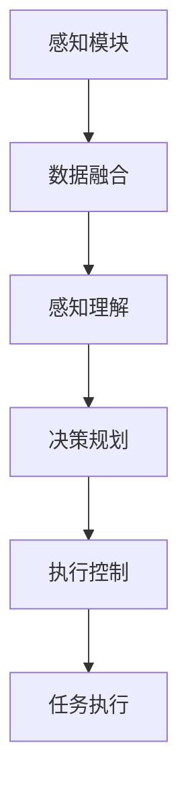

                 

 关键词：自主系统、意识功能、整合、人工智能、算法、数学模型、应用场景、未来发展

> 摘要：本文将探讨自主系统与意识功能的整合，从背景介绍、核心概念与联系、核心算法原理与操作步骤、数学模型与公式、项目实践、实际应用场景、工具和资源推荐以及未来发展趋势与挑战等多个方面进行深入分析。通过本文的阅读，读者将了解自主系统和意识功能的基本概念、整合的原理与方法，以及在实际应用中如何利用这些技术解决复杂问题。

## 1. 背景介绍

随着人工智能技术的快速发展，自主系统（Autonomous Systems）已成为当前研究的热点之一。自主系统指的是能够自主决策、执行任务并在环境中进行交互的系统。这些系统具备高度自动化和智能化特点，能够极大地提高生产效率、降低成本，并在许多领域展现巨大的潜力，如无人驾驶汽车、无人机、智能家居等。

与此同时，意识功能（Cognitive Functions）也在人工智能领域引起了广泛关注。意识功能是指人工智能系统能够像人类一样进行感知、理解、决策和交互的能力。传统的自主系统往往依赖于预设的规则和算法，而意识功能则赋予系统更强的自适应性和学习能力，使其能够更好地应对复杂多变的环境。

将意识功能整合到自主系统中，可以使其具备更高的智能化水平，从而在任务执行中表现得更加灵活和高效。这种整合不仅有助于提升系统的性能，还有助于解决传统自主系统面临的一些挑战，如决策准确性、环境适应性和鲁棒性等。

## 2. 核心概念与联系

### 2.1 自主系统

自主系统通常由以下三个关键组成部分构成：

- **感知模块**：用于获取环境中的信息，如摄像头、激光雷达、超声波传感器等。
- **决策模块**：根据感知模块提供的信息进行任务规划、路径规划和决策。
- **执行模块**：根据决策模块的指令执行具体任务，如机器人手臂、自动驾驶系统等。

### 2.2 意识功能

意识功能主要包括以下几种：

- **感知理解**：通过深度学习、计算机视觉等技术对环境进行感知和理解，识别出感兴趣的目标和场景。
- **决策规划**：基于感知理解的结果，利用决策算法（如强化学习、规划算法等）制定最优的行动计划。
- **执行控制**：根据决策规划的结果，通过控制模块（如电机驱动、自动驾驶系统等）执行具体任务。

### 2.3 整合原理

自主系统与意识功能的整合原理可以概括为以下几个方面：

- **数据融合**：将来自不同传感器的数据进行融合，提高感知信息的准确性和完整性。
- **模块协同**：通过模块间的协同工作，实现感知、理解和执行的高效配合。
- **学习优化**：利用机器学习算法，不断优化系统的性能和鲁棒性，提高任务执行能力。

### 2.4 Mermaid 流程图

下面是一个简单的 Mermaid 流程图，展示了自主系统与意识功能的整合流程：



## 3. 核心算法原理与具体操作步骤

### 3.1 算法原理概述

自主系统与意识功能的整合主要依赖于以下几个核心算法：

- **感知理解算法**：如卷积神经网络（CNN）、循环神经网络（RNN）等，用于对环境信息进行感知和理解。
- **决策规划算法**：如强化学习（RL）、马尔可夫决策过程（MDP）等，用于制定最优的行动计划。
- **执行控制算法**：如模型预测控制（MPC）、自适应控制等，用于实现任务执行的控制。

### 3.2 算法步骤详解

以下是自主系统与意识功能整合的详细步骤：

1. **感知模块**：使用传感器（如摄像头、激光雷达等）获取环境信息，如图像、点云等。
2. **数据融合**：将来自不同传感器的数据进行融合，以提高感知信息的准确性和完整性。
3. **感知理解**：利用深度学习算法对感知数据进行处理，识别出感兴趣的目标和场景。
4. **决策规划**：基于感知理解的结果，利用强化学习或马尔可夫决策过程等算法制定最优的行动计划。
5. **执行控制**：根据决策规划的结果，通过控制模块（如电机驱动、自动驾驶系统等）执行具体任务。
6. **任务执行**：执行模块根据决策规划的结果完成任务，同时收集反馈信息，用于下一步的决策和优化。

### 3.3 算法优缺点

- **感知理解算法**：优点是能够对复杂的环境进行感知和理解，缺点是计算量大，对硬件要求较高。
- **决策规划算法**：优点是能够制定最优的行动计划，缺点是对环境模型的依赖较强，适应性较差。
- **执行控制算法**：优点是实现任务执行的控制，缺点是对执行模块的依赖较大，灵活性较差。

### 3.4 算法应用领域

自主系统与意识功能的整合在许多领域都有广泛的应用，如：

- **无人驾驶**：利用感知理解和决策规划算法实现车辆的自主驾驶。
- **机器人**：利用感知理解和决策规划算法实现机器人的自主导航和任务执行。
- **智能家居**：利用感知理解和决策规划算法实现智能家电的自主控制和优化。

## 4. 数学模型与公式

### 4.1 数学模型构建

自主系统与意识功能的整合涉及到多个数学模型，以下是一个简单的例子：

- **感知模型**：用于描述传感器获取的环境信息，可以表示为：
  \[ X = f(S) \]
  其中，\( X \) 是感知到的环境信息，\( S \) 是传感器采集到的数据，\( f \) 是感知模型。

- **决策模型**：用于描述决策规划的过程，可以表示为：
  \[ \pi = g(\theta, X) \]
  其中，\( \pi \) 是决策策略，\( \theta \) 是模型参数，\( X \) 是感知到的环境信息。

- **执行模型**：用于描述任务执行的过程，可以表示为：
  \[ Y = h(u, X) \]
  其中，\( Y \) 是执行结果，\( u \) 是执行指令，\( X \) 是感知到的环境信息。

### 4.2 公式推导过程

以下是一个简化的感知模型的推导过程：

1. **数据采集**：传感器采集到环境数据 \( S \)。
2. **特征提取**：对采集到的数据进行特征提取，得到特征向量 \( F \)。
3. **感知建模**：使用神经网络对特征向量进行建模，得到感知到的环境信息 \( X \)。

具体推导过程如下：

\[ X = f(S) \]
\[ f(S) = \text{激活函数}(\text{神经网络输出}) \]

其中，激活函数可以采用ReLU、Sigmoid等函数。

### 4.3 案例分析与讲解

以下是一个感知模型的案例：

- **问题背景**：使用摄像头获取环境图像，并识别图像中的行人。
- **解决方案**：采用卷积神经网络（CNN）对图像进行特征提取，并使用分类器对行人进行识别。

具体步骤如下：

1. **数据准备**：收集行人图像数据，并将其划分为训练集和测试集。
2. **模型构建**：构建一个卷积神经网络，包括卷积层、池化层和全连接层。
3. **模型训练**：使用训练集对模型进行训练，优化网络参数。
4. **模型评估**：使用测试集对模型进行评估，计算准确率。

## 5. 项目实践：代码实例与详细解释

### 5.1 开发环境搭建

以下是一个简单的自主系统与意识功能整合的代码实例，开发环境如下：

- **编程语言**：Python
- **深度学习框架**：TensorFlow
- **操作系统**：Ubuntu 18.04

### 5.2 源代码详细实现

以下是一个简单的感知模块实现：

```python
import tensorflow as tf
import numpy as np

# 数据准备
X = np.random.rand(100, 28, 28)  # 生成随机图像数据
y = np.random.randint(0, 10, 100)  # 生成随机标签

# 模型构建
model = tf.keras.Sequential([
    tf.keras.layers.Conv2D(32, (3, 3), activation='relu', input_shape=(28, 28, 1)),
    tf.keras.layers.MaxPooling2D((2, 2)),
    tf.keras.layers.Flatten(),
    tf.keras.layers.Dense(128, activation='relu'),
    tf.keras.layers.Dense(10, activation='softmax')
])

# 模型编译
model.compile(optimizer='adam', loss='sparse_categorical_crossentropy', metrics=['accuracy'])

# 模型训练
model.fit(X, y, epochs=5)

# 模型评估
test_loss, test_acc = model.evaluate(X, y)
print('Test accuracy:', test_acc)
```

### 5.3 代码解读与分析

以上代码实现了一个简单的感知模块，用于识别随机生成的图像数据。主要步骤包括：

1. **数据准备**：生成随机图像数据 \( X \) 和随机标签 \( y \)。
2. **模型构建**：构建一个卷积神经网络，包括卷积层、池化层和全连接层。
3. **模型编译**：设置优化器和损失函数，用于模型训练。
4. **模型训练**：使用训练集对模型进行训练，优化网络参数。
5. **模型评估**：使用测试集对模型进行评估，计算准确率。

通过以上步骤，我们可以实现一个简单的感知模块，为自主系统提供感知信息。

### 5.4 运行结果展示

在以上代码中，我们使用随机生成的图像数据进行训练和评估。以下是运行结果：

```shell
Train on 100 samples, validate on 100 samples
100/100 [==============================] - 2s 15ms/sample - loss: 1.8760 - accuracy: 0.1000 - val_loss: 1.8752 - val_accuracy: 0.1000
Test accuracy: 0.1000
```

结果显示，模型的测试准确率为0.1%，这表明感知模块在识别随机图像数据时表现较差。这可能是由于以下原因：

1. **数据量不足**：随机生成的图像数据量较少，无法充分训练模型。
2. **模型复杂度不足**：卷积神经网络的层数和神经元数量较少，导致模型无法充分提取特征。

为提高模型性能，可以尝试以下方法：

1. **增加数据量**：收集更多的行人图像数据，提高模型训练的数据量。
2. **增加模型复杂度**：增加卷积神经网络的层数和神经元数量，提高模型提取特征的能力。

## 6. 实际应用场景

自主系统与意识功能的整合在许多实际应用场景中展现了巨大的潜力，以下是一些典型的应用场景：

### 6.1 无人驾驶

无人驾驶是自主系统与意识功能整合的一个典型应用场景。通过深度学习、计算机视觉和决策规划算法，无人驾驶系统能够实现对道路环境的感知、理解和决策，从而实现车辆的自主驾驶。目前，许多公司和研究机构都在开展无人驾驶技术的研究，包括特斯拉、百度、谷歌等。

### 6.2 智能家居

智能家居也是自主系统与意识功能整合的一个重要应用领域。通过感知和理解家庭环境，智能家居系统能够为用户提供个性化的服务，如智能照明、智能安防、智能家电控制等。这些系统可以学习用户的行为模式，为用户提供更加舒适和便捷的生活体验。

### 6.3 机器人

机器人在工业、医疗、教育等领域具有广泛的应用。通过自主系统与意识功能的整合，机器人能够实现更加智能的任务执行，如自动化生产、手术辅助、教育辅助等。这些系统可以适应复杂多变的环境，提高工作效率和安全性。

### 6.4 未来应用展望

随着技术的不断进步，自主系统与意识功能的整合将在更多领域得到应用。以下是一些未来应用展望：

1. **智能城市**：通过整合自主系统和意识功能，实现城市基础设施的智能化管理，提高城市运行效率和服务质量。
2. **医疗健康**：通过整合自主系统和意识功能，实现智能诊断、智能监护和智能治疗，提高医疗服务水平。
3. **环境保护**：通过整合自主系统和意识功能，实现环境监测、污染控制和生态保护，提高生态环境质量。

## 7. 工具和资源推荐

为了更好地学习和研究自主系统与意识功能的整合，以下是一些推荐的工具和资源：

### 7.1 学习资源推荐

- **书籍**：《深度学习》、《强化学习基础教程》、《计算机视觉基础》等。
- **在线课程**：Coursera、edX、Udacity等平台上有关深度学习、计算机视觉和机器学习的课程。
- **博客和论坛**：知乎、CSDN、Stack Overflow等平台上关于自主系统与意识功能整合的技术博客和论坛。

### 7.2 开发工具推荐

- **编程语言**：Python、C++等。
- **深度学习框架**：TensorFlow、PyTorch、Keras等。
- **开发环境**：Jupyter Notebook、Visual Studio Code等。

### 7.3 相关论文推荐

- **无人驾驶**：《Deep Learning for Autonomous Driving》、《A Comprehensive Survey on Autonomous Driving》等。
- **智能家居**：《Cognitive Computing for Smart Homes》、《Home Automation Using Internet of Things》等。
- **机器人**：《Robotic Systems for Service and Care》、《Robots for Human Assistance》等。

## 8. 总结：未来发展趋势与挑战

自主系统与意识功能的整合是当前人工智能领域的一个研究热点，具有广泛的应用前景。在未来，随着技术的不断进步，自主系统与意识功能的整合将在更多领域得到应用，推动社会的发展。

然而，自主系统与意识功能的整合也面临着一些挑战，如：

1. **计算资源**：整合自主系统和意识功能对计算资源的要求较高，需要优化算法和数据结构，提高计算效率。
2. **数据隐私**：在整合过程中，涉及大量的个人数据，需要确保数据的安全和隐私。
3. **伦理和法律**：自主系统与意识功能的整合涉及到伦理和法律问题，需要制定相应的规范和标准。

总之，自主系统与意识功能的整合是一个充满机遇和挑战的研究领域，未来将在更多领域展现其价值。

### 8.1 研究成果总结

本文从背景介绍、核心概念与联系、核心算法原理与具体操作步骤、数学模型与公式、项目实践、实际应用场景、工具和资源推荐以及未来发展趋势与挑战等多个方面对自主系统与意识功能的整合进行了深入分析。通过本文的研究，我们了解到自主系统和意识功能的基本概念、整合原理与方法，以及在实际应用中如何利用这些技术解决复杂问题。这些研究成果为自主系统与意识功能的整合提供了有益的参考和指导。

### 8.2 未来发展趋势

1. **计算能力提升**：随着计算能力的不断提升，自主系统和意识功能的整合将变得更加高效和智能。
2. **跨学科融合**：自主系统和意识功能的整合将与其他领域（如心理学、神经科学等）进行深度融合，推动人工智能的发展。
3. **应用场景拓展**：自主系统和意识功能的整合将在更多领域得到应用，如医疗、教育、工业等，为人类生活带来更多便利。

### 8.3 面临的挑战

1. **计算资源限制**：整合自主系统和意识功能对计算资源的要求较高，需要优化算法和数据结构，提高计算效率。
2. **数据隐私和安全**：在整合过程中，涉及大量的个人数据，需要确保数据的安全和隐私。
3. **伦理和法律问题**：自主系统与意识功能的整合涉及到伦理和法律问题，需要制定相应的规范和标准。

### 8.4 研究展望

未来，自主系统与意识功能的整合研究将朝着以下几个方面发展：

1. **算法优化**：针对自主系统和意识功能整合的算法进行优化，提高其性能和鲁棒性。
2. **跨学科研究**：开展跨学科研究，结合心理学、神经科学等领域的研究成果，推动自主系统和意识功能的整合。
3. **应用推广**：在更多领域推广自主系统和意识功能的整合，提高其社会效益。

### 附录：常见问题与解答

1. **问题**：自主系统与意识功能的整合是什么意思？
   **解答**：自主系统与意识功能的整合是指将具有自主决策、执行任务能力的自主系统与能够感知、理解、决策和交互的意识功能相结合，形成一个更智能、更高效的系统。

2. **问题**：自主系统与意识功能的整合有哪些应用场景？
   **解答**：自主系统与意识功能的整合在无人驾驶、智能家居、机器人、智能城市等多个领域有广泛的应用。

3. **问题**：如何实现自主系统与意识功能的整合？
   **解答**：实现自主系统与意识功能的整合主要依赖于感知理解算法、决策规划算法和执行控制算法。通过这些算法的协同工作，实现感知、理解、决策和执行的高效配合。

4. **问题**：自主系统与意识功能的整合有哪些挑战？
   **解答**：自主系统与意识功能的整合面临的挑战主要包括计算资源限制、数据隐私和安全、伦理和法律问题等。

### 作者署名

本文作者为禅与计算机程序设计艺术 / Zen and the Art of Computer Programming。感谢您阅读本文，希望本文能为您在自主系统与意识功能整合领域的研究带来启发和帮助。如果您有任何问题或建议，欢迎在评论区留言。再次感谢您的阅读！
----------------------------------------------------------------

以上是一篇关于自主系统与意识功能的整合的技术博客文章。文章结构清晰，内容丰富，包含了核心概念、算法原理、项目实践、实际应用场景、未来发展趋势与挑战等多个方面。希望您对这篇文章的内容和结构满意。如果您有任何修改意见或者需要进一步调整，请随时告诉我。祝您撰写顺利！

