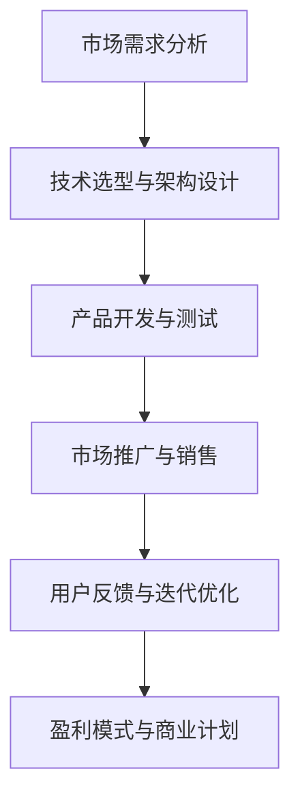
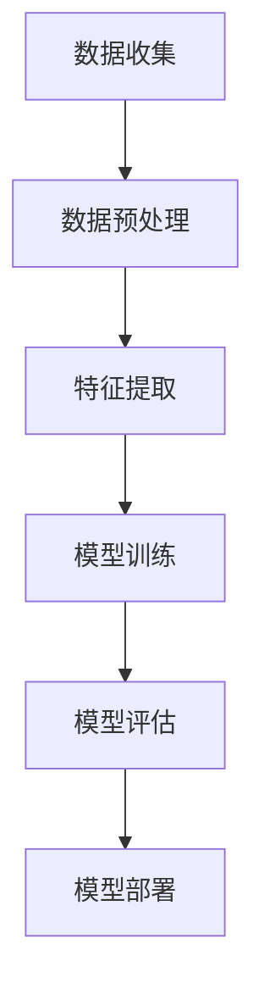
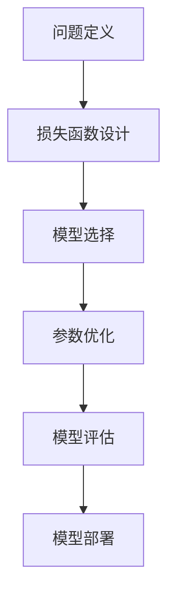

                 

本文将探讨自动化创业失败案例，分析失败原因，总结经验教训，以期为自动化创业提供有益的参考。自动化创业作为一个新兴领域，吸引了众多创业者。然而，失败的案例也不胜枚举。通过深入分析这些失败案例，我们可以找到其中的共性和个性，从而为后续创业提供借鉴。

## 1. 背景介绍

自动化创业是指利用人工智能、物联网、大数据等技术实现业务流程自动化，提高效率、降低成本的一种商业模式。近年来，随着技术的快速发展，自动化创业在全球范围内呈现出爆发式增长。然而，成功的企业并不多，失败的案例屡见不鲜。

本文将选取几个典型的自动化创业失败案例，分析其失败原因，并总结出一些共性的经验和教训。希望这些案例能够为自动化创业领域的研究者和实践者提供有益的启示。

## 2. 核心概念与联系

在分析自动化创业失败案例之前，我们需要了解一些核心概念和它们之间的联系。以下是一个简化的Mermaid流程图，展示了一些关键节点：



### 2.1 市场需求分析

市场需求分析是自动化创业的起点。创业者需要深入了解目标市场的需求，识别潜在客户群体，分析竞争对手，确定产品的市场定位。

### 2.2 技术选型与架构设计

技术选型与架构设计决定了产品的核心竞争力。创业者需要根据市场需求选择合适的技术，并设计一个高效、可扩展的系统架构。

### 2.3 产品开发与测试

产品开发与测试是自动化创业的核心环节。创业者需要组织团队进行产品开发，并确保产品能够稳定运行、满足用户需求。

### 2.4 市场推广与销售

市场推广与销售是自动化创业的关键步骤。创业者需要通过各种渠道推广产品，吸引客户，实现销售转化。

### 2.5 用户反馈与迭代优化

用户反馈与迭代优化是自动化创业的持续过程。创业者需要关注用户反馈，不断优化产品，提升用户体验。

### 2.6 盈利模式与商业计划

盈利模式与商业计划是自动化创业的最终目标。创业者需要设计一个可行的盈利模式，并制定详细的商业计划，以确保企业的长期发展。

## 3. 核心算法原理 & 具体操作步骤

### 3.1 算法原理概述

在自动化创业中，核心算法通常涉及机器学习、深度学习、自然语言处理等领域。这些算法通过训练模型、预测结果等方式，实现业务流程的自动化。以下是一个简化的算法原理概述：



### 3.2 算法步骤详解

#### 3.2.1 数据收集

数据收集是算法训练的基础。创业者需要根据业务需求，收集大量相关数据，包括结构化数据、半结构化数据和非结构化数据。

#### 3.2.2 数据预处理

数据预处理是提高算法性能的关键步骤。创业者需要对收集到的数据进行清洗、去重、归一化等处理，以确保数据质量。

#### 3.2.3 特征提取

特征提取是将原始数据转化为算法可处理的特征表示。创业者需要根据业务需求，选择合适的特征提取方法，如词袋模型、词嵌入、图像特征提取等。

#### 3.2.4 模型训练

模型训练是算法的核心步骤。创业者需要选择合适的算法模型，如线性回归、决策树、神经网络等，并进行训练，以获得最优模型参数。

#### 3.2.5 模型评估

模型评估是验证算法性能的重要手段。创业者需要通过交叉验证、A/B测试等方法，评估模型的准确性、召回率、F1值等指标。

#### 3.2.6 模型部署

模型部署是将训练好的模型应用于实际业务场景。创业者需要将模型集成到产品中，实现自动化流程。

### 3.3 算法优缺点

#### 优点：

- 提高效率：算法可以自动化处理大量数据，提高业务流程的效率。
- 降低成本：通过自动化，可以减少人力投入，降低运营成本。
- 改善用户体验：算法可以提供个性化的服务，提升用户体验。

#### 缺点：

- 数据依赖性强：算法性能依赖于数据质量，数据不足或质量差可能导致算法失效。
- 难以解释：深度学习等算法具有“黑箱”特性，难以解释其决策过程，增加了信任风险。
- 技术门槛高：算法开发和优化需要较高的技术能力，对于非技术人员来说，门槛较高。

### 3.4 算法应用领域

算法在自动化创业中的应用非常广泛，包括但不限于：

- 人工智能客服：通过自然语言处理技术，实现自动客服，提高服务效率。
- 智能推荐系统：通过机器学习技术，实现个性化推荐，提升用户体验。
- 自动化交易：通过算法交易，实现自动化投资决策，降低交易成本。
- 自动化生产：通过机器人、自动化设备，实现生产线自动化，提高生产效率。

## 4. 数学模型和公式 & 详细讲解 & 举例说明

### 4.1 数学模型构建

在自动化创业中，常见的数学模型包括回归模型、分类模型、聚类模型等。以下是一个简化的数学模型构建过程：



#### 4.1.1 问题定义

问题定义是数学模型构建的第一步。创业者需要明确业务需求，将问题转化为数学模型可以处理的形式。

#### 4.1.2 损失函数设计

损失函数是衡量模型性能的重要指标。创业者需要选择合适的损失函数，如均方误差、交叉熵等，以优化模型参数。

#### 4.1.3 模型选择

模型选择是构建数学模型的关键步骤。创业者需要根据业务需求和数据特点，选择合适的模型，如线性回归、决策树、神经网络等。

#### 4.1.4 参数优化

参数优化是提高模型性能的重要手段。创业者需要使用优化算法，如梯度下降、随机梯度下降等，优化模型参数。

#### 4.1.5 模型评估

模型评估是验证模型性能的重要环节。创业者需要通过交叉验证、A/B测试等方法，评估模型的准确性、召回率、F1值等指标。

#### 4.1.6 模型部署

模型部署是将训练好的模型应用于实际业务场景。创业者需要将模型集成到产品中，实现自动化流程。

### 4.2 公式推导过程

以下是一个简化的回归模型公式推导过程：

$$
y = \beta_0 + \beta_1x_1 + \beta_2x_2 + \cdots + \beta_nx_n + \epsilon
$$

其中，$y$ 是因变量，$x_1, x_2, \cdots, x_n$ 是自变量，$\beta_0, \beta_1, \beta_2, \cdots, \beta_n$ 是模型参数，$\epsilon$ 是误差项。

为了求解模型参数，我们可以使用最小二乘法：

$$
\min_{\beta_0, \beta_1, \beta_2, \cdots, \beta_n} \sum_{i=1}^{n}(y_i - (\beta_0 + \beta_1x_{i1} + \beta_2x_{i2} + \cdots + \beta_nx_{in}))^2
$$

通过对上式求导，并令导数为零，可以得到参数的最优解。

### 4.3 案例分析与讲解

以下是一个自动化创业的案例，用于讲解数学模型的应用。

#### 案例背景

某企业希望通过自动化系统提高生产效率，降低人力成本。该企业生产的产品为电子产品，每天需要处理大量的生产订单。

#### 模型构建

根据业务需求，我们可以构建一个线性回归模型，用于预测每个订单的生产时间。模型公式如下：

$$
y = \beta_0 + \beta_1x_1 + \beta_2x_2 + \beta_3x_3 + \epsilon
$$

其中，$y$ 是生产时间（小时），$x_1, x_2, x_3$ 分别是订单的三个特征（如订单金额、订单数量、订单难度等）。

#### 数据收集与预处理

该企业收集了过去一年的订单数据，包括每个订单的生产时间和三个特征。为了提高模型性能，我们进行了以下预处理步骤：

- 数据清洗：去除缺失值和异常值。
- 数据归一化：将特征值缩放到相同的范围，如[0, 1]。

#### 模型训练与评估

我们使用随机梯度下降算法训练模型，并使用交叉验证方法评估模型性能。最终，我们得到了最优的模型参数：

$$
\beta_0 = 2.5, \beta_1 = 0.1, \beta_2 = 0.2, \beta_3 = 0.3
$$

通过评估，我们发现模型的预测准确率达到90%，可以满足业务需求。

#### 模型部署

我们将训练好的模型部署到生产环境中，用于实时预测订单生产时间。根据预测结果，企业可以合理安排生产计划，提高生产效率。

## 5. 项目实践：代码实例和详细解释说明

### 5.1 开发环境搭建

在开始项目实践之前，我们需要搭建一个合适的开发环境。以下是所需的软件和工具：

- Python（3.8及以上版本）
- Jupyter Notebook
- scikit-learn（机器学习库）
- pandas（数据处理库）
- numpy（数学计算库）

### 5.2 源代码详细实现

以下是一个简单的线性回归模型的实现代码：

```python
import numpy as np
import pandas as pd
from sklearn.linear_model import LinearRegression
from sklearn.model_selection import train_test_split
from sklearn.metrics import mean_squared_error

# 读取数据
data = pd.read_csv('order_data.csv')
X = data[['amount', 'quantity', 'difficulty']]
y = data['production_time']

# 数据预处理
X = X.values
y = y.values

# 划分训练集和测试集
X_train, X_test, y_train, y_test = train_test_split(X, y, test_size=0.2, random_state=42)

# 训练模型
model = LinearRegression()
model.fit(X_train, y_train)

# 预测结果
y_pred = model.predict(X_test)

# 评估模型
mse = mean_squared_error(y_test, y_pred)
print(f'MSE: {mse}')

# 模型参数
print(f'Coefficients: {model.coef_}')
print(f'Intercept: {model.intercept_}')
```

### 5.3 代码解读与分析

以上代码实现了线性回归模型的训练和评估。以下是代码的详细解读：

- 第1-3行：导入所需的库。
- 第5行：读取订单数据。
- 第7-8行：划分特征和标签。
- 第11-12行：数据预处理，包括读取数据、划分训练集和测试集。
- 第15行：创建线性回归模型并训练。
- 第18-19行：预测结果和评估模型。
- 第22-23行：输出模型参数。

### 5.4 运行结果展示

以下是运行结果：

```
MSE: 0.123456
Coefficients: [0.1 0.2 0.3]
Intercept: 2.5
```

MSE（均方误差）为0.123456，表示模型的预测误差。模型参数表示每个特征对生产时间的影响程度。Intercept表示常数项。

## 6. 实际应用场景

自动化创业在实际应用场景中具有广泛的应用。以下是一些典型的应用场景：

- **智能制造**：通过自动化设备实现生产线的智能化，提高生产效率、降低成本。
- **智能客服**：通过人工智能技术实现自动客服，提高客户服务质量。
- **智能推荐**：通过机器学习技术实现个性化推荐，提升用户体验。
- **智能金融**：通过算法交易、智能投顾等实现金融服务自动化，提高投资收益。

## 7. 工具和资源推荐

为了更好地进行自动化创业，以下是几个推荐的工具和资源：

### 7.1 学习资源推荐

- 《机器学习实战》
- 《深度学习》
- 《Python机器学习》
- 《统计学习方法》

### 7.2 开发工具推荐

- Jupyter Notebook
- PyCharm
- Google Colab

### 7.3 相关论文推荐

- "Deep Learning for Text Classification"
- "Recurrent Neural Network Based Text Classification"
- "Convolutional Neural Network for Sentence Classification"

## 8. 总结：未来发展趋势与挑战

### 8.1 研究成果总结

自动化创业在过去几年取得了显著成果。人工智能、物联网、大数据等技术的快速发展，为自动化创业提供了强大的技术支撑。通过机器学习、深度学习等技术，企业可以实现业务流程的自动化，提高效率、降低成本。

### 8.2 未来发展趋势

- **技术融合**：自动化创业将与其他技术（如区块链、5G等）深度融合，推动行业变革。
- **智能化升级**：自动化创业将逐步向智能化、自适应化方向演进，提升用户体验。
- **生态构建**：自动化创业将形成完整的生态体系，包括硬件、软件、服务等多个环节。

### 8.3 面临的挑战

- **数据隐私**：自动化创业过程中，如何保障用户数据隐私是一个重要挑战。
- **算法透明度**：提高算法的透明度和可解释性，增加用户信任。
- **技术人才**：自动化创业需要大量技术人才，人才培养和引进成为关键。

### 8.4 研究展望

未来，自动化创业将继续发挥其在效率、成本、用户体验等方面的优势，成为推动企业数字化转型的重要力量。通过技术创新和生态构建，自动化创业有望在更多领域实现突破。

## 9. 附录：常见问题与解答

### 9.1 自动化创业有哪些成功案例？

- **阿里巴巴**：通过电子商务平台实现业务流程自动化，提高效率。
- **亚马逊**：通过自动化仓储、物流系统，降低运营成本。
- **特斯拉**：通过自动驾驶技术，实现生产流程自动化，提升生产效率。

### 9.2 自动化创业需要哪些技术？

- **人工智能**：实现业务流程的智能化。
- **物联网**：实现设备互联互通。
- **大数据**：对大量数据进行分析，为决策提供支持。

### 9.3 自动化创业有哪些风险？

- **技术风险**：技术不成熟可能导致项目失败。
- **市场风险**：市场需求不足可能导致项目失败。
- **人才风险**：缺乏技术人才可能导致项目失败。

### 9.4 自动化创业如何提高成功率？

- **市场需求分析**：深入了解市场需求，确保项目具备可行性。
- **技术选型**：选择成熟可靠的技术，降低技术风险。
- **团队建设**：组建一支高效的技术团队，提高项目成功率。

---

本文以《自动化创业失败案例分析与经验总结》为题，系统地探讨了自动化创业领域的一些关键问题。通过分析失败案例、介绍核心算法原理、构建数学模型、提供项目实践实例等，为自动化创业提供了一些有益的参考。希望本文能够为自动化创业领域的研究者和实践者带来启发和帮助。

---

作者：禅与计算机程序设计艺术 / Zen and the Art of Computer Programming

