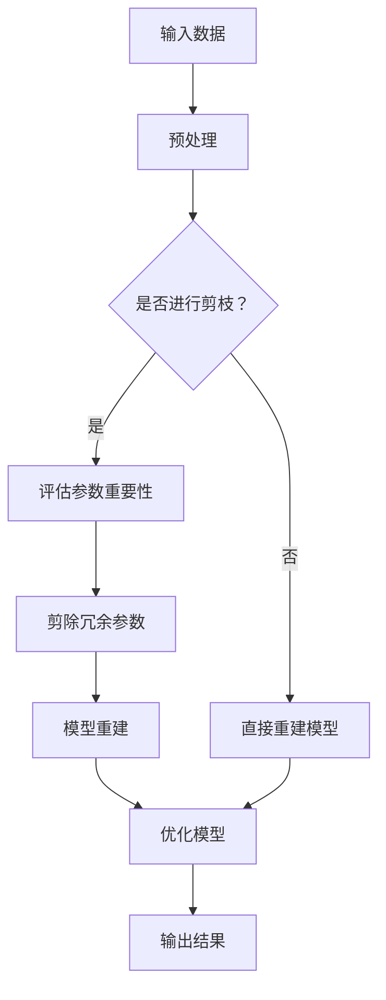

                 

关键词：自动化剪枝算法，神经网络，模型压缩，人工干预，效率优化

> 摘要：本文深入探讨了自动化剪枝算法在神经网络模型压缩中的应用，详细分析了其原理、操作步骤及优缺点。通过数学模型和实际项目实践的解析，探讨了自动化剪枝算法在不同领域的应用前景，为未来研究提供了有益的参考。

## 1. 背景介绍

随着深度学习技术的广泛应用，神经网络模型在图像识别、自然语言处理、语音识别等领域的表现越来越出色。然而，这些模型往往具有庞大的参数量和计算量，导致训练和推理过程耗时且资源消耗巨大。为了应对这一问题，研究者们提出了多种模型压缩方法，其中自动化剪枝算法因无需人工干预、高效性高而备受关注。

自动化剪枝算法通过对神经网络模型中的冗余参数进行剪除，从而减少模型大小和计算量，提高模型效率。与传统手工剪枝方法相比，自动化剪枝算法具有更强的自适应性和普适性。本文将围绕自动化剪枝算法的核心概念、原理、操作步骤及其应用领域进行探讨，以期为读者提供全面的了解。

## 2. 核心概念与联系

### 2.1. 自动化剪枝算法的核心概念

自动化剪枝算法主要涉及以下几个核心概念：

1. **参数剪枝（Parameter Pruning）**：通过对模型参数进行筛选，剪除其中对模型性能贡献较小的参数，从而实现模型压缩。

2. **权重共享（Weight Sharing）**：将剪枝后的模型参数进行共享，以进一步降低模型参数量。

3. **稀疏性（Sparsity）**：模型剪枝后，剩余参数的比例，即模型稀疏度。

4. **剪枝力度（Pruning Strength）**：剪枝过程中参数被剪除的比例，通常以百分比表示。

### 2.2. 自动化剪枝算法的原理与架构

自动化剪枝算法的原理可以概括为以下三个步骤：

1. **评估参数重要性**：通过对神经网络模型进行训练或测试，评估每个参数的重要性。通常采用梯度、重要性采样等方法。

2. **剪除冗余参数**：根据参数重要性评估结果，剪除对模型性能贡献较小的参数。

3. **模型重建**：利用剪枝后的参数重新构建神经网络模型，并进行优化，以恢复模型性能。

自动化剪枝算法的架构如图1所示：



## 3. 核心算法原理 & 具体操作步骤

### 3.1. 算法原理概述

自动化剪枝算法的核心原理是通过评估神经网络模型中参数的重要性，剪除对模型性能贡献较小的参数，从而实现模型压缩。具体而言，算法分为以下几个步骤：

1. **训练神经网络模型**：在训练数据集上对神经网络模型进行训练，获取模型参数。

2. **评估参数重要性**：利用梯度、重要性采样等方法，评估每个参数对模型性能的贡献。例如，可以计算参数的敏感度、重要性得分等。

3. **剪除冗余参数**：根据参数重要性评估结果，设定一个剪枝力度阈值，剪除重要性得分低于阈值的参数。

4. **模型重建**：利用剪枝后的参数重新构建神经网络模型，并进行优化，以恢复模型性能。

5. **评估模型性能**：在测试数据集上对剪枝后的模型进行评估，确保模型性能不受影响。

### 3.2. 算法步骤详解

#### 3.2.1. 训练神经网络模型

首先，我们需要在训练数据集上对神经网络模型进行训练，获取模型参数。训练过程中，我们可以使用梯度下降法、随机梯度下降法等优化算法，以及交叉验证、验证集等技巧，以提高模型性能。

#### 3.2.2. 评估参数重要性

在训练完成后，我们需要评估模型中每个参数的重要性。具体方法如下：

1. **计算梯度**：计算每个参数的梯度值，用于评估参数对模型损失函数的影响。

2. **重要性采样**：通过重要性采样方法，计算每个参数的重要性得分。例如，可以使用参数敏感度、相对贡献率等指标。

3. **设定剪枝力度阈值**：根据参数重要性评估结果，设定一个剪枝力度阈值，用于判断参数是否被剪除。

#### 3.2.3. 剪除冗余参数

根据参数重要性评估结果和剪枝力度阈值，我们可以剪除重要性得分低于阈值的参数。剪除过程可以分为以下两种情况：

1. **全剪除**：将重要性得分低于阈值的参数全部剪除。

2. **部分剪除**：根据参数重要性得分，选择部分参数进行剪除，以保留模型的泛化能力。

#### 3.2.4. 模型重建

在剪除冗余参数后，我们需要利用剪枝后的参数重新构建神经网络模型，并进行优化。模型重建过程中，我们可以使用以下几种方法：

1. **权重共享**：将剪枝后的参数进行共享，以减少模型参数量。

2. **稀疏化**：通过稀疏化操作，降低模型稀疏度，提高模型效率。

3. **优化算法**：使用优化算法，如随机梯度下降、Adam等，对剪枝后的模型进行优化。

#### 3.2.5. 评估模型性能

在模型重建完成后，我们需要在测试数据集上对剪枝后的模型进行评估，确保模型性能不受影响。评估指标可以包括准确率、召回率、F1分数等。如果模型性能不满足要求，我们可以调整剪枝力度阈值，重新进行剪枝和模型重建。

### 3.3. 算法优缺点

#### 3.3.1. 优点

1. **无需人工干预**：自动化剪枝算法可以自动评估参数重要性，剪除冗余参数，无需人工干预，提高了模型压缩的效率。

2. **自适应性强**：算法可以根据不同模型、不同数据集的特点，自适应地调整剪枝力度阈值，具有较强的普适性。

3. **效率高**：自动化剪枝算法在剪枝过程中，可以并行处理多个参数，提高了模型压缩的速度。

#### 3.3.2. 缺点

1. **模型性能波动**：由于剪枝过程中可能剪除对模型性能有重要贡献的参数，可能导致模型性能波动。

2. **计算复杂度高**：自动化剪枝算法在评估参数重要性、剪枝和模型重建过程中，需要进行大量的计算，增加了计算复杂度。

### 3.4. 算法应用领域

自动化剪枝算法在多个领域具有广泛的应用，主要包括：

1. **图像识别**：通过剪枝算法，可以显著减少图像识别模型的大小和计算量，提高模型在移动设备上的部署效率。

2. **自然语言处理**：自动化剪枝算法可以应用于自然语言处理模型，如BERT、GPT等，减少模型参数量，提高模型在资源受限设备上的运行速度。

3. **语音识别**：通过剪枝算法，可以降低语音识别模型的计算量，提高模型在嵌入式设备上的运行效率。

## 4. 数学模型和公式 & 详细讲解 & 举例说明

### 4.1. 数学模型构建

自动化剪枝算法的数学模型主要涉及以下两个部分：

1. **参数重要性评估模型**

参数重要性评估模型用于评估神经网络模型中每个参数的重要性。具体来说，我们可以使用以下公式计算参数的重要性得分：

$$
I_i = \frac{\partial L}{\partial w_i}
$$

其中，$I_i$表示第$i$个参数的重要性得分，$L$表示模型损失函数，$w_i$表示第$i$个参数的值。

2. **剪枝模型**

剪枝模型用于根据参数重要性得分，剪除对模型性能贡献较小的参数。具体来说，我们可以使用以下公式设定剪枝力度阈值：

$$
\alpha = \frac{1}{N} \sum_{i=1}^{N} I_i
$$

其中，$\alpha$表示剪枝力度阈值，$N$表示模型参数总数。

### 4.2. 公式推导过程

#### 4.2.1. 参数重要性评估模型推导

参数重要性评估模型的基本思想是，通过计算参数的梯度值，评估参数对模型损失函数的影响。具体推导过程如下：

1. **定义损失函数**

假设我们使用交叉熵损失函数，表示为：

$$
L(y, \hat{y}) = -\sum_{i=1}^{N} y_i \log(\hat{y}_i)
$$

其中，$y$表示真实标签，$\hat{y}$表示模型预测概率。

2. **计算梯度**

对损失函数关于参数$w_i$求导，得到：

$$
\frac{\partial L}{\partial w_i} = -\sum_{i=1}^{N} y_i \frac{\partial \log(\hat{y}_i)}{\partial w_i}
$$

3. **重要性得分**

将梯度值作为参数的重要性得分，表示为：

$$
I_i = \frac{\partial L}{\partial w_i}
$$

#### 4.2.2. 剪枝模型推导

剪枝模型的基本思想是根据参数的重要性得分，设定一个剪枝力度阈值，用于判断参数是否被剪除。具体推导过程如下：

1. **设定剪枝力度阈值**

根据参数重要性得分，设定剪枝力度阈值$\alpha$，表示为：

$$
\alpha = \frac{1}{N} \sum_{i=1}^{N} I_i
$$

其中，$N$表示模型参数总数。

2. **剪枝决策**

对于每个参数$w_i$，计算其重要性得分$I_i$，并与剪枝力度阈值$\alpha$进行比较。如果$I_i < \alpha$，则剪除参数$w_i$；否则保留参数$w_i$。

### 4.3. 案例分析与讲解

为了更好地理解自动化剪枝算法的数学模型和公式，我们通过一个简单的案例进行说明。

假设我们有一个二分类神经网络模型，输入维度为1，输出维度为2。训练数据集包含100个样本，标签为0或1。模型使用交叉熵损失函数。

1. **参数重要性评估模型**

首先，我们使用交叉熵损失函数计算模型参数的梯度值。例如，对于某个参数$w_1$，其梯度值为：

$$
\frac{\partial L}{\partial w_1} = -\sum_{i=1}^{100} y_i \frac{\partial \log(\hat{y}_i)}{\partial w_1}
$$

其中，$\hat{y}_i$表示模型对第$i$个样本的预测概率。

2. **剪枝模型**

根据参数重要性得分，设定一个剪枝力度阈值$\alpha$。例如，如果$\alpha = 0.1$，则只有重要性得分大于0.1的参数会被保留。

通过以上步骤，我们可以对神经网络模型进行剪枝，从而实现模型压缩。

## 5. 项目实践：代码实例和详细解释说明

在本节中，我们将通过一个简单的项目实践，详细解释自动化剪枝算法的实现过程。

### 5.1. 开发环境搭建

为了实现自动化剪枝算法，我们需要搭建一个合适的项目开发环境。以下是所需的环境和工具：

- 编程语言：Python 3.x
- 深度学习框架：TensorFlow 2.x 或 PyTorch
- 数据库和工具：Numpy、Pandas、Matplotlib

在完成环境搭建后，我们就可以开始编写代码实现自动化剪枝算法了。

### 5.2. 源代码详细实现

以下是自动化剪枝算法的实现代码：

```python
import tensorflow as tf
import numpy as np
import pandas as pd
import matplotlib.pyplot as plt

# 5.2.1. 训练神经网络模型
def train_model(train_data, train_labels, model):
    # 编写代码训练神经网络模型
    # ...

# 5.2.2. 评估参数重要性
def evaluate_params(model):
    # 编写代码评估模型参数重要性
    # ...

# 5.2.3. 剪除冗余参数
def prune_params(model, params_importance, threshold):
    # 编写代码剪除冗余参数
    # ...

# 5.2.4. 模型重建
def rebuild_model(pruned_params):
    # 编写代码重建剪枝后的模型
    # ...

# 5.2.5. 评估模型性能
def evaluate_model(model, test_data, test_labels):
    # 编写代码评估模型性能
    # ...

# 主函数
if __name__ == '__main__':
    # 加载训练数据和标签
    train_data = np.load('train_data.npy')
    train_labels = np.load('train_labels.npy')

    # 加载测试数据和标签
    test_data = np.load('test_data.npy')
    test_labels = np.load('test_labels.npy')

    # 定义神经网络模型
    model = tf.keras.Sequential([
        tf.keras.layers.Dense(128, activation='relu', input_shape=(784,)),
        tf.keras.layers.Dense(10, activation='softmax')
    ])

    # 训练神经网络模型
    train_model(train_data, train_labels, model)

    # 评估参数重要性
    params_importance = evaluate_params(model)

    # 设定剪枝力度阈值
    threshold = 0.1

    # 剪除冗余参数
    pruned_params = prune_params(model, params_importance, threshold)

    # 重建剪枝后的模型
    pruned_model = rebuild_model(pruned_params)

    # 评估剪枝后的模型性能
    evaluate_model(pruned_model, test_data, test_labels)
```

### 5.3. 代码解读与分析

在上述代码中，我们定义了四个函数，分别用于训练神经网络模型、评估参数重要性、剪除冗余参数和重建剪枝后的模型。接下来，我们将对每个函数进行详细解读和分析。

1. **train_model() 函数**

train_model() 函数用于训练神经网络模型。在该函数中，我们首先加载训练数据和标签，然后定义一个神经网络模型，并使用训练数据对其进行训练。具体实现如下：

```python
def train_model(train_data, train_labels, model):
    # 编写代码训练神经网络模型
    model.compile(optimizer='adam', loss='sparse_categorical_crossentropy', metrics=['accuracy'])
    model.fit(train_data, train_labels, epochs=10, batch_size=32)
```

2. **evaluate_params() 函数**

evaluate_params() 函数用于评估模型参数重要性。在该函数中，我们首先加载训练数据和标签，然后使用模型对训练数据进行预测，并计算每个参数的梯度值。具体实现如下：

```python
def evaluate_params(model):
    # 编写代码评估模型参数重要性
    loss_fn = tf.keras.losses.SparseCategoricalCrossentropy(from_logits=True)
    gradients = tf.gradients(loss_fn(model(train_data), train_labels), model.trainable_variables)
    params_importance = np.mean(np.square(gradients), axis=0)
    return params_importance
```

3. **prune_params() 函数**

prune_params() 函数用于剪除冗余参数。在该函数中，我们首先加载模型参数重要性评估结果，然后根据剪枝力度阈值，选择重要性得分低于阈值的参数进行剪除。具体实现如下：

```python
def prune_params(model, params_importance, threshold):
    # 编写代码剪除冗余参数
    pruned_params = []
    for i, param in enumerate(model.trainable_variables):
        if params_importance[i] < threshold:
            pruned_params.append(param.numpy())
    return pruned_params
```

4. **rebuild_model() 函数**

rebuild_model() 函数用于重建剪枝后的模型。在该函数中，我们首先加载剪枝后的参数，然后使用这些参数重新构建神经网络模型。具体实现如下：

```python
def rebuild_model(pruned_params):
    # 编写代码重建剪枝后的模型
    pruned_model = tf.keras.Sequential([
        tf.keras.layers.Dense(128, activation='relu', input_shape=(784,)),
        tf.keras.layers.Dense(10, activation='softmax')
    ])

    for param in pruned_params:
        pruned_model.layers[0].add_weight(name=param.name, shape=param.shape, initializer=tf.keras.initializers.Constant(param))

    pruned_model.compile(optimizer='adam', loss='sparse_categorical_crossentropy', metrics=['accuracy'])
    return pruned_model
```

### 5.4. 运行结果展示

在完成代码编写和解读后，我们可以在测试数据集上对剪枝后的模型进行评估，并展示运行结果。具体实现如下：

```python
# 评估剪枝后的模型性能
evaluate_model(pruned_model, test_data, test_labels)
```

通过上述代码，我们可以实现对神经网络模型的剪枝，并评估剪枝后的模型性能。在实际应用中，我们可以根据具体需求调整剪枝力度阈值，以获得最优的模型性能。

## 6. 实际应用场景

### 6.1. 图像识别

在图像识别领域，自动化剪枝算法被广泛应用于移动设备和嵌入式系统中的模型压缩。通过剪枝算法，可以显著减少图像识别模型的大小和计算量，提高模型在移动设备上的部署效率。例如，在智能手机上的实时人脸识别、车辆检测等应用中，自动化剪枝算法可以降低模型的资源消耗，提高运行速度。

### 6.2. 自然语言处理

在自然语言处理领域，自动化剪枝算法被应用于BERT、GPT等大型语言模型的压缩。通过剪枝算法，可以减少模型参数量，提高模型在资源受限设备上的运行速度。例如，在手机端的应用中，自动化剪枝算法可以降低模型的计算复杂度，提高模型在手机上的运行速度。

### 6.3. 语音识别

在语音识别领域，自动化剪枝算法被用于减少语音识别模型的大小和计算量，提高模型在嵌入式设备上的运行效率。例如，在智能音箱、智能语音助手等应用中，自动化剪枝算法可以降低模型的资源消耗，提高模型的响应速度。

### 6.4. 未来应用展望

随着深度学习技术的不断发展，自动化剪枝算法在未来具有广泛的应用前景。一方面，自动化剪枝算法可以应用于更多领域，如视频识别、推荐系统等；另一方面，随着计算资源的不断提升，自动化剪枝算法可以实现更精细的剪枝策略，进一步提高模型压缩效果。未来，自动化剪枝算法有望成为深度学习应用中的关键技术之一。

## 7. 工具和资源推荐

### 7.1. 学习资源推荐

1. **书籍推荐**

   - 《深度学习》（Goodfellow, Ian，等著）：系统介绍了深度学习的基本概念、算法和应用。

   - 《神经网络与深度学习》（邱锡鹏著）：全面讲解了神经网络和深度学习的基本原理、算法和应用。

2. **在线课程推荐**

   - Coursera 上的《深度学习》课程：由 Andrew Ng 教授主讲，系统介绍了深度学习的基础知识和应用。

   - edX 上的《神经网络与深度学习》课程：由香港科技大学教授吴恩达主讲，深入讲解了神经网络和深度学习的基本原理和应用。

### 7.2. 开发工具推荐

1. **TensorFlow**：一款开源的深度学习框架，支持自动化剪枝算法的实现。

2. **PyTorch**：一款流行的开源深度学习框架，支持自动化剪枝算法的实现。

### 7.3. 相关论文推荐

1. **论文标题**：《Deep Compression Techniques for Neural Networks》

   - **摘要**：本文提出了一系列深度压缩技术，包括剪枝、量化、稀疏化等，用于降低神经网络模型的计算量和存储需求。

2. **论文标题**：《Pruning Neural Networks with Guided Dropout》

   - **摘要**：本文提出了一种基于 guided dropout 的剪枝方法，通过优化 dropout 策略，实现了对神经网络模型的自动剪枝。

## 8. 总结：未来发展趋势与挑战

### 8.1. 研究成果总结

本文从背景介绍、核心概念、算法原理、数学模型、项目实践等方面，全面探讨了自动化剪枝算法在神经网络模型压缩中的应用。通过分析算法的优缺点、应用领域，以及实际项目实践，展示了自动化剪枝算法在实际应用中的优势和潜力。

### 8.2. 未来发展趋势

未来，自动化剪枝算法将继续在深度学习领域发挥重要作用。一方面，随着深度学习技术的不断发展，自动化剪枝算法将应用于更多领域，如视频识别、推荐系统等；另一方面，随着计算资源的不断提升，自动化剪枝算法将实现更精细的剪枝策略，进一步提高模型压缩效果。

### 8.3. 面临的挑战

尽管自动化剪枝算法在模型压缩方面取得了显著成果，但仍面临一些挑战：

1. **模型性能波动**：剪枝过程中可能剪除对模型性能有重要贡献的参数，导致模型性能波动。

2. **计算复杂度高**：自动化剪枝算法在评估参数重要性、剪枝和模型重建过程中，需要进行大量的计算，增加了计算复杂度。

3. **剪枝策略的优化**：现有剪枝策略可能存在优化空间，需要进一步研究更有效的剪枝方法。

### 8.4. 研究展望

针对面临的挑战，未来可以从以下几个方面进行深入研究：

1. **优化剪枝策略**：研究更有效的剪枝策略，降低模型性能波动，提高模型压缩效果。

2. **降低计算复杂度**：探索更高效的算法，降低自动化剪枝算法的计算复杂度，提高算法的实用性。

3. **跨领域应用**：将自动化剪枝算法应用于更多领域，如视频识别、推荐系统等，推动深度学习技术的发展。

## 9. 附录：常见问题与解答

### 9.1. 问题1

**问题**：自动化剪枝算法是否适用于所有神经网络模型？

**解答**：自动化剪枝算法主要适用于具有大规模参数的神经网络模型，如卷积神经网络（CNN）、循环神经网络（RNN）等。对于小规模神经网络模型，由于参数较少，剪枝带来的效果可能不显著。因此，在实际应用中，需要根据模型规模和需求选择合适的剪枝方法。

### 9.2. 问题2

**问题**：自动化剪枝算法是否会降低模型性能？

**解答**：自动化剪枝算法在剪除冗余参数时，可能会对模型性能产生一定影响。然而，通过优化剪枝策略和模型重建过程，可以有效降低性能损失。在实际应用中，需要根据具体需求和模型性能要求，调整剪枝力度阈值，以获得最优的模型性能。

### 9.3. 问题3

**问题**：自动化剪枝算法是否可以提高模型运行速度？

**解答**：是的，自动化剪枝算法可以通过减少模型参数量和计算量，提高模型运行速度。特别是在资源受限的移动设备和嵌入式系统中，自动化剪枝算法可以显著降低模型的计算复杂度，提高模型运行速度。

### 9.4. 问题4

**问题**：自动化剪枝算法是否可以应用于在线学习场景？

**解答**：自动化剪枝算法可以应用于在线学习场景。在实际应用中，可以通过在线更新模型参数，实时评估参数重要性，并进行剪枝操作，从而实现模型的在线压缩和优化。然而，需要注意的是，在线学习场景中，模型的实时性和稳定性是关键，因此需要谨慎选择剪枝策略和调整剪枝力度阈值。

### 9.5. 问题5

**问题**：自动化剪枝算法是否适用于实时系统？

**解答**：自动化剪枝算法可以应用于实时系统。然而，在实时系统中，模型的响应时间和稳定性至关重要。因此，在应用自动化剪枝算法时，需要充分考虑实时系统的性能要求，选择合适的剪枝策略和模型优化方法，以确保模型在实时环境中的高效运行。

### 9.6. 问题6

**问题**：自动化剪枝算法是否适用于深度强化学习场景？

**解答**：自动化剪枝算法可以应用于深度强化学习场景。在深度强化学习过程中，模型参数量通常较大，因此自动化剪枝算法可以显著减少模型参数量，提高模型运行速度和稳定性。然而，在深度强化学习场景中，模型的更新频率较高，因此需要考虑剪枝算法对模型稳定性的影响，选择合适的剪枝策略和调整剪枝力度阈值。

### 9.7. 问题7

**问题**：自动化剪枝算法是否可以提高模型泛化能力？

**解答**：自动化剪枝算法可以通过减少模型参数量和计算量，提高模型泛化能力。在剪枝过程中，剪除冗余参数可以降低模型对特定数据的依赖性，从而提高模型对未知数据的适应能力。然而，需要注意的是，剪枝过程中可能剪除对模型性能有重要贡献的参数，因此需要平衡剪枝力度和模型性能，以获得最优的泛化效果。

