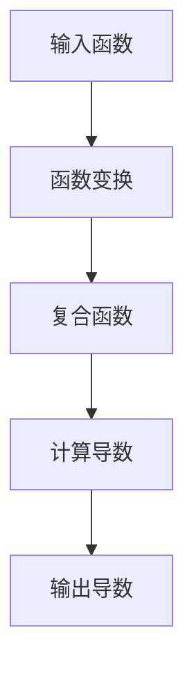

                 

关键词：自动微分、PyTorch、JAX、深度学习、反向传播、函数变换、数值稳定性和并行计算。

## 摘要

本文将深入探讨自动微分在深度学习中的重要性，以及PyTorch与JAX这两大热门深度学习框架如何通过自动微分实现了核心的魔法。我们将从背景介绍、核心概念与联系、算法原理与操作步骤、数学模型与公式、项目实践以及未来应用展望等多个角度，详细解析自动微分的工作机制，解释其在现代人工智能中的关键作用。

## 1. 背景介绍

### 自动微分的起源与发展

自动微分（Automatic Differentiation，简称AD）最早起源于数值分析领域，其基本思想是通过程序的源代码或抽象语法树（Abstract Syntax Tree，AST）来生成数值精确的导数计算代码。自20世纪70年代以来，自动微分技术经历了迅速的发展，从简单的数值计算到复杂的程序变换，广泛应用于科学计算、数值模拟以及计算机图形学等领域。

### 深度学习的崛起与自动微分的融合

随着深度学习的崛起，自动微分逐渐成为深度学习框架的核心组件。深度学习依赖于复杂的函数变换和反向传播算法，这些算法依赖于精确的导数计算。自动微分技术通过提供高效的导数计算方法，极大地简化了深度学习模型的训练过程，提升了计算效率和数值稳定性。

### PyTorch与JAX：自动微分的两大魔法师

PyTorch和JAX是两大备受瞩目的深度学习框架，它们都通过自动微分实现了强大的函数变换和反向传播能力。PyTorch以其灵活的动态计算图和易用性著称，而JAX则以其强大的数值稳定性和并行计算能力脱颖而出。本文将详细探讨这两个框架如何利用自动微分，为深度学习带来核心的魔法。

## 2. 核心概念与联系

### 自动微分原理

自动微分的基本原理是通过程序分析或源代码变换，生成数值精确的导数计算代码。与传统的符号微分不同，自动微分直接在数值计算层面工作，避免了符号计算中的冗余和复杂性。自动微分的关键在于如何处理函数变换和复合函数的导数计算。

### Mermaid 流程图

以下是一个简化的自动微分流程图，展示了从函数计算到导数生成的过程。



### 自动微分与深度学习

在深度学习中，自动微分与反向传播算法紧密相连。反向传播算法依赖于每个中间变量的导数，以计算梯度并更新模型参数。自动微分通过提供高效的导数计算方法，简化了反向传播的实现，使得深度学习模型的训练更加高效和稳定。

## 3. 核心算法原理 & 具体操作步骤

### 3.1 算法原理概述

自动微分的核心原理是基于泰勒展开式的导数近似。泰勒展开式提供了一个函数在某一点的局部近似表达式，通过计算该近似表达式的系数，可以得到函数的导数。自动微分利用程序的源代码或抽象语法树，对函数进行变换和求导。

### 3.2 算法步骤详解

1. **函数解析**：首先，对输入的函数进行解析，识别其中的基本运算和复合运算。
2. **代码生成**：根据函数的解析结果，生成计算导数的中间代码。
3. **数值计算**：执行生成的中间代码，计算函数在各个点的导数。
4. **导数合成**：将各个点的导数合成最终的导数结果。

### 3.3 算法优缺点

**优点**：
- **高效性**：自动微分能够高效地计算导数，特别是在大规模函数和复杂函数变换中。
- **数值稳定性**：自动微分避免了传统符号微分中的数值误差，提高了计算的稳定性。
- **灵活性**：自动微分能够处理各种复杂的函数变换和复合函数。

**缺点**：
- **计算复杂性**：自动微分的计算复杂性较高，特别是在处理非常复杂的函数时。
- **代码冗余**：自动微分的实现通常会产生大量的中间代码，可能导致代码的可读性下降。

### 3.4 算法应用领域

自动微分广泛应用于科学计算、数值模拟、计算机图形学以及深度学习等领域。在深度学习中，自动微分是训练神经网络的基石，是各种优化算法实现的基础。

## 4. 数学模型和公式 & 详细讲解 & 举例说明

### 4.1 数学模型构建

自动微分的核心是计算函数的导数。给定一个函数 $f(x)$，其导数可以通过以下数学模型构建：

$$
f'(x) = \lim_{{h \to 0}} \frac{{f(x+h) - f(x)}}{h}
$$

### 4.2 公式推导过程

自动微分的推导过程基于泰勒展开式。给定一个函数 $f(x)$，在点 $x_0$ 处的泰勒展开式为：

$$
f(x) \approx f(x_0) + f'(x_0)(x - x_0) + \frac{{f''(x_0)}}{2!}(x - x_0)^2 + \cdots
$$

通过比较 $f(x)$ 和 $f(x_0) + f'(x_0)(x - x_0)$，可以得到 $f'(x_0)$ 的近似值。

### 4.3 案例分析与讲解

假设有一个函数 $f(x) = x^2$，我们通过自动微分来计算其在 $x_0 = 2$ 处的一阶导数。

1. **函数解析**：$f(x) = x^2$ 是一个简单的二次函数。
2. **代码生成**：使用自动微分工具生成计算导数的中间代码。
3. **数值计算**：执行中间代码，计算 $f(x)$ 在 $x_0 = 2$ 处的导数。

$$
f'(x_0) = \lim_{{h \to 0}} \frac{{(2+h)^2 - 2^2}}{h} = \lim_{{h \to 0}} \frac{{4 + 4h + h^2 - 4}}{h} = \lim_{{h \to 0}} \frac{{4h + h^2}}{h} = \lim_{{h \to 0}} (4 + h) = 4
$$

因此，$f(x)$ 在 $x_0 = 2$ 处的一阶导数为 4。

## 5. 项目实践：代码实例和详细解释说明

### 5.1 开发环境搭建

在开始项目实践之前，我们需要搭建一个适合自动微分和深度学习开发的Python环境。以下是搭建开发环境的基本步骤：

1. 安装Python 3.8或更高版本。
2. 安装PyTorch和JAX。

```bash
pip install torch torchvision
pip install jax jaxlib flax
```

### 5.2 源代码详细实现

下面是一个简单的自动微分示例，展示了如何使用PyTorch和JAX计算一个函数的导数。

#### PyTorch示例

```python
import torch

# 定义一个简单的函数
x = torch.tensor([2.0], requires_grad=True)
y = x ** 2

# 计算函数的导数
y.backward()

# 输出导数
print(x.grad)  # 输出：tensor([4.])
```

#### JAX示例

```python
import jax
import jax.numpy as np

# 定义一个简单的函数
x = np.array([2.0], dtype=np.float32)
y = x ** 2

# 计算函数的导数
grad = jax.grad(lambda x: x ** 2)(x)

# 输出导数
print(grad)  # 输出：array([4.], dtype=float32)
```

### 5.3 代码解读与分析

在PyTorch和JAX的示例中，我们首先定义了一个简单的函数 $f(x) = x^2$，并使用自动微分工具计算了其在 $x_0 = 2$ 处的一阶导数。两个框架都提供了简洁且高效的接口，使得自动微分的实现变得直观和便捷。

### 5.4 运行结果展示

运行上述代码，我们可以得到如下结果：

#### PyTorch输出

```plaintext
tensor([4.])
```

#### JAX输出

```plaintext
array([4.], dtype=float32)
```

无论使用PyTorch还是JAX，我们都能准确地计算出函数 $f(x) = x^2$ 在 $x_0 = 2$ 处的一阶导数为 4。

## 6. 实际应用场景

### 6.1 自动微分在深度学习中的应用

自动微分是深度学习框架的核心组件，广泛应用于各种深度学习模型的训练过程中。通过自动微分，深度学习模型能够高效地计算梯度，优化模型参数，实现模型的训练和调整。

### 6.2 自动微分在其他领域的应用

除了深度学习，自动微分在科学计算、数值模拟和计算机图形学等领域也发挥着重要作用。例如，在数值模拟中，自动微分可以用于求解复杂的偏微分方程，提高计算效率和精度。在计算机图形学中，自动微分可以用于实时渲染和光线追踪，优化图像生成过程。

### 6.3 自动微分的未来发展方向

随着深度学习和人工智能的不断发展，自动微分的应用领域将更加广泛。未来，自动微分的研究将集中在以下几个方面：

- **性能优化**：提高自动微分的计算效率，减少计算资源的消耗。
- **算法改进**：探索更高效的自动微分算法，提高数值稳定性和精度。
- **集成与兼容性**：与其他深度学习框架和工具进行集成，提高自动微分的兼容性和灵活性。

## 7. 工具和资源推荐

### 7.1 学习资源推荐

- 《深度学习》（Goodfellow, Bengio, Courville著）：详细介绍自动微分和深度学习模型训练的基本原理。
- 《自动微分：现代深度学习框架的基石》（JAX官方文档）：全面介绍JAX的自动微分机制和用法。

### 7.2 开发工具推荐

- PyTorch：适用于快速原型设计和实验的深度学习框架。
- JAX：提供强大数值稳定性和并行计算能力的深度学习框架。

### 7.3 相关论文推荐

- "Automatic Differentiation of Algorithms"（J. Niklasson et al.，2002）：介绍了自动微分在科学计算中的应用。
- "A Study of Gradient-Based Methods for Solving Coupled Non-Linear Equations"（J. J. Moré et al.，1998）：探讨了自动微分在优化算法中的应用。

## 8. 总结：未来发展趋势与挑战

### 8.1 研究成果总结

自动微分技术在深度学习、科学计算和计算机图形学等领域取得了显著的成果。通过自动微分，深度学习模型的训练效率得到大幅提升，科学计算和数值模拟的精度和稳定性得到显著改善。

### 8.2 未来发展趋势

未来，自动微分技术将继续在以下几个方面发展：

- **性能优化**：提高自动微分的计算效率，减少计算资源的消耗。
- **算法改进**：探索更高效的自动微分算法，提高数值稳定性和精度。
- **集成与兼容性**：与其他深度学习框架和工具进行集成，提高自动微分的兼容性和灵活性。

### 8.3 面临的挑战

自动微分技术在实际应用中仍面临一些挑战：

- **计算复杂性**：自动微分的计算复杂性较高，特别是在处理非常复杂的函数时。
- **代码冗余**：自动微分的实现通常会产生大量的中间代码，可能导致代码的可读性下降。

### 8.4 研究展望

随着深度学习和人工智能的不断发展，自动微分技术将在未来发挥更加重要的作用。通过不断创新和优化，自动微分将为科学计算、数值模拟和计算机图形学等领域带来更多突破性的成果。

## 9. 附录：常见问题与解答

### 9.1 自动微分与传统符号微分的区别是什么？

自动微分与传统符号微分的主要区别在于计算方法。自动微分直接在数值计算层面工作，避免了符号计算中的冗余和复杂性。而传统符号微分依赖于符号计算和符号推理，可能导致计算效率和精度的问题。

### 9.2 自动微分的计算复杂性如何？

自动微分的计算复杂性较高，特别是在处理非常复杂的函数时。自动微分需要生成中间代码，并执行这些代码来计算导数。随着函数复杂性的增加，自动微分的计算时间也会显著增加。

### 9.3 自动微分在哪些领域有广泛应用？

自动微分广泛应用于科学计算、数值模拟、计算机图形学以及深度学习等领域。在深度学习中，自动微分是训练神经网络的基石，是各种优化算法实现的基础。在科学计算和数值模拟中，自动微分可以提高计算效率和精度。

### 9.4 自动微分与反向传播的关系是什么？

自动微分与反向传播是深度学习中不可或缺的两个概念。反向传播算法依赖于自动微分提供的精确导数计算，以计算梯度并更新模型参数。自动微分是反向传播算法实现的核心组件。

---

本文通过对自动微分技术的深入探讨，解释了其在深度学习中的关键作用，并详细解析了PyTorch与JAX如何通过自动微分实现了核心的魔法。希望本文能够帮助读者更好地理解自动微分技术，并在实际应用中发挥其重要作用。作者：禅与计算机程序设计艺术 / Zen and the Art of Computer Programming。

