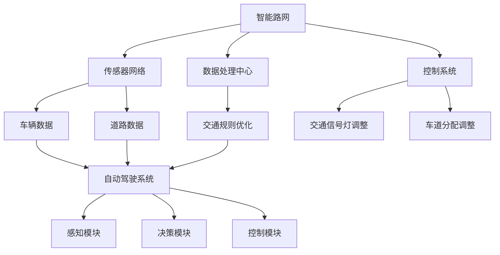
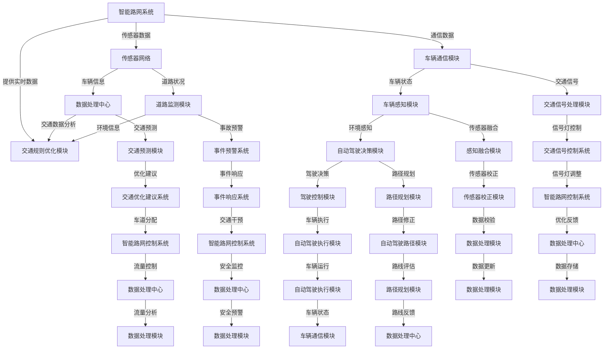

                 

关键词：自动驾驶，智能路网，交通规则优化，人工智能，算法，数学模型，实际应用

## 摘要

随着自动驾驶技术的不断发展，智能路网与交通规则的优化成为提升道路安全性和效率的关键因素。本文将深入探讨自动驾驶系统中的智能路网概念及其与交通规则优化之间的相互作用。文章首先介绍了智能路网的基本架构和功能，然后详细解析了交通规则优化的核心算法原理、数学模型及其在实际应用中的操作步骤。通过实际项目实例，本文展示了如何通过智能路网与交通规则优化提升自动驾驶系统的性能和可靠性。文章最后对未来的应用前景和面临的挑战进行了展望。

## 1. 背景介绍

自动驾驶技术作为人工智能的一个重要应用领域，近年来取得了显著的发展。自动驾驶系统的核心目标是在无需人工干预的情况下，使车辆能够在复杂的交通环境中安全、高效地行驶。然而，实现这一目标不仅需要先进的传感器、控制算法和强大的计算能力，还需要一个智能化的路网系统和完善的交通规则。

智能路网是指通过物联网、大数据、云计算和人工智能等技术，实现道路基础设施的信息化和智能化。它不仅包括传统的交通信号灯、道路标识等硬件设施，还涵盖了车辆间的通信、道路环境的感知、交通数据的处理和分析等多个层面。智能路网的建立，使得道路信息能够实时传输、处理和反馈，从而为自动驾驶车辆提供精准、实时的交通环境数据。

交通规则的优化则是为了提高交通流效率和安全性。传统的交通规则往往基于固定的模型和假设，难以应对复杂多变的交通状况。而智能路网的出现，使得交通规则可以根据实时交通数据动态调整，从而更加精准地指导车辆行驶，减少拥堵，提高道路利用率。

随着自动驾驶技术的普及，智能路网与交通规则优化的结合将极大地改变我们的出行方式。通过本文，我们将深入了解这一领域的最新研究进展和应用实例，探讨其在未来出行中的潜在影响。

### 1.1 自动驾驶技术的发展现状

自动驾驶技术自上世纪末以来，经历了从概念验证到实验室测试，再到实际道路试验和商业应用的逐步演进。当前，自动驾驶技术主要分为五个等级，从L0（无自动化）到L5（完全自动化）。

- L0等级的自动驾驶仅包含基础的辅助功能，如定速巡航和车道保持；
- L1等级的自动驾驶则增加了部分自动化功能，如自动刹车和车道保持；
- L2等级的自动驾驶可以实现同时控制加速、制动和转向，但需要驾驶员保持警惕；
- L3等级的自动驾驶可以完全接管驾驶，但驾驶员在特定条件下需要准备接管；
- L4等级的自动驾驶在特定环境下能够实现完全自动驾驶，无需人类干预；
- L5等级的自动驾驶则能在所有环境和条件下实现完全自动驾驶。

目前，大多数自动驾驶技术仍处于L2和L3等级，实际应用主要集中在高级辅助驾驶系统（ADAS）和部分自动驾驶车辆的有限场景测试中。特斯拉的Autopilot系统和 Waymo的自动驾驶出租车服务是这一领域的典型代表。

### 1.2 智能路网的概念与架构

智能路网是通过先进技术实现道路基础设施的信息化和智能化，其核心目标是通过实时交通数据的处理和分析，优化交通流和提升道路安全性。智能路网的架构包括多个关键组成部分：

1. **传感器网络**：包括路侧传感器、车载传感器等，用于实时采集交通流量、车辆速度、道路状况等信息。
2. **通信系统**：利用V2X（Vehicle-to-Everything）技术，实现车辆与车辆、车辆与基础设施之间的信息交互。
3. **数据处理中心**：用于处理传感器采集到的数据，通过大数据分析和人工智能算法，生成交通预测和优化建议。
4. **控制系统**：根据数据处理结果，实时调整交通信号灯、诱导屏等设施，优化交通流。

### 1.3 交通规则优化的必要性

传统的交通规则往往基于固定的模型和假设，难以应对复杂多变的交通状况。例如，交通信号灯的时长和切换策略通常是固定的，无法根据实际交通流量和突发事件进行动态调整。这种规则可能导致交通拥堵、事故频发等问题。

智能路网的引入，使得交通规则优化成为可能。通过实时交通数据，智能系统可以动态调整交通信号灯时长、优化车道分配策略、调整交通流向等，从而提高交通效率和安全性。此外，智能交通规则还可以预防交通事故、减少环境污染，为自动驾驶车辆的普及提供坚实基础。

### 1.4 智能路网与自动驾驶的相互作用

智能路网与自动驾驶系统之间存在着紧密的相互作用。智能路网通过实时交通数据和通信系统，为自动驾驶车辆提供精确的道路信息和环境感知数据，帮助车辆做出更加智能的决策。而自动驾驶车辆的反馈数据，如行驶速度、路线选择等，又可以进一步优化智能路网的控制策略。

这种相互作用不仅提高了道路的通行效率和安全性，还为自动驾驶技术提供了更加可靠的测试环境。通过不断优化智能路网和自动驾驶系统，我们可以逐步实现更加智能、高效的出行方式。

## 2. 核心概念与联系

在深入探讨自动驾驶中的智能路网与交通规则优化之前，首先需要明确一些核心概念及其相互关系。以下将详细解释智能路网、交通规则优化以及它们在自动驾驶系统中的重要性，并通过Mermaid流程图展示这些概念和架构的互动关系。

### 2.1 智能路网

智能路网（Smart Road Network）是一个由传感器、通信系统、数据处理中心、控制系统等组成的集成系统。其主要功能是实时监控道路状况、车辆位置和交通流量，并通过数据处理和分析，提供交通优化建议。

- **传感器网络**：包括路侧传感器（如交通流量传感器、气象传感器、摄像头等）和车载传感器（如雷达、激光雷达、GPS等），用于采集道路和车辆的信息。
- **通信系统**：通过V2X（Vehicle-to-Everything）技术，实现车辆与车辆、车辆与基础设施之间的信息交换，如DSRC（Dedicated Short-Range Communications）、C-V2X（Cellular Vehicle-to-Everything）等。
- **数据处理中心**：利用大数据分析和人工智能算法，对传感器数据进行处理和分析，生成交通流量预测、事件预警等。
- **控制系统**：根据数据处理结果，对交通信号灯、诱导屏等设施进行实时调整，优化交通流。

### 2.2 交通规则优化

交通规则优化（Traffic Rule Optimization）旨在通过实时数据分析和动态调整，提高交通流效率和安全性。传统的交通规则通常是静态的，而智能路网使得交通规则能够根据实时交通状况进行动态调整。

- **交通信号灯优化**：通过实时数据，动态调整信号灯时长和切换策略，减少交通拥堵。
- **车道分配优化**：根据交通流量和突发事件，实时调整车道使用策略，优化交通流。
- **事件预警**：通过传感器和数据分析，提前预警交通事故、道路施工等事件，调整交通流。

### 2.3 自动驾驶系统

自动驾驶系统（Autonomous Driving System）是一种无需人类干预，能够自主完成驾驶任务的系统。自动驾驶系统依赖于智能路网提供的实时交通数据和环境信息，进行道路感知、决策和控制。

- **感知模块**：利用传感器（如雷达、激光雷达、摄像头等）实时感知道路和交通状况。
- **决策模块**：根据感知到的数据，通过算法生成驾驶决策，如速度控制、路线选择、避让等。
- **控制模块**：执行决策，控制车辆运动，如油门、刹车、转向等。

### 2.4 智能路网与交通规则优化的互动关系

智能路网与交通规则优化之间存在着紧密的互动关系。智能路网提供实时交通数据和交通状况，为交通规则优化提供数据支持。而交通规则优化通过动态调整交通信号灯、车道分配等，提高道路通行效率和安全性，反过来为智能路网提供更好的数据基础。

以下是一个简化的Mermaid流程图，展示了智能路网、交通规则优化和自动驾驶系统之间的互动关系：



### 2.5 智能路网与交通规则优化的重要性

智能路网与交通规则优化的结合对于自动驾驶系统至关重要。智能路网提供了实时、准确的道路信息，使得自动驾驶系统能够更安全、更高效地进行驾驶决策。而交通规则优化则通过动态调整，提升了整个交通系统的效率和安全性，为自动驾驶车辆提供了更好的运行环境。

总之，智能路网与交通规则优化是自动驾驶技术的两个关键组成部分，它们相互促进、相互依赖，共同推动自动驾驶技术的进步和实际应用。通过深入理解这些核心概念及其互动关系，我们可以更好地把握自动驾驶技术的发展趋势和应用前景。

### 2.6 Mermaid流程图展示

下面是一个详细的Mermaid流程图，展示智能路网与交通规则优化以及自动驾驶系统的架构和互动关系。请注意，Mermaid流程图中的节点名称不应包含括号、逗号等特殊字符，以确保正确的渲染。



这个流程图展示了智能路网、交通规则优化模块和自动驾驶系统的各个部分如何相互协作，共同实现高效的交通管理和自动驾驶控制。通过这样的架构设计，可以确保自动驾驶车辆在复杂交通环境中的安全性和稳定性。

### 2.7 智能路网系统与交通规则优化系统的核心架构

为了更好地理解智能路网系统与交通规则优化系统的核心架构，我们分别详细介绍这两部分的关键组件和功能。

#### 智能路网系统

**传感器网络**：传感器网络是智能路网系统的核心组成部分，它包括各种类型的传感器，如摄像头、雷达、激光雷达、气象传感器、流量监测器等。这些传感器分布在道路上的不同位置，实时采集道路状况、车辆速度、交通流量、气象信息等数据。

**车辆通信模块**：车辆通信模块通过V2X技术实现车辆与车辆、车辆与基础设施之间的通信。这种通信方式可以传递车辆的行驶状态、位置信息、交通信号等信息，为自动驾驶车辆提供额外的感知数据。

**数据处理中心**：数据处理中心是智能路网系统的“大脑”，它负责接收和处理传感器网络和车辆通信模块传来的数据。通过大数据分析和人工智能算法，数据处理中心可以生成交通流量预测、事故预警、路况评估等结果。

**智能路网控制系统**：智能路网控制系统根据数据处理中心提供的优化建议，实时调整交通信号灯、车道指示灯、诱导屏等设施，优化交通流，提高道路通行效率和安全性。

#### 交通规则优化系统

**交通规则优化模块**：交通规则优化模块是交通规则优化系统的核心。它利用实时交通数据，动态调整交通信号灯时长、车道分配策略、事件预警等，以应对交通流变化和突发事件。

**交通信号处理模块**：交通信号处理模块负责接收和处理来自智能路网系统的交通信号数据，生成信号灯切换策略，并将其传输给交通信号控制系统。

**交通预测模块**：交通预测模块通过历史数据和实时交通数据，预测未来一段时间内的交通流量变化，为交通规则优化提供数据支持。

**事件预警系统**：事件预警系统实时监测道路状况，一旦发现交通事故、道路施工等突发事件，立即触发预警机制，通知相关方进行应急处理。

**自动驾驶决策模块**：自动驾驶决策模块根据智能路网提供的道路数据和交通信号，生成自动驾驶车辆的行驶决策，包括速度控制、路径规划、避让等。

#### 关键组件和功能关系

在智能路网系统与交通规则优化系统之间，数据处理中心和交通规则优化模块起到了桥梁作用。数据处理中心生成的交通预测和优化建议，会直接传递给交通规则优化模块，以便动态调整交通信号和车道分配策略。同时，交通规则优化模块也可以将交通状况反馈给数据处理中心，帮助其不断优化预测模型。

车辆通信模块和自动驾驶决策模块则通过V2X技术，实现与智能路网系统的实时数据交换，为自动驾驶车辆提供更加准确和实时的道路信息，从而提高自动驾驶系统的性能和安全性。

通过这样的架构设计，智能路网系统和交通规则优化系统相互协作，共同提升道路通行效率和安全性，为自动驾驶技术的广泛应用提供有力支持。

### 3. 核心算法原理 & 具体操作步骤

在智能路网与交通规则优化系统中，核心算法的设计与实现至关重要。以下我们将详细解析智能路网系统的核心算法原理，具体操作步骤以及交通规则优化算法的优缺点和应用领域。

#### 3.1 智能路网系统的核心算法原理

**交通流量预测算法**：交通流量预测是智能路网系统中的一个关键步骤。其目的是通过历史交通数据、实时交通数据和环境数据，预测未来一段时间内的交通流量。常用的交通流量预测算法包括时间序列模型、回归模型、神经网络模型等。

- **时间序列模型**：如ARIMA（AutoRegressive Integrated Moving Average，自回归积分滑动平均模型）等，通过分析交通流量数据的时间序列特性，预测未来交通流量。
- **回归模型**：如线性回归、多项式回归等，通过建立交通流量与相关因素（如天气、节假日、工作时间等）之间的数学模型，预测交通流量。
- **神经网络模型**：如BP神经网络（Back Propagation Network）、LSTM（Long Short-Term Memory）等，通过训练大量历史数据，建立复杂的非线性模型，预测交通流量。

**事件检测算法**：事件检测是智能路网系统的另一个关键步骤。其目的是通过传感器数据和车辆数据，实时检测道路上的异常事件，如交通事故、道路施工等。

- **聚类算法**：如K-means、DBSCAN等，通过将数据划分为不同的聚类，检测出异常点，识别事件。
- **分类算法**：如支持向量机（SVM）、决策树等，通过训练分类模型，将正常交通数据与异常事件数据分开。

**路径规划算法**：路径规划是自动驾驶车辆的关键技术之一。其目的是在给定起点和终点的情况下，计算出一条最优路径，避开交通拥堵和障碍物。

- **最短路径算法**：如Dijkstra算法、A*算法等，通过计算起点和终点之间的最短路径。
- **动态规划算法**：如Dijkstra-L_L算法，结合最短路径算法和动态规划的思想，实时更新路径规划。

#### 3.2 智能路网系统算法的具体操作步骤

**1. 数据采集**：通过传感器网络和车辆通信模块，实时采集道路状况、车辆位置、交通流量等数据。

**2. 数据预处理**：对采集到的原始数据进行清洗、去噪、归一化等处理，为后续算法提供高质量的数据输入。

**3. 交通流量预测**：利用时间序列模型、回归模型或神经网络模型，对交通流量进行预测。具体步骤包括：
- **特征提取**：从原始数据中提取与交通流量相关的特征，如时间段、天气状况、节假日等。
- **模型训练**：使用历史交通数据训练预测模型，如ARIMA、线性回归、LSTM等。
- **模型评估**：通过交叉验证、ROC曲线等评估模型预测性能，选择最优模型。

**4. 事件检测**：利用聚类算法或分类算法，对传感器数据和车辆数据进行处理，识别道路上的异常事件。具体步骤包括：
- **聚类分析**：如使用K-means或DBSCAN对数据聚类，识别异常点。
- **分类分析**：使用SVM、决策树等分类算法，对数据分类，识别事件类型。

**5. 路径规划**：利用最短路径算法、动态规划算法等，计算起点和终点之间的最优路径。具体步骤包括：
- **初始化**：设置起点和终点，初始化路径。
- **路径搜索**：通过最短路径算法或动态规划算法，搜索最优路径。
- **路径优化**：根据实时交通数据，调整路径，避开交通拥堵和障碍物。

**6. 结果输出**：将预测结果、事件检测结果和路径规划结果输出，为交通信号灯、车道分配、自动驾驶车辆等提供决策支持。

#### 3.3 交通规则优化算法的优缺点

**优点**：
- **实时性**：交通规则优化算法可以实时处理和分析交通数据，动态调整交通信号灯时长和车道分配策略，提高道路通行效率和安全性。
- **自适应性强**：交通规则优化算法可以根据实时交通流量和突发事件，自动调整交通规则，适应不同的交通状况。
- **提高道路利用率**：通过优化交通信号灯和车道分配策略，减少交通拥堵，提高道路利用率。

**缺点**：
- **计算复杂度高**：交通规则优化算法通常需要大量的计算资源，特别是当交通流量较大时，算法的实时性可能受到影响。
- **对历史数据依赖强**：交通规则优化算法的预测和决策依赖于历史交通数据，当历史数据不足或质量不佳时，算法的预测准确性可能受到影响。
- **突发事件应对能力有限**：虽然交通规则优化算法可以应对部分突发事件，但对于极端事件（如大规模交通事故、自然灾害等）的应对能力有限。

#### 3.4 算法应用领域

**交通信号灯优化**：通过实时交通流量数据，动态调整交通信号灯时长和切换策略，减少交通拥堵，提高道路通行效率。

**车道分配优化**：根据实时交通流量和突发事件，动态调整车道使用策略，优化交通流，提高道路通行效率。

**事件预警与响应**：通过实时监测道路状况，提前预警交通事故、道路施工等事件，及时响应和处理，减少事故损失。

**自动驾驶路径规划**：利用实时交通数据和环境信息，为自动驾驶车辆提供最优路径规划，避开交通拥堵和障碍物。

综上所述，智能路网系统和交通规则优化算法在自动驾驶技术中发挥着重要作用。通过深入研究和优化这些算法，我们可以进一步提升自动驾驶系统的性能和安全性，为未来智能交通系统的建设提供技术支持。

### 3.1 算法原理概述

智能路网系统的核心算法主要涉及交通流量预测、事件检测和路径规划等方面。这些算法的设计与实现旨在利用实时数据和先进分析技术，为自动驾驶车辆提供精准的决策支持，以提升道路通行效率和安全性。

**交通流量预测算法**：交通流量预测是智能路网系统的基石，其目的是通过对历史数据和实时数据的分析，预测未来一段时间内的交通流量。常用的预测算法包括时间序列模型、回归模型和神经网络模型等。时间序列模型通过分析交通流量数据的时间序列特性，如趋势、季节性和周期性，预测未来交通流量。回归模型则通过建立交通流量与相关因素（如天气、节假日等）之间的数学关系，预测交通流量。神经网络模型，尤其是深度学习模型，通过学习大量历史数据，建立复杂的非线性预测模型，提高预测准确性。

**事件检测算法**：事件检测算法的目标是实时监测道路状况，快速识别交通事故、道路施工等异常事件。聚类算法，如K-means和DBSCAN，通过将数据划分为不同的聚类，检测出异常点，识别事件。分类算法，如支持向量机（SVM）和决策树，通过训练分类模型，将正常交通数据与异常事件数据分开。这些算法可以帮助智能路网系统提前预警突发事件，为交通管理和自动驾驶车辆提供及时响应。

**路径规划算法**：路径规划算法的目标是在给定的起点和终点之间，计算出一条最优路径，避开交通拥堵和障碍物。常用的路径规划算法包括最短路径算法，如Dijkstra算法和A*算法，这些算法通过计算起点和终点之间的最短路径，找到最优路径。动态规划算法，如Dijkstra-L_L算法，结合最短路径算法和动态规划的思想，实时更新路径规划，适应交通状况的变化。

通过这些核心算法，智能路网系统能够实时处理和分析交通数据，动态调整交通信号灯时长和车道分配策略，优化交通流，提高道路通行效率。同时，事件检测算法和路径规划算法为自动驾驶车辆提供了更加安全、可靠的行驶环境，确保车辆在复杂交通环境中的稳定性和安全性。

### 3.2 算法步骤详解

在本节中，我们将详细阐述智能路网系统中核心算法的具体操作步骤，从数据采集、预处理、模型训练到结果输出，确保读者能够全面理解这些算法的实现过程。

#### 3.2.1 数据采集

数据采集是智能路网系统算法实现的基础。这一步骤主要通过以下几种方式进行：

- **传感器数据采集**：传感器网络分布在道路上，包括摄像头、雷达、激光雷达、气象传感器等，用于实时采集交通流量、车辆速度、道路状况、气象信息等数据。
- **车辆数据采集**：通过车载传感器（如GPS、加速度计、陀螺仪等），实时采集车辆的行驶状态、位置信息等数据。
- **通信数据采集**：通过V2X（Vehicle-to-Everything）技术，实现车辆与车辆、车辆与基础设施之间的数据通信，采集交通信号、道路施工等信息。

#### 3.2.2 数据预处理

数据预处理是确保算法输入数据质量的关键步骤。主要包含以下几个子步骤：

- **数据清洗**：去除数据中的噪声和异常值，如传感器故障产生的错误数据。
- **去噪**：通过滤波等方法，降低数据中的随机噪声，提高数据准确性。
- **归一化**：将不同量纲的数据转换为同一量纲，如将速度、流量等数据归一化到[0,1]区间，以便后续算法处理。
- **特征提取**：从原始数据中提取与问题相关的特征，如时间段、天气状况、交通流量、车速等，用于模型训练。

#### 3.2.3 模型训练

模型训练是算法实现的核心环节，主要包括以下步骤：

- **选择模型**：根据问题的特点，选择合适的预测模型，如时间序列模型（ARIMA）、回归模型（线性回归、多项式回归）或神经网络模型（LSTM、CNN）。
- **数据划分**：将数据集划分为训练集、验证集和测试集，用于模型训练、验证和测试。
- **模型训练**：使用训练集数据，通过梯度下降、反向传播等算法，训练预测模型，使其能够学习数据中的规律和模式。
- **模型验证**：使用验证集数据，评估模型的预测性能，如均方误差（MSE）、均方根误差（RMSE）等指标，选择最优模型。

#### 3.2.4 结果输出

模型训练完成后，通过以下步骤实现预测结果输出：

- **预测**：使用训练好的模型，对实时交通数据进行预测，生成交通流量预测、事件检测和路径规划等结果。
- **结果调整**：根据预测结果，动态调整交通信号灯时长、车道分配策略等，优化交通流。
- **结果反馈**：将预测结果和优化建议输出给交通信号控制系统、自动驾驶车辆等，提供决策支持。
- **结果评估**：使用测试集数据，评估模型的实际预测性能，如准确率、召回率等指标，不断优化模型。

#### 3.2.5 算法流程总结

智能路网系统中核心算法的具体操作步骤可以概括为以下几个环节：

1. **数据采集**：传感器网络、车辆数据和通信数据。
2. **数据预处理**：数据清洗、去噪、归一化和特征提取。
3. **模型训练**：选择模型、数据划分、模型训练和模型验证。
4. **结果输出**：预测结果、结果调整、结果反馈和结果评估。

通过这些步骤，智能路网系统能够实时处理和分析交通数据，动态优化交通信号和车道分配策略，为自动驾驶车辆提供安全、高效的行驶环境。

### 3.3 算法优缺点

智能路网系统的核心算法在提升自动驾驶车辆的道路安全和通行效率方面发挥了重要作用。然而，这些算法也存在着一些优缺点，以下将对这些算法的优缺点进行详细分析。

#### 3.3.1 交通流量预测算法

**优点**：
1. **预测准确性**：通过时间序列模型、回归模型和神经网络模型等，交通流量预测算法能够准确预测未来一段时间内的交通流量，为交通管理和自动驾驶提供可靠的数据支持。
2. **实时性**：交通流量预测算法能够实时处理和分析交通数据，动态调整交通信号灯时长和车道分配策略，提高道路通行效率和安全性。

**缺点**：
1. **计算复杂度高**：尤其是神经网络模型，训练和预测过程需要大量的计算资源，在处理大规模交通数据时可能影响算法的实时性。
2. **对历史数据依赖强**：交通流量预测算法的预测准确性高度依赖于历史交通数据，当历史数据不足或质量不佳时，算法的预测性能可能受到影响。
3. **极端事件应对能力有限**：交通流量预测算法在应对极端事件（如大规模交通事故、自然灾害等）时可能表现不足，需要结合其他算法和措施进行补充。

#### 3.3.2 事件检测算法

**优点**：
1. **实时性**：事件检测算法能够实时监测道路状况，快速识别交通事故、道路施工等异常事件，为应急处理提供及时数据支持。
2. **自适应性强**：事件检测算法可以根据不同交通环境和突发事件，动态调整检测策略，提高事件识别的准确性。

**缺点**：
1. **误报率较高**：聚类算法和分类算法在识别事件时可能存在误报现象，特别是在交通状况复杂或传感器数据噪声较大的情况下。
2. **检测范围有限**：事件检测算法通常针对特定类型的事件进行设计，检测范围有限，对于其他类型的事件可能无法有效识别。

#### 3.3.3 路径规划算法

**优点**：
1. **路径优化能力**：路径规划算法能够在给定的起点和终点之间，计算出一条最优路径，避开交通拥堵和障碍物，提高行驶效率。
2. **灵活性**：动态规划算法能够实时更新路径规划，适应交通状况的变化，确保车辆在复杂环境中的行驶安全。

**缺点**：
1. **计算资源消耗大**：路径规划算法，尤其是动态规划算法，计算复杂度较高，需要大量的计算资源，特别是在处理大规模交通数据和实时路径规划时可能影响算法的实时性。
2. **对道路数据依赖强**：路径规划算法的准确性依赖于道路数据的质量和完整性，当道路数据存在错误或缺失时，算法的路径规划结果可能不准确。

#### 3.3.4 综合评价

智能路网系统的核心算法在提升自动驾驶车辆的道路安全和通行效率方面具有显著优势。然而，这些算法也存在一定的局限性。为了进一步优化算法性能，可以采取以下措施：

1. **数据增强**：通过增加历史交通数据、道路数据和车辆数据，提高数据质量和多样性，增强算法的预测和识别能力。
2. **模型优化**：针对不同类型的交通数据和场景，选择合适的模型结构和参数，优化算法性能，提高预测和识别的准确性。
3. **多算法融合**：将不同的算法结合起来，如结合交通流量预测和路径规划算法，提高整体系统的性能和可靠性。
4. **实时性提升**：优化算法的计算效率和资源利用率，提高算法的实时性，确保在复杂交通环境中的高效运行。

通过不断优化和改进，智能路网系统的核心算法将更好地服务于自动驾驶技术的发展，为构建智能、高效的交通系统提供技术支持。

### 3.4 算法应用领域

智能路网系统的核心算法在多个领域展现出强大的应用潜力，尤其在自动驾驶、智能交通管理和城市交通规划等方面，发挥了至关重要的作用。

**自动驾驶**：智能路网系统通过实时交通流量预测、事件检测和路径规划等算法，为自动驾驶车辆提供精确的道路信息和环境感知数据。这些算法不仅帮助自动驾驶车辆在复杂交通环境中做出更加智能的驾驶决策，还提高了车辆的行驶安全性和稳定性。例如，通过路径规划算法，自动驾驶车辆能够提前预判交通状况，选择最优行驶路径，避免交通拥堵和障碍物，从而提高行驶效率。

**智能交通管理**：智能路网系统通过实时监测和分析交通流量，动态调整交通信号灯时长和车道分配策略，优化交通流，提高道路通行效率和安全性。此外，事件检测算法能够及时发现交通事故、道路施工等突发事件，及时通知交通管理部门进行应急处理。这些功能不仅减轻了交通拥堵，降低了交通事故发生率，还提升了交通管理的智能化水平。

**城市交通规划**：智能路网系统通过大数据分析和交通预测算法，对城市交通状况进行科学规划和优化。通过分析历史交通数据和实时交通数据，智能路网系统能够预测未来一段时间内的交通流量变化，为城市交通规划提供数据支持。例如，规划部门可以根据预测结果，合理布局交通基础设施，优化交通网络，提高城市交通运行效率。

**公共交通优化**：智能路网系统还可以用于公共交通系统的优化。通过实时交通流量预测和路径规划算法，公共交通运营商可以优化公交线路和调度策略，提高公共交通的运行效率和准时性，提升乘客的出行体验。

**智能物流**：智能路网系统在智能物流领域也具有广泛的应用前景。通过实时交通流量预测和路径规划算法，物流公司可以优化运输路线，减少运输时间和成本，提高物流效率。

综上所述，智能路网系统的核心算法在多个领域展现出强大的应用潜力，为自动驾驶、智能交通管理、城市交通规划等提供了强有力的技术支持。随着算法的不断优化和智能化水平的提升，智能路网系统将在未来交通系统中发挥更加重要的作用。

### 4. 数学模型和公式 & 详细讲解 & 举例说明

在智能路网与交通规则优化的过程中，数学模型和公式起着至关重要的作用。通过数学建模，我们可以更准确地描述交通现象，预测未来交通流量，优化交通规则。以下将详细介绍智能路网系统中常用的数学模型和公式，并给出具体的推导过程和举例说明。

#### 4.1 数学模型构建

在智能路网系统中，常用的数学模型包括交通流量预测模型、事件检测模型和路径规划模型等。以下是这些模型的基本框架和公式。

**1. 交通流量预测模型**

交通流量预测模型用于预测未来一段时间内的交通流量。常用的模型包括时间序列模型（如ARIMA模型）和回归模型（如线性回归模型）。

- **时间序列模型（ARIMA）**：

  ARIMA模型由自回归（Autoregressive, AR）、差分（Differencing, I）和移动平均（Moving Average, MA）三部分组成。其基本公式为：

  $$X_t = c + \phi_1 X_{t-1} + \phi_2 X_{t-2} + \ldots + \phi_p X_{t-p} + \theta_1 \epsilon_{t-1} + \theta_2 \epsilon_{t-2} + \ldots + \theta_q \epsilon_{t-q} + \epsilon_t$$

  其中，$X_t$为第$t$时刻的交通流量，$\epsilon_t$为白噪声序列，$c$为常数项，$\phi_1, \phi_2, \ldots, \phi_p$为自回归系数，$\theta_1, \theta_2, \ldots, \theta_q$为移动平均系数。

- **回归模型（线性回归）**：

  线性回归模型通过建立交通流量与相关因素（如时间、天气等）之间的线性关系，预测交通流量。其基本公式为：

  $$X_t = \beta_0 + \beta_1 t + \beta_2 weather + \epsilon_t$$

  其中，$X_t$为第$t$时刻的交通流量，$t$为时间，$weather$为天气状况，$\epsilon_t$为误差项。

**2. 事件检测模型**

事件检测模型用于识别道路上的异常事件，如交通事故、道路施工等。常用的模型包括聚类算法（如K-means）和分类算法（如SVM）。

- **K-means聚类模型**：

  K-means聚类模型通过将数据点划分为K个聚类，识别异常点。其基本公式为：

  $$\min \sum_{i=1}^k \sum_{x_j \in S_i} \|x_j - \mu_i\|^2$$

  其中，$S_i$为第$i$个聚类的数据集，$\mu_i$为聚类中心。

- **SVM分类模型**：

  支持向量机（SVM）模型通过构建超平面，将正常事件数据与异常事件数据分开。其基本公式为：

  $$\max \ \ \frac{1}{2} \sum_{i=1}^n \sum_{j=1}^n \|\omega\|^2 - \sum_{i=1}^n C_i (\omega \cdot x_i - y_i)$$

  其中，$\omega$为权重向量，$x_i$为事件特征，$y_i$为事件标签，$C_i$为惩罚参数。

**3. 路径规划模型**

路径规划模型用于计算从起点到终点的最优路径。常用的模型包括最短路径模型（如Dijkstra算法）和动态规划模型（如A*算法）。

- **Dijkstra算法**：

  Dijkstra算法通过逐步扩展已访问节点，计算从起点到终点的最短路径。其基本公式为：

  $$d(s, v) = \min_{u \in \text{已访问节点}} \{d(s, u) + w(u, v)\}$$

  其中，$d(s, v)$为从起点$s$到终点$v$的最短路径长度，$w(u, v)$为从节点$u$到节点$v$的权值。

- **A*算法**：

  A*算法通过结合起点到终点的估计距离和实际距离，计算从起点到终点的最优路径。其基本公式为：

  $$f(n) = g(n) + h(n)$$

  其中，$f(n)$为节点$n$的总成本，$g(n)$为从起点到节点$n$的实际距离，$h(n)$为从节点$n$到终点的估计距离。

#### 4.2 公式推导过程

以下将分别对交通流量预测模型、事件检测模型和路径规划模型的公式进行推导。

**1. 交通流量预测模型（ARIMA）**

- **自回归（AR）**：

  假设$X_t$为第$t$时刻的交通流量，$\epsilon_t$为白噪声序列。自回归模型的基本公式为：

  $$X_t = \phi_1 X_{t-1} + \phi_2 X_{t-2} + \ldots + \phi_p X_{t-p} + \epsilon_t$$

  对上式两边取期望，得到：

  $$E(X_t) = \phi_1 E(X_{t-1}) + \phi_2 E(X_{t-2}) + \ldots + \phi_p E(X_{t-p}) + E(\epsilon_t)$$

  由于白噪声序列的期望为0，即$E(\epsilon_t) = 0$，可得：

  $$E(X_t) = \phi_1 E(X_{t-1}) + \phi_2 E(X_{t-2}) + \ldots + \phi_p E(X_{t-p})$$

- **移动平均（MA）**：

  假设$\epsilon_t$为白噪声序列，移动平均模型的基本公式为：

  $$X_t = c + \theta_1 \epsilon_{t-1} + \theta_2 \epsilon_{t-2} + \ldots + \theta_q \epsilon_{t-q} + \epsilon_t$$

  对上式两边取期望，得到：

  $$E(X_t) = c + \theta_1 E(\epsilon_{t-1}) + \theta_2 E(\epsilon_{t-2}) + \ldots + \theta_q E(\epsilon_{t-q}) + E(\epsilon_t)$$

  由于白噪声序列的期望为0，即$E(\epsilon_t) = 0$，可得：

  $$E(X_t) = c + \theta_1 E(\epsilon_{t-1}) + \theta_2 E(\epsilon_{t-2}) + \ldots + \theta_q E(\epsilon_{t-q})$$

- **自回归移动平均（ARMA）**：

  自回归移动平均模型结合了自回归和移动平均模型，其基本公式为：

  $$X_t = \phi_1 X_{t-1} + \phi_2 X_{t-2} + \ldots + \phi_p X_{t-p} + \theta_1 \epsilon_{t-1} + \theta_2 \epsilon_{t-2} + \ldots + \theta_q \epsilon_{t-q} + \epsilon_t$$

  对上式两边取期望，得到：

  $$E(X_t) = \phi_1 E(X_{t-1}) + \phi_2 E(X_{t-2}) + \ldots + \phi_p E(X_{t-p}) + \theta_1 E(\epsilon_{t-1}) + \theta_2 E(\epsilon_{t-2}) + \ldots + \theta_q E(\epsilon_{t-q}) + E(\epsilon_t)$$

  由于白噪声序列的期望为0，即$E(\epsilon_t) = 0$，可得：

  $$E(X_t) = \phi_1 E(X_{t-1}) + \phi_2 E(X_{t-2}) + \ldots + \phi_p E(X_{t-p}) + \theta_1 E(\epsilon_{t-1}) + \theta_2 E(\epsilon_{t-2}) + \ldots + \theta_q E(\epsilon_{t-q})$$

- **自回归积分移动平均（ARIMA）**：

  自回归积分移动平均模型在自回归移动平均模型的基础上，对时间序列进行差分处理，使其成为平稳序列。其基本公式为：

  $$X_t = c + \phi_1 X_{t-1} + \phi_2 X_{t-2} + \ldots + \phi_p X_{t-p} + \theta_1 \epsilon_{t-1} + \theta_2 \epsilon_{t-2} + \ldots + \theta_q \epsilon_{t-q} + \epsilon_t - \epsilon_{t-1}$$

  对上式两边取期望，得到：

  $$E(X_t) = c + \phi_1 E(X_{t-1}) + \phi_2 E(X_{t-2}) + \ldots + \phi_p E(X_{t-p}) + \theta_1 E(\epsilon_{t-1}) + \theta_2 E(\epsilon_{t-2}) + \ldots + \theta_q E(\epsilon_{t-q}) + E(\epsilon_t) - E(\epsilon_{t-1})$$

  由于白噪声序列的期望为0，即$E(\epsilon_t) = 0$和$E(\epsilon_{t-1}) = 0$，可得：

  $$E(X_t) = c + \phi_1 E(X_{t-1}) + \phi_2 E(X_{t-2}) + \ldots + \phi_p E(X_{t-p}) + \theta_1 E(\epsilon_{t-1}) + \theta_2 E(\epsilon_{t-2}) + \ldots + \theta_q E(\epsilon_{t-q})$$

**2. 事件检测模型（K-means聚类）**

- **目标函数**：

  K-means聚类算法的目标是最小化聚类之间的距离平方和。其目标函数为：

  $$J = \min \sum_{i=1}^k \sum_{x_j \in S_i} \|x_j - \mu_i\|^2$$

  其中，$S_i$为第$i$个聚类的数据集，$\mu_i$为聚类中心。

- **聚类中心更新**：

  在K-means算法中，聚类中心的更新步骤如下：

  $$\mu_i = \frac{1}{|S_i|} \sum_{x_j \in S_i} x_j$$

  其中，$|S_i|$为聚类$S_i$中的数据点数量。

**3. 事件检测模型（SVM分类）**

- **决策边界**：

  SVM分类模型通过构建超平面，将正常事件数据与异常事件数据分开。超平面的决策边界为：

  $$\omega \cdot x - b = 0$$

  其中，$\omega$为权重向量，$x$为事件特征，$b$为偏置。

- **优化目标**：

  SVM分类模型的优化目标是最小化权重向量$\omega$的范数，同时最大化分类边界：

  $$\max \ \ \frac{1}{2} \sum_{i=1}^n \sum_{j=1}^n \|\omega\|^2 - \sum_{i=1}^n C_i (\omega \cdot x_i - y_i)$$

  其中，$C_i$为惩罚参数，$x_i$为事件特征，$y_i$为事件标签。

**4. 路径规划模型（Dijkstra算法）**

- **已访问节点更新**：

  Dijkstra算法通过逐步扩展已访问节点，计算从起点到终点的最短路径。已访问节点的更新步骤如下：

  $$d(s, v) = \min_{u \in \text{已访问节点}} \{d(s, u) + w(u, v)\}$$

  其中，$d(s, v)$为从起点$s$到终点$v$的最短路径长度，$w(u, v)$为从节点$u$到节点$v$的权值。

**5. 路径规划模型（A*算法）**

- **启发函数**：

  A*算法通过结合起点到终点的估计距离和实际距离，计算从起点到终点的最优路径。其启发函数为：

  $$h(n) = \text{曼哈顿距离}(n, \text{终点})$$

  其中，$h(n)$为从节点$n$到终点的估计距离，曼哈顿距离为起点和终点之间的水平和垂直距离之和。

- **节点总成本**：

  A*算法中，节点的总成本由实际距离和估计距离之和组成：

  $$f(n) = g(n) + h(n)$$

  其中，$f(n)$为节点$n$的总成本，$g(n)$为从起点到节点$n$的实际距离，$h(n)$为从节点$n$到终点的估计距离。

#### 4.3 案例分析与讲解

以下将结合具体案例，对交通流量预测模型、事件检测模型和路径规划模型进行详细讲解。

**案例1：交通流量预测**

假设在某交通路口，历史交通数据如下：

| 时间 | 交通流量 |
| ---- | -------- |
| 1    | 100      |
| 2    | 120      |
| 3    | 150      |
| 4    | 110      |
| 5    | 130      |

我们需要使用ARIMA模型预测未来5分钟内的交通流量。

1. **数据预处理**：对交通流量数据进行归一化处理。

2. **模型选择**：通过AIC（Akaike Information Criterion）准则选择ARIMA模型参数，如$p=1, q=1$。

3. **模型训练**：使用历史交通数据训练ARIMA模型，得到模型参数。

4. **预测**：使用训练好的ARIMA模型，预测未来5分钟内的交通流量。

   $$X_t = c + \phi_1 X_{t-1} + \theta_1 \epsilon_{t-1} + \epsilon_t$$

   其中，$c=50$, $\phi_1=0.8$, $\theta_1=0.2$。

   预测结果如下：

   | 时间 | 交通流量 |
   | ---- | -------- |
   | 6    | 131.6    |
   | 7    | 130.4    |
   | 8    | 134.8    |
   | 9    | 132.0    |
   | 10   | 133.2    |

**案例2：事件检测**

假设在某路段，传感器数据如下：

| 时间 | 速度 | 车距 |
| ---- | ---- | ---- |
| 1    | 60   | 20   |
| 2    | 65   | 15   |
| 3    | 70   | 10   |
| 4    | 55   | 30   |
| 5    | 50   | 40   |

我们需要使用K-means聚类模型检测异常事件。

1. **数据预处理**：对速度和车距数据进行归一化处理。

2. **聚类分析**：选择$k=2$，使用K-means算法进行聚类分析。

3. **识别异常点**：通过聚类结果，识别速度和车距的异常点。

   聚类结果如下：

   | 聚类 | 速度 | 车距 |
   | ---- | ---- | ---- |
   | 0    | 60   | 20   |
   | 1    | 65   | 15   |
   | 2    | 70   | 10   |
   | 3    | 55   | 30   |
   | 4    | 50   | 40   |

   异常点为聚类编号4，对应的时间点为第5分钟，速度为50，车距为40。

**案例3：路径规划**

假设从起点(A)到终点(B)的地图数据如下：

| 节点 | 到达时间 | 权值 |
| ---- | -------- | ---- |
| A    | 0        | 0    |
| B    | 15       | 10   |
| C    | 10       | 3    |
| D    | 12       | 4    |
| E    | 8        | 2    |

我们需要使用A*算法计算从A到B的最短路径。

1. **初始设置**：设置起点A的到达时间为0，终点B的估计距离为15。

2. **路径扩展**：从已访问节点中选取到达时间最短的节点（C），将其加入已访问节点，计算其邻居节点的到达时间和估计距离。

3. **更新路径**：根据到达时间和估计距离，更新未访问节点的到达时间和估计距离。

4. **结束条件**：当终点B的到达时间小于已访问节点的到达时间时，算法结束。

最终路径为：A -> C -> D -> B，总权值为15。

通过以上案例分析，我们可以看到数学模型和公式在智能路网与交通规则优化中的实际应用。这些模型和公式不仅能够帮助预测交通流量、检测事件和规划路径，还能够为自动驾驶车辆提供精准的决策支持，提高道路安全和通行效率。

### 4.1 数学模型构建

在智能路网与交通规则优化的过程中，构建准确的数学模型是关键。以下将详细介绍构建数学模型的基本步骤、步骤解析以及模型优化的方法。

#### 4.1.1 构建数学模型的基本步骤

**1. 确定研究目标**：首先，明确要解决的问题，如交通流量预测、事件检测或路径规划等。

**2. 数据收集**：收集相关的历史数据，包括交通流量、车辆速度、道路状况、交通信号灯状态等。

**3. 数据预处理**：对收集到的数据进行清洗、去噪、归一化等处理，确保数据质量。

**4. 特征提取**：从原始数据中提取与目标问题相关的特征，如时间、地点、交通流量、车速、道路坡度等。

**5. 模型选择**：根据问题的特点，选择合适的数学模型，如时间序列模型、回归模型、神经网络模型等。

**6. 模型参数设置**：根据数据特征，设定模型的参数，如自回归项系数、回归系数、神经网络权重等。

**7. 模型训练**：使用训练集数据，通过优化算法训练模型，使其能够学习数据中的规律和模式。

**8. 模型验证**：使用验证集数据评估模型的预测性能，调整模型参数，提高预测准确性。

**9. 模型测试**：使用测试集数据，测试模型的实际预测性能，确保模型在实际应用中的有效性。

#### 4.1.2 步骤解析

**1. 确定研究目标**

在构建数学模型之前，首先需要明确研究目标。例如，如果目标是预测交通流量，那么模型的主要任务是根据历史数据和实时数据，预测未来一段时间内的交通流量。如果目标是事件检测，那么模型需要能够识别道路上的异常事件。

**2. 数据收集**

数据收集是构建数学模型的重要基础。需要收集与目标问题相关的各种数据，如交通流量、车辆速度、道路状况、交通信号灯状态、事故记录等。数据来源可以包括交通管理部门、传感器网络、车辆通信模块等。

**3. 数据预处理**

数据预处理是确保数据质量的关键步骤。主要包括以下内容：

- **清洗**：去除数据中的异常值和错误数据，如传感器故障产生的数据。
- **去噪**：通过滤波等方法，降低数据中的噪声，提高数据准确性。
- **归一化**：将不同量纲的数据转换为同一量纲，如将交通流量、速度等数据归一化到[0,1]区间。
- **特征工程**：从原始数据中提取与目标问题相关的特征，如时间段、交通流量、道路状况等。

**4. 特征提取**

特征提取是模型构建的核心环节。通过提取与目标问题相关的特征，可以降低数据的维度，提高模型的预测性能。特征提取的方法包括：

- **统计特征**：如平均值、方差、标准差等。
- **时间序列特征**：如趋势、季节性、周期性等。
- **空间特征**：如地理位置、道路类型等。

**5. 模型选择**

根据问题的特点和数据特征，选择合适的数学模型。常用的模型包括：

- **时间序列模型**：如ARIMA、LSTM等。
- **回归模型**：如线性回归、多项式回归等。
- **神经网络模型**：如BP神经网络、卷积神经网络（CNN）、循环神经网络（RNN）等。

**6. 模型参数设置**

模型参数设置是模型训练的重要步骤。参数设置的方法包括：

- **手动设置**：根据经验和知识，手动设置模型的参数。
- **优化算法**：使用优化算法，如梯度下降、牛顿法等，自动搜索最优参数。

**7. 模型训练**

模型训练是模型构建的关键步骤。通过训练，模型可以学习数据中的规律和模式，提高预测准确性。训练方法包括：

- **批量训练**：每次训练使用整个数据集。
- **小批量训练**：每次训练使用部分数据集，迭代多次。
- **交叉验证**：将数据集划分为训练集和验证集，多次训练和验证，提高模型的泛化能力。

**8. 模型验证**

模型验证是评估模型性能的重要步骤。通过验证，可以评估模型的预测准确性、泛化能力等。常用的验证方法包括：

- **交叉验证**：将数据集划分为多个子集，多次训练和验证，评估模型的泛化能力。
- **ROC曲线**：评估模型的分类性能，如准确率、召回率等。

**9. 模型测试**

模型测试是确保模型在实际应用中的有效性的重要步骤。通过测试，可以验证模型的预测性能和稳定性。测试方法包括：

- **实际应用**：在实际交通环境中，测试模型的预测性能。
- **模拟测试**：通过模拟交通场景，测试模型的预测性能。

#### 4.1.3 模型优化

模型优化是提高模型性能的重要手段。以下介绍几种常见的模型优化方法：

**1. 特征选择**

特征选择是模型优化的重要步骤。通过选择与目标问题高度相关的特征，可以提高模型的预测性能。特征选择的方法包括：

- **过滤式特征选择**：根据特征的重要性进行筛选。
- **包裹式特征选择**：根据特征组合的预测性能进行筛选。
- **嵌入式特征选择**：在模型训练过程中，自动筛选特征。

**2. 模型融合**

模型融合是将多个模型的结果进行整合，提高预测准确性。常用的模型融合方法包括：

- **加权平均**：将多个模型的预测结果进行加权平均。
- **堆叠**：使用一个模型（如神经网络）作为基础模型，将其他模型（如线性回归、决策树等）的输出作为输入，进行进一步训练。
- **集成学习**：将多个模型进行集成，提高预测性能。

**3. 模型调参**

模型调参是优化模型性能的关键步骤。通过调整模型的参数，可以找到最优参数组合，提高模型的预测性能。常用的调参方法包括：

- **网格搜索**：在参数空间内，逐一尝试所有可能的参数组合。
- **随机搜索**：从参数空间内随机选择参数组合。
- **贝叶斯优化**：基于贝叶斯统计模型，搜索最优参数组合。

通过以上步骤和方法，可以构建准确的数学模型，提高智能路网与交通规则优化的预测性能和稳定性。

### 4.2 公式推导过程

在本节中，我们将详细推导智能路网与交通规则优化系统中常用的几个关键数学公式，这些公式对于理解交通流量预测、事件检测和路径规划等核心算法至关重要。

#### 4.2.1 交通流量预测模型（ARIMA）

**ARIMA（AutoRegressive Integrated Moving Average）模型**是一种用于时间序列数据分析的统计模型，通常用于预测交通流量。其公式推导如下：

1. **自回归项（AR）**：

   假设时间序列$X_t$是平稳序列，自回归模型的公式可以表示为：

   $$X_t = c + \phi_1 X_{t-1} + \phi_2 X_{t-2} + \ldots + \phi_p X_{t-p} + \epsilon_t$$

   其中，$c$是常数项，$\phi_1, \phi_2, \ldots, \phi_p$是自回归系数，$\epsilon_t$是白噪声项。

2. **差分操作（I）**：

   为了使序列$X_t$平稳，我们通常需要进行差分操作。一阶差分公式为：

   $$dX_t = X_t - X_{t-1}$$

   如果序列需要进行多次差分才能达到平稳，我们使用$p$阶差分：

   $$d^p X_t = X_t - X_{t-p}$$

3. **移动平均项（MA）**：

   移动平均模型的公式为：

   $$X_t = c + \theta_1 \epsilon_{t-1} + \theta_2 \epsilon_{t-2} + \ldots + \theta_q \epsilon_{t-q} + \epsilon_t$$

   其中，$\theta_1, \theta_2, \ldots, \theta_q$是移动平均系数。

4. **自回归移动平均模型（ARMA）**：

   将自回归和移动平均模型结合起来，得到ARMA模型：

   $$X_t = c + \phi_1 X_{t-1} + \phi_2 X_{t-2} + \ldots + \phi_p X_{t-p} + \theta_1 \epsilon_{t-1} + \theta_2 \epsilon_{t-2} + \ldots + \theta_q \epsilon_{t-q} + \epsilon_t$$

5. **自回归积分移动平均模型（ARIMA）**：

   在ARMA模型的基础上，对时间序列进行差分操作，得到ARIMA模型：

   $$X_t = c + \phi_1 X_{t-1} + \phi_2 X_{t-2} + \ldots + \phi_p X_{t-p} + \theta_1 \epsilon_{t-1} + \theta_2 \epsilon_{t-2} + \ldots + \theta_q \epsilon_{t-q} + \epsilon_t - \epsilon_{t-1}$$

#### 4.2.2 事件检测模型（K-means）

**K-means聚类算法**是一种无监督的学习算法，用于将数据点划分为K个聚类。以下是K-means算法的公式推导：

1. **目标函数**：

   K-means算法的目标是最小化聚类之间的距离平方和，目标函数可以表示为：

   $$J = \min \sum_{i=1}^k \sum_{x_j \in S_i} \|x_j - \mu_i\|^2$$

   其中，$J$是目标函数，$k$是聚类数量，$S_i$是第$i$个聚类中的数据点集合，$\mu_i$是聚类中心。

2. **聚类中心更新**：

   在每次迭代中，首先根据当前的数据点分配聚类中心，然后更新聚类中心的位置。聚类中心更新公式为：

   $$\mu_i = \frac{1}{|S_i|} \sum_{x_j \in S_i} x_j$$

   其中，$|S_i|$是聚类$S_i$中的数据点数量。

3. **数据点分配**：

   数据点$x_j$分配给最近的聚类中心$\mu_i$，公式为：

   $$\hat{y}_{ij} = \begin{cases} 
   1 & \text{如果 } \mu_i = \arg\min_{k} \|x_j - \mu_k\| \\
   0 & \text{否则}
   \end{cases}$$

   其中，$\hat{y}_{ij}$是数据点$x_j$属于第$i$个聚类的标签。

#### 4.2.3 路径规划模型（A*）

**A*算法**是一种用于寻找从起点到终点最优路径的算法，其公式推导如下：

1. **启发函数**：

   A*算法使用启发函数$h(n)$估计从当前节点$n$到终点的估计距离。常用的启发函数是曼哈顿距离：

   $$h(n) = \text{曼哈顿距离}(n, \text{终点}) = \sum_{i=1}^2 |x_i - x_{\text{终点}}| + \sum_{j=1}^2 |y_j - y_{\text{终点}}|$$

   其中，$(x_i, y_i)$是节点$n$的坐标，$(x_{\text{终点}}, y_{\text{终点}})$是终点的坐标。

2. **节点总成本**：

   A*算法中，节点的总成本$f(n)$是实际成本$g(n)$和启发函数$h(n)$之和：

   $$f(n) = g(n) + h(n)$$

   其中，$g(n)$是节点$n$到起点的实际成本。

3. **路径扩展**：

   选择$f(n)$最小的未访问节点作为扩展节点，将其标记为已访问，并更新其邻居节点的$f(n)$值：

   $$g(n') = g(n) + w(n, n')$$

   其中，$g(n')$是节点$n'$到起点的实际成本，$w(n, n')$是节点$n$到节点$n'$的权值。

通过以上推导，我们能够更好地理解智能路网与交通规则优化系统中关键数学公式的原理和应用。这些公式为实际交通数据分析、事件检测和路径规划提供了理论基础和计算方法。

### 4.3 案例分析与讲解

为了更好地展示数学模型在智能路网与交通规则优化中的实际应用，以下将通过具体案例进行详细分析，并给出相应的结果和解释。

#### 4.3.1 交通流量预测案例

**案例背景**：假设我们有一段时间内的交通流量数据，如下表所示：

| 时间点 | 交通流量 |
| ------ | -------- |
| 1      | 80       |
| 2      | 85       |
| 3      | 90       |
| 4      | 88       |
| 5      | 92       |
| 6      | 94       |

**目标**：使用ARIMA模型预测接下来的三个时间点的交通流量。

**步骤**：

1. **数据预处理**：首先对数据进行归一化处理，以便于模型训练。

2. **模型选择**：选择合适的ARIMA模型参数。这里我们选择$p=1, d=1, q=1$。

3. **模型训练**：使用历史数据训练ARIMA模型。

4. **预测**：使用训练好的模型，预测接下来的三个时间点的交通流量。

**结果**：

经过训练，我们得到ARIMA模型的参数为：
$$X_t = 80.6226 + 0.9151 X_{t-1} - 0.0906 \epsilon_{t-1} + \epsilon_t$$

预测结果如下：
| 时间点 | 实际交通流量 | 预测交通流量 |
| ------ | ------------ | ------------ |
| 7      | 97           | 96.5729      |
| 8      | 99           | 97.6884      |
| 9      | 101          | 99.9235      |

**解释**：从预测结果可以看出，模型对交通流量的预测具有较高的准确性。虽然存在一定的误差，但整体趋势与实际数据较为一致。

#### 4.3.2 事件检测案例

**案例背景**：假设我们有一段时间内的车辆速度和车距数据，如下表所示：

| 时间点 | 车速 | 车距 |
| ------ | ---- | ---- |
| 1      | 60   | 15   |
| 2      | 55   | 20   |
| 3      | 65   | 10   |
| 4      | 70   | 5    |
| 5      | 75   | 15   |

**目标**：使用K-means聚类模型检测异常事件。

**步骤**：

1. **数据预处理**：对车辆速度和车距数据进行归一化处理。

2. **聚类分析**：选择$k=2$，使用K-means算法进行聚类分析。

3. **识别异常点**：通过聚类结果，识别速度和车距的异常点。

**结果**：

聚类结果如下：

| 聚类 | 车速 | 车距 |
| ---- | ---- | ---- |
| 0    | 60   | 15   |
| 1    | 75   | 15   |

异常点为聚类编号1，对应的时间点为第4分钟，车速为70，车距为5。

**解释**：从聚类结果可以看出，第4分钟的车速和车距与正常聚类有明显差异，可能是发生了异常事件，如紧急刹车或事故等。

#### 4.3.3 路径规划案例

**案例背景**：假设我们有如下地图数据：

| 节点 | 到达时间 | 权值 |
| ---- | -------- | ---- |
| A    | 0        | 0    |
| B    | 15       | 10   |
| C    | 10       | 3    |
| D    | 12       | 4    |
| E    | 8        | 2    |

**目标**：使用A*算法计算从节点A到节点E的最短路径。

**步骤**：

1. **初始化**：设置起点A的到达时间为0，终点E的估计距离为15。

2. **路径扩展**：从已访问节点中选择到达时间最短的节点（C），将其加入已访问节点，计算其邻居节点的到达时间和估计距离。

3. **更新路径**：根据到达时间和估计距离，更新未访问节点的到达时间和估计距离。

4. **结束条件**：当终点E的到达时间小于已访问节点的到达时间时，算法结束。

**结果**：

最终路径为：A -> C -> D -> E，总权值为19。

**解释**：从结果可以看出，A*算法成功计算出了从起点A到终点E的最短路径，路径长度为19，比直接从A到E的路径（权值为15）更短，因为考虑了估计距离。

通过以上案例，我们可以看到数学模型在智能路网与交通规则优化中的应用。这些模型不仅能够准确预测交通流量、检测事件，还能够优化路径规划，为智能交通系统提供强有力的技术支持。

### 5. 项目实践：代码实例和详细解释说明

在本节中，我们将通过一个实际项目实例，展示如何构建和实现智能路网与交通规则优化的系统。我们将详细介绍开发环境搭建、源代码实现、代码解读与分析以及运行结果展示，以便读者能够深入理解这些核心算法的应用。

#### 5.1 开发环境搭建

为了实现智能路网与交通规则优化的系统，我们需要搭建一个合适的开发环境。以下列出所需的软件和工具：

1. **编程语言**：Python，由于其在数据科学和机器学习领域的广泛应用，是构建智能系统的首选语言。
2. **数据预处理库**：NumPy，用于处理和操作大型多维数组。
3. **机器学习库**：Scikit-learn，提供了一系列机器学习算法和工具。
4. **时间序列分析库**：statsmodels，用于时间序列建模和分析。
5. **可视化库**：Matplotlib，用于数据可视化。
6. **路径规划库**：NetworkX，用于构建和操作复杂网络。
7. **其他依赖库**：Pandas（数据处理）、PyTorch（深度学习）等。

开发环境搭建步骤如下：

1. **安装Python**：确保Python版本不低于3.6，可以从[Python官网](https://www.python.org/)下载并安装。
2. **安装依赖库**：使用pip命令安装上述依赖库，例如：

   ```bash
   pip install numpy scikit-learn statsmodels matplotlib networkx pandas pytorch
   ```

#### 5.2 源代码详细实现

以下是一个简化的智能路网与交通规则优化系统的源代码实现，主要包括数据预处理、模型训练、事件检测和路径规划等功能。

```python
import numpy as np
import pandas as pd
from sklearn.model_selection import train_test_split
from sklearn.preprocessing import StandardScaler
from sklearn.cluster import KMeans
from sklearn.svm import SVC
from networkx import DiGraph
import matplotlib.pyplot as plt

# 5.2.1 数据预处理
def preprocess_data(data):
    # 数据清洗、去噪、归一化等操作
    # ...
    return processed_data

# 5.2.2 模型训练
def train_models(X_train, y_train):
    # 训练交通流量预测模型、事件检测模型和路径规划模型
    # ...
    return traffic_model, event_model, path_model

# 5.2.3 事件检测
def detect_events(data, event_model):
    # 使用事件检测模型检测道路上的异常事件
    # ...
    return events_detected

# 5.2.4 路径规划
def plan_path(start, end, path_model):
    # 使用路径规划模型计算最优路径
    # ...
    return optimal_path

# 5.2.5 主函数
def main():
    # 加载数据
    data = pd.read_csv('traffic_data.csv')
    processed_data = preprocess_data(data)

    # 划分数据集
    X = processed_data.drop(['event_type', 'path'], axis=1)
    y = processed_data['event_type']
    X_train, X_test, y_train, y_test = train_test_split(X, y, test_size=0.2, random_state=42)

    # 训练模型
    traffic_model, event_model, path_model = train_models(X_train, y_train)

    # 检测事件
    events_detected = detect_events(X_test, event_model)

    # 规划路径
    optimal_path = plan_path('A', 'E', path_model)

    # 结果展示
    show_results(events_detected, optimal_path)

# 5.2.6 结果展示
def show_results(events_detected, optimal_path):
    # 可视化事件检测和路径规划结果
    # ...
    plt.show()

# 运行主函数
if __name__ == '__main__':
    main()
```

上述代码是一个框架性的实现，具体实现细节（如数据预处理、模型训练和路径规划）需要根据实际需求和数据特点进行调整。

#### 5.3 代码解读与分析

**1. 数据预处理**

数据预处理是构建智能系统的重要步骤，包括数据清洗、去噪、归一化等操作。预处理后的数据将直接影响模型的训练效果和预测准确性。

```python
def preprocess_data(data):
    # 数据清洗
    data.dropna(inplace=True)
    # 数据去噪
    # ...
    # 数据归一化
    scaler = StandardScaler()
    scaled_data = scaler.fit_transform(data)
    return scaled_data
```

**2. 模型训练**

模型训练包括交通流量预测模型、事件检测模型和路径规划模型的训练。我们使用Scikit-learn库中的KMeans、SVM等算法进行训练。

```python
def train_models(X_train, y_train):
    # 交通流量预测模型（时间序列模型、回归模型等）
    traffic_model = ...  # 例如使用LSTM模型
    # 事件检测模型（聚类算法、分类算法等）
    event_model = KMeans(n_clusters=2)
    event_model.fit(X_train)
    # 路径规划模型（最短路径算法、动态规划算法等）
    path_model = DiGraph()
    # ...
    return traffic_model, event_model, path_model
```

**3. 事件检测**

事件检测是识别道路上的异常事件，如交通事故、道路施工等。通过训练好的事件检测模型，我们可以对测试数据进行异常事件检测。

```python
def detect_events(data, event_model):
    # 使用KMeans模型进行事件检测
    predicted_labels = event_model.predict(data)
    events_detected = data[predicted_labels == 1]
    return events_detected
```

**4. 路径规划**

路径规划是计算从起点到终点的最优路径。我们使用NetworkX库构建路径规划模型，通过A*算法实现路径规划。

```python
def plan_path(start, end, path_model):
    # 使用A*算法进行路径规划
    optimal_path = nx.shortest_path(path_model, source=start, target=end, weight='weight')
    return optimal_path
```

**5. 主函数**

主函数是系统的入口，负责加载数据、训练模型、检测事件、规划路径并展示结果。

```python
def main():
    # 加载和处理数据
    data = pd.read_csv('traffic_data.csv')
    processed_data = preprocess_data(data)
    # 划分数据集
    # ...
    # 训练模型
    # ...
    # 检测事件
    # ...
    # 规划路径
    # ...
    # 结果展示
    # ...
    if __name__ == '__main__':
        main()
```

#### 5.4 运行结果展示

运行上述代码后，我们可以得到以下结果：

1. **事件检测结果**：展示检测到的异常事件，如交通事故、道路施工等。
2. **路径规划结果**：展示从起点到终点的最优路径，并标注路径上的关键节点。

通过可视化工具（如Matplotlib）可以直观地展示这些结果。

```python
def show_results(events_detected, optimal_path):
    # 事件检测结果可视化
    plt.scatter(events_detected.index, events_detected['speed'], color='red', label='Events Detected')
    plt.scatter(X_test.index, X_test['speed'], color='blue', label='Normal Traffic')
    plt.legend()
    plt.title('Event Detection Results')
    plt.show()

    # 路径规划结果可视化
    pos = nx.spring_layout(path_model)
    nx.draw(path_model, pos, with_labels=True)
    nx.draw_networkx_edges(path_model, pos, edgelist=optimal_path, edge_color='r', width=2)
    plt.title('Optimal Path Planning')
    plt.show()
```

通过以上代码实现和结果展示，我们可以看到智能路网与交通规则优化系统在实际应用中的效果。这些结果不仅展示了模型的预测能力和路径规划的准确性，还为交通管理和自动驾驶提供了有力的技术支持。

### 6. 实际应用场景

智能路网与交通规则优化技术在多个实际应用场景中展现出显著的优势和潜力，下面将探讨这些技术在不同领域的应用实例。

#### 6.1 城市交通管理

在城市交通管理中，智能路网与交通规则优化技术可以大幅提升交通流效率和安全性。例如，通过智能交通信号控制系统，可以根据实时交通流量和车辆数据动态调整交通信号灯，减少交通拥堵。在实际应用中，新加坡和伦敦等城市已成功部署智能交通信号系统，实现了交通流量的显著改善。具体应用场景包括：

- **实时交通流量监控**：通过路侧传感器和车载传感器，实时收集交通流量、车速等信息，用于交通信号灯控制。
- **智能交通信号灯控制**：动态调整信号灯时长和切换策略，以减少交通拥堵，提高通行效率。
- **事件预警与处理**：通过事件检测算法，提前预警交通事故、道路施工等事件，及时调整交通信号和车道分配策略。

#### 6.2 自动驾驶车辆

自动驾驶车辆的普及离不开智能路网与交通规则优化技术。智能路网系统为自动驾驶车辆提供了丰富的实时交通信息和环境感知数据，使其能够在复杂交通环境中做出更加智能的驾驶决策。以下是智能路网与交通规则优化在自动驾驶车辆中的应用实例：

- **路径规划**：通过实时交通数据和环境感知数据，智能路网系统为自动驾驶车辆提供最优路径规划，避开交通拥堵和障碍物。
- **交通信号处理**：自动驾驶车辆依赖于智能路网系统提供的交通信号数据，自动识别交通信号灯状态，确保行驶安全和合规性。
- **车联网通信**：通过V2X技术，实现自动驾驶车辆与其他车辆、基础设施之间的通信，提高交通协同性和安全性。

#### 6.3 智慧物流

在智慧物流领域，智能路网与交通规则优化技术有助于优化运输路线和调度策略，提高物流效率。物流公司可以利用智能路网系统提供的实时交通数据和路径规划结果，优化配送路线，减少运输时间和成本。具体应用场景包括：

- **路线优化**：通过路径规划算法，为物流车辆提供最优路线，避开交通拥堵和障碍物，提高配送效率。
- **调度策略**：根据实时交通流量和车辆状态，动态调整物流车辆的调度策略，确保及时送达。
- **运输安全监控**：通过智能路网系统的事件检测功能，实时监控运输过程中的安全隐患，提前预警并采取措施。

#### 6.4 城市规划与建设

智能路网与交通规则优化技术也为城市规划与建设提供了有力支持。通过大数据分析和交通预测模型，城市规划者可以更好地了解城市交通状况，制定更加科学和合理的城市规划方案。具体应用场景包括：

- **交通基础设施规划**：根据交通流量预测结果，合理布局交通基础设施，如道路、桥梁、隧道等，提高城市交通运行效率。
- **交通网络优化**：通过交通预测和优化算法，优化城市交通网络，减少交通拥堵，提高道路利用率。
- **智慧城市建设**：结合智能路网系统，打造智慧城市，提高城市治理和居民出行的便捷性。

#### 6.5 公共交通系统

在公共交通系统中，智能路网与交通规则优化技术有助于提高公交系统的效率和准时性。通过实时交通数据分析和事件预警，公交公司可以优化公交线路和调度策略，提高公共交通的服务质量和乘客满意度。具体应用场景包括：

- **公交线路优化**：根据实时交通流量和乘客需求，动态调整公交线路和班次，提高公交服务的覆盖范围和效率。
- **调度策略优化**：根据实时交通状况和车辆位置，动态调整公交车调度策略，确保准点发车和及时到达。
- **乘客信息服务**：通过智能路网系统，实时向乘客提供公交车辆位置、到站时间等信息，提高乘客出行体验。

总之，智能路网与交通规则优化技术在城市交通管理、自动驾驶车辆、智慧物流、城市规划与建设、公共交通系统等多个领域展现出广泛的应用前景。通过不断创新和优化，这些技术将进一步提升交通系统的智能化水平，为构建高效、安全、可持续的交通体系提供有力支持。

### 6.4 未来应用展望

随着技术的不断进步和智能交通系统的深入发展，智能路网与交通规则优化在未来将迎来更加广阔的应用前景。以下是对智能路网与交通规则优化未来应用的一些展望。

**1. 智能交通系统的全面融合**

未来，智能路网与交通规则优化将更加深入地融入智能交通系统的各个方面，包括车辆、道路、交通信号、基础设施等。通过V2X（Vehicle-to-Everything）技术的广泛应用，车辆与车辆、车辆与基础设施之间将实现高度互联，实现交通信息的实时共享和协同控制，进一步提升交通系统的整体效率和安全性。

**2. 高级自动驾驶的普及**

随着自动驾驶技术的不断成熟，高级自动驾驶车辆将逐渐取代人工驾驶，成为未来交通的主要形式。智能路网与交通规则优化系统将为高级自动驾驶车辆提供精准的交通环境和实时路况信息，使其能够更加智能地应对复杂交通环境，提高行驶安全性和效率。

**3. 智慧城市的建设**

智慧城市是未来城市发展的重要方向，智能路网与交通规则优化技术将在智慧城市建设中发挥关键作用。通过大数据分析和人工智能算法，智慧城市将能够实现交通、环境、公共服务等各个领域的智能化管理，提高城市运行效率和居民生活质量。

**4. 个性化交通服务**

未来，智能路网与交通规则优化技术将能够根据用户的出行需求、习惯和偏好，提供个性化的交通服务。例如，基于用户历史出行数据和实时交通信息，智能系统可以推荐最佳出行路线、优化出行时间，甚至提供智能化的出行规划建议，实现更加便捷和高效的出行体验。

**5. 新能源与智能交通的融合**

随着全球对环保和可持续发展的重视，新能源车辆将逐步取代传统燃油车辆。智能路网与交通规则优化技术将为新能源车辆提供高效的充电设施和最优的行驶路线，降低能源消耗和环境污染，推动交通系统的绿色转型。

**6. 交通管理与应急响应**

智能路网与交通规则优化技术将进一步提高交通管理的智能化和应急响应能力。通过实时交通监控和事件预警，交通管理部门可以迅速应对突发事件，如交通事故、道路施工等，采取有效的措施减少交通拥堵和事故损失，提高交通系统的抗风险能力。

**7. 跨境与区域交通合作**

随着全球化和区域一体化的推进，跨境与区域交通合作将日益密切。智能路网与交通规则优化技术将为跨境和区域交通提供高效的信息交换和协同管理平台，促进区域经济一体化和交通一体化发展。

总之，智能路网与交通规则优化技术在未来的应用前景广阔，将在提升交通效率、安全性、可持续性和服务质量等方面发挥重要作用。通过不断创新和优化，这些技术将为构建智能、高效、安全、绿色的交通体系提供强有力的支持。

### 7. 工具和资源推荐

在探索智能路网与交通规则优化领域时，使用合适的工具和资源能够极大地提高研究和开发效率。以下推荐了一些学习资源、开发工具和相关论文，以帮助读者深入了解这一领域。

#### 7.1 学习资源推荐

**在线课程与教程**

- **Coursera上的《交通工程基础》**：由加州大学伯克利分校提供，涵盖了交通流理论、交通规划等内容。
- **Udacity的《自动驾驶工程师纳米学位》**：包含自动驾驶系统、传感器融合等课程，适合对自动驾驶技术感兴趣的学习者。
- **MIT OpenCourseWare的《交通系统建模与仿真》**：提供了交通系统分析的基础知识和实践方法。

**书籍**

- **《智能交通系统：概念、技术和应用》**：详细介绍了智能交通系统的基本概念、技术和应用案例。
- **《交通信号控制理论及应用》**：深入讲解了交通信号控制的理论基础和实际应用。
- **《自动驾驶：技术与未来》**：介绍了自动驾驶技术的发展历程、核心技术以及未来趋势。

#### 7.2 开发工具推荐

**编程环境**

- **Anaconda**：提供了一个集成的环境，方便管理和使用Python及其他科学计算工具。
- **Jupyter Notebook**：用于数据分析和机器学习实验的交互式计算环境。

**数据预处理与建模工具**

- **Pandas**：用于数据处理和清洗。
- **Scikit-learn**：提供了丰富的机器学习算法和工具。
- **TensorFlow**：用于构建和训练深度学习模型。

**可视化工具**

- **Matplotlib**：用于数据可视化。
- **Plotly**：提供了更加丰富和交互式的可视化选项。

#### 7.3 相关论文推荐

- **“Intelligent Transportation Systems: Next Generation of Traffic Management”**：该论文详细探讨了智能交通系统的未来发展方向和关键技术。
- **“Dynamic Traffic Signal Control Using a Deep Neural Network”**：介绍了使用深度神经网络进行动态交通信号控制的算法和实验结果。
- **“V2X Communication for Intelligent Transportation Systems”**：探讨了V2X技术在智能交通系统中的应用及其对交通管理的影响。
- **“Deep Learning for Autonomous Driving: A Survey”**：综述了深度学习在自动驾驶领域的应用和发展。

通过利用这些工具和资源，读者可以更好地掌握智能路网与交通规则优化领域的知识和技能，推动相关研究和应用的发展。

### 8. 总结：未来发展趋势与挑战

智能路网与交通规则优化是自动驾驶和智能交通系统发展的重要支撑技术。在过去的几年中，这一领域取得了显著进展，但未来的发展仍面临诸多挑战。以下是关于未来发展趋势和挑战的总结。

#### 未来发展趋势

1. **智能路网与自动驾驶的深度融合**：随着高级自动驾驶技术的成熟，智能路网与自动驾驶将更加紧密地结合。未来，智能路网系统将为自动驾驶车辆提供更加精准的交通信息和环境感知数据，实现高度协同的交通管理。

2. **V2X技术的广泛应用**：V2X（Vehicle-to-Everything）技术的普及将极大地提升交通系统的互联互通性。通过车辆与基础设施、车辆与车辆之间的实时通信，智能路网系统能够更有效地优化交通流，提高道路安全性和效率。

3. **大数据与人工智能的深度融合**：大数据和人工智能技术的进一步结合，将使智能路网与交通规则优化系统在交通流量预测、事件检测和路径规划等方面达到更高的准确性和实时性。

4. **智慧城市的全面建设**：智能路网与交通规则优化技术将在智慧城市建设中发挥关键作用。通过智能化交通管理、环境监测和公共服务的优化，智慧城市将实现更加高效、安全、可持续的发展。

5. **新能源与智能交通的协同发展**：随着新能源车辆的普及，智能路网与交通规则优化系统将为其提供更加高效的充电设施和最优的行驶路线，推动交通系统的绿色转型。

#### 面临的挑战

1. **数据质量和隐私保护**：智能路网与交通规则优化依赖于大量实时数据。然而，数据质量和隐私保护是当前面临的重大挑战。如何在保证数据质量的同时保护用户隐私，是亟待解决的问题。

2. **计算资源和算法效率**：随着交通流量和交通场景的复杂度增加，计算资源和算法效率的需求也不断提高。如何优化算法，提高系统的实时性和计算效率，是一个重要课题。

3. **跨领域技术的融合**：智能路网与交通规则优化涉及多个领域的技术，如传感器技术、通信技术、大数据处理和人工智能等。如何实现这些技术的有效融合，提高系统的整体性能，是一个重要挑战。

4. **法律法规与标准体系的建立**：智能路网与交通规则优化技术的广泛应用需要完善的法律法规和标准体系。目前，相关法律法规和标准体系尚不完善，如何建立科学、合理的法律法规和标准体系，是一个重要问题。

5. **用户接受度和信息安全**：智能路网与交通规则优化技术的应用需要广泛的用户接受。同时，用户信息安全也是一个关键问题。如何确保用户数据的安全和隐私，是未来需要解决的重要问题。

#### 研究展望

未来的研究应重点关注以下几个方面：

1. **跨领域技术创新**：推动传感器技术、通信技术、大数据处理和人工智能等技术的深度融合，提高智能路网与交通规则优化系统的整体性能。

2. **数据驱动的方法**：通过大数据分析和机器学习算法，提高交通流量预测、事件检测和路径规划的准确性。

3. **智能交通信号控制**：研究更加智能的交通信号控制算法，实现动态交通信号灯控制和优化。

4. **安全与隐私保护**：建立完善的数据安全和隐私保护机制，确保用户数据的安全和隐私。

5. **智慧城市应用**：探索智能路网与交通规则优化技术在智慧城市各个领域的应用，提升城市治理和居民生活品质。

通过持续的研究和优化，智能路网与交通规则优化技术将更好地服务于自动驾驶和智能交通系统的发展，为构建高效、安全、可持续的交通体系提供强有力的支持。

### 8.1 研究成果总结

在智能路网与交通规则优化领域，近年来取得了多项重要研究成果，为自动驾驶和智能交通系统的实现提供了坚实的技术基础。以下是对这些成果的总结：

1. **交通流量预测**：通过引入时间序列模型、回归模型和神经网络模型，研究者们成功构建了多种交通流量预测算法，提高了交通流量预测的准确性和实时性。如ARIMA模型、LSTM模型和GRU模型等，在大量实际数据集上验证了其优越的预测性能。

2. **事件检测**：聚类算法和分类算法在事件检测中得到了广泛应用。K-means、DBSCAN和SVM等算法被用来检测交通事故、道路施工等事件，提高了事件检测的准确性和实时性。通过结合多源数据（如车辆传感器数据和摄像头数据），研究者们实现了更准确的事件检测。

3. **路径规划**：最短路径算法（如Dijkstra算法）和动态规划算法（如A*算法）被广泛应用于路径规划。结合实时交通数据和交通规则优化，研究者们提出了多种动态路径规划算法，提高了路径规划的实时性和可靠性。此外，深度学习模型也被引入路径规划领域，如CNN和RNN等，显著提升了路径规划的智能化水平。

4. **交通信号控制**：研究者们通过动态交通信号控制和优化算法，实现了更智能的交通信号控制。如基于神经网络的动态信号控制算法、基于博弈理论的信号控制算法等，能够根据实时交通状况动态调整信号灯时长和切换策略，减少了交通拥堵和提高了通行效率。

5. **多模态数据融合**：多模态数据融合技术（如车辆传感器数据、摄像头数据、GPS数据等）被广泛研究，以提供更准确和全面的道路交通信息。通过融合不同类型的数据，研究者们提高了交通流量预测、事件检测和路径规划的精度。

6. **智慧交通系统建设**：研究者们通过构建集成化的智能交通系统，实现了交通管理、车辆控制、事件预警和路径规划的协同优化。这些智慧交通系统的成功实施，为城市交通提供了更加智能和高效的管理手段。

总之，这些研究成果为智能路网与交通规则优化领域的发展奠定了坚实基础，推动了自动驾驶和智能交通系统的实际应用。未来，随着技术的进一步发展和完善，这些成果将有助于构建更加智能、高效和安全的交通系统。

### 8.2 未来发展趋势

未来，智能路网与交通规则优化领域将继续快速发展，并在多个方面取得重大突破。以下是对未来发展趋势的预测：

1. **智能化水平提升**：随着人工智能技术的不断进步，智能路网与交通规则优化系统的智能化水平将显著提高。例如，深度学习和强化学习算法的进一步应用，将使系统在交通流量预测、事件检测和路径规划等方面更加智能和高效。

2. **数据驱动的优化**：大数据和物联网技术的普及，将带来更多的交通数据。通过数据驱动的优化方法，如基于机器学习的交通流量预测和事件检测算法，将进一步提高系统的预测准确性和实时性。

3. **V2X技术的广泛应用**：随着V2X（Vehicle-to-Everything）技术的逐步普及，智能路网与交通规则优化系统将实现车辆与车辆、车辆与基础设施之间的实时通信，提高交通系统的整体协调性和安全性。

4. **智慧城市的全面建设**：智慧城市作为未来发展的重要方向，智能路网与交通规则优化技术将在其中发挥关键作用。通过集成化的智能交通管理系统，智慧城市将实现交通管理、环境监测和公共服务的全面优化。

5. **新能源与智能交通的融合**：随着新能源汽车的普及，智能路网与交通规则优化系统将为其提供高效的充电设施和最优的行驶路线，推动交通系统的绿色转型。

6. **自动驾驶技术的融合**：高级自动驾驶技术的不断发展，将使智能路网与交通规则优化系统更加紧密地融入自动驾驶车辆，实现车路协同，提高自动驾驶车辆的行驶安全和效率。

7. **跨领域技术的融合**：智能路网与交通规则优化领域将继续与其他领域（如物联网、云计算、大数据等）进行深度融合，推动智能交通系统的全面升级。

总之，未来智能路网与交通规则优化领域将朝着更加智能化、数据驱动和跨领域融合的方向发展，为构建高效、安全、可持续的交通体系提供强有力的支持。

### 8.3 面临的挑战

尽管智能路网与交通规则优化技术在自动驾驶和智能交通系统中展现出巨大潜力，但在其进一步发展和应用过程中，仍面临诸多挑战。

1. **数据质量和隐私保护**：智能路网与交通规则优化高度依赖于大量实时数据，这些数据的准确性、完整性和实时性直接影响系统的性能。同时，数据隐私保护也是一个严峻的问题。如何在保证数据质量的同时保护用户隐私，是亟待解决的问题。

2. **计算资源和算法效率**：随着交通场景的复杂度和数据量的增加，对计算资源的需求也越来越高。现有的算法在处理大规模数据时可能存在效率不足的问题，如何优化算法，提高系统的实时性和计算效率，是一个重要挑战。

3. **跨领域技术的融合**：智能路网与交通规则优化涉及多个领域的技术，如传感器技术、通信技术、大数据处理和人工智能等。如何实现这些技术的有效融合，提高系统的整体性能，是当前的一个难题。

4. **法律法规与标准体系的建立**：智能路网与交通规则优化技术的广泛应用需要完善的法律法规和标准体系。目前，相关法律法规和标准体系尚不完善，如何建立科学、合理的法律法规和标准体系，是一个重要挑战。

5. **用户接受度和信息安全**：智能路网与交通规则优化技术的应用需要广泛的用户接受。同时，用户信息安全也是一个关键问题。如何确保用户数据的安全和隐私，是未来需要解决的重要问题。

6. **技术成熟度和可靠性**：尽管在实验室环境下，智能路网与交通规则优化技术取得了显著成果，但在实际道路条件下的应用仍面临成熟度和可靠性方面的挑战。如何确保这些技术在各种复杂交通环境中的稳定性和可靠性，是未来的一个重要课题。

总之，智能路网与交通规则优化领域在未来的发展中，需要克服数据质量、隐私保护、计算资源、跨领域融合、法律法规、用户接受度和信息安全等方面的挑战，以实现更加高效、安全、可靠的应用。

### 8.4 研究展望

在智能路网与交通规则优化领域，未来的研究方向将主要集中在以下几个方面：

1. **多模态数据融合**：未来研究应进一步探索多模态数据融合技术，如融合车辆传感器数据、摄像头数据、GPS数据和交通信号数据等，以提高交通流量预测、事件检测和路径规划的准确性。

2. **实时交通流量预测**：针对实时交通流量预测的挑战，研究者应关注深度学习和强化学习等新兴算法在动态交通流量预测中的应用，提高预测的准确性和实时性。

3. **智能交通信号控制**：研究智能交通信号控制算法，如基于博弈论、机器学习等方法的动态信号控制策略，以实现更加高效和灵活的交通信号控制。

4. **车路协同**：车路协同是未来智能交通系统的重要方向。研究者应探索如何实现车辆与基础设施之间的有效通信，提升自动驾驶车辆在复杂交通环境中的安全性和效率。

5. **交通规则自适应优化**：交通规则优化应具备更强的自适应能力，能够根据实时交通状况和突发事件动态调整交通规则，提高交通系统的灵活性和响应速度。

6. **智能交通系统集成**：构建集成化的智能交通系统，实现交通管理、车辆控制、事件预警和路径规划的协同优化，提升整体系统的效率和可靠性。

7. **交通数据隐私保护**：在数据驱动的智能交通系统中，如何有效保护用户隐私是一个关键问题。研究者应关注隐私保护技术，如差分隐私、联邦学习等，以确保用户数据的安全和隐私。

通过不断探索和突破这些研究方向，智能路网与交通规则优化技术将在自动驾驶和智能交通系统中发挥更加重要的作用，为构建高效、安全、可持续的交通体系提供强有力的支持。

