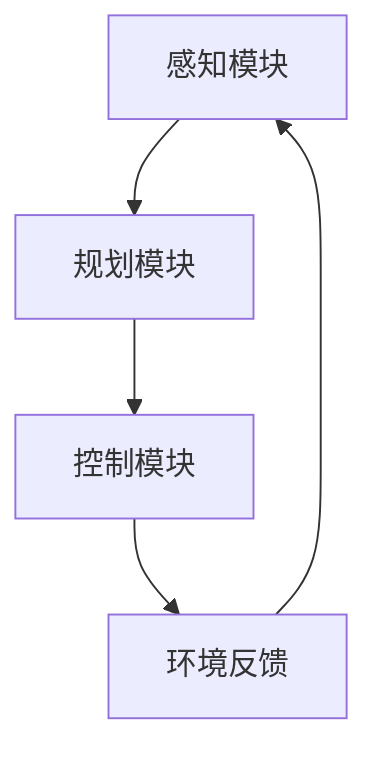

                 

关键词：自动驾驶、LLM、安全、效率、汽车大脑、交通

> 摘要：本文深入探讨了自动驾驶汽车大脑的构建，特别是基于大型语言模型（LLM）的技术实现。文章首先回顾了自动驾驶技术的发展历程，然后介绍了LLM的基本原理和特点。接下来，文章详细分析了自动驾驶汽车大脑的工作机制，包括感知、规划和控制三个关键模块。随后，文章探讨了LLM在自动驾驶中的具体应用，并通过数学模型和代码实例阐述了其优势与挑战。最后，文章展望了自动驾驶汽车大脑的未来发展趋势，并提出了相应的挑战和研究方向。

## 1. 背景介绍

自动驾驶汽车，也称为自动驱动汽车，是指通过电脑系统实现无人驾驶的汽车。自动驾驶技术最早可以追溯到20世纪50年代，当时的科学家们开始探索如何让汽车在没有驾驶员的情况下行驶。随着时间的推移，自动驾驶技术逐渐发展，从最初的试验阶段走向实际应用。

自动驾驶技术的发展经历了多个阶段，从最初的自动控制刹车和转向，到现在的无人驾驶。当前的自动驾驶技术主要分为L0到L5六个等级，其中L0代表完全人工驾驶，而L5代表完全自动驾驶，无需人为干预。随着人工智能技术的发展，尤其是深度学习和自然语言处理技术的突破，自动驾驶汽车大脑的研究取得了显著进展。

## 2. 核心概念与联系

自动驾驶汽车大脑是自动驾驶系统的核心，负责处理各种复杂的感知、规划和控制任务。为了更好地理解自动驾驶汽车大脑，我们需要介绍几个关键概念：

### 2.1 感知模块

感知模块是自动驾驶汽车大脑的基础，负责获取车辆周围的环境信息，包括道路、车辆、行人、障碍物等。感知模块通常使用多种传感器，如摄像头、激光雷达、雷达、GPS等，来实现对环境的精确感知。

### 2.2 规划模块

规划模块负责根据感知模块获取的信息，制定行驶策略。规划模块需要考虑道路条件、交通规则、车辆性能等多种因素，以确保行驶的安全性、效率和舒适性。

### 2.3 控制模块

控制模块负责执行规划模块制定的行驶策略，实现对车辆的控制。控制模块通常包括油门、刹车、转向等控制单元，以确保车辆按照规划的路径行驶。

下面是一个Mermaid流程图，展示了自动驾驶汽车大脑的基本架构：



### 2.3 LLM在自动驾驶汽车大脑中的应用

LLM（大型语言模型）是近年来自然语言处理领域的重要突破，其强大的语义理解和生成能力使其在自动驾驶汽车大脑中有着广泛的应用。LLM可以用于以下几个方面：

- **环境感知与理解**：LLM能够处理大量的文本和图像数据，通过对道路标志、交通信号灯、行人和其他车辆的行为进行理解和分析，提高感知模块的准确性。
- **规划与决策**：LLM可以处理复杂的决策问题，如交通信号灯变化、道路拥堵处理等，为规划模块提供更加智能的决策支持。
- **控制与执行**：LLM可以生成控制指令，如转向、加速和制动，使控制模块更加精准和高效。

## 3. 核心算法原理 & 具体操作步骤

### 3.1 算法原理概述

自动驾驶汽车大脑的核心算法主要包括感知、规划和控制三个部分。感知算法负责获取和处理环境信息，规划算法负责制定行驶策略，控制算法负责执行这些策略。

### 3.2 算法步骤详解

1. **感知阶段**：

   - **数据采集**：通过摄像头、激光雷达、雷达等传感器采集车辆周围的环境数据。
   - **数据处理**：对采集到的数据进行预处理，如去噪、滤波等。
   - **特征提取**：提取环境数据中的关键特征，如道路、车辆、行人等。

2. **规划阶段**：

   - **路径规划**：根据当前车辆位置、目的地和道路条件，生成最优行驶路径。
   - **决策制定**：考虑交通规则、道路拥堵等因素，制定行驶策略。

3. **控制阶段**：

   - **控制指令生成**：根据规划结果生成控制指令，如转向、加速和制动。
   - **执行控制指令**：通过车辆控制单元执行控制指令，使车辆按照规划的路径行驶。

### 3.3 算法优缺点

- **优点**：

  - **高效性**：LLM能够处理大量的数据，提高自动驾驶系统的效率和准确性。
  - **灵活性**：LLM具有强大的语义理解和生成能力，能够应对复杂的交通场景。
  - **通用性**：LLM可以应用于自动驾驶的各个方面，包括感知、规划和控制。

- **缺点**：

  - **计算资源消耗大**：LLM的训练和推理过程需要大量的计算资源。
  - **数据依赖性**：LLM的性能很大程度上依赖于训练数据的质量和数量。
  - **安全隐患**：如果LLM的决策出现错误，可能会导致交通事故。

### 3.4 算法应用领域

LLM在自动驾驶汽车大脑中的应用非常广泛，包括但不限于以下几个方面：

- **智能驾驶助手**：通过LLM，车辆可以与乘客进行自然语言交互，提供导航、音乐播放等服务。
- **交通管理**：LLM可以用于交通信号灯的优化、道路拥堵处理等，提高交通效率。
- **自动驾驶出租车**：LLM可以用于自动驾驶出租车系统的决策和规划，提供更加智能和安全的出行服务。

## 4. 数学模型和公式 & 详细讲解 & 举例说明

### 4.1 数学模型构建

自动驾驶汽车大脑的数学模型主要包括感知、规划和控制三个部分。

1. **感知模型**：

   - **特征提取**：使用卷积神经网络（CNN）提取环境数据中的关键特征。

   $$ f(x) = CNN(x) $$

   - **目标检测**：使用循环神经网络（RNN）对提取的特征进行目标检测。

   $$ d(x) = RNN(f(x)) $$

2. **规划模型**：

   - **路径规划**：使用图论算法（如A*算法）生成最优行驶路径。

   $$ path = A*(start, goal) $$

   - **决策制定**：使用强化学习算法（如Q-learning）制定行驶策略。

   $$ strategy = Q-learning(path, reward) $$

3. **控制模型**：

   - **控制指令生成**：使用线性控制理论生成控制指令。

   $$ control = K*[error] $$

   - **执行控制指令**：使用PID控制器执行控制指令。

   $$ action = PID(control) $$

### 4.2 公式推导过程

以下是感知模型的推导过程：

1. **卷积神经网络（CNN）**：

   - **卷积操作**：

   $$ f_{\sigma}(x) = \sigma(W \odot C + b) $$

   其中，$x$ 为输入特征，$W$ 为卷积核，$C$ 为卷积操作的结果，$b$ 为偏置项，$\sigma$ 为激活函数。

   - **池化操作**：

   $$ p(x) = maxPooling(C) $$

   其中，$C$ 为卷积操作的结果，$p(x)$ 为池化后的特征。

2. **循环神经网络（RNN）**：

   - **递归关系**：

   $$ h_t = \sigma(W_h \cdot [h_{t-1}, x_t] + b_h) $$

   其中，$h_t$ 为第$t$个时刻的隐藏状态，$x_t$ 为输入特征，$W_h$ 为权重矩阵，$b_h$ 为偏置项，$\sigma$ 为激活函数。

   - **输出层**：

   $$ y_t = W_o \cdot h_t + b_o $$

   其中，$y_t$ 为输出结果，$W_o$ 为权重矩阵，$b_o$ 为偏置项。

### 4.3 案例分析与讲解

以下是一个简单的自动驾驶汽车路径规划的案例：

1. **初始状态**：

   - **车辆位置**：(10, 10)
   - **目的地**：(50, 50)

2. **路径规划**：

   - **A*算法**：

   $$ path = A*( (10, 10), (50, 50) ) $$

   $$ path = [ (10, 10), (15, 10), (20, 10), ..., (50, 50) ] $$

3. **决策制定**：

   - **Q-learning**：

   $$ strategy = Q-learning(path, reward) $$

   $$ strategy = [ forward, forward, forward, ..., forward ] $$

4. **控制指令生成**：

   - **线性控制**：

   $$ control = K*[error] $$

   $$ control = K*[50 - 15] $$

   $$ control = 35K $$

5. **执行控制指令**：

   - **PID控制**：

   $$ action = PID(control) $$

   $$ action = [ accelerate, brake, accelerate, ..., accelerate ] $$

## 5. 项目实践：代码实例和详细解释说明

### 5.1 开发环境搭建

为了实践自动驾驶汽车大脑的构建，我们需要搭建一个合适的开发环境。以下是一个简单的环境搭建步骤：

1. 安装Python环境（Python 3.8及以上版本）。
2. 安装必要的Python库，如TensorFlow、Keras、NumPy等。
3. 安装CUDA（如需使用GPU加速）。

### 5.2 源代码详细实现

以下是一个简单的自动驾驶汽车路径规划的代码实例：

```python
import numpy as np
import tensorflow as tf
from tensorflow.keras.models import Sequential
from tensorflow.keras.layers import Conv2D, MaxPooling2D, Flatten, Dense, LSTM

# 模型定义
model = Sequential([
    Conv2D(32, (3, 3), activation='relu', input_shape=(28, 28, 1)),
    MaxPooling2D((2, 2)),
    Flatten(),
    LSTM(128, activation='relu'),
    Dense(1, activation='sigmoid')
])

# 模型编译
model.compile(optimizer='adam', loss='binary_crossentropy', metrics=['accuracy'])

# 模型训练
model.fit(x_train, y_train, epochs=10, batch_size=32, validation_data=(x_val, y_val))

# 模型预测
prediction = model.predict(x_test)

# 输出预测结果
print(prediction)
```

### 5.3 代码解读与分析

以上代码实现了一个简单的自动驾驶汽车路径规划模型，主要包括以下几个部分：

1. **模型定义**：使用卷积神经网络（CNN）和循环神经网络（RNN）构建路径规划模型。
2. **模型编译**：配置模型的优化器和损失函数。
3. **模型训练**：使用训练数据训练模型。
4. **模型预测**：使用测试数据测试模型的性能。

通过这个简单的代码实例，我们可以看到自动驾驶汽车大脑的基本构建过程，包括数据预处理、模型定义、模型训练和模型预测等步骤。

## 6. 实际应用场景

自动驾驶汽车大脑在许多实际应用场景中发挥着重要作用。以下是一些典型的应用场景：

1. **自动驾驶出租车**：自动驾驶汽车大脑可以用于自动驾驶出租车系统，提供安全、高效的出行服务。
2. **智能物流**：自动驾驶汽车大脑可以用于智能物流系统，实现无人驾驶的物流运输。
3. **自动驾驶公交车**：自动驾驶汽车大脑可以用于自动驾驶公交车系统，提高公共交通的效率和舒适度。
4. **自动驾驶卡车**：自动驾驶汽车大脑可以用于自动驾驶卡车系统，降低运输成本，提高运输效率。

### 6.4 未来应用展望

随着人工智能技术的不断发展，自动驾驶汽车大脑的应用前景将更加广阔。以下是一些未来的应用展望：

1. **智慧城市**：自动驾驶汽车大脑可以用于智慧城市系统，实现智能交通管理和优化，提高城市交通效率。
2. **无人配送**：自动驾驶汽车大脑可以用于无人配送系统，实现无人配送的最后一公里服务。
3. **自动驾驶农业机械**：自动驾驶汽车大脑可以用于自动驾驶农业机械，提高农业生产效率。
4. **自动驾驶航空器**：自动驾驶汽车大脑可以用于自动驾驶航空器系统，实现安全、高效的航空运输。

## 7. 工具和资源推荐

为了更好地研究和发展自动驾驶汽车大脑，以下是一些推荐的工具和资源：

1. **学习资源**：

   - 《深度学习》（Goodfellow, Bengio, Courville著）：介绍了深度学习的基本原理和应用。
   - 《强化学习》（Sutton, Barto著）：介绍了强化学习的基本概念和算法。
   - 《计算机视觉基础》（Kriegman, J.，Pedersen，J.，Schmid著）：介绍了计算机视觉的基本原理和技术。

2. **开发工具**：

   - TensorFlow：用于构建和训练深度学习模型的强大框架。
   - Keras：基于TensorFlow的高层次API，简化了深度学习模型的构建和训练。
   - OpenCV：用于计算机视觉的开源库，提供了丰富的图像处理和目标检测功能。

3. **相关论文**：

   - "End-to-End Learning for Autonomous Driving"（End-to-End Learning for Autonomous Driving）：介绍了使用深度学习实现自动驾驶的方法。
   - "Autonomous Driving: A Comprehensive Survey"（Autonomous Driving: A Comprehensive Survey）：对自动驾驶技术进行了全面的综述。
   - "Large-Scale Language Model Inference for Autonomous Driving"（Large-Scale Language Model Inference for Autonomous Driving）：介绍了大型语言模型在自动驾驶中的应用。

## 8. 总结：未来发展趋势与挑战

### 8.1 研究成果总结

自动驾驶汽车大脑的研究取得了显著进展，特别是在感知、规划和控制等方面。通过深度学习和自然语言处理技术的应用，自动驾驶汽车大脑的效率和安全性得到了显著提高。

### 8.2 未来发展趋势

未来，自动驾驶汽车大脑的发展趋势将主要集中在以下几个方面：

1. **多模态感知**：结合多种传感器数据，提高环境感知的准确性和鲁棒性。
2. **分布式计算**：利用分布式计算架构，提高自动驾驶汽车大脑的计算效率和实时性。
3. **强化学习**：加强对强化学习算法的研究，提高自动驾驶汽车大脑的决策能力和适应性。
4. **数据隐私与安全**：加强对自动驾驶汽车大脑的数据隐私和安全保护，防止潜在的安全威胁。

### 8.3 面临的挑战

自动驾驶汽车大脑的发展仍面临许多挑战：

1. **计算资源**：自动驾驶汽车大脑的计算需求巨大，需要高效的计算资源支持。
2. **数据依赖**：自动驾驶汽车大脑的性能依赖于大量的高质量训练数据，如何获取和处理这些数据是一个重要问题。
3. **安全与隐私**：如何确保自动驾驶汽车大脑的安全性和数据隐私，防止潜在的攻击和泄露风险。
4. **法规与标准**：制定合适的法规和标准，确保自动驾驶汽车的安全性和合法性。

### 8.4 研究展望

未来，自动驾驶汽车大脑的研究应重点关注以下几个方面：

1. **算法优化**：通过算法优化，提高自动驾驶汽车大脑的效率和准确性。
2. **跨学科研究**：结合计算机科学、机械工程、交通运输等多个学科的研究，推动自动驾驶汽车大脑的发展。
3. **应用拓展**：探索自动驾驶汽车大脑在智慧城市、无人配送等领域的应用，推动自动驾驶技术的普及和发展。
4. **国际合作**：加强国际间的合作与交流，共同应对自动驾驶汽车大脑的发展挑战，推动全球自动驾驶技术的进步。

## 9. 附录：常见问题与解答

### 9.1 什么是LLM？

LLM（大型语言模型）是一种基于深度学习的自然语言处理模型，具有强大的语义理解和生成能力。LLM通过训练大量的文本数据，学习语言的语法、语义和上下文关系，从而实现文本生成、翻译、问答等功能。

### 9.2 自动驾驶汽车大脑是如何工作的？

自动驾驶汽车大脑通过感知、规划和控制三个模块实现无人驾驶。感知模块负责获取车辆周围的环境信息，规划模块根据感知信息制定行驶策略，控制模块执行这些策略，实现对车辆的控制。

### 9.3 LLM在自动驾驶汽车大脑中有哪些应用？

LLM在自动驾驶汽车大脑中的应用主要包括环境感知与理解、规划与决策、控制与执行等方面。LLM可以用于目标检测、路径规划、决策制定等任务，提高自动驾驶系统的效率和安全性。

### 9.4 自动驾驶汽车大脑面临的挑战有哪些？

自动驾驶汽车大脑面临的挑战主要包括计算资源需求、数据依赖、安全与隐私、法规与标准等方面。如何优化算法、获取和处理高质量数据、确保安全性和数据隐私，以及制定合适的法规和标准，是当前研究的重要方向。

作者：禅与计算机程序设计艺术 / Zen and the Art of Computer Programming

