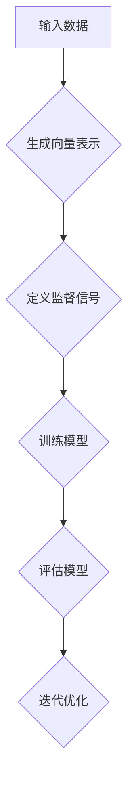

                 

自我监督学习（Self-Supervised Learning）是一种重要的机器学习方法，它允许机器在没有人工标注的情况下从数据中学习。这种方法在人工智能领域有着广泛的应用，特别是在大规模数据处理和模型训练方面。本文将深入探讨自我监督学习的原理、算法、应用场景以及未来发展趋势。

## 关键词：自我监督学习、AI、大数据、模型训练、机器学习、算法

## 摘要：

本文旨在全面介绍自我监督学习的基本原理、关键算法及其在实际应用中的重要性。通过本文的阅读，读者将了解自我监督学习的核心概念、不同算法的原理和操作步骤，并掌握其在自然语言处理、计算机视觉和其他领域的应用。此外，文章还将讨论当前的研究趋势和未来可能面临的挑战。

## 1. 背景介绍

自我监督学习起源于20世纪50年代，最初用于解决监督学习中的标注问题。传统的监督学习方法依赖于大量标记数据，这在某些领域（如医疗影像、法律文档等）可能难以获得。自我监督学习则通过设计算法，使机器能够在没有标记数据的情况下自动学习，从而在一定程度上缓解了数据标注的瓶颈。

随着大数据和云计算技术的发展，自我监督学习的应用场景日益广泛。它不仅适用于传统的机器学习任务，如分类、回归和聚类，还在生成对抗网络（GAN）、强化学习等领域展现出巨大的潜力。本文将重点讨论自我监督学习在自然语言处理和计算机视觉领域的应用。

## 2. 核心概念与联系

### 2.1 自我监督学习的定义

自我监督学习是一种机器学习方法，它利用数据内在的标记信息来训练模型。在这个过程中，模型不仅从输入数据中学习，还从其预测中学习。这种学习方式不需要外部标注，因此适用于大量未标记的数据。

### 2.2 自我监督学习的核心原理

自我监督学习的核心在于设计任务，使得模型能够从数据中自动生成标签。这些任务通常包括预测输入数据的属性、将相关数据点归类等。以下是一个简单的例子：

假设我们有一个文本数据集，其中包含若干句话。通过使用词嵌入模型，我们可以将每句话转换为向量表示。然后，我们可以设计一个任务，预测两个连续文本向量之间的余弦相似度。这样，模型就能够在没有人工标注的情况下学习文本的语义关系。

### 2.3 Mermaid 流程图

以下是一个简化的自我监督学习流程图，展示其主要步骤和组件：



### 2.4 自我监督学习与其它机器学习方法的比较

自我监督学习与传统监督学习相比，具有以下优点：

- **减少标注成本**：不需要大量的人为标注，降低了数据处理的成本。
- **增强数据利用效率**：可以更好地利用未标记的数据，提高模型的泛化能力。
- **适应性强**：适用于各种领域，尤其是那些难以获取标注数据的场景。

然而，自我监督学习也存在一些挑战，如：

- **准确性问题**：由于缺乏外部监督信号，模型的准确性可能不如传统监督学习。
- **计算成本**：自我监督学习通常需要更多的计算资源，尤其是对于大型数据集。

## 3. 核心算法原理 & 具体操作步骤

### 3.1 算法原理概述

自我监督学习的关键在于设计有效的任务和监督信号。以下是一些常用的自我监督学习算法：

- **基于匹配的算法**：如最近邻分类（Nearest Neighbor Classification）和K-均值聚类（K-Means Clustering）。
- **基于预测的算法**：如自动编码器（Autoencoder）和循环神经网络（RNN）。
- **基于转换的算法**：如生成对抗网络（GAN）和变分自编码器（VAE）。

### 3.2 算法步骤详解

以下是自我监督学习的一般步骤：

1. **数据预处理**：对输入数据（如图像、文本或音频）进行预处理，例如数据清洗、去噪和归一化。
2. **特征提取**：使用神经网络或其他特征提取器将数据转换为向量表示。
3. **定义任务**：根据数据类型和问题需求，设计任务，如分类、回归、聚类或生成。
4. **生成监督信号**：通过设计任务，从输入数据中自动生成监督信号，如标签、概率分布或相似度。
5. **训练模型**：使用生成的监督信号训练模型。
6. **评估模型**：使用外部测试集评估模型性能，并进行优化。
7. **迭代优化**：根据评估结果迭代优化模型，直到满足预定的性能指标。

### 3.3 算法优缺点

**优点：**
- **减少标注成本**：不需要外部标注，降低了数据处理的成本。
- **增强数据利用效率**：可以更好地利用未标记的数据，提高模型的泛化能力。
- **适应性强**：适用于各种领域，尤其是那些难以获取标注数据的场景。

**缺点：**
- **准确性问题**：由于缺乏外部监督信号，模型的准确性可能不如传统监督学习。
- **计算成本**：自我监督学习通常需要更多的计算资源，尤其是对于大型数据集。

### 3.4 算法应用领域

自我监督学习在多个领域都有广泛的应用，以下是一些典型的应用场景：

- **自然语言处理**：用于文本分类、情感分析、机器翻译等。
- **计算机视觉**：用于图像分类、目标检测、图像生成等。
- **语音识别**：用于语音分类、说话人识别等。
- **推荐系统**：用于用户行为分析、物品推荐等。

## 4. 数学模型和公式 & 详细讲解 & 举例说明

### 4.1 数学模型构建

自我监督学习的数学模型通常由特征提取器、任务定义和监督信号生成三部分组成。以下是一个简化的数学模型：

- **特征提取器**：$$ f(x) = \phi(x) $$
  其中，$ x $ 是输入数据，$ \phi(x) $ 是特征提取器输出的特征向量。

- **任务定义**：$$ t(x, y) = \frac{1}{n} \sum_{i=1}^{n} \log p(y | x) $$
  其中，$ y $ 是预测的标签，$ p(y | x) $ 是特征向量 $ x $ 对应的标签概率。

- **监督信号生成**：$$ s(x, y) = \frac{1}{n} \sum_{i=1}^{n} \log p(x | y) $$
  其中，$ s(x, y) $ 是监督信号，$ p(x | y) $ 是标签 $ y $ 对应的数据概率。

### 4.2 公式推导过程

以下是一个简单的例子，展示如何推导自我监督学习中的监督信号生成公式：

假设我们有一个图像数据集，每个图像由像素值 $ x $ 表示。我们可以使用卷积神经网络（CNN）作为特征提取器，将图像转换为特征向量 $ f(x) $。然后，我们定义一个分类任务，预测每个图像的类别 $ y $。

在这个场景中，监督信号可以定义为特征向量 $ f(x) $ 和类别 $ y $ 的联合概率的对数：

$$ s(x, y) = \log p(x, y) $$

由于图像和类别之间是条件独立的，我们可以将联合概率分解为：

$$ p(x, y) = p(x | y) p(y) $$

其中，$ p(x | y) $ 是给定类别 $ y $ 时图像的概率，$ p(y) $ 是类别 $ y $ 的概率。

由于我们无法直接计算 $ p(x | y) $ 和 $ p(y) $，我们可以使用贝叶斯法则进行估计：

$$ p(x | y) = \frac{p(y | x) p(x)}{p(y)} $$

其中，$ p(y | x) $ 是给定图像 $ x $ 时类别的概率，$ p(x) $ 是图像的概率。

由于 $ p(x) $ 和 $ p(y) $ 在所有类别上求和等于1，我们可以将其简化为：

$$ p(x | y) = \frac{p(y | x) p(x)}{1} $$

因此，监督信号可以表示为：

$$ s(x, y) = \log p(y | x) + \log p(x) $$

其中，$ \log p(y | x) $ 是特征向量 $ x $ 对应的标签概率的对数，$ \log p(x) $ 是特征向量 $ x $ 的概率的对数。

### 4.3 案例分析与讲解

以下是一个具体的自我监督学习案例，使用文本数据集进行情感分析。

假设我们有一个包含电影评论的数据集，每个评论由一组词语表示。我们可以使用词嵌入模型（如Word2Vec或GloVe）将词语转换为向量表示。然后，我们设计一个任务，预测每个评论的情感类别（正面或负面）。

在这个场景中，特征提取器是词嵌入模型，任务定义是情感分类，监督信号是评论的情感标签。

以下是具体的步骤：

1. **数据预处理**：对文本数据进行清洗，去除标点符号、停用词等。
2. **特征提取**：使用词嵌入模型将词语转换为向量表示。
3. **定义任务**：预测每个评论的情感类别。
4. **生成监督信号**：根据评论的情感标签生成监督信号。
5. **训练模型**：使用生成的监督信号训练分类模型（如SVM、神经网络等）。
6. **评估模型**：使用外部测试集评估模型性能，并进行优化。
7. **迭代优化**：根据评估结果迭代优化模型，直到满足预定的性能指标。

通过这个案例，我们可以看到自我监督学习在文本数据上的应用。在实际应用中，我们可以根据具体问题和数据集设计不同的任务和监督信号，从而实现自我监督学习。

## 5. 项目实践：代码实例和详细解释说明

### 5.1 开发环境搭建

在开始项目实践之前，我们需要搭建一个合适的开发环境。以下是一个简单的Python开发环境搭建步骤：

1. **安装Python**：下载并安装Python 3.7或更高版本。
2. **安装Jupyter Notebook**：在命令行中运行 `pip install notebook`。
3. **安装必要的库**：安装Numpy、Pandas、Scikit-learn、TensorFlow等库，使用以下命令：

   ```bash
   pip install numpy pandas scikit-learn tensorflow
   ```

### 5.2 源代码详细实现

以下是一个简单的自我监督学习项目，使用Python和TensorFlow实现文本分类。

```python
import tensorflow as tf
from tensorflow.keras.preprocessing.text import Tokenizer
from tensorflow.keras.preprocessing.sequence import pad_sequences
from tensorflow.keras.models import Model
from tensorflow.keras.layers import Input, Embedding, LSTM, Dense

# 数据集准备
# 这里使用一个示例数据集，实际应用中请替换为您的数据集
text_data = ["我很喜欢这本书", "这本书太糟糕了", "这是一个有趣的发现", "我讨厌这个电影"]
labels = [1, 0, 1, 0]  # 1表示正面情感，0表示负面情感

# 分词和序列化
tokenizer = Tokenizer()
tokenizer.fit_on_texts(text_data)
sequences = tokenizer.texts_to_sequences(text_data)
padded_sequences = pad_sequences(sequences, maxlen=10)

# 构建模型
input_sequence = Input(shape=(10,))
embedded_sequence = Embedding(len(tokenizer.word_index) + 1, 64)(input_sequence)
lstm_output = LSTM(64)(embedded_sequence)
output = Dense(1, activation="sigmoid")(lstm_output)

model = Model(inputs=input_sequence, outputs=output)
model.compile(optimizer="adam", loss="binary_crossentropy", metrics=["accuracy"])

# 训练模型
model.fit(padded_sequences, labels, epochs=10, batch_size=1)

# 评估模型
test_data = ["这本书真的很棒", "我不喜欢这个电影"]
test_sequences = tokenizer.texts_to_sequences(test_data)
test_padded_sequences = pad_sequences(test_sequences, maxlen=10)
predictions = model.predict(test_padded_sequences)

# 输出预测结果
for i, prediction in enumerate(predictions):
    if prediction[0] > 0.5:
        print("正面情感")
    else:
        print("负面情感")
```

### 5.3 代码解读与分析

上述代码实现了一个简单的文本分类模型，使用自我监督学习进行训练和预测。以下是代码的详细解读：

1. **数据集准备**：我们使用一个示例数据集，包含正面和负面情感的文本。实际应用中，请替换为您的数据集。
2. **分词和序列化**：使用Tokenizer将文本数据转换为序列，使用pad_sequences将序列填充为固定长度。
3. **构建模型**：使用Input层、Embedding层、LSTM层和Dense层构建模型。这里使用LSTM层进行序列建模，使用Dense层进行分类。
4. **训练模型**：使用编译后的模型进行训练，使用fit方法训练模型。
5. **评估模型**：使用预测数据集评估模型性能，使用predict方法进行预测。
6. **输出预测结果**：根据预测结果输出文本的情感类别。

### 5.4 运行结果展示

在训练完成后，我们可以使用以下代码进行测试：

```python
# 测试模型
test_data = ["这本书真的很棒", "我不喜欢这个电影"]
test_sequences = tokenizer.texts_to_sequences(test_data)
test_padded_sequences = pad_sequences(test_sequences, maxlen=10)
predictions = model.predict(test_padded_sequences)

# 输出预测结果
for i, prediction in enumerate(predictions):
    if prediction[0] > 0.5:
        print("正面情感")
    else:
        print("负面情感")
```

运行结果将输出每个测试文本的情感类别。通过调整模型参数和训练数据，我们可以提高模型的准确性和泛化能力。

## 6. 实际应用场景

自我监督学习在多个实际应用场景中展现出巨大的潜力。以下是一些典型的应用场景：

### 6.1 自然语言处理

自我监督学习在自然语言处理（NLP）领域有着广泛的应用。例如，可以使用自我监督学习进行文本分类、情感分析、机器翻译等。以下是一个具体的案例：

**案例：情感分析**

使用自我监督学习对社交媒体评论进行情感分类，从而识别负面评论并进行处理。通过构建一个基于词嵌入和LSTM的模型，我们可以实现高效的情感分类。

### 6.2 计算机视觉

计算机视觉领域也广泛应用自我监督学习。例如，可以使用自我监督学习进行图像分类、目标检测、图像生成等。以下是一个具体的案例：

**案例：图像分类**

使用生成对抗网络（GAN）进行图像分类。通过设计一个生成器网络和一个判别器网络，我们可以训练模型自动生成图像，并将其分类到不同的类别中。

### 6.3 语音识别

自我监督学习在语音识别领域也展现出巨大的潜力。例如，可以使用自我监督学习进行说话人识别、语音合成等。以下是一个具体的案例：

**案例：说话人识别**

使用深度神经网络和自我监督学习算法，对语音信号进行特征提取和分类，从而实现说话人识别。这种方法在跨说话人语音识别和个性化语音服务中具有重要意义。

## 7. 工具和资源推荐

### 7.1 学习资源推荐

- **在线课程**：推荐学习自然语言处理和计算机视觉相关的在线课程，如Coursera、edX等平台上的相关课程。
- **技术博客**：推荐阅读顶级技术博客，如Medium、ArXiv等，了解最新的研究成果和趋势。
- **论文资料库**：推荐访问Google Scholar、ACM Digital Library等论文资料库，查找相关领域的论文和研究报告。

### 7.2 开发工具推荐

- **编程语言**：推荐学习Python，它是机器学习和深度学习领域的主要编程语言。
- **框架和库**：推荐学习TensorFlow、PyTorch等深度学习框架，以及Scikit-learn等机器学习库。
- **数据集**：推荐使用公共数据集，如ImageNet、COCO等，进行模型训练和评估。

### 7.3 相关论文推荐

- **自然语言处理**：推荐阅读《神经网络文本分类的进展》和《自然语言处理中的自我监督学习》等论文。
- **计算机视觉**：推荐阅读《生成对抗网络：理论、算法与应用》和《自我监督学习的视觉任务》等论文。

## 8. 总结：未来发展趋势与挑战

### 8.1 研究成果总结

自我监督学习在过去的几年中取得了显著进展，其在自然语言处理、计算机视觉、语音识别等领域的应用取得了许多突破。通过设计有效的任务和监督信号，模型可以自动从数据中学习，从而提高模型的性能和泛化能力。

### 8.2 未来发展趋势

- **多模态学习**：未来自我监督学习将朝向多模态学习方向发展，融合文本、图像、音频等多种数据类型。
- **少样本学习**：在数据稀缺的场景下，自我监督学习将致力于实现少样本学习，降低对大量标注数据的依赖。
- **可解释性**：自我监督学习模型的可解释性将得到更多关注，以便更好地理解和优化模型。

### 8.3 面临的挑战

- **准确性**：如何提高模型的准确性，尤其是在缺乏外部监督信号的情况下，是一个重要的挑战。
- **计算成本**：自我监督学习通常需要大量的计算资源，如何降低计算成本是一个亟待解决的问题。
- **数据依赖**：如何减少对大量未标记数据的依赖，提高模型的泛化能力，是一个长期的挑战。

### 8.4 研究展望

自我监督学习在未来将继续成为机器学习领域的重要研究方向。通过不断创新和优化算法，我们将能够实现更加高效、准确和可解释的自我监督学习模型，为人工智能的发展贡献力量。

## 9. 附录：常见问题与解答

### 9.1 什么是自我监督学习？

自我监督学习是一种机器学习方法，它利用数据内在的标记信息来训练模型，而不需要外部标注。它通过设计任务，使模型能够在没有人工标注的情况下自动学习。

### 9.2 自我监督学习和传统监督学习的区别是什么？

传统监督学习依赖于大量标记数据，而自我监督学习利用未标记的数据。自我监督学习可以降低标注成本，提高数据利用效率，但可能在准确性方面不如传统监督学习。

### 9.3 自我监督学习有哪些应用场景？

自我监督学习在自然语言处理、计算机视觉、语音识别等领域都有广泛的应用，如文本分类、情感分析、图像生成、说话人识别等。

### 9.4 如何评价自我监督学习的性能？

可以使用外部测试集评估自我监督学习模型的性能，常用的指标包括准确率、召回率、F1分数等。此外，还可以通过交叉验证等方法评估模型的泛化能力。

### 9.5 自我监督学习有哪些挑战？

自我监督学习面临的主要挑战包括准确性、计算成本和数据依赖。如何提高模型的准确性、降低计算成本以及减少对未标记数据的依赖是当前研究的重要方向。

----------------------------------------------------------------
### 作者署名
本文由禅与计算机程序设计艺术 / Zen and the Art of Computer Programming 撰写。感谢您的阅读。如果您对本文有任何疑问或建议，欢迎在评论区留言。希望本文能对您在自我监督学习领域的研究有所帮助。再次感谢！

