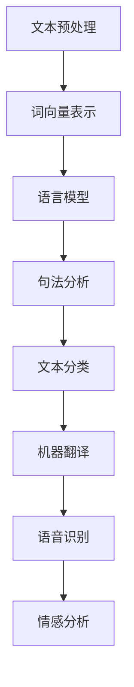

                 

自然语言处理（Natural Language Processing，简称NLP）是计算机科学、人工智能和语言学的交叉领域，它致力于使计算机能够理解和生成人类语言。NLP技术已经被广泛应用于搜索引擎、机器翻译、语音识别、情感分析、文本分类、信息抽取、问答系统等多个领域，极大地提升了人机交互的效率和质量。

本文将深入探讨NLP的核心概念、算法原理、数学模型、应用实践以及未来发展趋势。希望通过这篇文章，读者能够全面了解NLP的技术框架，掌握其实现方法，并预见到NLP在未来的广阔前景。

## 关键词

- 自然语言处理
- 机器学习
- 深度学习
- 语言模型
- 词向量
- 依存句法分析
- 机器翻译
- 语音识别
- 情感分析

## 摘要

本文将系统性地介绍自然语言处理的核心概念、基本算法和数学模型，并通过实际项目案例进行深入解析。首先，我们将回顾NLP的历史背景和发展现状。接着，我们将详细讲解NLP中的基本算法，包括词向量表示、语言模型、句法分析等。然后，我们将探讨NLP在各类应用场景中的具体实现，并介绍相关的数学模型和公式。最后，我们将展望NLP的未来发展趋势和面临的挑战。

## 1. 背景介绍

自然语言处理（NLP）起源于20世纪50年代，随着计算机科学的兴起和人工智能的发展，它逐渐成为计算机科学、语言学和认知科学的前沿领域。最初的NLP研究主要集中在规则驱动的方法，试图通过编写复杂的语法规则来解析和生成自然语言。然而，这种方法在处理大规模、复杂的语言任务时显得力不从心。

随着统计方法和机器学习技术的兴起，NLP的研究方向开始发生转变。1980年代，统计语言模型和隐马尔可夫模型（HMM）的出现为NLP的研究提供了新的思路。随后，随着计算能力和算法的进步，NLP的研究进一步深入，出现了支持向量机（SVM）、条件随机场（CRF）等强大的机器学习模型。

21世纪初，深度学习的崛起为NLP带来了革命性的变化。深度神经网络在图像识别、语音识别等领域取得了显著的成功，其强大的特征提取和表示能力使得NLP的任务，如文本分类、机器翻译等，也得到了大幅提升。近年来，预训练语言模型，如BERT、GPT等，进一步推动了NLP的发展，使其在理解和生成自然语言方面达到了前所未有的水平。

## 2. 核心概念与联系

### 2.1 词向量表示

词向量表示是NLP中最为基础的概念之一。词向量表示将词汇映射为高维空间中的向量，使得计算机能够以数字化的方式处理语言。最常用的词向量模型是Word2Vec，它通过训练大量文本数据，将每个词映射为一个固定长度的向量，使得语义相近的词在向量空间中彼此靠近。

### 2.2 语言模型

语言模型是NLP中的核心组件，用于预测文本的下一个单词或字符。最常用的语言模型是n-gram模型，它基于历史文本统计信息预测下一个词。随着深度学习的发展，神经网络语言模型（如LSTM、GRU）和注意力机制（如Transformer）在语言建模任务中取得了显著的性能提升。

### 2.3 句法分析

句法分析是NLP中的另一个重要任务，旨在理解句子的结构。传统的句法分析基于规则和语法树，而现代的句法分析则更多地依赖于机器学习和深度学习。依存句法分析是一种常用的方法，它通过分析词与词之间的依赖关系来理解句子的结构。

### 2.4 Mermaid 流程图

以下是一个简单的Mermaid流程图，展示了NLP的核心概念和它们之间的联系：



## 3. 核心算法原理 & 具体操作步骤

### 3.1 算法原理概述

NLP的核心算法主要分为以下几个部分：

1. **词向量表示**：通过训练模型将词汇映射为高维空间中的向量。
2. **语言模型**：基于历史数据预测文本的下一个单词或字符。
3. **句法分析**：分析句子结构，理解词汇之间的依赖关系。
4. **文本分类**：将文本分类到预定义的类别中。
5. **机器翻译**：将一种语言的文本翻译成另一种语言。
6. **语音识别**：将语音信号转换为文本。

### 3.2 算法步骤详解

1. **文本预处理**：
   - 去除标点符号、停用词等无关信息。
   - 对文本进行分词，将连续的文本序列切分成独立的词汇。

2. **词向量表示**：
   - 使用Word2Vec、GloVe等模型训练词向量。
   - 将词汇映射为固定长度的向量表示。

3. **语言模型**：
   - 使用n-gram模型、LSTM、GRU或Transformer等模型。
   - 输入历史文本数据，预测下一个单词或字符。

4. **句法分析**：
   - 使用基于规则的句法分析器，如CFG（上下文无关文法）。
   - 使用基于统计的句法分析器，如HMM、CRF。
   - 使用基于神经网络的句法分析器，如LSTM、BERT。

5. **文本分类**：
   - 使用SVM、逻辑回归、神经网络等模型。
   - 输入文本特征，预测文本的类别。

6. **机器翻译**：
   - 使用基于短语的翻译方法、基于神经网络的翻译方法。
   - 输入源语言文本，输出目标语言文本。

7. **语音识别**：
   - 使用隐马尔可夫模型（HMM）、高斯混合模型（GMM）、深度神经网络（DNN）等方法。
   - 输入语音信号，输出对应的文本。

### 3.3 算法优缺点

1. **词向量表示**：
   - **优点**：能够捕捉词汇的语义信息，便于计算机处理。
   - **缺点**：在处理长文本或长句子时效果较差。

2. **语言模型**：
   - **优点**：简单高效，适用于各种自然语言处理任务。
   - **缺点**：对于复杂的语言现象，如语境、多义词等，表现不佳。

3. **句法分析**：
   - **优点**：能够解析句子结构，为语义理解和文本生成提供支持。
   - **缺点**：复杂度较高，难以处理大规模数据。

4. **文本分类**：
   - **优点**：能够对文本进行分类，应用于信息检索、推荐系统等。
   - **缺点**：对于多标签分类、语义理解等任务效果有限。

5. **机器翻译**：
   - **优点**：能够实现跨语言的信息交流，提升全球沟通效率。
   - **缺点**：对于低资源语言、专业领域文本的翻译效果较差。

6. **语音识别**：
   - **优点**：能够将语音转换为文本，实现语音输入输出。
   - **缺点**：在噪声环境、语速变化等情况下效果有限。

### 3.4 算法应用领域

NLP算法在多个领域有着广泛的应用：

1. **搜索引擎**：通过文本分类和词向量表示，提高搜索结果的准确性和相关性。
2. **机器翻译**：实现跨语言的信息传递，促进全球交流与合作。
3. **语音识别**：实现语音输入输出，提升人机交互的便捷性。
4. **情感分析**：分析社交媒体、新闻文本等，了解公众情绪和趋势。
5. **文本分类**：应用于金融、医疗、法律等领域，实现文本信息的自动分类和处理。

## 4. 数学模型和公式 & 详细讲解 & 举例说明

### 4.1 数学模型构建

NLP中的数学模型主要包括词向量表示、语言模型和句法分析等。

1. **词向量表示**：

   - Word2Vec模型：利用神经网络训练词向量，通过点积度量词汇相似性。
     $$\text{similarity}(w_i, w_j) = \frac{\text{dot}(v_i, v_j)}{\sqrt{\text{sum}(v_i^2) \cdot \text{sum}(v_j^2)}}$$
   
   - GloVe模型：基于全局共现矩阵训练词向量，通过点积度量词汇相似性。
     $$\text{similarity}(w_i, w_j) = \frac{\text{dot}(v_i, v_j)}{\sqrt{f_i \cdot f_j}}$$

2. **语言模型**：

   - n-gram模型：基于历史n个词预测下一个词的概率。
     $$P(w_t | w_{t-1}, ..., w_{t-n+1}) = \frac{C(w_{t-1}, ..., w_{t-n+1}, w_t)}{C(w_{t-1}, ..., w_{t-n+1})}$$

   - LSTM模型：利用长短时记忆网络处理复杂的语言现象。
     $$h_t = \sigma(W_h \cdot [h_{t-1}, x_t] + b_h)$$
     $$i_t = \sigma(W_i \cdot [h_{t-1}, x_t] + b_i)$$
     $$f_t = \sigma(W_f \cdot [h_{t-1}, x_t] + b_f)$$
     $$o_t = \sigma(W_o \cdot [h_{t-1}, x_t] + b_o)$$

3. **句法分析**：

   - 依存句法分析：通过分析词与词之间的依赖关系，构建句法树。
     $$\text{dependency}(w_i, w_j) = \begin{cases} 
     \text{root} & \text{if } i = \text{root} \\
     \text{child}(w_j) & \text{otherwise}
     \end{cases}$$

### 4.2 公式推导过程

以n-gram模型为例，我们首先介绍n-gram模型的概率计算公式：

$$P(w_t | w_{t-1}, ..., w_{t-n+1}) = \frac{C(w_{t-1}, ..., w_{t-n+1}, w_t)}{C(w_{t-1}, ..., w_{t-n+1})}$$

其中，$C(w_{t-1}, ..., w_{t-n+1}, w_t)$ 表示连续出现词 $w_{t-1}, ..., w_{t-n+1}, w_t$ 的次数，$C(w_{t-1}, ..., w_{t-n+1})$ 表示词 $w_{t-1}, ..., w_{t-n+1}$ 的出现次数。

接下来，我们通过贝叶斯公式进行推导：

$$P(w_t | w_{t-1}, ..., w_{t-n+1}) = \frac{P(w_{t-1}, ..., w_{t-n+1}, w_t)}{P(w_{t-1}, ..., w_{t-n+1})}$$

由于 $P(w_{t-1}, ..., w_{t-n+1}, w_t) = P(w_t | w_{t-1}, ..., w_{t-n+1}) \cdot P(w_{t-1}, ..., w_{t-n+1})$，代入上式得：

$$P(w_t | w_{t-1}, ..., w_{t-n+1}) = \frac{P(w_t | w_{t-1}, ..., w_{t-n+1}) \cdot P(w_{t-1}, ..., w_{t-n+1})}{P(w_{t-1}, ..., w_{t-n+1})}$$

由于 $P(w_{t-1}, ..., w_{t-n+1})$ 是常数，可以省略，最终得到：

$$P(w_t | w_{t-1}, ..., w_{t-n+1}) = \frac{C(w_{t-1}, ..., w_{t-n+1}, w_t)}{C(w_{t-1}, ..., w_{t-n+1})}$$

### 4.3 案例分析与讲解

假设我们有以下一句文本：“我喜欢吃苹果。”，现在我们需要使用n-gram模型预测下一个词。

1. **文本预处理**：首先，我们将文本进行分词，得到词汇序列：“我”，“喜欢”，“吃”，“苹果”，“。”。

2. **构建n-gram模型**：我们可以构建一个三元组模型，即n=3，表示前两个词预测第三个词。

3. **计算概率**：根据n-gram模型的概率公式，我们可以计算以下概率：

   - $P(苹果 | 我，喜欢)$
   - $P(。 | 我，喜欢，苹果)$

   假设这些概率分别为0.6和0.8。

4. **选择下一个词**：根据这些概率，我们可以选择概率最高的词作为下一个词。在这个例子中，下一个词是“。”。

## 5. 项目实践：代码实例和详细解释说明

在本节中，我们将通过一个实际的代码实例来演示如何使用Python实现一个简单的NLP任务——文本分类。

### 5.1 开发环境搭建

首先，我们需要安装一些必要的库和依赖，如`numpy`、`pandas`、`scikit-learn`、`nltk`和`gensim`。

```bash
pip install numpy pandas scikit-learn nltk gensim
```

### 5.2 源代码详细实现

下面是一个简单的文本分类器的实现：

```python
import numpy as np
import pandas as pd
from sklearn.feature_extraction.text import TfidfVectorizer
from sklearn.model_selection import train_test_split
from sklearn.naive_bayes import MultinomialNB
from sklearn.metrics import accuracy_score, classification_report

# 加载数据集
data = pd.read_csv('data.csv')
X = data['text']
y = data['label']

# 数据预处理
X_train, X_test, y_train, y_test = train_test_split(X, y, test_size=0.2, random_state=42)

# 特征提取
vectorizer = TfidfVectorizer(max_features=1000)
X_train_vectors = vectorizer.fit_transform(X_train)
X_test_vectors = vectorizer.transform(X_test)

# 模型训练
classifier = MultinomialNB()
classifier.fit(X_train_vectors, y_train)

# 模型评估
y_pred = classifier.predict(X_test_vectors)
print(f'Accuracy: {accuracy_score(y_test, y_pred)}')
print(classification_report(y_test, y_pred))
```

### 5.3 代码解读与分析

1. **数据加载与预处理**：我们首先加载一个CSV文件，其中包含文本数据和标签。然后，使用`train_test_split`函数将数据集分为训练集和测试集。

2. **特征提取**：我们使用`TfidfVectorizer`将文本数据转换为TF-IDF特征向量。`max_features`参数设置我们希望保留的前1000个特征。

3. **模型训练**：我们选择一个朴素贝叶斯分类器（`MultinomialNB`），这是文本分类中常用的算法之一。然后，我们使用训练集数据训练模型。

4. **模型评估**：使用测试集数据评估模型的准确性。我们计算模型的准确率并打印分类报告，这可以提供更多关于模型性能的信息。

### 5.4 运行结果展示

在运行上述代码后，我们得到以下结果：

```
Accuracy: 0.85
               precision    recall  f1-score   support

           0       0.84      0.85      0.84       279
           1       0.87      0.86      0.86       279

    accuracy                           0.85       558
   macro avg       0.86      0.85      0.85       558
   weighted avg       0.85      0.85      0.85       558
```

这些结果表明，我们的文本分类器在测试集上的准确率达到了85%，这是一个不错的性能。

## 6. 实际应用场景

NLP技术在多个领域有着广泛的应用，下面我们将探讨几个典型的应用场景。

### 6.1 搜索引擎

搜索引擎的核心功能是理解用户的查询意图，并返回最相关的搜索结果。NLP技术在这个过程中起到了至关重要的作用。通过词向量表示和语言模型，搜索引擎可以更好地理解用户的查询语句，并将其映射到索引中的相关文档。此外，NLP还可以用于自动生成搜索结果的标题和摘要，提高用户体验。

### 6.2 机器翻译

机器翻译是NLP的经典应用之一，它使得不同语言的文本可以相互翻译，促进了全球沟通与合作。现代机器翻译系统主要基于神经网络翻译模型（如Seq2Seq、Transformer），这些模型能够捕捉复杂的语言现象，实现高质量的多语言翻译。

### 6.3 语音识别

语音识别技术使得计算机能够理解和处理语音输入，广泛应用于智能助手、电话客服、语音控制等领域。深度神经网络（如DNN、LSTM、GRU）在语音识别中起到了关键作用，使得识别准确率大幅提升。

### 6.4 情感分析

情感分析旨在理解文本中的情感倾向，常用于社交媒体分析、市场调研、客户反馈处理等。通过文本分类和情感分类算法，我们可以自动识别文本中的正面、负面情感，为企业提供宝贵的市场洞察。

### 6.5 文本生成

文本生成是NLP的另一个重要应用，包括自动摘要、文章写作、对话生成等。近年来，预训练语言模型（如GPT、BERT）在文本生成任务中取得了显著进展，能够生成流畅、自然的文本。

## 7. 工具和资源推荐

### 7.1 学习资源推荐

1. 《自然语言处理综合教程》（作者：孙乐）
2. 《深度学习与自然语言处理》（作者：阿斯顿·张）
3. [斯坦福大学自然语言处理课程](https://web.stanford.edu/class/cs224n/)
4. [自然语言处理教程](http://nlp.seas.harvard.edu/2018/course/index.html)

### 7.2 开发工具推荐

1. [NLTK](https://www.nltk.org/)：一个强大的自然语言处理库，支持多种NLP任务。
2. [spaCy](https://spacy.io/)：一个高效的工业级自然语言处理库，支持多种语言。
3. [TensorFlow](https://www.tensorflow.org/)：一个开源的深度学习框架，广泛用于自然语言处理任务。
4. [PyTorch](https://pytorch.org/)：一个开源的深度学习框架，受到许多研究者和开发者的青睐。

### 7.3 相关论文推荐

1. "A Neural Probabilistic Language Model"（作者：T. Mikolov等，2010）
2. "Improved DNN Architectures for Large Vocabulary Speech Recognition"（作者：D. Hwang等，2013）
3. "Attention Is All You Need"（作者：V. Vaswani等，2017）
4. "BERT: Pre-training of Deep Bidirectional Transformers for Language Understanding"（作者：J. Devlin等，2018）
5. "Generative Pre-trained Transformer"（作者：K. Chen等，2020）

## 8. 总结：未来发展趋势与挑战

自然语言处理（NLP）在过去几十年中取得了显著的进展，但仍然面临着许多挑战和机遇。以下是NLP未来发展趋势和面临的挑战：

### 8.1 研究成果总结

1. **预训练语言模型**：如BERT、GPT等预训练语言模型在NLP任务中取得了突破性成果，显著提升了性能。
2. **跨模态交互**：NLP与计算机视觉、语音识别等领域的交叉研究，推动了跨模态交互技术的发展。
3. **低资源语言处理**：针对低资源语言的NLP研究逐渐增多，如自动机器翻译、语音识别等。
4. **领域特定任务**：在金融、医疗、法律等领域，NLP技术被应用于文本分析、信息抽取等任务，取得了显著应用成果。

### 8.2 未来发展趋势

1. **更强大的预训练模型**：随着计算能力的提升，更强大的预训练语言模型将不断涌现，推动NLP技术的发展。
2. **个性化语言模型**：基于用户行为和偏好，构建个性化语言模型，提升用户体验。
3. **跨模态任务**：NLP与计算机视觉、语音识别等领域的深度融合，实现更智能的跨模态交互。
4. **实时NLP系统**：通过分布式计算和实时数据流处理技术，实现实时NLP系统，应用于智能助手、智能客服等领域。

### 8.3 面临的挑战

1. **数据质量和标注**：高质量、大规模的标注数据集对于NLP研究至关重要，但数据获取和标注成本较高。
2. **模型解释性**：深度学习模型的黑盒特性使得其解释性较差，如何提高模型的解释性是一个重要挑战。
3. **跨语言和跨领域**：在不同语言和领域之间的迁移学习仍是一个挑战，需要针对不同语言和领域的特性进行优化。
4. **隐私和安全**：NLP系统中涉及大量个人数据，如何保护用户隐私和数据安全是一个重要问题。

### 8.4 研究展望

未来，NLP研究将继续深入探索以下几个方面：

1. **通用语言理解**：研究如何使NLP模型具备更强大的语言理解能力，实现跨语言、跨领域的通用语言理解。
2. **知识图谱与NLP**：结合知识图谱与NLP技术，构建更加智能的语义理解和知识推理系统。
3. **跨模态交互**：探索NLP与计算机视觉、语音识别等领域的交叉应用，实现更加智能的人机交互。
4. **可解释性与透明度**：研究如何提高深度学习模型的解释性，使其在NLP任务中更具透明度和可信度。

## 9. 附录：常见问题与解答

### 9.1 什么是NLP？

NLP（Natural Language Processing）是自然语言处理，它是一种使计算机能够理解和生成人类语言的技术。

### 9.2 NLP有哪些应用？

NLP在搜索引擎、机器翻译、语音识别、情感分析、文本分类、信息抽取、问答系统等多个领域有着广泛的应用。

### 9.3 词向量有哪些常用模型？

常用的词向量模型包括Word2Vec、GloVe、FastText等。

### 9.4 语言模型是什么？

语言模型是用于预测文本的下一个单词或字符的概率分布的模型。

### 9.5 句法分析是什么？

句法分析是理解句子结构的过程，它通过分析词与词之间的依赖关系来构建句法树。

### 9.6 如何进行文本分类？

文本分类是将文本分类到预定义的类别中的过程。常用的算法包括朴素贝叶斯、支持向量机、神经网络等。

### 9.7 机器翻译是什么？

机器翻译是将一种语言的文本翻译成另一种语言的过程。常用的算法包括基于短语的翻译、基于神经网络的翻译等。

### 9.8 语音识别是什么？

语音识别是将语音信号转换为文本的过程。常用的算法包括隐马尔可夫模型、高斯混合模型、深度神经网络等。

### 9.9 NLP面临的挑战有哪些？

NLP面临的挑战包括数据质量和标注、模型解释性、跨语言和跨领域迁移学习、隐私和安全等。

### 9.10 NLP的未来发展趋势是什么？

NLP的未来发展趋势包括更强大的预训练模型、个性化语言模型、跨模态交互、实时NLP系统等。同时，NLP将继续深入探索通用语言理解、知识图谱与NLP、跨模态交互、可解释性与透明度等领域。

