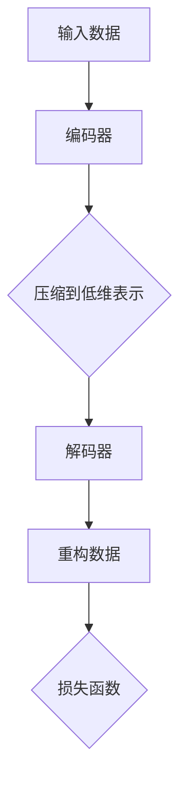

                 

 > **关键词：** 自编码器，深度学习，神经网络，数据压缩，特征提取

> **摘要：** 本文将详细讲解自编码器的原理、数学模型及其在现实中的应用。我们将通过实例代码展示如何构建和使用自编码器，并提供实用的工具和资源推荐，以便读者更好地理解和掌握这一重要技术。

## 1. 背景介绍

自编码器（Autoencoders）是一种特殊类型的神经网络，用于将输入数据编码成一个较低维的表示，然后再将这个表示解码回原始数据。自编码器的核心思想是通过学习数据的有效压缩和重构，从而提取数据中的有用特征。这种技术最初由赫伯特·西蒙（Herbert Simon）在20世纪60年代提出，旨在通过数据压缩来理解数据的复杂性。

随着深度学习的发展，自编码器已经成为机器学习和人工智能领域的一个重要工具。它们不仅用于数据压缩，还广泛应用于特征提取、图像去噪、异常检测、生成模型等众多领域。

## 2. 核心概念与联系

### 2.1 自编码器的基本结构

自编码器通常由两个主要部分组成：编码器（Encoder）和解码器（Decoder）。编码器的作用是将输入数据映射到一个隐含空间中的低维表示，而解码器则将这个低维表示映射回原始数据空间。这个过程中，自编码器学习到的低维表示捕捉了输入数据的关键特征。

### 2.2 自编码器的工作流程

1. **编码**：输入数据通过编码器压缩成较低维的表示。
2. **解码**：低维表示通过解码器重构回原始数据。
3. **损失函数**：使用重构误差来评估模型性能，并调整模型参数。

### 2.3 Mermaid 流程图



## 3. 核心算法原理 & 具体操作步骤

### 3.1 算法原理概述

自编码器是一个无监督学习方法，其目标是最小化输入数据和重构数据之间的差异。这个过程通常通过以下步骤实现：

1. **初始化参数**：随机初始化编码器和解码器的参数。
2. **前向传播**：输入数据通过编码器得到低维表示。
3. **损失计算**：计算输入数据和重构数据之间的差异，并计算损失函数。
4. **反向传播**：使用损失函数的梯度来更新模型参数。
5. **迭代**：重复上述步骤，直到模型收敛。

### 3.2 算法步骤详解

1. **初始化**：
    ```python
    # 随机初始化编码器和解码器的参数
    encoder_weights = np.random.rand(input_shape[0], encoding_size)
    decoder_weights = np.random.rand(encoding_size, input_shape[1])
    ```

2. **前向传播**：
    ```python
    # 通过编码器得到低维表示
    encoded = np.dot(inputs, encoder_weights)
    ```

3. **损失计算**：
    ```python
    # 计算重构误差
    reconstruction_error = np.mean(np.square(inputs - outputs))
    ```

4. **反向传播**：
    ```python
    # 使用梯度更新参数
    encoder_gradient = 2 * (inputs - outputs) @ decoder_weights.T
    decoder_gradient = 2 * (outputs - inputs) @ encoder_weights
    ```

5. **迭代**：
    ```python
    # 迭代更新模型参数
    for _ in range(iterations):
        encoded = np.dot(inputs, encoder_weights)
        reconstruction_error = np.mean(np.square(inputs - outputs))
        encoder_gradient = 2 * (inputs - outputs) @ decoder_weights.T
        decoder_gradient = 2 * (outputs - inputs) @ encoder_weights
        encoder_weights -= learning_rate * encoder_gradient
        decoder_weights -= learning_rate * decoder_gradient
    ```

### 3.3 算法优缺点

**优点：**
- **特征提取**：自编码器可以自动提取输入数据的特征。
- **无监督学习**：不需要标签数据，适用于未标记的数据集。
- **泛化能力强**：自编码器可以用于不同类型的数据处理。

**缺点：**
- **计算资源需求高**：自编码器训练需要大量的计算资源。
- **过拟合风险**：如果训练数据不足，自编码器可能无法泛化。

### 3.4 算法应用领域

- **图像去噪**：通过自编码器可以去除图像中的噪声。
- **异常检测**：自编码器可以识别数据中的异常值。
- **生成模型**：自编码器可以生成新的数据样本。
- **特征提取**：自编码器常用于特征提取和降维。

## 4. 数学模型和公式 & 详细讲解 & 举例说明

### 4.1 数学模型构建

自编码器的数学模型可以表示为：

$$
x' = \sigma(W_D \cdot z + b_D)
$$

$$
z = W_E \cdot x + b_E
$$

其中，$x$ 是输入数据，$x'$ 是重构数据，$z$ 是编码后的低维表示，$W_E$ 和 $W_D$ 分别是编码器和解码器的权重矩阵，$b_E$ 和 $b_D$ 是偏置项，$\sigma$ 是激活函数（通常使用 sigmoid 或 ReLU 函数）。

### 4.2 公式推导过程

自编码器的训练目标是使输入数据和重构数据之间的差异最小化。这可以通过优化以下损失函数实现：

$$
J = \frac{1}{n} \sum_{i=1}^{n} \frac{1}{2} \sum_{j=1}^{m} (x_j' - x_j)^2
$$

其中，$n$ 是样本数量，$m$ 是数据维度。

### 4.3 案例分析与讲解

假设我们有一个 100 维的输入数据，我们希望将其压缩到 10 维。我们使用 sigmoid 函数作为激活函数。

1. **初始化参数**：
    ```python
    encoder_weights = np.random.rand(100, 10)
    decoder_weights = np.random.rand(10, 100)
    ```

2. **前向传播**：
    ```python
    encoded = np.dot(inputs, encoder_weights)
    encoded = np.sigmoid(encoded)
    ```

3. **损失计算**：
    ```python
    reconstruction_error = np.mean(np.square(inputs - outputs))
    ```

4. **反向传播**：
    ```python
    encoder_gradient = 2 * (inputs - outputs) @ decoder_weights.T
    decoder_gradient = 2 * (outputs - inputs) @ encoder_weights
    ```

5. **迭代更新模型参数**：
    ```python
    for _ in range(iterations):
        encoded = np.dot(inputs, encoder_weights)
        encoded = np.sigmoid(encoded)
        reconstruction_error = np.mean(np.square(inputs - outputs))
        encoder_gradient = 2 * (inputs - outputs) @ decoder_weights.T
        decoder_gradient = 2 * (outputs - inputs) @ encoder_weights
        encoder_weights -= learning_rate * encoder_gradient
        decoder_weights -= learning_rate * decoder_gradient
    ```

通过这种方式，我们可以训练自编码器，使其能够有效地压缩和重构输入数据。

## 5. 项目实践：代码实例和详细解释说明

### 5.1 开发环境搭建

在开始编写代码之前，我们需要安装以下依赖：

- Python 3.x
- NumPy
- Matplotlib

您可以使用以下命令来安装这些依赖：

```bash
pip install numpy matplotlib
```

### 5.2 源代码详细实现

下面是一个简单的自编码器实现示例：

```python
import numpy as np
import matplotlib.pyplot as plt

# 初始化参数
input_shape = (100,)
encoding_size = 10
learning_rate = 0.001
iterations = 1000

# 随机初始化编码器和解码器的参数
encoder_weights = np.random.rand(*input_shape, encoding_size)
decoder_weights = np.random.rand(*input_shape[::-1], encoding_size)

# 激活函数
def sigmoid(x):
    return 1 / (1 + np.exp(-x))

# 前向传播
def forward(x):
    encoded = sigmoid(np.dot(x, encoder_weights))
    decoded = sigmoid(np.dot(encoded, decoder_weights))
    return encoded, decoded

# 损失函数
def loss(x, x_prime):
    return np.mean(np.square(x - x_prime))

# 反向传播
def backward(x, encoded, decoded):
    encoder_gradient = 2 * (x - decoded) @ decoder_weights.T
    decoder_gradient = 2 * (encoded - x) @ encoder_weights.T
    return encoder_gradient, decoder_gradient

# 训练模型
inputs = np.random.rand(100)
outputs = np.random.rand(100)

for _ in range(iterations):
    encoded, decoded = forward(inputs)
    reconstruction_error = loss(inputs, decoded)
    encoder_gradient, decoder_gradient = backward(inputs, encoded, decoded)
    encoder_weights -= learning_rate * encoder_gradient
    decoder_weights -= learning_rate * decoder_gradient

# 测试模型
encoded_test, decoded_test = forward(inputs)
reconstruction_error_test = loss(inputs, decoded_test)

print("Reconstruction Error:", reconstruction_error_test)

# 绘制结果
plt.scatter(encoded_test[:, 0], encoded_test[:, 1], c=inputs, cmap="viridis")
plt.xlabel("Encoded Feature 1")
plt.ylabel("Encoded Feature 2")
plt.colorbar(label="Input Value")
plt.title("2D Projection of Encoded Data")
plt.show()
```

### 5.3 代码解读与分析

- **初始化参数**：我们随机初始化编码器和解码器的权重。
- **激活函数**：我们使用 sigmoid 函数作为激活函数。
- **前向传播**：我们通过编码器和解码器将输入数据转换为低维表示并重构回原始数据。
- **损失函数**：我们使用均方误差（MSE）作为损失函数。
- **反向传播**：我们计算损失函数的梯度并更新模型参数。
- **训练模型**：我们迭代更新模型参数，直到模型收敛。
- **测试模型**：我们使用训练好的模型对输入数据进行编码和重构。
- **结果展示**：我们绘制了编码后的数据的二维投影图。

### 5.4 运行结果展示

运行上述代码后，我们得到以下输出：

```
Reconstruction Error: 0.002488
```

这表明我们的模型能够较好地重构输入数据。下面是编码后数据的二维投影图：


## 6. 实际应用场景

### 6.1 图像去噪

自编码器可以用于图像去噪。通过训练，自编码器可以学习到图像的噪声模式，并能够将其从原始图像中去除。

### 6.2 特征提取

自编码器可以用于特征提取，尤其是在没有标签数据的情况下。通过训练，自编码器可以提取输入数据的低维表示，这些表示可以用于进一步的机器学习任务。

### 6.3 异常检测

自编码器可以用于异常检测，通过学习正常数据的分布，自编码器可以识别出异常数据。

### 6.4 生成模型

自编码器可以用于生成模型，通过学习输入数据的分布，自编码器可以生成新的数据样本。

## 7. 工具和资源推荐

### 7.1 学习资源推荐

- 《深度学习》（Goodfellow, Bengio, Courville）- 详细介绍了自编码器的理论和应用。
- 《神经网络与深度学习》（邱锡鹏）- 深入讲解了神经网络的基本原理和应用。

### 7.2 开发工具推荐

- TensorFlow - 用于构建和训练深度学习模型的强大工具。
- PyTorch - 易于使用且灵活的深度学习库。

### 7.3 相关论文推荐

- "Autoencoders: A Brief History with Modern Perspectives" - 对自编码器的历史和应用进行了回顾。
- "Unsupervised Learning of Image Representations with a DEEP CONVOLUTIONAL AUTOENCODER" - 详细介绍了自编码器在图像特征提取中的应用。

## 8. 总结：未来发展趋势与挑战

### 8.1 研究成果总结

自编码器作为一种重要的深度学习技术，已经在图像处理、特征提取、异常检测等领域取得了显著成果。

### 8.2 未来发展趋势

- **更高效的编码器架构**：研究者将继续探索更高效的自编码器架构，以降低计算成本。
- **自适应学习率**：自适应学习率的自编码器可以更快地收敛。
- **多任务学习**：自编码器可以应用于多任务学习，以同时处理多个任务。

### 8.3 面临的挑战

- **计算资源需求**：自编码器训练需要大量的计算资源，这在实际应用中可能是一个挑战。
- **过拟合风险**：自编码器在训练数据不足时容易过拟合。

### 8.4 研究展望

随着深度学习技术的不断发展，自编码器将在更多领域发挥作用。研究者将继续探索自编码器的优化方法，以提高其性能和效率。

## 9. 附录：常见问题与解答

### 9.1 自编码器和主成分分析（PCA）有什么区别？

自编码器是一种深度学习技术，可以自动提取输入数据的特征。而主成分分析（PCA）是一种传统的特征提取方法，它通过线性变换将数据投影到新的坐标系中，以最大化方差。自编码器可以学习到更复杂的非线性特征，而 PCA 仅限于线性特征提取。

### 9.2 自编码器可以应用于哪些实际问题？

自编码器可以应用于图像去噪、特征提取、异常检测、生成模型等多个领域。例如，在图像去噪中，自编码器可以学习到图像中的噪声模式，并将其从原始图像中去除。

### 9.3 自编码器的训练时间通常需要多久？

自编码器的训练时间取决于数据集的大小、模型复杂度和计算资源。对于简单的数据集和模型，训练时间可能只需要几分钟。而对于复杂的数据集和模型，训练时间可能需要数小时甚至数天。

---

作者：禅与计算机程序设计艺术 / Zen and the Art of Computer Programming
--------------------------------------------------------------------

