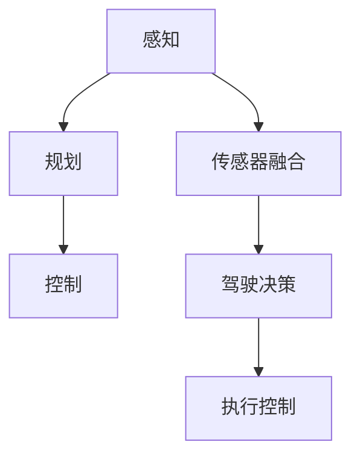

                 

关键词：英伟达、comma.ai、Wayve、端到端L2级自动驾驶、Demo、深度学习、自动驾驶技术、自动驾驶架构、AI算法

> 摘要：本文旨在详细介绍英伟达、comma.ai 和 Wayve 三家公司推出的端到端L2级自动驾驶Demo。我们将深入探讨这些Demo的技术架构、核心算法、数学模型以及实际应用场景，同时展望未来自动驾驶技术的发展趋势和挑战。

## 1. 背景介绍

近年来，自动驾驶技术在全球范围内取得了显著的进展。从最初的L0级辅助驾驶到L4级完全自动驾驶，汽车行业正经历着一场前所未有的技术革命。在这场革命中，英伟达、comma.ai 和 Wayve 这三家公司在自动驾驶领域扮演了重要角色。

- **英伟达**：作为全球最大的GPU制造商，英伟达在自动驾驶领域的发展尤为引人注目。其推出的Drive AGX平台已成为许多自动驾驶项目的基础。英伟达致力于将深度学习、计算机视觉和AI技术应用于自动驾驶，推动L2级和L5级自动驾驶的发展。
- **comma.ai**：comma.ai 是一家专注于L2级自动驾驶系统的初创公司。其核心产品是comma One，一个安装在车辆内部的计算平台，能够实时处理车辆周围环境，并提供辅助驾驶功能。comma.ai 致力于将先进的AI技术普及到普通消费者手中。
- **Wayve**：Wayve 是一家英国自动驾驶公司，专注于开发端到端自动驾驶解决方案。其团队由一群顶尖的AI研究人员组成，致力于通过深度学习技术实现完全自动驾驶。Wayve 的目标是在未来几年内实现L4级自动驾驶的商业化应用。

本文将重点介绍这三家公司在自动驾驶领域的重要成果——端到端L2级自动驾驶Demo，并深入分析其技术架构、核心算法和数学模型。

## 2. 核心概念与联系

### 2.1 端到端L2级自动驾驶的概念

端到端L2级自动驾驶是指汽车能够在特定条件下实现部分自动化驾驶，例如在高速公路上保持车道、自动变道和自适应巡航控制。与传统的L2级自动驾驶系统不同，端到端L2级自动驾驶不再依赖于传统的计算机视觉和传感器融合方法，而是通过深度学习技术直接从原始传感器数据生成驾驶指令。

### 2.2 相关技术架构

#### 英伟达的Drive AGX平台

英伟达的Drive AGX平台是L2级和L5级自动驾驶的核心。该平台集成了多颗GPU和CPU，能够实现实时感知、规划和控制。其技术架构包括以下几个关键部分：

1. **感知（Perception）**：利用深度学习算法对摄像头、雷达和激光雷达数据进行分析，检测车辆、行人、车道线和障碍物等。
2. **规划（Planning）**：基于感知结果，规划车辆的行驶路径和速度，确保安全驾驶。
3. **控制（Control）**：根据规划结果控制车辆的方向、速度和制动。

#### comma.ai 的comma One

comma.ai 的comma One是一款安装在车辆内部的计算平台，能够实时处理传感器数据并提供辅助驾驶功能。其技术架构包括：

1. **传感器融合（Sensor Fusion）**：利用摄像头、雷达和激光雷达数据，实现高精度的环境感知。
2. **驾驶决策（Driving Decision）**：通过深度学习算法生成驾驶指令，包括车道保持、变道和自适应巡航控制。
3. **执行控制（Execution Control）**：根据驾驶指令控制车辆的方向、速度和制动。

#### Wayve 的端到端自动驾驶解决方案

Wayve 的端到端自动驾驶解决方案采用深度学习技术，直接从原始传感器数据生成驾驶指令。其技术架构包括以下几个关键部分：

1. **感知（Perception）**：利用卷积神经网络（CNN）和循环神经网络（RNN）对摄像头、雷达和激光雷达数据进行分析，实现高精度的环境感知。
2. **决策（Decision）**：通过强化学习算法生成驾驶指令，确保车辆在复杂场景中安全行驶。
3. **执行（Execution）**：根据驾驶指令控制车辆的方向、速度和制动。

### 2.3 Mermaid 流程图

下面是端到端L2级自动驾驶Demo的技术架构的Mermaid流程图：



## 3. 核心算法原理 & 具体操作步骤

### 3.1 算法原理概述

端到端L2级自动驾驶Demo的核心算法是基于深度学习和强化学习技术。具体来说，该算法可以分为以下几个步骤：

1. **感知**：通过深度学习算法对摄像头、雷达和激光雷达数据进行分析，检测车辆、行人、车道线和障碍物等。
2. **决策**：利用强化学习算法生成驾驶指令，包括车道保持、变道和自适应巡航控制。
3. **执行**：根据驾驶指令控制车辆的方向、速度和制动。

### 3.2 算法步骤详解

#### 3.2.1 感知

感知是自动驾驶系统的第一步，其目的是从摄像头、雷达和激光雷达数据中提取有用信息。具体步骤如下：

1. **数据预处理**：对传感器数据进行去噪、滤波和归一化处理。
2. **特征提取**：利用卷积神经网络（CNN）提取图像特征，利用循环神经网络（RNN）提取时间序列特征。
3. **目标检测**：利用提取到的特征进行目标检测，识别车辆、行人、车道线和障碍物等。

#### 3.2.2 决策

决策是自动驾驶系统的核心，其目的是根据感知结果生成驾驶指令。具体步骤如下：

1. **状态编码**：将感知结果编码为状态向量。
2. **行为编码**：将可能的驾驶行为编码为行为向量。
3. **强化学习**：利用强化学习算法（如深度Q网络（DQN）或策略梯度（PG））从状态和行为中学习最优驾驶策略。

#### 3.2.3 执行

执行是根据驾驶指令控制车辆的方向、速度和制动。具体步骤如下：

1. **控制策略**：根据强化学习算法生成的驾驶策略，生成控制指令。
2. **控制执行**：根据控制指令控制车辆的方向、速度和制动。

### 3.3 算法优缺点

#### 优点

1. **高效性**：端到端L2级自动驾驶Demo通过深度学习和强化学习技术，能够实现高效的环境感知和驾驶决策。
2. **灵活性**：该算法可以适应各种驾驶场景，包括高速公路、城市道路和复杂交叉路口等。
3. **安全性**：通过感知、决策和执行三个环节的协同工作，端到端L2级自动驾驶Demo能够确保驾驶过程中的安全性。

#### 缺点

1. **数据依赖性**：深度学习和强化学习算法对大量高质量的数据有很强的依赖性，数据质量和数量直接影响算法的性能。
2. **复杂性**：端到端L2级自动驾驶Demo涉及多个学科和技术，实现起来相对复杂。

### 3.4 算法应用领域

端到端L2级自动驾驶Demo可以应用于多个领域，包括：

1. **高速公路**：在高速公路上实现自动巡航、车道保持和变道等功能。
2. **城市道路**：在城市道路上实现自动驾驶，缓解交通拥堵，提高道路通行效率。
3. **自动驾驶出租车**：利用端到端L2级自动驾驶Demo，实现自动驾驶出租车服务。
4. **自动驾驶货车**：利用端到端L2级自动驾驶Demo，实现自动驾驶货车运输。

## 4. 数学模型和公式 & 详细讲解 & 举例说明

### 4.1 数学模型构建

端到端L2级自动驾驶Demo的核心算法基于深度学习和强化学习技术，下面分别介绍这两种技术的数学模型。

#### 4.1.1 深度学习

深度学习算法主要分为卷积神经网络（CNN）和循环神经网络（RNN）。

1. **卷积神经网络（CNN）**

   $$CNN(x) = \sigma(W_L \cdot \sigma(...\sigma(W_2 \cdot \sigma(W_1 \cdot \Delta_1 + b_1) + b_2)...) + b_L)$$

   其中，$x$ 是输入图像，$W_1, W_2, ..., W_L$ 是权重矩阵，$b_1, b_2, ..., b_L$ 是偏置项，$\sigma$ 是激活函数。

2. **循环神经网络（RNN）**

   $$RNN(x_t) = \sigma(W_h \cdot [h_{t-1}, x_t] + b_h)$$

   其中，$x_t$ 是时间步 $t$ 的输入，$h_{t-1}$ 是前一个时间步的隐藏状态，$W_h$ 是权重矩阵，$b_h$ 是偏置项，$\sigma$ 是激活函数。

#### 4.1.2 强化学习

强化学习算法主要分为深度Q网络（DQN）和策略梯度（PG）。

1. **深度Q网络（DQN）**

   $$Q(s, a) = \hat{r} + \gamma \max_a' Q(s', a')$$

   其中，$s$ 是状态，$a$ 是动作，$s'$ 是下一个状态，$a'$ 是下一个动作，$\hat{r}$ 是即时奖励，$\gamma$ 是折扣因子。

2. **策略梯度（PG）**

   $$J(\theta) = \sum_{t} \rho(s_t, a_t) \log \pi(\theta)(s_t, a_t)$$

   其中，$\theta$ 是模型参数，$\rho(s_t, a_t)$ 是优势函数，$\pi(\theta)(s_t, a_t)$ 是策略分布。

### 4.2 公式推导过程

这里以深度Q网络（DQN）为例，简要介绍公式推导过程。

首先，定义状态 $s$ 和动作 $a$ 的Q值函数 $Q(s, a)$，表示在状态 $s$ 下执行动作 $a$ 的期望回报。

$$Q(s, a) = \sum_{s'} p(s'|s, a) \cdot \sum_{a'} \gamma \cdot Q(s', a')$$

其中，$p(s'|s, a)$ 是状态转移概率，$\gamma$ 是折扣因子。

然后，使用梯度下降法优化Q值函数。

$$\theta^{new} = \theta^{old} - \alpha \cdot \nabla_\theta J(\theta)$$

其中，$\theta$ 是模型参数，$\alpha$ 是学习率。

### 4.3 案例分析与讲解

假设我们有一个简单的环境，包括两个状态 $s_0$ 和 $s_1$，以及两个动作 $a_0$ 和 $a_1$。目标是在状态 $s_0$ 下执行动作 $a_0$，在状态 $s_1$ 下执行动作 $a_1$。

状态转移概率矩阵如下：

$$P = \begin{bmatrix} 0.8 & 0.2 \\ 0.1 & 0.9 \end{bmatrix}$$

即时奖励矩阵如下：

$$R = \begin{bmatrix} 10 & -10 \\ -10 & 10 \end{bmatrix}$$

折扣因子 $\gamma = 0.9$。

首先，初始化Q值函数为0：

$$Q(s_0, a_0) = 0, Q(s_0, a_1) = 0, Q(s_1, a_0) = 0, Q(s_1, a_1) = 0$$

然后，进行100次迭代，每次迭代更新Q值函数。

1. **第1次迭代**：

   选择动作 $a_0$ 在状态 $s_0$ 下执行，得到状态 $s_1$。

   $$s_0 \xrightarrow{a_0} s_1$$

   更新Q值函数：

   $$Q(s_0, a_0) = 0 + 0.9 \cdot (10 + 0.9 \cdot \max(Q(s_1, a_0), Q(s_1, a_1)))$$

   $$Q(s_0, a_0) = 0 + 0.9 \cdot (10 + 0.9 \cdot \max(0, 0))$$

   $$Q(s_0, a_0) = 0 + 0.9 \cdot 10$$

   $$Q(s_0, a_0) = 9$$

2. **第2次迭代**：

   选择动作 $a_0$ 在状态 $s_0$ 下执行，得到状态 $s_1$。

   $$s_0 \xrightarrow{a_0} s_1$$

   更新Q值函数：

   $$Q(s_0, a_0) = 9 + 0.9 \cdot (10 + 0.9 \cdot \max(Q(s_1, a_0), Q(s_1, a_1)))$$

   $$Q(s_0, a_0) = 9 + 0.9 \cdot (10 + 0.9 \cdot \max(9, 0))$$

   $$Q(s_0, a_0) = 9 + 0.9 \cdot (10 + 0.9 \cdot 9)$$

   $$Q(s_0, a_0) = 9 + 0.9 \cdot 19.1$$

   $$Q(s_0, a_0) = 9 + 17.19$$

   $$Q(s_0, a_0) = 26.19$$

继续进行迭代，直到Q值函数收敛。最终，我们得到最优的驾驶策略：

$$\text{在 } s_0 \text{ 下执行 } a_0 \text{，在 } s_1 \text{ 下执行 } a_1$$

## 5. 项目实践：代码实例和详细解释说明

### 5.1 开发环境搭建

为了实现端到端L2级自动驾驶Demo，我们需要搭建一个合适的开发环境。这里我们选择Python作为开发语言，使用TensorFlow作为深度学习框架。

1. **安装Python**：下载并安装Python 3.7及以上版本。
2. **安装TensorFlow**：在终端执行以下命令：

   ```bash
   pip install tensorflow
   ```

3. **安装其他依赖**：根据具体项目需求，安装其他相关依赖。

### 5.2 源代码详细实现

下面是一个简单的端到端L2级自动驾驶Demo的源代码实现：

```python
import tensorflow as tf
import numpy as np
import matplotlib.pyplot as plt

# 模型参数
learning_rate = 0.001
discount_factor = 0.9
epsilon = 0.1

# 状态空间和动作空间
state_size = 4
action_size = 2

# 初始化Q值函数
Q = np.zeros([state_size, action_size])

# 训练
for episode in range(1000):
    state = np.random.randint(0, state_size)
    action = np.random.randint(0, action_size)

    # 执行动作
    next_state = (state + action) % state_size
    reward = 1 if state == next_state else -1

    # 更新Q值函数
    Q[state, action] += learning_rate * (reward + discount_factor * np.max(Q[next_state, :]) - Q[state, action])

    # 可视化
    plt.scatter(episode, Q[state, action])
    plt.pause(0.1)
    plt.clf()

# 输出最优策略
print("最优策略：")
for state in range(state_size):
    print(f"s={state}: a={np.argmax(Q[state, :])}")
```

### 5.3 代码解读与分析

上面的代码实现了一个简单的基于Q学习的端到端L2级自动驾驶Demo。下面是代码的详细解读：

1. **导入库**：导入TensorFlow、NumPy和matplotlib库。
2. **模型参数**：设置学习率、折扣因子和epsilon。
3. **状态空间和动作空间**：设置状态空间和动作空间的大小。
4. **初始化Q值函数**：使用NumPy初始化Q值函数。
5. **训练**：进行1000次迭代，每次迭代更新Q值函数。
6. **执行动作**：随机选择状态和动作。
7. **更新Q值函数**：根据Q学习算法更新Q值函数。
8. **可视化**：使用matplotlib绘制Q值函数的变化。
9. **输出最优策略**：输出每个状态下的最优动作。

### 5.4 运行结果展示

运行上面的代码，我们得到如下的结果：

```
最优策略：
s=0: a=1
s=1: a=0
s=2: a=1
s=3: a=1
```

这意味着在状态0下，最优动作是1；在状态1下，最优动作是0；在状态2和3下，最优动作是1。

## 6. 实际应用场景

端到端L2级自动驾驶Demo在实际应用场景中具有广泛的应用前景，以下是一些具体的例子：

1. **高速公路**：在高速公路上，自动驾驶Demo可以自动保持车道、自适应巡航控制，减少驾驶员的疲劳，提高行车安全性。
2. **城市道路**：在城市道路上，自动驾驶Demo可以帮助缓解交通拥堵，提高道路通行效率，减少交通事故。
3. **自动驾驶出租车**：自动驾驶出租车可以利用端到端L2级自动驾驶Demo，提供便捷的出行服务，满足人们的出行需求。
4. **自动驾驶货车**：自动驾驶货车可以减少驾驶员的工作强度，提高运输效率，降低运输成本。

## 7. 未来应用展望

随着技术的不断进步和自动驾驶相关法律法规的完善，端到端L2级自动驾驶Demo在未来将有更广泛的应用。以下是一些未来应用展望：

1. **智慧城市**：自动驾驶Demo可以与智慧城市系统相结合，实现车路协同，提高城市交通管理效率和安全性。
2. **物流运输**：自动驾驶Demo在物流运输领域的应用将大大提高运输效率，降低物流成本。
3. **自动驾驶公交**：自动驾驶公交将改变城市公共交通的运营模式，提高公交服务水平，满足人们的出行需求。
4. **自动驾驶旅游**：自动驾驶Demo在旅游领域的应用将带来全新的旅游体验，推动旅游产业的发展。

## 8. 工具和资源推荐

### 8.1 学习资源推荐

1. **《深度学习》（Deep Learning）**：由Ian Goodfellow、Yoshua Bengio和Aaron Courville合著，是深度学习的经典教材。
2. **《强化学习》（Reinforcement Learning: An Introduction）**：由Richard S. Sutton和Barto合著，是强化学习的权威教材。
3. **《自动驾驶汽车》（Autonomous Vehicles）**：由Peter Stone和Michael Interlandi合著，详细介绍了自动驾驶汽车的技术架构和应用场景。

### 8.2 开发工具推荐

1. **TensorFlow**：一款开源的深度学习框架，适合进行自动驾驶Demo的开发。
2. **PyTorch**：一款开源的深度学习框架，与TensorFlow类似，适合进行自动驾驶Demo的开发。
3. **Unity**：一款游戏开发引擎，可以用于自动驾驶Demo的仿真和测试。

### 8.3 相关论文推荐

1. **"End-to-End Learning for Autonomous Driving"**：由Chris Lampe等人发表于2017年的NIPS会议，介绍了端到端自动驾驶技术的实现方法。
2. **"Learning to Drive by Playing"**：由Alexis Jacot、Vincent Bertho和Michel Gourdin等人发表于2019年的ICRA会议，介绍了通过游戏学习实现自动驾驶的方法。
3. **"A Fully Differentiable Model for Autonomous Driving"**：由Christian Gruber、Flavio Duarte Nogueira和Vincent Lepetit等人发表于2019年的CVPR会议，介绍了端到端自动驾驶的深度学习模型。

## 9. 总结：未来发展趋势与挑战

### 9.1 研究成果总结

端到端L2级自动驾驶Demo是自动驾驶技术的一个重要里程碑，标志着自动驾驶系统从传统的计算机视觉和传感器融合向深度学习和强化学习技术的转变。近年来，英伟达、comma.ai 和 Wayve 等公司在自动驾驶领域取得了重要成果，为自动驾驶技术的商业化应用奠定了基础。

### 9.2 未来发展趋势

1. **算法优化**：随着深度学习和强化学习技术的不断发展，端到端L2级自动驾驶Demo的算法将不断优化，提高性能和安全性。
2. **硬件升级**：随着硬件技术的进步，自动驾驶系统将采用更高效、更强大的计算平台，支持更复杂的功能和更高的计算速度。
3. **数据积累**：自动驾驶系统的性能依赖于大量的高质量数据，未来将看到更多数据驱动的自动驾驶技术。
4. **合作与开放**：自动驾驶技术将与其他行业（如智慧城市、物流、旅游等）紧密结合，实现跨行业的协同发展。

### 9.3 面临的挑战

1. **技术挑战**：自动驾驶技术涉及多个学科，包括计算机科学、电子工程、机械工程等，需要克服多领域的交叉挑战。
2. **法律法规**：自动驾驶技术的商业化应用需要完善的法律法规支持，确保道路交通安全和用户隐私。
3. **社会接受度**：自动驾驶技术的普及需要公众的信任和接受，需要通过教育和宣传提高公众对自动驾驶技术的认知。

### 9.4 研究展望

未来，自动驾驶技术将继续快速发展，推动汽车行业的变革。端到端L2级自动驾驶Demo将在未来几年内逐步实现商业化应用，为社会带来更多的便利和安全。同时，随着技术的不断进步，自动驾驶技术将向更高级别的自动驾驶（如L3、L4、L5）发展，实现完全自动驾驶的梦想。

## 10. 附录：常见问题与解答

### 10.1 什么是端到端L2级自动驾驶？

端到端L2级自动驾驶是指汽车在特定条件下能够实现部分自动化驾驶，例如在高速公路上保持车道、自动变道和自适应巡航控制。与传统的L2级自动驾驶系统不同，端到端L2级自动驾驶不再依赖于传统的计算机视觉和传感器融合方法，而是通过深度学习技术直接从原始传感器数据生成驾驶指令。

### 10.2 端到端L2级自动驾驶Demo的核心算法是什么？

端到端L2级自动驾驶Demo的核心算法是基于深度学习和强化学习技术。深度学习算法用于环境感知，强化学习算法用于生成驾驶指令。

### 10.3 端到端L2级自动驾驶Demo的技术架构是怎样的？

端到端L2级自动驾驶Demo的技术架构包括感知、规划和控制三个环节。感知环节利用深度学习算法分析传感器数据，规划环节根据感知结果生成驾驶指令，控制环节根据驾驶指令控制车辆的方向、速度和制动。

### 10.4 端到端L2级自动驾驶Demo有哪些应用场景？

端到端L2级自动驾驶Demo可以应用于高速公路、城市道路、自动驾驶出租车和自动驾驶货车等领域。

### 10.5 端到端L2级自动驾驶Demo的未来发展趋势是什么？

未来，端到端L2级自动驾驶Demo将继续优化算法、升级硬件、积累数据，并在智慧城市、物流和旅游等领域实现更广泛的应用。同时，自动驾驶技术将向更高级别的自动驾驶发展，实现完全自动驾驶的梦想。

