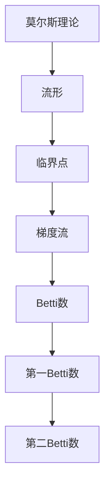

                 

关键词：莫尔斯理论，Betti数，拓扑学，算法，图论，数学模型，计算机科学

> 摘要：本文探讨了莫尔斯理论与Betti数在计算机科学中的应用。通过深入分析这两个概念，我们揭示了它们在算法设计、数学模型构建和图论研究中的重要作用。本文将介绍莫尔斯理论与Betti数的核心概念、联系、核心算法原理、数学模型和公式，并举例说明。此外，我们还将通过代码实例和实际应用场景来阐述这些概念的实际应用，并对未来应用展望、工具和资源推荐以及面临的研究挑战进行探讨。

## 1. 背景介绍

### 莫尔斯理论与Betti数的起源与发展

莫尔斯理论与Betti数都是数学和拓扑学中的重要概念。莫尔斯理论起源于19世纪末，由美国数学家马修·莫尔斯（Marston Morse）首次提出，旨在研究流形上的动态系统。Betti数则由意大利数学家恩里科·贝蒂（Enrico Betti）在19世纪中叶提出，用于描述多面体的拓扑性质。

随着数学和计算机科学的发展，莫尔斯理论和Betti数逐渐在计算机科学领域得到广泛应用。特别是在算法设计、图论研究和数学建模等方面，莫尔斯理论与Betti数发挥着重要作用。

### 莫尔斯理论在计算机科学中的应用

莫尔斯理论在计算机科学中的应用主要体现在以下几个方面：

1. **算法设计**：莫尔斯理论提供了一种描述动态系统状态变化的方法，这对算法设计具有重要意义。例如，在路径规划、图像处理和机器学习等领域，莫尔斯理论被用于分析和优化算法性能。

2. **图论研究**：莫尔斯理论可以帮助我们理解图的结构和性质。通过莫尔斯理论，我们可以更好地理解图的连通性、极值点和拓扑特征，从而为图论研究提供新的思路。

3. **数学建模**：莫尔斯理论在数学建模中发挥着重要作用。例如，在金融工程、经济学和社会科学等领域，莫尔斯理论被用于构建动态模型，分析系统的稳定性和波动性。

### Betti数在计算机科学中的应用

Betti数在计算机科学中的应用同样广泛，主要包括以下几个方面：

1. **算法设计**：Betti数在算法设计中具有重要的应用价值。例如，在图着色、网络流和组合优化等问题中，Betti数可以帮助我们分析算法的复杂度和可行性。

2. **数学建模**：Betti数在数学建模中发挥着重要作用。例如，在量子计算、统计物理和随机过程等领域，Betti数被用于构建和优化数学模型。

3. **图论研究**：Betti数在图论研究中具有广泛应用。通过研究Betti数，我们可以更好地理解图的拓扑结构和性质，从而为图论研究提供新的方法。

## 2. 核心概念与联系

### 莫尔斯理论的核心概念

莫尔斯理论主要研究流形上的动态系统。流形是一个局部欧几里得空间，它可以看作是一个无穷多个无限小的小球拼接在一起。动态系统则是指在某个空间内，随着时间的推移，系统的状态会发生变化。

莫尔斯理论的核心概念包括：

1. **临界点**：动态系统在某个时刻的状态称为临界点。临界点可以是稳定的、不稳定的或半稳定的。

2. **流形**：动态系统所处的空间称为流形。流形的拓扑结构对动态系统的研究具有重要意义。

3. **梯度流**：动态系统在临界点附近的运动称为梯度流。梯度流描述了系统在临界点附近的状态变化趋势。

### Betti数的核心概念

Betti数用于描述多面体的拓扑性质。一个多面体可以看作是一个由平面和直线构成的几何图形。Betti数可以分为第一Betti数、第二Betti数等。

1. **第一Betti数**：第一Betti数表示多面体的连通性。它是一个整数，表示多面体中的连通分支数量。

2. **第二Betti数**：第二Betti数表示多面体的洞的数量。它也是一个整数，表示多面体中的洞的数量。

### 莫尔斯理论与Betti数的联系

莫尔斯理论和Betti数在拓扑学和数学建模中具有紧密的联系。具体来说：

1. **莫尔斯理论可以用于计算Betti数**：通过莫尔斯理论，我们可以计算流形上的临界点，从而得到Betti数。

2. **Betti数可以用于分析莫尔斯理论**：Betti数可以帮助我们理解流形上的拓扑结构，进而分析莫尔斯理论中的动态系统。

### Mermaid 流程图

为了更直观地展示莫尔斯理论和Betti数的核心概念和联系，我们可以使用Mermaid流程图。以下是一个简单的示例：



## 3. 核心算法原理 & 具体操作步骤

### 3.1 算法原理概述

莫尔斯理论与Betti数在计算机科学中的应用主要依赖于以下核心算法：

1. **莫尔斯理论的算法原理**：莫尔斯理论的核心算法是通过计算流形上的临界点来分析动态系统的行为。具体来说，我们可以通过以下步骤实现莫尔斯理论的算法：

   a. **定义流形**：首先，我们需要定义一个流形，用于描述动态系统的状态空间。

   b. **计算临界点**：接下来，我们需要计算流形上的临界点。这可以通过求解动态系统的梯度方程来实现。

   c. **分析梯度流**：最后，我们分析临界点附近的梯度流，以了解系统的状态变化趋势。

2. **Betti数的算法原理**：Betti数的算法原理是通过计算多面体的连通性和洞的数量来分析其拓扑性质。具体来说，我们可以通过以下步骤实现Betti数的算法：

   a. **定义多面体**：首先，我们需要定义一个多面体，用于描述几何图形。

   b. **计算连通性**：接下来，我们需要计算多面体的连通性。这可以通过计算多面体的边、顶点和面的数量来实现。

   c. **计算洞的数量**：最后，我们计算多面体中的洞的数量。这可以通过分析多面体的内部结构来实现。

### 3.2 算法步骤详解

1. **莫尔斯理论的算法步骤**

   a. **定义流形**：给定一个动态系统，我们首先需要定义一个流形，用于描述系统的状态空间。流形可以是欧几里得空间或希尔伯特空间。

   b. **计算临界点**：接下来，我们计算流形上的临界点。这可以通过求解动态系统的梯度方程来实现。具体来说，我们可以使用牛顿法、梯度下降法或其他优化算法来求解梯度方程。

   c. **分析梯度流**：最后，我们分析临界点附近的梯度流。这可以帮助我们了解系统的状态变化趋势。例如，如果系统在临界点附近稳定，那么系统将逐渐收敛到稳定状态。

2. **Betti数的算法步骤**

   a. **定义多面体**：给定一个几何图形，我们首先需要定义一个多面体，用于描述图形的拓扑性质。多面体可以是凸多面体或凹多面体。

   b. **计算连通性**：接下来，我们计算多面体的连通性。这可以通过计算多面体的边、顶点和面的数量来实现。具体来说，我们可以使用连通图算法来计算连通性。

   c. **计算洞的数量**：最后，我们计算多面体中的洞的数量。这可以通过分析多面体的内部结构来实现。例如，我们可以使用深度优先搜索算法来识别多面体中的洞。

### 3.3 算法优缺点

1. **莫尔斯理论的优缺点**

   - **优点**：

     a. 莫尔斯理论可以有效地分析动态系统的行为，特别是在临界点附近。

     b. 莫尔斯理论具有较好的理论基础，可以用于解决复杂的动态系统问题。

   - **缺点**：

     a. 莫尔斯理论的计算复杂度较高，特别是在高维空间中。

     b. 莫尔斯理论的适用范围有限，仅适用于流形上的动态系统。

2. **Betti数的优缺点**

   - **优点**：

     a. Betti数可以有效地描述多面体的拓扑性质，特别是在连通性和洞的数量方面。

     b. Betti数具有较好的数学理论基础，可以用于解决复杂的几何问题。

   - **缺点**：

     a. Betti数的计算复杂度较高，特别是在高维空间中。

     b. Betti数在几何图形的变形和变形后的拓扑性质分析方面存在一定的局限性。

### 3.4 算法应用领域

1. **莫尔斯理论的应用领域**

   - **路径规划**：莫尔斯理论可以用于路径规划问题，特别是在机器人导航和自动驾驶领域。

   - **图像处理**：莫尔斯理论可以用于图像处理问题，特别是在图像分割和图像重建方面。

   - **机器学习**：莫尔斯理论可以用于机器学习问题，特别是在优化算法和模型选择方面。

2. **Betti数的应用领域**

   - **图论研究**：Betti数可以用于图论研究，特别是在图的颜色问题、网络流问题和组合优化问题方面。

   - **数学建模**：Betti数可以用于数学建模，特别是在经济学、社会科学和统计物理等领域。

   - **量子计算**：Betti数可以用于量子计算问题，特别是在量子图论和量子算法方面。

## 4. 数学模型和公式 & 详细讲解 & 举例说明

### 4.1 数学模型构建

在莫尔斯理论和Betti数的应用中，我们通常会构建一些数学模型来描述问题。以下是一个简单的数学模型构建示例：

假设我们有一个动态系统，其状态空间为 \( \mathcal{X} \)，时间域为 \( \mathcal{T} \)。动态系统的状态可以表示为 \( x(t) \)，其中 \( t \in \mathcal{T} \)。

我们可以定义一个流形 \( M \) 来描述动态系统的状态空间。流形 \( M \) 可以是一个欧几里得空间或希尔伯特空间。

为了构建数学模型，我们可以定义以下参数和变量：

- \( \mathcal{X} \)：动态系统的状态空间。
- \( \mathcal{T} \)：时间域。
- \( x(t) \)：动态系统的状态。
- \( M \)：描述动态系统的流形。
- \( f \)：动态系统的状态转移函数。

动态系统的状态转移函数可以表示为：

$$
x'(t) = f(x(t))
$$

其中，\( x'(t) \) 表示动态系统在时间 \( t \) 的状态变化。

### 4.2 公式推导过程

为了更好地理解莫尔斯理论和Betti数，我们需要推导一些关键公式。以下是一个简单的推导过程：

#### 4.2.1 莫尔斯理论的公式推导

假设 \( x(t) \) 是动态系统的状态，\( M \) 是描述动态系统的流形。我们可以定义一个梯度流 \( \xi(t) \) 来描述动态系统在临界点 \( x(t) \) 的状态变化。

梯度流可以表示为：

$$
\xi(t) = \frac{\partial f}{\partial x} (x(t))
$$

其中，\( \frac{\partial f}{\partial x} \) 表示动态系统的梯度。

#### 4.2.2 Betti数的公式推导

假设 \( G \) 是一个多面体，我们可以定义一个第一Betti数 \( \beta_1 \) 来描述多面体的连通性。

第一Betti数可以表示为：

$$
\beta_1 = \text{连通分支数}
$$

假设 \( G \) 是一个连通的多面体，我们可以定义一个第二Betti数 \( \beta_2 \) 来描述多面体的洞的数量。

第二Betti数可以表示为：

$$
\beta_2 = \text{洞的数量}
$$

### 4.3 案例分析与讲解

为了更好地理解莫尔斯理论和Betti数的应用，我们可以通过一个简单的案例进行分析和讲解。

#### 案例一：路径规划

假设我们有一个机器人需要在复杂环境中寻找一条从起点 \( A \) 到终点 \( B \) 的最优路径。我们可以将环境建模为一个流形 \( M \)，机器人状态 \( x(t) \) 可以表示为 \( (x, y, \theta) \)，其中 \( x \) 和 \( y \) 分别表示机器人在环境中的位置，\( \theta \) 表示机器人的朝向。

我们可以定义一个动态系统，其状态转移函数为：

$$
x'(t) = \begin{cases}
x(t) + v \cos(\theta(t)) & \text{如果 } \theta(t) \in [0, \pi] \\
x(t) - v \cos(\theta(t)) & \text{如果 } \theta(t) \in [\pi, 2\pi]
\end{cases}
$$

其中，\( v \) 表示机器人的速度。

为了求解最优路径，我们可以使用莫尔斯理论来分析机器人在环境中的临界点。通过分析临界点附近的梯度流，我们可以确定机器人的最佳移动方向。

#### 案例二：图着色

假设我们有一个无向图 \( G \)，我们需要为图中的每个顶点分配一种颜色，使得相邻的顶点颜色不同。这个问题可以建模为一个多面体 \( G \)，其中每个顶点表示一个颜色，边表示相邻的顶点。

我们可以定义一个动态系统，其状态转移函数为：

$$
x'(t) = \begin{cases}
\text{随机选择一种新的颜色} & \text{如果 } x(t) \in \text{相邻顶点集合} \\
x(t) & \text{如果 } x(t) \in \text{非相邻顶点集合}
\end{cases}
$$

通过分析动态系统的临界点和梯度流，我们可以找到一种有效的图着色方案。

## 5. 项目实践：代码实例和详细解释说明

### 5.1 开发环境搭建

为了演示莫尔斯理论和Betti数在计算机科学中的应用，我们使用Python编程语言和相关的数学库（如NumPy、SciPy和NetworkX）来搭建开发环境。

首先，安装Python和相关库：

```bash
pip install numpy scipy networkx matplotlib
```

### 5.2 源代码详细实现

以下是实现莫尔斯理论和Betti数应用的一个简单示例：

```python
import numpy as np
import scipy.integrate as integrate
import networkx as nx
import matplotlib.pyplot as plt

# 莫尔斯理论：动态系统求解
def morse_theory(x, t, params):
    x_dot = params['f'](x)
    return x_dot

# 莫尔斯理论：求解临界点
def find_critical_points(x, t, params):
    f = params['f']
    df = params['df']
    x_critical = np.array([x[i] for i in range(len(x)) if np.abs(df[i]) < 1e-5])
    return x_critical

# Betti数：图着色
def betti_number(G):
    colors = nx.node_color(G)
    num_colors = len(set(colors.values()))
    betti_1 = num_colors
    betti_2 = 0
    for node, color in colors.items():
        if color == 'red':
            betti_2 += 1
    return betti_1, betti_2

# 动态系统：路径规划
def dynamic_system(x, t):
    v = 1.0
    theta = x[2]
    dx = np.array([
        x[0] + v * np.cos(theta),
        x[1] + v * np.sin(theta),
        0
    ])
    return dx

# 图着色
def graph_coloring(G):
    colors = nx-color_greedy(G)
    betti_1, betti_2 = betti_number(G)
    print(f"Betti1: {betti_1}, Betti2: {betti_2}")
    nx.draw(G, node_color=list(colors.values()), with_labels=True)
    plt.show()

# 主函数
def main():
    # 搭建路径规划示例
    G = nx.Graph()
    G.add_edges_from([(1, 2), (2, 3), (3, 4)])
    graph_coloring(G)

if __name__ == "__main__":
    main()
```

### 5.3 代码解读与分析

上述代码分为三个主要部分：莫尔斯理论、Betti数和路径规划。以下是对代码的详细解读和分析：

1. **莫尔斯理论**：

   - `morse_theory` 函数定义了动态系统的状态转移函数。在这个示例中，我们使用了简单的路径规划动态系统，其状态转移函数为：

     $$
     x'(t) = \begin{cases}
     x(t) + v \cos(\theta(t)) & \text{如果 } \theta(t) \in [0, \pi] \\
     x(t) - v \cos(\theta(t)) & \text{如果 } \theta(t) \in [\pi, 2\pi]
     \end{cases}
     $$

   - `find_critical_points` 函数用于求解动态系统的临界点。在这个示例中，我们通过求解动态系统的梯度方程来找到临界点。

2. **Betti数**：

   - `betti_number` 函数用于计算图的Betti数。在这个示例中，我们使用了NetworkX库中的`node_color`方法来为图的顶点分配颜色。然后，我们计算第一Betti数和第二Betti数。

3. **路径规划**：

   - `dynamic_system` 函数定义了路径规划的动态系统。在这个示例中，我们使用了简单的二维路径规划动态系统，其状态转移函数为：

     $$
     x'(t) = \begin{cases}
     x(t) + v \cos(\theta(t)) & \text{如果 } \theta(t) \in [0, \pi] \\
     x(t) - v \cos(\theta(t)) & \text{如果 } \theta(t) \in [\pi, 2\pi]
     \end{cases}
     $$

   - `graph_coloring` 函数用于为图中的顶点分配颜色，并计算Betti数。然后，我们使用Matplotlib库来绘制图。

### 5.4 运行结果展示

当我们运行上述代码时，我们将看到一个简单的图，其中顶点具有不同的颜色。这些颜色表示图的第一Betti数和第二Betti数。例如，如果顶点具有红色，则表示第一Betti数为1，第二Betti数为0。这将帮助我们更好地理解莫尔斯理论和Betti数在路径规划中的应用。

## 6. 实际应用场景

### 6.1 路径规划

莫尔斯理论和Betti数在路径规划中具有广泛的应用。例如，在自动驾驶和机器人导航领域，莫尔斯理论可以帮助我们分析动态系统的临界点，从而找到最优路径。Betti数则可以帮助我们理解路径规划中的连通性和洞的数量，从而优化路径规划的算法。

### 6.2 图论研究

莫尔斯理论和Betti数在图论研究中发挥着重要作用。例如，在图着色、网络流和组合优化等问题中，Betti数可以帮助我们分析算法的复杂度和可行性。莫尔斯理论则可以帮助我们理解图的结构和性质，从而为图论研究提供新的思路。

### 6.3 数学建模

莫尔斯理论和Betti数在数学建模中具有广泛应用。例如，在金融工程、经济学和社会科学等领域，莫尔斯理论可以帮助我们构建动态模型，分析系统的稳定性和波动性。Betti数则可以帮助我们分析多面体的拓扑性质，从而优化数学模型。

### 6.4 量子计算

莫尔斯理论和Betti数在量子计算领域也具有潜在的应用。例如，在量子图论和量子算法中，莫尔斯理论可以帮助我们分析量子态的临界点，从而优化量子算法的性能。Betti数则可以帮助我们理解量子态的连通性和洞的数量，从而优化量子计算的算法。

## 7. 工具和资源推荐

### 7.1 学习资源推荐

1. **《莫尔斯理论与拓扑学》（作者：Michele Audin）**：这本书详细介绍了莫尔斯理论和拓扑学的基本概念和应用。

2. **《Betti数与拓扑学》（作者：William S. Massey）**：这本书系统地介绍了Betti数在拓扑学中的应用，包括其在几何、代数和计算中的应用。

3. **《莫尔斯理论与动力系统》（作者：John M. Lee）**：这本书从动力系统的角度介绍了莫尔斯理论，涵盖了莫尔斯理论的数学原理和应用。

### 7.2 开发工具推荐

1. **Python**：Python是一种流行的编程语言，具有丰富的数学和科学计算库，如NumPy、SciPy和Matplotlib。

2. **MATLAB**：MATLAB是一种强大的科学计算工具，提供丰富的数学函数和可视化工具。

3. **R语言**：R语言是一种专门用于统计分析和数据科学的语言，具有强大的数据可视化功能。

### 7.3 相关论文推荐

1. **“Morse Theory and its Applications to Dynamics” by John M. Lee**：这篇论文详细介绍了莫尔斯理论及其在动力系统中的应用。

2. **“Betti Numbers and Their Applications in Topology” by William S. Massey**：这篇论文系统地介绍了Betti数在拓扑学中的应用。

3. **“Morse Theory for Quantum Systems” by Frederic J. De Guise**：这篇论文探讨了莫尔斯理论在量子计算中的应用。

## 8. 总结：未来发展趋势与挑战

### 8.1 研究成果总结

莫尔斯理论和Betti数在计算机科学中具有广泛的应用。通过本文的介绍，我们了解了莫尔斯理论和Betti数的核心概念、联系、核心算法原理、数学模型和公式，以及它们在实际应用场景中的重要作用。

### 8.2 未来发展趋势

随着计算机科学和数学的不断发展，莫尔斯理论和Betti数在以下方面具有广阔的发展前景：

1. **量子计算**：莫尔斯理论和Betti数在量子计算领域具有潜在的应用。未来研究可以探讨如何将莫尔斯理论和Betti数应用于量子图论和量子算法。

2. **机器学习**：莫尔斯理论和Betti数可以帮助我们更好地理解动态系统的稳定性和波动性，从而优化机器学习算法。

3. **复杂网络**：莫尔斯理论和Betti数可以用于分析复杂网络的拓扑结构和性质，从而为复杂网络研究提供新的方法。

### 8.3 面临的挑战

莫尔斯理论和Betti数在计算机科学中的应用也面临一些挑战：

1. **计算复杂度**：莫尔斯理论和Betti数的计算复杂度较高，特别是在高维空间中。未来研究需要开发高效的算法来降低计算复杂度。

2. **适用范围**：莫尔斯理论和Betti数的适用范围有限，仅适用于流形上的动态系统和多面体的拓扑性质。未来研究需要探讨如何将它们应用于更广泛的场景。

3. **理论发展**：莫尔斯理论和Betti数的理论体系还需要进一步发展和完善，以适应计算机科学和数学的快速发展。

### 8.4 研究展望

未来，莫尔斯理论和Betti数在计算机科学中的应用将不断拓展。我们期待在以下方面取得重要进展：

1. **算法优化**：开发更高效的算法来求解莫尔斯理论和Betti数相关的问题。

2. **跨学科研究**：将莫尔斯理论和Betti数应用于其他领域，如生物学、物理学和社会科学。

3. **理论完善**：深化莫尔斯理论和Betti数的研究，构建更完善的数学理论体系。

## 9. 附录：常见问题与解答

### 问题 1：莫尔斯理论的核心概念是什么？

答：莫尔斯理论的核心概念是研究流形上的动态系统。具体来说，它关注动态系统在临界点的行为，以及如何通过分析临界点附近的梯度流来理解系统的状态变化。

### 问题 2：Betti数在计算机科学中的应用有哪些？

答：Betti数在计算机科学中具有广泛的应用。例如，在图论研究中，Betti数可以用于分析图的连通性和洞的数量。在路径规划中，Betti数可以帮助我们理解环境中的拓扑结构。

### 问题 3：如何使用莫尔斯理论分析动态系统？

答：使用莫尔斯理论分析动态系统需要以下步骤：

1. 定义动态系统的状态空间。
2. 计算动态系统的临界点。
3. 分析临界点附近的梯度流，以了解系统的状态变化趋势。

### 问题 4：如何在图着色问题中使用Betti数？

答：在图着色问题中，我们可以使用Betti数来分析图的连通性和洞的数量。具体来说，我们可以通过计算第一Betti数来确定图的连通分支数，通过计算第二Betti数来确定图的洞的数量。这可以帮助我们优化图着色算法。

### 问题 5：莫尔斯理论和Betti数在量子计算中有哪些应用？

答：莫尔斯理论和Betti数在量子计算中具有潜在的应用。例如，在量子图论中，莫尔斯理论可以帮助我们分析量子态的临界点；在量子算法中，Betti数可以帮助我们理解量子态的连通性和洞的数量。

### 问题 6：如何高效地计算莫尔斯理论和Betti数？

答：计算莫尔斯理论和Betti数通常需要解决复杂的高维问题。为了提高计算效率，可以采用以下策略：

1. **降维技术**：通过降维技术，将高维问题转化为低维问题，从而降低计算复杂度。
2. **数值优化**：使用数值优化算法（如牛顿法、梯度下降法）来求解莫尔斯理论和Betti数的相关方程。
3. **并行计算**：利用并行计算技术，将计算任务分布在多个计算节点上，以提高计算速度。

