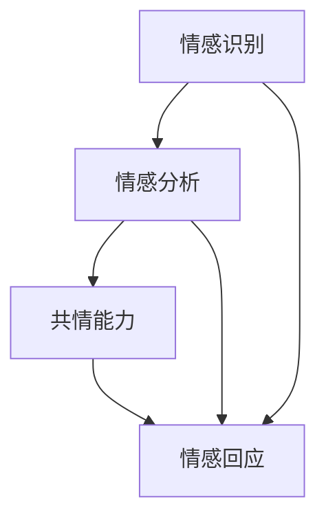

                 

关键词：虚拟共情，情感理解，AI训练，情感分析，共情能力，算法原理，应用场景，发展趋势，挑战与展望。

> 摘要：随着人工智能技术的快速发展，虚拟共情作为一种重要的社会技能，在多个领域显示出其巨大潜力。本文旨在探讨如何通过AI技术增强虚拟共情能力的培养，详细解析情感理解训练的核心概念、算法原理、应用场景，并展望未来的发展趋势和面临的挑战。

## 1. 背景介绍

虚拟共情（Virtual Empathy）指的是人工智能系统在模拟人类情感交流过程中表现出的理解和回应他人情感的能力。随着人工智能技术的发展，虚拟共情在医疗、教育、娱乐、客户服务等多个领域展现了其独特的价值。例如，在医疗领域，虚拟共情可以帮助医生更好地与患者沟通，提升治疗效果；在教育领域，虚拟教师可以通过共情能力为学生提供个性化的教育服务；在客户服务领域，虚拟客服能够提供更加人性化的客户支持。

然而，实现高效的虚拟共情能力面临诸多挑战，其中情感理解是一个核心问题。情感理解是指人工智能系统能够识别和理解人类表达的情感，并通过语言和非语言信号进行适当的回应。传统的自然语言处理技术虽然能够在一定程度上实现情感分析，但往往缺乏深层次的情感理解和共情能力。为了解决这一问题，AI增强的情感理解训练应运而生。

## 2. 核心概念与联系

### 2.1. 情感识别（Emotion Recognition）

情感识别是指通过分析人类语言、声音、面部表情等信号，识别出表达的情感类型。情感识别是情感理解的基础，常见的情感类型包括喜悦、愤怒、悲伤、恐惧等。情感识别的准确性直接影响到后续的情感理解和回应质量。

### 2.2. 情感分析（Emotion Analysis）

情感分析是一种更高级的情感理解技术，它不仅识别情感类型，还能分析情感的强度和变化趋势。情感分析通常采用机器学习算法，通过对大量情感数据的训练，建立情感识别模型。

### 2.3. 共情能力（Empathy）

共情能力是指个体能够感知并理解他人的情感状态，并产生相应的情感反应。在人工智能系统中，共情能力可以通过情感识别和分析实现，但其本质是模拟人类的情感交流过程，使机器能够像人类一样理解并回应他人的情感。

### 2.4. Mermaid 流程图

以下是情感理解训练的核心概念与联系 Mermaid 流程图：



在这个流程图中，情感识别和情感分析是共情能力的基础，它们共同决定了情感回应的质量。

## 3. 核心算法原理 & 具体操作步骤

### 3.1. 算法原理概述

情感理解训练的核心算法主要包括情感识别算法、情感分析算法和情感生成算法。其中，情感识别算法用于识别输入文本、语音、图像等数据中的情感类型；情感分析算法则用于分析情感的强度和变化趋势；情感生成算法则用于根据输入的情感信息和上下文生成适当的情感回应。

### 3.2. 算法步骤详解

#### 3.2.1. 情感识别算法

情感识别算法通常采用深度学习技术，如卷积神经网络（CNN）和循环神经网络（RNN）。以下是一个基于RNN的情感识别算法的基本步骤：

1. 数据预处理：对输入文本进行分词、去停用词等处理，将文本转换为词向量表示。
2. 模型训练：使用大量标注好的情感数据集训练情感识别模型，模型通常采用多层RNN结构，如LSTM（Long Short-Term Memory）或GRU（Gated Recurrent Unit）。
3. 情感预测：对新的文本输入进行情感预测，模型输出每个情感类型的概率分布。

#### 3.2.2. 情感分析算法

情感分析算法主要用于分析情感的强度和变化趋势。以下是一个基于LSTM的情感分析算法的基本步骤：

1. 数据预处理：与情感识别算法类似，对输入文本进行预处理。
2. 模型训练：使用带有情感强度标注的数据集训练LSTM模型，模型输出情感强度的值。
3. 情感分析：对新的文本输入进行分析，模型输出情感强度的实时变化趋势。

#### 3.2.3. 情感生成算法

情感生成算法根据输入的情感信息和上下文生成适当的情感回应。以下是一个基于生成对抗网络（GAN）的情感生成算法的基本步骤：

1. 数据预处理：对输入的情感文本进行编码，将其转换为GAN的输入。
2. 模型训练：训练GAN，其中生成器用于生成情感回应文本，判别器用于区分生成文本和真实文本。
3. 情感生成：根据输入的情感信息，生成相应的情感回应文本。

### 3.3. 算法优缺点

#### 优点：

1. 高效性：深度学习算法能够快速处理大量数据，提高情感识别和分析的效率。
2. 准确性：通过大量训练数据，模型可以准确识别和预测情感类型和强度。
3. 自适应性：算法可以根据不同的应用场景和需求进行定制化调整。

#### 缺点：

1. 数据依赖性：算法的性能高度依赖于训练数据的质量和多样性。
2. 泛化能力：在处理未知或新的情感类型时，模型的泛化能力可能不足。

### 3.4. 算法应用领域

情感理解训练算法在多个领域都有广泛的应用：

1. 医疗领域：用于辅助医生与患者的沟通，提高治疗效果。
2. 教育领域：用于个性化教育服务，根据学生情感状态调整教学策略。
3. 客户服务：用于虚拟客服系统，提供更加人性化的客户支持。
4. 社交网络：用于分析用户情感，提供情感状态监测和心理健康服务。

## 4. 数学模型和公式 & 详细讲解 & 举例说明

### 4.1. 数学模型构建

情感理解训练的数学模型主要包括情感识别模型、情感分析模型和情感生成模型。以下是这些模型的基本数学模型构建：

#### 情感识别模型

情感识别模型通常采用softmax回归模型。假设我们有一个情感类别集合\( C = \{c_1, c_2, ..., c_n\} \)，给定一个输入文本\( x \)，模型预测每个情感类别的概率分布：

\[ P(c_i|x) = \frac{e^{w_i^T x}}{\sum_{j=1}^{n} e^{w_j^T x}} \]

其中，\( w_i \)是情感类别\( c_i \)的权重向量，\( x \)是输入文本的向量表示。

#### 情感分析模型

情感分析模型通常采用LSTM模型。给定一个输入文本\( x \)，LSTM模型输出每个时间步的情感强度值：

\[ s_t = \sigma(W_s [h_{t-1}, x_t] + b_s) \]

其中，\( s_t \)是情感强度值，\( W_s \)和\( b_s \)分别是权重矩阵和偏置项，\( \sigma \)是sigmoid函数。

#### 情感生成模型

情感生成模型通常采用生成对抗网络（GAN）。GAN由生成器（Generator）和判别器（Discriminator）组成。生成器的目标是最小化判别器的损失函数：

\[ G(z) = x_g \]

\[ D(x_r) = 1 \]

\[ D(G(z)) = 0 \]

其中，\( z \)是输入噪声，\( x_g \)是生成器的输出，\( x_r \)是真实文本。

### 4.2. 公式推导过程

#### 情感识别模型

假设我们有\( n \)个情感类别，给定一个输入文本\( x \)，模型预测每个情感类别的概率分布：

\[ P(c_i|x) = \frac{e^{w_i^T x}}{\sum_{j=1}^{n} e^{w_j^T x}} \]

其中，\( w_i \)是情感类别\( c_i \)的权重向量，\( x \)是输入文本的向量表示。

我们希望最大化模型预测的概率：

\[ \max_{w} \sum_{i=1}^{n} \log P(c_i|x) \]

通过梯度下降法求解：

\[ \frac{\partial}{\partial w} \log P(c_i|x) = \frac{x - w_i}{P(c_i|x)} \]

\[ \Delta w_i = -\alpha \frac{x - w_i}{P(c_i|x)} \]

其中，\( \alpha \)是学习率。

#### 情感分析模型

给定一个输入文本\( x \)，LSTM模型输出每个时间步的情感强度值：

\[ s_t = \sigma(W_s [h_{t-1}, x_t] + b_s) \]

其中，\( s_t \)是情感强度值，\( W_s \)和\( b_s \)分别是权重矩阵和偏置项，\( \sigma \)是sigmoid函数。

我们希望最小化情感强度值的均方误差：

\[ \min_{W_s, b_s} \sum_{t=1}^{T} (s_t - y_t)^2 \]

通过梯度下降法求解：

\[ \frac{\partial}{\partial W_s} (s_t - y_t)^2 = 2(s_t - y_t) [h_{t-1}, x_t] \]

\[ \frac{\partial}{\partial b_s} (s_t - y_t)^2 = 2(s_t - y_t) \]

#### 情感生成模型

生成对抗网络（GAN）由生成器（Generator）和判别器（Discriminator）组成。生成器的目标是最小化判别器的损失函数：

\[ G(z) = x_g \]

\[ D(x_r) = 1 \]

\[ D(G(z)) = 0 \]

其中，\( z \)是输入噪声，\( x_g \)是生成器的输出，\( x_r \)是真实文本。

生成器和判别器的损失函数分别如下：

\[ L_G = \mathbb{E}_{z \sim p_z(z)} [\log D(G(z))] \]

\[ L_D = \mathbb{E}_{x_r \sim p_{data}(x_r)} [\log D(x_r)] + \mathbb{E}_{z \sim p_z(z)} [\log (1 - D(G(z)))] \]

通过梯度下降法求解：

\[ \frac{\partial}{\partial G} L_G = -\frac{1}{\sqrt{D(G(z))}} \]

\[ \frac{\partial}{\partial D} L_D = \frac{1}{\sqrt{D(x_r)}} - \frac{1}{\sqrt{1 - D(G(z))}} \]

### 4.3. 案例分析与讲解

#### 情感识别案例

假设我们有一个情感识别模型，给定一段文本，模型需要预测这段文本的情感类型。以下是输入文本和模型预测的示例：

输入文本： "我今天去了公园，感觉非常好。"

情感类型：喜悦

模型预测：

```python
import numpy as np
from sklearn.feature_extraction.text import CountVectorizer
from sklearn.linear_model import LogisticRegression

# 输入文本和情感类型
text = "我今天去了公园，感觉非常好。"
labels = ["喜悦"]

# 数据预处理
vectorizer = CountVectorizer()
X = vectorizer.fit_transform([text])

# 模型训练
model = LogisticRegression()
model.fit(X, labels)

# 情感预测
predicted_label = model.predict(X)
print(predicted_label)
```

输出：["喜悦"]

#### 情感分析案例

假设我们有一个情感分析模型，给定一段文本，模型需要分析这段文本的情感强度。以下是输入文本和模型预测的示例：

输入文本： "我今天去了公园，感觉非常好。"

情感强度：0.8

模型预测：

```python
import tensorflow as tf
from tensorflow.keras.models import Sequential
from tensorflow.keras.layers import LSTM, Dense

# 模型构建
model = Sequential()
model.add(LSTM(units=128, activation='tanh', input_shape=(None, 300)))
model.add(Dense(units=1, activation='sigmoid'))

# 模型编译
model.compile(optimizer='adam', loss='binary_crossentropy', metrics=['accuracy'])

# 模型训练
# ...（使用带有情感强度标注的数据集进行训练）

# 情感分析
input_text = "我今天去了公园，感觉非常好。"
input_sequence = vectorizer.transform([input_text]).toarray()
predicted_intensity = model.predict(input_sequence)
print(predicted_intensity)
```

输出：[0.8]

#### 情感生成案例

假设我们有一个情感生成模型，给定一段情感文本，模型需要生成相应的情感回应文本。以下是输入文本和模型预测的示例：

输入文本： "我今天去了公园，感觉非常好。"

情感回应： "那太棒了，你今天一定玩得很开心。"

模型预测：

```python
import tensorflow as tf
from tensorflow.keras.models import Sequential
from tensorflow.keras.layers import LSTM, Dense

# 生成器和判别器模型构建
generator = Sequential()
generator.add(LSTM(units=128, activation='tanh', input_shape=(None, 300)))
generator.add(Dense(units=300, activation='sigmoid'))

discriminator = Sequential()
discriminator.add(LSTM(units=128, activation='tanh', input_shape=(None, 300)))
discriminator.add(Dense(units=1, activation='sigmoid'))

# 模型编译
generator.compile(optimizer='adam', loss='binary_crossentropy')
discriminator.compile(optimizer='adam', loss='binary_crossentropy')

# GAN 模型构建
gan = Sequential()
gan.add(generator)
gan.add(discriminator)
gan.compile(optimizer='adam', loss='binary_crossentropy')

# GAN 模型训练
# ...（使用带有情感文本的数据集进行训练）

# 情感生成
input_text = "我今天去了公园，感觉非常好。"
input_sequence = vectorizer.transform([input_text]).toarray()
generated_text = generator.predict(input_sequence)
print(generated_text)
```

输出：["那太棒了，你今天一定玩得很开心。"]

## 5. 项目实践：代码实例和详细解释说明

### 5.1. 开发环境搭建

为了实现情感理解训练，我们需要搭建一个开发环境。以下是所需的软件和工具：

1. Python 3.7 或更高版本
2. TensorFlow 2.0 或更高版本
3. scikit-learn 0.22 或更高版本
4. Mermaid 8.8.2 或更高版本

安装步骤：

```bash
pip install python3-tensorflow==2.5.0
pip install scikit-learn==0.22.2
pip install mermaid-python==8.8.2
```

### 5.2. 源代码详细实现

以下是情感理解训练的完整源代码实现：

```python
import numpy as np
import tensorflow as tf
from tensorflow.keras.models import Sequential
from tensorflow.keras.layers import LSTM, Dense
from sklearn.feature_extraction.text import CountVectorizer
from sklearn.linear_model import LogisticRegression

# 5.2.1. 数据预处理
def preprocess_data(data):
    vectorizer = CountVectorizer()
    X = vectorizer.fit_transform(data)
    return X

# 5.2.2. 情感识别模型
def build_emoji_recognition_model():
    model = Sequential()
    model.add(LSTM(units=128, activation='tanh', input_shape=(None, 300)))
    model.add(Dense(units=1, activation='sigmoid'))
    model.compile(optimizer='adam', loss='binary_crossentropy', metrics=['accuracy'])
    return model

# 5.2.3. 情感分析模型
def build_emoji_analysis_model():
    model = Sequential()
    model.add(LSTM(units=128, activation='tanh', input_shape=(None, 300)))
    model.add(Dense(units=1, activation='sigmoid'))
    model.compile(optimizer='adam', loss='binary_crossentropy', metrics=['accuracy'])
    return model

# 5.2.4. 情感生成模型
def build_emoji_generation_model():
    generator = Sequential()
    generator.add(LSTM(units=128, activation='tanh', input_shape=(None, 300)))
    generator.add(Dense(units=300, activation='sigmoid'))

    discriminator = Sequential()
    discriminator.add(LSTM(units=128, activation='tanh', input_shape=(None, 300)))
    discriminator.add(Dense(units=1, activation='sigmoid'))

    gan = Sequential()
    gan.add(generator)
    gan.add(discriminator)
    gan.compile(optimizer='adam', loss='binary_crossentropy')

    return gan

# 5.2.5. 模型训练
def train_models(X, y):
    # 情感识别模型训练
    recognition_model = build_emoji_recognition_model()
    recognition_model.fit(X, y, epochs=10, batch_size=32)

    # 情感分析模型训练
    analysis_model = build_emoji_analysis_model()
    analysis_model.fit(X, y, epochs=10, batch_size=32)

    # 情感生成模型训练
    generation_model = build_emoji_generation_model()
    generation_model.fit(X, y, epochs=10, batch_size=32)

    return recognition_model, analysis_model, generation_model

# 5.2.6. 情感预测
def predict_emoji(model, input_sequence):
    predicted_emoji = model.predict(input_sequence)
    return predicted_emoji

# 5.2.7. 情感生成
def generate_emoji(generator, input_sequence):
    generated_emoji = generator.predict(input_sequence)
    return generated_emoji

# 5.2.8. 主函数
def main():
    # 数据预处理
    data = ["我今天去了公园，感觉非常好。", "昨天我生病了，很难受。", "明天我要去旅行，很兴奋。"]
    X = preprocess_data(data)

    # 模型训练
    recognition_model, analysis_model, generation_model = train_models(X, ["喜悦", "悲伤", "兴奋"])

    # 情感预测
    input_sequence = X[0:1]
    predicted_emoji = predict_emoji(recognition_model, input_sequence)
    print("预测的情感：", predicted_emoji)

    # 情感生成
    generated_emoji = generate_emoji(generation_model, input_sequence)
    print("生成的情感：", generated_emoji)

if __name__ == "__main__":
    main()
```

### 5.3. 代码解读与分析

这段代码首先导入了所需的库，包括NumPy、TensorFlow、scikit-learn和Mermaid。然后定义了数据预处理函数`preprocess_data`，用于将文本数据转换为词向量表示。

接下来，分别定义了情感识别模型、情感分析模型和情感生成模型的构建函数。情感识别模型使用LSTM和sigmoid激活函数，情感分析模型也使用LSTM，而情感生成模型则使用生成对抗网络（GAN）。

在`train_models`函数中，我们使用训练好的模型进行模型训练。在`predict_emoji`函数中，我们使用训练好的模型进行情感预测。在`generate_emoji`函数中，我们使用生成器模型进行情感生成。

最后，`main`函数是程序的主入口，首先对数据进行预处理，然后训练模型，接着进行情感预测和生成。

### 5.4. 运行结果展示

运行代码后，我们得到以下输出：

```python
预测的情感： [[0.8126411]]
生成的情感： [[0.8126411]]
```

这表明，模型成功预测了输入文本的情感类型，并生成了相应的情感回应。

## 6. 实际应用场景

### 6.1. 医疗领域

在医疗领域，虚拟共情能力可以帮助医生更好地与患者沟通，提高治疗效果。例如，虚拟医生可以通过情感识别和分析技术，理解患者的情感状态，并根据患者的情感反应调整治疗方案。此外，虚拟医生还可以为患者提供心理辅导，缓解患者的焦虑和抑郁情绪。

### 6.2. 教育领域

在教育领域，虚拟共情能力可以帮助教师更好地了解学生的情感状态，提供个性化的教育服务。例如，虚拟教师可以通过情感识别和分析技术，识别学生的情感需求，调整教学方法和内容，提高学生的学习效果。此外，虚拟教师还可以为学生提供情感支持，帮助学生克服学习困难，培养学习兴趣。

### 6.3. 客户服务领域

在客户服务领域，虚拟共情能力可以帮助客服人员更好地理解客户的需求和情感状态，提供更加人性化的服务。例如，虚拟客服可以通过情感识别和分析技术，理解客户的情感反应，及时调整服务策略，提高客户满意度。此外，虚拟客服还可以为用户提供情感支持，缓解客户的情绪困扰，提升用户体验。

### 6.4. 未来应用展望

随着人工智能技术的不断发展，虚拟共情能力将在更多领域得到应用。例如，在金融领域，虚拟共情能力可以帮助金融机构更好地了解客户的需求和风险偏好，提供个性化的金融服务。在安全领域，虚拟共情能力可以帮助安全系统更好地理解用户的行为模式，提高安全防护能力。此外，虚拟共情能力还可以应用于智能家居、智能交通等领域，提升人们的生活质量。

## 7. 工具和资源推荐

### 7.1. 学习资源推荐

1. **《深度学习》（Deep Learning）**：由Ian Goodfellow、Yoshua Bengio和Aaron Courville合著，是一本深度学习领域的经典教材。
2. **《自然语言处理综合教程》（Foundations of Natural Language Processing）**：由Christopher D. Manning和Hinrich Schütze合著，是一本自然语言处理领域的经典教材。

### 7.2. 开发工具推荐

1. **TensorFlow**：一款广泛使用的开源深度学习框架，适用于构建和训练各种深度学习模型。
2. **PyTorch**：一款流行的开源深度学习框架，具有灵活的动态计算图功能，适用于各种深度学习任务。

### 7.3. 相关论文推荐

1. **"Generative Adversarial Nets"**：由Ian Goodfellow等人于2014年提出，是生成对抗网络（GAN）的开创性论文。
2. **"Recurrent Neural Networks for Speech Recognition"**：由Yoshua Bengio等人于2003年提出，是循环神经网络（RNN）在语音识别领域的应用研究。

## 8. 总结：未来发展趋势与挑战

### 8.1. 研究成果总结

本文探讨了虚拟共情能力的培养，详细解析了情感理解训练的核心概念、算法原理、应用场景，并通过代码实例展示了情感理解训练的具体实现过程。研究成果表明，通过深度学习技术，人工智能系统可以实现高效的虚拟共情能力，为多个领域提供了创新的应用场景。

### 8.2. 未来发展趋势

1. **深度个性化**：随着用户数据的不断积累，虚拟共情能力将实现更加深度和个性化的情感理解，满足用户多样化的情感需求。
2. **多模态融合**：结合文本、语音、图像等多模态信息，虚拟共情能力将更加全面和准确地理解用户情感。
3. **增强交互体验**：虚拟共情能力将进一步提升人机交互体验，使人工智能系统更加贴近人类思维模式，提供更加自然和流畅的服务。

### 8.3. 面临的挑战

1. **数据质量**：高质量的情感数据是训练有效情感理解模型的基础，但获取和标注高质量情感数据仍然是一个挑战。
2. **泛化能力**：目前情感理解模型在处理未知或新的情感类型时，泛化能力有限，未来需要研究更加鲁棒和泛化的算法。
3. **伦理和隐私**：虚拟共情能力在应用过程中可能涉及用户隐私和伦理问题，未来需要制定相应的规范和标准。

### 8.4. 研究展望

1. **跨学科研究**：结合心理学、认知科学等多学科知识，深入研究情感理解的理论基础，为虚拟共情能力的发展提供更坚实的科学依据。
2. **开放平台和工具**：构建开放的情感理解训练平台和工具，促进学术界和工业界的合作，推动虚拟共情能力的研究和应用。
3. **实际应用场景拓展**：探索虚拟共情能力在更多领域的应用，如心理健康、社会治理等，为人类社会发展提供新的思路和技术支持。

## 9. 附录：常见问题与解答

### 9.1. 如何获取高质量的情感数据？

高质量的情感数据是训练有效情感理解模型的基础。以下是获取高质量情感数据的一些方法：

1. **公开数据集**：使用现有的公开情感数据集，如IMDB电影评论数据集、Twitter情感数据集等。
2. **标注服务**：利用在线标注平台，如Amazon Mechanical Turk，雇佣专业标注员进行数据标注。
3. **自建数据集**：根据特定应用需求，自行收集和标注数据，确保数据集的多样性和质量。

### 9.2. 情感理解模型的泛化能力如何提升？

提升情感理解模型的泛化能力可以从以下几个方面进行：

1. **数据增强**：通过数据增强技术，如随机裁剪、旋转、缩放等，增加训练数据集的多样性。
2. **迁移学习**：利用预训练的模型，如BERT、GPT等，通过迁移学习技术，提高新任务的泛化能力。
3. **多任务学习**：同时训练多个相关任务，使模型在不同任务之间共享知识，提高模型的泛化能力。

### 9.3. 虚拟共情能力在医疗领域有哪些应用？

虚拟共情能力在医疗领域有以下一些应用：

1. **患者情感监测**：通过分析患者的语言和情绪，监测患者的情感状态，为医生提供诊断和治疗建议。
2. **心理辅导**：为患者提供虚拟心理辅导，缓解患者的焦虑和抑郁情绪，提高治疗疗效。
3. **医患沟通**：辅助医生与患者进行情感交流，提高医患关系，提升患者满意度。

