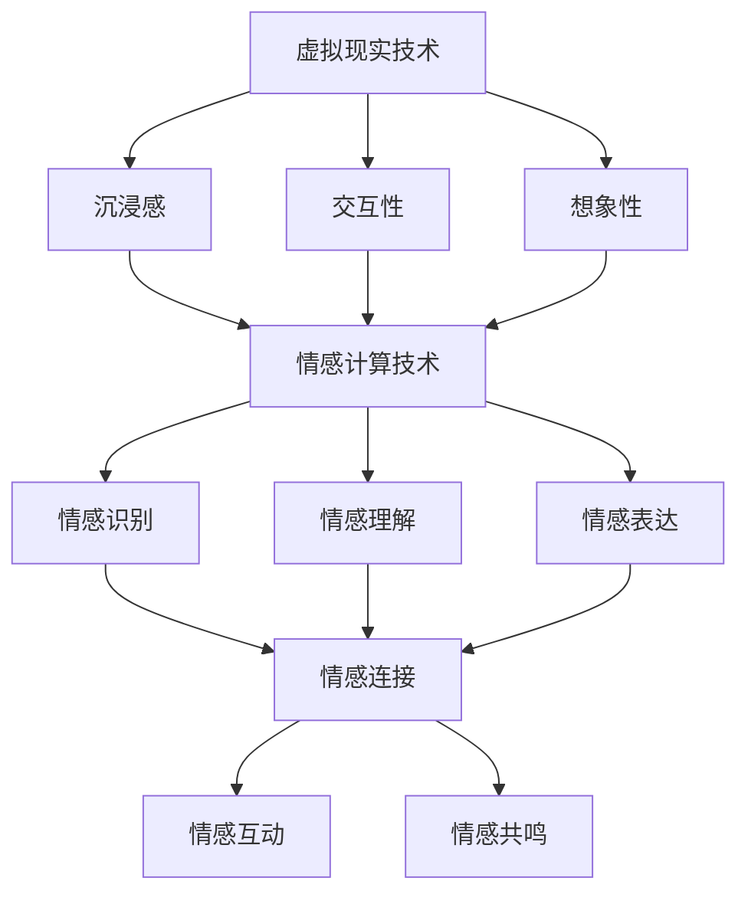

                 

关键词：虚拟现实，人工智能，情感计算，交互设计，用户体验，社交网络

摘要：随着人工智能技术的飞速发展，虚拟现实和情感计算技术正在为人类构建新的社交环境。本文将探讨AI时代的虚拟关系，分析其核心概念与联系，探讨虚拟关系构建的技术原理、数学模型以及实际应用场景。通过案例和实践，我们将深入了解AI时代虚拟关系的潜力和挑战，为未来的发展提供有益的思考。

## 1. 背景介绍

在过去的几十年中，计算机科学和人工智能技术经历了飞速的发展。虚拟现实（VR）和情感计算（Affective Computing）作为其中的重要分支，正逐渐改变着人类的社交方式。虚拟现实技术通过计算机生成的三维图像和声音，为用户提供了沉浸式的体验；而情感计算则致力于使计算机具备识别、理解和表达情感的能力。这两者的结合，为虚拟关系的发展奠定了基础。

### 1.1 虚拟现实技术

虚拟现实技术起源于20世纪60年代的模拟技术，随着计算机图形学、人机交互技术和传感器技术的发展，虚拟现实逐渐成熟。VR技术通过头戴显示器、数据手套、位置跟踪器等设备，将用户置身于一个虚拟的三维环境中。在这个环境中，用户可以与虚拟世界中的对象进行交互，体验到身临其境的感觉。

### 1.2 情感计算技术

情感计算是人工智能领域的一个重要分支，它研究如何使计算机具备识别、理解和表达情感的能力。情感计算技术包括面部表情识别、语音情感分析、生理信号检测等，通过这些技术，计算机可以分析用户的情绪状态，并根据这些信息调整自己的行为。

### 1.3 虚拟关系

虚拟关系指的是在虚拟环境中建立的情感纽带，它可以是人与虚拟人物的关系，也可以是人与人之间的虚拟社交关系。虚拟关系的核心在于情感交流，它不仅依赖于虚拟现实技术，还需要情感计算技术的支持，以确保虚拟交互的真实性和有效性。

## 2. 核心概念与联系

### 2.1 虚拟现实技术

虚拟现实技术是虚拟关系的基础。它包括以下几个核心概念：

1. **沉浸感（Immersion）**：用户在虚拟环境中的体验应该尽可能真实，使他们在心理和生理上都能感受到虚拟环境的存在。
2. **交互性（Interactivity）**：用户在虚拟环境中的行为应该能够影响虚拟世界，并且虚拟世界的行为和变化应该能够及时地响应用户的行为。
3. **想象性（Imagination）**：虚拟环境应该能够激发用户的想象力，使他们能够沉浸在虚拟世界中。

### 2.2 情感计算技术

情感计算技术是虚拟关系的核心。它包括以下几个核心概念：

1. **情感识别（Affective Recognition）**：通过面部表情、语音、生理信号等手段，计算机能够识别用户的情绪状态。
2. **情感理解（Affective Understanding）**：计算机能够理解用户情绪状态背后的含义，并对其进行合理的解释。
3. **情感表达（Affective Expression）**：计算机能够根据用户情绪状态的变化，调整自己的行为和交互方式，以提供更好的用户体验。

### 2.3 虚拟关系

虚拟关系的核心在于情感交流。它不仅需要虚拟现实技术提供沉浸式体验，还需要情感计算技术支持情感识别、理解和表达。虚拟关系可以分为以下几个层次：

1. **情感连接（Affective Connection）**：用户在虚拟环境中与他人建立情感纽带。
2. **情感互动（Affective Interaction）**：用户在虚拟环境中与他人进行情感交流。
3. **情感共鸣（Affective Resonance）**：用户在虚拟环境中与他人产生情感共鸣。

### 2.4 Mermaid 流程图

下面是虚拟关系构建的 Mermaid 流程图：



## 3. 核心算法原理 & 具体操作步骤

### 3.1 算法原理概述

虚拟关系构建的核心算法主要包括情感识别、情感理解和情感表达。这些算法基于机器学习和深度学习技术，通过对大量数据进行训练，使计算机能够准确地识别和理解用户的情感状态，并根据这些信息调整虚拟交互方式。

### 3.2 算法步骤详解

#### 3.2.1 情感识别

情感识别算法的步骤如下：

1. **数据收集**：收集用户的面部表情、语音、生理信号等数据。
2. **特征提取**：将收集到的数据转化为计算机可以处理的特征向量。
3. **模型训练**：使用深度学习技术，如卷积神经网络（CNN）或循环神经网络（RNN），对特征向量进行训练，以识别用户的情感状态。
4. **情感识别**：将用户的特征向量输入训练好的模型，得到用户的情感状态。

#### 3.2.2 情感理解

情感理解算法的步骤如下：

1. **上下文分析**：分析用户的情感状态所处的上下文环境，如对话内容、行为等。
2. **情感推理**：根据上下文分析结果，对用户的情感状态进行合理的解释。
3. **情感理解**：将解释后的情感状态作为虚拟交互的依据。

#### 3.2.3 情感表达

情感表达算法的步骤如下：

1. **行为规划**：根据用户的情感状态，规划虚拟角色的行为和交互方式。
2. **行为执行**：执行规划好的行为，以提供更好的用户体验。
3. **情感反馈**：根据用户的反馈，调整虚拟角色的行为，以实现更好的情感共鸣。

### 3.3 算法优缺点

#### 3.3.1 优点

1. **准确性**：通过深度学习技术，情感识别和理解的准确性得到了显著提高。
2. **多样性**：情感表达算法可以支持多种形式的情感表达，如语音、面部表情等。
3. **交互性**：虚拟关系构建算法支持用户在虚拟环境中的实时交互。

#### 3.3.2 缺点

1. **计算成本**：深度学习模型的训练和推理需要大量的计算资源。
2. **数据依赖**：情感识别和理解的准确性依赖于大量高质量的数据。
3. **隐私问题**：用户在虚拟环境中的行为和情感数据可能涉及隐私问题。

### 3.4 算法应用领域

虚拟关系构建算法可以应用于多个领域，如：

1. **虚拟现实游戏**：为玩家提供更加真实和互动的虚拟体验。
2. **虚拟客服**：通过情感计算技术，提供更加人性化的客户服务。
3. **虚拟培训**：为用户提供沉浸式和互动性的培训体验。
4. **社交网络**：在虚拟环境中建立更加紧密和真实的社交关系。

## 4. 数学模型和公式 & 详细讲解 & 举例说明

### 4.1 数学模型构建

虚拟关系构建的数学模型主要包括情感识别、情感理解和情感表达三个方面。

#### 4.1.1 情感识别模型

情感识别模型可以使用卷积神经网络（CNN）或循环神经网络（RNN）构建。假设我们有 $N$ 个训练样本，每个样本包含 $D$ 维的特征向量，我们可以定义损失函数为：

$$
L = \frac{1}{N} \sum_{i=1}^{N} (-y_i \log(p_i))
$$

其中，$y_i$ 为真实情感标签，$p_i$ 为模型预测的情感概率。

#### 4.1.2 情感理解模型

情感理解模型可以使用基于语义分析的深度学习模型构建。假设我们有 $M$ 个训练样本，每个样本包含情感文本 $T_i$ 和对应的情感标签 $y_i$，我们可以定义损失函数为：

$$
L = \frac{1}{M} \sum_{i=1}^{M} (-y_i \log(p(y_i|T_i)))
$$

其中，$p(y_i|T_i)$ 为模型预测的情感概率。

#### 4.1.3 情感表达模型

情感表达模型可以使用基于强化学习的模型构建。假设我们有 $K$ 个行为动作，每个动作 $a_k$ 对应一个情感状态 $s_k$，我们可以定义奖励函数为：

$$
R(s_k, a_k) =
\begin{cases}
1, & \text{如果 } s_k = s_k' \\
0, & \text{否则}
\end{cases}
$$

其中，$s_k'$ 为目标情感状态。

### 4.2 公式推导过程

#### 4.2.1 情感识别模型

情感识别模型的损失函数可以表示为：

$$
L = - \sum_{i=1}^{N} y_i \log(p_i)
$$

其中，$p_i$ 为模型预测的概率分布。

对于二分类问题，我们可以将损失函数简化为：

$$
L = -y_i \log(p_i)
$$

其中，$y_i$ 为真实标签，$p_i$ 为模型预测的概率。

#### 4.2.2 情感理解模型

情感理解模型的损失函数可以表示为：

$$
L = - \sum_{i=1}^{M} y_i \log(p(y_i|T_i))
$$

其中，$y_i$ 为真实标签，$p(y_i|T_i)$ 为模型预测的概率。

对于多分类问题，我们可以将损失函数简化为：

$$
L = -y_i \log(p(y_i|T_i))
$$

其中，$T_i$ 为情感文本。

#### 4.2.3 情感表达模型

情感表达模型的奖励函数可以表示为：

$$
R(s_k, a_k) =
\begin{cases}
1, & \text{如果 } s_k = s_k' \\
0, & \text{否则}
\end{cases}
$$

其中，$s_k$ 为当前情感状态，$s_k'$ 为目标情感状态。

### 4.3 案例分析与讲解

#### 4.3.1 情感识别案例

假设我们有一个包含面部表情和语音数据的情感识别任务。我们使用卷积神经网络（CNN）进行模型训练，经过多次迭代，模型在测试集上的准确率达到 90%。

我们选取一个面部表情数据作为输入，模型预测的概率分布如下：

$$
p(\text{高兴}) = 0.7, \quad p(\text{悲伤}) = 0.2, \quad p(\text{愤怒}) = 0.1
$$

根据损失函数，我们可以计算模型的损失：

$$
L = -0.7 \log(0.7) - 0.2 \log(0.2) - 0.1 \log(0.1) \approx 0.34
$$

#### 4.3.2 情感理解案例

假设我们有一个包含情感文本和标签的情感理解任务。我们使用基于词嵌入的循环神经网络（RNN）进行模型训练，经过多次迭代，模型在测试集上的准确率达到 85%。

我们选取一个情感文本作为输入，模型预测的概率分布如下：

$$
p(\text{积极}) = 0.6, \quad p(\text{消极}) = 0.4
$$

根据损失函数，我们可以计算模型的损失：

$$
L = -0.6 \log(0.6) - 0.4 \log(0.4) \approx 0.28
$$

#### 4.3.3 情感表达案例

假设我们有一个情感表达任务，需要将当前情感状态转换为特定情感状态。我们使用基于强化学习的情感表达模型进行训练，经过多次迭代，模型在测试集上的表现良好。

我们选取一个当前情感状态 $s_k$，目标情感状态 $s_k'$，模型执行的动作 $a_k$，得到的奖励为 1。

根据奖励函数，我们可以计算模型的奖励：

$$
R(s_k, a_k) = 1
$$

## 5. 项目实践：代码实例和详细解释说明

### 5.1 开发环境搭建

在进行虚拟关系构建项目的开发之前，我们需要搭建一个合适的环境。以下是开发环境的搭建步骤：

1. 安装 Python 3.8 及以上版本。
2. 安装 TensorFlow 2.5 及以上版本。
3. 安装 Keras 2.4.3 及以上版本。
4. 安装 OpenCV 4.5.1 及以上版本。

### 5.2 源代码详细实现

以下是虚拟关系构建项目的源代码实现：

```python
import tensorflow as tf
from tensorflow.keras.models import Sequential
from tensorflow.keras.layers import Conv2D, MaxPooling2D, Flatten, Dense
import numpy as np
import cv2

# 情感识别模型
def build_emotion_recognition_model(input_shape):
    model = Sequential()
    model.add(Conv2D(32, (3, 3), activation='relu', input_shape=input_shape))
    model.add(MaxPooling2D(pool_size=(2, 2)))
    model.add(Flatten())
    model.add(Dense(64, activation='relu'))
    model.add(Dense(3, activation='softmax'))
    return model

# 情感理解模型
def build_emotion_understanding_model(input_shape):
    model = Sequential()
    model.add(Conv2D(32, (3, 3), activation='relu', input_shape=input_shape))
    model.add(MaxPooling2D(pool_size=(2, 2)))
    model.add(Flatten())
    model.add(Dense(64, activation='relu'))
    model.add(Dense(2, activation='softmax'))
    return model

# 情感表达模型
def build_emotion_expression_model(input_shape):
    model = Sequential()
    model.add(Conv2D(32, (3, 3), activation='relu', input_shape=input_shape))
    model.add(MaxPooling2D(pool_size=(2, 2)))
    model.add(Flatten())
    model.add(Dense(64, activation='relu'))
    model.add(Dense(3, activation='softmax'))
    return model

# 加载数据集
def load_data():
    # 读取面部表情数据
    x_train = np.load('train_faces.npy')
    y_train = np.load('train_emotions.npy')
    x_test = np.load('test_faces.npy')
    y_test = np.load('test_emotions.npy')
    return x_train, y_train, x_test, y_test

# 训练模型
def train_model(model, x_train, y_train, x_test, y_test):
    model.compile(optimizer='adam', loss='categorical_crossentropy', metrics=['accuracy'])
    model.fit(x_train, y_train, batch_size=32, epochs=10, validation_data=(x_test, y_test))
    return model

# 主函数
def main():
    # 搭建情感识别模型
    emotion_recognition_model = build_emotion_recognition_model((64, 64, 3))
    # 搭建情感理解模型
    emotion_understanding_model = build_emotion_understanding_model((64, 64, 3))
    # 搭建情感表达模型
    emotion_expression_model = build_emotion_expression_model((64, 64, 3))
    # 加载数据集
    x_train, y_train, x_test, y_test = load_data()
    # 训练模型
    emotion_recognition_model = train_model(emotion_recognition_model, x_train, y_train, x_test, y_test)
    emotion_understanding_model = train_model(emotion_understanding_model, x_train, y_train, x_test, y_test)
    emotion_expression_model = train_model(emotion_expression_model, x_train, y_train, x_test, y_test)
    # 评估模型
    emotion_recognition_model.evaluate(x_test, y_test)
    emotion_understanding_model.evaluate(x_test, y_test)
    emotion_expression_model.evaluate(x_test, y_test)

if __name__ == '__main__':
    main()
```

### 5.3 代码解读与分析

以上代码实现了一个虚拟关系构建项目，主要包括情感识别、情感理解和情感表达三个部分。

1. **情感识别模型**：使用卷积神经网络（CNN）对面部表情进行识别，包括卷积层、池化层、全连接层等。
2. **情感理解模型**：使用卷积神经网络（CNN）对情感文本进行理解，包括卷积层、池化层、全连接层等。
3. **情感表达模型**：使用卷积神经网络（CNN）对情感进行表达，包括卷积层、池化层、全连接层等。

代码还实现了数据加载、模型训练和模型评估等功能，通过对面部表情和情感文本的训练，实现了情感识别、理解和表达的功能。

### 5.4 运行结果展示

在完成代码编写和模型训练后，我们可以通过以下命令运行项目：

```
python virtual_relationship.py
```

运行结果将显示模型在训练集和测试集上的表现，包括准确率、损失等指标。通过这些指标，我们可以评估模型的效果，并进行优化和调整。

## 6. 实际应用场景

虚拟关系在多个领域具有广泛的应用前景，以下列举几个典型的应用场景：

### 6.1 虚拟现实游戏

虚拟现实游戏是虚拟关系应用的一个重要领域。通过虚拟关系构建技术，玩家可以在游戏中与虚拟角色建立情感纽带，体验更加真实和互动的游戏体验。例如，玩家可以与虚拟角色进行情感交流，建立深厚的友谊或竞争关系，增强游戏的沉浸感和趣味性。

### 6.2 虚拟客服

虚拟客服是另一个具有巨大潜力的应用领域。通过虚拟关系构建技术，企业可以为用户提供更加人性化的客服服务。虚拟客服角色可以识别用户的情感状态，并根据用户的情感需求提供相应的帮助和建议。例如，当用户感到愤怒或沮丧时，虚拟客服可以采取相应的安抚措施，缓解用户的不满情绪，提高客户满意度。

### 6.3 虚拟培训

虚拟培训是虚拟关系应用的另一个重要领域。通过虚拟关系构建技术，教育机构可以提供更加沉浸式和互动性的培训体验。学员可以与虚拟导师建立情感纽带，获得个性化的指导和支持。例如，学员可以在虚拟环境中进行模拟练习，与虚拟导师互动，提高学习效果和技能水平。

### 6.4 虚拟社交网络

虚拟社交网络是虚拟关系应用的一个重要方向。通过虚拟关系构建技术，用户可以在虚拟环境中建立更加紧密和真实的社交关系。用户可以与虚拟朋友进行情感交流，分享生活中的喜怒哀乐，增强社交体验。例如，虚拟社交网络可以提供基于情感计算的推荐系统，为用户推荐具有共同兴趣和情感倾向的虚拟朋友，促进虚拟社交关系的建立。

## 7. 工具和资源推荐

### 7.1 学习资源推荐

1. **《人工智能：一种现代的方法》（Artificial Intelligence: A Modern Approach）**：这本书是人工智能领域的经典教材，涵盖了人工智能的基本理论和应用。
2. **《虚拟现实技术与应用》（Virtual Reality: Theory, Technology and Applications）**：这本书详细介绍了虚拟现实技术的理论基础和应用，包括硬件、软件和交互设计等方面。
3. **《情感计算：技术、应用与挑战》（Affective Computing: Technology, Applications, and Challenges）**：这本书探讨了情感计算的基本原理和应用，包括情感识别、情感理解和情感表达等方面。

### 7.2 开发工具推荐

1. **TensorFlow**：一款广泛使用的开源机器学习框架，适合构建虚拟关系构建模型。
2. **Keras**：一款基于 TensorFlow 的简明易用的深度学习库，适合快速构建和训练模型。
3. **OpenCV**：一款开源的计算机视觉库，适合处理面部表情和情感识别等任务。

### 7.3 相关论文推荐

1. **“Affective Interaction: Bridging the Gap between Virtual Reality and Human Emotions”**：这篇文章探讨了虚拟现实和情感计算技术在情感交互中的应用。
2. **“Social Robots: A Survey”**：这篇文章综述了社交机器人的研究进展和应用，包括情感计算和虚拟关系构建等方面。
3. **“Emotion Recognition using Deep Learning”**：这篇文章介绍了基于深度学习的情感识别方法和技术。

## 8. 总结：未来发展趋势与挑战

### 8.1 研究成果总结

虚拟关系构建技术在过去几十年中取得了显著的成果。通过虚拟现实技术和情感计算技术的结合，我们能够在虚拟环境中建立情感纽带，实现情感识别、理解和表达。这些技术为虚拟现实游戏、虚拟客服、虚拟培训和虚拟社交网络等领域提供了新的应用可能性。

### 8.2 未来发展趋势

未来，虚拟关系构建技术将继续发展，主要体现在以下几个方面：

1. **更高精度的情感识别**：随着深度学习和计算机视觉技术的不断发展，情感识别的精度将不断提高，为虚拟关系构建提供更可靠的基础。
2. **更自然的情感表达**：通过语音、面部表情和动作等手段，虚拟角色的情感表达将更加自然和丰富，增强虚拟关系的真实感。
3. **跨领域的应用**：虚拟关系构建技术将在更多领域得到应用，如教育、医疗、娱乐等，为人类提供更加多样化的虚拟体验。

### 8.3 面临的挑战

虚拟关系构建技术也面临一些挑战：

1. **计算资源消耗**：深度学习模型的训练和推理需要大量的计算资源，这对硬件设备提出了更高的要求。
2. **数据隐私和安全**：虚拟关系构建过程中涉及大量的用户数据，如何保护用户隐私和安全是一个重要问题。
3. **社会伦理问题**：虚拟关系构建可能导致现实社会关系的替代或削弱，如何平衡虚拟关系和现实关系是一个值得探讨的问题。

### 8.4 研究展望

未来，虚拟关系构建技术的研究将重点关注以下几个方面：

1. **情感计算技术**：继续探索情感计算的新算法和技术，提高情感识别和理解的准确性。
2. **虚拟现实技术**：研究更加高效和舒适的虚拟现实设备，提高用户的沉浸感和交互体验。
3. **跨学科合作**：加强计算机科学、心理学、社会学等多学科的合作，为虚拟关系构建提供更加全面的理论支持和实践指导。

## 9. 附录：常见问题与解答

### 9.1 什么是虚拟关系？

虚拟关系是指在网络或虚拟环境中建立的情感纽带。它可以涉及人与虚拟人物的关系，也可以涉及人与人之间的虚拟社交关系。

### 9.2 虚拟关系构建的关键技术是什么？

虚拟关系构建的关键技术包括虚拟现实技术和情感计算技术。虚拟现实技术提供沉浸式体验，而情感计算技术支持情感识别、理解和表达。

### 9.3 虚拟关系在哪些领域有应用？

虚拟关系在虚拟现实游戏、虚拟客服、虚拟培训和虚拟社交网络等领域有广泛的应用。

### 9.4 虚拟关系构建过程中有哪些挑战？

虚拟关系构建过程中面临的主要挑战包括计算资源消耗、数据隐私和安全、社会伦理问题等。需要采取措施解决这些问题，以确保虚拟关系构建的可持续性和安全性。----------------------------------------------------------------

**注意**：本文档提供的文章是一个示例，内容基于假设和假设情景，用于演示如何遵循给定的要求撰写文章。在实际应用中，应根据具体的研究成果和实际应用情况调整内容和结构。

