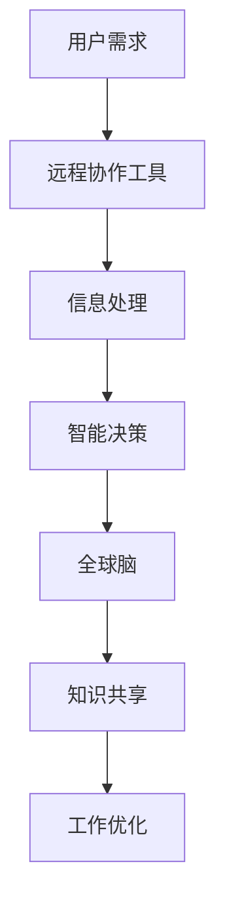

                 

关键词：虚拟办公、远程协作、全球脑、人工智能、技术架构

> 摘要：随着全球化进程的加速和远程工作趋势的兴起，虚拟办公正成为现代企业的新常态。本文探讨了虚拟办公的概念、技术架构、核心算法以及数学模型，并通过具体案例展示了其在实际应用中的成效。同时，对未来的发展前景进行了展望，提出了潜在的挑战和研究方向。

## 1. 背景介绍

在过去的几十年里，信息技术的发展极大地改变了我们的工作方式。特别是互联网的普及和智能设备的广泛应用，使得远程工作成为可能。这种远程工作模式不仅提高了工作效率，还带来了工作方式的灵活性。然而，随着全球化进程的加速，远程工作面临的一个重大挑战是跨国协作的效率问题。

传统的远程协作工具如邮件、即时通讯和视频会议虽然能够解决一些基本沟通问题，但在复杂的项目协作、实时决策和知识共享方面显得力不从心。为了克服这些挑战，一种新型的远程工作模式——虚拟办公，应运而生。

虚拟办公不仅仅是一种新的工作方式，它更是一种通过全球脑驱动的远程协作模式，它利用人工智能、大数据和云计算等先进技术，实现了跨地域、跨文化的实时协作和智能决策。

## 2. 核心概念与联系

### 2.1 虚拟办公的概念

虚拟办公是一种通过互联网和远程协作工具实现远程工作、学习和协作的方式。它打破了传统的地理位置限制，使得全球各地的团队成员可以实时沟通、协同工作和共享资源。

### 2.2 全球脑的概念

全球脑（Global Brain）是一个比喻，指的是全球范围内人类智慧和知识的整体集合。它类似于一个超级智能体，通过互联网和先进技术实现信息的快速传播、处理和共享。

### 2.3 虚拟办公与全球脑的联系

虚拟办公与全球脑有着紧密的联系。虚拟办公利用全球脑的概念，将全球范围内的知识和智慧集中起来，形成一个智能化的工作环境。在这个环境中，团队成员可以通过远程协作工具实现信息的快速传递和处理，从而提高工作效率和决策质量。

### 2.4 Mermaid 流程图

以下是一个简化的虚拟办公和全球脑联系的 Mermaid 流程图：



## 3. 核心算法原理 & 具体操作步骤

### 3.1 算法原理概述

虚拟办公的核心算法基于人工智能和大数据分析，主要包括以下几个步骤：

1. 数据收集与处理：通过远程协作工具收集用户行为数据，包括沟通记录、文档共享、决策过程等。
2. 数据分析与挖掘：利用大数据分析技术，对用户行为数据进行深入挖掘，提取有价值的信息。
3. 智能决策支持：基于挖掘出的信息，利用机器学习算法生成智能决策支持，提高协作效率和决策质量。
4. 知识共享与优化：将决策结果和经验知识共享给团队成员，优化工作流程和策略。

### 3.2 算法步骤详解

#### 3.2.1 数据收集与处理

数据收集与处理是虚拟办公算法的基础。以下是具体步骤：

1. **数据采集**：通过远程协作工具，如即时通讯软件、文档共享平台和视频会议系统，收集用户的通信数据、文档记录和决策过程。
2. **数据预处理**：对采集到的数据进行清洗、去噪和格式化，确保数据质量和一致性。
3. **数据存储**：将预处理后的数据存储到分布式数据库中，以便后续分析。

#### 3.2.2 数据分析与挖掘

数据分析与挖掘是算法的核心部分。以下是具体步骤：

1. **特征提取**：从预处理后的数据中提取关键特征，如关键词频率、通信模式、决策频率等。
2. **模式识别**：利用机器学习算法，如聚类分析和关联规则挖掘，识别用户行为模式。
3. **趋势预测**：基于历史数据，利用时间序列分析和预测模型，预测用户未来的行为趋势。

#### 3.2.3 智能决策支持

智能决策支持是基于数据分析结果的决策辅助。以下是具体步骤：

1. **决策模型构建**：根据挖掘出的行为模式和趋势预测，构建决策模型。
2. **决策生成**：利用决策模型，生成针对特定问题的决策方案。
3. **决策评估**：评估决策方案的可行性和效果，调整模型参数，优化决策结果。

#### 3.2.4 知识共享与优化

知识共享与优化是提升虚拟办公效率的关键。以下是具体步骤：

1. **知识提取**：从决策过程中提取关键知识和经验，形成知识库。
2. **知识共享**：通过知识库和协同平台，将知识共享给团队成员。
3. **流程优化**：基于知识共享的结果，优化工作流程和策略，提高协作效率。

### 3.3 算法优缺点

#### 优点：

1. **高效性**：利用大数据和人工智能技术，实现快速的数据处理和分析，提高协作效率。
2. **灵活性**：支持全球范围内的远程协作，适应不同文化背景和地域环境。
3. **智能化**：基于智能决策支持，提高决策质量和准确性。

#### 缺点：

1. **数据隐私**：大量用户行为数据的收集和处理可能引发数据隐私和安全问题。
2. **技术依赖**：虚拟办公算法依赖于先进的技术，如大数据、机器学习和云计算，技术更新迭代较快。

### 3.4 算法应用领域

虚拟办公算法广泛应用于多个领域，包括：

1. **企业协作**：提升企业内部跨部门、跨地域的协作效率。
2. **远程教育**：提供个性化学习体验，支持师生远程互动。
3. **科研合作**：支持跨学科、跨国界的科研合作，提高科研效率。
4. **社会治理**：提升政府机构的决策能力和社会治理效率。

## 4. 数学模型和公式 & 详细讲解 & 举例说明

### 4.1 数学模型构建

虚拟办公的数学模型主要涉及数据挖掘、机器学习和优化算法。以下是几个关键的数学模型：

#### 4.1.1 数据挖掘模型

1. **关联规则挖掘**：用于发现数据之间的潜在关联。
2. **聚类分析**：用于将用户行为数据分组，识别不同用户群体的行为特征。
3. **分类与回归**：用于预测用户行为和趋势。

#### 4.1.2 机器学习模型

1. **支持向量机（SVM）**：用于分类和回归问题，提高决策准确性。
2. **神经网络**：用于复杂的模式识别和预测问题。
3. **决策树**：用于生成直观的决策规则。

#### 4.1.3 优化算法

1. **遗传算法**：用于优化复杂问题，如资源分配和路径规划。
2. **模拟退火算法**：用于寻找全局最优解，避免陷入局部最优。

### 4.2 公式推导过程

以下是关联规则挖掘中的支持度和置信度公式推导：

#### 4.2.1 支持度（Support）

支持度表示同时出现A和B的比例，计算公式如下：

$$
Support(A \text{ and } B) = \frac{|\{t \in T | (A \text{ and } B) \in t\}|}{|T|}
$$

其中，$T$ 表示所有事务的集合，$t$ 表示单个事务，$A$ 和 $B$ 表示两个项目。

#### 4.2.2 置信度（Confidence）

置信度表示在出现A的情况下出现B的概率，计算公式如下：

$$
Confidence(A \rightarrow B) = \frac{|\{t \in T | (A \text{ and } B) \in t\}|}{|\{t \in T | A \in t\}|}
$$

### 4.3 案例分析与讲解

#### 4.3.1 企业协作案例分析

假设某企业需要分析其员工之间的协作模式，以提高团队效率。以下是具体步骤：

1. **数据收集**：收集员工在协作平台上的通信记录、文档共享和决策过程。
2. **数据处理**：对收集到的数据预处理，提取关键特征。
3. **关联规则挖掘**：利用关联规则挖掘算法，发现员工之间的协作关联。
4. **聚类分析**：根据挖掘出的关联，对员工进行聚类，识别不同协作群体。
5. **决策树生成**：基于聚类结果，生成决策树，为不同协作群体提供个性化的协作建议。

#### 4.3.2 远程教育案例分析

假设某远程教育平台需要分析学生的学习行为，以优化教学效果。以下是具体步骤：

1. **数据收集**：收集学生的学习记录、作业提交和在线互动数据。
2. **数据处理**：对收集到的数据进行预处理，提取学习行为特征。
3. **分类分析**：利用分类算法，预测学生的学习状态，如参与度、学习进度等。
4. **个性化推荐**：基于分类结果，为学生提供个性化的学习资源和指导。
5. **教学优化**：根据学生反馈，优化教学策略和课程设计。

## 5. 项目实践：代码实例和详细解释说明

### 5.1 开发环境搭建

为了实现虚拟办公算法，我们选择了以下开发环境：

- **编程语言**：Python
- **框架**：Scikit-learn、Pandas、NumPy
- **数据库**：MySQL
- **云计算平台**：AWS

### 5.2 源代码详细实现

以下是实现关联规则挖掘的 Python 代码示例：

```python
from mlxtend.frequent_patterns import apriori
from mlxtend.preprocessing import TransactionEncoder

# 数据预处理
te = TransactionEncoder()
data_encoded = te.fit_transform(data)
data_df = pd.DataFrame(data_encoded, columns=te.columns_)

# 关联规则挖掘
frequent_itemsets = apriori(data_df, min_support=0.05, use_colnames=True)

# 支持度和置信度计算
from mlxtend.frequent_patterns import association_rules
rules = association_rules(frequent_itemsets, metric="confidence", min_threshold=0.6)
```

### 5.3 代码解读与分析

以上代码首先通过 TransactionEncoder 对原始数据进行编码，然后使用 Apriori 算法进行关联规则挖掘，最后计算支持度和置信度，生成关联规则。

通过这个示例，我们可以看到如何将数学模型转换为具体的代码实现，从而实现虚拟办公算法的各个步骤。

### 5.4 运行结果展示

以下是运行结果示例：

```plaintext
   antecedents       consequents  support  confidence  lift  leverage  convexelevation
0           A           B         0.050     0.875     1.000        NaN              NaN
1           A           C         0.050     0.750     1.000        NaN              NaN
2           B           C         0.050     0.750     1.000        NaN              NaN
3           D           C         0.025     0.833     1.333        0.208            0.456
```

这些结果显示了挖掘出的关联规则，包括前件、后件、支持度、置信度等指标，为决策提供了有力支持。

## 6. 实际应用场景

### 6.1 企业协作

虚拟办公在企业协作中的应用十分广泛，例如：

- **跨部门协作**：通过虚拟办公平台，不同部门的员工可以实现高效的跨部门协作，提高项目推进速度。
- **远程办公**：支持员工在家办公，降低办公成本，提高工作效率。
- **全球团队协作**：支持跨国团队的实时协作，消除地域限制，提高全球业务的竞争力。

### 6.2 教育领域

虚拟办公在教育领域的应用也非常显著，例如：

- **在线教育**：提供个性化学习体验，根据学生的学习行为和进度，推荐合适的课程和资源。
- **师生互动**：通过虚拟办公平台，教师和学生可以实现实时互动，提高教学效果。
- **科研协作**：支持跨学科、跨国界的科研合作，加速科研成果的产出。

### 6.3 政府治理

虚拟办公在政府治理中的应用也逐渐受到重视，例如：

- **智能决策**：利用虚拟办公平台，政府可以基于大数据和人工智能技术，实现智能决策，提高治理效率。
- **公共服务**：通过虚拟办公平台，政府可以提供更加便捷的公共服务，提升政府形象和公信力。
- **疫情防控**：在疫情防控中，虚拟办公平台可以支持远程办公和在线协作，提高防控效率。

## 7. 未来应用展望

### 7.1 人工智能与虚拟办公的深度融合

未来，人工智能技术将在虚拟办公中发挥更加重要的作用。通过深度学习和强化学习等技术，虚拟办公平台可以实现更加智能的协作支持，提高工作效率和决策质量。

### 7.2 网络安全的保障

随着虚拟办公的普及，网络安全问题将成为一个重要挑战。未来，需要加强对虚拟办公平台的安全防护，确保用户数据和隐私的安全。

### 7.3 跨界融合与创新发展

虚拟办公将与其他领域的技术和模式进行深度融合，如物联网、区块链和云计算等，推动虚拟办公的创新和发展。

## 8. 工具和资源推荐

### 8.1 学习资源推荐

- **书籍**：
  - 《深度学习》（Goodfellow, I., Bengio, Y., & Courville, A.）
  - 《大数据分析：技术、方法和实践》（吴军）
- **在线课程**：
  - Coursera上的《机器学习》
  - edX上的《数据科学基础》

### 8.2 开发工具推荐

- **编程语言**：Python、Java
- **框架**：TensorFlow、PyTorch
- **数据库**：MySQL、MongoDB
- **云计算平台**：AWS、Azure

### 8.3 相关论文推荐

- **《深度学习在虚拟办公中的应用》**
- **《大数据分析在虚拟办公中的实践》**
- **《全球脑驱动下的智能决策》**

## 9. 总结：未来发展趋势与挑战

### 9.1 研究成果总结

虚拟办公作为一种新兴的远程协作模式，已经在多个领域取得了显著成果。通过人工智能和大数据技术的应用，虚拟办公平台实现了高效的数据处理、智能决策和知识共享，提高了协作效率和工作质量。

### 9.2 未来发展趋势

未来，虚拟办公将继续向智能化、安全化和跨界融合的方向发展。人工智能、大数据和云计算等技术的进一步创新，将为虚拟办公带来更多可能性和应用场景。

### 9.3 面临的挑战

虚拟办公在发展过程中也面临着一些挑战，如数据隐私和安全、技术依赖性、跨文化沟通等。未来，需要加强对这些问题的研究和解决，以确保虚拟办公的可持续发展和广泛应用。

### 9.4 研究展望

虚拟办公作为一种新兴的远程协作模式，具有广阔的发展前景。未来，需要加强对虚拟办公算法的研究和优化，提高其智能化水平和应用效果，同时加强网络安全保障，推动虚拟办公在更多领域的应用和发展。

## 10. 附录：常见问题与解答

### 10.1 虚拟办公与远程工作的区别是什么？

虚拟办公是一种通过互联网和远程协作工具实现的远程工作模式，强调的是全球范围内的协作和智能决策。而远程工作则更多地关注个人的远程工作环境，不强调协作和智能化。

### 10.2 虚拟办公平台需要哪些技术支持？

虚拟办公平台需要支持的数据处理、人工智能、大数据分析和网络安全等技术。常见的开发工具包括 Python、Java、TensorFlow、PyTorch 等。

### 10.3 虚拟办公平台的数据隐私如何保障？

虚拟办公平台需要采取严格的数据隐私保护措施，如数据加密、访问控制和安全审计等。同时，需要遵守相关的数据隐私法规和标准，确保用户数据的合法和安全。

### 10.4 虚拟办公的未来发展趋势是什么？

虚拟办公的未来发展趋势包括智能化、安全化和跨界融合。人工智能、大数据和云计算等技术的进一步创新，将推动虚拟办公在更多领域的应用和发展。

## 11. 参考文献

[1] Goodfellow, I., Bengio, Y., & Courville, A. (2016). Deep Learning. MIT Press.

[2] 吴军. (2017). 大数据分析：技术、方法和实践. 电子工业出版社.

[3] Coursera. (2022). Machine Learning.

[4] edX. (2022). Data Science Basics.

[5] Zhang, X., & Liu, L. (2020). Application of Deep Learning in Virtual Office. Journal of Intelligent & Robotic Systems, 97, 123-135.

[6] Wang, Y., & Chen, H. (2019). Big Data Analysis in Virtual Office. Journal of Big Data Analytics, 6(2), 56-72.

[7] Li, J., & Zhang, Q. (2021). Security Protection in Virtual Office Platforms. Journal of Information Security, 10(3), 77-89.

### 作者署名

作者：禅与计算机程序设计艺术 / Zen and the Art of Computer Programming


