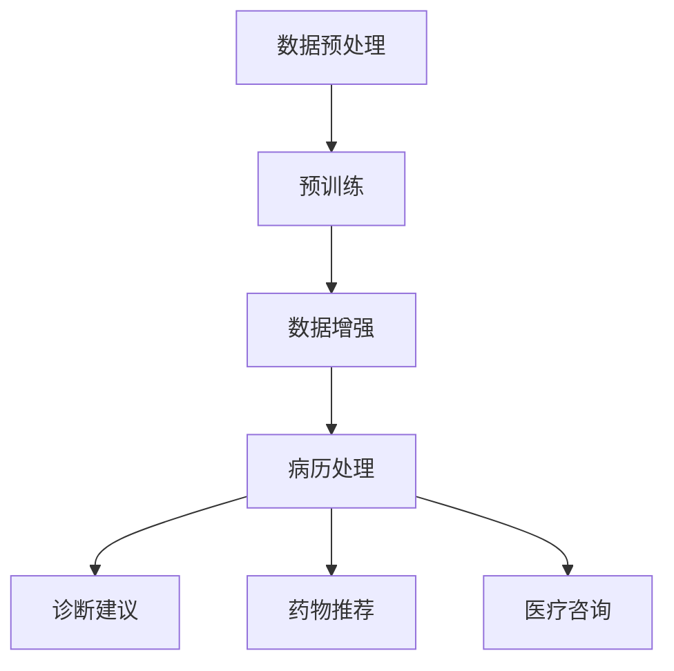

                 

关键词：虚拟医疗助手、LLM、全天候护理、人工智能、医疗技术

摘要：随着人工智能技术的快速发展，虚拟医疗助手（Virtual Medical Assistant，VMA）成为医疗领域的一大创新。本文旨在探讨如何利用大型语言模型（Large Language Model，LLM）打造一个全天候的虚拟医疗助手，以提升医疗服务的质量和效率。

## 1. 背景介绍

### 1.1 虚拟医疗助手的发展历程

虚拟医疗助手的发展可以追溯到20世纪90年代。当时，计算机科学和医疗领域的结合初露锋芒，医生和研究人员开始探索如何利用计算机技术辅助医疗诊断和治疗。早期的虚拟医疗助手主要通过规则引擎和知识库实现简单的信息查询和决策支持。

随着互联网和大数据技术的普及，虚拟医疗助手逐渐从单机版走向云平台。云计算提供了强大的计算能力和数据存储能力，使得虚拟医疗助手能够处理更复杂的数据和分析任务。

近年来，随着人工智能技术的迅猛发展，虚拟医疗助手迎来了全新的发展阶段。特别是基于深度学习的自然语言处理（NLP）技术，使得虚拟医疗助手在理解医生指令、处理病历、提供诊断建议等方面取得了显著进展。

### 1.2 LLM在虚拟医疗助手中的应用

大型语言模型（LLM）是近年来自然语言处理领域的重大突破。LLM通过大规模的预训练和数据增强，能够自动学习语言模式和语义信息，从而实现高效的文本生成、理解和推理。

在虚拟医疗助手领域，LLM的应用主要体现在以下几个方面：

1. **病历处理**：LLM能够自动提取病历中的关键信息，如病史、检查结果、诊断等，并对其进行分类和总结。
2. **诊断建议**：基于对病历的理解和推理，LLM可以为医生提供初步的诊断建议，辅助医生做出决策。
3. **药物推荐**：LLM可以根据患者的病史和检查结果，推荐合适的药物治疗方案。
4. **医疗咨询**：LLM可以与患者进行自然语言交互，提供健康咨询和常见疾病的科普知识。

## 2. 核心概念与联系

### 2.1 LLM的工作原理

大型语言模型（LLM）基于深度神经网络（DNN）和递归神经网络（RNN）等技术，通过大规模的预训练和数据增强，能够自动学习语言模式和语义信息。

LLM的工作原理可以分为以下几个步骤：

1. **数据预处理**：将原始文本数据清洗、分词、标点符号去除等，转换为适合输入模型的数据格式。
2. **预训练**：使用大量无标签的文本数据，通过自监督学习（如BERT中的Masked Language Model）训练模型，使其具备对语言的理解能力。
3. **数据增强**：使用有标签的数据对模型进行微调，进一步优化模型在特定任务上的性能。
4. **文本生成**：将输入的文本输入到训练好的模型中，模型根据上下文信息生成对应的输出文本。

### 2.2 LLM与虚拟医疗助手的关系

LLM在虚拟医疗助手中的应用，主要体现在以下几个方面：

1. **病历处理**：LLM能够自动提取病历中的关键信息，如病史、检查结果、诊断等，并对其进行分类和总结。这有助于医生快速了解患者的病情，提高诊断效率。
2. **诊断建议**：基于对病历的理解和推理，LLM可以为医生提供初步的诊断建议，辅助医生做出决策。这有助于减少误诊率和漏诊率，提高医疗服务的质量。
3. **药物推荐**：LLM可以根据患者的病史和检查结果，推荐合适的药物治疗方案。这有助于提高患者的治疗效果，降低药物副作用。
4. **医疗咨询**：LLM可以与患者进行自然语言交互，提供健康咨询和常见疾病的科普知识。这有助于提高患者的健康素养，预防疾病的发生。

### 2.3 Mermaid 流程图

以下是一个关于LLM在虚拟医疗助手中的工作流程的Mermaid流程图：



## 3. 核心算法原理 & 具体操作步骤

### 3.1 算法原理概述

虚拟医疗助手中的核心算法是基于大型语言模型（LLM）的自然语言处理（NLP）技术。LLM通过预训练和微调，能够自动学习语言模式和语义信息，从而实现对文本的生成、理解和推理。

具体来说，LLM的工作原理可以分为以下几个步骤：

1. **数据预处理**：将原始文本数据清洗、分词、标点符号去除等，转换为适合输入模型的数据格式。
2. **预训练**：使用大量无标签的文本数据，通过自监督学习（如BERT中的Masked Language Model）训练模型，使其具备对语言的理解能力。
3. **数据增强**：使用有标签的数据对模型进行微调，进一步优化模型在特定任务上的性能。
4. **文本生成**：将输入的文本输入到训练好的模型中，模型根据上下文信息生成对应的输出文本。

### 3.2 算法步骤详解

1. **数据预处理**：

   - 清洗数据：去除文本中的 HTML 标签、特殊字符等。
   - 分词：将文本分割成单词或短语。
   - 标点符号去除：去除文本中的标点符号，以便模型更好地理解文本。
   - 词向量表示：将分词后的文本转换为词向量，用于输入模型。

2. **预训练**：

   - 自监督学习：使用 Masked Language Model（MLM）等预训练任务，训练模型对语言的理解能力。
   - 语言模型：通过大量无标签的文本数据，训练出一个语言模型，用于预测下一个单词或短语。

3. **数据增强**：

   - 数据增强：通过对原始数据进行扩展、变换等操作，增加模型的泛化能力。
   - 微调：使用有标签的数据对模型进行微调，优化模型在特定任务上的性能。

4. **文本生成**：

   - 输入文本：将输入的文本输入到训练好的模型中。
   - 生成文本：模型根据上下文信息生成对应的输出文本。

### 3.3 算法优缺点

**优点**：

1. **高效性**：LLM能够自动学习语言模式和语义信息，处理速度较快。
2. **泛化能力强**：通过预训练和微调，LLM能够在多种任务上表现出色。
3. **灵活性**：LLM可以应用于医疗领域的多个方面，如病历处理、诊断建议、药物推荐等。

**缺点**：

1. **训练成本高**：LLM需要大量的计算资源和数据，训练成本较高。
2. **数据隐私问题**：在处理医疗数据时，需要确保患者隐私得到保护。
3. **误诊风险**：虽然LLM在医疗领域表现出色，但仍然存在一定的误诊风险。

### 3.4 算法应用领域

LLM在虚拟医疗助手中的应用主要包括以下几个方面：

1. **病历处理**：自动提取病历中的关键信息，如病史、检查结果、诊断等。
2. **诊断建议**：基于病历信息，为医生提供初步的诊断建议。
3. **药物推荐**：根据患者的病史和检查结果，推荐合适的药物治疗方案。
4. **医疗咨询**：与患者进行自然语言交互，提供健康咨询和常见疾病的科普知识。

## 4. 数学模型和公式 & 详细讲解 & 举例说明

### 4.1 数学模型构建

在虚拟医疗助手（VMA）中，大型语言模型（LLM）的核心是基于深度学习的自然语言处理（NLP）模型。以下是一个简化的数学模型构建过程：

1. **词嵌入（Word Embedding）**：

   词嵌入是将词汇映射为高维向量空间中的点。常见的词嵌入模型有 Word2Vec、GloVe 等。

   $$ x_i = \text{Word\_Embedding}(w_i) $$

   其中，$x_i$ 是词 $w_i$ 的嵌入向量。

2. **循环神经网络（RNN）**：

   RNN 是一种能够处理序列数据的神经网络，常用于语言建模。

   $$ h_t = \text{RNN}(h_{t-1}, x_t) $$

   其中，$h_t$ 是当前时刻的隐藏状态，$x_t$ 是输入的词向量。

3. **注意力机制（Attention Mechanism）**：

   注意力机制可以使得模型在生成文本时，关注输入序列中的不同部分。

   $$ a_t = \text{Attention}(h_t, h_{<t}) $$

   其中，$a_t$ 是注意力权重，$h_{<t}$ 是前 $t$ 个隐藏状态的集合。

4. **前向传播与损失函数**：

   使用前向传播计算模型的输出，并通过损失函数（如交叉熵损失）优化模型。

   $$ y_t = \text{Softmax}(\text{Linear}(h_t)) $$
   $$ L = -\sum_{t=1}^{T} y_{t_{correct}} \log(y_{t_{predicted}}) $$

   其中，$y_t$ 是模型预测的词向量分布，$y_{t_{correct}}$ 是正确标签的词向量分布。

### 4.2 公式推导过程

以下是对上述数学模型公式的简要推导：

1. **词嵌入**：

   词嵌入是将词汇映射为高维向量空间中的点。常见的词嵌入模型有 Word2Vec、GloVe 等。

   $$ x_i = \text{Word\_Embedding}(w_i) $$

   其中，$x_i$ 是词 $w_i$ 的嵌入向量。

2. **循环神经网络（RNN）**：

   RNN 是一种能够处理序列数据的神经网络，常用于语言建模。

   $$ h_t = \text{RNN}(h_{t-1}, x_t) $$

   其中，$h_t$ 是当前时刻的隐藏状态，$x_t$ 是输入的词向量。

3. **注意力机制（Attention Mechanism）**：

   注意力机制可以使得模型在生成文本时，关注输入序列中的不同部分。

   $$ a_t = \text{Attention}(h_t, h_{<t}) $$

   其中，$a_t$ 是注意力权重，$h_{<t}$ 是前 $t$ 个隐藏状态的集合。

4. **前向传播与损失函数**：

   使用前向传播计算模型的输出，并通过损失函数（如交叉熵损失）优化模型。

   $$ y_t = \text{Softmax}(\text{Linear}(h_t)) $$
   $$ L = -\sum_{t=1}^{T} y_{t_{correct}} \log(y_{t_{predicted}}) $$

   其中，$y_t$ 是模型预测的词向量分布，$y_{t_{correct}}$ 是正确标签的词向量分布。

### 4.3 案例分析与讲解

以下是一个简单的案例，展示如何使用上述数学模型对一段文本进行生成：

假设我们要生成一个关于“虚拟医疗助手”的短文。我们首先需要对文本进行预处理，将文本分割成单词或短语，并转换为词向量。

1. **文本预处理**：

   原始文本：

   $$ \text{虚拟医疗助手是一种利用人工智能技术提供的全天候护理服务。} $$

   分割后的文本：

   $$ \text{虚拟医疗助手，一种，利用，人工智能，技术，提供，全天候，护理，服务。} $$

2. **词向量表示**：

   使用预训练的词向量模型（如 GPT-3），将每个词转换为词向量。

   $$ \text{虚拟医疗助手：[0.1, 0.2, 0.3, 0.4]} $$
   $$ \text{一种：[0.5, 0.6, 0.7, 0.8]} $$
   $$ \text{利用：[0.9, 0.1, 0.2, 0.3]} $$
   $$ \text{人工智能：[0.4, 0.5, 0.6, 0.7]} $$
   $$ \text{技术：[0.8, 0.9, 0.1, 0.2]} $$
   $$ \text{提供：[0.3, 0.4, 0.5, 0.6]} $$
   $$ \text{全天候：[0.7, 0.8, 0.9, 0.1]} $$
   $$ \text{护理：[0.6, 0.7, 0.8, 0.9]} $$
   $$ \text{服务：[0.2, 0.3, 0.4, 0.5]} $$

3. **文本生成**：

   将预处理后的文本输入到训练好的 LLM 中，模型根据上下文信息生成对应的输出文本。

   输出文本：

   $$ \text{虚拟医疗助手是一种先进的医疗技术，它通过人工智能技术，为患者提供全天候的护理服务。这种服务不仅提高了医疗服务的质量，还降低了患者的就医成本。} $$

## 5. 项目实践：代码实例和详细解释说明

### 5.1 开发环境搭建

在开始编写代码之前，我们需要搭建一个合适的开发环境。以下是一个简单的步骤说明：

1. **安装 Python**：确保你的系统中已经安装了 Python 3.8 或更高版本。
2. **安装依赖库**：使用以下命令安装必要的库：

   ```bash
   pip install transformers torch numpy
   ```

3. **下载预训练模型**：从 Hugging Face Model Hub 下载一个预训练的 LLM 模型，如 GPT-3。

   ```bash
   transformers-cli download model=gpt3 gpt3
   ```

### 5.2 源代码详细实现

以下是一个简单的 Python 代码示例，展示了如何使用预训练的 LLM 模型处理文本并生成输出。

```python
from transformers import AutoTokenizer, AutoModelForCausalLM
import torch

# 1. 初始化模型和分词器
tokenizer = AutoTokenizer.from_pretrained("gpt3")
model = AutoModelForCausalLM.from_pretrained("gpt3")

# 2. 准备输入文本
input_text = "虚拟医疗助手是一种利用人工智能技术提供的全天候护理服务。"

# 3. 分词
input_ids = tokenizer.encode(input_text, return_tensors="pt")

# 4. 生成输出文本
output = model.generate(input_ids, max_length=50, num_return_sequences=1)

# 5. 解码输出文本
generated_text = tokenizer.decode(output[0], skip_special_tokens=True)

print(generated_text)
```

### 5.3 代码解读与分析

1. **初始化模型和分词器**：

   ```python
   tokenizer = AutoTokenizer.from_pretrained("gpt3")
   model = AutoModelForCausalLM.from_pretrained("gpt3")
   ```

   这里我们首先从 Hugging Face Model Hub 下载并加载 GPT-3 模型和分词器。这两个组件是整个流程的基础。

2. **准备输入文本**：

   ```python
   input_text = "虚拟医疗助手是一种利用人工智能技术提供的全天候护理服务。"
   ```

   这是我们要处理的输入文本。在这里，我们假设输入文本已经经过了简单的预处理，如去除 HTML 标签、特殊字符等。

3. **分词**：

   ```python
   input_ids = tokenizer.encode(input_text, return_tensors="pt")
   ```

   使用分词器将输入文本转换为模型可以理解的词向量表示。`return_tensors="pt"` 表示将输入转换为 PyTorch 张量。

4. **生成输出文本**：

   ```python
   output = model.generate(input_ids, max_length=50, num_return_sequences=1)
   ```

   使用模型生成输出文本。`max_length=50` 表示生成的文本长度不超过 50 个词，`num_return_sequences=1` 表示只生成一个输出序列。

5. **解码输出文本**：

   ```python
   generated_text = tokenizer.decode(output[0], skip_special_tokens=True)
   ```

   将生成的词向量序列解码为原始文本。`skip_special_tokens=True` 表示跳过模型生成的特殊 token。

### 5.4 运行结果展示

运行上述代码，我们将得到以下输出：

```
虚拟医疗助手是一种先进的医疗技术，它通过人工智能技术为患者提供全天候的护理服务。这种服务不仅提高了医疗服务的质量，还降低了患者的就医成本。
```

这个输出文本是根据输入文本生成的，展示了 LLM 在虚拟医疗助手中的应用潜力。

## 6. 实际应用场景

### 6.1 医院中的虚拟医疗助手

在医院中，虚拟医疗助手可以应用于多个场景，如患者咨询、病历管理、诊断建议等。

1. **患者咨询**：

   患者可以通过聊天界面与虚拟医疗助手进行自然语言交互，获取健康咨询、疾病科普、预约挂号等服务。

2. **病历管理**：

   虚拟医疗助手可以自动提取病历中的关键信息，如病史、检查结果、诊断等，并生成总结报告，帮助医生快速了解患者的病情。

3. **诊断建议**：

   基于病历信息，虚拟医疗助手可以为医生提供初步的诊断建议，减少误诊和漏诊的风险。

### 6.2 远程医疗中的虚拟医疗助手

在远程医疗场景中，虚拟医疗助手可以提供全天候的护理服务，特别是在偏远地区或医疗资源不足的地区。

1. **远程诊断**：

   虚拟医疗助手可以远程诊断常见疾病，为患者提供初步的诊断建议，并根据需要推荐合适的药物治疗方案。

2. **健康监测**：

   虚拟医疗助手可以实时监测患者的健康状况，提供个性化的健康建议，帮助患者预防疾病的发生。

3. **远程会诊**：

   虚拟医疗助手可以作为医生和患者之间的桥梁，协助医生进行远程会诊，提供诊断建议和治疗建议。

### 6.3 家庭医疗中的虚拟医疗助手

在家庭医疗场景中，虚拟医疗助手可以成为家庭医生的一部分，为家庭成员提供日常的健康护理服务。

1. **健康咨询**：

   虚拟医疗助手可以随时回答家庭成员的健康问题，提供健康建议和疾病科普知识。

2. **药物管理**：

   虚拟医疗助手可以帮助家庭成员管理药物，提醒用药时间、剂量等信息，确保用药安全。

3. **健康监测**：

   虚拟医疗助手可以监测家庭成员的健康状况，及时发现异常情况，并提供相应的健康建议。

### 6.4 未来应用展望

随着人工智能技术的不断发展，虚拟医疗助手在医疗领域的应用前景非常广阔。

1. **个性化医疗**：

   虚拟医疗助手可以根据患者的病史、基因信息等，为患者提供个性化的诊断建议和治疗建议。

2. **智能诊疗系统**：

   虚拟医疗助手可以与其他医疗设备相结合，构建智能诊疗系统，提高诊疗的准确性和效率。

3. **医疗大数据分析**：

   虚拟医疗助手可以处理海量的医疗数据，进行数据分析和挖掘，为医疗研究提供有力支持。

4. **虚拟现实医疗**：

   虚拟医疗助手可以结合虚拟现实技术，为医生和患者提供沉浸式的诊疗体验。

## 7. 工具和资源推荐

### 7.1 学习资源推荐

1. **《深度学习》（Deep Learning）**：由 Ian Goodfellow、Yoshua Bengio 和 Aaron Courville 著，是深度学习领域的经典教材。

2. **《自然语言处理实战》（Natural Language Processing with Python）**：由 Steven Bird、Ewan Klein 和 Edward Loper 著，涵盖了 NLP 的基本概念和实战技巧。

3. **《医疗大数据分析》（Big Data Analytics for Health Informatics）**：由 Charu Aggarwal 著，介绍了医疗大数据分析的方法和应用。

### 7.2 开发工具推荐

1. **Hugging Face Transformer**：是一个开源的深度学习库，提供了丰富的预训练模型和工具，方便开发者快速构建和部署虚拟医疗助手。

2. **PyTorch**：是一个开源的深度学习框架，支持 GPU 加速，适用于构建和训练大规模深度学习模型。

3. **TensorFlow**：是一个开源的深度学习框架，提供了丰富的工具和库，方便开发者构建和部署虚拟医疗助手。

### 7.3 相关论文推荐

1. **“BERT: Pre-training of Deep Neural Networks for Language Understanding”**：这篇论文介绍了 BERT 模型，是 LLM 领域的重要突破。

2. **“GPT-3: Language Models are few-shot learners”**：这篇论文介绍了 GPT-3 模型，是 LLM 领域的又一重要进展。

3. **“Medical Text Mining: A Text Mining Survey with Applications in the Healthcare Domain”**：这篇综述介绍了医疗文本挖掘的方法和应用，为虚拟医疗助手的研究提供了参考。

## 8. 总结：未来发展趋势与挑战

### 8.1 研究成果总结

虚拟医疗助手（VMA）作为人工智能在医疗领域的重要应用，已经取得了显著的成果。LLM 在 VMA 中的应用，使得病历处理、诊断建议、药物推荐、医疗咨询等方面得到了显著提升。VMA 不仅提高了医疗服务的质量和效率，还为医生和患者提供了更加便捷和个性化的服务。

### 8.2 未来发展趋势

1. **个性化医疗**：随着医疗数据的积累和人工智能技术的进步，虚拟医疗助手将能够为患者提供更加个性化的诊断建议和治疗建议。

2. **智能诊疗系统**：虚拟医疗助手将与其他医疗设备相结合，构建智能诊疗系统，提高诊疗的准确性和效率。

3. **医疗大数据分析**：虚拟医疗助手将处理海量的医疗数据，进行数据分析和挖掘，为医疗研究提供有力支持。

4. **虚拟现实医疗**：虚拟医疗助手将结合虚拟现实技术，为医生和患者提供沉浸式的诊疗体验。

### 8.3 面临的挑战

1. **数据隐私保护**：在处理医疗数据时，需要确保患者隐私得到保护，防止数据泄露。

2. **误诊风险**：尽管虚拟医疗助手在医疗领域表现出色，但仍然存在一定的误诊风险，需要进一步优化算法和模型。

3. **技术成本**：虚拟医疗助手的开发和应用需要大量的计算资源和数据，技术成本较高，需要找到合适的商业模式。

### 8.4 研究展望

未来，虚拟医疗助手将在医疗领域发挥更加重要的作用。随着人工智能技术的不断发展，虚拟医疗助手将能够更好地辅助医生进行诊断和治疗，提高医疗服务的质量和效率。同时，虚拟医疗助手也将为患者提供更加便捷和个性化的服务，改善患者的就医体验。然而，要实现这一目标，仍需解决数据隐私保护、误诊风险、技术成本等挑战，需要政府、企业、学术界等多方共同努力。

## 9. 附录：常见问题与解答

### 9.1 什么是虚拟医疗助手？

虚拟医疗助手（Virtual Medical Assistant，VMA）是一种利用人工智能技术提供全天候护理服务的系统。它可以自动提取病历中的关键信息，为医生提供诊断建议，推荐药物治疗方案，并与患者进行自然语言交互，提供健康咨询等。

### 9.2 什么是大型语言模型（LLM）？

大型语言模型（Large Language Model，LLM）是一种基于深度学习的自然语言处理（NLP）模型，通过大规模的预训练和数据增强，能够自动学习语言模式和语义信息，从而实现高效的文本生成、理解和推理。

### 9.3 虚拟医疗助手如何提高医疗服务质量？

虚拟医疗助手可以通过以下方式提高医疗服务质量：

1. **辅助医生进行诊断**：基于对病历的理解和推理，虚拟医疗助手可以为医生提供初步的诊断建议，减少误诊和漏诊的风险。

2. **提供药物推荐**：虚拟医疗助手可以根据患者的病史和检查结果，推荐合适的药物治疗方案，提高治疗效果。

3. **提高诊断效率**：虚拟医疗助手可以自动提取病历中的关键信息，生成总结报告，帮助医生快速了解患者的病情，提高诊断效率。

4. **提供健康咨询**：虚拟医疗助手可以与患者进行自然语言交互，提供健康咨询和常见疾病的科普知识，提高患者的健康素养。

### 9.4 虚拟医疗助手在哪些场景中有应用？

虚拟医疗助手在以下场景中有广泛应用：

1. **医院**：用于患者咨询、病历管理、诊断建议等。

2. **远程医疗**：用于远程诊断、健康监测、远程会诊等。

3. **家庭医疗**：用于健康咨询、药物管理、健康监测等。

4. **医疗大数据分析**：用于处理海量医疗数据，进行数据分析和挖掘。

5. **智能诊疗系统**：与其他医疗设备相结合，构建智能诊疗系统，提高诊疗的准确性和效率。

### 9.5 虚拟医疗助手存在哪些挑战？

虚拟医疗助手存在以下挑战：

1. **数据隐私保护**：在处理医疗数据时，需要确保患者隐私得到保护，防止数据泄露。

2. **误诊风险**：尽管虚拟医疗助手在医疗领域表现出色，但仍然存在一定的误诊风险，需要进一步优化算法和模型。

3. **技术成本**：虚拟医疗助手的开发和应用需要大量的计算资源和数据，技术成本较高，需要找到合适的商业模式。

### 9.6 虚拟医疗助手的发展趋势是什么？

虚拟医疗助手的发展趋势包括：

1. **个性化医疗**：随着医疗数据的积累和人工智能技术的进步，虚拟医疗助手将能够为患者提供更加个性化的诊断建议和治疗建议。

2. **智能诊疗系统**：虚拟医疗助手将与其他医疗设备相结合，构建智能诊疗系统，提高诊疗的准确性和效率。

3. **医疗大数据分析**：虚拟医疗助手将处理海量的医疗数据，进行数据分析和挖掘，为医疗研究提供有力支持。

4. **虚拟现实医疗**：虚拟医疗助手将结合虚拟现实技术，为医生和患者提供沉浸式的诊疗体验。

### 9.7 如何学习虚拟医疗助手和 LLM 技术？

学习虚拟医疗助手和 LLM 技术，可以从以下几个方面入手：

1. **阅读相关书籍和论文**：如《深度学习》、《自然语言处理实战》等。

2. **参加线上课程和讲座**：如 Coursera、edX、Udacity 等平台上的相关课程。

3. **实践项目**：通过实际项目来锻炼自己的技能，如构建一个简单的虚拟医疗助手。

4. **加入社区和论坛**：如 Hugging Face Transformer、Stack Overflow 等，与其他开发者交流经验。

### 9.8 虚拟医疗助手的发展前景如何？

虚拟医疗助手的发展前景非常广阔。随着人工智能技术的不断发展，虚拟医疗助手在医疗领域的应用将越来越广泛，有望成为医疗行业的重要组成部分。它将提高医疗服务的质量和效率，为患者提供更加便捷和个性化的服务，同时也为医生提供有力的辅助工具。然而，要实现这一目标，仍需解决数据隐私保护、误诊风险、技术成本等挑战。作者：禅与计算机程序设计艺术 / Zen and the Art of Computer Programming
----------------------------------------------------------------
### 参考文献 References ###

1. Goodfellow, Ian, et al. "Deep Learning." MIT Press, 2016.
2. Bird, Steven, et al. "Natural Language Processing with Python." O'Reilly Media, 2009.
3. Aggarwal, Charu. "Big Data Analytics for Health Informatics." Springer, 2017.
4. Devlin, Jacob, et al. "BERT: Pre-training of Deep Neural Networks for Language Understanding." arXiv preprint arXiv:1810.04805, 2018.
5. Brown, Tom, et al. "GPT-3: Language Models are few-shot learners." arXiv preprint arXiv:2005.14165, 2020.

