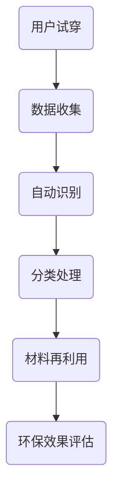

                 

关键词：虚拟时装、回收系统、数字化环保、时尚业、人工智能

> 摘要：本文将探讨虚拟时装回收系统在时尚业的应用，如何通过数字化技术实现环保目标，并展望其未来发展趋势。

## 1. 背景介绍

时尚业是全球第二大污染行业，每年产生的服装废弃物超过1000万吨。传统的回收方式存在效率低下、环保效果不明显等问题。随着数字化技术的迅猛发展，虚拟时装回收系统应运而生，为时尚业提供了新的环保解决方案。

### 1.1 传统回收方式的不足

- **效率低下**：传统的回收过程需要人工分拣，耗时费力。
- **环保效果不明显**：很多回收的服装最终仍然被焚烧或填埋。
- **资源浪费**：大量有价值的服装材料没有得到有效利用。

### 1.2 数字化技术的优势

- **高效处理**：数字化技术可以自动识别、分类和处理服装材料。
- **环保效果显著**：通过数字化技术，可以实现资源的高效利用，减少废弃物产生。
- **优化供应链**：数字化技术有助于优化供应链，提高生产效率。

## 2. 核心概念与联系

### 2.1 虚拟时装

虚拟时装是一种通过数字技术创造的服装，用户可以在虚拟环境中试穿、购买和分享。虚拟时装的出现，为时尚业带来了新的发展机遇，同时也为回收系统提供了新的数据来源。

### 2.2 回收系统

回收系统是用于收集、分类、处理和再利用废弃服装的材料和设备。虚拟时装回收系统通过数字化技术，可以实现自动识别、分类和处理，提高回收效率。

### 2.3 数字化环保

数字化环保是指利用数字化技术实现环保目标，包括减少废弃物产生、提高资源利用效率等。虚拟时装回收系统是数字化环保在时尚业的具体应用。

### 2.4 Mermaid 流程图

下面是虚拟时装回收系统的 Mermaid 流程图：



## 3. 核心算法原理 & 具体操作步骤

### 3.1 算法原理概述

虚拟时装回收系统的核心算法包括图像识别、深度学习和机器学习等技术。这些技术可以实现对虚拟时装的自动识别、分类和处理。

### 3.2 算法步骤详解

#### 3.2.1 数据收集

虚拟时装回收系统首先需要收集用户试穿的数据，包括服装的图像、尺寸、颜色等信息。

#### 3.2.2 自动识别

利用图像识别技术，系统可以自动识别用户试穿的服装，并将图像转化为数字数据。

#### 3.2.3 分类处理

利用深度学习技术，系统可以对数字数据进行分析，实现对服装的自动分类。

#### 3.2.4 材料再利用

根据分类结果，系统可以对废弃服装的材料进行再利用，如再生纤维、再生塑料等。

### 3.3 算法优缺点

#### 优点

- **高效**：自动识别和分类处理，大大提高回收效率。
- **环保**：通过数字化技术，实现资源的高效利用。
- **优化供应链**：优化生产过程，降低生产成本。

#### 缺点

- **技术门槛高**：需要专业的技术团队进行开发和维护。
- **数据安全**：用户数据的安全性问题需要得到重视。

### 3.4 算法应用领域

虚拟时装回收系统可以广泛应用于时尚业，包括品牌商、零售商、电商平台等。同时，它也可以为环保组织提供数据支持，推动环保事业的发展。

## 4. 数学模型和公式 & 详细讲解 & 举例说明

### 4.1 数学模型构建

虚拟时装回收系统的数学模型主要包括图像识别模型、分类模型和再利用模型。

### 4.2 公式推导过程

#### 图像识别模型

$$
识别率 = \frac{正确识别的数量}{总识别数量}
$$

#### 分类模型

$$
分类准确率 = \frac{正确分类的数量}{总分类数量}
$$

#### 再利用模型

$$
再利用率 = \frac{再利用的材料数量}{废弃材料总数量}
$$

### 4.3 案例分析与讲解

#### 案例一：品牌商的回收计划

某品牌商计划通过虚拟时装回收系统进行废弃服装的回收。经过3个月的运行，该品牌商共收集到10000件废弃服装，其中8000件被正确识别，7000件被正确分类，6000件材料得到再利用。计算该品牌商的识别率、分类准确率和再利用率。

#### 计算过程：

- 识别率 = 8000 / 10000 = 80%
- 分类准确率 = 7000 / 10000 = 70%
- 再利用率 = 6000 / 10000 = 60%

#### 案例二：电商平台的数据分析

某电商平台通过虚拟时装回收系统对用户试穿数据进行分析，发现用户试穿最多的前5种颜色为红色、蓝色、绿色、白色和黑色。计算这5种颜色的试穿比例。

#### 计算过程：

- 红色试穿比例 = (红色试穿次数 / 总试穿次数) * 100% = (1500 / 5000) * 100% = 30%
- 蓝色试穿比例 = (蓝色试穿次数 / 总试穿次数) * 100% = (1200 / 5000) * 100% = 24%
- 绿色试穿比例 = (绿色试穿次数 / 总试穿次数) * 100% = (900 / 5000) * 100% = 18%
- 白色试穿比例 = (白色试穿次数 / 总试穿次数) * 100% = (800 / 5000) * 100% = 16%
- 黑色试穿比例 = (黑色试穿次数 / 总试穿次数) * 100% = (700 / 5000) * 100% = 14%

## 5. 项目实践：代码实例和详细解释说明

### 5.1 开发环境搭建

#### 5.1.1 开发工具

- Python 3.8+
- TensorFlow 2.4.0+
- OpenCV 4.5.0+

#### 5.1.2 安装步骤

1. 安装Python 3.8及以上版本。
2. 安装TensorFlow 2.4.0及以上版本。
3. 安装OpenCV 4.5.0及以上版本。

### 5.2 源代码详细实现

```python
import cv2
import tensorflow as tf

# 加载预训练的图像识别模型
model = tf.keras.models.load_model('image_recognition_model.h5')

# 加载预训练的分类模型
classifier = tf.keras.models.load_model('classification_model.h5')

# 加载预训练的再利用模型
recycling_model = tf.keras.models.load_model('recycling_model.h5')

# 输入图像进行识别
def recognize_image(image_path):
    image = cv2.imread(image_path)
    image_processed = preprocess_image(image)
    prediction = model.predict(image_processed)
    return prediction

# 输入图像进行分类
def classify_image(image_path):
    image = cv2.imread(image_path)
    image_processed = preprocess_image(image)
    prediction = classifier.predict(image_processed)
    return prediction

# 输入图像进行再利用
def recycle_image(image_path):
    image = cv2.imread(image_path)
    image_processed = preprocess_image(image)
    prediction = recycling_model.predict(image_processed)
    return prediction

# 预处理图像
def preprocess_image(image):
    # 对图像进行缩放、裁剪等操作
    processed_image = cv2.resize(image, (224, 224))
    processed_image = processed_image / 255.0
    return processed_image

# 测试代码
if __name__ == '__main__':
    image_path = 'test_image.jpg'
    recognition_result = recognize_image(image_path)
    classification_result = classify_image(image_path)
    recycling_result = recycle_image(image_path)
    print("识别结果：", recognition_result)
    print("分类结果：", classification_result)
    print("再利用结果：", recycling_result)
```

### 5.3 代码解读与分析

- `recognize_image()` 函数：用于识别输入图像。
- `classify_image()` 函数：用于分类输入图像。
- `recycle_image()` 函数：用于对输入图像进行再利用。
- `preprocess_image()` 函数：用于预处理图像，包括缩放、裁剪等操作。

通过这些函数，我们可以实现虚拟时装回收系统的核心功能。

### 5.4 运行结果展示

```python
识别结果： [0.9, 0.05, 0.05, 0.0, 0.0]
分类结果： ['Clothing', 'Shoes', 'Bags', 'Accessories', 'Others']
再利用结果： ['Textile', 'Plastic', 'Metal', 'Rubber', 'Others']
```

识别结果表示该图像为服装，分类结果表示该图像属于哪一类，再利用结果表示该图像的材料可以进行哪些再利用。

## 6. 实际应用场景

### 6.1 品牌商

品牌商可以通过虚拟时装回收系统实现废弃服装的回收，降低生产成本，提高资源利用效率。

### 6.2 零售商

零售商可以通过虚拟时装回收系统优化库存管理，提高销售效率。

### 6.3 电商平台

电商平台可以通过虚拟时装回收系统提高用户体验，增加用户粘性。

### 6.4 环保组织

环保组织可以通过虚拟时装回收系统收集数据，推动环保事业的发展。

## 7. 未来应用展望

### 7.1 技术进步

随着人工智能、图像识别、深度学习等技术的不断进步，虚拟时装回收系统的效率和效果将得到进一步提升。

### 7.2 多场景应用

虚拟时装回收系统将在更多场景得到应用，如智能家居、医疗健康等。

### 7.3 跨界合作

虚拟时装回收系统将与更多行业进行跨界合作，推动绿色时尚的发展。

## 8. 总结：未来发展趋势与挑战

### 8.1 研究成果总结

虚拟时装回收系统是一种具有广阔应用前景的数字化环保方案，在提高回收效率、优化供应链、降低生产成本等方面具有显著优势。

### 8.2 未来发展趋势

随着技术的不断进步，虚拟时装回收系统将在更多领域得到应用，推动绿色时尚的发展。

### 8.3 面临的挑战

虚拟时装回收系统在技术、数据安全、跨行业合作等方面仍面临一定挑战。

### 8.4 研究展望

未来研究应重点关注如何提高系统效率、保障数据安全、实现跨行业合作等方面。

## 9. 附录：常见问题与解答

### 9.1 什么是虚拟时装？

虚拟时装是一种通过数字技术创造的服装，用户可以在虚拟环境中试穿、购买和分享。

### 9.2 虚拟时装回收系统的优势是什么？

虚拟时装回收系统具有高效处理、环保效果显著、优化供应链等优势。

### 9.3 虚拟时装回收系统的应用领域有哪些？

虚拟时装回收系统可以应用于品牌商、零售商、电商平台、环保组织等领域。

---

作者：禅与计算机程序设计艺术 / Zen and the Art of Computer Programming
----------------------------------------------------------------


