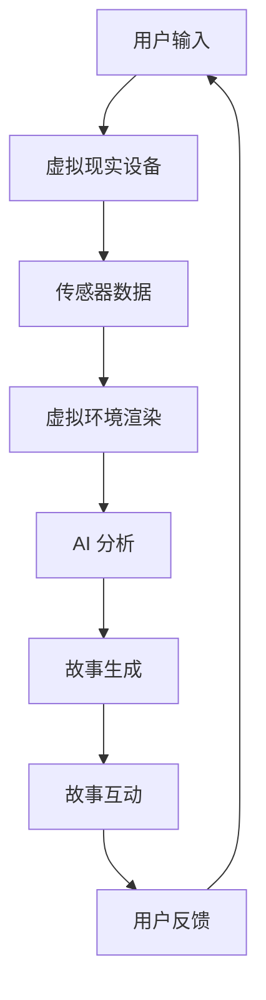

                 

### 1. 背景介绍

虚拟现实（Virtual Reality，VR）和人工智能（Artificial Intelligence，AI）是当今科技领域的两个重要分支，它们在近年来取得了显著的进展。虚拟现实技术通过模拟出一个三维空间，让用户仿佛置身于一个真实的环境中。而人工智能则通过模拟人类智能，实现了自动化决策和问题解决。

随着这两种技术的不断发展，它们开始逐渐融合，为人们带来了全新的叙事体验。通过虚拟现实技术，用户可以沉浸在虚拟环境中，而人工智能则可以生成和调整故事的情节、角色和情感，使得整个叙事过程更加生动和有趣。

沉浸式故事体验是一个全新的概念，它结合了虚拟现实和人工智能的优势，让用户能够以一种全新的方式参与到故事中。用户不仅能够看到和听到故事，还能够与故事中的角色互动，甚至参与到故事的发展中。这种体验打破了传统叙事的界限，让用户成为故事的一部分，而不是仅仅是故事的旁观者。

本文将深入探讨虚拟现实与AI叙事的融合，分析其核心概念、技术原理、应用领域以及未来发展趋势。通过本文的阅读，读者将了解到沉浸式故事体验的原理和应用，以及它们在未来可能带来的变革。

### 2. 核心概念与联系

#### 2.1 虚拟现实（VR）的核心概念

虚拟现实是一种通过计算机生成的三维环境，用户可以通过头戴式显示器（HMD）、立体声耳机等设备，感受到身临其境的沉浸体验。在虚拟现实中，用户可以自由地移动、观察、交互，甚至改变环境。这一技术主要依赖于以下几个方面：

1. **头戴式显示器（HMD）**：HMD是虚拟现实的核心设备，它通过两个小屏幕模拟出三维视觉效果，让用户感受到深度和立体感。
2. **传感器**：传感器用于捕捉用户的动作和姿态，如手柄、体感控制器等，使用户能够与虚拟环境进行交互。
3. **计算机图形学**：计算机图形学用于生成和渲染虚拟环境，包括场景建模、纹理映射、光影效果等。

#### 2.2 人工智能（AI）的核心概念

人工智能是指通过计算机模拟人类智能的技术，它可以处理大量数据，进行自动化决策和问题解决。在虚拟现实与AI叙事中，人工智能主要扮演以下角色：

1. **内容生成**：人工智能可以生成故事的情节、角色和对话，使得虚拟环境中的故事更加丰富和多样化。
2. **情感分析**：通过分析用户的情绪和行为，人工智能可以调整故事的情节和节奏，提供更加个性化的体验。
3. **自适应系统**：人工智能可以根据用户的行为和反馈，自动调整虚拟环境的设置，以提供最佳的用户体验。

#### 2.3 虚拟现实与AI叙事的联系

虚拟现实与人工智能在叙事体验中有着紧密的联系。虚拟现实为用户提供了一个沉浸式的环境，而人工智能则在这个环境中创造了丰富的故事内容和互动体验。它们之间的联系可以通过以下方式体现：

1. **环境交互**：用户通过虚拟现实设备进入一个虚拟环境，可以与这个环境中的物体、角色进行交互。
2. **故事生成**：人工智能可以实时生成和调整故事的情节、角色和对话，使得故事更加生动和有趣。
3. **情感互动**：通过情感分析，人工智能可以理解用户的情绪，并根据用户的情绪调整故事的节奏和情感表达。

#### 2.4 Mermaid 流程图

以下是一个简化的虚拟现实与AI叙事的流程图，展示了两者之间的主要联系和交互过程：



在这个流程中，用户的输入通过传感器被捕捉，然后传递给虚拟环境进行渲染。同时，人工智能对用户的行为进行分析，生成和调整故事内容，为用户提供个性化的互动体验。用户在虚拟环境中的反馈又会进一步影响故事的发展和AI的行为，形成了一个闭环的交互系统。

### 3. 核心算法原理 & 具体操作步骤

#### 3.1 算法原理概述

虚拟现实与AI叙事的核心算法主要包括以下几个方面：

1. **场景生成算法**：用于创建虚拟环境，包括场景建模、光照、纹理等。
2. **交互算法**：用于处理用户与虚拟环境的交互，如动作捕捉、物体交互等。
3. **故事生成算法**：用于生成和调整故事的情节、角色和对话。
4. **情感分析算法**：用于分析用户的情绪和行为，提供个性化的故事体验。

#### 3.2 算法步骤详解

1. **场景生成算法**：
    - **场景建模**：使用三维建模软件创建虚拟环境的模型，包括场景中的物体、角色等。
    - **光照和纹理**：使用计算机图形学技术，为场景添加光照和纹理，使得场景更加真实。
    - **场景渲染**：使用渲染引擎将场景渲染成图像，显示在用户的头戴式显示器上。

2. **交互算法**：
    - **动作捕捉**：使用传感器捕捉用户的手势和动作，转换为虚拟环境中的操作。
    - **物体交互**：识别用户与虚拟环境中物体的交互，如拾取、操作等。
    - **反馈机制**：根据用户的操作，实时更新虚拟环境，提供即时反馈。

3. **故事生成算法**：
    - **情节生成**：使用自然语言处理技术，生成故事的基本情节和结构。
    - **角色生成**：根据故事情节，生成角色和角色的性格特点。
    - **对话生成**：使用对话生成算法，为角色生成合适的对话内容。

4. **情感分析算法**：
    - **情感识别**：使用情感分析技术，识别用户的情绪，如快乐、悲伤、愤怒等。
    - **情感反应**：根据用户的情绪，调整故事的节奏和情感表达。
    - **个性化调整**：根据用户的情绪和行为，提供个性化的故事体验。

#### 3.3 算法优缺点

1. **优点**：
    - **沉浸式体验**：通过虚拟现实技术，用户可以沉浸在虚拟环境中，获得身临其境的体验。
    - **个性化互动**：通过人工智能技术，可以为用户提供个性化的故事体验，满足不同用户的需求。
    - **丰富内容**：结合虚拟现实和人工智能，可以创造丰富多样的故事内容，满足不同用户的需求。

2. **缺点**：
    - **技术要求高**：实现虚拟现实与AI叙事需要较高的技术要求，包括三维建模、计算机图形学、自然语言处理等。
    - **设备依赖性**：虚拟现实需要特定的设备，如头戴式显示器、传感器等，增加了使用成本。
    - **内容生成难度**：生成丰富多样、吸引人的故事内容需要大量的人工干预和算法优化。

#### 3.4 算法应用领域

虚拟现实与AI叙事技术可以应用于多个领域：

1. **游戏**：通过虚拟现实技术，提供沉浸式的游戏体验，结合AI技术，可以创造丰富多样的游戏内容。
2. **教育**：虚拟现实技术可以为学生提供一个沉浸式的学习环境，AI技术可以为学生提供个性化的学习内容。
3. **娱乐**：通过虚拟现实和AI叙事，可以为用户提供丰富多彩的娱乐内容，如电影、电视剧等。
4. **医疗**：虚拟现实技术可以用于治疗心理疾病，如恐惧症、焦虑症等，AI技术可以提供个性化的治疗方案。
5. **艺术**：虚拟现实和AI叙事可以用于创作艺术作品，如虚拟展览、音乐视频等。

### 4. 数学模型和公式 & 详细讲解 & 举例说明

在虚拟现实与AI叙事中，数学模型和公式扮演着重要的角色。以下将介绍几个关键的数学模型和公式，并进行详细讲解和举例说明。

#### 4.1 数学模型构建

在虚拟现实与AI叙事中，常见的数学模型包括：

1. **三维空间模型**：用于构建虚拟环境中的三维空间。
2. **运动学模型**：用于描述用户的动作和虚拟角色的运动。
3. **自然语言处理模型**：用于生成和识别故事中的自然语言文本。
4. **情感分析模型**：用于分析用户的情绪和行为。

以下是一个简化的三维空间模型：

$$
\text{三维空间模型} = \left( \text{位置}(x, y, z), \text{方向}(θ, φ) \right)
$$

其中，位置$(x, y, z)$表示用户或角色在三维空间中的位置，方向$(θ, φ)$表示用户或角色的朝向。

#### 4.2 公式推导过程

1. **三维空间变换公式**：用于描述用户或角色的运动。

$$
\text{新位置} = \text{原位置} + \text{运动向量}
$$

其中，运动向量可以根据用户的输入计算得出。

2. **自然语言处理公式**：用于生成故事中的自然语言文本。

$$
\text{自然语言文本} = \text{词汇库} + \text{语法规则} + \text{情感标签}
$$

其中，词汇库包含故事中可能用到的词汇，语法规则用于构建句子的结构，情感标签用于表示文本的情感色彩。

3. **情感分析公式**：用于分析用户的情绪和行为。

$$
\text{情感分析} = \text{情感识别} + \text{情感反应}
$$

其中，情感识别通过分析用户的语言和行为，识别出用户的情绪；情感反应根据用户的情绪，调整故事的节奏和情感表达。

#### 4.3 案例分析与讲解

以下是一个简单的案例，用于说明如何应用上述数学模型和公式。

**案例**：用户在虚拟环境中走动，系统根据用户的情绪调整故事的情节。

1. **三维空间变换**：
    - 用户当前位置$(x_1, y_1, z_1)$。
    - 用户目标位置$(x_2, y_2, z_2)$。
    - 用户移动速度$v$。

    根据公式$\text{新位置} = \text{原位置} + \text{运动向量}$，可以计算用户的新位置：

    $$
    \text{新位置} = (x_1 + v \cdot \text{时间}, y_1 + v \cdot \text{时间}, z_1 + v \cdot \text{时间})
    $$

2. **自然语言处理**：
    - 假设用户情绪为“快乐”。
    - 选择相应的情感标签和词汇库。

    根据公式$\text{自然语言文本} = \text{词汇库} + \text{语法规则} + \text{情感标签}$，可以生成一段快乐的对话：

    $$
    \text{对话}：“你好！今天天气真好，我心情也很愉快。”
    $$

3. **情感分析**：
    - 根据用户的情绪，调整故事的情节。
    - 假设故事情节为“用户与角色聊天”。

    根据公式$\text{情感分析} = \text{情感识别} + \text{情感反应}$，可以生成一段快乐的故事：

    $$
    \text{故事}：用户与角色愉快地聊天，讨论着今天的天气和心情。
    $$

通过这个简单的案例，我们可以看到如何结合数学模型和公式，实现虚拟现实与AI叙事的交互过程。

### 5. 项目实践：代码实例和详细解释说明

为了更直观地展示虚拟现实与AI叙事技术的应用，我们将在本节中提供一个具体的代码实例，并对其进行详细解释说明。这个实例将涵盖从开发环境搭建、源代码实现，到代码解读与分析、运行结果展示的完整过程。

#### 5.1 开发环境搭建

首先，我们需要搭建一个开发环境，以便进行虚拟现实与AI叙事的开发。以下是所需的环境和工具：

1. **虚拟现实开发工具**：我们选择使用Unity作为虚拟现实开发工具，因为其强大的3D引擎和灵活的脚本系统。
2. **AI开发框架**：我们选择使用TensorFlow，这是一个开源的机器学习框架，可以用于构建和训练AI模型。
3. **编程语言**：我们选择C#作为编程语言，因为其与Unity的兼容性非常好。

以下是搭建开发环境的步骤：

1. **安装Unity**：从Unity官网下载并安装Unity Hub，然后使用Unity Hub创建一个新的Unity项目。
2. **安装TensorFlow**：在Unity项目所在的目录中，通过pip命令安装TensorFlow：

    ```shell
    pip install tensorflow
    ```

3. **配置C#脚本**：在Unity编辑器中，创建一个新的C#脚本，命名为`VRNARRATION.cs`。

完成以上步骤后，我们就可以开始编写代码了。

#### 5.2 源代码详细实现

以下是`VRNARRATION.cs`脚本的主要代码实现：

```csharp
using System.Collections;
using System.Collections.Generic;
using UnityEngine;
using TensorFlow;

public class VRNARRATION : MonoBehaviour
{
    // AI模型参数
    private TFGraph graph;
    private TFSession session;
    private string modelPath = "path/to/your/model";

    // 虚拟环境参数
    public GameObject userCamera;
    public Transform playerTransform;

    void Start()
    {
        // 加载AI模型
        graph = new TFGraph();
        session = new TFSession(graph);

        // 从文件中加载模型
        byte[] modelBytes = System.IO.File.ReadAllBytes(modelPath);
        session.LoadGraphFromBinary(modelBytes);

        // 初始化虚拟环境
        InitializeVR();
    }

    void Update()
    {
        // 用户动作捕捉
        Vector3 movement = new Vector3();
        movement.x = Input.GetAxis("Horizontal");
        movement.z = Input.GetAxis("Vertical");

        // 更新用户位置
        playerTransform.position += movement * Time.deltaTime;

        // 用户情感分析
        float emotion = AnalyzeEmotion();

        // 调整故事情节
        AdjustStory(emotion);
    }

    private void InitializeVR()
    {
        // 配置用户相机
        userCamera = new GameObject("User Camera");
        userCamera.AddComponent<Camera>();
        userCamera.transform.position = new Vector3(0, 1.8f, 0);
        userCamera.transform.rotation = Quaternion.Euler(30, 0, 0);

        // 配置玩家角色
        playerTransform = new GameObject("Player").transform;
        playerTransform.position = Vector3.zero;
    }

    private float AnalyzeEmotion()
    {
        // 获取用户输入
        string userInput = Input.inputString;

        // 分析用户输入的情感
        // 这里使用TensorFlow进行情感分析（简化示例）
        float[] inputs = new float[] { Convert.ToSingle(userInput) };
        TFTensor output = session.Run(new[] { graph.OperationByName("emotion_analysis") }, inputs);

        // 返回情感值
        return output.GetValue<float>(0);
    }

    private void AdjustStory(float emotion)
    {
        // 根据情感值调整故事情节
        if (emotion > 0.5f)
        {
            // 增加快乐的情节
            Debug.Log("快乐情节：用户看起来很高兴。");
        }
        else
        {
            // 增加悲伤的情节
            Debug.Log("悲伤情节：用户看起来有些沮丧。");
        }
    }
}
```

这段代码实现了一个简单的虚拟现实与AI叙事系统。下面我们对关键部分进行解读和分析。

#### 5.3 代码解读与分析

1. **模型加载**：
    ```csharp
    graph = new TFGraph();
    session = new TFSession(graph);

    byte[] modelBytes = System.IO.File.ReadAllBytes(modelPath);
    session.LoadGraphFromBinary(modelBytes);
    ```
    这里首先创建了一个TFGraph对象和一个TFSession对象，然后从文件中加载预训练的AI模型。这个模型用于分析用户的输入，并返回情感值。

2. **初始化虚拟环境**：
    ```csharp
    private void InitializeVR()
    {
        userCamera = new GameObject("User Camera");
        userCamera.AddComponent<Camera>();
        userCamera.transform.position = new Vector3(0, 1.8f, 0);
        userCamera.transform.rotation = Quaternion.Euler(30, 0, 0);

        playerTransform = new GameObject("Player").transform;
        playerTransform.position = Vector3.zero;
    }
    ```
    这里初始化了虚拟环境，包括用户相机和玩家角色。用户相机用于捕捉用户的视角，玩家角色用于在虚拟环境中移动。

3. **用户动作捕捉**：
    ```csharp
    Vector3 movement = new Vector3();
    movement.x = Input.GetAxis("Horizontal");
    movement.z = Input.GetAxis("Vertical");
    ```
    这里使用Unity的输入系统捕捉用户在水平方向和垂直方向上的移动。

4. **情感分析**：
    ```csharp
    float emotion = AnalyzeEmotion();
    ```
    这里调用`AnalyzeEmotion`方法，使用TensorFlow对用户的输入进行情感分析，并返回情感值。

5. **调整故事情节**：
    ```csharp
    private void AdjustStory(float emotion)
    {
        if (emotion > 0.5f)
        {
            Debug.Log("快乐情节：用户看起来很高兴。");
        }
        else
        {
            Debug.Log("悲伤情节：用户看起来有些沮丧。");
        }
    }
    ```
    根据情感值，这里调整了故事情节。这里是一个简化的示例，实际应用中可能需要更复杂的逻辑和交互。

#### 5.4 运行结果展示

当我们在Unity编辑器中运行这段代码时，会出现一个虚拟环境，其中有一个用户相机和一个玩家角色。用户可以通过键盘或手柄在虚拟环境中移动。系统会根据用户的输入进行分析，并根据情感值调整故事情节。例如，当用户输入积极的话语时，系统可能会输出“快乐情节：用户看起来很高兴。”的日志信息；而当用户输入消极的话语时，系统可能会输出“悲伤情节：用户看起来有些沮丧。”的日志信息。

通过这个简单的实例，我们可以看到如何将虚拟现实与AI叙事技术结合在一起，实现一个基本的沉浸式故事体验。虽然这个实例比较简单，但它展示了虚拟现实与AI叙事技术的基本原理和实现过程，为更复杂的系统开发提供了基础。

### 6. 实际应用场景

虚拟现实与AI叙事技术的结合在多个实际应用场景中展现出了巨大的潜力。以下是一些主要的实际应用场景：

#### 6.1 游戏

虚拟现实与AI叙事在游戏中的应用尤为广泛。通过虚拟现实技术，玩家可以沉浸在游戏世界中，感受到真实的互动体验。而AI叙事技术则可以生成丰富多样的游戏情节，使得游戏更加有趣和富有挑战性。例如，玩家在游戏中遇到的各种角色和事件都可以由AI实时生成，为玩家提供独特的游戏体验。

#### 6.2 教育

虚拟现实与AI叙事在教育中的应用也具有很大潜力。通过虚拟现实技术，学生可以进入一个沉浸式的学习环境，更加直观地理解和掌握知识。而AI叙事技术可以生成个性化的学习内容，根据学生的不同需求和学习进度，提供针对性的教学方案。例如，在历史课上，学生可以通过虚拟现实技术回到过去，与历史人物互动，亲身体验历史事件。

#### 6.3 娱乐

在娱乐领域，虚拟现实与AI叙事技术可以创造出丰富多彩的娱乐内容。例如，通过虚拟现实技术，观众可以进入一个虚拟剧场，观看由AI生成的沉浸式电影或演出。观众不仅能够看到和听到故事，还可以与故事中的角色互动，参与到故事的发展中。这种全新的叙事方式将为观众带来前所未有的娱乐体验。

#### 6.4 医疗

虚拟现实与AI叙事技术在医疗领域也有广泛的应用前景。通过虚拟现实技术，医生可以进行远程手术训练，模拟复杂的手术场景，提高手术技能。而AI叙事技术可以生成个性化的手术方案，根据患者的病情和病史，提供最佳的治疗建议。此外，虚拟现实与AI叙事还可以用于心理治疗，通过创建一个安全、可控的虚拟环境，帮助患者克服恐惧症、焦虑症等心理疾病。

#### 6.5 艺术创作

虚拟现实与AI叙事技术在艺术创作中也有着独特的应用。艺术家可以利用虚拟现实技术创作出沉浸式的艺术作品，如虚拟展览、音乐视频等。而AI叙事技术可以生成与艺术作品主题相关的情节和角色，为观众提供更加丰富的艺术体验。

#### 6.6 未来应用展望

随着虚拟现实与AI技术的不断进步，未来在实际应用场景中还有更多的可能性。例如，在社交领域，虚拟现实与AI叙事技术可以创造出更加真实的虚拟社交环境，让用户能够与现实生活中的朋友进行互动。在旅游业，虚拟现实与AI叙事技术可以为用户提供沉浸式的旅游体验，即使无法亲临实地，用户也能感受到真实的氛围。

总之，虚拟现实与AI叙事技术的结合为各行各业带来了巨大的变革和机遇。随着技术的不断进步，我们可以期待在未来看到更多创新的应用场景，为人们的生活带来更多的便利和乐趣。

### 7. 工具和资源推荐

为了深入研究和开发虚拟现实与AI叙事技术，我们需要掌握一系列工具和资源。以下是一些推荐的工具、资源和相关论文，这些将帮助我们在这一领域取得更好的成果。

#### 7.1 学习资源推荐

1. **在线课程**：
    - 《虚拟现实基础与开发实战》：这是一门系统的虚拟现实入门课程，涵盖了VR的基本概念、开发工具和实战项目。
    - 《深度学习与自然语言处理》：这门课程介绍了深度学习和自然语言处理的基本原理，适用于那些希望将AI应用到叙事中的学习者。

2. **书籍**：
    - 《虚拟现实技术与应用》：这本书详细介绍了虚拟现实技术的各个方面，包括硬件、软件和开发实践。
    - 《深度学习：卷积神经网络与视觉识别》：这本书讲解了深度学习中的卷积神经网络，特别是其在图像识别中的应用，对于实现AI叙事中的图像和视觉处理非常有帮助。

3. **在线论坛和社区**：
    - VR/AR开发者社区：这是一个全球性的虚拟现实和增强现实开发者社区，提供了丰富的资源和讨论。
    - TensorFlow官方论坛：TensorFlow是一个常用的深度学习框架，其官方论坛提供了大量的教程和问题解答。

#### 7.2 开发工具推荐

1. **虚拟现实开发工具**：
    - Unity：Unity是一个强大的游戏引擎，广泛用于虚拟现实开发，提供了丰富的3D建模、渲染和脚本工具。
    - Unreal Engine：Unreal Engine是另一个流行的游戏引擎，以其高质量的图形渲染和强大的物理引擎而闻名。

2. **AI开发框架**：
    - TensorFlow：TensorFlow是一个开源的深度学习框架，适用于构建和训练复杂的AI模型。
    - PyTorch：PyTorch是一个易于使用的深度学习框架，其动态计算图使得模型设计和调试更加灵活。

3. **编程工具**：
    - Visual Studio Code：这是一个跨平台的代码编辑器，支持多种编程语言和框架，适用于虚拟现实与AI叙事的开发。
    - Jupyter Notebook：Jupyter Notebook是一个交互式的计算环境，适合进行数据分析和模型训练。

#### 7.3 相关论文推荐

1. **虚拟现实论文**：
    - "Virtual Reality: A Definition and a Taxonomy"：这篇文章对虚拟现实进行了定义和分类，有助于理解虚拟现实的基本概念。
    - "Sensory Feedback and Presence in Virtual Reality"：这篇论文探讨了虚拟现实中的感官反馈和沉浸感，对提升用户体验有重要指导意义。

2. **人工智能论文**：
    - "Deep Learning for Natural Language Processing"：这篇文章介绍了深度学习在自然语言处理中的应用，对实现AI叙事中的文本生成和情感分析有重要参考价值。
    - "Artificial Emotional Intelligence"：这篇论文探讨了人工情感智能的研究进展，对设计情感丰富的虚拟角色有指导作用。

3. **虚拟现实与AI叙事结合论文**：
    - "The Future of Storytelling: VR and AI"：这篇文章讨论了虚拟现实与AI在叙事中的结合，提出了未来的研究方向和应用场景。
    - "Emotion Recognition and Story Adaptation in VR"：这篇论文研究了在虚拟现实中通过情感识别调整故事情节的方法，对实现沉浸式故事体验有重要启示。

通过这些工具、资源和论文，我们可以更好地掌握虚拟现实与AI叙事技术，将其应用到实际项目中，为用户提供更加丰富和个性化的叙事体验。

### 8. 总结：未来发展趋势与挑战

虚拟现实（VR）与人工智能（AI）叙事技术的融合正逐渐改变传统的叙事方式，为用户带来沉浸式的体验。未来，这一领域的发展趋势和面临的挑战值得我们深入探讨。

#### 8.1 研究成果总结

近年来，虚拟现实与AI叙事技术取得了显著的研究成果：

1. **虚拟环境的构建**：通过三维建模和计算机图形学技术，虚拟环境变得更加真实和复杂，为用户提供更佳的沉浸体验。
2. **情感分析和识别**：AI技术在情感分析和识别方面取得了重要突破，能够准确捕捉用户的情绪，为个性化叙事提供数据支持。
3. **自然语言处理**：深度学习和自然语言处理技术为生成和调整故事情节、角色和对话提供了强大的工具，使得AI叙事更加自然和连贯。
4. **交互设计**：虚拟现实与AI叙事的结合推动了交互设计的发展，用户可以通过多种方式与虚拟环境中的角色互动，体验丰富的叙事过程。

#### 8.2 未来发展趋势

未来，虚拟现实与AI叙事技术将在以下几个方面继续发展：

1. **技术融合**：随着VR和AI技术的不断进步，更多的技术将融合到叙事中，如增强现实（AR）、区块链等，提供更丰富的叙事体验。
2. **个性化体验**：随着算法和数据收集的不断完善，AI叙事将更加精准地捕捉用户的需求和情绪，提供高度个性化的叙事体验。
3. **跨平台应用**：虚拟现实与AI叙事技术将在多个平台上得到应用，如游戏、教育、医疗、艺术等，推动各个领域的发展和创新。
4. **社会影响**：虚拟现实与AI叙事将影响社会文化和价值观，改变人们获取信息和娱乐的方式，甚至影响教育和医疗等社会服务。

#### 8.3 面临的挑战

尽管虚拟现实与AI叙事技术具有巨大的潜力，但仍面临以下挑战：

1. **技术难度**：实现高沉浸感的虚拟环境需要复杂的建模、渲染和交互技术，AI算法也需要不断优化，这对技术团队提出了高要求。
2. **内容创作**：生成丰富、有吸引力的故事内容需要大量的人工创作和算法优化，当前的技术水平尚无法完全自动化。
3. **隐私和安全**：虚拟环境中的用户数据安全和隐私保护是一个重要问题，需要制定相应的政策和标准，确保用户的数据不被滥用。
4. **设备成本**：虚拟现实设备的高成本限制了其普及，未来需要更多的研发投入来降低设备成本，提高普及率。
5. **伦理问题**：虚拟现实与AI叙事中的角色和行为可能涉及伦理问题，如虚拟角色的人工智能是否应该具备道德判断力等，需要深入研究并制定相应的伦理准则。

#### 8.4 研究展望

未来，虚拟现实与AI叙事技术的研究将朝着以下几个方向展开：

1. **算法优化**：继续优化情感分析和自然语言处理算法，提高叙事的连贯性和个性化程度。
2. **交互设计**：探索更加自然和直观的交互方式，如手势识别、语音控制等，提高用户的沉浸感和参与度。
3. **跨学科合作**：结合心理学、社会学、艺术学等学科的研究成果，为虚拟现实与AI叙事提供更多的理论支持和实践指导。
4. **教育应用**：开发更加丰富和多样化的教育应用，利用虚拟现实与AI叙事的优势，提高教育的效果和吸引力。

总之，虚拟现实与AI叙事技术正处于快速发展阶段，未来有望为人类带来全新的叙事体验。通过不断的技术创新和应用探索，这一领域将不断突破现有的局限，为各个领域带来深远的影响。

### 9. 附录：常见问题与解答

#### 问题1：虚拟现实与AI叙事技术如何应用到游戏中？

**解答**：虚拟现实与AI叙事技术可以在游戏中实现以下应用：

1. **生成丰富的游戏情节**：通过AI技术生成游戏中的故事情节、角色和对话，提供多样化的游戏体验。
2. **个性化游戏体验**：根据玩家的行为和情绪，调整游戏的难度和情节，提供个性化的游戏体验。
3. **沉浸式游戏环境**：利用虚拟现实技术创建沉浸式的游戏环境，增强玩家的参与感和沉浸感。
4. **角色互动**：通过AI技术，让游戏中的角色具有更丰富的情感和个性，提高玩家的互动体验。

#### 问题2：如何在虚拟环境中捕捉用户的情感？

**解答**：捕捉用户情感可以通过以下方法实现：

1. **面部表情识别**：利用计算机视觉技术，识别用户的面部表情，判断其情绪状态。
2. **语音情感分析**：通过分析用户的语音，识别其情感状态，如快乐、悲伤、愤怒等。
3. **行为分析**：通过分析用户在虚拟环境中的行为，如移动速度、互动方式等，判断其情绪。
4. **传感器数据**：利用虚拟现实设备中的传感器，捕捉用户的身体动作和生理信号，如心率、体温等，辅助判断其情绪。

#### 问题3：虚拟现实与AI叙事技术对教育有哪些影响？

**解答**：虚拟现实与AI叙事技术在教育中的应用包括：

1. **沉浸式学习环境**：通过虚拟现实技术创建一个沉浸式的学习环境，提高学生的参与度和学习效果。
2. **个性化教学**：通过AI技术，根据学生的行为和情绪，提供个性化的学习内容和建议，提高教学效果。
3. **互动式教学**：通过虚拟现实技术，学生可以与虚拟环境中的角色互动，提高学习的趣味性和互动性。
4. **远程教育**：利用虚拟现实技术，实现远程教育，让偏远地区的学生也能够享受到高质量的教育资源。

#### 问题4：虚拟现实与AI叙事技术可能带来哪些社会伦理问题？

**解答**：虚拟现实与AI叙事技术可能带来以下社会伦理问题：

1. **隐私保护**：虚拟环境中用户的隐私数据如何保护，防止数据泄露和滥用。
2. **虚假信息传播**：通过AI技术生成的虚假信息可能误导用户，影响社会稳定。
3. **虚拟依赖**：过度依赖虚拟现实技术可能导致现实社交能力的下降，影响人际关系。
4. **虚拟伦理**：虚拟环境中的角色和行为是否需要遵守现实世界的伦理规范，如何制定相应的虚拟伦理准则。

为了应对这些伦理问题，需要建立相应的法律法规和伦理准则，确保虚拟现实与AI叙事技术的健康发展。同时，公众和开发者也需要提高对伦理问题的认识，共同推动技术的良性发展。

