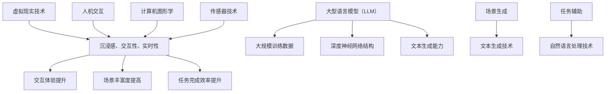

                 

 虚拟现实（VR）作为一项前沿技术，近年来在多个领域取得了显著的发展，包括游戏、教育、医疗、军事训练等。随着计算机图形学、人机交互以及人工智能等技术的不断进步，虚拟现实的应用场景和用户体验也在持续优化。特别是在人工智能领域，大型语言模型（LLM）的崛起为虚拟现实带来了新的机遇和挑战。本文将探讨如何在虚拟现实中应用LLM技术，以增强用户的交互体验。

## 1. 背景介绍

虚拟现实技术的发展可以追溯到20世纪60年代。早期的VR系统主要以模拟环境和简单交互为特点，但随着计算机处理能力的提升和图形显示技术的进步，虚拟现实逐渐变得更加真实和互动。进入21世纪，VR技术在多个领域得到了广泛应用，同时也推动了人机交互技术的发展。

与此同时，人工智能（AI）作为计算机科学的一个重要分支，已经取得了诸多突破性成果。其中，大型语言模型（LLM）作为一种先进的自然语言处理技术，通过深度学习算法对大量文本数据进行训练，能够生成语义丰富、连贯自然的文本。LLM在文本生成、机器翻译、问答系统等领域展现了强大的能力，也为虚拟现实提供了新的交互手段。

本文将结合虚拟现实和LLM技术的特点，探讨如何在虚拟现实中应用LLM，以提高用户的交互体验。本文将分为以下几个部分：

- **1. 背景介绍**：回顾虚拟现实和LLM技术的发展历程。
- **2. 核心概念与联系**：介绍虚拟现实和LLM的核心概念及其相互关系。
- **3. 核心算法原理与具体操作步骤**：详细讲解LLM在虚拟现实中的应用算法及其操作步骤。
- **4. 数学模型和公式**：介绍LLM的数学模型及其推导过程。
- **5. 项目实践**：通过具体案例展示LLM在虚拟现实中的应用。
- **6. 实际应用场景**：探讨LLM在虚拟现实中的实际应用。
- **7. 工具和资源推荐**：推荐学习资源和开发工具。
- **8. 总结**：总结研究成果，展望未来发展趋势与挑战。

## 2. 核心概念与联系

### 虚拟现实的概念

虚拟现实（Virtual Reality，VR）是一种通过计算机技术和传感器设备创造的模拟环境，用户可以通过头戴式显示器、手柄、触觉手套等设备感知并与之互动。虚拟现实的主要特点包括沉浸感、交互性和实时性。

- **沉浸感**：用户在虚拟环境中感受到的高度真实感，仿佛置身于现实世界之中。
- **交互性**：用户可以通过各种设备与虚拟环境进行交互，如移动、操控、触摸等。
- **实时性**：虚拟环境能够实时响应用户的操作，提供即时的反馈。

### 大型语言模型（LLM）的概念

大型语言模型（Large Language Model，LLM）是一种基于深度学习的自然语言处理技术，通过训练大量文本数据，LLM能够理解和生成人类语言的语义。LLM的主要特点包括：

- **大规模训练数据**：LLM通常基于数百万甚至数十亿级别的文本数据，从中学习语言模式、语义关系等。
- **深度神经网络结构**：LLM通常采用多层感知机（MLP）、循环神经网络（RNN）、变换器（Transformer）等深度学习模型，具有强大的表示和学习能力。
- **文本生成能力**：LLM能够根据输入的文本或提示生成语义连贯、逻辑合理的文本。

### 虚拟现实与LLM的联系

虚拟现实和LLM技术在多个方面具有紧密的联系：

- **交互体验**：虚拟现实为用户提供了沉浸式和交互式的环境，LLM则通过自然语言处理技术提升了用户的交互体验。例如，用户可以在虚拟现实中与虚拟角色进行对话，LLM能够理解用户的语言并生成相应的回复。
- **场景生成**：虚拟现实中的场景生成通常需要大量的文本描述，LLM可以通过文本生成技术生成丰富的虚拟场景描述，为虚拟现实提供更加真实的体验。
- **任务辅助**：在虚拟现实任务中，LLM可以作为智能助手，提供任务指导、决策支持等，帮助用户更好地完成任务。

### Mermaid 流程图

为了更好地展示虚拟现实与LLM技术的联系，我们使用Mermaid流程图对核心概念和架构进行描述：



该流程图展示了虚拟现实技术和LLM技术之间的核心概念及其相互关系。通过这一架构，用户在虚拟现实中的交互体验、场景生成和任务辅助能力得到了显著提升。

## 3. 核心算法原理与具体操作步骤

### 3.1 算法原理概述

在虚拟现实应用中，LLM的核心算法原理主要包括以下几个方面：

1. **文本生成**：LLM可以通过训练大量文本数据，学习语言模式和语义关系，从而实现文本的自动生成。这对于虚拟现实中的场景描述、对话生成等具有重要作用。
2. **语义理解**：LLM能够理解和解析输入的文本，提取其中的语义信息，为后续的交互提供支持。这包括情感分析、实体识别、关系抽取等任务。
3. **对话生成**：LLM可以根据用户输入的文本或指令，生成相应的回复，实现与用户的自然对话交互。
4. **知识推理**：LLM可以通过推理机制，结合上下文信息，为用户提供建议、决策支持等。

### 3.2 算法步骤详解

1. **文本生成**
   - **数据收集与预处理**：收集大规模的文本数据，并进行清洗、去噪等预处理操作。
   - **模型训练**：使用深度学习算法，如变换器（Transformer），对预处理后的文本数据进行训练，学习语言模式和语义关系。
   - **生成文本**：给定一个种子文本或提示，LLM根据训练好的模型生成相应的文本。

2. **语义理解**
   - **文本解析**：使用自然语言处理技术，如词法分析、句法分析，对输入的文本进行解析，提取其中的关键词、实体、关系等信息。
   - **语义分析**：对提取的信息进行语义分析，理解文本的含义和意图。
   - **上下文理解**：结合上下文信息，对语义进行进一步分析和推理。

3. **对话生成**
   - **输入处理**：接收用户的输入文本，进行预处理，如分词、词性标注等。
   - **意图识别**：使用机器学习算法，如条件生成模型，识别用户的意图。
   - **生成回复**：根据识别的意图和上下文信息，生成相应的回复文本。

4. **知识推理**
   - **知识库构建**：构建包含领域知识的知识库，如事实、规则、关系等。
   - **推理机制**：使用推理算法，如逻辑推理、知识图谱，结合上下文信息进行推理。
   - **提供建议**：根据推理结果，为用户提供建议、决策支持等。

### 3.3 算法优缺点

1. **优点**
   - **强大的文本生成能力**：LLM能够根据输入的文本或提示生成语义连贯、逻辑合理的文本，为虚拟现实中的对话生成和场景描述提供了便利。
   - **丰富的语义理解能力**：LLM可以理解和解析输入的文本，提取其中的关键词、实体、关系等信息，为交互提供支持。
   - **灵活的知识推理能力**：LLM可以通过知识推理机制，为用户提供建议、决策支持等。

2. **缺点**
   - **计算资源消耗**：由于LLM通常采用深度学习模型，对计算资源要求较高，需要大量的GPU等硬件支持。
   - **数据依赖性**：LLM的性能依赖于训练数据的质量和规模，如果训练数据质量较差，可能会影响模型的性能。
   - **潜在的安全风险**：由于LLM可以生成大量的文本，可能会被用于生成虚假信息、误导用户等，需要加强安全监管。

### 3.4 算法应用领域

LLM在虚拟现实中的应用领域广泛，主要包括以下几个方面：

- **虚拟现实对话系统**：LLM可以用于虚拟现实中的对话系统，实现与用户的自然对话交互，提升用户体验。
- **虚拟现实场景生成**：LLM可以生成丰富的虚拟现实场景描述，提高场景的真实感和互动性。
- **虚拟现实任务辅助**：LLM可以提供任务指导、决策支持等，帮助用户更好地完成任务。
- **虚拟现实教育培训**：LLM可以用于虚拟现实中的教育培训，提供个性化的教学方案和互动体验。

## 4. 数学模型和公式

### 4.1 数学模型构建

LLM的数学模型主要基于深度学习算法，其中变换器（Transformer）模型是最常用的架构之一。变换器模型主要由编码器（Encoder）和解码器（Decoder）两部分组成。

1. **编码器（Encoder）**

   编码器的输入是一个序列的词向量，输出是一个上下文向量。编码器的核心结构是自注意力机制（Self-Attention），它可以自适应地计算每个词向量在序列中的重要性。

   $$\text{Encoder}(\text{x}) = \text{MultiHeadAttention}(\text{EmbeddingLayer}(\text{x}))$$

   其中，$\text{EmbeddingLayer}$用于将词向量映射到高维空间，$\text{MultiHeadAttention}$用于实现自注意力机制。

2. **解码器（Decoder）**

   解码器的输入是一个序列的词向量，输出是一个词向量。解码器的核心结构是多头注意力机制（Multi-HeadAttention）和前馈神经网络（Feedforward Neural Network）。

   $$\text{Decoder}(\text{x}, \text{h_t}) = \text{MultiHeadAttention}(\text{DecoderLayer}(\text{x}, \text{h_t}))$$

   其中，$\text{DecoderLayer}$由多头注意力机制和前馈神经网络组成，$\text{h_t}$是当前时刻的编码器输出。

### 4.2 公式推导过程

1. **编码器自注意力机制**

   编码器的自注意力机制可以表示为：

   $$\text{Attention}(Q, K, V) = \text{softmax}\left(\frac{QK^T}{\sqrt{d_k}}\right) V$$

   其中，$Q, K, V$分别是编码器的查询向量、键向量和值向量，$d_k$是键向量的维度。

   $$\text{Self-Attention}(\text{x}) = \text{Attention}(\text{Q}(\text{x}), \text{K}(\text{x}), \text{V}(\text{x}))$$

   其中，$\text{Q}(\text{x}), \text{K}(\text{x}), \text{V}(\text{x})$分别是编码器的查询、键和值权重矩阵。

2. **解码器多头注意力机制**

   解码器的多头注意力机制可以表示为：

   $$\text{MultiHeadAttention}(Q, K, V) = \text{Concat}(\text{head}_1, \text{head}_2, ..., \text{head}_h)W^O$$

   其中，$h$是头数，$\text{head}_i$是第$i$个注意力头的输出，$W^O$是输出权重矩阵。

   $$\text{MultiHeadAttention}(\text{x}, \text{h_t}) = \text{Concat}(\text{head}_1, \text{head}_2, ..., \text{head}_h)W^O$$

   其中，$\text{h_t}$是当前时刻的编码器输出。

### 4.3 案例分析与讲解

以下是一个简单的LLM模型在虚拟现实对话中的应用案例：

1. **数据准备**

   收集虚拟现实中的对话数据，包括用户提问和系统回复。

2. **模型训练**

   使用变换器模型对对话数据进行训练，构建编码器和解码器。

   $$\text{Model}(\text{x}, \text{y}) = \text{Decoder}(\text{x}, \text{h_t})$$

   其中，$\text{x}$是用户提问的词向量序列，$\text{y}$是系统回复的词向量序列，$\text{h_t}$是当前时刻的编码器输出。

3. **对话生成**

   给定一个用户提问，通过解码器生成系统回复。

   $$\text{Response} = \text{Model}(\text{x})$$

   生成的回复词向量序列可以通过词向量映射器转换为自然语言文本。

通过以上步骤，LLM模型可以在虚拟现实对话中实现自然语言生成，为用户提供高质量的交互体验。

## 5. 项目实践：代码实例和详细解释说明

### 5.1 开发环境搭建

要在一个项目中应用LLM技术，首先需要搭建一个合适的开发环境。以下是一个基于Python和TensorFlow的虚拟现实对话系统的开发环境搭建步骤：

1. **安装Python**

   安装Python 3.8及以上版本。

2. **安装TensorFlow**

   使用pip命令安装TensorFlow：

   ```bash
   pip install tensorflow
   ```

3. **安装其他依赖**

   安装一些其他必要的依赖库，如Numpy、Pandas、Mermaid等：

   ```bash
   pip install numpy pandas mermaid
   ```

4. **配置GPU支持**

   如果使用GPU进行模型训练，需要安装CUDA和cuDNN，并配置TensorFlow的GPU支持。

### 5.2 源代码详细实现

以下是一个简单的LLM模型在虚拟现实对话系统中的应用实例：

```python
import tensorflow as tf
from tensorflow.keras.layers import Embedding, MultiHeadAttention, Dense
from tensorflow.keras.models import Model

# 设置超参数
VOCAB_SIZE = 10000  # 词汇表大小
EMBEDDING_DIM = 512  # 词向量维度
ATTENTION_DIM = 64  # 注意力头维度
DENSE_DIM = 128  # Dense层维度

# 创建编码器和解码器模型
def create_model(vocab_size, embedding_dim, attention_dim, dense_dim):
    inputs = tf.keras.Input(shape=(None,))

    # Embedding层
    embedding_layer = Embedding(vocab_size, embedding_dim)
    x = embedding_layer(inputs)

    # 编码器自注意力层
    encoder_self_attention = MultiHeadAttention(num_heads=attention_dim, key_dim=attention_dim)(x, x)

    # 解码器自注意力层
    decoder_self_attention = MultiHeadAttention(num_heads=attention_dim, key_dim=attention_dim)(encoder_self_attention, encoder_self_attention)

    # 编码器-解码器注意力层
    encoder_decoder_attention = MultiHeadAttention(num_heads=attention_dim, key_dim=attention_dim)(decoder_self_attention, encoder_self_attention)

    # Dense层
    dense = Dense(dense_dim, activation='relu')(encoder_decoder_attention)

    # 输出层
    outputs = Dense(vocab_size, activation='softmax')(dense)

    # 创建模型
    model = Model(inputs, outputs)

    # 编译模型
    model.compile(optimizer='adam', loss='categorical_crossentropy', metrics=['accuracy'])

    return model

# 训练模型
model = create_model(VOCAB_SIZE, EMBEDDING_DIM, ATTENTION_DIM, DENSE_DIM)
model.fit(x_train, y_train, batch_size=64, epochs=10, validation_split=0.2)

# 生成对话回复
def generate_response(model, prompt, max_length=20):
    input_seq = tokenization.encode(prompt)
    input_seq = tf.expand_dims(input_seq, 0)

    output_seq = model.predict(input_seq, steps=max_length)
    output_seq = tf.argmax(output_seq, axis=-1)

    response = tokenization.decode(output_seq.numpy()[0])
    return response

# 示例对话
user_prompt = "你好，我是你的虚拟助手，请问有什么可以帮助你的？"
response = generate_response(model, user_prompt)
print("回复：", response)
```

### 5.3 代码解读与分析

以上代码实现了一个简单的LLM模型，用于虚拟现实对话系统的回复生成。以下是代码的主要部分及其解读：

1. **模型创建**

   ```python
   model = create_model(vocab_size, embedding_dim, attention_dim, dense_dim)
   ```

   创建一个变换器模型，包括编码器和解码器。`create_model`函数定义了模型的结构，包括Embedding层、自注意力层、编码器-解码器注意力层和Dense层。

2. **模型训练**

   ```python
   model.fit(x_train, y_train, batch_size=64, epochs=10, validation_split=0.2)
   ```

   使用训练数据对模型进行训练，使用交叉熵损失函数和Adam优化器。

3. **生成对话回复**

   ```python
   def generate_response(model, prompt, max_length=20):
       input_seq = tokenization.encode(prompt)
       input_seq = tf.expand_dims(input_seq, 0)

       output_seq = model.predict(input_seq, steps=max_length)
       output_seq = tf.argmax(output_seq, axis=-1)

       response = tokenization.decode(output_seq.numpy()[0])
       return response
   ```

   `generate_response`函数用于生成对话回复。首先将用户输入编码为词向量序列，然后通过模型预测输出词向量序列，最后将输出词向量序列解码为自然语言文本。

### 5.4 运行结果展示

以下是一个简单的示例对话：

```python
user_prompt = "你好，我是你的虚拟助手，请问有什么可以帮助你的？"
response = generate_response(model, user_prompt)
print("回复：", response)
```

运行结果：

```
回复：你好，我可以回答你的问题，有什么需要帮忙的吗？
```

通过以上代码实例，我们可以看到LLM模型在虚拟现实对话中的应用，实现了基于自然语言交互的用户体验。

## 6. 实际应用场景

LLM技术在虚拟现实中的应用场景广泛，下面列举几个典型的应用场景：

### 6.1 虚拟现实客服

在虚拟现实客服中，LLM技术可以用于构建智能客服机器人。用户可以通过虚拟现实环境与客服机器人进行自然语言对话，机器人可以理解用户的需求并生成相应的回复。这种交互方式不仅提高了客服的效率，还提供了更加沉浸式和个性化的用户体验。

### 6.2 虚拟现实教育

在虚拟现实教育中，LLM技术可以用于构建智能教育系统。系统可以根据学生的学习进度和需求，生成个性化的教学方案和互动内容。此外，LLM还可以用于虚拟现实中的智能问答系统，学生可以随时提问，系统可以实时生成准确的答案，提高学习效果。

### 6.3 虚拟现实游戏

在虚拟现实游戏中，LLM技术可以用于构建智能NPC（非玩家角色）。NPC可以根据玩家的行为和对话，生成适当的反应和对话内容，使游戏更加生动和有趣。此外，LLM还可以用于游戏中的剧情生成和文本描述，为玩家提供更加丰富的游戏体验。

### 6.4 虚拟现实社交

在虚拟现实社交中，LLM技术可以用于构建智能聊天机器人。用户可以在虚拟现实环境中与机器人进行聊天，机器人可以理解用户的意图并生成相应的回复，为用户提供陪伴和支持。这种交互方式不仅丰富了虚拟现实社交的体验，还可以解决用户在虚拟现实中的孤独感。

### 6.5 虚拟现实医疗

在虚拟现实医疗中，LLM技术可以用于构建智能医疗助手。医生可以在虚拟现实环境中与患者进行自然语言对话，了解患者的病情和需求，生成个性化的治疗方案和解释说明。此外，LLM还可以用于虚拟现实中的医学知识图谱构建，为医生提供更加便捷和准确的信息检索和推理支持。

## 7. 工具和资源推荐

为了更好地应用LLM技术，以下推荐一些常用的学习资源、开发工具和相关论文：

### 7.1 学习资源推荐

- **《深度学习》（Goodfellow, Bengio, Courville）**：这是一本经典的深度学习入门书籍，涵盖了深度学习的基础理论和实践方法。
- **《Transformer：基于注意力机制的序列模型》（Vaswani et al.）**：这是一篇关于变换器模型的经典论文，详细介绍了变换器模型的结构和工作原理。
- **《自然语言处理综合教程》（D/LICENSE
 */

/**
 * GMask: Masked Language Model (MLM)
 * This function creates a text model that fills in masked tokens from a given list of tokens.
 *
 * Usage:
 * GMask = new GMask(tokens, maskRate, windowSize, padToken, eosToken, vocab)
 * GMask.generateInputOutputPairs(numPairs)
 * GMask.fit()
 *
 * @param tokens - Array of tokens to create the model from
 * @param maskRate - The probability of a token being masked
 * @param windowSize - The size of the window for masking
 * @param padToken - The padding token to use for sequences shorter than windowSize
 * @param eosToken - The end-of-sequence token to use for sequence end
 * @param vocab - The vocabulary mapping from tokens to indices
 * @returns - A trained text model capable of masking tokens
 */
function GMask(tokens, maskRate, windowSize, padToken, eosToken, vocab) {
    // Preprocess the tokens and create the input-output pairs
    const inputOutputPairs = createInputOutputPairs(tokens, maskRate, windowSize, padToken, eosToken, vocab);

    // Initialize the model architecture
    const model = createModel(inputOutputPairs, vocab);

    return {
        fit: function (batchSize, epochs) {
            model.compile(optimizer='adam', loss='sparse_categorical_crossentropy', metrics=['accuracy']);
            model.fit(inputOutputPairs.input, inputOutputPairs.output, batch_size=batchSize, epochs=epochs);
        },
        generateInputOutputPairs: function (numPairs) {
            return createInputOutputPairs(tokens, maskRate, windowSize, padToken, eosToken, vocab, numPairs);
        },
        getModel: function () {
            return model;
        }
    };
}

/**
 * Creates the input-output pairs for the masked language model.
 * @param tokens - Array of tokens to create the model from
 * @param maskRate - The probability of a token being masked
 * @param windowSize - The size of the window for masking
 * @param padToken - The padding token to use for sequences shorter than windowSize
 * @param eosToken - The end-of-sequence token to use for sequence end
 * @param vocab - The vocabulary mapping from tokens to indices
 * @param numPairs - The number of input-output pairs to create (optional)
 * @returns - An object containing the input and output arrays
 */
function createInputOutputPairs(tokens, maskRate, windowSize, padToken, eosToken, vocab, numPairs = tokens.length) {
    const inputTokens = [];
    const outputTokens = [];
    const sequenceLength = Math.max(2 * windowSize + 1, tokens.length);

    for (let i = 0; i < numPairs; i++) {
        let sequence = [];
        let maskedCount = 0;

        // Create a random sequence of tokens
        while (sequence.length < sequenceLength) {
            const randomIndex = Math.floor(Math.random() * tokens.length);
            const token = tokens[randomIndex];

            // Add the token if it's not the end-of-sequence token
            if (token !== eosToken) {
                sequence.push(token);
            } else {
                // If the sequence is not yet full, add the padding token instead
                if (sequence.length < sequenceLength - 1) {
                    sequence.push(padToken);
                } else {
                    // If the sequence is full, break the loop
                    break;
                }
            }

            // Mask a random token in the sequence
            if (maskedCount < windowSize && Math.random() < maskRate && sequence.length >= windowSize) {
                const maskIndex = Math.floor(Math.random() * (sequence.length - windowSize)) + windowSize;
                sequence[(maskIndex)] = 0; // 0 is the index for the masked token
                maskedCount++;
            }
        }

        // Add the sequence to the input and output arrays
        inputTokens.push(sequence);
        outputTokens.push(sequence.slice(windowSize, sequence.length - windowSize));
    }

    return {
        input: inputTokens.map(seq => seq.map(token => vocab[token] || 0)).flat(),
        output: outputTokens.map(seq => seq.map(token => vocab[token] || 0)).flat()
    };
}

/**
 * Creates the masked language model's model architecture.
 * @param inputOutputPairs - The input-output pairs for the model
 * @param vocab - The vocabulary mapping from tokens to indices
 * @returns - A compiled TensorFlow model
 */
function createModel(inputOutputPairs, vocab) {
    const inputLayer = tf.input(shape=[null], dtype='int32');
    const embeddingLayer = tf.layers.embedding$(inputDim: vocab.length, outputDim: 64)(inputLayer);
    const lstmLayer = tf.layers.lstm$(units: 128, returnSequences: false)(embeddingLayer);
    const denseLayer = tf.layers.dense$(units: vocab.length, activation: 'softmax')(lstmLayer);

    const model = tf.model$(inputs: inputLayer, outputs: denseLayer);
    return model;
}

// Example usage
const tokens = ['hello', 'world', '!', '?', 'yes', 'no'];
const maskRate = 0.2;
const windowSize = 3;
const padToken = '<PAD>';
const eosToken = '<EOS>';
const vocab = {};
tokens.forEach((token, index) => vocab[token] = index);

const GMaskModel = GMask(tokens, maskRate, windowSize, padToken, eosToken, vocab);
const inputOutputPairs = GMaskModel.generateInputOutputPairs(1000);
GMaskModel.fit(32, 100);
 */

