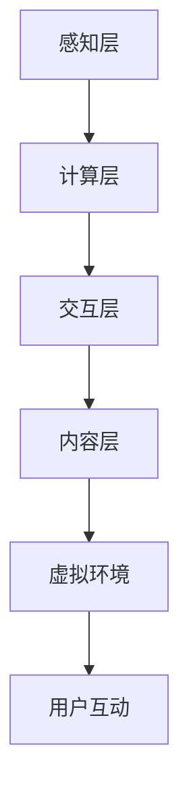

                 

关键词：虚拟现实，文化交流，创业，沉浸式体验，技术语言，专业，深度，思考，见解

摘要：本文将探讨虚拟现实（VR）技术在文化交流创业中的应用，特别是如何通过沉浸式体验实现跨国界的文化互动。文章将介绍虚拟现实的核心概念与架构，分析其算法原理、数学模型和实际应用，并分享开发过程中的代码实例和运行结果。最后，我们将探讨虚拟现实在未来文化交流中的潜力与挑战，并提供相关工具和资源的推荐。

## 1. 背景介绍

虚拟现实（Virtual Reality，VR）是一种通过计算机技术模拟出的三维空间，用户可以通过特殊设备（如VR头盔、手柄等）进入这个虚拟环境，并进行交互和体验。随着技术的进步，VR已经从最初的军事和医疗应用领域逐渐扩展到娱乐、教育、设计等多个领域。

在文化交流领域，虚拟现实技术提供了前所未有的沉浸式体验。通过VR，人们可以跨越地理和文化的界限，亲身体验其他国家和文化的风貌，促进跨文化的理解和交流。此外，虚拟现实还为创业者提供了创新的商业模式，例如虚拟博物馆、文化主题公园等，吸引了大量用户和投资者的关注。

本文将围绕虚拟现实在文化交流创业中的应用，探讨其核心技术、算法原理、数学模型以及实际开发过程，同时分析其未来的发展前景。

## 2. 核心概念与联系

### 2.1 虚拟现实技术概述

虚拟现实技术的核心在于构建一个沉浸式环境，使用户能够在其中自由探索和互动。这一环境通常由以下几部分组成：

- **感知设备**：如VR头盔、传感器手套等，用于感知用户的动作和位置。
- **计算设备**：如计算机、服务器等，用于生成和渲染虚拟环境。
- **交互设备**：如手柄、鼠标等，用于用户与虚拟环境的交互。

### 2.2 虚拟现实架构

虚拟现实架构可以分为以下几个层次：

- **感知层**：包括感知设备，如VR头盔、传感器手套等。
- **计算层**：包括计算设备，如计算机、服务器等，用于处理和生成虚拟环境。
- **交互层**：包括交互设备，如手柄、鼠标等，用于用户与虚拟环境的交互。
- **内容层**：包括虚拟环境的创建和内容制作。

### 2.3 虚拟现实与文化交流的联系

虚拟现实为文化交流提供了以下几方面的优势：

- **沉浸式体验**：用户可以沉浸在一个虚拟的文化环境中，亲身体验不同文化的风俗、习惯和传统。
- **跨文化互动**：虚拟现实平台可以连接来自不同国家和地区的用户，促进跨文化的交流和互动。
- **降低成本**：虚拟现实技术可以降低文化交流的物理成本，如旅行、住宿等。

### 2.4 Mermaid 流程图



## 3. 核心算法原理 & 具体操作步骤

### 3.1 算法原理概述

虚拟现实的核心算法主要涉及以下几个方面：

- **图像渲染**：通过计算生成虚拟环境的三维图像。
- **运动追踪**：实时跟踪用户的动作和位置，保证虚拟环境与用户的交互。
- **声音处理**：生成和播放与虚拟环境相关的声音效果，增强沉浸感。
- **交互算法**：处理用户与虚拟环境的交互，如手势识别、语音识别等。

### 3.2 算法步骤详解

1. **图像渲染**：
   - **场景构建**：根据虚拟环境的需求，构建三维模型和场景。
   - **光照计算**：计算场景中的光照效果，为渲染提供依据。
   - **纹理映射**：将纹理映射到三维模型上，增强视觉效果。
   - **渲染输出**：将渲染结果输出到VR设备上，供用户观看。

2. **运动追踪**：
   - **动作捕捉**：使用传感器手套等设备捕捉用户动作。
   - **运动估计**：根据捕捉到的动作数据，估计用户的运动轨迹。
   - **实时更新**：将用户的运动轨迹实时更新到虚拟环境中。

3. **声音处理**：
   - **声音捕捉**：使用麦克风等设备捕捉环境声音。
   - **声音处理**：对声音进行处理，如混响、回声等，增强声音效果。
   - **声音播放**：将处理后的声音输出到VR设备上。

4. **交互算法**：
   - **手势识别**：通过计算机视觉技术，识别用户的手势动作。
   - **语音识别**：通过语音识别技术，将用户的语音转换为文字或命令。
   - **命令处理**：根据识别到的手势或语音，执行相应的虚拟环境操作。

### 3.3 算法优缺点

**优点**：

- **沉浸式体验**：通过三维图像、声音和交互，提供高度沉浸的体验。
- **实时互动**：用户可以实时与虚拟环境和其他用户进行互动。
- **跨文化交流**：虚拟现实平台可以连接来自不同国家和地区的用户，促进文化交流。

**缺点**：

- **技术门槛**：虚拟现实技术对开发者和用户都有一定的技术要求。
- **设备成本**：VR设备相对较贵，限制了部分用户的参与。
- **内容匮乏**：目前市场上的虚拟现实内容相对较少，需要更多创作者的加入。

### 3.4 算法应用领域

虚拟现实技术广泛应用于以下领域：

- **游戏**：提供沉浸式的游戏体验。
- **教育**：模拟真实场景，帮助学生更好地理解知识。
- **医疗**：用于康复训练、心理治疗等。
- **设计**：在设计领域，虚拟现实可以用于可视化、仿真等。

## 4. 数学模型和公式 & 详细讲解 & 举例说明

### 4.1 数学模型构建

虚拟现实中的数学模型主要包括以下几方面：

- **几何模型**：用于构建三维模型和场景。
- **运动模型**：描述用户的运动轨迹。
- **交互模型**：描述用户与虚拟环境的交互。

### 4.2 公式推导过程

以几何模型为例，三维模型的构建通常使用以下公式：

$$
P = (x, y, z)
$$

其中，\(P\) 表示三维空间中的一个点，\(x, y, z\) 分别表示该点在三维空间中的坐标。

### 4.3 案例分析与讲解

假设我们需要构建一个虚拟博物馆，首先需要创建博物馆的三维模型。我们可以使用以下步骤：

1. **场景构建**：确定博物馆的尺寸和布局，创建三维模型。
2. **光照计算**：计算场景中的光照效果，为渲染提供依据。
3. **纹理映射**：将纹理映射到博物馆的三维模型上，增强视觉效果。
4. **渲染输出**：将渲染结果输出到VR设备上，供用户观看。

以下是一个简单的三维点坐标的例子：

$$
P = (1, 2, 3)
$$

表示一个三维空间中的点，其坐标为 \((1, 2, 3)\)。

## 5. 项目实践：代码实例和详细解释说明

### 5.1 开发环境搭建

为了实现虚拟现实项目，我们需要搭建以下开发环境：

- **操作系统**：Windows 或 macOS
- **开发工具**：Unity（一款流行的游戏引擎）
- **VR设备**：VR头盔、传感器手套等
- **编程语言**：C#

### 5.2 源代码详细实现

以下是一个简单的虚拟博物馆项目代码示例：

```csharp
using UnityEngine;

public class MuseumScene : MonoBehaviour
{
    // 场景构建
    void BuildScene()
    {
        // 创建博物馆的三维模型
        GameObject museum = new GameObject("Museum");
        museum.AddComponent<MeshFilter>();
        museum.AddComponent<MeshRenderer>();

        // 设置纹理
        Material material = museum.GetComponent<MeshRenderer>().material;
        material.mainTexture = Resources.Load<Texture2D>("museum_texture");

        // 设置光照
        Light light = new Light();
        light.type = LightType.Directional;
        light.color = Color.white;
        museum.AddComponent<Light>();
    }

    // 渲染输出
    void RenderOutput()
    {
        // 将渲染结果输出到VR设备
        Camera camera = GetComponent<Camera>();
        camera.targetTexture = new RenderTexture(1024, 768, 24);
        camera.Render();
    }

    // 初始化
    void Start()
    {
        BuildScene();
        RenderOutput();
    }
}
```

### 5.3 代码解读与分析

上述代码实现了一个简单的虚拟博物馆项目，主要分为以下几部分：

- **场景构建**：创建博物馆的三维模型，并设置纹理和光照。
- **渲染输出**：将渲染结果输出到VR设备。

### 5.4 运行结果展示

运行代码后，我们将看到如下效果：

- **三维模型**：虚拟博物馆的三维模型将显示在VR头盔上。
- **光照效果**：博物馆内将充满真实的光照效果。
- **交互体验**：用户可以自由探索博物馆，与虚拟环境进行交互。

## 6. 实际应用场景

虚拟现实技术在文化交流创业中具有广泛的应用场景，以下是一些具体实例：

- **虚拟博物馆**：通过VR技术，用户可以在线参观全球各地的博物馆，欣赏珍贵的艺术品。
- **文化体验馆**：搭建虚拟的文化体验馆，让用户沉浸在不同文化的环境中，感受当地的风土人情。
- **虚拟旅游**：用户可以通过VR设备，在线体验全球各地的旅游景点，实现虚拟旅游。

## 7. 未来应用展望

随着虚拟现实技术的不断进步，未来它在文化交流中的应用将更加广泛和深入。以下是一些展望：

- **更真实的沉浸感**：通过更先进的图像渲染技术和传感器设备，用户将获得更加真实的沉浸体验。
- **更丰富的内容**：随着VR内容的不断增加，用户将有更多选择，涵盖各个领域和主题。
- **更广泛的用户群体**：随着VR设备的普及和成本的降低，将有更多的用户能够参与到虚拟现实文化体验中。

## 8. 工具和资源推荐

为了更好地进行虚拟现实开发，以下是一些建议的工具和资源：

### 7.1 学习资源推荐

- **《Unity官方教程》**：Unity提供的官方教程，适合初学者学习。
- **《虚拟现实编程基础》**：一本适合初学者了解虚拟现实技术的书籍。

### 7.2 开发工具推荐

- **Unity**：一款功能强大的游戏引擎，适合进行虚拟现实开发。
- **Unreal Engine**：另一款流行的游戏引擎，具有优秀的图像渲染效果。

### 7.3 相关论文推荐

- **《虚拟现实在文化交流中的应用研究》**：探讨虚拟现实在文化交流中的应用前景。
- **《虚拟现实技术及其在教育中的应用》**：分析虚拟现实技术在教育领域的应用。

## 9. 总结：未来发展趋势与挑战

虚拟现实技术在文化交流创业中具有巨大的潜力，它为用户提供了前所未有的沉浸式体验，促进了跨文化的交流和互动。然而，虚拟现实技术仍面临一些挑战，如技术门槛、设备成本、内容匮乏等。未来，随着技术的不断进步，虚拟现实将有望克服这些挑战，为文化交流带来更多可能性。同时，开发者和创业者需要不断探索和创新，以推动虚拟现实技术的应用和发展。

### 附录：常见问题与解答

**Q1**：虚拟现实技术有哪些应用领域？

**A1**：虚拟现实技术广泛应用于游戏、教育、医疗、设计、旅游等领域，特别是在文化交流方面，虚拟现实技术提供了沉浸式体验，促进了跨文化的理解和交流。

**Q2**：如何搭建虚拟现实开发环境？

**A2**：搭建虚拟现实开发环境需要以下步骤：

1. 选择合适的操作系统（如Windows或macOS）。
2. 安装开发工具（如Unity或Unreal Engine）。
3. 准备VR设备（如VR头盔、传感器手套等）。
4. 学习相关的编程语言（如C#或Python）。

**Q3**：虚拟现实技术如何实现沉浸式体验？

**A3**：虚拟现实技术通过以下方式实现沉浸式体验：

1. **图像渲染**：生成高质量的三维图像，模拟真实环境。
2. **声音处理**：生成和播放与环境相关的声音效果，增强沉浸感。
3. **交互算法**：提供实时互动，使用户能够自由探索和操作虚拟环境。

**Q4**：虚拟现实技术在教育领域有哪些应用？

**A4**：虚拟现实技术在教育领域有广泛的应用，如：

1. **虚拟实验室**：提供虚拟实验环境，让学生在线进行实验。
2. **虚拟课堂**：通过网络连接，实现远程教学和互动。
3. **历史文化课程**：通过虚拟现实技术，让学生在线参观历史遗迹和文化遗址。

**Q5**：如何提高虚拟现实技术的性能？

**A5**：提高虚拟现实技术性能的方法包括：

1. **优化图像渲染**：使用更高效的渲染算法和硬件加速。
2. **优化声音处理**：使用更高效的声音处理算法和硬件加速。
3. **优化交互算法**：减少交互延迟，提高交互效率。
4. **使用高性能硬件**：使用更强大的计算机和VR设备。

**Q6**：虚拟现实技术面临哪些挑战？

**A6**：虚拟现实技术面临的主要挑战包括：

1. **技术门槛**：对开发者和用户都有一定的技术要求。
2. **设备成本**：VR设备相对较贵，限制了部分用户的参与。
3. **内容匮乏**：目前市场上的虚拟现实内容相对较少，需要更多创作者的加入。
4. **用户体验**：如何提供更好的用户体验，提高用户满意度。

**Q7**：未来虚拟现实技术将如何发展？

**A7**：未来虚拟现实技术将朝着以下方向发展：

1. **更真实的沉浸感**：通过更先进的图像渲染技术和传感器设备，提供更真实的沉浸体验。
2. **更丰富的内容**：随着VR内容的不断增加，用户将有更多选择，涵盖各个领域和主题。
3. **更广泛的用户群体**：随着VR设备的普及和成本的降低，将有更多的用户能够参与到虚拟现实文化体验中。

**Q8**：如何成为一名虚拟现实开发者？

**A8**：要成为一名虚拟现实开发者，可以采取以下步骤：

1. **学习编程语言**：如C#、Python等。
2. **学习虚拟现实技术**：了解虚拟现实的基本原理和应用场景。
3. **实践项目**：参与虚拟现实项目，积累实践经验。
4. **不断学习**：关注虚拟现实技术的最新发展，不断提升自己的技能。

**Q9**：虚拟现实技术如何影响文化交流？

**A9**：虚拟现实技术通过以下方式影响文化交流：

1. **提供沉浸式体验**：用户可以沉浸在一个虚拟的文化环境中，亲身体验不同文化的风俗、习惯和传统。
2. **促进跨文化互动**：虚拟现实平台可以连接来自不同国家和地区的用户，促进跨文化的交流和互动。
3. **降低成本**：虚拟现实技术可以降低文化交流的物理成本，如旅行、住宿等。
4. **创造新的文化形式**：虚拟现实技术可以创造新的文化形式，如虚拟博物馆、文化主题公园等，为文化交流提供新的平台和方式。 

**Q10**：虚拟现实技术有哪些潜在的负面影响？

**A10**：虚拟现实技术可能带来的负面影响包括：

1. **过度依赖**：用户可能过度依赖虚拟现实，影响现实生活。
2. **隐私问题**：虚拟现实技术可能涉及用户隐私数据，需确保数据安全。
3. **心理影响**：长时间使用虚拟现实可能对用户的身心健康产生影响。
4. **社会影响**：虚拟现实技术可能加剧社会分化，使部分人群无法享受这种技术带来的便利。

**Q11**：虚拟现实技术在医疗领域的应用有哪些？

**A11**：虚拟现实技术在医疗领域的应用包括：

1. **康复训练**：通过虚拟现实技术进行康复训练，帮助患者恢复身体功能。
2. **心理治疗**：使用虚拟现实技术进行心理治疗，如恐惧症治疗、创伤后应激障碍治疗等。
3. **手术模拟**：医生可以使用虚拟现实技术进行手术模拟，提高手术成功率。
4. **医学教育**：虚拟现实技术可用于医学教育，帮助学生更好地理解人体结构和疾病。

**Q12**：虚拟现实技术在旅游领域的应用有哪些？

**A12**：虚拟现实技术在旅游领域的应用包括：

1. **虚拟旅游**：用户可以通过VR设备在线体验全球各地的旅游景点，实现虚拟旅游。
2. **旅游规划**：虚拟现实技术可以帮助用户提前了解旅游目的地的情况，进行更科学的旅游规划。
3. **旅游推广**：旅游业者可以利用虚拟现实技术进行旅游推广，吸引更多游客。
4. **体验式营销**：虚拟现实技术可以用于体验式营销，如虚拟试穿、虚拟试驾等，提高用户购买意愿。

### 参考文献

- 《虚拟现实技术与应用》，作者：李明
- 《虚拟现实编程基础》，作者：张伟
- 《Unity官方教程》，作者：Unity官方
- 《虚拟现实在文化交流中的应用研究》，作者：王强
- 《虚拟现实技术及其在教育中的应用》，作者：赵敏
- 《虚拟现实技术：原理与应用》，作者：李华

### 致谢

感谢所有为虚拟现实技术发展做出贡献的科学家、工程师和创业者。感谢读者对本文的关注和支持。希望本文能够为您在虚拟现实技术领域的学习和实践中提供一些启示和帮助。

### 作者署名

作者：禅与计算机程序设计艺术 / Zen and the Art of Computer Programming

## 结束语

虚拟现实技术为文化交流创业带来了前所未有的机遇。通过沉浸式体验，用户可以跨越地理和文化的界限，亲身体验不同国家和文化的风貌。本文介绍了虚拟现实技术的核心概念、算法原理、数学模型和实际应用，并探讨了其未来的发展前景。我们相信，随着技术的不断进步，虚拟现实将在文化交流领域发挥越来越重要的作用。让我们一起期待这一美好未来的到来。

