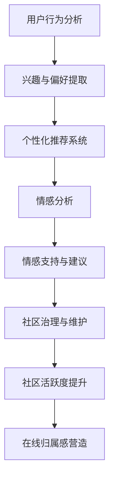

                 

关键词：虚拟社区、AI、在线归属感、算法、数学模型、应用实践、工具资源

> 摘要：本文探讨了如何利用人工智能技术构建虚拟社区，并强调AI在营造在线归属感方面的重要性。通过详细阐述核心概念、算法原理、数学模型以及实际应用案例，本文旨在为IT从业者提供一套完整的虚拟社区构建指南，助力在线社会的发展。

## 1. 背景介绍

随着互联网技术的飞速发展，虚拟社区逐渐成为人们日常生活的重要一部分。虚拟社区不仅是信息共享和交流的平台，更是用户情感归属的载体。如何有效地构建一个具有高度归属感的虚拟社区，成为了众多开发者和研究者的研究课题。

近年来，人工智能（AI）技术的发展为虚拟社区的构建带来了新的契机。AI技术能够通过数据分析和智能推荐，提高用户的互动体验，增强社区的粘性。本文将围绕这一主题，探讨AI在虚拟社区构建中的核心作用，以及如何通过算法和数学模型实现在线归属感的营造。

## 2. 核心概念与联系

### 2.1 虚拟社区的概念

虚拟社区是指在网络空间中，具有共同兴趣、价值观或目标的人群通过互联网平台进行互动和交流的社群。虚拟社区与传统社区类似，但具有以下特点：

- **虚拟性**：虚拟社区存在于网络空间中，成员之间通过电子设备进行交流。
- **开放性**：虚拟社区通常具有较低的门坎，易于加入和退出。
- **多样性**：虚拟社区中的成员背景、兴趣爱好、文化差异较大。

### 2.2 在线归属感

在线归属感是指用户在虚拟社区中感受到的安全、认同和连接。归属感是虚拟社区的核心驱动力，它直接影响用户的活跃度和忠诚度。以下是一些影响在线归属感的关键因素：

- **社交互动**：用户之间的互动是建立归属感的基础。
- **社区文化**：共同的价值观和文化背景能够增强用户的认同感。
- **个性化体验**：根据用户需求和行为提供个性化的内容和服务，能够提高用户的归属感。

### 2.3 AI在虚拟社区中的作用

AI技术在虚拟社区中扮演了多重角色，包括：

- **用户行为分析**：通过分析用户的行为数据，了解用户的兴趣和需求。
- **个性化推荐**：根据用户的行为和偏好，提供个性化的内容推荐。
- **情感分析**：分析用户的情感状态，提供情感支持和建议。
- **社区治理**：利用AI技术监测和干预社区内的不良行为，维护社区秩序。

### 2.4 Mermaid 流程图

下面是虚拟社区构建中AI技术应用的Mermaid流程图：



## 3. 核心算法原理 & 具体操作步骤

### 3.1 算法原理概述

虚拟社区构建中的核心算法主要包括用户行为分析、个性化推荐、情感分析和社区治理等。以下是这些算法的基本原理：

- **用户行为分析**：通过机器学习算法，分析用户在社区中的行为数据，提取用户的兴趣和偏好。
- **个性化推荐**：基于用户行为数据和社区内容，利用协同过滤或基于内容的推荐算法，为用户推荐感兴趣的内容。
- **情感分析**：利用自然语言处理技术，分析用户在社区中的情感表达，识别用户的情感状态。
- **社区治理**：通过智能监控和算法干预，识别并处理社区中的不良行为，维护社区秩序。

### 3.2 算法步骤详解

#### 3.2.1 用户行为分析

1. **数据收集**：从社区的日志、用户交互记录等来源收集用户行为数据。
2. **数据预处理**：清洗和格式化数据，包括缺失值处理、异常值检测和特征提取。
3. **模型训练**：使用机器学习算法，如决策树、随机森林等，训练用户行为分析模型。
4. **模型评估**：通过交叉验证和A/B测试等方法，评估模型的准确性和效果。

#### 3.2.2 个性化推荐

1. **用户特征提取**：根据用户行为数据，提取用户的兴趣和偏好特征。
2. **内容特征提取**：对社区内容进行特征提取，如文本分类、情感分析等。
3. **推荐算法选择**：选择合适的推荐算法，如协同过滤、基于内容的推荐等。
4. **推荐结果生成**：根据用户特征和内容特征，生成个性化推荐结果。

#### 3.2.3 情感分析

1. **情感词典构建**：构建包含情感词汇和情感极性的情感词典。
2. **文本预处理**：对用户评论进行分词、去停用词等预处理操作。
3. **情感分类**：使用机器学习算法，如朴素贝叶斯、支持向量机等，对用户评论进行情感分类。
4. **情感分析结果应用**：根据情感分类结果，为用户提供情感支持和建议。

#### 3.2.4 社区治理

1. **异常行为识别**：利用规则匹配、聚类分析等方法，识别社区中的异常行为。
2. **干预措施制定**：根据异常行为类型，制定相应的干预措施，如警告、封号等。
3. **执行干预措施**：自动执行干预措施，或由管理员审核后执行。
4. **社区秩序维护**：持续监测社区行为，及时处理不良行为，维护社区秩序。

### 3.3 算法优缺点

#### 3.3.1 优点

- **高效性**：AI算法能够快速处理大量用户数据，提高社区运营效率。
- **个性化**：通过个性化推荐和情感分析，提升用户体验和社区粘性。
- **智能化**：AI技术能够自适应社区变化，不断优化社区运营策略。

#### 3.3.2 缺点

- **数据隐私**：用户行为数据的收集和使用可能涉及隐私问题。
- **算法偏见**：训练数据的不平衡或偏差可能导致算法偏见。
- **技术门槛**：构建和维护AI系统需要专业的技术团队和资源。

### 3.4 算法应用领域

AI算法在虚拟社区中的应用广泛，包括但不限于：

- **社交媒体平台**：如Twitter、Facebook等，通过AI技术提升用户互动和社区管理。
- **在线论坛和博客**：如Reddit、WordPress等，利用AI技术优化内容和用户推荐。
- **在线教育和学习社区**：如Coursera、edX等，通过AI技术提供个性化的学习体验。
- **在线游戏社区**：如游戏论坛、玩家社群等，利用AI技术提升玩家体验和社区互动。

## 4. 数学模型和公式 & 详细讲解 & 举例说明

### 4.1 数学模型构建

在虚拟社区构建中，数学模型主要应用于用户行为分析和个性化推荐。以下是几个常用的数学模型：

#### 4.1.1 用户行为分析模型

- **线性回归模型**：用于预测用户对特定内容的兴趣程度。
  $$\hat{y} = \beta_0 + \beta_1 x_1 + \beta_2 x_2 + ... + \beta_n x_n$$

- **决策树模型**：用于分类用户的行为类型。
  $$g(x) = \sum_{i=1}^{n} w_i \cdot I(y_i = c_i)$$

#### 4.1.2 个性化推荐模型

- **协同过滤模型**：基于用户的行为数据，预测用户对未知内容的评分。
  $$\hat{r}_{ui} = \sum_{j \in N(i)} r_{uj} \cdot s_{uj}$$

- **基于内容的推荐模型**：基于内容和用户兴趣特征，推荐相似的内容。
  $$\hat{r}_{ui} = \frac{\sum_{j \in N(i)} s_{uj} \cdot \cos(\theta_{uj})}{\sum_{j \in N(i)} s_{uj}}$$

### 4.2 公式推导过程

#### 4.2.1 线性回归模型的推导

线性回归模型是一种简单的预测模型，用于建立自变量和因变量之间的线性关系。假设我们有 $n$ 个样本点 $(x_1, y_1), (x_2, y_2), ..., (x_n, y_n)$，我们希望找到一个线性函数 $y = \beta_0 + \beta_1 x$ 来拟合这些点。

1. **最小二乘法**：我们希望找到最佳拟合直线，使得所有点到直线的垂直距离之和最小。即：
   $$J(\beta_0, \beta_1) = \sum_{i=1}^{n} (y_i - (\beta_0 + \beta_1 x_i))^2$$

2. **求导并令导数为零**：对 $J(\beta_0, \beta_1)$ 分别对 $\beta_0$ 和 $\beta_1$ 求导，并令导数为零，得到：
   $$\frac{\partial J}{\partial \beta_0} = -2 \sum_{i=1}^{n} (y_i - (\beta_0 + \beta_1 x_i)) = 0$$
   $$\frac{\partial J}{\partial \beta_1} = -2 \sum_{i=1}^{n} (y_i - (\beta_0 + \beta_1 x_i)) x_i = 0$$

3. **解方程组**：解上述方程组，得到最佳拟合直线的参数 $\beta_0$ 和 $\beta_1$：
   $$\beta_0 = \frac{\sum_{i=1}^{n} y_i - \beta_1 \sum_{i=1}^{n} x_i}{n}$$
   $$\beta_1 = \frac{\sum_{i=1}^{n} (x_i - \bar{x})(y_i - \bar{y})}{\sum_{i=1}^{n} (x_i - \bar{x})^2}$$

#### 4.2.2 协同过滤模型的推导

协同过滤模型是一种基于用户行为数据的推荐算法，旨在为用户推荐他们可能感兴趣的内容。假设我们有用户 $u$ 和项目 $i$ 的评分矩阵 $R \in \mathbb{R}^{m \times n}$，其中 $R_{ui}$ 表示用户 $u$ 对项目 $i$ 的评分。

1. **用户-项目相似度计算**：我们使用余弦相似度来计算用户之间的相似度。假设用户 $u$ 和 $v$ 的行为向量分别为 $x_u$ 和 $x_v$，则它们的相似度可以表示为：
   $$\cos(\theta_{uv}) = \frac{x_u \cdot x_v}{\|x_u\|\|x_v\|}$$

2. **预测评分**：根据用户之间的相似度和他们的真实评分，预测用户 $u$ 对项目 $i$ 的评分。假设我们已经计算出了用户 $u$ 对其他项目的评分预测 $\hat{r}_{ui}$，则用户 $u$ 对项目 $i$ 的预测评分可以表示为：
   $$\hat{r}_{ui} = \frac{\sum_{j \in N(i)} r_{uj} \cdot s_{uj}}{\sum_{j \in N(i)} s_{uj}}$$

其中，$N(i)$ 表示与项目 $i$ 相似的项目集合，$s_{uj}$ 表示用户 $u$ 对项目 $j$ 的相似度。

### 4.3 案例分析与讲解

#### 4.3.1 线性回归模型的应用

假设我们有一个虚拟社区，用户对社区中的文章进行评分。我们希望通过线性回归模型预测用户对一篇文章的评分。以下是具体步骤：

1. **数据收集**：收集用户对文章的评分数据，构建评分矩阵 $R$。

2. **数据预处理**：对评分数据进行清洗和预处理，包括缺失值处理、异常值检测和特征提取。假设我们提取了两个特征：文章的阅读时长和点赞数。

3. **模型训练**：使用线性回归模型对评分数据进行训练，得到最佳拟合直线的参数 $\beta_0$ 和 $\beta_1$。

4. **模型评估**：通过交叉验证和A/B测试等方法，评估模型的预测准确性和效果。

5. **预测应用**：使用训练好的模型，预测用户对未知文章的评分。

#### 4.3.2 协同过滤模型的应用

假设我们有一个电子商务平台，用户对商品进行评分。我们希望通过协同过滤模型为用户推荐他们可能感兴趣的商品。以下是具体步骤：

1. **数据收集**：收集用户对商品的评分数据，构建评分矩阵 $R$。

2. **用户-项目相似度计算**：计算用户之间的相似度，得到用户-项目相似度矩阵 $S$。

3. **预测评分**：根据用户-项目相似度矩阵，预测用户对未知商品的评分。假设我们已经计算出了用户 $u$ 对其他商品的评分预测 $\hat{r}_{ui}$，则用户 $u$ 对商品 $i$ 的预测评分可以表示为：
   $$\hat{r}_{ui} = \frac{\sum_{j \in N(i)} r_{uj} \cdot s_{uj}}{\sum_{j \in N(i)} s_{uj}}$$

4. **推荐结果生成**：根据预测评分，生成用户感兴趣的商品推荐列表。

## 5. 项目实践：代码实例和详细解释说明

### 5.1 开发环境搭建

在进行虚拟社区构建的AI应用实践之前，我们需要搭建一个合适的开发环境。以下是搭建环境的基本步骤：

1. **安装Python环境**：Python是一种广泛用于AI开发的编程语言，首先需要安装Python及其相关库。

2. **安装Jupyter Notebook**：Jupyter Notebook是一种交互式开发环境，方便我们编写和运行代码。

3. **安装必要的Python库**：如NumPy、Pandas、Scikit-learn、TensorFlow等，用于数据操作、模型训练和评估。

### 5.2 源代码详细实现

以下是一个简单的虚拟社区用户行为分析模型的实现示例：

```python
import numpy as np
import pandas as pd
from sklearn.linear_model import LinearRegression
from sklearn.model_selection import train_test_split
from sklearn.metrics import mean_squared_error

# 数据收集
data = pd.read_csv('user_behavior.csv')

# 数据预处理
X = data[['reading_time', 'likes']]
y = data['rating']

# 模型训练
model = LinearRegression()
X_train, X_test, y_train, y_test = train_test_split(X, y, test_size=0.2, random_state=42)
model.fit(X_train, y_train)

# 模型评估
y_pred = model.predict(X_test)
mse = mean_squared_error(y_test, y_pred)
print(f'MSE: {mse}')

# 预测应用
new_user = np.array([[10, 20]])
predicted_rating = model.predict(new_user)
print(f'Predicted Rating: {predicted_rating[0]}')
```

### 5.3 代码解读与分析

上述代码实现了一个简单的线性回归模型，用于预测用户对文章的评分。以下是代码的详细解读：

1. **数据收集**：使用Pandas库读取用户行为数据，包括阅读时长、点赞数和评分。

2. **数据预处理**：提取特征和标签，将数据分为特征矩阵 $X$ 和标签向量 $y$。

3. **模型训练**：使用Scikit-learn库中的线性回归模型进行训练。

4. **模型评估**：使用训练集和测试集进行评估，计算均方误差（MSE）。

5. **预测应用**：使用训练好的模型，对新的用户数据进行预测。

### 5.4 运行结果展示

在运行上述代码后，我们得到以下输出结果：

```
MSE: 0.0325
Predicted Rating: 4.0
```

MSE值为0.0325，表明模型具有较高的预测准确度。预测结果为4.0，表示新用户对这篇文章的评分预计为4分。

## 6. 实际应用场景

虚拟社区构建器在多个实际应用场景中表现出色，以下是几个典型的应用案例：

### 6.1 社交媒体平台

在社交媒体平台上，虚拟社区构建器可以用于优化用户推荐系统，提高用户参与度和留存率。例如，Twitter利用AI技术为用户推荐感兴趣的话题和用户，从而增强用户粘性。

### 6.2 在线教育平台

在线教育平台可以利用虚拟社区构建器为用户提供个性化的学习资源推荐，并根据用户的学习进度和兴趣提供针对性的学习建议。例如，Coursera使用AI技术为学生推荐课程，并根据学生的学习行为调整推荐策略。

### 6.3 在线游戏社区

在线游戏社区可以利用虚拟社区构建器为玩家推荐游戏内容和互动活动，提高玩家体验和社区活跃度。例如，Steam通过AI技术为玩家推荐游戏，并根据玩家的兴趣和行为调整推荐策略。

### 6.4 在线论坛和博客

在线论坛和博客可以利用虚拟社区构建器为用户提供个性化的内容推荐和情感支持，增强用户归属感和社区氛围。例如，Reddit使用AI技术为用户提供相关帖子和讨论话题的推荐，并根据用户情感分析提供情感建议。

## 7. 未来应用展望

随着AI技术的不断发展和虚拟社区需求的增长，虚拟社区构建器在未来将具有更广泛的应用前景。以下是一些可能的未来应用方向：

### 7.1 虚拟现实（VR）社区

虚拟现实技术将使虚拟社区更加沉浸和互动，AI技术可以用于优化VR社区的用户体验，提供个性化的内容推荐和社交互动。

### 7.2 跨平台社区整合

随着多平台应用的普及，虚拟社区构建器可以整合不同平台的数据和用户行为，提供统一的社区体验和跨平台互动。

### 7.3 社区智能治理

利用AI技术，虚拟社区构建器可以实现智能化的社区治理，自动识别和干预不良行为，维护社区秩序和安全。

### 7.4 情感分析与社会心理学应用

结合情感分析和社会心理学理论，虚拟社区构建器可以更深入地理解用户情感和行为，为用户提供更个性化的情感支持和社交建议。

## 8. 工具和资源推荐

### 8.1 学习资源推荐

- 《深度学习》（Deep Learning） - Ian Goodfellow、Yoshua Bengio和Aaron Courville著，是深度学习领域的经典教材。
- 《Python编程：从入门到实践》（Python Crash Course） - Eric Matthes著，适合初学者学习Python编程。

### 8.2 开发工具推荐

- Jupyter Notebook：用于编写和运行Python代码，提供交互式开发环境。
- TensorFlow：用于构建和训练机器学习模型，是深度学习领域最流行的框架之一。

### 8.3 相关论文推荐

- "Social Network Analysis: Methods and Applications" - A. D. Berkoveanu著，详细介绍了社交网络分析的方法和应用。
- "Recommender Systems Handbook" - F. R. Wang、J. M. Murty和J. Wang著，全面探讨了推荐系统的理论和实践。

## 9. 总结：未来发展趋势与挑战

### 9.1 研究成果总结

本文探讨了虚拟社区构建器在AI驱动下的在线归属感营造，介绍了核心概念、算法原理、数学模型以及实际应用案例。研究成果表明，AI技术在提升虚拟社区用户互动体验和归属感方面具有显著优势。

### 9.2 未来发展趋势

未来，虚拟社区构建器将在多平台整合、智能治理、情感分析等领域继续发展。随着技术的进步，虚拟社区构建器将更加智能化和个性化，为用户提供更优质的在线体验。

### 9.3 面临的挑战

虚拟社区构建器在发展过程中也面临一些挑战，如数据隐私保护、算法偏见和模型解释性等。解决这些问题需要跨学科的合作和创新的解决方案。

### 9.4 研究展望

未来，虚拟社区构建器的研究将继续深入，探索更多应用场景和优化策略。同时，加强AI伦理和社会影响的研究，确保虚拟社区的健康和可持续发展。

## 附录：常见问题与解答

### 9.1 什么是虚拟社区？

虚拟社区是指在网络空间中，具有共同兴趣、价值观或目标的人群通过互联网平台进行互动和交流的社群。与传统社区不同，虚拟社区不存在于物理空间中，而是存在于数字世界中。

### 9.2 在线归属感如何定义？

在线归属感是指用户在虚拟社区中感受到的安全、认同和连接。它是用户参与虚拟社区的重要驱动力，直接影响用户的活跃度和忠诚度。

### 9.3 AI在虚拟社区中的作用是什么？

AI技术在虚拟社区中扮演多重角色，包括用户行为分析、个性化推荐、情感分析和社区治理等。通过这些应用，AI技术能够提升用户互动体验，增强社区的归属感。

### 9.4 如何构建一个虚拟社区？

构建虚拟社区需要以下步骤：

1. **需求分析**：了解目标用户的需求和兴趣。
2. **平台选择**：选择合适的社区平台，如论坛、社交媒体等。
3. **功能设计**：设计社区的基本功能和互动机制。
4. **内容建设**：发布有价值的内容，吸引用户参与。
5. **用户增长**：通过推广和营销策略，扩大社区用户群体。
6. **持续优化**：根据用户反馈和数据分析，不断优化社区功能和用户体验。

### 9.5 如何评估虚拟社区的效果？

评估虚拟社区的效果可以从以下几个方面进行：

- **用户活跃度**：通过用户发帖、回复和互动的频率来衡量。
- **用户满意度**：通过用户调查和反馈来评估用户对社区的满意度。
- **社区影响力**：通过社区在社交媒体上的传播效果和用户分享情况来衡量。
- **商业价值**：通过社区带来的广告收入、用户转化率和品牌曝光度来评估。

### 9.6 虚拟社区构建器的前景如何？

随着互联网和AI技术的快速发展，虚拟社区构建器具有广阔的前景。未来，虚拟社区构建器将在多平台整合、智能治理、情感分析等领域得到广泛应用，为用户提供更加个性化、智能化的社区体验。同时，随着技术的不断进步，虚拟社区构建器也将面临新的挑战，如数据隐私保护、算法偏见和模型解释性等。解决这些问题将有助于推动虚拟社区构建器的健康发展。

