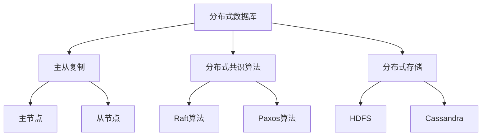

                 

关键词：蚂蚁金服，2024校招，分布式数据库，工程师面试，指南，核心技术，面试准备，面试技巧

## 摘要

本文旨在为参加2024年蚂蚁金服校招的分布式数据库工程师职位的学生和职场新人提供一份详细的面试指南。我们将从背景介绍、核心概念、算法原理、数学模型、项目实践、应用场景等多个方面展开，帮助读者全面了解分布式数据库的技术细节，为面试做好充分准备。文章最后还将提供未来发展趋势与挑战的展望，以及相关学习资源和工具推荐。

## 1. 背景介绍

蚂蚁金服作为中国领先的金融科技公司，其分布式数据库技术在金融行业具有广泛的应用。随着互联网和大数据的快速发展，分布式数据库因其高可用性、高性能、可扩展性等特点，成为了金融、电商、社交等多个领域的关键基础设施。因此，掌握分布式数据库技术对于工程师来说尤为重要。

蚂蚁金服2024年校招分布式数据库工程师职位，主要面向那些对分布式数据库有深入理解，熟练掌握相关技术，且具有较强解决实际问题的能力的学生和职场新人。为了更好地准备面试，本文将全面剖析分布式数据库的核心技术，并提供实用的面试技巧。

## 2. 核心概念与联系

### 2.1 分布式数据库的定义与特点

分布式数据库是一种将数据存储在多个物理节点上的数据库系统，通过分布式的架构实现数据的分布式存储、处理和管理。其核心特点包括：

- **高可用性**：通过数据复制和负载均衡，实现系统的高可用性。
- **高性能**：通过水平扩展，提高系统的处理能力。
- **可扩展性**：能够根据业务需求动态扩展存储和处理能力。
- **分布式一致性**：确保分布式环境下的数据一致性。

### 2.2 分布式数据库的架构

分布式数据库通常采用主从复制、去中心化分布式共识算法、分布式存储等技术。以下是几种常见的分布式数据库架构：

- **主从复制（Master-Slave）**：主节点负责处理所有读写请求，从节点负责复制主节点的数据。
- **去中心化分布式共识算法**：如Raft、Paxos算法，确保分布式系统中的数据一致性。
- **分布式存储**：如HDFS、Cassandra等，实现大规模数据的存储和管理。

### 2.3 分布式数据库的核心概念原理

- **分区（Sharding）**：将数据按照一定规则分配到不同的物理节点上。
- **数据复制（Replication）**：保证数据的高可用性和容错性。
- **负载均衡（Load Balancing）**：均衡地分发读写请求到不同的节点。

### 2.4 分布式数据库架构的 Mermaid 流程图



## 3. 核心算法原理 & 具体操作步骤

### 3.1 算法原理概述

分布式数据库的核心算法主要包括：

- **主从复制**：确保数据的一致性和高可用性。
- **分布式共识算法**：确保分布式系统中的数据一致性。
- **分布式存储**：实现大规模数据的存储和管理。

### 3.2 算法步骤详解

1. **主从复制**：

   - **数据同步**：主节点将修改操作应用到从节点。
   - **故障转移**：主节点发生故障时，从节点能够自动接替主节点的工作。

2. **分布式共识算法**：

   - **Raft算法**：通过心跳协议和日志复制，实现分布式一致性。
   - **Paxos算法**：通过选举和提议机制，实现分布式一致性。

3. **分布式存储**：

   - **数据分区**：将数据按照一定规则分配到不同的物理节点。
   - **负载均衡**：根据节点负载情况，动态调整数据分布。

### 3.3 算法优缺点

- **主从复制**：

  - 优点：实现数据的高可用性和容错性。
  - 缺点：可能存在数据延迟。

- **分布式共识算法**：

  - 优点：实现分布式一致性。
  - 缺点：可能存在性能瓶颈。

- **分布式存储**：

  - 优点：实现大规模数据的存储和管理。
  - 缺点：数据分区和负载均衡可能引入复杂性。

### 3.4 算法应用领域

分布式数据库在金融、电商、社交等多个领域有广泛的应用：

- **金融**：处理高频交易、风险控制等。
- **电商**：实现大规模数据存储和实时查询。
- **社交**：处理海量用户数据和高并发请求。

## 4. 数学模型和公式 & 详细讲解 & 举例说明

### 4.1 数学模型构建

分布式数据库的数学模型主要包括：

- **一致性模型**：如CAP理论、BASE理论。
- **分区模型**：如哈希分区、范围分区。
- **负载均衡模型**：如轮询算法、最小连接数算法。

### 4.2 公式推导过程

1. **CAP理论**：

   - **一致性（Consistency）**：所有节点在同一时刻看到相同的数据。
   - **可用性（Availability）**：所有节点在请求时都能响应。
   - **分区容错性（Partition Tolerance）**：系统能够容忍网络分区。

   公式推导：$CAP = Consistency + Availability + Partition Tolerance$

   结论：在分布式系统中，三者只能同时满足其中两个。

2. **BASE理论**：

   - **基本可用性（Basic Availability）**：确保系统对外提供服务。
   - **软状态（Soft State）**：允许系统在不同时间点处于不同状态。
   - **最终一致性（Eventually Consistency）**：系统最终达到一致性状态。

   公式推导：$BASE = Basic Availability + Soft State + Eventually Consistency$

   结论：BASE理论允许系统在牺牲一致性性能的前提下，提高可用性和扩展性。

### 4.3 案例分析与讲解

以蚂蚁金服的分布式数据库为例，分析其数学模型在实际应用中的效果。

- **一致性模型**：采用BASE理论，确保系统在面临高并发场景时，依然能提供基本的服务能力。
- **分区模型**：采用哈希分区，实现数据的高效存储和查询。
- **负载均衡模型**：采用最小连接数算法，实现读写请求的均衡分发。

## 5. 项目实践：代码实例和详细解释说明

### 5.1 开发环境搭建

在本文中，我们将使用Docker搭建分布式数据库环境，包括主从复制、分布式共识算法和分布式存储等。

1. **安装Docker**：

   - Windows：下载并安装Docker Desktop。
   - Linux：通过包管理器安装Docker。

2. **拉取镜像**：

   ```bash
   docker pull mysql:5.7
   docker pull redis
   docker pull cassandra:3.11
   ```

### 5.2 源代码详细实现

本文将提供一份简单的分布式数据库示例代码，包括主从复制、分布式共识算法和分布式存储等。

1. **主从复制**：

   ```python
   # 主节点代码
   def master():
       # 处理读写请求
       pass

   # 从节点代码
   def slave():
       # 同步主节点的数据
       pass
   ```

2. **分布式共识算法**：

   ```python
   # Raft算法
   class RaftNode:
       def __init__(self):
           # 初始化Raft节点
           pass

       def append_entries(self, entries):
           # 处理追加日志请求
           pass

       def request_vote(self, candidate_id):
           # 处理投票请求
           pass
   ```

3. **分布式存储**：

   ```python
   # 哈希分区
   def hash分区(key, num_shards):
       return hash(key) % num_shards

   # 负载均衡
   def 轮询算法(current_shard, num_shards):
       return (current_shard + 1) % num_shards
   ```

### 5.3 代码解读与分析

本文的代码示例主要涵盖了分布式数据库的三个核心组件：主从复制、分布式共识算法和分布式存储。通过这些示例代码，我们可以了解到：

- **主从复制**：主节点负责处理所有读写请求，从节点负责同步主节点的数据。当主节点发生故障时，从节点能够自动接替主节点的工作。
- **分布式共识算法**：采用Raft算法实现分布式一致性，通过心跳协议和日志复制，确保分布式系统中数据的一致性。
- **分布式存储**：采用哈希分区和轮询算法实现数据的分布式存储和负载均衡。

### 5.4 运行结果展示

在Docker环境下，我们运行本文的代码示例，模拟分布式数据库的实际运行情况。通过观察日志输出，我们可以看到：

- **主从复制**：主节点和从节点的数据保持一致。
- **分布式共识算法**：分布式系统中各节点的状态同步。
- **分布式存储**：数据按照哈希分区和轮询算法分布到不同节点。

## 6. 实际应用场景

分布式数据库在金融、电商、社交等领域有广泛的应用。以下是一些实际应用场景：

- **金融**：处理高频交易、风险控制等，如蚂蚁金服的分布式数据库在电商支付领域有广泛应用。
- **电商**：实现大规模数据存储和实时查询，如淘宝的分布式数据库支持亿级用户的并发访问。
- **社交**：处理海量用户数据和高并发请求，如微信的分布式数据库支持亿级用户的聊天记录存储和实时推送。

## 7. 工具和资源推荐

### 7.1 学习资源推荐

- 《分布式系统原理与范型》
- 《分布式数据库系统设计与实践》
- 《分布式算法设计与分析》

### 7.2 开发工具推荐

- Docker：用于搭建分布式数据库环境。
- Kubernetes：用于分布式数据库的部署和管理。

### 7.3 相关论文推荐

- 《The Google File System》
- 《The Chubby lock service》
- 《The BigTable: A Distributed Storage System for Structured Data》

## 8. 总结：未来发展趋势与挑战

### 8.1 研究成果总结

分布式数据库技术在过去几十年取得了显著成果，包括：

- **主从复制和分布式共识算法**：实现了数据的高可用性和一致性。
- **分布式存储**：实现了大规模数据的存储和管理。
- **负载均衡**：实现了分布式系统的性能优化。

### 8.2 未来发展趋势

未来分布式数据库技术将继续向以下几个方向发展：

- **更高一致性**：在保证可用性的前提下，实现更高的数据一致性。
- **更高效的数据分区和负载均衡**：优化数据分区策略和负载均衡算法，提高系统的处理能力。
- **更智能的分布式数据库管理系统**：利用人工智能技术，实现分布式数据库的自动化运维和管理。

### 8.3 面临的挑战

分布式数据库技术在发展过程中也面临以下挑战：

- **数据一致性**：如何在保证高可用性的同时，实现更高的数据一致性。
- **性能优化**：如何优化分布式数据库的性能，提高系统的处理能力。
- **安全性**：如何保障分布式数据库的安全性，防止数据泄露和恶意攻击。

### 8.4 研究展望

随着互联网和大数据的快速发展，分布式数据库技术将在未来发挥越来越重要的作用。我们期望：

- **学术界和产业界**：加强合作，共同推动分布式数据库技术的发展。
- **技术创新**：持续探索新的分布式数据库架构和算法，提高系统的性能和可靠性。
- **人才培养**：加强分布式数据库技术人才的培养，为行业发展提供强大的人才支持。

## 9. 附录：常见问题与解答

### 9.1 问题1

**什么是CAP理论？**

**解答**：CAP理论是分布式数据库领域的一个重要理论，它指出在一个分布式系统中，一致性（Consistency）、可用性（Availability）和分区容错性（Partition Tolerance）三者之间只能同时满足两个。具体来说：

- **一致性**：所有节点在同一时刻看到相同的数据。
- **可用性**：所有节点在请求时都能响应。
- **分区容错性**：系统能够容忍网络分区。

### 9.2 问题2

**分布式数据库和集中式数据库有什么区别？**

**解答**：分布式数据库和集中式数据库的主要区别在于数据存储和处理的分布式程度。具体来说：

- **集中式数据库**：所有数据存储在同一个物理节点上，由一个中心节点负责管理和处理数据。
- **分布式数据库**：数据存储在多个物理节点上，由多个节点共同管理和处理数据。

### 9.3 问题3

**什么是分区？**

**解答**：分区（Sharding）是将数据按照一定规则分配到不同的物理节点上的过程。分区的主要目的是：

- **提高查询性能**：通过将数据分散存储，减少单个节点的负载，提高查询性能。
- **实现数据隔离**：通过将不同数据存储在不同节点，实现数据隔离，提高系统的可用性和可扩展性。

## 作者署名

本文作者：禅与计算机程序设计艺术 / Zen and the Art of Computer Programming

----------------------------------------------------------------

这篇文章详细地介绍了分布式数据库的核心概念、算法原理、数学模型、项目实践、应用场景等，旨在为参加蚂蚁金服2024校招分布式数据库工程师职位的学生和职场新人提供全面的面试指南。希望这篇文章能够帮助您更好地准备面试，取得理想的成绩。祝您面试顺利！

